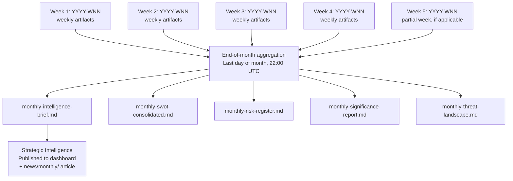

<p align="center">
  
</p>

<h1 align="center">📅 Monthly Analysis Directory</h1>

<p align="center">
  <strong>📊 Monthly Strategic Intelligence Briefs for Swedish Parliamentary Monitoring</strong><br>
  <em>🎯 YYYY-MM naming · Strategic intelligence · Long-term pattern analysis</em>
</p>

<p align="center">
  <a href="#"></a>
  <a href="#"></a>
  <a href="#"></a>
  <a href="#"></a>
</p>

**📋 Document Owner:** CEO | **📄 Version:** 1.0 | **📅 Last Updated:** 2026-03-26 (UTC)  
**🏢 Owner:** Hack23 AB (Org.nr 5595347807) | **🏷️ Classification:** Public

---

## 🎯 Purpose

The `analysis/monthly/` directory stores monthly strategic intelligence briefs. Produced at end-of-month by the aggregation pipeline, these briefs represent the **highest-level analytical synthesis** in the Riksdagsmonitor analysis hierarchy — aggregating all weekly analyses into strategic intelligence assessments with a 30-day horizon.

Monthly briefs serve three purposes:
1. **Strategic intelligence**: Month-over-month pattern analysis for Swedish political dynamics
2. **Archive anchor**: Provide the canonical record for historical periods as daily/weekly files age out
3. **Trend baseline**: Establish baselines against which future months are compared

---

## 📅 Naming Convention

```
analysis/monthly/
├── YYYY-MM/              ← ISO 8601 year-month (always zero-padded)
│   ├── monthly-intelligence-brief.md
│   ├── monthly-swot-consolidated.md
│   ├── monthly-risk-register.md
│   ├── monthly-significance-report.md
│   └── monthly-threat-landscape.md
```

**Rules:**
- Always use `YYYY-MM` — never `MM-YYYY`, `YYYY-MMM`, or named months in directory names
- Zero-pad the month: `2026-03` not `2026-3`
- One directory per calendar month, always
- Never split a month across two directories

**Examples:**
```
2026-01/    ← January 2026
2026-03/    ← March 2026
2026-12/    ← December 2026
```

---

## 📁 Files Created Per Month

All monthly files are created by the end-of-month aggregation pipeline (runs on the last calendar day of each month at 22:00 UTC):

| File | Format | Purpose | Source Data |
|------|--------|---------|-------------|
| `monthly-intelligence-brief.md` | Markdown | Executive-level strategic analysis; top 5 political developments; coalition health; outlook | All weekly `week-summary-swot.md` + `week-ahead-risk-register.md` |
| `monthly-swot-consolidated.md` | Markdown | Full SWOT synthesis for the month; all quadrants with confidence decay applied | All weekly `week-summary-swot.md` files; expired entries removed |
| `monthly-risk-register.md` | Markdown | Complete risk register for the month; risk trajectories (rising/stable/falling) | All weekly `week-ahead-risk-register.md` files with trend analysis |
| `monthly-significance-report.md` | Markdown | Top 10 most significant political events of the month; significance score time series | All daily `morning-significance-scores.json` files for the month |
| `monthly-threat-landscape.md` | Markdown | Consolidated STRIDE-categorised threat inventory for the month | All weekly `evening-threat-snapshot.md` files |

---

## 📊 How Monthly Files Aggregate Weekly Analyses



### Aggregation Rules

- **Intelligence brief**: Synthesises the 5 highest-impact political developments of the month, written at Intelligence Analysis depth (Level 3) with explicit probability notation
- **SWOT consolidation**: All weekly SWOT entries merged; entries that received HIGH confidence in 3+ weekly assessments are promoted to HIGH monthly confidence; expired entries (>30 days from last update) are removed
- **Risk register**: Tracks risk ID continuity across weeks; assigns trend arrows (📈 rising / ➡️ stable / 📉 falling); risk IDs that appear for 4+ consecutive weeks become "persistent risks"
- **Significance report**: Ranks all events by composite significance score; identifies the month's "defining event" (highest scorer); tracks which events generated published articles
- **Threat landscape**: Groups threats by STRIDE category; identifies new threat actors; tracks resolved vs. ongoing threats

---

## 🧭 Strategic Intelligence Briefs

Monthly strategic intelligence briefs are the analytical capstone of the Riksdagsmonitor analysis pipeline. They are written at **Intelligence Analysis depth (Level 3)** as defined in [methodologies/political-style-guide.md](../methodologies/political-style-guide.md):

- Forward-looking assessments with explicit probability notation
- Scenario modelling for the following month
- Coalition stability trend assessment
- Policy implementation risk forecast
- Electoral positioning update (if within 18 months of next general election)

**Target audiences:**
- Political journalists seeking month-in-review context
- Policy researchers tracking legislative trends
- International observers monitoring Swedish political dynamics
- Future AI agents using historical context for current analysis

---

## 🗑️ Retention Policy

| Age | Status | Retention Action |
|-----|--------|-----------------|
| 0–6 months | **Active** | Full git history; all files present and regularly referenced |
| 7–12 months | **Recent** | Retained as primary historical reference; daily/weekly may be archived |
| 13–24 months | **Historical** | Retained; used for year-over-year comparison |
| 25+ months | **Long-term archive** | Git LFS or external archive; summarised in annual intelligence review |

**Note:** Monthly files are the most durable analysis artifacts in the hierarchy. They should be retained significantly longer than daily or weekly files, as they represent the consolidated strategic intelligence record.

---

**Document Control:**  
- **Path:** `/analysis/monthly/README.md`  
- **Classification:** Public  
- **Next Review:** 2026-06-26
