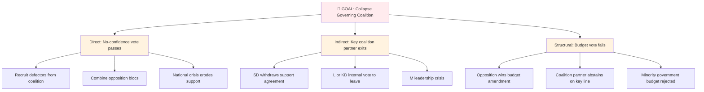
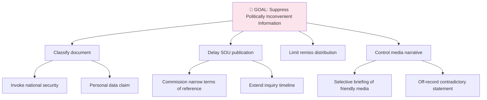

  

<h1 align="center">🎭 ISMS Threat Modeling → Political Threat Adaptation</h1>

  <strong>📊 Mapping STRIDE & ATT&CK to Democratic Process Threat Analysis</strong> 
  <em>🎯 STRIDE · MITRE ATT&CK · Attack Trees · Threat Agents → Political Threats</em>

  
  
  
  

**📋 Document Owner:** CEO | **📄 Version:** 1.0 | **📅 Last Updated:** 2026-03-26 (UTC)  
**🔄 Review Cycle:** Quarterly | **⏰ Next Review:** 2026-06-26  
**🏢 Owner:** Hack23 AB (Org.nr 5595347807) | **🏷️ Classification:** Public

---

> **⚠️ HISTORICAL REFERENCE ONLY:** This document records the original adaptation from ISMS frameworks. The active methodology has moved to the **Political Threat Taxonomy** (v3.0) which replaces STRIDE categories with politically-native threat categories. See [political-threat-framework.md](../methodologies/political-threat-framework.md) for the current framework.

## 🎯 Purpose

This reference document maps [Hack23 ISMS Threat_Modeling.md](https://github.com/Hack23/ISMS-PUBLIC/blob/main/Threat_Modeling.md) frameworks — STRIDE, MITRE ATT&CK, Attack Trees, and Threat Agents — to Riksdagsmonitor's political threat analysis methodology. The adaptation enables systematic, framework-consistent political threat analysis using the same analytical rigour applied to cybersecurity threats.

---

## 🎭 STRIDE Categories → Political Threats

The ISMS implements STRIDE as a per-element threat categorisation for IT systems. The political adaptation applies STRIDE to the **democratic process as the "system"** being threatened:

| STRIDE Category | Cybersecurity Threat | Political Threat | Political Example |
|:--------------:|---------------------|:----------------:|------------------|
| **S — Spoofing** | Attacker impersonates legitimate user/system | 🎭 **Disinformation** | False attribution of policy positions; fabricated quotes; misrepresented voting records |
| **T — Tampering** | Attacker modifies data or code | 📝 **Policy Corruption** | Undisclosed lobbying alters legislation text; regulatory capture distorts implementation |
| **R — Repudiation** | Actor denies performing action | 🚫 **Accountability Evasion** | Politician contradicts their Riksdag voting record; government denies prior commitment |
| **I — Information Disclosure** | Unauthorised data exposure | 🔇 **Transparency Failure** | Government suppresses SOU findings; classification of politically inconvenient information |
| **D — Denial of Service** | Service made unavailable | ⛔ **Democratic Obstruction** | Filibustering; quorum obstruction; committee paralysis; budget stonewalling |
| **E — Elevation of Privilege** | Unauthorised access to higher permissions | 👑 **Power Concentration** | Government bypasses Riksdag via decree; minister exceeds legal authority; coalition partner demands policy veto |

### Adaptation Rationale

The STRIDE framework was designed for computer systems where each element has defined **trust boundaries**. In the political context:

- The **democratic system** is the "asset" being protected
- **Constitutional norms** are the equivalent of "access controls"
- **Parliamentary procedure** is the equivalent of "protocol"
- **KU granskning** is the equivalent of "audit logging and review"

The key insight: just as STRIDE identifies ways actors bypass security controls, political STRIDE identifies ways actors bypass **democratic accountability controls**.

---

## 🎖️ MITRE ATT&CK → Political Actor Tactics

The ISMS maps MITRE ATT&CK techniques to cybersecurity attack patterns. The political adaptation maps ATT&CK tactics to **political actor behaviour patterns**:

| ATT&CK Tactic | Cybersecurity Meaning | Political Actor Tactic | Observable Signal |
|:-------------:|----------------------|:----------------------:|------------------|
| **Initial Access** | Gain first foothold | Coalition entry negotiation | Cooperation agreement signed |
| **Execution** | Run malicious code | Legislation enacted | Riksdag vote passes |
| **Persistence** | Maintain foothold | Coalition maintenance | Repeated budget agreement renewals |
| **Privilege Escalation** | Gain higher access | Government power expansion | Ministerial decree usage rate |
| **Defense Evasion** | Avoid detection | Accountability evasion | KU investigation delays; classified documents |
| **Collection** | Gather information | Opposition intelligence gathering | Interpellationer volume + topic analysis |
| **Command and Control** | Maintain attack infrastructure | Party discipline enforcement | Whipping patterns in voteringar |
| **Exfiltration** | Remove data from target | Policy reversal | Government abandons campaign commitment |
| **Impact** | Disrupt/destroy | Democratic disruption | Coalition collapse, constitutional crisis |

---

## 🌳 Attack Trees → Democratic Process Threat Trees

The ISMS uses attack trees to model how goals are achieved through combinations of actions. Political attack trees model how democratic process goals can be undermined:

### Attack Tree: Coalition Destabilisation

### Attack Tree: Transparency Suppression

---

## 👥 Threat Agents → Political Actors

The ISMS classifies threat agents by motivation and capability. The political adaptation classifies **political actors** using the same framework:

| ISMS Threat Agent Type | ISMS Characteristics | Political Actor | Political Characteristics |
|:---------------------:|---------------------|:---------------:|--------------------------|
| **External attacker** | High motivation, external to org, variable capability | Foreign state actor | High motivation (destabilisation), external to Sweden, high capability (Russia, China) |
| **Insider threat** | Internal access, variable motivation | Coalition partner acting against coalition interest | Internal access to government, variable motivation (policy vs. power) |
| **Script kiddie** | Low capability, opportunistic | Fringe political actor | Low influence, opportunistic media disruption |
| **Nation-state** | High capability, strategic motivation | EU Commission / NATO | High institutional capability, treaty-based motivation |
| **Organised crime** | Financial motivation, sophisticated | Lobby/industry capture | Financial motivation, sophisticated policy access |
| **Competitor** | Business motivation, targeted | Opposition party | Electoral motivation, targeted coalition exploitation |

---

## 🔗 Related Documents

- [methodologies/political-threat-framework.md](../methodologies/political-threat-framework.md) — Full threat framework
- [templates/threat-analysis.md](../templates/threat-analysis.md) — Threat analysis template
- [THREAT_MODEL.md](../../THREAT_MODEL.md) — Platform-level threat model
- [FUTURE_THREAT_MODEL.md](../../FUTURE_THREAT_MODEL.md) — Future threat roadmap

---

**Document Control:**  
- **Path:** `/analysis/reference/isms-threat-modeling-adaptation.md`  
- **Source ISMS Doc:** [Threat_Modeling.md](https://github.com/Hack23/ISMS-PUBLIC/blob/main/Threat_Modeling.md)  
- **Classification:** Public  
- **Next Review:** 2026-06-26
