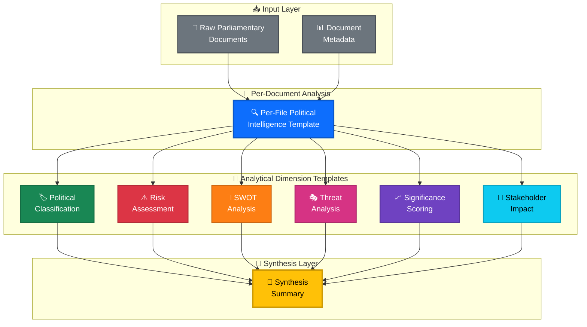
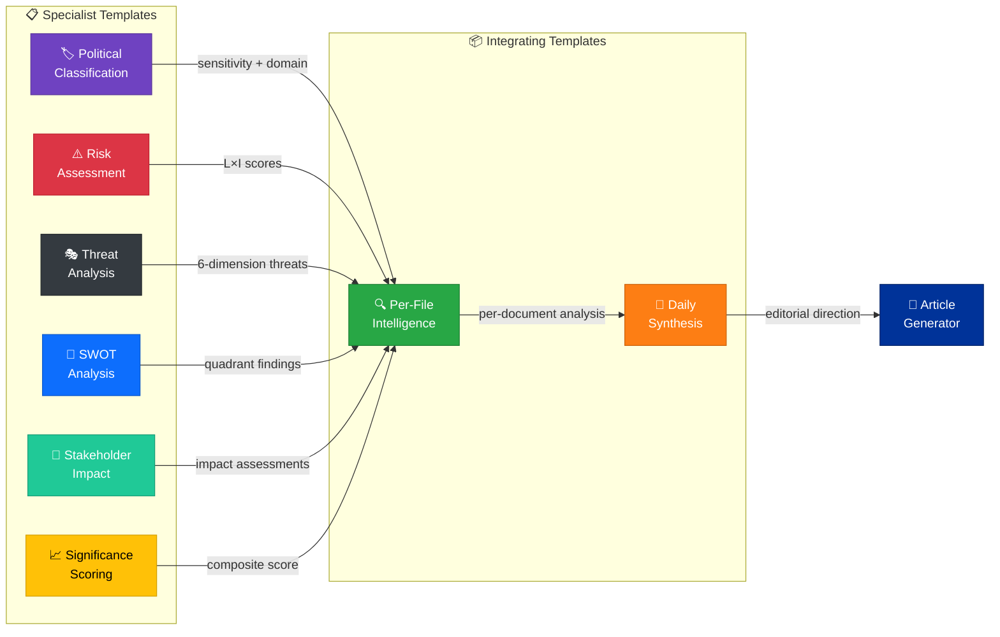
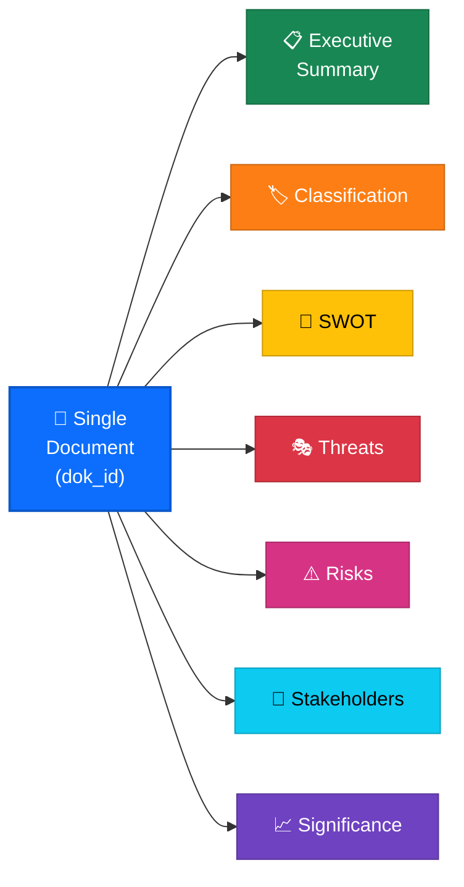
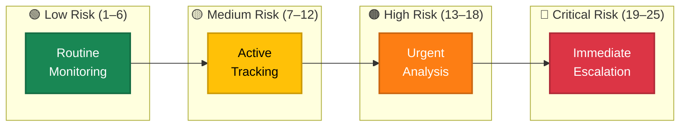
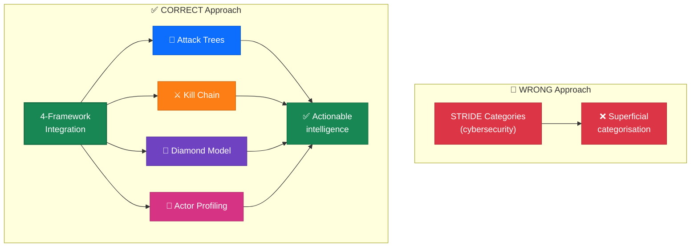
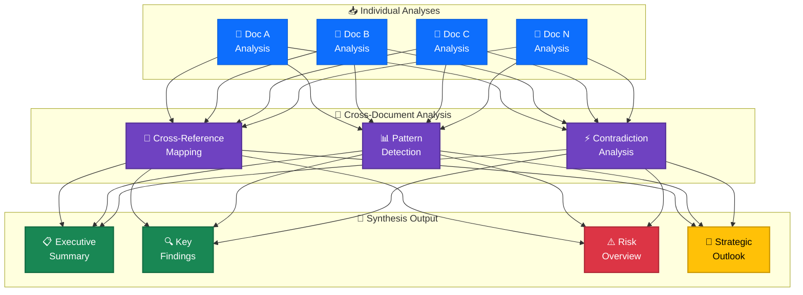
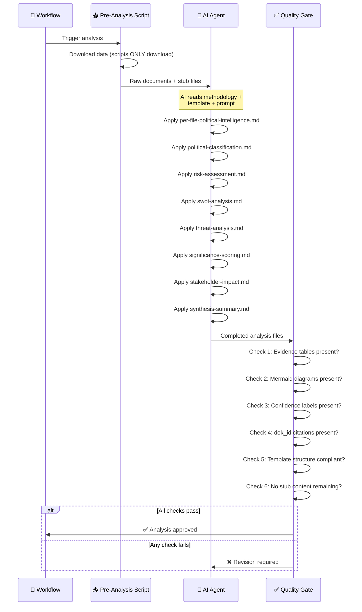
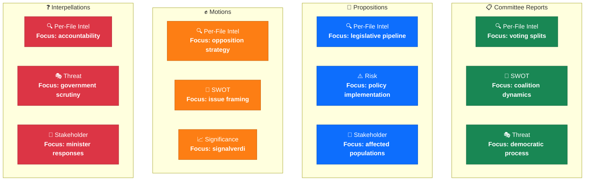
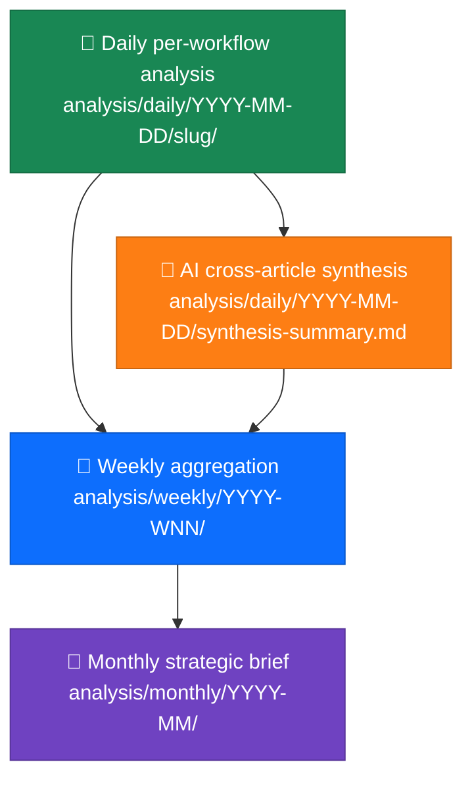

  

<h1 align="center">📋 Analysis Templates — Political Intelligence Output Standards</h1>

  <strong>📊 Structured Templates for Consistent, High-Quality Political Intelligence</strong> 
  <em>🎯 Evidence-Based · Mermaid-Rich · Confidence-Labeled · ISMS-Compliant</em>

  
  
  
  

**📋 Document Owner:** CEO | **📄 Version:** 4.0 | **📅 Last Updated:** 2026-03-31 (UTC)  
**🔄 Review Cycle:** Quarterly | **⏰ Next Review:** 2026-06-30  
**🏢 Owner:** Hack23 AB (Org.nr 5595347807) | **🏷️ Classification:** Public

---

## 📚 Architecture Documentation Map

| Document | Focus | Description | Documentation Link |
| --- | --- | --- | --- |
| **[Architecture](../../ARCHITECTURE.md)** | 🏛️ Architecture | C4 model showing current system structure | [View Source](https://github.com/Hack23/riksdagsmonitor/blob/main/ARCHITECTURE.md) |
| **[Security Architecture](../../SECURITY_ARCHITECTURE.md)** | 🛡️ Security | Security controls and compliance mapping | [View Source](https://github.com/Hack23/riksdagsmonitor/blob/main/SECURITY_ARCHITECTURE.md) |
| **[Workflows](../../WORKFLOWS.md)** | ⚙️ DevOps | CI/CD pipeline documentation | [View Source](https://github.com/Hack23/riksdagsmonitor/blob/main/WORKFLOWS.md) |
| **[Analysis Directory](../README.md)** | 🔬 Analysis | Analysis directory overview and structure | [View Source](https://github.com/Hack23/riksdagsmonitor/blob/main/analysis/README.md) |
| **[AI Analysis Guide](../methodologies/ai-driven-analysis-guide.md)** | 🤖 Methodology | Per-file analysis protocol and quality gates | [View Source](https://github.com/Hack23/riksdagsmonitor/blob/main/analysis/methodologies/ai-driven-analysis-guide.md) |
| **[Threat Framework](../methodologies/political-threat-framework.md)** | 🎭 Methodology | Political Threat Taxonomy (6 dimensions) | [View Source](https://github.com/Hack23/riksdagsmonitor/blob/main/analysis/methodologies/political-threat-framework.md) |
| **[Risk Methodology](../methodologies/political-risk-methodology.md)** | ⚠️ Methodology | Likelihood × Impact scoring for Riksdag events | [View Source](https://github.com/Hack23/riksdagsmonitor/blob/main/analysis/methodologies/political-risk-methodology.md) |
| **[SWOT Framework](../methodologies/political-swot-framework.md)** | 💼 Methodology | Evidence-based political SWOT quadrants | [View Source](https://github.com/Hack23/riksdagsmonitor/blob/main/analysis/methodologies/political-swot-framework.md) |
| **[Classification Guide](../methodologies/political-classification-guide.md)** | 🏷️ Methodology | 7-dimension political event classification | [View Source](https://github.com/Hack23/riksdagsmonitor/blob/main/analysis/methodologies/political-classification-guide.md) |
| **[Style Guide](../methodologies/political-style-guide.md)** | ✍️ Methodology | Editorial and analytical style standards | [View Source](https://github.com/Hack23/riksdagsmonitor/blob/main/analysis/methodologies/political-style-guide.md) |

---

## 🔐 ISMS Policy Alignment

These analysis templates implement structured intelligence production mandated by Hack23 AB's ISMS framework:

| **ISMS Policy** | **Template Implementation** |
| --- | --- |
| [🛠️ Secure Development Policy](https://github.com/Hack23/ISMS-PUBLIC/blob/main/Secure_Development_Policy.md) | Structured templates enforce consistent analytical output; anti-pattern warnings prevent quality degradation |
| [📝 Change Management](https://github.com/Hack23/ISMS-PUBLIC/blob/main/Change_Management.md) | Template versioning, quarterly review cycle, document metadata tracking |
| [🔐 Information Security Policy](https://github.com/Hack23/ISMS-PUBLIC/blob/main/Information_Security_Policy.md) | Classification levels (PUBLIC/SENSITIVE/RESTRICTED) in every analysis output |
| [🔓 Open Source Policy](https://github.com/Hack23/ISMS-PUBLIC/blob/main/Open_Source_Policy.md) | SPDX license headers, REUSE compliance, transparent methodology documentation |
| [🔍 Vulnerability Management](https://github.com/Hack23/ISMS-PUBLIC/blob/main/Vulnerability_Management.md) | Threat analysis template identifies political risks; risk assessment quantifies exposure |

### Compliance Framework Mapping

| **Framework** | **Version** | **Relevant Controls** | **Template Implementation** |
| --- | --- | --- | --- |
| **ISO 27001** | 2022 | A.5.10, A.8.3 | Information classification via political-classification template |
| **NIST CSF** | 2.0 | ID.RA, ID.RM | Risk identification and management via risk-assessment template |
| **CIS Controls** | v8.1 | 17.1 | Threat intelligence production via threat-analysis template |
| **EU CRA** | 2024 | Art. 10, Art. 11 | Transparency and vulnerability disclosure via stakeholder-impact template |

---

## 🎯 Purpose

This directory contains **8 structured analysis templates** that define the exact output format for every political intelligence artifact produced by Riksdagsmonitor's AI agents. Templates ensure consistency, completeness, and quality across all analysis types — from per-file document intelligence to full synthesis summaries.

> **Critical Rule:** AI agents MUST follow these templates. Templates define structure and required sections — the AI fills them with genuine, evidence-based analysis. Templates must NEVER be copied verbatim with placeholder text.

Templates are **not** standalone outputs. They form a **composable intelligence pipeline** — individual templates feed into the daily synthesis, which aggregates into weekly and monthly intelligence reports. The per-file analysis template is the most frequently used: every downloaded Riksdag MCP data file receives a comprehensive analysis using this template.

**Critical mandates:**

- 🔍 AI agents must **READ actual Riksdag data** and produce original analysis — never scripted boilerplate
- 📎 Every claim requires an **evidence citation** (dok_id, vote record, or MCP data file path)
- 📊 All outputs require **structured tables + colour-coded Mermaid diagrams** — plain prose alone is rejected
- 🎯 Every analysis must pass a **minimum 7.0/10 quality gate** before consumption by article generators

---

## 📐 Template Architecture

---

## 🗺️ Template Interconnection Map

All eight templates form an integrated intelligence network. The per-file analysis template consumes outputs from the six specialist templates, and the synthesis template aggregates all per-file analyses:

---

## 📑 Master Template Catalog

| # | Template | Purpose | Key Sections | MCP Data Sources | Output Format | Priority |
|:-:|----------|---------|-------------|------------------|---------------|:--------:|
| 1 | [🏷️ Political Classification](political-classification.md) | 7-dimension event classification | Sensitivity Level, Policy Domain, Urgency Level, Classification Dimensions | `search_dokument`, `get_calendar_events`, `get_betankanden` | Metadata table + checkbox dimensions + Mermaid | 🔴 HIGH |
| 2 | [⚠️ Risk Assessment](risk-assessment.md) | Quantified risk using 5×5 L×I matrix across 8 categories | Risk Context, Risk Register, Heat Map, Mitigation | `search_voteringar`, `get_betankanden`, `get_propositioner` | Risk register + L×I heat map Mermaid + trends | 🔴 HIGH |
| 3 | [🎭 Threat Analysis](threat-analysis.md) | Multi-framework political threat assessment | 6 Threat Dimensions, Diamond Model, Attack Trees, Kill Chain | `search_voteringar`, `search_anforanden`, `get_interpellationer` | Dimension tables + severity Mermaid | 🔴 HIGH |
| 4 | [💼 SWOT Analysis](swot-analysis.md) | Evidence-based SWOT with TOWS + Cross-SWOT | SWOT Context, Quadrants, Strategic Implications | `get_betankanden`, `search_voteringar`, `get_propositioner` | 4-quadrant tables + Mermaid chart | 🟡 MEDIUM |
| 5 | [👥 Stakeholder Impact](stakeholder-impact.md) | Multi-lens stakeholder impact assessment | 8 Stakeholder Groups, Impact Matrix | `search_ledamoter`, `get_betankanden`, `search_anforanden` | Stakeholder tables + Mermaid diagram | 🟡 MEDIUM |
| 6 | [📈 Significance Scoring](significance-scoring.md) | 5-dimension composite score (1–10) | 5 Scoring Dimensions, Composite Score, Decision | `search_dokument`, `get_calendar_events` | Scoring table + publish decision | 🔴 HIGH |
| 7 | [🧩 Synthesis Summary](synthesis-summary.md) | Daily intelligence synthesis | Headlines, SWOT, Risk, Threat, Forward Indicators | All MCP tools (aggregated) | Dashboard + Mermaid overview | 🔴 HIGH |
| 8 | [🔍 Per-File Intelligence](per-file-political-intelligence.md) | Deep per-document AI analysis (**most used**) | Executive Summary, Classification, SWOT, Risk, Threat, Stakeholder, Significance | Depends on document type | Comprehensive `.analysis.md` | 🔴 CRITICAL |

---

## 📖 Template Catalog

### 🔍 Per-File Political Intelligence — `per-file-political-intelligence.md`

| Attribute | Value |
|-----------|-------|
| **Purpose** | Deep intelligence analysis of a single parliamentary document |
| **When Used** | Per-document analysis stage (one per `dok_id`) |
| **Output Location** | `analysis/daily/YYYY-MM-DD/{articleType}/documents/{dok_id}-analysis.md` |
| **Key Sections** | Executive Summary · Classification · SWOT · Threat Assessment · Risk Assessment · Stakeholder Impact · Significance Score |

---

### 🏷️ Political Classification — `political-classification.md`

| Attribute | Value |
|-----------|-------|
| **Purpose** | Multi-dimensional classification of political events and documents |
| **Dimensions** | 7: Public Interest · Democratic Integrity · Policy Urgency · Economic · Governance · Political Capital · Legislative |
| **Severity Levels** | CRITICAL · HIGH · MEDIUM · LOW |
| **Output** | Classification results table with confidence labels |

---

### ⚠️ Risk Assessment — `risk-assessment.md`

| Attribute | Value |
|-----------|-------|
| **Purpose** | Systematic political risk identification, scoring, and mitigation analysis |
| **Risk Categories** | 8: Policy · Legislative · Economic · Social · Security · Diplomatic · Coalition · Constitutional |
| **Scoring** | Likelihood (1–5) × Impact (1–5) = Risk Score (1–25) with color coding |
| **Advanced** | Cascading risk chains · Risk velocity · Political Temperature Index |

---

### 💼 SWOT Analysis — `swot-analysis.md`

| Attribute | Value |
|-----------|-------|
| **Purpose** | Multi-stakeholder political SWOT with strategic option generation |
| **Stakeholder Lenses** | Government Coalition · Opposition · Citizens · Economic Actors · International |
| **Advanced Features** | TOWS Matrix · Cross-SWOT Interference · Temporal Dynamics · Scenario Generation |
| **Required Output** | Evidence table per quadrant + Mermaid visualization |

> ⚠️ **Anti-Pattern Warning:** Generic bullet points like "Strong parliamentary majority" without dok_id evidence are REJECTED by the quality gate.

---

### 🎭 Threat Analysis — `threat-analysis.md`

| Attribute | Value |
|-----------|-------|
| **Purpose** | Multi-framework democratic process threat modeling |
| **Required Frameworks** | Attack Trees + at least ONE of: Kill Chain, Diamond Model, Actor Profiling |
| **Threat Taxonomy** | 6 categories: Narrative Integrity · Legislative Integrity · Accountability · Transparency · Democratic Process · Power Balance |
| **Threat Agents** | 6: Ruling Coalition · Opposition · External Actors · Special Interests · Media · Institutional |

> ⚠️ **Anti-Pattern Warning:** Using STRIDE alone is FORBIDDEN. Political threats require politically-native categories, not cybersecurity taxonomies.

---

### 📈 Significance Scoring — `significance-scoring.md`

| Attribute | Value |
|-----------|-------|
| **Purpose** | Quantitative significance assessment for prioritisation and article selection |
| **Score Range** | 1–10 integer composite score |
| **Dimensions** | Political Weight · Public Impact · Legislative Consequence · Temporal Urgency · Cross-Reference Density |
| **Thresholds** | ≥8 Breaking News · 6–7 Major Analysis · 4–5 Standard Coverage · <4 Monitoring Only |

---

### 👥 Stakeholder Impact — `stakeholder-impact.md`

| Attribute | Value |
|-----------|-------|
| **Purpose** | Maps how political events affect key stakeholder groups |
| **Stakeholder Groups** | Government · Parliament · Opposition · Judiciary · Media · Citizens · International · Industry |
| **Assessment Axes** | Impact Magnitude · Impact Direction (positive/negative) · Timeframe · Certainty |
| **Output** | Stakeholder impact matrix with directional indicators |

---

### 🧩 Synthesis Summary — `synthesis-summary.md`

| Attribute | Value |
|-----------|-------|
| **Purpose** | Integrates all per-file analyses into a single coherent intelligence briefing |
| **Input** | All per-document analyses + classification + risk + SWOT + threat + significance + stakeholder |
| **Output Sections** | Executive Summary · Key Findings · Cross-Document Patterns · Risk Overview · Strategic Outlook |
| **Role** | Final deliverable that feeds directly into article generation |

---

## 🔄 Template Usage Flow

---

## 🎯 Article-Type-Specific Template Customisation

While all 8 templates apply to every document, certain templates produce **richer, more unique output** depending on the document type. The AI agent should allocate proportionally more depth to the highlighted templates:

### Unique Template Sections by Article Type

Each article type should produce unique analytical sections in its synthesis that **no other workflow can produce**:

| Article Type | Template | Unique Section Name | What Makes It Unique |
|---|---|---|---|
| **Committee Reports** | Synthesis | **Committee Vote Heatmap** | Party-by-party voting matrix with Ja/Nej/Avstår breakdown per beteckning |
| **Committee Reports** | SWOT | **Reservation Analysis** | Opposition reservations (dissenting opinions) text analysis — only committee reports have reservations |
| **Propositions** | Risk | **Legislative Pipeline Risk** | Where the bill sits in the process (remiss → utskott → plenum) and risk of delay/amendment |
| **Propositions** | Stakeholder | **Budget Impact Matrix** | Which population segments gain/lose from proposed budget changes |
| **Motions** | Significance | **Signalverdi Score** | Whether the motion is a genuine legislative bid or political positioning (only motions have this signal) |
| **Motions** | SWOT | **Cross-Party Alignment Map** | Which opposition parties co-sponsor or signal support — unique to motion dynamics |
| **Interpellations** | Per-File Intel | **Minister Response Scorecard** | Response timeliness (≤28 days statutory), evasion score, policy commitment extraction |
| **Interpellations** | Threat | **Accountability Gap Analysis** | Unanswered questions, overdue responses, pattern of ministerial avoidance by portfolio |
| **Evening Analysis** | Synthesis | **Daily Parliamentary Pulse** | Vote-weighted activity index combining all document types into a single daily metric |
| **Weekly Review** | SWOT | **Week-over-Week Trend Delta** | How did this week's political temperature differ from last week? Only weekly scope enables this |
| **Month Ahead** | Risk | **Strategic Calendar Risk Map** | Forward-looking risk landscape tied to specific scheduled events (budget debates, EU summits) |

---

## 📏 Template Quality Standards

Every template enforces the following mandatory requirements:

| # | Requirement | Description |
|---|-------------|-------------|
| 1 | **Evidence Tables** | All assessments must be in structured tables, not free-form prose |
| 2 | **Mermaid Diagrams** | ≥1 color-coded Mermaid diagram with `style` directives |
| 3 | **Confidence Labels** | Every assessment tagged: `HIGH` (≥80%), `MEDIUM` (60–79%), `LOW` (<60%) |
| 4 | **dok_id Citations** | Parliamentary document IDs cited for every factual claim |
| 5 | **Anti-Pattern Warnings** | Each template begins with common anti-patterns to AVOID |
| 6 | **Frontmatter** | Standard metadata: Generated, Data Sources, Documents Analyzed, Confidence |

---

## 📄 Template Selection by Data Category

| MCP Data Category | Primary Templates | Supporting Templates |
|------------------|-------------------|---------------------|
| `betankanden/` (committee reports) | Political Classification + SWOT Analysis | Stakeholder Impact, Significance Scoring |
| `propositioner/` (propositions) | Risk Assessment + Stakeholder Impact | Political Classification, Significance Scoring |
| `motioner/` (motions) | Political Classification + SWOT + Significance | Risk Assessment |
| `interpellationer/` (interpellations) | Threat Analysis + Stakeholder Impact | Political Classification |
| `voteringar/` (votes) | Political Classification + SWOT + Threat | Risk Assessment |
| `anforanden/` (speeches) | Stakeholder Impact + Significance Scoring | Political Classification |
| `calendar_events/` | Significance Scoring + Risk Assessment | Stakeholder Impact |
| `fragor/` (written questions) | Political Classification + Significance | Stakeholder Impact |

---

## 📅 Temporal Aggregation

| Scope | Format | Example | Cadence |
|-------|--------|---------|---------|
| Daily | `YYYY-MM-DD` | `2026-03-31/` | Every workflow run |
| Weekly | `YYYY-WNN` | `2026-W14/` | `news-weekly-review` aggregation |
| Monthly | `YYYY-MM` | `2026-03/` | `news-monthly-review` aggregation |
| Cross-article | `synthesis-summary.md` | Daily synthesis | Per-workflow synthesis |

---

## 📚 Related Documentation

| Document | Focus | Link |
|----------|-------|------|
| **Analysis README** | Directory overview and critical rules | [analysis/README.md](../README.md) |
| **Methodologies README** | Methodology framework catalog | [analysis/methodologies/README.md](../methodologies/README.md) |
| **AI-Driven Guide** | Master protocol for AI analysis | [ai-driven-analysis-guide.md](../methodologies/ai-driven-analysis-guide.md) |
| **Prompts v2** | AI prompt library | [scripts/prompts/v2/](../../scripts/prompts/v2/) |
| **ISMS-PUBLIC** | Hack23 ISMS security standards | [Hack23/ISMS-PUBLIC](https://github.com/Hack23/ISMS-PUBLIC) |

---

  <em>📊 Hack23 AB — Structured Intelligence Through Disciplined Templates</em>

