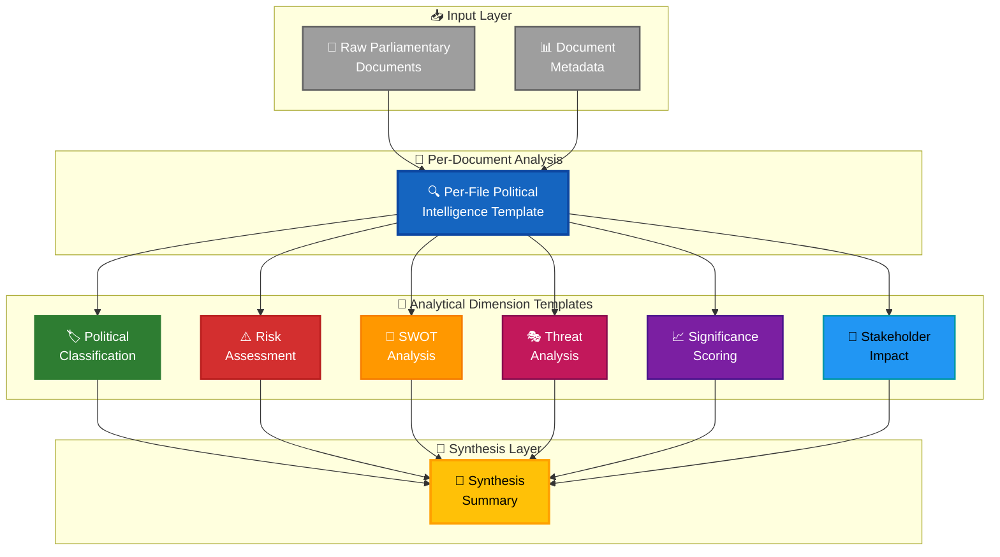
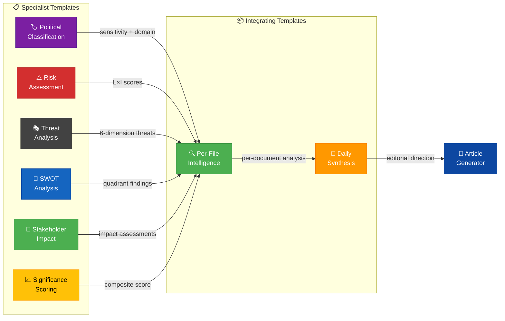
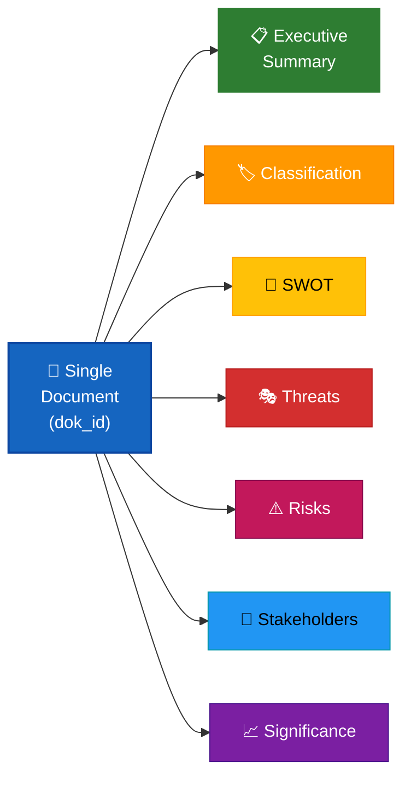
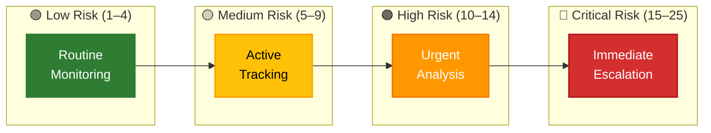
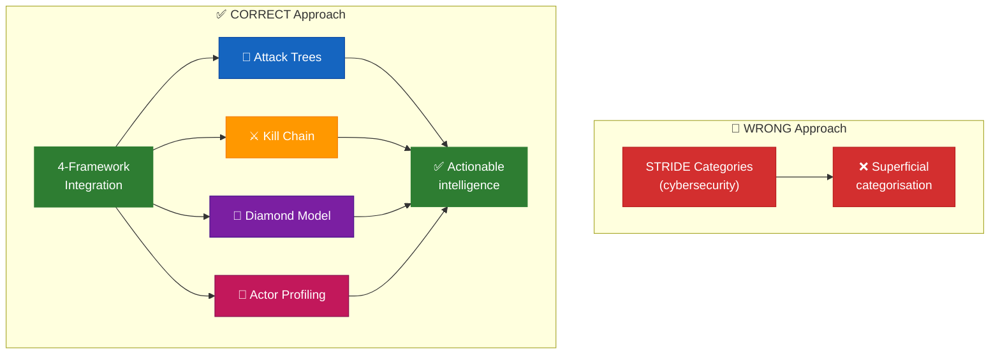
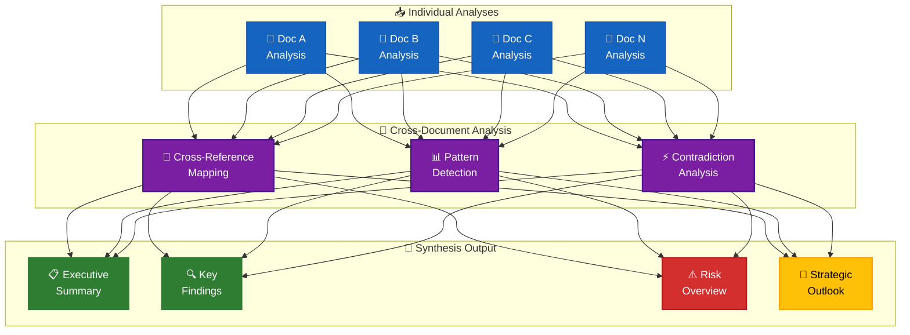
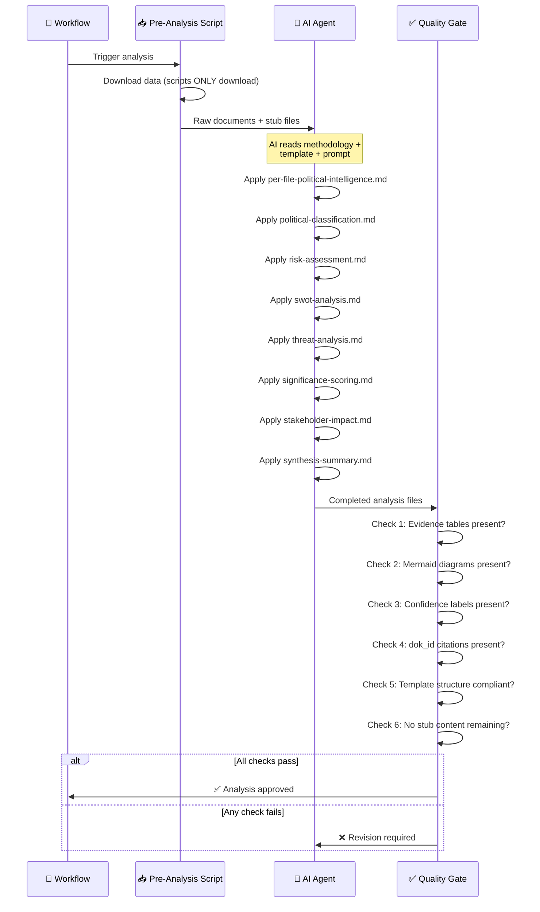
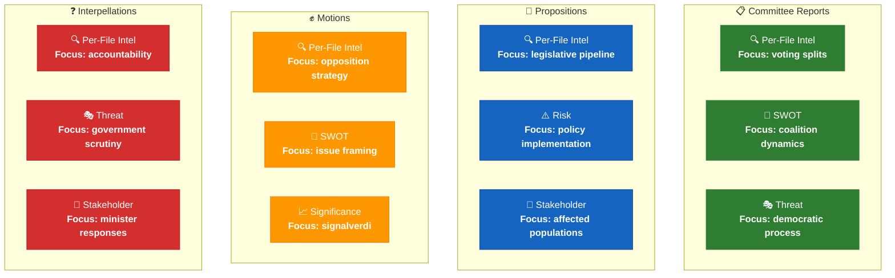
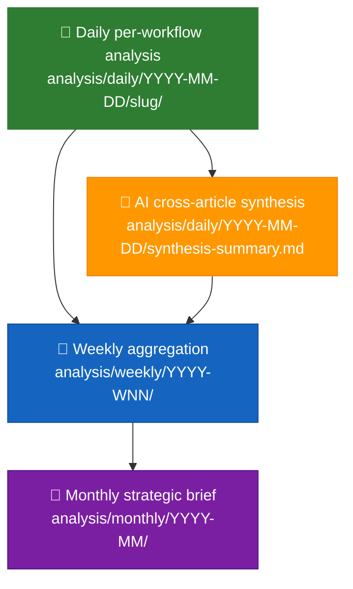

<p align="center">
  
</p>

<h1 align="center">📋 Analysis Templates — Political Intelligence Output Standards</h1>

<p align="center">
  <strong>📊 Structured Templates for Consistent, High-Quality Political Intelligence</strong><br>
  <em>🎯 Evidence-Based · Mermaid-Rich · Confidence-Labeled · ISMS-Compliant</em>
</p>

<p align="center">
  <a href="#"></a>
  <a href="#"></a>
  <a href="#"></a>
  <a href="#"></a>
</p>

**📋 Document Owner:** CEO | **📄 Version:** 4.3 | **📅 Last Updated:** 2026-06-01 (UTC)  
**🔄 Review Cycle:** Quarterly | **⏰ Next Review:** 2026-06-30  
**🏢 Owner:** Hack23 AB (Org.nr 5595347807) | **🏷️ Classification:** Public

---

## 📚 Architecture Documentation Map

<table class="documentation-map">
  <thead>
    <tr>
      <th>Document</th>
      <th>Focus</th>
      <th>Description</th>
      <th>Documentation Link</th>
    </tr>
  </thead>
  <tbody>
    <tr>
      <td><strong><a href="../../ARCHITECTURE.md">Architecture</a></strong></td>
      <td>🏛️ Architecture</td>
      <td>C4 model showing current system structure</td>
      <td><a href="https://github.com/Hack23/riksdagsmonitor/blob/main/ARCHITECTURE.md">View Source</a></td>
    </tr>
    <tr>
      <td><strong><a href="../../SECURITY_ARCHITECTURE.md">Security Architecture</a></strong></td>
      <td>🛡️ Security</td>
      <td>Security controls and compliance mapping</td>
      <td><a href="https://github.com/Hack23/riksdagsmonitor/blob/main/SECURITY_ARCHITECTURE.md">View Source</a></td>
    </tr>
    <tr>
      <td><strong><a href="../../WORKFLOWS.md">Workflows</a></strong></td>
      <td>⚙️ DevOps</td>
      <td>CI/CD pipeline documentation</td>
      <td><a href="https://github.com/Hack23/riksdagsmonitor/blob/main/WORKFLOWS.md">View Source</a></td>
    </tr>
    <tr>
      <td><strong><a href="../README.md">Analysis Directory</a></strong></td>
      <td>🔬 Analysis</td>
      <td>Analysis directory overview and structure</td>
      <td><a href="https://github.com/Hack23/riksdagsmonitor/blob/main/analysis/README.md">View Source</a></td>
    </tr>
    <tr>
      <td><strong><a href="../methodologies/ai-driven-analysis-guide.md">AI Analysis Guide</a></strong></td>
      <td>🤖 Methodology</td>
      <td>Per-file analysis protocol and quality gates</td>
      <td><a href="https://github.com/Hack23/riksdagsmonitor/blob/main/analysis/methodologies/ai-driven-analysis-guide.md">View Source</a></td>
    </tr>
    <tr>
      <td><strong><a href="../methodologies/political-threat-framework.md">Threat Framework</a></strong></td>
      <td>🎭 Methodology</td>
      <td>Political Threat Taxonomy (6 dimensions)</td>
      <td><a href="https://github.com/Hack23/riksdagsmonitor/blob/main/analysis/methodologies/political-threat-framework.md">View Source</a></td>
    </tr>
    <tr>
      <td><strong><a href="../methodologies/political-risk-methodology.md">Risk Methodology</a></strong></td>
      <td>⚠️ Methodology</td>
      <td>Likelihood × Impact scoring for Riksdag events</td>
      <td><a href="https://github.com/Hack23/riksdagsmonitor/blob/main/analysis/methodologies/political-risk-methodology.md">View Source</a></td>
    </tr>
    <tr>
      <td><strong><a href="../methodologies/political-swot-framework.md">SWOT Framework</a></strong></td>
      <td>💼 Methodology</td>
      <td>Evidence-based political SWOT quadrants</td>
      <td><a href="https://github.com/Hack23/riksdagsmonitor/blob/main/analysis/methodologies/political-swot-framework.md">View Source</a></td>
    </tr>
    <tr>
      <td><strong><a href="../methodologies/political-classification-guide.md">Classification Guide</a></strong></td>
      <td>🏷️ Methodology</td>
      <td>7-dimension political event classification</td>
      <td><a href="https://github.com/Hack23/riksdagsmonitor/blob/main/analysis/methodologies/political-classification-guide.md">View Source</a></td>
    </tr>
    <tr>
      <td><strong><a href="../methodologies/political-style-guide.md">Style Guide</a></strong></td>
      <td>✍️ Methodology</td>
      <td>Editorial and analytical style standards</td>
      <td><a href="https://github.com/Hack23/riksdagsmonitor/blob/main/analysis/methodologies/political-style-guide.md">View Source</a></td>
    </tr>
  </tbody>
</table>

---

## 🔐 ISMS Policy Alignment

These analysis templates implement structured intelligence production mandated by Hack23 AB's ISMS framework:

| **ISMS Policy** | **Template Implementation** |
| --- | --- |
| [🛠️ Secure Development Policy](https://github.com/Hack23/ISMS-PUBLIC/blob/main/Secure_Development_Policy.md) | Structured templates enforce consistent analytical output; anti-pattern warnings prevent quality degradation |
| [📝 Change Management](https://github.com/Hack23/ISMS-PUBLIC/blob/main/Change_Management.md) | Template versioning, quarterly review cycle, document metadata tracking |
| [🔐 Information Security Policy](https://github.com/Hack23/ISMS-PUBLIC/blob/main/Information_Security_Policy.md) | Classification levels (PUBLIC/SENSITIVE/RESTRICTED) in every analysis output |
| [🔓 Open Source Policy](https://github.com/Hack23/ISMS-PUBLIC/blob/main/Open_Source_Policy.md) | SPDX license headers, REUSE compliance, transparent methodology documentation |
| [🔍 Vulnerability Management](https://github.com/Hack23/ISMS-PUBLIC/blob/main/Vulnerability_Management.md) | Threat analysis template identifies political risks; risk assessment quantifies exposure |

### Compliance Framework Mapping

| **Framework** | **Version** | **Relevant Controls** | **Template Implementation** |
| --- | --- | --- | --- |
| **ISO 27001** | 2022 | A.5.10, A.8.3 | Information classification via political-classification template |
| **NIST CSF** | 2.0 | ID.RA, ID.RM | Risk identification and management via risk-assessment template |
| **CIS Controls** | v8.1 | 17.1 | Threat intelligence production via threat-analysis template |
| **EU CRA** | 2024 | Art. 10, Art. 11 | Transparency and vulnerability disclosure via stakeholder-impact template |

---

## 🔄 Tradecraft Requirements (v4.3)

Every template produced by Riksdagsmonitor workflows must comply with the tradecraft standards defined in [`political-style-guide.md`](../methodologies/political-style-guide.md):

### Standard Header Block

Every template file includes a tradecraft header that workflow AI agents complete:

```markdown
## 🔄 Tradecraft Context

| Element | Value |
|---------|-------|
| **F3EAD Stage** | `[Stage: FIND / FIX / FINISH / EXPLOIT / ANALYZE / DISSEMINATE]` |
| **PIRs Served** | `[List: PIR-1, PIR-5, etc.]` |
| **Admiralty Floor** | `[Minimum: A1 / B2 / C3]` |
| **SAT(s) Applied** | `[List: ACH, Red Team, etc.]` |
| **ICD 203 Standards** | `[List: 1, 2, 4, etc.]` |
```

### Evidence Column Requirements

Every evidence table gains an **Admiralty** column with `[A–F][1–6]` annotation:

```markdown
| Evidence | Source | Admiralty | Confidence |
|----------|--------|:---------:|:----------:|
| FiU48 passed 176–173 | Riksdag votering H901FiU48 | **[A1]** | 🟦 VERY HIGH |
| SD budget support conditional | Party congress resolution | **[B2]** | 🟩 HIGH |
```

### Probability Language

All forward-looking claims use **Words of Estimative Probability (WEP)**:
- **Almost certain** (~95%) · **Very likely** (~85%) · **Likely** (~70%) · **Roughly even** (~50%) · **Unlikely** (~30%) · **Very unlikely** (~15%) · **Remote** (~5%)

### Source Diversity Rule

Every P0/P1 claim requires **≥3 primary sources** (MCP-sourced Riksdag/Regering documents) **+ ≥1 secondary source** (SCB, World Bank, IMF, press, OSINT). Single-source claims must be labeled `[unconfirmed]`. See the **Source Diversity Rule** + **Collection Management Matrix** (MCP tool → evidence → template) in [`political-style-guide.md`](../methodologies/political-style-guide.md).

### PIR Tagging

Key findings in `intelligence-assessment.md`, `executive-brief.md`, and `synthesis-summary.md` tag to the PIR they inform (e.g., `[PIR-1: Coalition Stability]`).

### ICD 203 Compliance

Every `methodology-reflection.md` includes an ICD 203 compliance checklist verifying all 9 analytic tradecraft standards are met.

### 📰 Reader-Facing Output Contract (script-enforced)

Tradecraft alone does not produce **publication-quality** articles — strong intelligence content can still render as a flat artifact concatenation if the reader-facing scaffolding is weak. Every aggregated `analysis/daily/$DATE/$SUBFOLDER/article.md` is therefore validated by [`scripts/validate-article.ts`](../../scripts/validate-article.ts) (run via `npm run validate-article` and as part of `npm run validate-all`). The validator fails CI on any of these violations:

| Rule code | What it blocks |
|---|---|
| `unresolved-placeholder` | `[REQUIRED:…]`, `AI_MUST_REPLACE`, `<insert …>`, `TBD:`, `FILL IN` strings surviving Pass-2. **Templates carry these markers on disk; if any reach the article, the AI agent skipped a substitution.** |
| `missing-reader-guide` / `missing-executive-brief` / `missing-bluf` / `missing-sources-appendix` | Required article landmarks. |
| `bluf-too-short` (< 80 chars) / `bluf-too-long` (> 1200 chars) | Stub or runaway BLUFs. A publishable BLUF needs actor + active verb + object + when + so-what. |
| `empty-heading-slug` | Any heading whose permissive slug is empty (e.g. emoji-only). Empty `#anchor` would break the Reader Intelligence Guide and SERP deep-links. |
| `per-doc-missing-dok_id` | Any `### HD…`/`### FiU…` per-document subsection lacking at least one dok_id-style code in its body. Every per-document subsection must trace to a primary-source identifier. |

Authoring guidance:

1. **Never ship a placeholder.** Pass-2 must replace every `[REQUIRED: …]`, `AI_MUST_REPLACE`, `<insert …>`, `TBD:` and `FILL IN` marker with concrete prose. The validator scans the **aggregated** article — there is nowhere to hide.
2. **BLUF prose, not bullet stub.** The first prose paragraph after `## 🎯 BLUF` is what the aggregator extracts as the article `<meta description>` and as the SERP snippet. Write 1–4 evidence-bearing sentences, ≥ 80 chars, ≤ 1200 chars.
3. **Heading hierarchy is auto-corrected.** The aggregator demotes every internal `##` to `###`, `###` to `####`, etc. so your template's `## 🎯 BLUF` becomes a properly-nested H3 under the wrapper `## Executive Brief`. **Do not pre-flatten** your template's headings to compensate — author them at the natural depth (BLUF, 60-second read, top forward trigger as `##`; their sub-bullets as `###`/`####`).
4. **Avoid `_Source: file.md_` italics at the top of the body.** Source attribution is now generated centrally in the Reader Intelligence Guide and the `## Article Sources` appendix. Inline prose mentions like *"primary source: data.riksdagen.se/dokument/HD12345"* are preserved (they're real journalism).
5. **Avoid emoji-only headings.** A heading like `## 🎯` slugs to an empty string and the validator blocks it. Always pair the emoji with at least one word: `## 🎯 BLUF`, `## 🔮 Top Forward Trigger`.
6. **Cite dok_id in every per-document analysis.** The aggregator emits one `### HD12345` (or `### FiU17`) per file under `documents/`; the body must mention that identifier (or another riksdagen identifier) at least once for primary-source traceability.

Run the contract locally before commit:

```bash
# Re-aggregate, then validate every article in the repo:
npx tsx scripts/aggregate-analysis.ts --all
npm run validate-article
```

The aggregator's structural projections (heading demotion, source-preamble stripping, slug normalisation) are unit-tested in [`tests/render-lib.test.ts`](../../tests/render-lib.test.ts); the validator guards the AI-authored contribution that the aggregator concatenates. See [`Article-Generation.md`](../../Article-Generation.md) §"Article minimum-content validator" for the full contract reference.

---

## 🤖 Artifact → workflow → gate check mapping

The 12 agentic news workflows in `.github/workflows/news-*.md` render these templates into concrete artifacts under `analysis/daily/$ARTICLE_DATE/$SUBFOLDER/`. Authoring contract: [`.github/prompts/README.md`](../../.github/prompts/README.md). Tradecraft canon: [`../methodologies/osint-tradecraft-standards.md`](../methodologies/osint-tradecraft-standards.md).

**23 always-produced artifacts per run** (every news workflow — single-type + Tier-C):

### 📘 Family A — Core Synthesis (9 artifacts)

| Template | Produced artifact | Enforced by `05-analysis-gate.md` |
|----------|-------------------|-----------------------------------|
| — (index, hand-written) | `README.md` (run index) | Check 1 (presence) |
| [`synthesis-summary.md`](synthesis-summary.md) | `synthesis-summary.md` (lead story + DIW ranking + ≥ 1 Mermaid) | Check 1 + 5 (Mermaid) |
| [`executive-brief.md`](executive-brief.md) | `executive-brief.md` (BLUF + 3 decisions supported + 400–600 words) | Check 1 + 7 (BLUF / Decisions) |
| [`significance-scoring.md`](significance-scoring.md) | `significance-scoring.md` (DIW scores + sensitivity) | Check 1 + 4 (evidence per ranked item) |
| [`political-classification.md`](political-classification.md) | `classification-results.md` (priority tiers, retention) | Check 1 |
| [`swot-analysis.md`](swot-analysis.md) | `swot-analysis.md` with TOWS matrix | Check 1 + 4 (evidence) |
| [`risk-assessment.md`](risk-assessment.md) | `risk-assessment.md` (top 5 risks, L × I, cascading) | Check 1 |
| [`threat-analysis.md`](threat-analysis.md) | `threat-analysis.md` (Political Threat Taxonomy + attack trees) | Check 1 |
| [`stakeholder-impact.md`](stakeholder-impact.md) | `stakeholder-perspectives.md` (named actors + influence network) | Check 1 |

### 📗 Family B — Structural Metadata (2 artifacts)

| Template | Produced artifact | Enforced by |
|----------|-------------------|-------------|
| [`data-download-manifest.md`](data-download-manifest.md) | `data-download-manifest.md` (pre-computed by download step, collection transparency) | Check 1 |
| [`cross-reference-map.md`](cross-reference-map.md) | `cross-reference-map.md` (continuity contracts, sibling folders) | Check 1 |

### 📙 Family C — Strategic Extensions (5 artifacts, F3EAD Exploit → Analyze)

| Template | Produced artifact | Enforced by |
|----------|-------------------|-------------|
| [`intelligence-assessment.md`](intelligence-assessment.md) | `intelligence-assessment.md` (≥ 3 Key Judgments + PIRs) | Check 7 (≥ 3 KJ + PIR) |
| [`scenario-analysis.md`](scenario-analysis.md) | `scenario-analysis.md` (≥ 3 scenarios with posteriors + indicators) | Check 7 (≥ 3 scenarios) |
| [`devils-advocate.md`](devils-advocate.md) | `devils-advocate.md` (≥ 3 ACH hypotheses, KAC, Red Team) | Check 7 (≥ 3 ACH hypotheses) |
| [`comparative-international.md`](comparative-international.md) | `comparative-international.md` (≥ 2 peer-country rows via WB / IMF / SCB) | Check 7 (≥ 2 comparators) |
| [`methodology-reflection.md`](methodology-reflection.md) | `methodology-reflection.md` (ICD 203 audit, ≥ 10 SATs, DIW reconciliation, PIR retirement log) | Check 7 (ICD 203 audit present) |

### 📕 Family D — Electoral & Domain Lenses (7 artifacts, F3EAD Analyze continued)

| Template | Produced artifact | Enforced by |
|----------|-------------------|-------------|
| [`election-2026-analysis.md`](election-2026-analysis.md) | `election-2026-analysis.md` (seat deltas, campaign implications) | Check 8 |
| [`voter-segmentation.md`](voter-segmentation.md) | `voter-segmentation.md` (SCB segment cuts) | Check 8 |
| [`coalition-mathematics.md`](coalition-mathematics.md) | `coalition-mathematics.md` (Sainte-Laguë seat table) | Check 8 (seat-count table) |
| [`historical-parallels.md`](historical-parallels.md) | `historical-parallels.md` (≥ 2 historical episodes) | Check 8 |
| [`media-framing-analysis.md`](media-framing-analysis.md) | `media-framing-analysis.md` (framing vectors × parties) | Check 8 |
| [`implementation-feasibility.md`](implementation-feasibility.md) | `implementation-feasibility.md` (actor-capacity + timeline) | Check 8 |
| [`forward-indicators.md`](forward-indicators.md) | `forward-indicators.md` (≥ 10 dated indicators across 4 horizons) | Check 8 (≥ 10 dated indicators) |

### 📒 Family E — Per-Document (N artifacts)

| Template | Produced artifact | Enforced by |
|----------|-------------------|-------------|
| [`per-file-political-intelligence.md`](per-file-political-intelligence.md) | `documents/{dok_id}-analysis.md` (one per input document) | Check 2 (per-doc coverage) |

**Tier-C additive contract** (aggregation workflows: `news-evening-analysis`, `news-week-ahead`, `news-month-ahead`, `news-weekly-review`, `news-monthly-review`, `news-realtime-monitor`, `news-article-generator`) — no extra files beyond the 23 above; instead:

- **Period-scope multipliers** on DIW scoring and section depth.
- **Cross-type sibling citations** recorded in `cross-reference-map.md §Sibling folders`.
- **Prior-cycle PIR ingestion** in `intelligence-assessment.md §Carried-forward PIRs` (see [`../methodologies/osint-tradecraft-standards.md#7️⃣-pir-handoff--cross-cycle-continuity`](../methodologies/osint-tradecraft-standards.md#7️⃣-pir-handoff--cross-cycle-continuity)).
- **1500-word article floor** for the generated news article.

Enforced by the Tier-C additive gate in [`ext/tier-c-aggregation.md`](../../.github/prompts/ext/tier-c-aggregation.md).

**Upstream gh-aw documentation** (link-out only): <https://github.github.com/gh-aw/llms-small.txt> · <https://github.github.com/gh-aw/llms-full.txt> · <https://github.github.com/gh-aw/_llms-txt/agentic-workflows.txt>

---

## 🎯 Purpose

This directory contains a **structured catalog of analysis templates** that defines the exact output format for every political intelligence artifact produced by Riksdagsmonitor's AI agents. Templates ensure consistency, completeness, and quality across all analysis types — from per-file document intelligence to full synthesis summaries.

> **Critical Rule:** AI agents MUST follow these templates. Templates define structure and required sections — the AI fills them with genuine, evidence-based analysis. Templates must NEVER be copied verbatim with placeholder text.

Templates are **not** standalone outputs. They form a **composable intelligence pipeline** — individual templates feed into the daily synthesis, which aggregates into weekly and monthly intelligence reports. The per-file analysis template is the most frequently used: every downloaded Riksdag MCP data file receives a comprehensive analysis using this template.

**Critical mandates:**

- 🔍 AI agents must **READ actual Riksdag data** and produce original analysis — never scripted boilerplate
- 📎 Every claim requires an **evidence citation** (dok_id, vote record, or MCP data file path)
- 📊 All outputs require **structured tables + colour-coded Mermaid diagrams** — plain prose alone is rejected
- 🎯 Every analysis must pass a **minimum 7.0/10 quality gate** before consumption by article generators

---

## 📐 Template Architecture



---

## 🗺️ Template Interconnection Map

All eight templates form an integrated intelligence network. The per-file analysis template consumes outputs from the six specialist templates, and the synthesis template aggregates all per-file analyses:



---

## 📑 Master Template Catalog — Family A–E

Templates are grouped by the **output family** defined in [`ai-driven-analysis-guide.md`](../methodologies/ai-driven-analysis-guide.md#-output-matrix--every-file-every-family). Each family corresponds to a distinct role in the 7-step analysis protocol. Every analysis workflow uses the same catalog.

### 📘 Family A — Core Synthesis (every run produces all 9)

> **Methodology:** [synthesis-methodology.md](../methodologies/synthesis-methodology.md) defines step-by-step production of A2, A3, A4, A9. Classification (A5) uses [political-classification-guide.md](../methodologies/political-classification-guide.md). SWOT (A6) uses [political-swot-framework.md](../methodologies/political-swot-framework.md). Risk (A7) uses [political-risk-methodology.md](../methodologies/political-risk-methodology.md). Threat (A8) uses [political-threat-framework.md](../methodologies/political-threat-framework.md).

| # | File | Template | Purpose |
|:-:|------|----------|---------|
| A1 | `README.md` (folder index) | [folder README](#folder-readme-template) | Index + links for each workflow folder |
| A2 | `executive-brief.md` | [executive-brief.md](executive-brief.md) | BLUF, 3 decisions, 60-second read, confidence-labeled |
| A3 | `synthesis-summary.md` | [synthesis-summary.md](synthesis-summary.md) | Integrated intelligence picture + article decision |
| A4 | `significance-scoring.md` | [significance-scoring.md](significance-scoring.md) | DIW-weighted ranking, 6 dimensions |
| A5 | `classification-results.md` | [political-classification.md](political-classification.md) | 7-dimension classification across documents |
| A6 | `swot-analysis.md` | [swot-analysis.md](swot-analysis.md) | Stakeholder SWOT + TOWS + cross-SWOT |
| A7 | `risk-assessment.md` | [risk-assessment.md](risk-assessment.md) | 5×5 L×I matrix + cascading chains |
| A8 | `threat-analysis.md` | [threat-analysis.md](threat-analysis.md) | Political threat taxonomy + attack tree |
| A9 | `stakeholder-perspectives.md` | [stakeholder-impact.md](stakeholder-impact.md) | 6-lens stakeholder impact matrix |

### 📗 Family B — Structural Metadata (every run produces all 2)

> **Methodology:** [structural-metadata-methodology.md](../methodologies/structural-metadata-methodology.md) — step-by-step production of the provenance ledger + relational graph, with SLA table and 7-edge relationship taxonomy.

| # | File | Template | Purpose |
|:-:|------|----------|---------|
| B1 | `data-download-manifest.md` | [data-download-manifest.md](data-download-manifest.md) | Transparent MCP-download inventory + data-depth ceilings |
| B2 | `cross-reference-map.md` | [cross-reference-map.md](cross-reference-map.md) | Policy clusters + legislative chains + coordinated-activity patterns |

### 📙 Family C — Strategic Extensions (core — every run produces all 5)

> **Methodology:** [strategic-extensions-methodology.md](../methodologies/strategic-extensions-methodology.md) — step-by-step production of all 5 always-produced depth products (ACH matrix, peer-country grid, Key Judgments, bias audit, run-audit gate).

| # | File | Template | Role on every run |
|:-:|------|----------|-------------------|
| C1 | `scenario-analysis.md` | [scenario-analysis.md](scenario-analysis.md) | 4 scenarios with probabilities summing to 100%; converges to narrow-band on light days |
| C2 | `comparative-international.md` | [comparative-international.md](comparative-international.md) | Peer-country comparison (≥5 peers); compares baseline when no reform active (variant filename: `international-comparative.md`) |
| C3 | `devils-advocate.md` | [devils-advocate.md](devils-advocate.md) | ACH red-team with ≥3 competing hypotheses; documents rejected hypotheses when evidence is strong |
| C4 | `intelligence-assessment.md` | [intelligence-assessment.md](intelligence-assessment.md) | 3–7 Key Judgments + PIRs for the next cycle |
| C5 | ⭐ `methodology-reflection.md` | [methodology-reflection.md](methodology-reflection.md) | **VITAL run-audit file** — evidence sufficiency + confidence distribution + party-neutrality + ≥3 concrete improvements |

### 📕 Family D — Electoral & Domain Lenses (core — every run produces all 7)

> **Methodology:** [electoral-domain-methodology.md](../methodologies/electoral-domain-methodology.md) — step-by-step production of all 7 always-produced domain lenses (Sainte-Laguë seat math, segment privacy threshold, 4-horizon forward indicators, longitudinal frame delta).

| # | File | Template | Role on every run |
|:-:|------|----------|-------------------|
| D1 | `election-2026-analysis.md` | [election-2026-analysis.md](election-2026-analysis.md) | Seat-projection delta + coalition viability; perpetual Swedish political-context file (variant filename: `election-2026-implications.md`) |
| D2 | `voter-segmentation.md` | [voter-segmentation.md](voter-segmentation.md) | 5-axis segment impact; documents baseline positions on procedural days |
| D3 | `coalition-mathematics.md` | [coalition-mathematics.md](coalition-mathematics.md) | Current seat map + pivotal votes + Sainte-Laguë scenarios |
| D4 | `historical-parallels.md` | [historical-parallels.md](historical-parallels.md) | Named precedent(s) ≤ 40 years with similarity score, or explicit "no-precedent" finding (variant filename: `historical-baseline.md`) |
| D5 | `media-framing-analysis.md` | [media-framing-analysis.md](media-framing-analysis.md) | Per-party + per-press-quadrant framing + longitudinal-frame delta |
| D6 | `implementation-feasibility.md` | [implementation-feasibility.md](implementation-feasibility.md) | Delivery-risk view; audits in-flight backlog when no new bill lands |
| D7 | `forward-indicators.md` | [forward-indicators.md](forward-indicators.md) | ≥10 indicators across 4 horizons (72 h / week / month / election) |

### 📒 Family E — Per-Document

> **Methodology:** [per-document-methodology.md](../methodologies/per-document-methodology.md) — step-by-step production of `{dok_id}-analysis.md` + cluster files, with doctype-specific Mermaid taxonomy and 4-condition clustering rule.

| # | File | Template | Purpose |
|:-:|------|----------|---------|
| E1 | `documents/${dok_id}-analysis.md` | [per-file-political-intelligence.md](per-file-political-intelligence.md) | Deep per-document analysis (tiers L1–L3) |
| E2 | `documents/${cluster}-cluster-analysis.md` | [per-file-political-intelligence.md § Cluster](per-file-political-intelligence.md) | Cluster-level synthesis for grouped documents |

### 🛰️ Operational Supplementary — Not Counted in the 23 (Added v2.4, 2026-04-23)

> **Purpose** — Enrichment artifacts that strengthen the AI-FIRST quality loop, cross-run memory, and MCP health auditability. **Recommended** for every `deep` run; **mandatory** for every `comprehensive` (Tier-C aggregation) run. For non-Tier-C runs these artifacts are generally non-blocking; **exception:** `cross-run-diff.md` (S5) is gate-required whenever `ANALYSIS_RUN_COUNT >= 2` (same article type), including `standard` and `deep` runs. Each artifact is consumed by [`.github/prompts/05-analysis-gate.md §Supplementary checks`](../../.github/prompts/05-analysis-gate.md#supplementary-checks) when present.
>
> **Methodology index** — [`per-artifact-methodologies.md`](../methodologies/per-artifact-methodologies.md) §§ analysis-index · reference-analysis-quality · mcp-reliability-audit · workflow-audit · cross-run-diff · cross-session-intelligence · session-baseline.
> **Catalog row** — [`artifact-catalog.md §Operational Supplementary`](../methodologies/artifact-catalog.md#-operational-supplementary-artifacts-7).

| # | File | Template | Purpose | Typical article types |
|:-:|------|----------|---------|----------------------|
| S1 | `analysis-index.md` | [analysis-index.md](analysis-index.md) | Read-me-first run navigator: artifact inventory, MCP summary, recommended reading order, gate outcome | All `deep` + `comprehensive` |
| S2 | `reference-analysis-quality.md` | [reference-analysis-quality.md](reference-analysis-quality.md) | Per-run self-score vs reference benchmark + Pass-2 action list — operationalises the AI-FIRST principle | All `comprehensive` |
| S3 | `mcp-reliability-audit.md` | [mcp-reliability-audit.md](mcp-reliability-audit.md) | Endpoint-by-endpoint health record for `riksdag-regering` / `scb` / `world-bank` / IMF with latency, freshness, failure incidents, cache usage | All `comprehensive`; any `deep` run with MCP degradation |
| S4 | `workflow-audit.md` | [workflow-audit.md](workflow-audit.md) | Prompt-module-by-module self-audit of the 7-module pipeline; 11-principle compliance table | All `comprehensive` |
| S5 | `cross-run-diff.md` | [cross-run-diff.md](cross-run-diff.md) | Bayesian delta vs prior run of the **same** article type — posterior WEP bands, scenario-probability shifts, risk-register deltas | Any article type with ≥ 2 runs |
| S6 | `cross-session-intelligence.md` | [cross-session-intelligence.md](cross-session-intelligence.md) | **Session-over-session** narrative (week / month / quarter aggregation) — momentum, crystallisation moments, vote-discipline time-series | `weekly-review`, `monthly-review`, `motions` (quarterly) |
| S7 | `session-baseline.md` | [session-baseline.md](session-baseline.md) | Calendar + adopted-texts + voterings roster for the period — data-dense reference every narrative artifact points back to | `weekly-review`, `monthly-review`, `propositions`, `motions` (aggregation) |

Line floors for S1–S7 are configured in [`reference-quality-thresholds.json`](../methodologies/reference-quality-thresholds.json) and apply to `comprehensive` runs.

### 🔭 Analytical Supplementary — Optional Deep-Dive (Added v2.5, 2026-04-23)

> **Purpose** — Optional deep-dive analytical templates mapped to frameworks explicitly listed in the intelligence-operative agent's "Core Expertise" and "Analytical Frameworks" sections. **Never replace** a core artifact and **never blocking** in `05-analysis-gate.md`. Pair with and cite the canonical artifact they extend.
>
> **Methodology** — [`analytical-supplementary-methodology.md`](../methodologies/analytical-supplementary-methodology.md) (composition rules, evidence rules, per-template analytic moves).
> **Catalog row** — [`artifact-catalog.md §Analytical Supplementary`](../methodologies/artifact-catalog.md#-analytical-supplementary-artifacts-4).

| # | File | Template | Purpose | Trigger |
|:-:|------|----------|---------|---------|
| AS1 | `pestle-analysis.md` | [pestle-analysis.md](pestle-analysis.md) | Macro-environment scan (Political/Economic/Social/Technological/Legal/Environmental) with IMF-vintage economic rows, ≥ 3 cross-dimension interactions, key judgement per dimension | event crosses ≥ 2 PESTLE dimensions |
| AS2 | `political-stride-assessment.md` | [political-stride-assessment.md](political-stride-assessment.md) | STRIDE applied to political/electoral/institutional surfaces — 6 dimension tables, ≥ 2 Mermaid attack trees, MITRE-style TTP map, ISMS control map (ISO 27001 · NIST CSF 2.0 · CIS v8.1) | election-adjacent · integrity incident · disinfo spike · critical-infra vote |
| AS3 | `wildcards-blackswans.md` | [wildcards-blackswans.md](wildcards-blackswans.md) | Tail of `scenario-analysis.md` — wildcard register (≥ 8), black-swan candidates (≥ 3) with plausible causal chains, cascading consequence trees, resilience assessment | long-horizon forecasting (`monthly-review`, election-year aggregation) |
| AS4 | `quantitative-swot.md` | [quantitative-swot.md](quantitative-swot.md) | Numerical SWOT scoring using same DIW weight vector as `significance-scoring.md`; TOWS matrix with scored action rankings; sensitivity analysis | decision memo requiring scored ranking |

Line floors for AS1–AS4 live in `reference-quality-thresholds.json § thresholds.analyticalSupplementary`; apply **only when the template is produced**. Non-production is never a gate failure.

### Workflow → Family Map

| Workflow | Family A | Family B | Family C | Family D | Family E |
|----------|:--------:|:--------:|:--------:|:--------:|:--------:|
| Morning per-type (propositions, motions, betänkanden, interpellationer, frågor) | ✅ All 9 | ✅ Both | ✅ All 5 | ✅ All 7 | ✅ Every doc |
| Midday week/month-ahead | ✅ All 9 | ✅ Both | ✅ All 5 | ✅ All 7 | ✅ Every forecast item |
| Evening analysis | ✅ All 9 | ✅ Both | ✅ All 5 | ✅ All 7 | ✅ Every doc |
| Realtime monitor | ✅ All 9 | ✅ Both | ✅ All 5 | ✅ All 7 | ✅ Every doc |
| Weekly review | ✅ All 9 | ✅ Both | ✅ All 5 + reflection | ✅ All 7 | Top 20 |
| Monthly review | ✅ All 9 | ✅ Both | ✅ All 5 + reflection | ✅ All 7 | Top 50 |

---

## 📖 Template Catalog

### 🔍 Per-File Political Intelligence — `per-file-political-intelligence.md`

| Attribute | Value |
|-----------|-------|
| **Purpose** | Deep intelligence analysis of a single parliamentary document |
| **When Used** | Per-document analysis stage (one per `dok_id`) |
| **Output Location** | `analysis/daily/YYYY-MM-DD/{articleType}/documents/{dok_id}-analysis.md` |
| **Key Sections** | Executive Summary · Classification · SWOT · Threat Assessment · Risk Assessment · Stakeholder Impact · Significance Score |



---

### 🏷️ Political Classification — `political-classification.md`

| Attribute | Value |
|-----------|-------|
| **Purpose** | Multi-dimensional classification of political events and documents |
| **Dimensions** | 7: Public Interest · Democratic Integrity · Policy Urgency · Economic · Governance · Political Capital · Legislative |
| **Severity Levels** | CRITICAL · HIGH · MEDIUM · LOW |
| **Output** | Classification results table with confidence labels |
| **New in v2.2** | **Confidence Decay Rule** — classifications older than 7 days should be reviewed; those 8+ days require re-evaluation |

---

### ⚠️ Risk Assessment — `risk-assessment.md`

| Attribute | Value |
|-----------|-------|
| **Purpose** | Systematic political risk identification, scoring, and mitigation analysis |
| **Scored Dimensions** | 5: Coalition · Policy · Budget · Electoral · External |
| **Scoring** | Five-dimension risk profile using 1–5 scores per dimension with an overall risk synthesis and color-coded prioritization |
| **Advanced** | Related sub-analyses: Cascading risk chains · Risk velocity · Political Temperature Index |
| **New in v2.2** | **Risk Trend column** (↑↓→) · **Previous Assessment Comparison** · **Risk Interconnection Mermaid diagram** |



---

### 💼 SWOT Analysis — `swot-analysis.md`

| Attribute | Value |
|-----------|-------|
| **Purpose** | Multi-stakeholder political SWOT with strategic option generation |
| **Stakeholder Lenses** | Government Coalition · Opposition · Citizens · Economic Actors · International |
| **Advanced Features** | TOWS Matrix · Cross-SWOT Interference · Temporal Dynamics · Scenario Generation |
| **Required Output** | Evidence table per quadrant + Mermaid visualization |
| **New in v2.2** | **SWOT Delta section** (New/Changed/Removed entries) · **Temporal window specification** |

> ⚠️ **Anti-Pattern Warning:** Generic bullet points like "Strong parliamentary majority" without dok_id evidence are REJECTED by the quality gate.

---

### 🎭 Threat Analysis — `threat-analysis.md`

| Attribute | Value |
|-----------|-------|
| **Purpose** | Multi-framework democratic process threat modeling |
| **Required Frameworks** | Attack Trees + at least ONE of: Kill Chain, Diamond Model, Actor Profiling |
| **Threat Taxonomy** | 6 categories: Narrative Integrity · Legislative Integrity · Accountability · Transparency · Democratic Process · Power Balance |
| **Threat Agents** | 6: Ruling Coalition · Opposition · External Actors · Special Interests · Media · Institutional |
| **New in v3.2** | **Threat Evolution Timeline** · **Cross-Methodology Linkage** (how threats feed into SWOT and Risk) |

> ⚠️ **Anti-Pattern Warning:** Using STRIDE alone is FORBIDDEN. Political threats require politically-native categories, not cybersecurity taxonomies.



---

### 📈 Significance Scoring — `significance-scoring.md`

| Attribute | Value |
|-----------|-------|
| **Purpose** | Quantitative significance assessment for prioritisation and article selection |
| **Score Range** | 1–10 integer composite score |
| **Dimensions** | Political Weight · Public Impact · Legislative Consequence · Temporal Urgency · Cross-Reference Density |
| **Thresholds** | ≥8 Breaking News · 6–7 Major Analysis · 4–5 Standard Coverage · <4 Monitoring Only |
| **New in v2.2** | **Relative Scoring section** — compares document score to same-type average |

---

### 👥 Stakeholder Impact — `stakeholder-impact.md`

| Attribute | Value |
|-----------|-------|
| **Purpose** | Maps how political events affect key stakeholder groups |
| **Stakeholder Groups** | Government · Parliament · Opposition · Judiciary · Media · Citizens · International · Industry |
| **Assessment Axes** | Impact Magnitude · Impact Direction (positive/negative) · Timeframe · Certainty |
| **Output** | Stakeholder impact matrix with directional indicators |
| **New in v2.2** | **Position Change Tracking** (before/after this document) · **Power-Interest Grid** (Mermaid quadrant chart) |

---

### 🧩 Synthesis Summary — `synthesis-summary.md`

| Attribute | Value |
|-----------|-------|
| **Purpose** | Integrates all per-file analyses into a single coherent intelligence briefing |
| **Input** | All per-document analyses + classification + risk + SWOT + threat + significance + stakeholder |
| **Output Sections** | Executive Summary · Key Findings · Cross-Document Patterns · Risk Overview · Strategic Outlook |
| **Role** | Final deliverable that feeds directly into article generation |
| **New in v2.2** | **Mandatory Forward Indicators** (3+ required) · **Aggregate Risk Level with Trend** · **Quality Self-Check Protocol** |



---

## 🔄 Template Usage Flow



---

## 🆕 v2.3 Common Improvements (All Templates)

> **Scope note:** "All 8 templates" below refers to the original Family A core templates (A2–A9). Families B–E templates (added in v3.0+) inherit these improvements where applicable. See [Master Template Catalog](#-master-template-catalog--family-ae) for the complete 23-template inventory.

All 8 templates were updated in v2.3 (2026-06-01) with the following cross-cutting improvements:

### 🗳️ Election 2026 Implications Section
Every template now includes an **Election 2026** section that assesses electoral impact, coalition scenarios, voter salience, campaign vulnerability, and policy legacy relative to the September 2026 Swedish general election. This section is **MANDATORY** in all analysis output.

### 🎯 5-Level Confidence Scale
The binary HIGH/MEDIUM/LOW confidence scale has been replaced with a **5-level confidence scale**:
- ⬛ **VERY LOW** — Speculation only, single unverified source
- 🟥 **LOW** — Circumstantial evidence, indirect indicators
- 🟧 **MEDIUM** — Multiple independent sources, moderate corroboration
- 🟩 **HIGH** — Official records, documented data, direct evidence
- 🟦 **VERY HIGH** — Verified data + independent corroboration + expert consensus

### 📊 Historical Comparison Tables
`synthesis-summary.md` now includes a **Historical Comparison** section with tables comparing current period metrics to prior periods and year-ago data, plus a precedents table from prior riksmöten.

### 📈 Election 2026 Relevance Score
`significance-scoring.md` now includes an **Election 2026 Relevance Score** with proximity bonus, coalition stability multiplier, and voter salience factor to produce election-adjusted significance scores.

---

## 🆕 v2.2 Common Improvements (All Templates)

All 8 templates were updated in v2.2 (2026-04-06) with the following cross-cutting improvements:

### ✅ Quality Self-Check Checklist
Every template now includes a **mandatory quality self-check checklist** at the bottom (before Document Control). AI agents must verify each item before finalising analysis output. Checklists enforce:
- Metadata completeness
- Evidence density requirements
- Mermaid diagram rendering verification
- Named actor citation requirements
- No remaining placeholder text (`[REQUIRED` search test)
- Cross-reference linkage

### 🔗 Cross-Reference Section
Every template now includes a **cross-reference section** linking to sibling analysis files (e.g., risk-assessment.md ↔ swot-analysis.md ↔ threat-analysis.md) and same-day analysis from other article types. This enables contextual completeness and cross-document pattern detection.

### 📋 Enhanced Document Control Footer
All templates now include **ISMS alignment references** (ISO 27001:2022, NIST CSF 2.0) in the Document Control footer, plus explicit `Owner` and `Effective Date` fields matching Hack23 ISMS documentation standards.

### 📊 Cross-Temporal Comparison
Templates that support temporal analysis now include explicit **previous assessment comparison** sections with trend indicators (↑ Increasing / → Stable / ↓ Decreasing) and evidence requirements for each trend direction.

---

## 🎯 Article-Type-Specific Template Customisation

While all 8 templates apply to every document, certain templates produce **richer, more unique output** depending on the document type. The AI agent should allocate proportionally more depth to the highlighted templates:



### Unique Template Sections by Article Type

Each article type should produce unique analytical sections in its synthesis that **no other workflow can produce**:

| Article Type | Template | Unique Section Name | What Makes It Unique |
|---|---|---|---|
| **Committee Reports** | Synthesis | **Committee Vote Heatmap** | Party-by-party voting matrix with Ja/Nej/Avstår breakdown per beteckning |
| **Committee Reports** | SWOT | **Reservation Analysis** | Opposition reservations (dissenting opinions) text analysis — only committee reports have reservations |
| **Propositions** | Risk | **Legislative Pipeline Risk** | Where the bill sits in the process (remiss → utskott → plenum) and risk of delay/amendment |
| **Propositions** | Stakeholder | **Budget Impact Matrix** | Which population segments gain/lose from proposed budget changes |
| **Motions** | Significance | **Signalverdi Score** | Whether the motion is a genuine legislative bid or political positioning (only motions have this signal) |
| **Motions** | SWOT | **Cross-Party Alignment Map** | Which opposition parties co-sponsor or signal support — unique to motion dynamics |
| **Interpellations** | Per-File Intel | **Minister Response Scorecard** | Response timeliness (≤28 days statutory), evasion score, policy commitment extraction |
| **Interpellations** | Threat | **Accountability Gap Analysis** | Unanswered questions, overdue responses, pattern of ministerial avoidance by portfolio |
| **Evening Analysis** | Synthesis | **Daily Parliamentary Pulse** | Vote-weighted activity index combining all document types into a single daily metric |
| **Weekly Review** | SWOT | **Week-over-Week Trend Delta** | How did this week's political temperature differ from last week? Only weekly scope enables this |
| **Month Ahead** | Risk | **Strategic Calendar Risk Map** | Forward-looking risk landscape tied to specific scheduled events (budget debates, EU summits) |

---

## 📏 Template Quality Standards

Every template enforces the following mandatory requirements:

| # | Requirement | Description |
|---|-------------|-------------|
| 1 | **Evidence Tables** | All assessments must be in structured tables, not free-form prose |
| 2 | **Mermaid Diagrams** | ≥1 color-coded Mermaid diagram with `style` directives |
| 3 | **Confidence Labels** | Every assessment tagged: `HIGH` (≥80%), `MEDIUM` (60–79%), `LOW` (<60%) |
| 4 | **dok_id Citations** | Parliamentary document IDs cited for every factual claim |
| 5 | **Anti-Pattern Warnings** | Each template begins with common anti-patterns to AVOID |
| 6 | **Frontmatter** | Standard metadata: Generated, Data Sources, Documents Analyzed, Confidence |

---

## 📄 Template Selection by Data Category

| MCP Data Category | Primary Templates | Supporting Templates |
|------------------|-------------------|---------------------|
| `betankanden/` (committee reports) | Political Classification + SWOT Analysis | Stakeholder Impact, Significance Scoring |
| `propositioner/` (propositions) | Risk Assessment + Stakeholder Impact | Political Classification, Significance Scoring |
| `motioner/` (motions) | Political Classification + SWOT + Significance | Risk Assessment |
| `interpellationer/` (interpellations) | Threat Analysis + Stakeholder Impact | Political Classification |
| `voteringar/` (votes) | Political Classification + SWOT + Threat | Risk Assessment |
| `anforanden/` (speeches) | Stakeholder Impact + Significance Scoring | Political Classification |
| `calendar_events/` | Significance Scoring + Risk Assessment | Stakeholder Impact |
| `fragor/` (written questions) | Political Classification + Significance | Stakeholder Impact |

---

## 📅 Temporal Aggregation



| Scope | Format | Example | Cadence |
|-------|--------|---------|---------|
| Daily | `YYYY-MM-DD` | `2026-03-31/` | Every workflow run |
| Weekly | `YYYY-WNN` | `2026-W14/` | `news-weekly-review` aggregation |
| Monthly | `YYYY-MM` | `2026-03/` | `news-monthly-review` aggregation |
| Cross-article | `synthesis-summary.md` | Daily synthesis | Per-workflow synthesis |

---

## 📚 Related Documentation

| Document | Focus | Link |
|----------|-------|------|
| **Analysis README** | Directory overview and critical rules | [analysis/README.md](../README.md) |
| **Methodologies README** | Methodology framework catalog | [analysis/methodologies/README.md](../methodologies/README.md) |
| **AI-Driven Guide** | Master protocol for AI analysis | [ai-driven-analysis-guide.md](../methodologies/ai-driven-analysis-guide.md) |
| **Prompts v2** | AI prompt library | [scripts/prompts/v2/](../../scripts/prompts/v2/) |
| **ISMS-PUBLIC** | Hack23 ISMS security standards | [Hack23/ISMS-PUBLIC](https://github.com/Hack23/ISMS-PUBLIC) |

---

<p align="center">
  <em>📊 Hack23 AB — Structured Intelligence Through Disciplined Templates</em>
</p>
