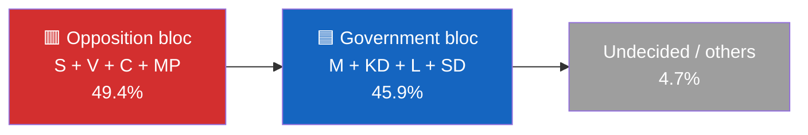
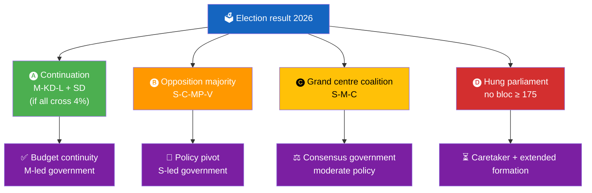

  

<h1 align="center">🧩 Coalition Mathematics Template</h1>

  <strong>📊 Seat-Projection Arithmetic, Pivotal Players, Formation Pathways</strong> 
  <em>🎯 4% Threshold · 175-Seat Majority · Pivotal Power · Banzhaf Index</em>

  
  
  
  

**📋 Document Owner:** CEO | **📄 Version:** 1.0 | **📅 Last Updated:** 2026-04-21 (UTC)
**🏢 Owner:** Hack23 AB (Org.nr 5595347807) | **🏷️ Classification:** Public

> **📌 Template instructions:** Produce whenever a document carries contested-vote or coalition-arithmetic weight. Save as `analysis/daily/${ARTICLE_DATE}/${DOC_TYPE}/coalition-mathematics.md`. Pair with `voter-segmentation.md` and `scenario-analysis.md`.

> **✨ What to produce:** Current and projected seat distributions, threshold checks for each of the 8 parties, four formation pathways with arithmetic, pivotal-player analysis (Banzhaf / Shapley-Shubik), and the single coalition-breaking signal to watch next.

---

## 📋 Coalition Context

| Field | Value |
|-------|-------|
| **Coalition-Math ID** | `COM-YYYY-MM-DD-NNN` |
| **Generated** | `YYYY-MM-DD HH:MM UTC` |
| **Baseline poll** | `SIFO YYYY-MM (+ Novus, Demoskop)` |
| **Seats needed for majority** | `175 of 349` |
| **4% threshold at ~80% turnout** | `~370 000 votes` |
| **Overall Confidence** | `🟩 HIGH` |

---

## 🧮 Current Support Snapshot

| Party | Latest SIFO % | Projected seats | Threshold status |
|:-----:|:-------------:|:---------------:|:----------------:|
| S | 30.8 | 107 | 🟢 safe |
| M | 19.4 | 68 | 🟢 safe |
| SD | 18.3 | 64 | 🟢 safe |
| V | 8.1 | 28 | 🟢 safe |
| C | 6.3 | 22 | 🟢 safe |
| KD | 4.4 | 15 | 🟡 borderline |
| MP | 4.2 | 15 | 🟡 borderline |
| L | 3.8 | 0 | 🔴 below 4 % — **wipe-out risk** |
| Others | 4.7 | 0 | 🔴 below threshold |

---

## 🧪 Threshold Sensitivity

| Party | Margin to 4 % | Probability below threshold | Scenario if eliminated |
|:-----:|:-------------:|:--------------------------:|------------------------|
| L | −0.2 pp | 🔴 High (55 %) | Government bloc loses ~12–15 seats; KD becomes kingmaker |
| KD | +0.4 pp | 🟡 Medium (25 %) | Government bloc loses ~15 seats; coalition impossible |
| MP | +0.2 pp | 🟡 Medium (30 %) | Opposition loses ~15 seats |

---

## 🧭 Formation Pathways

### Pathway A — Continuation Coalition (M-KD-L + SD, confidence)
- **Seats:** M 68 + KD 15 + L (0–13) + SD 64 = **147 to 160** → **below 175**
- **Viability:** requires L to survive threshold and unity held
- **Probability:** 40 %
- **Blocker:** L below threshold or SD withdrawal

### Pathway B — Opposition Majority (S-C-MP-V)
- **Seats:** S 107 + C 22 + MP 15 + V 28 = **172** → **below 175 by 3**
- **Viability:** needs either MP/V boost or micro-party failure to reduce denominator
- **Probability:** 25 %
- **Blocker:** seat count just short; MP or C could tip

### Pathway C — Grand Centre Coalition (S-M-C)
- **Seats:** S 107 + M 68 + C 22 = **197** → **above 175**
- **Viability:** arithmetically easy; politically historically unprecedented
- **Probability:** 10 %
- **Blocker:** party-culture taboos

### Pathway D — Hung Parliament / Extended Formation
- **Seats:** no bloc ≥ 175 after small-party fluctuations
- **Probability:** 25 %
- **Outcome:** Statsministeromröstning cycle; 4 attempts before re-election

---

## 🧲 Pivotal-Player Analysis

**Banzhaf index** for each majority scenario (normalised power score):

| Party | Government-bloc scenarios | Opposition-bloc scenarios | Cross-bloc scenarios | Total pivotal power |
|:-----:|:------------------------:|:------------------------:|:-------------------:|:-------------------:|
| SD | 0.33 | — | 0.08 | 0.41 |
| M | 0.25 | — | 0.22 | 0.47 |
| S | — | 0.30 | 0.22 | 0.52 |
| C | — | 0.20 | 0.18 | 0.38 |
| V | — | 0.17 | 0.05 | 0.22 |
| KD | 0.15 | — | 0.04 | 0.19 |
| L | 0.15 | — | 0.02 | 0.17 |
| MP | — | 0.13 | 0.02 | 0.15 |

> **Interpretation:** S retains highest total pivotal power (0.52) thanks to size advantage. SD is the most powerful coalition-dependency player on the government side. C's 0.38 reflects its cross-bloc option value.

---

## ⚖️ Document-Specific Coalition Read-Through

| Document | Likely vote pattern | Arithmetic effect |
|----------|---------------------|-------------------|
| `FiU48` fuel-tax amendment | M, KD, L, SD → Ja; S, V, C, MP → Nej/Avstår | Passes 176 vs 173 (confidence 🟩 HIGH) |
| `HD03239` wind revenue | All parties → Ja | Passes unanimously |
| `HD03237` police training | M, KD, L, SD, (some S) → Ja | Passes with ≥ 200 Ja |

---

## 🚦 Coalition-Breaking Signal — Watch Next

| Signal | What it means | Trigger date |
|--------|---------------|--------------|
| Any coalition-party `Avstår` on FiU48 | Internal fracture | 2026-04-24 chamber vote |
| L falls below 4 % in two consecutive polls | Wipe-out cascade | Next SIFO + Novus |
| SD public statement threatening withdrawal | Confidence-and-supply end | Ongoing |
| C signals openness to S-led coalition | Pathway C activation | Party-conference window |

---

## 📎 Links

| Link | Path |
|------|------|
| Election 2026 analysis | `election-2026-analysis.md` |
| Voter segmentation | `voter-segmentation.md` |
| Scenario analysis | `scenario-analysis.md` |
| Risk assessment | `risk-assessment.md` |

---

**Document Control**
- **Template path:** `/analysis/templates/coalition-mathematics.md`
- **Referenced by:** [ai-driven-analysis-guide.md § Step 5](../methodologies/ai-driven-analysis-guide.md#step-5--extensions-family-c--d-produced-when-warranted)
- **Classification:** Public
- **Next Review:** 2026-07-21
