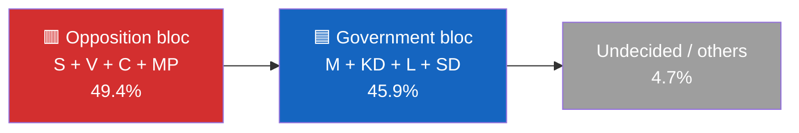
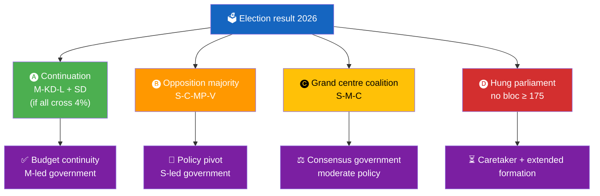

<p align="center">
  
</p>

<h1 align="center">🧩 Coalition Mathematics Template</h1>

<p align="center">
  <strong>📊 Seat-Projection Arithmetic, Pivotal Players, Formation Pathways</strong><br>
  <em>🎯 4% Threshold · 175-Seat Majority · Pivotal Power · Banzhaf Index</em>
</p>

<p align="center">
  <a href="#"></a>
  <a href="#"></a>
  <a href="#"></a>
  <a href="#"></a>
</p>

**📋 Document Owner:** CEO | **📄 Version:** 1.2 | **📅 Last Updated:** 2026-04-25 (UTC)
**🏢 Owner:** Hack23 AB (Org.nr 5595347807) | **🏷️ Classification:** Public

> **📌 Template instructions:** Produce this file for every run. Save as `analysis/daily/${ARTICLE_DATE}/${DOC_TYPE}/coalition-mathematics.md`. Adapt depth to relevance: provide a concise baseline even when coalition arithmetic is low-salience, and expand to full contested-vote / coalition-arithmetic analysis when the document has material government-formation implications. Pair with `voter-segmentation.md` and `scenario-analysis.md`.

> **✨ What to produce:** Current and projected seat distributions, threshold checks for each of the 8 parties, four formation pathways with arithmetic, pivotal-player analysis (Banzhaf / Shapley-Shubik), and the single coalition-breaking signal to watch next.

---

<!-- TEMPLATE_CONTRACT_V1 -->
> **📐 Template Contract** — every fill of this template MUST satisfy this row.
>
> | Slot | Value |
> |------|-------|
> | **Owning methodology** | [`per-artifact-methodologies.md`](../methodologies/per-artifact-methodologies.md#coalition-mathematics) |
> | **Owning gate check** | Check 8 (Family D — seat-count table) — see [`05-analysis-gate.md`](../../.github/prompts/05-analysis-gate.md) |
> | **Required inputs** | `get_voteringar`, party seat polls, `intelligence-assessment.md` |
> | **Horizon band** | mixed (T+30…T+1460) (per [`scripts/horizon-context.ts`](../../scripts/horizon-context.ts)) |
> | **Output family** | Family D — Electoral & Domain |
> | **Aggregation order** | 16 of 30 in canonical order (see [`scripts/render-lib/aggregator/order.ts`](../../scripts/render-lib/aggregator/order.ts)) |
> | **Reader Intelligence Guide** | row generated from `coalition-mathematics.md` (see [`scripts/render-lib/aggregator/reader-guide.ts`](../../scripts/render-lib/aggregator/reader-guide.ts)) |
> | **Canonical evidence anchor** | `\| claim \| evidence (dok_id / vote / MP intressent_id / primary-source URL) \| retrieved_at \| confidence \|` — every analytical claim row uses this schema. |
>
> Cross-reference: [`README.md §Template ↔ Methodology ↔ Gate-Check Matrix`](README.md#-template--methodology--gate-check-matrix).

<!--
AI-FIRST Pass-1 / Pass-2 self-check (HTML comment — invisible in rendered articles; not stripped by aggregator unless under a "## Pass 2 …" heading).

PASS 1 (creation, minimal viable artifact):
  • Fill every REQUIRED slot above; cite ≥ 1 dok_id / vote / MP / primary-source URL per major claim.
  • Use the canonical evidence anchor schema for every analytical claim row.
  • Mermaid blocks use the cyberpunk %%{init: theme/themeVariables}%% prologue and at least one `style …` or `classDef …` directive (Check 5 of 05-analysis-gate.md).

PASS 2 (read-back & improve — AI-FIRST mandatory, ≥ 180 s after Pass 1):
  • Re-read the file end-to-end; for each section verify (a) ≥ 1 evidence anchor row, (b) WEP language tightened (no "may/might/could" hedges), (c) named actors with intressent_id where applicable, (d) Mermaid colour theming present.
  • Banned-phrase scan: "intelligence theatre", "sources say", "reportedly", "it is widely believed", "experts agree", "AI_MUST_REPLACE".
  • Citation density target: ≥ 1 evidence anchor row per 100 words of analytical prose.
  • Neutrality arithmetic: equal analytical depth across the 8 Riksdag parties (S, M, SD, V, MP, C, L, KD); flag and correct any bias in the Pass-2 Self-Audit section.

ANTI-TEMPLATE — DO NOT:
  • Ship plain prose without evidence anchor tables.
  • Leave AI_MUST_REPLACE / [REQUIRED: …] placeholders in the rendered output.
  • Cite a non-primary URL when a `dok_id` or vote record is available.
  • Treat co-occurrence of keywords as coordination; uni-directional chains as bi-directional.
  • Use a Mermaid block without colour theming (Check 5 will block aggregation).
  • Skip the Pass-2 read-back (Check 6 verifies mtime ≥ birth + 180 s OR a differing pass1/ snapshot).
-->

## 🔄 Tradecraft Context

| Element | Value |
|---------|-------|
| **F3EAD Stage** | **ANALYZE** — coalition viability assessment |
| **PIRs Served** | **PIR-1** (Coalition Stability) |
| **Admiralty Floor** | Polling data requires **[B2]** (named pollster, date, sample size); seat projections require **[B2]** methodological source |
| **WEP + ODNI** | Seat-projection outcomes use **WEP** (likely/unlikely/roughly even); confidence based on polling sample + historical accuracy → typically **MODERATE** |
| **Source Diversity Floor** | P1 (coalition viability claims): ≥3 sources (≥2 polls + ≥1 expert model); single poll labeled `[unconfirmed — single source]` |
| **SAT(s) Applied** | Morphological Analysis (seat combinations), What If? (threshold scenarios) |
| **ICD 203 Standards** | 2 (uncertainties — margin of error), 6 (logical argumentation — arithmetic), 9 (visual information) |

---

## 📋 Coalition Context

| Field | Value |
|-------|-------|
| **Coalition-Math ID** | `COM-YYYY-MM-DD-NNN` |
| **Generated** | `YYYY-MM-DD HH:MM UTC` |
| **Baseline poll** | `SIFO YYYY-MM (+ Novus, Demoskop)` |
| **Seats needed for majority** | `175 of 349` |
| **4% threshold at ~80% turnout** | `~370 000 votes` |
| **Overall Confidence** | `🟧 MODERATE (default for polling/seat projections; adjust upward only if evidence supports)` |

---

## 🧮 Current Support Snapshot

| Party | Latest SIFO % | Projected seats | Threshold status |
|:-----:|:-------------:|:---------------:|:----------------:|
| S | 30.8 | 107 | 🟢 safe |
| M | 19.4 | 68 | 🟢 safe |
| SD | 18.3 | 64 | 🟢 safe |
| V | 8.1 | 28 | 🟢 safe |
| C | 6.3 | 22 | 🟢 safe |
| KD | 4.4 | 15 | 🟡 borderline |
| MP | 4.2 | 15 | 🟡 borderline |
| L | 3.8 | 0 | 🔴 below 4 % — **wipe-out risk** |
| Others | 4.7 | 0 | 🔴 below threshold |



---

## 🧪 Threshold Sensitivity

| Party | Margin to 4 % | Probability below threshold | Scenario if eliminated |
|:-----:|:-------------:|:--------------------------:|------------------------|
| L | −0.2 pp | 🔴 High (55 %) | Government bloc loses ~12–15 seats; KD becomes kingmaker |
| KD | +0.4 pp | 🟡 Medium (25 %) | Government bloc loses ~15 seats; coalition impossible |
| MP | +0.2 pp | 🟡 Medium (30 %) | Opposition loses ~15 seats |

---

## 🧭 Formation Pathways



### Pathway A — Continuation Coalition (M-KD-L + SD, confidence)
- **Seats:** M 68 + KD 15 + L (0–13, threshold-dependent) + SD 64 = **147 to 160** → **below 175**
- **Viability:** requires L to survive threshold and unity held
- **Probability:** 40 %
- **Blocker:** L below threshold or SD withdrawal

### Pathway B — Opposition Majority (S-C-MP-V)
- **Seats:** S 107 + C 22 + MP 15 + V 28 = **172** → **below 175 by 3**
- **Viability:** needs either MP/V boost or micro-party failure to reduce denominator
- **Probability:** 25 %
- **Blocker:** seat count just short; MP or C could tip

### Pathway C — Grand Centre Coalition (S-M-C)
- **Seats:** S 107 + M 68 + C 22 = **197** → **above 175**
- **Viability:** arithmetically easy; politically historically unprecedented
- **Probability:** 10 %
- **Blocker:** party-culture taboos

### Pathway D — Hung Parliament / Extended Formation
- **Seats:** no bloc ≥ 175 after small-party fluctuations
- **Probability:** 25 %
- **Outcome:** Statsministeromröstning cycle; 4 attempts before re-election

---

## 🧲 Pivotal-Player Analysis

**Banzhaf index** for each majority scenario (normalised power score):

| Party | Government-bloc scenarios | Opposition-bloc scenarios | Cross-bloc scenarios | Total pivotal power |
|:-----:|:------------------------:|:------------------------:|:-------------------:|:-------------------:|
| SD | 0.33 | — | 0.08 | 0.41 |
| M | 0.25 | — | 0.22 | 0.47 |
| S | — | 0.30 | 0.22 | 0.52 |
| C | — | 0.20 | 0.18 | 0.38 |
| V | — | 0.17 | 0.05 | 0.22 |
| KD | 0.15 | — | 0.04 | 0.19 |
| L | 0.15 | — | 0.02 | 0.17 |
| MP | — | 0.13 | 0.02 | 0.15 |

> **Interpretation:** S retains highest total pivotal power (0.52) thanks to size advantage. SD is the most powerful coalition-dependency player on the government side. C's 0.38 reflects its cross-bloc option value.

---

## ⚖️ Document-Specific Coalition Read-Through

| Document | Likely vote pattern | Arithmetic effect |
|----------|---------------------|-------------------|
| `FiU48` fuel-tax amendment | M, KD, L, SD → Ja; S, V, C, MP → Nej/Avstår | Passes 176 vs 173 (confidence 🟩 HIGH) |
| `HD03239` wind revenue | All parties → Ja | Passes unanimously |
| `HD03237` police training | M, KD, L, SD, (some S) → Ja | Passes with ≥ 200 Ja |

---

## 🚦 Coalition-Breaking Signal — Watch Next

| Signal | What it means | Trigger date |
|--------|---------------|--------------|
| Any coalition-party `Avstår` on FiU48 | Internal fracture | 2026-04-24 chamber vote |
| L falls below 4 % in two consecutive polls | Wipe-out cascade | Next SIFO + Novus |
| SD public statement threatening withdrawal | Confidence-and-supply end | Ongoing |
| C signals openness to S-led coalition | Pathway C activation | Party-conference window |

---

## 📎 Links

| Link | Path |
|------|------|
| Election 2026 analysis | `election-2026-analysis.md` |
| Voter segmentation | `voter-segmentation.md` |
| Scenario analysis | `scenario-analysis.md` |
| Risk assessment | `risk-assessment.md` |

---

**Document Control**
- **Template path:** `/analysis/templates/coalition-mathematics.md`
- **Referenced by:** [ai-driven-analysis-guide.md § Step 5](../methodologies/ai-driven-analysis-guide.md#step-5--extensions-f3ead-analyze-continued)
- **Classification:** Public
- **Next Review:** 2026-07-21

---

## ✅ Pass-2 Self-Audit Checklist (v4.4 — required)

> **Purpose:** AI-FIRST principle requires a Pass-2 read-back-and-improve. After producing this artifact in Pass 1, re-read it end-to-end and verify each item below. Document any remediation in [`methodology-reflection.md`](methodology-reflection.md) §"Pass-2 audit log". Any unchecked ❌ box at the end of Pass 2 forces a Pass-3 rewrite of the affected section.

- [ ] **Tradecraft anchors honoured** — F3EAD stage matches the artifact's role; PIRs declared in the §Tradecraft Context block are actually addressed in the body; Admiralty grades attached to every external source; WEP band + ODNI confidence on every probabilistic judgement.
- [ ] **Source diversity floor met** — at least the minimum number of independent MCP sources required by the artifact's tradecraft block are cited; single-source claims are explicitly labelled `[SINGLE-SOURCE — corroboration pending]`.
- [ ] **Evidence specificity** — every quantified claim cites a `dok_id` (Riksdag), an SCB / IMF dataflow code, or a named external source with date; no "according to data" / "studies show" hand-waves.
- [ ] **Named-actor discipline** — every political claim names ≥ 1 person (party + role + dated act/quote) or labels the absence (`[diffuse — no named actor]`).
- [ ] **Counter-narrative present** — at least one explicit competing hypothesis, dissent quote, or framed objection appears in the body; "no opposition recorded" is itself a finding to label, not silence.
- [ ] **Election 2026 lens applied** — the §"Election 2026 Implications" subsection (or equivalent) addresses electoral salience, coalition pressure, and forward indicators; not boilerplate.
- [ ] **No illustrative content shipped as fact** — every `[REQUIRED]` placeholder is filled OR removed; every `Example:` block is clearly fenced or removed; no fabricated `dok_id`, vote count, or quote leaks into the final artifact.
- [ ] **Cross-references resolve** — every `[link](file.md)` in this artifact points to a file that exists in the run folder (`analysis/daily/$ARTICLE_DATE/$SUBFOLDER/`) or to a methodology / template under `analysis/`.
- [ ] **Mermaid renders** — every fenced ` ```mermaid ` block parses (no missing class definitions, no orphan nodes, no >40-node graphs that overflow viewport on mobile).
- [ ] **Line-floor check** — artifact length ≥ the per-artifact floor in [`reference-quality-thresholds.json`](../methodologies/reference-quality-thresholds.json); shorter artifacts trigger Pass-2 rewrite, never a `[truncated]` note.

