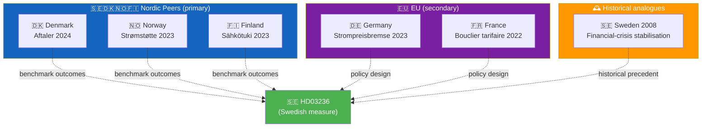

  

<h1 align="center">🌍 Comparative International Analysis Template</h1>

  <strong>📊 Cross-Jurisdictional Benchmarking for Swedish Political Developments</strong> 
  <em>🎯 Nordic Peers · EU · OECD · Historical Analogues · Policy Diffusion</em>

  
  
  
  

**📋 Document Owner:** CEO | **📄 Version:** 1.0 | **📅 Last Updated:** 2026-04-21 (UTC)
**🏢 Owner:** Hack23 AB (Org.nr 5595347807) | **🏷️ Classification:** Public

> **📌 Template instructions:** Produce for P0/P1 documents where a cross-jurisdictional frame adds material insight. Save as `analysis/daily/${ARTICLE_DATE}/${DOC_TYPE}/comparative-international.md`. Data draws from `world-bank`, `scb`, `imf`, and OECD public datasets.

> **✨ What to produce:** A comparison of the Swedish measure against at least five comparator jurisdictions (Nordic primary, EU secondary, OECD/historical tertiary) with standardised dimensions: policy goal, instrument design, outcome to date, cost, transferability.

---

## 🔄 Tradecraft Context

| Element | Value |
|---------|-------|
| **F3EAD Stage** | **ANALYZE** — cross-country contextualisation |
| **PIRs Served** | **PIR-4** (Defence Posture, NATO comparison), **PIR-5** (Fiscal Trajectory, peer benchmarks), **PIR-3** (Migration Policy, EU harmonisation) |
| **Admiralty Floor** | World Bank/OECD statistics require **[A1]**; country-specific policy documents require **[B2]** |
| **WEP + ODNI** | Cross-country parallels use **WEP** (likely/unlikely) with **MODERATE** confidence; avoid claiming "Sweden will follow X" without Swedish-specific evidence |
| **Source Diversity Floor** | P1 (policy trajectory claims): ≥3 sources (≥1 Swedish primary + ≥2 peer-country comparables); avoid single-country analogy |
| **SAT(s) Applied** | Outside-In Thinking (start from external context), What If? (transferability scenarios) |
| **ICD 203 Standards** | 1 (source quality — international data), 6 (logical argumentation), 9 (visual information — comparator map) |

---

## 📋 Comparator Context

| Field | Value |
|-------|-------|
| **Comparative ID** | `CMP-YYYY-MM-DD-NNN` |
| **Generated** | `YYYY-MM-DD HH:MM UTC` |
| **Swedish measure** | `e.g., HD03236 fuel + energy support package` |
| **Primary policy dimension** | `e.g., Cost-of-living fiscal intervention` |
| **Comparator set** | `Denmark · Norway · Finland · Germany · France (+ historical: Sweden 2008)` |
| **Overall Confidence** | `🟩 HIGH` |

---

## 🧭 Comparator Map

---

## 📊 Cross-Jurisdictional Comparison Matrix

> ⚠️ **Illustrative example below — replace every policy name, fiscal figure, CPI effect, and source with run-specific, verified values before publishing.** The numbers in this matrix are drawn from a worked example and must not be copied verbatim as evidence-based claims.

| Dimension | 🇸🇪 Sweden (subject) | 🇩🇰 Denmark | 🇳🇴 Norway | 🇫🇮 Finland | 🇩🇪 Germany | 🇫🇷 France |
|-----------|:-------------------:|:----------:|:----------:|:-----------:|:-----------:|:----------:|
| **Policy name** | HD03236 Fuel + Energy | Aftaler 2024 | Strømstøtte 2023 | Sähkötuki 2023 | Strompreisbremse 2023 | Bouclier tarifaire 2022 |
| **Measure type** | Tax cut + direct support | Targeted rebate | Price-cap subsidy | Direct support | Price cap + cap per kWh | Price freeze + subsidy |
| **Target group** | Rural drivers + households | Low-income households | All households | All households | All households | All households |
| **Fiscal cost (€B / yr)** | ~2.8 | 0.4 | 2.1 | 1.6 | 40 | 110 |
| **Cost per capita (€)** | 260 | 70 | 400 | 290 | 480 | 1 640 |
| **Duration** | 12 months | 6 months | 18 months | 12 months | 24 months | 18 months |
| **Measured effect on CPI** | Projected −0.3 pp | −0.4 pp (actual) | −0.8 pp (actual) | −0.5 pp (actual) | −0.7 pp | −2.3 pp |
| **Political reception** | Polarised, election-timed | Bipartisan | Initially bipartisan | Bipartisan | Polarised | Polarised |
| **EU compatibility signal** | ⚠️ Green Deal tension | ✅ No tension | N/A (non-EU) | ✅ No tension | ⚠️ Reviewed | ⚠️ Reviewed |
| **Source** | HD03236, SCB PR0101 | DK Skattestyrelsen | SSB Strømstatistikk | Tilastokeskus | Bundesfinanzministerium | Ministère Économie |

---

## 🧪 Instrument-Design Comparison

| Feature | Sweden (HD03236) | Best-practice comparator | Gap |
|---------|------------------|--------------------------|-----|
| Targeting mechanism | Flat pump-price reduction | Norway: income-tested rebate | 🟠 HIGH — Sweden's flat cut is regressive |
| Sunset clause | 12 months | Germany: dynamic cap with reassessment at 6 m | 🟡 MEDIUM — review trigger absent |
| EU-Commission coordination | Post-hoc notification likely | Germany: pre-cleared | 🟠 HIGH — state-aid risk |
| Climate-policy compensation | None documented | Finland: paired with renewable incentives | 🟠 HIGH — offsets absent |
| Distributional analysis published | No | Norway: published by SSB | 🟡 MEDIUM |

---

## 🕰️ Historical Analogue — Sweden 2008

- **Context:** Financial-crisis stabilisation package under Reinfeldt government.
- **Parallel:** Large-scale, pre-election fiscal intervention; cost-of-living relief through tax-side levers.
- **Outcome:** Moderate electoral gain for incumbents; opposition framed it as regressive.
- **Relevance to HD03236:** 🟩 HIGH — distributional critique likely to be central campaign narrative again.
- **Source:** Historical analysis, SCB reference tables.

---

## 🌍 Governance Benchmarks (World Bank WGI — latest)

| Indicator | Sweden | Denmark | Norway | Finland | Germany | France |
|-----------|:------:|:-------:|:------:|:-------:|:-------:|:------:|
| Government Effectiveness | 1.89 | 2.01 | 1.93 | 2.04 | 1.77 | 1.30 |
| Regulatory Quality | 1.85 | 2.00 | 1.60 | 1.89 | 1.81 | 1.17 |
| Rule of Law | 1.99 | 2.06 | 2.03 | 2.01 | 1.75 | 1.28 |
| Control of Corruption | 2.15 | 2.28 | 2.13 | 2.19 | 1.86 | 1.26 |
| Voice & Accountability | 1.51 | 1.63 | 1.64 | 1.63 | 1.42 | 1.19 |

> **Interpretation:** Sweden retains top-quartile rule-of-law and anti-corruption scores. A fuel-tax cut challenging EU-state-aid compatibility carries outsized reputational downside relative to Denmark or Finland, whose packages were pre-cleared.

---

## 📘 Policy-Transfer Assessment

| Question | Answer | Evidence |
|----------|--------|----------|
| Has Sweden implemented this type of measure before? | Yes, 2022 electricity-price support | Prior riksmöte record |
| Is the instrument already established in peer countries? | Yes, widely | See comparison matrix |
| Does Sweden's design reflect best-practice elements? | Partially | See instrument-design table |
| Main transferability risk | Regressive targeting + Green-Deal tension | HD03236 analysis |

---

## ⚠️ Risks Highlighted by International Comparison

| Risk | Level | International evidence |
|------|:-----:|-----------------------|
| State-aid / EU-Commission pushback | 🟠 HIGH | Germany faced 9-month review |
| Regressive fiscal incidence | 🟠 HIGH | Sweden 2008 analogue |
| Climate-policy coherence challenge | 🟠 HIGH | Norway paired support with renewables |
| Electoral-timing perception | 🟡 MEDIUM | France 2022 pre-election parallel |

---

## 📎 Links & Sources

| Source | Description |
|--------|-------------|
| `world-bank` MCP — WGI indicators | Governance benchmarks |
| `imf` (scripted) — WEO | Fiscal forecasts |
| `scb` MCP — PR0101 | Swedish consumer-price index |
| OECD Economic Outlook | Cross-country fiscal context |
| National ministry portals | Denmark, Norway, Finland, Germany, France source documents |

---

**Document Control**
- **Template path:** `/analysis/templates/comparative-international.md`
- **Also known as:** `international-comparative.md` (filename variant — content identical)
- **Referenced by:** [ai-driven-analysis-guide.md § Step 5](../methodologies/ai-driven-analysis-guide.md#step-5--extensions-family-c--d-produced-when-warranted)
- **Classification:** Public
- **Next Review:** 2026-07-21
