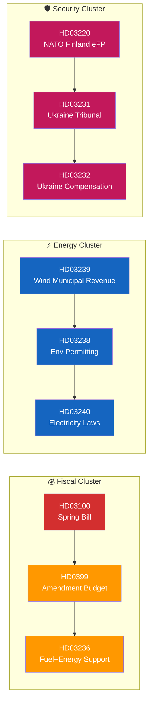

<p align="center">
  
</p>

<h1 align="center">🔗 Cross-Reference Map Template</h1>

<p align="center">
  <strong>📊 Structural Map of Relationships Across Downloaded Documents</strong><br>
  <em>🎯 Policy Clusters · Legislative Chains · Coordinated Activity · Temporal Alignment</em>
</p>

<p align="center">
  <a href="#"></a>
  <a href="#"></a>
  <a href="#"></a>
  <a href="#"></a>
</p>

**📋 Document Owner:** CEO | **📄 Version:** 1.2 | **📅 Last Updated:** 2026-04-25 (UTC)
**🏢 Owner:** Hack23 AB (Org.nr 5595347807) | **🏷️ Classification:** Public

> **📌 Template instructions:** Produce one `cross-reference-map.md` per workflow folder. It connects the documents in the current run to each other and to documents from earlier runs. Save as `analysis/daily/${ARTICLE_DATE}/${DOC_TYPE}/cross-reference-map.md`.

> **✨ What to produce:** At least five concrete cross-document relationships per workflow folder, with Mermaid visualisation. Every relationship ties specific `dok_id`s to a typed relationship (policy cluster, legislative chain, opposition strategy, coalition signal, temporal alignment).

---

## 🔄 Tradecraft Context

| Field | Value |
|-------|-------|
| **F3EAD stage** | `Exploit` (connecting documents into patterns for downstream Analyze) |
| **PIRs** | `coalition-stability, democratic-norms — cross-document relationships reveal coordination` |
| **Admiralty floor** | `A1 for primary dok_id links; B2 acceptable for inferred narrative linkages` |
| **SATs used** | `Analysis of Competing Hypotheses; Link Analysis; Pattern Recognition` |
| **ICD 203 standards applied** | `sources, argumentation, visual information` |

> See [`political-style-guide.md`](../methodologies/political-style-guide.md) for canonical F3EAD / PIR catalog / Admiralty Code / ICD 203 / WEP / SATs definitions.

---

## 📋 Context

| Field | Value |
|-------|-------|
| **Map ID** | `XRF-YYYY-MM-DD-NNN` |
| **Generated** | `YYYY-MM-DD HH:MM UTC` |
| **Scope** | `e.g., propositions 2026-04-20` |
| **Documents in scope** | `N` |
| **Relationships identified** | `N` |
| **Overall Confidence** | `🟩 HIGH / 🟧 MEDIUM / 🟥 LOW` |

---

## 🗺️ Cross-Reference Overview



---

## 🧷 Relationship Register

| # | Type | Documents | Significance (1–10) | Confidence | Summary |
|:-:|------|-----------|:-------------------:|:----------:|---------|
| XR-01 | 📦 Policy cluster | HD03100, HD0399, HD03236 | 9 | 🟩 HIGH | Fiscal package: spring bill → amendment → cost-of-living relief |
| XR-02 | ⚙️ Legislative chain | HD03239 → HD03238 → HD03240 | 8 | 🟩 HIGH | Municipal wind revenue requires permitting agency and new electricity-market rules |
| XR-03 | ⚔️ Opposition strategy | HD11680, HD11683, HD11679 | 7 | 🟧 MEDIUM | Coordinated S-party interpellations on foreign policy filed same day |
| XR-04 | 🧩 Coalition signal | HD03237, HD03246 | 8 | 🟩 HIGH | Two justice bills fulfil SD coalition commitments |
| XR-05 | ⏱️ Temporal alignment | HD01CU22, HD01CU27, HD01CU28 | 6 | 🟧 MEDIUM | Three CU reports land same day — committee clear-out pattern |

> **Each relationship must be backed by at least one concrete cross-cited element** (shared policy domain keyword, shared sponsor, shared committee, shared date, or explicit textual reference).

---

## 🔀 Relationship Types — When to Use Each

| Type | Definition | Evidence Standard |
|------|------------|-------------------|
| 📦 **Policy cluster** | ≥ 2 documents addressing the same policy area within a short window | Shared keyword + shared committee or common political domain |
| ⚙️ **Legislative chain** | Proposition → committee report → vote sequence | Explicit textual references or identical bill numbers |
| ⚔️ **Opposition strategy** | Coordinated motions, interpellations, or written questions | Same filer / party group and shared topic |
| 🧩 **Coalition signal** | Documents revealing coalition tension or alignment | Shared co-sponsors or party-group votes |
| ⏱️ **Temporal alignment** | Same-day or same-week clustering suggesting coordinated timing | Publication date alignment |
| 🌍 **External parallel** | Document aligns with EU, NATO, OECD, or peer-country action | Named external instrument or directive |
| 🕰️ **Historical parallel** | Document mirrors a prior riksmöte's action | Named prior dok_id with outcome |

---

## 📊 Cluster Deep-Dive — Example Structure (repeat per cluster)

### Cluster XR-01 — Fiscal Cluster

- **Documents:** HD03100 (Spring Bill), HD0399 (Amendment Budget), HD03236 (Fuel + Energy Support)
- **Political domain:** Fiscal / Cost-of-living
- **Sponsors:** Finance Minister **Elisabeth Svantesson (M)**
- **Committee referral:** Finansutskottet (FiU)
- **Legislative path:** Prop → FiU → Kammaren, expected vote `YYYY-MM-DD`
- **Why this cluster matters:** The three documents together form the government's April 2026 cost-of-living package — the fiscal credibility test before the September 2026 election.
- **Cross-link impact:** Voter-segment impact concentrated in Segments 1 & 2 (rural drivers, suburban homeowners); policy effect measurable by pump-price by early July 2026.
- **Confidence:** 🟩 HIGH — all three documents confirmed via `get_propositioner` with full text.

---

## 🧭 Coverage Check

| Relationship Count | Verdict |
|:------------------:|---------|
| 0 | 🔴 FAIL — rerun with broader search window |
| 1–4 | 🟡 THIN — try adding temporal alignment or external parallels |
| 5–9 | 🟢 ADEQUATE |
| ≥ 10 | 🟢🟢 RICH — use in synthesis as narrative anchor |

---

## 🔁 Update Triggers

| Trigger | Action |
|---------|--------|
| New document arrives that matches an existing cluster | Add to relationship register, bump significance if warranted |
| Vote outcome lands | Update `Legislative chain` entry with result |
| Related document from prior riksmöte surfaces | Add `Historical parallel` entry |

---

**Document Control**
- **Template path:** `/analysis/templates/cross-reference-map.md`
- **Referenced by:** [ai-driven-analysis-guide.md § Step 4](../methodologies/ai-driven-analysis-guide.md#step-4--core-synthesis-family-a-always-produced)
- **Classification:** Public
- **Next Review:** 2026-07-21

---

## ✅ Pass-2 Self-Audit Checklist (v4.4 — required)

> **Purpose:** AI-FIRST principle requires a Pass-2 read-back-and-improve. After producing this artifact in Pass 1, re-read it end-to-end and verify each item below. Document any remediation in [`methodology-reflection.md`](methodology-reflection.md) §"Pass-2 audit log". Any unchecked ❌ box at the end of Pass 2 forces a Pass-3 rewrite of the affected section.

- [ ] **Tradecraft anchors honoured** — F3EAD stage matches the artifact's role; PIRs declared in the §Tradecraft Context block are actually addressed in the body; Admiralty grades attached to every external source; WEP band + ODNI confidence on every probabilistic judgement.
- [ ] **Source diversity floor met** — at least the minimum number of independent MCP sources required by the artifact's tradecraft block are cited; single-source claims are explicitly labelled `[SINGLE-SOURCE — corroboration pending]`.
- [ ] **Evidence specificity** — every quantified claim cites a `dok_id` (Riksdag), an SCB / IMF dataflow code, or a named external source with date; no "according to data" / "studies show" hand-waves.
- [ ] **Named-actor discipline** — every political claim names ≥ 1 person (party + role + dated act/quote) or labels the absence (`[diffuse — no named actor]`).
- [ ] **Counter-narrative present** — at least one explicit competing hypothesis, dissent quote, or framed objection appears in the body; "no opposition recorded" is itself a finding to label, not silence.
- [ ] **Election 2026 lens applied** — the §"Election 2026 Implications" subsection (or equivalent) addresses electoral salience, coalition pressure, and forward indicators; not boilerplate.
- [ ] **No illustrative content shipped as fact** — every `[REQUIRED]` placeholder is filled OR removed; every `Example:` block is clearly fenced or removed; no fabricated `dok_id`, vote count, or quote leaks into the final artifact.
- [ ] **Cross-references resolve** — every `[link](file.md)` in this artifact points to a file that exists in the run folder (`analysis/daily/$ARTICLE_DATE/$SUBFOLDER/`) or to a methodology / template under `analysis/`.
- [ ] **Mermaid renders** — every fenced ` ```mermaid ` block parses (no missing class definitions, no orphan nodes, no >40-node graphs that overflow viewport on mobile).
- [ ] **Line-floor check** — artifact length ≥ the per-artifact floor in [`reference-quality-thresholds.json`](../methodologies/reference-quality-thresholds.json); shorter artifacts trigger Pass-2 rewrite, never a `[truncated]` note.

