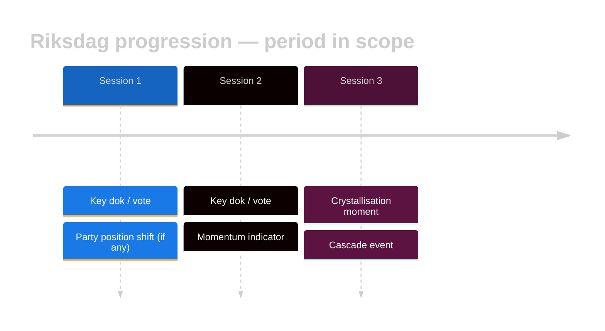

<!-- SPDX-FileCopyrightText: 2024-2026 Hack23 AB -->
<!-- SPDX-License-Identifier: Apache-2.0 -->

# 🔄 Cross-Session Intelligence Template — Riksmöte Progression

> **📌 Template Instructions** — Copy to `analysis/daily/$ARTICLE_DATE/$SUBFOLDER/cross-session-intelligence.md`. Used by `weekly-review`, `monthly-review`, and quarterly aggregation runs. See [`per-artifact-methodologies.md §cross-session-intelligence`](../methodologies/per-artifact-methodologies.md#cross-session-intelligence).

> **🎯 Purpose** — Narrate the progression of parliamentary politics **across Riksdag sessions** within a period (week / month / quarter). Distinct from [`cross-run-diff.md`](cross-run-diff.md) (which is cross-run of the *same* article type on consecutive days). This file is the **session-over-session** story: how the political programme matured, where momentum accelerated, which session was the crystallisation moment.

## 🔄 Tradecraft Context

- **Primary analytical question** — How did the political agenda, coalition geometry, and substantive legislative momentum evolve across the sessions in scope, and which sitting functioned as the decisive crystallisation point?
- **Scope discipline** — Compare **sessions within the same review period** (week / month / quarter) and the same riksmöte. This template is for **cross-session progression**, not consecutive-day same-artifact change tracking (that belongs in `cross-run-diff.md`).
- **Required evidence base** — Ground every progression claim in traceable parliamentary evidence: `dok_id`, proposition / betänkande references, vote outcomes, committee handling, party statements, speaker interventions, dated session markers.
- **Analytical method** — Identify the baseline session, track each subsequent acceleration / stall / reversal, separate procedural movement from substantive political change, distinguish noise from durable agenda-setting.
- **Output standard** — Explain *what changed, when it changed, why that session mattered,* and *what the progression implies for the next period*.

---

## 📋 Document Metadata

| Field | Value |
|-------|-------|
| **Report ID** | `[REQUIRED: CSI-YYYY-MM-DD-runNN]` |
| **Period Covered** | `[REQUIRED: e.g. Week 17 2026, Apr 2026, Q2 2026]` |
| **Sessions in Scope** | `[REQUIRED: ≥ 2 plenary sittings]` |
| **Riksmöte** | `[REQUIRED: e.g. 2025/26]` |
| **Confidence** | `[REQUIRED: 🟢 / 🟡 / 🔴]` |

---

## 1️⃣ Session Overview

| Session | Dates | Sitting days | Kammaren / utskott fokus | Antagna texter | Voteringar | Tema |
|---------|-------|:------------:|--------------------------|:--------------:|:----------:|------|
| `[REQUIRED]` | `[REQUIRED]` | `[#]` | `[Kammaren / FiU / …]` | `[#]` | `[#]` | `[REQUIRED: 1-line theme]` |
| `[REQUIRED]` | `[REQUIRED]` | `[#]` | `[…]` | `[#]` | `[#]` | `[…]` |
| `[REQUIRED]` | `[REQUIRED]` | `[#]` | `[…]` | `[#]` | `[#]` | `[…]` |

**Period totals** — `[# sitting days]`, `[# antagna betänkanden / propositioner]`, `[# voteringar]`, `[# anföranden]`, `[# interpellationer]`.

---

## 2️⃣ Progression Diagram

Replace placeholders with actual dok_id / MP / vote references.

---

## 3️⃣ Momentum Narrative

One page (≥ 15 lines) narrating the arc of the period. Required beats:

1. **Opening stance** — where positions sat at the start of the period.
2. **Inflection points** — the specific session, debate, or vote that shifted momentum (cite `dok_id` and vote tally).
3. **Peak** — the crystallisation moment (name it).
4. **Trailing indicators** — what stabilised or rebounded after the peak.
5. **Close** — where positions stand at period end.

Every named actor must come with role + `intressent_id` (for MPs) or myndighet name.

---

## 4️⃣ Cross-Session Cluster Map

Identify policy clusters that span ≥ 2 sessions in the period:

| Cluster | Sessions touched | Key dok_ids | Lead MPs / parties | Stage progression |
|---------|:----------------:|-------------|--------------------|-------------------|
| `[REQUIRED: e.g. klimat / försvar / sjukvård]` | `[list]` | `[dok_ids]` | `[MPs / parties]` | `[motion → utskott → kammaren → beslut]` |

---

## 5️⃣ Vote-Discipline Time-Series

| Party | Session 1 discipline % | Session 2 % | Session 3 % | Δ |
|-------|:----------------------:|:-----------:|:-----------:|:-:|
| S | `[%]` | `[%]` | `[%]` | `[±]` |
| M | `[%]` | `[%]` | `[%]` | `[±]` |
| SD | `[%]` | `[%]` | `[%]` | `[±]` |
| V | `[%]` | `[%]` | `[%]` | `[±]` |
| MP | `[%]` | `[%]` | `[%]` | `[±]` |
| C | `[%]` | `[%]` | `[%]` | `[±]` |
| L | `[%]` | `[%]` | `[%]` | `[±]` |
| KD | `[%]` | `[%]` | `[%]` | `[±]` |

Discipline definition — % of party MPs voting with majority of their party caucus.

---

## 6️⃣ Coalition Formation Events

| Session | Coalition tried | Issue | Outcome | Pivotal MPs |
|---------|-----------------|-------|---------|-------------|
| `[REQUIRED]` | `[e.g. M+KD+L+SD]` | `[dok_id + 1-line]` | `[won / lost / abstained-block]` | `[MPs + intressent_id]` |

---

## 7️⃣ Momentum Indicators (for next period's forward-indicators.md)

- **Accelerating issue** — `[REQUIRED]` (cite sessions)
- **Decelerating issue** — `[REQUIRED]`
- **Dormant-but-primed** — `[REQUIRED]` (e.g. a motion withdrawn but refileable)
- **External trigger watched** — `[REQUIRED]` (e.g. EU council vote, Riksbank decision)

---

## 8️⃣ Period Quality Check

- All sessions in `session-baseline.md` covered — `[✅/❌]`.
- ≥ 2 independent data sources per session — `[✅/❌]`.
- Party-neutrality arithmetic across sessions — `[✅/❌]` (see `reference-analysis-quality §4`).
- Narrative does not favour any party — `[✅/❌]` (self-audit in `methodology-reflection.md`).

---

## 🔗 Cross-References

- Methodology: [`../methodologies/per-artifact-methodologies.md#cross-session-intelligence`](../methodologies/per-artifact-methodologies.md#cross-session-intelligence)
- Baseline: [`session-baseline.md`](session-baseline.md)
- Prior aggregation runs: `[REQUIRED: list siblings in analysis/daily/…]`
- Data source: `get_calendar_events`, `search_voteringar`, `search_dokument`, `search_anforanden`
