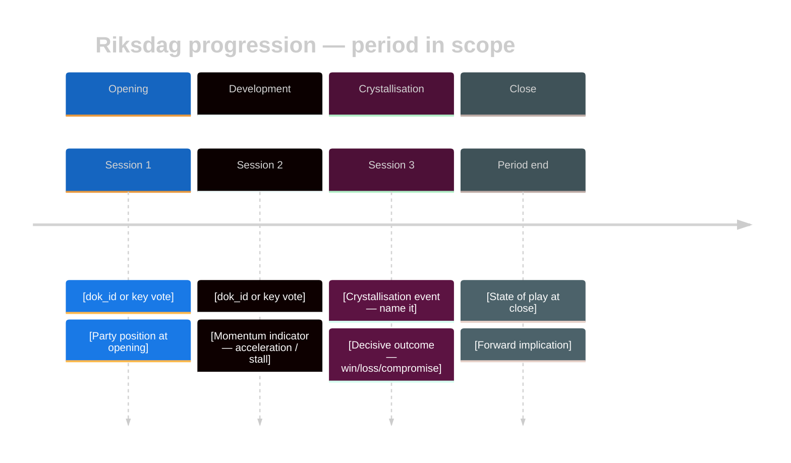
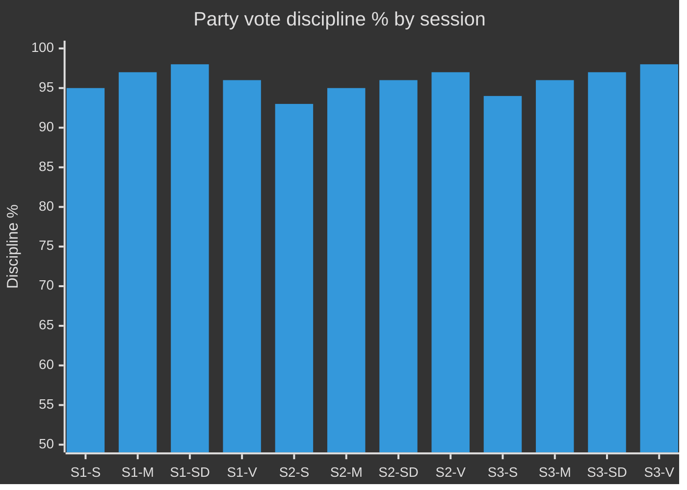

<!-- SPDX-FileCopyrightText: 2024-2026 Hack23 AB -->
<!-- SPDX-License-Identifier: Apache-2.0 -->

# 🔄 Cross-Session Intelligence Template — Riksmöte Progression

> **📌 Template Instructions** — Copy to `analysis/daily/$ARTICLE_DATE/$SUBFOLDER/cross-session-intelligence.md`. Used by `weekly-review`, `monthly-review`, and quarterly aggregation runs. See [`per-artifact-methodologies.md §cross-session-intelligence`](../methodologies/per-artifact-methodologies.md#cross-session-intelligence).

> **🎯 Purpose** — Narrate the progression of parliamentary politics **across Riksdag sessions** within a period (week / month / quarter). Distinct from [`cross-run-diff.md`](cross-run-diff.md) (which is cross-run of the *same* article type on consecutive days). This file is the **session-over-session** story: how the political programme matured, where momentum accelerated, which session was the crystallisation moment.

## 🔄 Tradecraft Context

- **F3EAD stage** — Exploit + Analyse: synthesises the factual record from `session-baseline.md` into narrative intelligence about political progression; builds judgment about momentum, coalition geometry, and agenda-setting; feeds `forward-indicators.md`
- **Primary analytical question** — How did the political agenda, coalition geometry, and substantive legislative momentum evolve across the sessions in scope, and which sitting functioned as the decisive crystallisation point?
- **Scope discipline** — Compare **sessions within the same review period** (week / month / quarter) and the same riksmöte. This template is for **cross-session progression**, not consecutive-day same-artifact change tracking (that belongs in `cross-run-diff.md`)
- **Required evidence base** — Ground every progression claim in traceable parliamentary evidence: `dok_id`, proposition / betänkande references, vote outcomes, committee handling, party statements, speaker interventions, dated session markers
- **Analytical method** — Identify the baseline session, track each subsequent acceleration / stall / reversal, separate procedural movement from substantive political change, distinguish noise from durable agenda-setting
- **Output standard** — Explain *what changed, when it changed, why that session mattered,* and *what the progression implies for the next period*
- **Counter-narrative discipline** — Every momentum claim must include a competing interpretation (even if weaker); silence is not counter-narrative

---

<!-- TEMPLATE_CONTRACT_V1 -->
> **📐 Template Contract** — every fill of this template MUST satisfy this row.
>
> | Slot | Value |
> |------|-------|
> | **Owning methodology** | [`per-artifact-methodologies.md`](../methodologies/per-artifact-methodologies.md#cross-session-intelligence) |
> | **Owning gate check** | Supplementary Check 11 (Tier-C aggregation) — see [`05-analysis-gate.md`](../../.github/prompts/05-analysis-gate.md) |
> | **Required inputs** | past Riksdag-session run folders |
> | **Horizon band** | mixed (week/month/quarter) (per [`scripts/horizon-context.ts`](../../scripts/horizon-context.ts)) |
> | **Output family** | Operational Supplementary |
> | **Aggregation order** | appended (alphabetical, after canonical block) (see [`scripts/render-lib/aggregator/order.ts`](../../scripts/render-lib/aggregator/order.ts)) |
> | **Reader Intelligence Guide** | row generated from `cross-session-intelligence.md` (see [`scripts/render-lib/aggregator/reader-guide.ts`](../../scripts/render-lib/aggregator/reader-guide.ts)) |
> | **Canonical evidence anchor** | `\| claim \| evidence (dok_id / vote / MP) \| retrieved_at \| confidence \|` — every analytical claim row uses this schema. |
>
> Cross-reference: [`README.md §Template ↔ Methodology ↔ Gate-Check Matrix`](README.md#-template--methodology--gate-check-matrix).

<!--
AI-FIRST Pass-1 / Pass-2 self-check (HTML comment — invisible in rendered articles; not stripped by aggregator unless under a "## Pass 2 …" heading).

PASS 1 (creation, minimal viable artifact):
  • Fill every REQUIRED slot above; cite ≥ 1 dok_id / vote / MP / primary-source URL per major claim.
  • Use the canonical evidence anchor schema for every analytical claim row.
  • Mermaid blocks use the cyberpunk %%{init: theme/themeVariables}%% prologue and at least one `style …` or `classDef …` directive (Check 5 of 05-analysis-gate.md).

PASS 2 (read-back & improve — AI-FIRST mandatory, ≥ 180 s after Pass 1):
  • Re-read the file end-to-end; for each section verify (a) ≥ 1 evidence anchor row, (b) WEP language tightened (no "may/might/could" hedges), (c) named actors with intressent_id where applicable, (d) Mermaid colour theming present.
  • Banned-phrase scan: "intelligence theatre", "sources say", "reportedly", "it is widely believed", "experts agree", "AI_MUST_REPLACE".
  • Citation density target: ≥ 1 evidence anchor row per 100 words of analytical prose.
  • Neutrality arithmetic: equal analytical depth across the 8 Riksdag parties (S, M, SD, V, MP, C, L, KD); flag and correct any bias in the Pass-2 Self-Audit section.

ANTI-TEMPLATE — DO NOT:
  • Ship plain prose without evidence anchor tables.
  • Leave AI_MUST_REPLACE / [REQUIRED: …] placeholders in the rendered output.
  • Cite a non-primary URL when a `dok_id` or vote record is available.
  • Treat co-occurrence of keywords as coordination; uni-directional chains as bi-directional.
  • Use a Mermaid block without colour theming (Check 5 will block aggregation).
  • Skip the Pass-2 read-back (Check 6 verifies mtime ≥ birth + 180 s OR a differing pass1/ snapshot).
-->

## 📋 Document Metadata

| Field | Value |
|-------|-------|
| **Report ID** | `[REQUIRED: CSI-YYYY-MM-DD-runNN]` |
| **Period Covered** | `[REQUIRED: e.g. Week 17 2026, Apr 2026, Q2 2026]` |
| **Sessions in Scope** | `[REQUIRED: ≥ 2 plenary sittings; list dates]` |
| **Riksmöte** | `[REQUIRED: e.g. 2025/26]` |
| **Confidence** | `[REQUIRED: 🟢 / 🟡 / 🔴 with 1-line rationale]` |
| **Baseline session** | `[REQUIRED: date of opening session; this is the anchor]` |
| **Crystallisation session** | `[REQUIRED: date of the most consequential session in the period]` |

---

## 1️⃣ Session Overview

| Session | Dates | Sitting days | Kammaren / utskott fokus | Antagna texter | Voteringar | Avg discipline % | Tema |
|---------|-------|:------------:|--------------------------|:--------------:|:----------:|:----------------:|------|
| `[REQUIRED]` | `[REQUIRED]` | `[#]` | `[Kammaren / FiU / JuU / …]` | `[#]` | `[#]` | `[%]` | `[REQUIRED: 1-line theme]` |
| `[REQUIRED]` | `[REQUIRED]` | `[#]` | `[…]` | `[#]` | `[#]` | `[%]` | `[…]` |
| `[REQUIRED]` | `[REQUIRED]` | `[#]` | `[…]` | `[#]` | `[#]` | `[%]` | `[…]` |

**Period totals** — `[# sitting days]`, `[# antagna betänkanden / propositioner]`, `[# voteringar]`, `[# anföranden]`, `[# interpellationer]`, `[# skriftliga frågor]`.

**Period average coalition margin** — `[# seats over 175 majority; list range min–max across votes]`

---

## 2️⃣ Progression Diagram



Replace placeholders with actual dok_id / MP / vote references. Every timeline event must name ≥ 1 concrete document or vote.

---

## 3️⃣ Momentum Narrative

> **Minimum 15 lines** (Standard) / **25 lines** (Deep) / **40 lines** (Comprehensive). This is the analytical core of the artifact. Do not summarise session-baseline.md — interpret the *pattern of change*.

Required narrative beats (each must cite at least one source):

1. **Opening stance** — Describe precisely where positions sat at the start of the period. Name the dominant party bloc and opposition stance with reference to the first session's key votes (dok_id). Avoid "the parties disagreed" without naming them and citing evidence.

2. **Inflection points** — Name the specific session, debate, or vote that shifted momentum. Cite `dok_id`, vote tally, and date. If there were multiple inflection points, rank them by significance. "Momentum shifted on [date] when [party] [action] with [vote result]" — this level of specificity is required.

3. **Peak / crystallisation** — Name the crystallisation moment: the single session or vote that determined the period's political direction. Explain why this session mattered more than the others.

4. **Counter-narrative** — `[COUNTER-NARRATIVE]` — present the strongest competing interpretation. Example: "An alternative reading is that what appeared as a coalition shift was actually [X]…". This is mandatory even if the counter-narrative is weak; its weakness should be explained.

5. **Trailing indicators** — What stabilised or rebounded after the peak? Did any party adjust its position post-crystallisation? Cite any public statements (anföranden dok_id) or press releases.

6. **Close** — Where do positions stand at period end relative to the opening? Net gain/loss per bloc? Any issues that are primed for the next period?

Every named actor must come with role + `intressent_id` (for MPs) or myndighet name + dated reference.

---

## 4️⃣ Cross-Session Cluster Map

Identify policy clusters that span ≥ 2 sessions in the period. A cluster = a set of related documents (motions, betänkanden, propositioner, interpellationer) around a single policy theme.

| Cluster | Sessions touched | Key dok_ids | Lead MPs / parties | Stage progression | End-of-period status |
|---------|:----------------:|-------------|--------------------|-------------------|---------------------|
| `[e.g. Klimat / Energi]` | `[list session dates]` | `[dok_ids]` | `[MPs + intressent_id]` | `[motion → utskott → kammaren → beslut / stalled]` | `[adopted / withdrawn / carried to next period]` |
| `[e.g. Försvar]` | `[list]` | `[dok_ids]` | `[MPs]` | `[prop. → FöU → kammaren]` | `[…]` |
| `[e.g. Sjukvård]` | `[list]` | `[dok_ids]` | `[MPs]` | `[…]` | `[…]` |

**Cluster analysis** — [1–2 sentences: which cluster showed the most momentum? which stalled? what does the cluster map imply about the legislative programme's actual pace?]

---

## 5️⃣ Vote-Discipline Time-Series

> Source: `search_voteringar` grouped by `parti` per session. Discipline definition: % of party MPs voting with majority of their party caucus in each session. Δ column = Session N vs Session 1.

| Party | Session 1 % | Session 2 % | Session 3 % | Δ (S1→SN) | Trend | Interpretation |
|-------|:-----------:|:-----------:|:-----------:|:---------:|:-----:|----------------|
| S | `[%]` | `[%]` | `[%]` | `[±]` | ↑/↓/→ | `[1-line: e.g. cohesion increasing as opposition unified against budget]` |
| M | `[%]` | `[%]` | `[%]` | `[±]` | ↑/↓/→ | |
| SD | `[%]` | `[%]` | `[%]` | `[±]` | ↑/↓/→ | |
| V | `[%]` | `[%]` | `[%]` | `[±]` | ↑/↓/→ | |
| MP | `[%]` | `[%]` | `[%]` | `[±]` | ↑/↓/→ | |
| C | `[%]` | `[%]` | `[%]` | `[±]` | ↑/↓/→ | |
| L | `[%]` | `[%]` | `[%]` | `[±]` | ↑/↓/→ | |
| KD | `[%]` | `[%]` | `[%]` | `[±]` | ↑/↓/→ | |

**Discipline chart:**



*Replace sample values with actual computed discipline percentages.*

**Discipline interpretation** — [1–2 sentences: which party showed the most volatility? does declining discipline correlate with specific issue clusters? cite defectors by name + intressent_id if ≥ 2 named breakaways in any session]

---

## 6️⃣ Coalition Formation Events

> Record every cross-bloc vote coalition that formed and dissolved in the period. Distinguish **structural** (recurring cross-bloc alignment) from **tactical** (one-off for a specific vote).

| Session | Date | Issue | Coalition formed | dok_id | Outcome | Pivotal MPs | Type |
|---------|:----:|-------|-----------------|--------|---------|-------------|:----:|
| `[REQUIRED]` | `[YYYY-MM-DD]` | `[1-line]` | `[e.g. M+KD+L+SD]` | `[dok_id]` | `[won / lost / abstained-block]` | `[MPs + intressent_id if decisive]` | `[structural / tactical]` |

**Cross-bloc pattern analysis:**
- Tidö coalition stability: `[consistently held / fractured on [issue]]`
- Opposition unified front: `[consistently unified / split on [issue]]`
- Structural alliance outside Tidö: `[any recurring M+C or S+MP pattern? cite evidence]`
- Pivotal single-party behaviour: `[any party consistently breaking bloc? cite sessions + votes]`

---

## 7️⃣ Agenda-Setting Analysis

> Who controlled the agenda in this period? Did the government set the terms, or did the opposition succeed in forcing debates on their preferred ground?

| Agenda-setter | Issue | Mechanism | Sessions affected | Evidence | Outcome |
|---------------|-------|-----------|:-----------------:|----------|---------|
| `[Government / Opposition party / Utskott / External event]` | `[1-line]` | `[prop. filing / interpellation campaign / media pressure / external event]` | `[list]` | `[dok_ids + anföranden]` | `[succeeded / partially / failed]` |

**Agenda dominance score:**
- Government-originated items as % of period legislative output: `[%]`
- Opposition-forced debates as % of total anföranden: `[%]`
- External-event-driven items (EU, NATO, economic data): `[%]`

**Counter-narrative on agenda-setting:** `[COUNTER-NARRATIVE]` — [present alternative reading of who was actually in control; e.g. "While government appeared to control the calendar, opposition interpellation pressure on [issue] effectively forced a floor debate the government had sought to avoid"]

---

## 8️⃣ Momentum Indicators (for next period's `forward-indicators.md`)

> Every item here must appear in `forward-indicators.md` with a dated trigger.

- **Accelerating issue** — `[REQUIRED: name issue + sessions showing acceleration + supporting dok_id]`
  - *Projected continuation:* `[WEP tag — e.g. "Very likely (85 %) to advance to kammaren vote in next period based on FiU timetable"]`
- **Decelerating issue** — `[REQUIRED: name issue + evidence of deceleration + reasons]`
  - *Projected continuation:* `[WEP tag]`
- **Dormant-but-primed** — `[REQUIRED: a motion withdrawn but refileable, a bill stalled in committee, an interpellation unanswered — name it with dok_id]`
  - *Re-activation trigger:* `[identify the specific event that would reactivate it]`
- **External trigger watched** — `[REQUIRED: external event that could change the period's momentum — e.g. EU council vote, Riksbank decision, SÄPO threat assessment, IMF WEO release]`
  - *Expected date:* `[YYYY-MM-DD]`
  - *Impact channel:* `[which issue cluster would this affect?]`

---

## 9️⃣ Period Quality Check

| Check | Status | Evidence |
|-------|:------:|---------|
| All sessions in `session-baseline.md` covered | `[✅/❌]` | `[list sessions confirmed]` |
| ≥ 2 independent data sources per session | `[✅/❌]` | `[list sources per session]` |
| Party-neutrality arithmetic across sessions | `[✅/❌]` | `[confirm representation balance — see reference-analysis-quality §4]` |
| Narrative does not favour any party | `[✅/❌]` | `[self-audit note in methodology-reflection.md §Pass-2]` |
| Counter-narrative present in §3 | `[✅/❌]` | `[quote the counter-narrative sentence]` |
| Forward indicators (§8) linked in forward-indicators.md | `[✅/❌]` | `[confirm links]` |
| Coalition formation events cited with dok_id | `[✅/❌]` | `[list dok_ids]` |
| Every named MP carries intressent_id | `[✅/❌]` | `[spot-check 5 names]` |

---

## 🔗 Cross-References

- Methodology: [`../methodologies/per-artifact-methodologies.md#cross-session-intelligence`](../methodologies/per-artifact-methodologies.md#cross-session-intelligence)
- Baseline: [`session-baseline.md`](session-baseline.md) — all session facts source from here
- Prior aggregation runs: `[REQUIRED: list sibling runs in analysis/daily/… with their dates]`
- Forward: [`forward-indicators.md`](forward-indicators.md) — §8 momentum indicators feed here
- Coalition arithmetic: [`coalition-mathematics.md`](coalition-mathematics.md) — vote arithmetic for §6
- Data source: `get_calendar_events`, `search_voteringar`, `search_dokument`, `search_anforanden`, `get_betankanden`

---

**Template version:** v2.0 · **Last updated:** 2026-04-25

---

## ✅ Pass-2 Self-Audit Checklist (v4.4 — required)

> **Purpose:** AI-FIRST principle requires a Pass-2 read-back-and-improve. After producing this artifact in Pass 1, re-read it end-to-end and verify each item below. Document any remediation in [`methodology-reflection.md`](methodology-reflection.md) §"Pass-2 audit log". Any unchecked ❌ box at the end of Pass 2 forces a Pass-3 rewrite of the affected section.

- [ ] **Tradecraft anchors honoured** — F3EAD stage matches the artifact's role; PIRs declared in the §Tradecraft Context block are actually addressed in the body; Admiralty grades attached to every external source; WEP band + ODNI confidence on every probabilistic judgement.
- [ ] **Source diversity floor met** — at least the minimum number of independent MCP sources required by the artifact's tradecraft block are cited; single-source claims are explicitly labelled `[SINGLE-SOURCE — corroboration pending]`.
- [ ] **Evidence specificity** — every quantified claim cites a `dok_id` (Riksdag), an SCB / IMF dataflow code, or a named external source with date; no "according to data" / "studies show" hand-waves.
- [ ] **Named-actor discipline** — every political claim names ≥ 1 person (party + role + dated act/quote) or labels the absence (`[diffuse — no named actor]`).
- [ ] **Counter-narrative present** — at least one explicit competing hypothesis, dissent quote, or framed objection appears in the body; "no opposition recorded" is itself a finding to label, not silence.
- [ ] **Election 2026 lens applied** — the §"Election 2026 Implications" subsection (or equivalent) addresses electoral salience, coalition pressure, and forward indicators; not boilerplate.
- [ ] **No illustrative content shipped as fact** — every `[REQUIRED]` placeholder is filled OR removed; every `Example:` block is clearly fenced or removed; no fabricated `dok_id`, vote count, or quote leaks into the final artifact.
- [ ] **Cross-references resolve** — every `[link](file.md)` in this artifact points to a file that exists in the run folder (`analysis/daily/$ARTICLE_DATE/$SUBFOLDER/`) or to a methodology / template under `analysis/`.
- [ ] **Mermaid renders** — every fenced ` ```mermaid ` block parses (no missing class definitions, no orphan nodes, no >40-node graphs that overflow viewport on mobile).
- [ ] **Line-floor check** — artifact length ≥ the per-artifact floor in [`reference-quality-thresholds.json`](../methodologies/reference-quality-thresholds.json); shorter artifacts trigger Pass-2 rewrite, never a `[truncated]` note.

