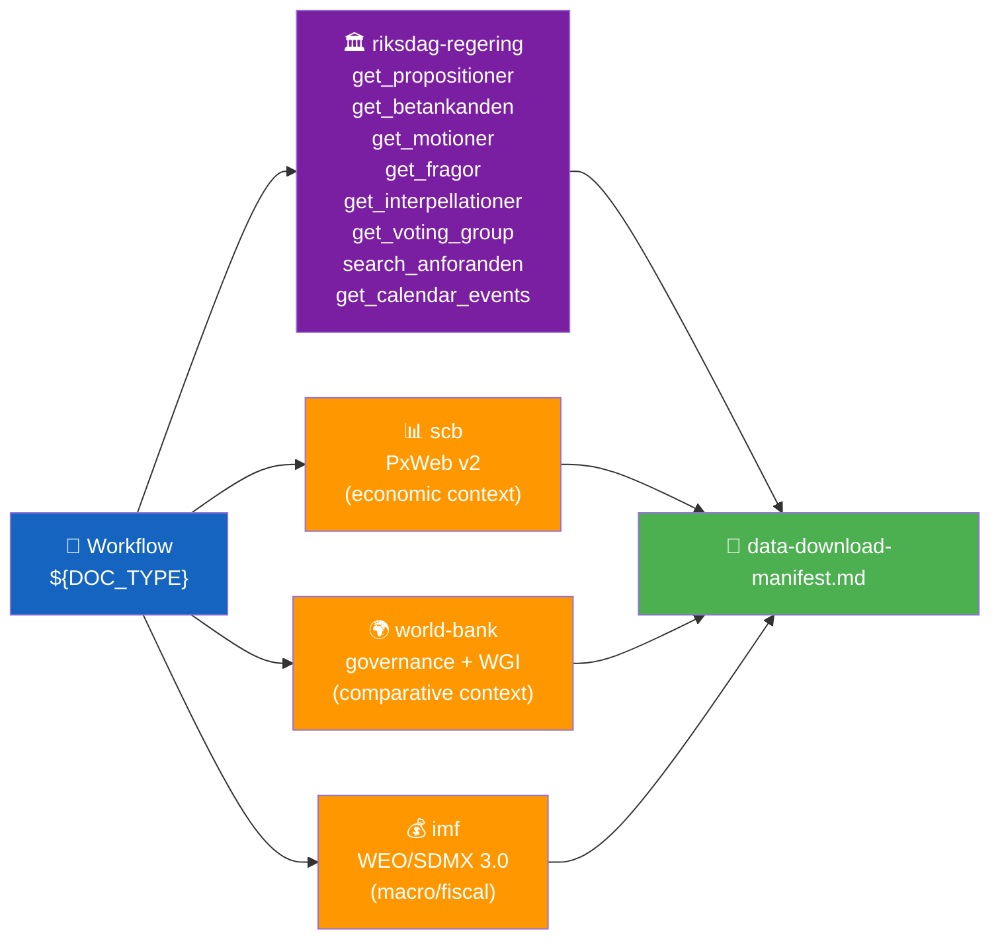

<p align="center">
  
</p>

<h1 align="center">📥 Data Download Manifest Template</h1>

<p align="center">
  <strong>📊 Structural Record of MCP Downloads for a Workflow Run</strong><br>
  <em>🎯 Reproducibility · Data-Depth Transparency · Confidence Ceilings</em>
</p>

<p align="center">
  <a href="#"></a>
  <a href="#"></a>
  <a href="#"></a>
  <a href="#"></a>
</p>

**📋 Document Owner:** CEO | **📄 Version:** 1.0 | **📅 Last Updated:** 2026-04-21 (UTC)
**🏢 Owner:** Hack23 AB (Org.nr 5595347807) | **🏷️ Classification:** Public

> **📌 Template instructions:** Produce this file at the start of every workflow run (Step 2 of the [AI-Driven Analysis Guide](../methodologies/ai-driven-analysis-guide.md)). It is the factual record of what arrived and the ceiling on confidence for the whole run. Save as `analysis/daily/${ARTICLE_DATE}/${DOC_TYPE}/data-download-manifest.md`.

> **✨ What to produce:** A transparent, reproducible inventory that lets any reader rerun the download and reach the same data. Every claim downstream ties back to the dok_ids listed here.

---

## 📋 Manifest Context

| Field | Value |
|-------|-------|
| **Manifest ID** | `MFS-YYYY-MM-DD-NNN` |
| **Generated** | `YYYY-MM-DD HH:MM UTC` |
| **Workflow** | `e.g., news-morning-propositions` |
| **Workflow Run URL** | `GitHub Actions run URL` |
| **Download Script Version** | `download-parliamentary-data.ts @ vX.Y.Z` |
| **Target Article Date** | `YYYY-MM-DD` |
| **Riksmöte** | `e.g., 2025/26` |
| **Data-Source Status** | `PRIMARY / LOOKBACK-N-DAYS / CARRY-FORWARD` |
| **Data Freshness** | `Documents sourced from YYYY-MM-DD (lookback N days)` |

---

## 📥 MCP Tools Invoked



| MCP Server | Tool Invoked | Parameters | Result Count | Notes |
|------------|--------------|------------|:------------:|-------|
| `riksdag-regering` | `get_propositioner` | `rm=2025/26, limit=20` | `N` | primary source |
| `riksdag-regering` | `search_voteringar` | `bet=FiU48, rm=2025/26` | `N` | cross-reference |
| `riksdag-regering` | `search_anforanden` | `talare=Svantesson, rm=2025/26` | `N` | minister context |
| `scb` | `query_table` | `table=NR0103, var=Tid=top(5)` | `N` | economic context |
| `world-bank` | `get_economic_data` | `country=SWE, indicator=GDP_GROWTH` | `N` | comparator |
| `imf` (scripted) | `tsx scripts/imf-fetch.ts` | `WEO, ISO=SWE, 2020-2030` | `N` | fiscal projections |

---

## 📄 Documents Downloaded

| # | dok_id | Type | Committee | Date | Data Depth | Size (bytes) | Saved To |
|:-:|--------|------|:---------:|------|:----------:|:------------:|----------|
| 1 | `HD03100` | prop | FiU | 2026-04-15 | FULL-TEXT | 247 812 | `data/HD03100.json` |
| 2 | `HD0399` | prop | FiU | 2026-04-15 | FULL-TEXT | 189 443 | `data/HD0399.json` |
| 3 | `HD03236` | prop | FiU | 2026-04-16 | SUMMARY | 4 821 | `data/HD03236.json` |
| … | … | … | … | … | … | … | … |

**Data-depth distribution** (sets the confidence ceiling per the [AI-Driven Analysis Guide](../methodologies/ai-driven-analysis-guide.md#-5-level-confidence-scale)):

| Depth | Count | % | Confidence Ceiling |
|-------|:-----:|:-:|:------------------:|
| FULL-TEXT (`fullText`/`fullContent` present with substantive content) | `N` | `XX%` | 🟦 VERY HIGH |
| SUMMARY-only (no full text, substantive summary/notis ≥ 100 chars) | `N` | `XX%` | 🟧 MEDIUM |
| METADATA-only (title/date/committee only) | `N` | `XX%` | 🟥 LOW |
| **Overall ceiling for this run** | — | — | **(computed from majority)** |

---

## 🔗 Cross-Source Enrichment

| Document | Primary Source | Enrichment Sources | Notes |
|----------|:--------------:|--------------------|-------|
| `HD03100` | `get_propositioner` | `search_voteringar` (FiU1 budget vote), SCB NR0103 GDP, IMF WEO 2026 | GDP data ties spring-bill narrative to macro context |
| `HD03236` | `get_propositioner` | SCB PR0101 (pump-price index), SCB AKU (employment) | Fuel-tax cost-of-living linkage |

---

## 🧮 Sample & Coverage Assessment

| Metric | Value |
|--------|:-----:|
| Target document universe (riksmöte scope) | `N` |
| Documents downloaded | `N` |
| Coverage | `XX%` |
| Cross-reference targets (other dok_ids referenced) | `N` |
| Cross-reference targets available | `N` |
| Cross-reference coverage | `XX%` |
| Anföranden retrieved | `N` |
| Voteringar retrieved | `N` |

---

## 📅 Lookback Record (if triggered)

| Lookback Day | Documents Found | Kept? | Reason |
|:------------:|:--------------:|:-----:|--------|
| `YYYY-MM-DD` | 0 | no | parliamentary recess |
| `YYYY-MM-DD` | 4 | yes | first non-empty day within 5-business-day window |

---

## ⚠️ Gaps, Failures, and Known Limits

| # | Gap / Failure | Severity | Impact on Analysis |
|:-:|---------------|:--------:|--------------------|
| 1 | `search_voteringar` timed out on third attempt for HD03100 | 🟠 HIGH | Vote-count claims capped at MEDIUM confidence |
| 2 | SCB table NR0103 returned partial series | 🟡 MEDIUM | Pass-2 retries from SCB `get_table_info` |

---

## 📂 Artefacts & Output Paths

```
analysis/daily/${ARTICLE_DATE}/${DOC_TYPE}/
├── data/                         # raw JSON downloads (Git-ignored or kept per policy)
│   ├── ${DOK_ID}.json
│   └── …
├── data-download-manifest.md     # this file
├── documents/                    # per-file analyses (Family E)
│   └── ${DOK_ID}-analysis.md
└── (Family A, B, C, D files)
```

---

## 🔁 Reproducibility

| Step | Command |
|------|---------|
| 1 | `git checkout ${COMMIT_SHA}` |
| 2 | `npm ci` |
| 3 | `npx tsx scripts/download-parliamentary-data.ts --date ${ARTICLE_DATE} --scope ${DOC_TYPE} --out analysis/daily/${ARTICLE_DATE}/${DOC_TYPE}/data/` |
| 4 | Compare resulting `data-download-manifest.md` against this file |

---

**Document Control**
- **Template path:** `/analysis/templates/data-download-manifest.md`
- **Referenced by:** [ai-driven-analysis-guide.md § Step 2](../methodologies/ai-driven-analysis-guide.md#step-2--download-mcp-data)
- **Classification:** Public
- **Next Review:** 2026-07-21
