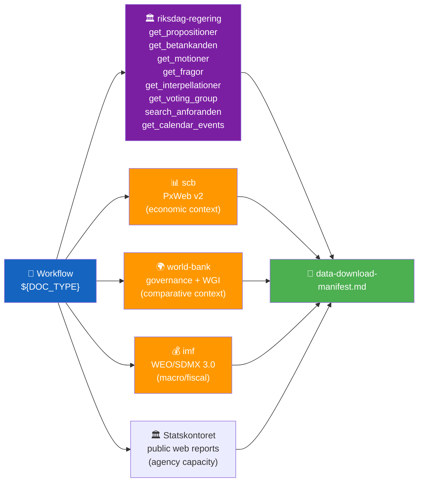

<p align="center">
  
</p>

<h1 align="center">📥 Data Download Manifest Template</h1>

<p align="center">
  <strong>📊 Structural Record of MCP Downloads for a Workflow Run</strong><br>
  <em>🎯 Reproducibility · Data-Depth Transparency · Confidence Ceilings</em>
</p>

<p align="center">
  <a href="#"></a>
  <a href="#"></a>
  <a href="#"></a>
  <a href="#"></a>
</p>

**📋 Document Owner:** CEO | **📄 Version:** 1.3 | **📅 Last Updated:** 2026-05-15 (UTC)
**🏢 Owner:** Hack23 AB (Org.nr 5595347807) | **🏷️ Classification:** Public

> **📌 Template instructions:** Produce this file at the start of every workflow run (Step 2 of the [AI-Driven Analysis Guide](../methodologies/ai-driven-analysis-guide.md)). It is the factual record of what arrived and the ceiling on confidence for the whole run. Save as `analysis/daily/${ARTICLE_DATE}/${DOC_TYPE}/data-download-manifest.md`.

> **✨ What to produce:** A transparent, reproducible inventory that lets any reader rerun the download and reach the same data. Every claim downstream ties back to the dok_ids listed here.

---

<!-- TEMPLATE_CONTRACT_V1 -->
> **📐 Template Contract** — every fill of this template MUST satisfy this row.
>
> | Slot | Value |
> |------|-------|
> | **Owning methodology** | [`per-artifact-methodologies.md`](../methodologies/per-artifact-methodologies.md#data-download-manifest) |
> | **Owning gate check** | Check 1 + Check 2 (per-doc coverage) — see [`05-analysis-gate.md`](../../.github/prompts/05-analysis-gate.md) |
> | **Required inputs** | output of `03-data-download.md` collection step |
> | **Horizon band** | per-run (per [`scripts/horizon-context.ts`](../../scripts/horizon-context.ts)) |
> | **Output family** | Family B — Structural Metadata |
> | **Aggregation order** | 30 of 30 in canonical order (see [`scripts/render-lib/aggregator/order.ts`](../../scripts/render-lib/aggregator/order.ts)) |
> | **Reader Intelligence Guide** | row generated from `data-download-manifest.md` (see [`scripts/render-lib/aggregator/reader-guide.ts`](../../scripts/render-lib/aggregator/reader-guide.ts)) |
> | **Canonical evidence anchor** | `\| claim \| evidence (dok_id / vote / MP intressent_id / primary-source URL) \| retrieved_at \| confidence \|` — every analytical claim row uses this schema. |
>
> Cross-reference: [`README.md §Template ↔ Methodology ↔ Gate-Check Matrix`](README.md#-template--methodology--gate-check-matrix).

<!--
AI-FIRST Pass-1 / Pass-2 self-check (HTML comment — invisible in rendered articles; not stripped by aggregator unless under a "## Pass 2 …" heading).

PASS 1 (creation, minimal viable artifact):
  • Fill every REQUIRED slot above; cite ≥ 1 dok_id / vote / MP / primary-source URL per major claim.
  • Use the canonical evidence anchor schema for every analytical claim row.
  • Mermaid blocks use the cyberpunk %%{init: theme/themeVariables}%% prologue and at least one `style …` or `classDef …` directive (Check 5 of 05-analysis-gate.md).

PASS 2 (read-back & improve — AI-FIRST mandatory, ≥ 180 s after Pass 1):
  • Re-read the file end-to-end; for each section verify (a) ≥ 1 evidence anchor row, (b) WEP language tightened (no "may/might/could" hedges), (c) named actors with intressent_id where applicable, (d) Mermaid colour theming present.
  • Banned-phrase scan: "intelligence theatre", "sources say", "reportedly", "it is widely believed", "experts agree", "AI_MUST_REPLACE".
  • Citation density target: ≥ 1 evidence anchor row per 100 words of analytical prose.
  • Neutrality arithmetic: equal analytical depth across the 8 Riksdag parties (S, M, SD, V, MP, C, L, KD); flag and correct any bias in the Pass-2 Self-Audit section.

ANTI-TEMPLATE — DO NOT:
  • Ship plain prose without evidence anchor tables.
  • Leave AI_MUST_REPLACE / [REQUIRED: …] placeholders in the rendered output.
  • Cite a non-primary URL when a `dok_id` or vote record is available.
  • Treat co-occurrence of keywords as coordination; uni-directional chains as bi-directional.
  • Use a Mermaid block without colour theming (Check 5 will block aggregation).
  • Skip the Pass-2 read-back (Check 6 verifies mtime ≥ birth + 180 s OR a differing pass1/ snapshot).
-->

## 🔄 Tradecraft Context

| Field | Value |
|-------|-------|
| **F3EAD stage** | `Find / Fix` (provenance record of collection) |
| **PIRs** | `applies to all standing PIRs — this artifact grounds their evidence base` |
| **Admiralty floor** | `A1 for every row (primary MCP pulls); downstream templates inherit this floor` |
| **SATs used** | `Quality of Information Check; Source Triangulation` |
| **ICD 203 standards applied** | `sources, uncertainty, objectivity` |

> See [`political-style-guide.md`](../methodologies/political-style-guide.md) for canonical F3EAD / PIR catalog / Admiralty Code / ICD 203 / WEP / SATs definitions.

---

## 📋 Manifest Context

| Field | Value |
|-------|-------|
| **Manifest ID** | `MFS-YYYY-MM-DD-NNN` |
| **Generated** | `YYYY-MM-DD HH:MM UTC` |
| **Workflow** | `e.g., news-morning-propositions` |
| **Workflow Run URL** | `GitHub Actions run URL` |
| **Download Script Version** | `download-parliamentary-data.ts @ vX.Y.Z` |
| **Target Article Date** | `YYYY-MM-DD` |
| **Riksmöte** | `e.g., 2025/26` |
| **Data-Source Status** | `PRIMARY / LOOKBACK-N-DAYS / CARRY-FORWARD` |
| **Data Freshness** | `Documents sourced from YYYY-MM-DD (lookback N days)` |

---

## 📥 MCP Tools Invoked



| MCP Server | Tool Invoked | Parameters | Result Count | Notes |
|------------|--------------|------------|:------------:|-------|
| `riksdag-regering` | `get_propositioner` | `rm=2025/26, limit=20` | `N` | primary source |
| `riksdag-regering` | `search_voteringar` | `bet=FiU48, rm=2025/26` | `N` | cross-reference |
| `riksdag-regering` | `search_anforanden` | `talare=Svantesson, rm=2025/26` | `N` | minister context |
| `scb` | `query_table` | `table=NR0103, var=Tid=top(5)` | `N` | Swedish-specific ground truth |
| `imf` (scripted, PRIMARY economic) | `tsx scripts/imf-fetch.ts weo` | `country=SWE, indicator=NGDP_RPCH, years=15, vintage=WEO-2026-04` | `N` | macro projections |
| `imf` (scripted, PRIMARY economic) | `tsx scripts/imf-fetch.ts compare` | `indicator=GGXWDG_NGDP, countries=SWE,DNK,NOR,FIN,DEU` | `N` | Nordic fiscal peer-compare (batched, 1 call) |
| `imf` (scripted, SDMX) | `tsx scripts/imf-fetch.ts sdmx` | `/data/IMF.STA,CPI,4.0.0/M.SE.PCPI_IX?startPeriod=2022-01` | `N` | monthly CPI (`IFS`) |
| `world-bank` (non-economic ONLY) | `get-economic-data` | `country=SE, indicator=CC.EST` | `N` | WGI governance (`source=75`) |
| `world-bank` (non-economic ONLY) | `get-economic-data` | `country=SE, indicator=EN.ATM.CO2E.PC` | `N` | environment (CO2) |
| Statskontoret (public web) | `web_fetch` | `https://www.statskontoret.se/...` | `N` | agency-capacity / implementation evidence |

> **Provider routing**: every economic claim cites the IMF dataflow + indicator (`WEO:NGDP_RPCH`, `WEO:PCPIPCH`, `WEO:LUR`, `FM:GGXWDG_NGDP`, etc.); SCB supplies Swedish-specific ground truth. World Bank values appear in the manifest for governance, environment, social, defence-historical, and crime/justice context. See [`analysis/imf/README.md`](../imf/README.md) §8.

---

## 📄 Documents Downloaded

| # | dok_id | Type | Committee | Date | Data Depth | Size (bytes) | Saved To |
|:-:|--------|------|:---------:|------|:----------:|:------------:|----------|
| 1 | `HD03100` | prop | FiU | 2026-04-15 | FULL-TEXT | 247 812 | `data/HD03100.json` |
| 2 | `HD0399` | prop | FiU | 2026-04-15 | FULL-TEXT | 189 443 | `data/HD0399.json` |
| 3 | `HD03236` | prop | FiU | 2026-04-16 | SUMMARY | 4 821 | `data/HD03236.json` |
| … | … | … | … | … | … | … | … |

**Data-depth distribution** (sets the confidence ceiling per the [AI-Driven Analysis Guide](../methodologies/ai-driven-analysis-guide.md#-5-level-confidence-scale)):

| Depth | Count | % | Confidence Ceiling |
|-------|:-----:|:-:|:------------------:|
| FULL-TEXT (`fullText`/`fullContent` present with substantive content) | `N` | `XX%` | 🟦 VERY HIGH |
| SUMMARY-only (no full text, substantive summary/notis ≥ 100 chars) | `N` | `XX%` | 🟧 MEDIUM |
| METADATA-only (title/date/committee only) | `N` | `XX%` | 🟥 LOW |
| **Overall ceiling for this run** | — | — | **(computed from majority)** |

---

## 🔗 Cross-Source Enrichment

| Document | Primary Source | Enrichment Sources | Notes |
|----------|:--------------:|--------------------|-------|
| `HD03100` | `get_propositioner` | `search_voteringar` (FiU1 budget vote), SCB NR0103 GDP, IMF WEO 2026, Statskontoret agency-capacity report if relevant | GDP data ties spring-bill narrative to macro context; Statskontoret tests deliverability assumptions |
| `HD03236` | `get_propositioner` | SCB PR0101 (pump-price index), SCB AKU (employment) | Fuel-tax cost-of-living linkage |

---

## 🧮 Sample & Coverage Assessment

| Metric | Value |
|--------|:-----:|
| Target document universe (riksmöte scope) | `N` |
| Documents downloaded | `N` |
| Coverage | `XX%` |
| Cross-reference targets (other dok_ids referenced) | `N` |
| Cross-reference targets available | `N` |
| Cross-reference coverage | `XX%` |
| Anföranden retrieved | `N` |
| Voteringar retrieved | `N` |

---

## 📅 Lookback Record (if triggered)

| Lookback Day | Documents Found | Kept? | Reason |
|:------------:|:--------------:|:-----:|--------|
| `YYYY-MM-DD` | 0 | no | parliamentary recess |
| `YYYY-MM-DD` | 4 | yes | first non-empty day within 5-business-day window |

---

## ⚠️ Gaps, Failures, and Known Limits

| # | Gap / Failure | Severity | Impact on Analysis |
|:-:|---------------|:--------:|--------------------|
| 1 | `search_voteringar` timed out on third attempt for HD03100 | 🟠 HIGH | Vote-count claims capped at MEDIUM confidence |
| 2 | SCB table NR0103 returned partial series | 🟡 MEDIUM | Pass-2 retries from SCB `get_table_info` |

---

## 📂 Artefacts & Output Paths

```
analysis/daily/${ARTICLE_DATE}/${DOC_TYPE}/
├── data/                         # raw JSON downloads (Git-ignored or kept per policy)
│   ├── ${DOK_ID}.json
│   └── …
├── data-download-manifest.md     # this file
├── documents/                    # per-file analyses (Family E)
│   └── ${DOK_ID}-analysis.md
└── (Family A, B, C, D files)
```

---

## 🔁 Reproducibility

| Step | Command |
|------|---------|
| 1 | `git checkout ${COMMIT_SHA}` |
| 2 | `npm ci` |
| 3 | `npx tsx scripts/download-parliamentary-data.ts --date ${ARTICLE_DATE} --scope ${DOC_TYPE} --out analysis/daily/${ARTICLE_DATE}/${DOC_TYPE}/data/` |
| 4 | Compare resulting `data-download-manifest.md` against this file |

---

## 🧾 MCP Coverage-State Contract

Every requested `dok_id` must carry a machine-readable `MCPCoverageState` row and a matching `mcpProvenance` block in the persisted JSON artefact. Use these exact states:

| State | Meaning | Typical action |
|-------|---------|----------------|
| `full_text` | substantive `fullText` / `fullContent` / `text` retrieved | analysis can cite full text directly |
| `metadata_only` | metadata/summary returned but no substantive body text | cap confidence and disclose the gap |
| `not_indexed` | same-day filing or lookup attempted before full text was indexed | add to deferred retry queue for up to 7 days |
| `search_empty` | search/list wrapper returned zero rows for the query | log the exact query + result count; never paraphrase as “none found” without diagnostics |
| `fetch_error` | MCP tool call failed due to transient/operational error (network, timeout, 5xx) | retain in retry queue; do not conflate with true absence or indexing lag |

The manifest must therefore include:

- `## MCP Query Diagnostics` — one row per wrapper call with tool, query, result count, and any `MCP_INDEXING_LAG` signal.
- `## MCP Coverage State` — one row per requested `dok_id`.
- `## Deferred Retrieval Queue` — processed / resolved / retained / expired / enqueued counts for the file-backed queue.

---

**Document Control**
- **Template path:** `/analysis/templates/data-download-manifest.md`
- **Referenced by:** [ai-driven-analysis-guide.md § Step 2](../methodologies/ai-driven-analysis-guide.md#step-2--download-mcp-data)
- **Classification:** Public
- **Next Review:** 2026-07-21

---

## ✅ Pass-2 Self-Audit Checklist (v4.4 — required)

> **Purpose:** AI-FIRST principle requires a Pass-2 read-back-and-improve. After producing this artifact in Pass 1, re-read it end-to-end and verify each item below. Document any remediation in [`methodology-reflection.md`](methodology-reflection.md) §"Pass-2 audit log". Any unchecked ❌ box at the end of Pass 2 forces a Pass-3 rewrite of the affected section.

- [ ] **Tradecraft anchors honoured** — F3EAD stage matches the artifact's role; PIRs declared in the §Tradecraft Context block are actually addressed in the body; Admiralty grades attached to every external source; WEP band + ODNI confidence on every probabilistic judgement.
- [ ] **Source diversity floor met** — at least the minimum number of independent MCP sources required by the artifact's tradecraft block are cited; single-source claims are explicitly labelled `[SINGLE-SOURCE — corroboration pending]`.
- [ ] **Evidence specificity** — every quantified claim cites a `dok_id` (Riksdag), an SCB / IMF dataflow code, or a named external source with date; no "according to data" / "studies show" hand-waves.
- [ ] **Named-actor discipline** — every political claim names ≥ 1 person (party + role + dated act/quote) or labels the absence (`[diffuse — no named actor]`).
- [ ] **Counter-narrative present** — at least one explicit competing hypothesis, dissent quote, or framed objection appears in the body; "no opposition recorded" is itself a finding to label, not silence.
- [ ] **Election 2026 lens applied** — the §"Election 2026 Implications" subsection (or equivalent) addresses electoral salience, coalition pressure, and forward indicators; not boilerplate.
- [ ] **No illustrative content shipped as fact** — every `[REQUIRED]` placeholder is filled OR removed; every `Example:` block is clearly fenced or removed; no fabricated `dok_id`, vote count, or quote leaks into the final artifact.
- [ ] **Cross-references resolve** — every `[link](file.md)` in this artifact points to a file that exists in the run folder (`analysis/daily/$ARTICLE_DATE/$SUBFOLDER/`) or to a methodology / template under `analysis/`.
- [ ] **Mermaid renders** — every fenced ` ```mermaid ` block parses (no missing class definitions, no orphan nodes, no >40-node graphs that overflow viewport on mobile).
- [ ] **Line-floor check** — artifact length ≥ the per-artifact floor in [`reference-quality-thresholds.json`](../methodologies/reference-quality-thresholds.json); shorter artifacts trigger Pass-2 rewrite, never a `[truncated]` note.
