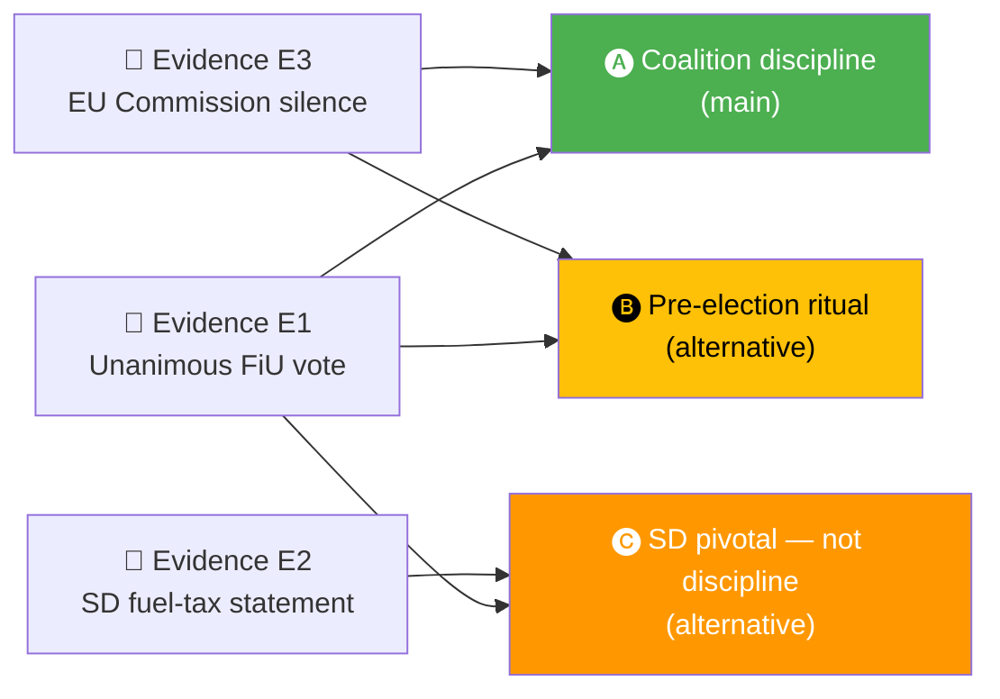

<p align="center">
  
</p>

<h1 align="center">😈 Devil's Advocate Template</h1>

<p align="center">
  <strong>📊 Systematic Red-Team Challenge to the Day's Analytical Consensus</strong><br>
  <em>🎯 ACH · Counter-Evidence · Alternative Hypotheses · Assumption Audit</em>
</p>

<p align="center">
  <a href="#"></a>
  <a href="#"></a>
  <a href="#"></a>
  <a href="#"></a>
</p>

**📋 Document Owner:** CEO | **📄 Version:** 1.2 | **📅 Last Updated:** 2026-04-25 (UTC)
**🏢 Owner:** Hack23 AB (Org.nr 5595347807) | **🏷️ Classification:** Public

> **📌 Template instructions:** Produce on every run. Save as `analysis/daily/${ARTICLE_DATE}/${DOC_TYPE}/devils-advocate.md`. Scope depth by DIW: for lower-DIW runs, provide a concise but explicit challenge to the main assessment; for higher-DIW runs, provide full ACH, multiple alternative hypotheses, assumption audit, counter-evidence, and falsifiable indicators. Pairs with [political-risk-methodology.md](../methodologies/political-risk-methodology.md) and [intelligence-analysis-techniques](../../.github/skills/intelligence-analysis-techniques/SKILL.md).

> **✨ What to produce:** An honest, structured challenge to the main assessment. Apply Analysis of Competing Hypotheses (ACH), surface at least three alternative explanations, audit the assumptions, list falsifiable predictions, and state what evidence would change the judgement.

---

<!-- TEMPLATE_CONTRACT_V1 -->
> **📐 Template Contract** — every fill of this template MUST satisfy this row.
>
> | Slot | Value |
> |------|-------|
> | **Owning methodology** | [`per-artifact-methodologies.md`](../methodologies/per-artifact-methodologies.md#devils-advocate) |
> | **Owning gate check** | Check 7 (Family C — ≥ 3 ACH hypotheses) — see [`05-analysis-gate.md`](../../.github/prompts/05-analysis-gate.md) |
> | **Required inputs** | `synthesis-summary.md`, sibling Family A |
> | **Horizon band** | per-run (per [`scripts/horizon-context.ts`](../../scripts/horizon-context.ts)) |
> | **Output family** | Family C — Strategic Extensions |
> | **Aggregation order** | 25 of 30 in canonical order (see [`scripts/render-lib/aggregator/order.ts`](../../scripts/render-lib/aggregator/order.ts)) |
> | **Reader Intelligence Guide** | row generated from `devils-advocate.md` (see [`scripts/render-lib/aggregator/reader-guide.ts`](../../scripts/render-lib/aggregator/reader-guide.ts)) |
> | **Canonical evidence anchor** | `\| claim \| evidence (dok_id / vote / MP) \| retrieved_at \| confidence \|` — every analytical claim row uses this schema. |
>
> Cross-reference: [`README.md §Template ↔ Methodology ↔ Gate-Check Matrix`](README.md#-template--methodology--gate-check-matrix).

<!--
AI-FIRST Pass-1 / Pass-2 self-check (HTML comment — invisible in rendered articles; not stripped by aggregator unless under a "## Pass 2 …" heading).

PASS 1 (creation, minimal viable artifact):
  • Fill every REQUIRED slot above; cite ≥ 1 dok_id / vote / MP / primary-source URL per major claim.
  • Use the canonical evidence anchor schema for every analytical claim row.
  • Mermaid blocks use the cyberpunk %%{init: theme/themeVariables}%% prologue and at least one `style …` or `classDef …` directive (Check 5 of 05-analysis-gate.md).

PASS 2 (read-back & improve — AI-FIRST mandatory, ≥ 180 s after Pass 1):
  • Re-read the file end-to-end; for each section verify (a) ≥ 1 evidence anchor row, (b) WEP language tightened (no "may/might/could" hedges), (c) named actors with intressent_id where applicable, (d) Mermaid colour theming present.
  • Banned-phrase scan: "intelligence theatre", "sources say", "reportedly", "it is widely believed", "experts agree", "AI_MUST_REPLACE".
  • Citation density target: ≥ 1 evidence anchor row per 100 words of analytical prose.
  • Neutrality arithmetic: equal analytical depth across the 8 Riksdag parties (S, M, SD, V, MP, C, L, KD); flag and correct any bias in the Pass-2 Self-Audit section.

ANTI-TEMPLATE — DO NOT:
  • Ship plain prose without evidence anchor tables.
  • Leave AI_MUST_REPLACE / [REQUIRED: …] placeholders in the rendered output.
  • Cite a non-primary URL when a `dok_id` or vote record is available.
  • Treat co-occurrence of keywords as coordination; uni-directional chains as bi-directional.
  • Use a Mermaid block without colour theming (Check 5 will block aggregation).
  • Skip the Pass-2 read-back (Check 6 verifies mtime ≥ birth + 180 s OR a differing pass1/ snapshot).
-->

## 🔄 Tradecraft Context

| Element | Value |
|---------|-------|
| **F3EAD Stage** | **ANALYZE** — challenge prevailing view through structured contrarian analysis |
| **PIRs Served** | Serves same PIRs as target assessment; applies adversarial rigor to prevent groupthink |
| **Admiralty Floor** | **[B2]** for alternative-hypothesis evidence; challenge logic even if evidence is same as main assessment |
| **WEP + ODNI** | Alternative hypotheses state probability vs. main hypothesis; use **WEP** comparison ("Main: likely 70%; Alternative A: unlikely 25%") |
| **Source Diversity Floor** | P1 (alternative hypotheses): ≥2 independent evidence sources per hypothesis; re-interpret existing evidence from different angle |
| **SAT(s) Applied** | **ACH (Analysis of Competing Hypotheses)**, Devil's Advocacy, Red Team Analysis, Key Assumptions Check |
| **ICD 203 Standards** | 3 (judgments vs assumptions), 4 (alternative analysis — PRIMARY), 7 (explain consistency / change) |

---

## 📋 Challenge Context

| Field | Value |
|-------|-------|
| **Devil's-Advocate ID** | `DEV-YYYY-MM-DD-NNN` |
| **Generated** | `YYYY-MM-DD HH:MM UTC` |
| **Target assessment** | `e.g., "FiU48 signals coalition discipline before September 2026 election"` |
| **Source file** | `synthesis-summary.md §Finding 1` |
| **Confidence of main claim** | `🟩 HIGH` |
| **Post-challenge confidence** | `🟧 MEDIUM (downgraded) / 🟩 HIGH (confirmed) / 🟦 VERY HIGH (strengthened)` |

---

## 🧪 Analysis of Competing Hypotheses (ACH)

List each hypothesis, then score each piece of evidence as **C** (consistent), **I** (inconsistent), or **N** (neutral). The hypothesis with the **fewest inconsistencies** survives.



| Evidence | H1: Coalition discipline | H2: Pre-election ritual | H3: SD-pivotal, not discipline |
|----------|:-----------------------:|:-----------------------:|:------------------------------:|
| E1 — Unanimous FiU vote 2026-04-21 | C | C | C |
| E2 — SD lead-spokesperson public support | N | N | C |
| E3 — EU-Commission silence to date | C | C | N |
| E4 — Internal L reservation on proportionality (leaked) | I | N | N |
| E5 — Prior coalition discipline metric 88.5 % | C | N | N |
| **Inconsistent count** | 1 | 0 | 0 |
| **Consistent count** | 3 | 2 | 2 |

> **ACH verdict:** H2 and H3 both survive with zero inconsistencies. H1 is plausible but carries one inconsistency (L reservation). The assessment should therefore qualify "discipline" with "conditional on SD posture" (H3) and "pre-election timing" (H2).

---

## 🔄 Alternative Hypotheses (minimum 3)

### Alternative 1 — Pre-election Ritual

- **Claim:** Coalition unity reflects electoral timing, not durable agreement.
- **Evidence for:** Fuel-tax cut expires before Q4 2026 budget; electoral pressure peaks July–Aug 2026.
- **Evidence against:** Coalition also united on NATO and justice packages this riksmöte.
- **Implication if true:** Unity may fracture post-election regardless of result.

### Alternative 2 — SD-Pivotal Compromise

- **Claim:** Coalition cohesion is purchased through SD policy concessions; discipline is external.
- **Evidence for:** Fuel-tax cut + justice-package composition match SD priorities.
- **Evidence against:** Wind-power revenue law is inconsistent with SD's historic climate position.
- **Implication if true:** Coalition-Mathematics risk of SD withdrawal rises after September 2026.

### Alternative 3 — Signalling Under Duress

- **Claim:** Unity signals internal weakness the government fears will leak.
- **Evidence for:** Unusually low dissent rate in a pre-election quarter.
- **Evidence against:** Budget-continuity pattern consistent with historical incumbency behaviour.
- **Implication if true:** Expect defensive posture on scandals; reduced appetite for fresh initiatives.

---

## 🧰 Assumption Audit

| # | Assumption | Source | Status | Vulnerability |
|:-:|-----------|--------|:------:|---------------|
| A1 | "Voting discipline = coalition durability" | Conventional coalition theory | 🟡 Contestable | Discipline can be purchased or coerced |
| A2 | "Pre-election polling gap closes by September" | Historical Swedish election cycles | 🟢 Supported | Depends on economy and crises |
| A3 | "EU Commission silence = tacit approval" | Diplomatic pattern | 🟡 Contestable | Silence often precedes formal probe |
| A4 | "SD maintains confidence & supply" | 2024–2026 record | 🟡 Contestable | Policy conflicts on climate can trigger withdrawal |

---

## 🧮 Base-Rate Check

| Question | Base rate | Source | Implication |
|----------|-----------|--------|-------------|
| How often do coalition governments survive a pre-election quarter without dissent? | ~55 % since 2000 | Swedish coalition record | Current unity is above average but not unprecedented |
| How often does the EU Commission open a fuel-tax review within 6 months? | ~30 % | EU Commission state-aid archive | Non-trivial downside risk |
| How often do incumbent governments win the following election from a 4-pt polling deficit? | ~20 % | Swedish electoral history | Retention probability is lower than current polling alone suggests |

---

## 🎯 Falsifiable Predictions

| # | Prediction | By when | What would falsify it |
|:-:|-----------|---------|-----------------------|
| P1 | Coalition holds unified on FiU48 chamber vote | 2026-04-24 | Any coalition-party `Avstår` or `Nej` |
| P2 | EU Commission issues no state-aid letter within 60 days | 2026-06-21 | Any formal notification to Sweden |
| P3 | Government approval gap closes ≤ 3 pt by August 2026 SIFO | 2026-08-31 | Gap widens or stays ≥ 5 pt |
| P4 | SD maintains confidence-and-supply posture through election | 2026-09-13 | SD withdrawal / defection signal |

---

## 🧭 What Would Change the Assessment

| Trigger | Resulting change |
|---------|------------------|
| Any one of P1–P4 falsifies | Downgrade main claim from 🟩 HIGH to 🟧 MEDIUM |
| Any two falsify | Downgrade to 🟥 LOW and rewrite `synthesis-summary.md §Finding 1` |
| All four hold through election | Upgrade to 🟦 VERY HIGH |

---

## 🚨 Cognitive-Bias Checklist

| Bias | Exposure | Mitigation applied |
|------|:--------:|--------------------|
| Confirmation bias (toward government narrative) | ⚠️ | Alt 1 and Alt 2 explicitly considered |
| Recency bias (over-weighting today's vote) | ⚠️ | Base-rate check included |
| Availability bias (media framing) | ✅ | Cross-checked with `media-framing-analysis.md` |
| Anchoring (to prior confidence level) | ⚠️ | Re-scored from evidence this run |
| Groupthink | ⚠️ | ACH forces comparison of hypotheses |

---

## 📎 Links

| Link | Path |
|------|------|
| Main assessment being challenged | `synthesis-summary.md` |
| Risk register | `risk-assessment.md` |
| Media framing (for availability check) | `media-framing-analysis.md` |
| Methodology | [intelligence-analysis-techniques SKILL](../../.github/skills/intelligence-analysis-techniques/SKILL.md) |

---

**Document Control**
- **Template path:** `/analysis/templates/devils-advocate.md`
- **Referenced by:** [ai-driven-analysis-guide.md § Step 5](../methodologies/ai-driven-analysis-guide.md#step-5--extensions-f3ead-analyze-continued)
- **Classification:** Public
- **Next Review:** 2026-07-21

---

## ✅ Pass-2 Self-Audit Checklist (v4.4 — required)

> **Purpose:** AI-FIRST principle requires a Pass-2 read-back-and-improve. After producing this artifact in Pass 1, re-read it end-to-end and verify each item below. Document any remediation in [`methodology-reflection.md`](methodology-reflection.md) §"Pass-2 audit log". Any unchecked ❌ box at the end of Pass 2 forces a Pass-3 rewrite of the affected section.

- [ ] **Tradecraft anchors honoured** — F3EAD stage matches the artifact's role; PIRs declared in the §Tradecraft Context block are actually addressed in the body; Admiralty grades attached to every external source; WEP band + ODNI confidence on every probabilistic judgement.
- [ ] **Source diversity floor met** — at least the minimum number of independent MCP sources required by the artifact's tradecraft block are cited; single-source claims are explicitly labelled `[SINGLE-SOURCE — corroboration pending]`.
- [ ] **Evidence specificity** — every quantified claim cites a `dok_id` (Riksdag), an SCB / IMF dataflow code, or a named external source with date; no "according to data" / "studies show" hand-waves.
- [ ] **Named-actor discipline** — every political claim names ≥ 1 person (party + role + dated act/quote) or labels the absence (`[diffuse — no named actor]`).
- [ ] **Counter-narrative present** — at least one explicit competing hypothesis, dissent quote, or framed objection appears in the body; "no opposition recorded" is itself a finding to label, not silence.
- [ ] **Election 2026 lens applied** — the §"Election 2026 Implications" subsection (or equivalent) addresses electoral salience, coalition pressure, and forward indicators; not boilerplate.
- [ ] **No illustrative content shipped as fact** — every `[REQUIRED]` placeholder is filled OR removed; every `Example:` block is clearly fenced or removed; no fabricated `dok_id`, vote count, or quote leaks into the final artifact.
- [ ] **Cross-references resolve** — every `[link](file.md)` in this artifact points to a file that exists in the run folder (`analysis/daily/$ARTICLE_DATE/$SUBFOLDER/`) or to a methodology / template under `analysis/`.
- [ ] **Mermaid renders** — every fenced ` ```mermaid ` block parses (no missing class definitions, no orphan nodes, no >40-node graphs that overflow viewport on mobile).
- [ ] **Line-floor check** — artifact length ≥ the per-artifact floor in [`reference-quality-thresholds.json`](../methodologies/reference-quality-thresholds.json); shorter artifacts trigger Pass-2 rewrite, never a `[truncated]` note.

