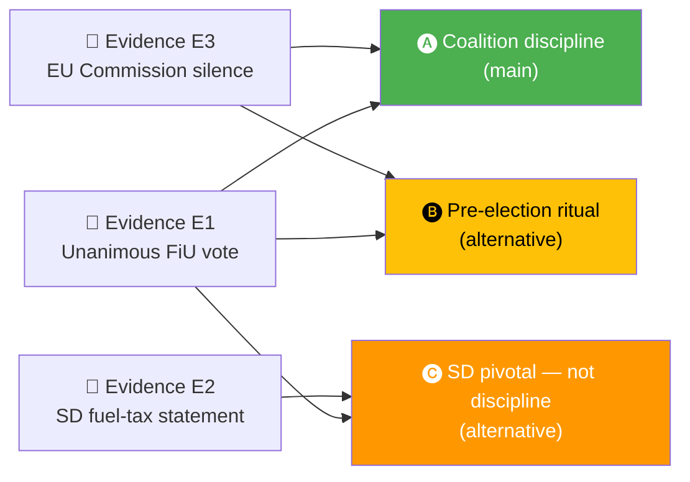

  

<h1 align="center">😈 Devil's Advocate Template</h1>

  <strong>📊 Systematic Red-Team Challenge to the Day's Analytical Consensus</strong> 
  <em>🎯 ACH · Counter-Evidence · Alternative Hypotheses · Assumption Audit</em>

  
  
  
  

**📋 Document Owner:** CEO | **📄 Version:** 1.0 | **📅 Last Updated:** 2026-04-21 (UTC)
**🏢 Owner:** Hack23 AB (Org.nr 5595347807) | **🏷️ Classification:** Public

> **📌 Template instructions:** Produce when any document in the run scores ≥ 7.0 on DIW. Save as `analysis/daily/${ARTICLE_DATE}/${DOC_TYPE}/devils-advocate.md`. Pairs with [political-risk-methodology.md](../methodologies/political-risk-methodology.md) and [intelligence-analysis-techniques](../../.github/skills/intelligence-analysis-techniques/SKILL.md).

> **✨ What to produce:** An honest, structured challenge to the main assessment. Apply Analysis of Competing Hypotheses (ACH), surface at least three alternative explanations, audit the assumptions, list falsifiable predictions, and state what evidence would change the judgement.

---

## 📋 Challenge Context

| Field | Value |
|-------|-------|
| **Devil's-Advocate ID** | `DEV-YYYY-MM-DD-NNN` |
| **Generated** | `YYYY-MM-DD HH:MM UTC` |
| **Target assessment** | `e.g., "FiU48 signals coalition discipline before September 2026 election"` |
| **Source file** | `synthesis-summary.md §Finding 1` |
| **Confidence of main claim** | `🟩 HIGH` |
| **Post-challenge confidence** | `🟧 MEDIUM (downgraded) / 🟩 HIGH (confirmed) / 🟦 VERY HIGH (strengthened)` |

---

## 🧪 Analysis of Competing Hypotheses (ACH)

List each hypothesis, then score each piece of evidence as **C** (consistent), **I** (inconsistent), or **N** (neutral). The hypothesis with the **fewest inconsistencies** survives.

| Evidence | H1: Coalition discipline | H2: Pre-election ritual | H3: SD-pivotal, not discipline |
|----------|:-----------------------:|:-----------------------:|:------------------------------:|
| E1 — Unanimous FiU vote 2026-04-21 | C | C | C |
| E2 — SD lead-spokesperson public support | N | N | C |
| E3 — EU-Commission silence to date | C | C | N |
| E4 — Internal L reservation on proportionality (leaked) | I | N | N |
| E5 — Prior coalition discipline metric 88.5 % | C | N | N |
| **Inconsistent count** | 1 | 0 | 0 |
| **Consistent count** | 3 | 2 | 2 |

> **ACH verdict:** H2 and H3 both survive with zero inconsistencies. H1 is plausible but carries one inconsistency (L reservation). The assessment should therefore qualify "discipline" with "conditional on SD posture" (H3) and "pre-election timing" (H2).

---

## 🔄 Alternative Hypotheses (minimum 3)

### Alternative 1 — Pre-election Ritual

- **Claim:** Coalition unity reflects electoral timing, not durable agreement.
- **Evidence for:** Fuel-tax cut expires before Q4 2026 budget; electoral pressure peaks July–Aug 2026.
- **Evidence against:** Coalition also united on NATO and justice packages this riksmöte.
- **Implication if true:** Unity may fracture post-election regardless of result.

### Alternative 2 — SD-Pivotal Compromise

- **Claim:** Coalition cohesion is purchased through SD policy concessions; discipline is external.
- **Evidence for:** Fuel-tax cut + justice-package composition match SD priorities.
- **Evidence against:** Wind-power revenue law is inconsistent with SD's historic climate position.
- **Implication if true:** Coalition-Mathematics risk of SD withdrawal rises after September 2026.

### Alternative 3 — Signalling Under Duress

- **Claim:** Unity signals internal weakness the government fears will leak.
- **Evidence for:** Unusually low dissent rate in a pre-election quarter.
- **Evidence against:** Budget-continuity pattern consistent with historical incumbency behaviour.
- **Implication if true:** Expect defensive posture on scandals; reduced appetite for fresh initiatives.

---

## 🧰 Assumption Audit

| # | Assumption | Source | Status | Vulnerability |
|:-:|-----------|--------|:------:|---------------|
| A1 | "Voting discipline = coalition durability" | Conventional coalition theory | 🟡 Contestable | Discipline can be purchased or coerced |
| A2 | "Pre-election polling gap closes by September" | Historical Swedish election cycles | 🟢 Supported | Depends on economy and crises |
| A3 | "EU Commission silence = tacit approval" | Diplomatic pattern | 🟡 Contestable | Silence often precedes formal probe |
| A4 | "SD maintains confidence & supply" | 2024–2026 record | 🟡 Contestable | Policy conflicts on climate can trigger withdrawal |

---

## 🧮 Base-Rate Check

| Question | Base rate | Source | Implication |
|----------|-----------|--------|-------------|
| How often do coalition governments survive a pre-election quarter without dissent? | ~55 % since 2000 | Swedish coalition record | Current unity is above average but not unprecedented |
| How often does the EU Commission open a fuel-tax review within 6 months? | ~30 % | EU Commission state-aid archive | Non-trivial downside risk |
| How often do incumbent governments win the following election from a 4-pt polling deficit? | ~20 % | Swedish electoral history | Retention probability is lower than current polling alone suggests |

---

## 🎯 Falsifiable Predictions

| # | Prediction | By when | What would falsify it |
|:-:|-----------|---------|-----------------------|
| P1 | Coalition holds unified on FiU48 chamber vote | 2026-04-24 | Any coalition-party `Avstår` or `Nej` |
| P2 | EU Commission issues no state-aid letter within 60 days | 2026-06-21 | Any formal notification to Sweden |
| P3 | Government approval gap closes ≤ 3 pt by August 2026 SIFO | 2026-08-31 | Gap widens or stays ≥ 5 pt |
| P4 | SD maintains confidence-and-supply posture through election | 2026-09-13 | SD withdrawal / defection signal |

---

## 🧭 What Would Change the Assessment

| Trigger | Resulting change |
|---------|------------------|
| Any one of P1–P4 falsifies | Downgrade main claim from 🟩 HIGH to 🟧 MEDIUM |
| Any two falsify | Downgrade to 🟥 LOW and rewrite `synthesis-summary.md §Finding 1` |
| All four hold through election | Upgrade to 🟦 VERY HIGH |

---

## 🚨 Cognitive-Bias Checklist

| Bias | Exposure | Mitigation applied |
|------|:--------:|--------------------|
| Confirmation bias (toward government narrative) | ⚠️ | Alt 1 and Alt 2 explicitly considered |
| Recency bias (over-weighting today's vote) | ⚠️ | Base-rate check included |
| Availability bias (media framing) | ✅ | Cross-checked with `media-framing-analysis.md` |
| Anchoring (to prior confidence level) | ⚠️ | Re-scored from evidence this run |
| Groupthink | ⚠️ | ACH forces comparison of hypotheses |

---

## 📎 Links

| Link | Path |
|------|------|
| Main assessment being challenged | `synthesis-summary.md` |
| Risk register | `risk-assessment.md` |
| Media framing (for availability check) | `media-framing-analysis.md` |
| Methodology | [intelligence-analysis-techniques SKILL](../../.github/skills/intelligence-analysis-techniques/SKILL.md) |

---

**Document Control**
- **Template path:** `/analysis/templates/devils-advocate.md`
- **Referenced by:** [ai-driven-analysis-guide.md § Step 5](../methodologies/ai-driven-analysis-guide.md#step-5--extensions-family-c--d-produced-when-warranted)
- **Classification:** Public
- **Next Review:** 2026-07-21
