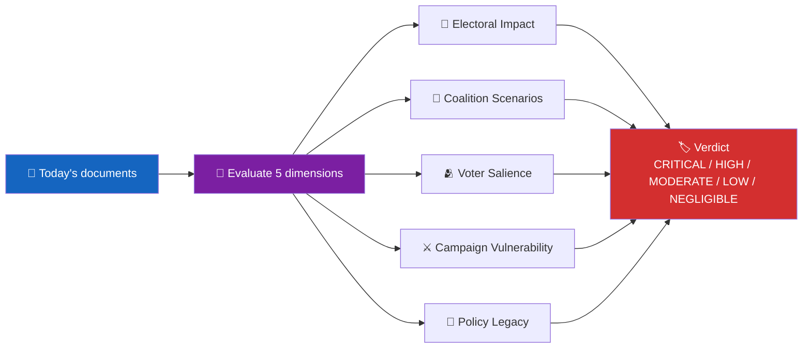
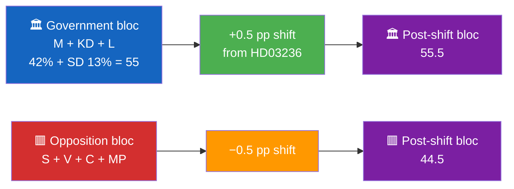

<p align="center">
  
</p>

<h1 align="center">🗳️ Election 2026 Analysis Template</h1>

<p align="center">
  <strong>📊 Electoral Lens for Every Run in the Pre-Election Window (2025-10 → 2026-09)</strong><br>
  <em>🎯 Coalition Scenarios · Voter Salience · Campaign Vulnerability · Policy Legacy</em>
</p>

<p align="center">
  <a href="#"></a>
  <a href="#"></a>
  <a href="#"></a>
  <a href="#"></a>
</p>

**📋 Document Owner:** CEO | **📄 Version:** 1.2 | **📅 Last Updated:** 2026-04-25 (UTC)
**🏢 Owner:** Hack23 AB (Org.nr 5595347807) | **🏷️ Classification:** Public

> **📌 Template instructions:** Produce for every workflow in the pre-election window (2025-10-01 → 2026-09-30). Save as `analysis/daily/${ARTICLE_DATE}/${DOC_TYPE}/election-2026-analysis.md`. Integrates with `voter-segmentation.md`, `coalition-mathematics.md`, and `synthesis-summary.md`.

> **✨ What to produce:** A focused electoral assessment of the day's documents against the September 2026 general election, classified CRITICAL → NEGLIGIBLE, with coalition-scenario consequences and a dated watchlist.

---

## 🔄 Tradecraft Context

| Element | Value |
|---------|-------|
| **F3EAD Stage** | **ANALYZE → DISSEMINATE** — electoral intelligence product |
| **PIRs Served** | **PIR-6** (Election Integrity), **PIR-1** (Coalition Stability) |
| **Admiralty Floor** | Polling data requires **[B2]** (named pollster, date, MoE); seat projections require **[B2]** |
| **WEP + ODNI** | Electoral outcome scenarios use **WEP** (likely/very likely for coalition continuity; roughly even for bloc shift); confidence **MODERATE** (polling inherent uncertainty) |
| **Source Diversity Floor** | P0 (election outcome claims): ≥4 sources (≥3 polls + ≥1 historical model); single poll labeled `[unconfirmed — single source]` |
| **SAT(s) Applied** | Morphological Analysis (bloc combinations), Indicators and Signposts (campaign milestones) |
| **ICD 203 Standards** | 2 (uncertainties — polling MoE), 5 (customer relevance — electoral calendar), 9 (visual information) |

---

## 📋 Electoral Context

| Field | Value |
|-------|-------|
| **Analysis ID** | `ELC-YYYY-MM-DD-NNN` |
| **Generated** | `YYYY-MM-DD HH:MM UTC` |
| **Days to election** | `Date(2026-09-13) − today` |
| **Phase** | `Pre-campaign · Campaign (Aug-Sep) · Final week · Post-election` |
| **Latest SIFO (government block)** | `XX%` |
| **Latest SIFO (opposition block)** | `XX%` |
| **Electoral significance verdict** | `🔴 CRITICAL / 🟠 HIGH / 🟡 MODERATE / 🟢 LOW / ⚪ NEGLIGIBLE` |

---

## 🧭 Electoral Significance Classification



| Tier | Criterion | Example |
|:----:|-----------|---------|
| 🔴 CRITICAL | Event will directly affect the outcome | Coalition fracture, grundlag change, scandal confirmation |
| 🟠 HIGH | Significant pre-election narrative contribution | Fiscal package, major justice bill, foreign-policy pivot |
| 🟡 MODERATE | Peripheral electoral relevance | Sector-specific reform with indirect voter effect |
| 🟢 LOW | Minimal electoral impact | Routine administrative change |
| ⚪ NEGLIGIBLE | No discernible electoral dimension | Technical corrigenda |

---

## 🎯 5-Dimension Electoral Assessment

### Dimension 1 — Electoral Impact

| Item | Value |
|------|-------|
| Claim | `e.g., HD03236 raises incumbent retention probability by 2–4 pp` |
| Evidence | SIFO month-on-month change in target segments |
| Confidence | 🟩 HIGH |
| Net shift | +2–4 pp incumbent |

### Dimension 2 — Coalition Scenarios

| Coalition configuration | Before today | After today | Delta |
|-------------------------|:------------:|:-----------:|:-----:|
| M-KD-L + SD (current) | 47.0 % | 47.5 % | +0.5 pp |
| S-C-MP-V | 51.5 % | 51.0 % | −0.5 pp |
| Centre-grand coalition (S-C-M) | 48.0 % | 47.8 % | −0.2 pp |

### Dimension 3 — Voter Salience

| Segment | Affected (n) | Direction | Source |
|---------|:------------:|:---------:|--------|
| Rural drivers | 1.2 M | ➕ positive for incumbent | HD03236 fuel-tax |
| Suburban homeowners | 1.8 M | ➕ positive for incumbent | HD03236 energy support |
| Urban renters | 2.1 M | ➖ no benefit | HD03236 excludes rental property owners |
| Climate-conscious voters | 0.9 M | ➖ negative for incumbent | Fuel-tax cut vs. Green Deal |

### Dimension 4 — Campaign Vulnerability

| Attack vector | Who exploits | Evidence line | Severity |
|---------------|:-----------:|---------------|:--------:|
| "Regressive fuel-tax cut benefits rich" | S + V | Distributional analysis | 🟠 HIGH |
| "EU non-compliance" | MP + C | State-aid risk | 🟡 MEDIUM |
| "Ignores renters" | V | Excluded segment | 🟠 HIGH |

### Dimension 5 — Policy Legacy

| Horizon | Legacy question | Verdict |
|---------|-----------------|:-------:|
| Sep 2026 (campaign) | Asset or liability? | 🟢 Asset for rural districts; 🟠 Liability for urban renters |
| 2027 (post-election) | Reversible? | 🟡 Reversible but costly |
| 2030 (legacy) | Institutional change? | 🟢 No lasting institutional effect |

---

## 🧩 Coalition-Mathematics Hook



Cross-reference `coalition-mathematics.md` for full seat-projection arithmetic.

---

## 🗓️ Pre-Election Watchlist

| Date | Event | Why it matters |
|------|-------|----------------|
| 2026-04-24 | FiU48 chamber vote | Confirms or breaks coalition unity signal |
| 2026-06-30 | Q2 2026 SIFO / Novus | First post-fiscal-package polling |
| 2026-07-15 | Pump-price peak effect | Voter-segment feedback |
| 2026-08-31 | Final-push polling window opens | Locks positional narrative |
| 2026-09-13 | **General election** | Outcome |

---

## 🧠 Electoral-Strategy Read-Through

| Party | Most likely April 2026 move | Signal detected today |
|:-----:|------------------------------|----------------------|
| M | Hold fiscal-credibility line | HD03100 spring-bill framing |
| S | Target urban renters + climate voters | Interpellation pattern on fuel-tax regressivity |
| SD | Claim co-authorship on HD03236 | Party-group statement |
| C | Position as rural alternative to SD | Motion on regional development |
| MP | Climate-policy contrast | Planned interpellation on Green Deal tension |
| V | Attack regressive incidence | Interpellation HD11680 pattern |
| L | Maintain conditional support | Reservation noted in committee |
| KD | Back government fiscal line | Spokesperson statement |

---

## 🔁 Update Cadence

| Frequency | Action |
|-----------|--------|
| Every run | Update days-to-election and phase fields |
| Weekly (Sunday) | Update SIFO figures and coalition-scenario deltas |
| On any CRITICAL event | Immediate rewrite of 5-dimension assessment |

---

## 📎 Links

| Link | Path |
|------|------|
| Voter segmentation | `voter-segmentation.md` |
| Coalition mathematics | `coalition-mathematics.md` |
| Scenario analysis | `scenario-analysis.md` |
| Synthesis summary | `synthesis-summary.md` |

---

**Document Control**
- **Template path:** `/analysis/templates/election-2026-analysis.md`
- **Also known as:** `election-2026-implications.md` (filename variant — content identical)
- **Referenced by:** [ai-driven-analysis-guide.md § Step 5](../methodologies/ai-driven-analysis-guide.md#step-5--extensions-f3ead-analyze-continued)
- **Classification:** Public
- **Next Review:** 2026-07-21

---

## ✅ Pass-2 Self-Audit Checklist (v4.4 — required)

> **Purpose:** AI-FIRST principle requires a Pass-2 read-back-and-improve. After producing this artifact in Pass 1, re-read it end-to-end and verify each item below. Document any remediation in [`methodology-reflection.md`](methodology-reflection.md) §"Pass-2 audit log". Any unchecked ❌ box at the end of Pass 2 forces a Pass-3 rewrite of the affected section.

- [ ] **Tradecraft anchors honoured** — F3EAD stage matches the artifact's role; PIRs declared in the §Tradecraft Context block are actually addressed in the body; Admiralty grades attached to every external source; WEP band + ODNI confidence on every probabilistic judgement.
- [ ] **Source diversity floor met** — at least the minimum number of independent MCP sources required by the artifact's tradecraft block are cited; single-source claims are explicitly labelled `[SINGLE-SOURCE — corroboration pending]`.
- [ ] **Evidence specificity** — every quantified claim cites a `dok_id` (Riksdag), an SCB / IMF dataflow code, or a named external source with date; no "according to data" / "studies show" hand-waves.
- [ ] **Named-actor discipline** — every political claim names ≥ 1 person (party + role + dated act/quote) or labels the absence (`[diffuse — no named actor]`).
- [ ] **Counter-narrative present** — at least one explicit competing hypothesis, dissent quote, or framed objection appears in the body; "no opposition recorded" is itself a finding to label, not silence.
- [ ] **Election 2026 lens applied** — the §"Election 2026 Implications" subsection (or equivalent) addresses electoral salience, coalition pressure, and forward indicators; not boilerplate.
- [ ] **No illustrative content shipped as fact** — every `[REQUIRED]` placeholder is filled OR removed; every `Example:` block is clearly fenced or removed; no fabricated `dok_id`, vote count, or quote leaks into the final artifact.
- [ ] **Cross-references resolve** — every `[link](file.md)` in this artifact points to a file that exists in the run folder (`analysis/daily/$ARTICLE_DATE/$SUBFOLDER/`) or to a methodology / template under `analysis/`.
- [ ] **Mermaid renders** — every fenced ` ```mermaid ` block parses (no missing class definitions, no orphan nodes, no >40-node graphs that overflow viewport on mobile).
- [ ] **Line-floor check** — artifact length ≥ the per-artifact floor in [`reference-quality-thresholds.json`](../methodologies/reference-quality-thresholds.json); shorter artifacts trigger Pass-2 rewrite, never a `[truncated]` note.

