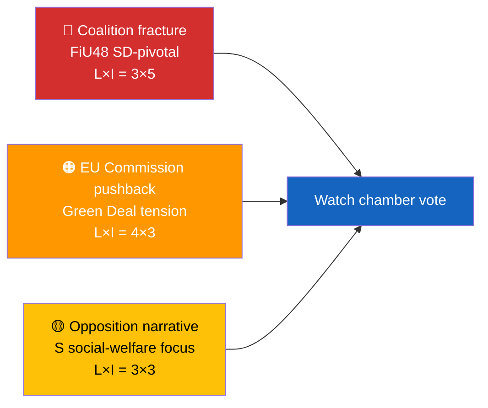

  

<h1 align="center">📰 Executive Brief Template</h1>

  <strong>📊 Decision-Grade BLUF for Editors and Duty Officers</strong> 
  <em>🎯 Bottom-Line-Up-Front · 3 Decisions · 60-Second Read · Confidence-Labeled</em>

  
  
  
  

**📋 Document Owner:** CEO | **📄 Version:** 1.0 | **📅 Last Updated:** 2026-04-21 (UTC)
**🏢 Owner:** Hack23 AB (Org.nr 5595347807) | **🏷️ Classification:** Public

> **📌 Template instructions:** Produce one `executive-brief.md` per workflow folder. It is the 60-second read that an editor uses to decide if the day ships, what leads, and what goes on the forward-watch board. Save as `analysis/daily/${ARTICLE_DATE}/${DOC_TYPE}/executive-brief.md`.

> **✨ What to produce:** A BLUF that names the leading development, lists three decisions this brief supports, an 8-bullet 60-second read, and the single top forward trigger — all evidence-backed and confidence-labeled.

---

## 🔄 Tradecraft Context

| Element | Value |
|---------|-------|
| **F3EAD Stage** | **DISSEMINATE** — finished intelligence product for decision-makers |
| **PIRs Served** | `[REQUIRED: List which PIRs this brief addresses, e.g., PIR-1, PIR-5]` |
| **Admiralty Floor** | **[B2]** — all evidence in this brief must reach ≥[B2] reliability |
| **WEP + ODNI** | Key judgments use **WEP** (almost certain / very likely / likely); confidence level reflects evidence quality (**HIGH** for multi-source dok_id corroboration) |
| **Source Diversity Floor** | P0/P1 claims in BLUF: ≥3 sources minimum; single-source claims prohibited in executive brief |
| **SAT(s) Applied** | Key Assumptions Check (validation), Brainstorming (decision options) |
| **ICD 203 Standards** | 5 (customer relevance), 6 (logical argumentation), 9 (visual information) |

---

## 📋 Brief Context

| Field | Value |
|-------|-------|
| **Brief ID** | `EB-YYYY-MM-DD-NNN` |
| **Generated** | `YYYY-MM-DD HH:MM UTC` |
| **Scope** | `e.g., 2026-04-21 realtime-1353` |
| **Documents covered** | `N` |
| **Overall Confidence** | `🟦 VERY HIGH / 🟩 HIGH / 🟧 MEDIUM / 🟥 LOW / ⬛ VERY LOW` |
| **Publication recommendation** | `PUBLISH / ANALYSIS-ONLY / SKIP` |
| **PIR Relevance** | `[REQUIRED: Primary PIR(s) addressed by this brief]` |

---

## 🎯 BLUF (Bottom Line Up Front)

> **[2–4 sentences.** Lead with the #1 DIW-ranked finding. Name the principal human actor with party. State the concrete action taken or proposed. Quantify impact. End with confidence label.**]**

Example: *Sweden's Riksdag Finance Committee approved FiU48 today, cutting fuel taxes SEK 0.50–0.80/litre and providing electricity/gas price support to ~3 M households. Paired with the new wind-power revenue-sharing law, the move anchors the government's cost-of-living + green narrative ahead of September 2026. [🟩 HIGH — source: `H901FiU48`, vote record 2026-04-21].*

---

## 🧭 3 Decisions This Brief Supports

| # | Decision | Who Decides | Deadline | Evidence |
|:-:|----------|-------------|:--------:|----------|
| 1 | **Editorial:** publish EN + SV breaking article within 2 h | Editor-in-chief | +2 h | DIW score 9.1 on HD01FiU48 |
| 2 | **Monitoring:** flag FiU48 chamber vote outcome | Duty monitor | 2026-04-22 → 2026-04-24 | `get_voting_group(bet=FiU48)` |
| 3 | **Forward-watch:** assign EU-Commission-response trigger | Analysis lead | +7 d | Green Deal fuel-tax tension |

---

## 📰 60-Second Read

- 🔴 **[Top development]** — who, what, where, when; cite `dok_id`
- 🟠 **[Second development]** — named actor, quantified effect
- 🟢 **[Positive development or win for coalition]** — include party
- 🟡 **[Point of tension or ambiguity]** — explain uncertainty in one line
- 🔵 **[Data or context point]** — SCB/World Bank/IMF figure with year
- 🟣 **[Cross-reference]** — link to another dok_id or cluster
- 🩷 **[Emerging threat or attack surface]** — political-threat-taxonomy dimension
- ⚪ **[Carry-forward or stale item]** — only if relevant; otherwise omit

Each bullet must name either a `dok_id`, a politician + party, a vote count, or a primary-source figure.

---

## 🗂️ Top Documents Table (DIW-ranked)

| Rank | dok_id | Title (short) | DIW | Confidence | Status |
|:----:|--------|---------------|:---:|:----------:|--------|
| 1 | `H901FiU48` | Extra amendment budget | 9.1 | 🟩 HIGH | Committee adopted |
| 2 | `HD03239` | Wind municipal revenue | 7.4 | 🟩 HIGH | Tabled |
| 3 | `HD11680` | Interpellation: Israel policy | 6.2 | 🟧 MEDIUM | Awaiting minister reply |

> Rank order must match `significance-scoring.md`. If it diverges, update one of the two files during Pass-2 rewrite.

---

## ⚠️ Risk & Threat Snapshot

| Risk | L | I | Score | Trigger | Source | Admiralty |
|------|:-:|:-:|:-----:|---------|--------|:---------:|
| Coalition fracture on fuel-tax package | 3 | 5 | 15 | Any coalition-party `Avstår` on FiU48 chamber vote | `risk-assessment.md` R1 | **[A1]** |
| EU Commission Green-Deal scrutiny | 4 | 3 | 12 | EU Commissioner statement within 14 d | `risk-assessment.md` R2 | **[B2]** |

---

## 🔮 Top Forward Trigger

> **Single most important event to watch next.** Include date, type, and what its outcome would change.

Example: *Chamber vote on FiU48 expected 2026-04-22 to 2026-04-24. A coalition-solid Ja outcome confirms pre-election discipline; any `Avstår` from L or KD raises R1 from score 15 to 20 and forces a revision of the Coalition-Mathematics analysis.*

---

## 📎 Links

| Link | Path |
|------|------|
| Synthesis summary | `synthesis-summary.md` |
| Significance scoring | `significance-scoring.md` |
| Risk assessment | `risk-assessment.md` |
| SWOT analysis | `swot-analysis.md` |
| Data manifest | `data-download-manifest.md` |
| Per-document analyses | `documents/` |

---

**Document Control**
- **Template path:** `/analysis/templates/executive-brief.md`
- **Referenced by:** [ai-driven-analysis-guide.md § Step 4](../methodologies/ai-driven-analysis-guide.md#step-4--core-synthesis-family-a-always-produced)
- **Classification:** Public
- **Next Review:** 2026-07-21
