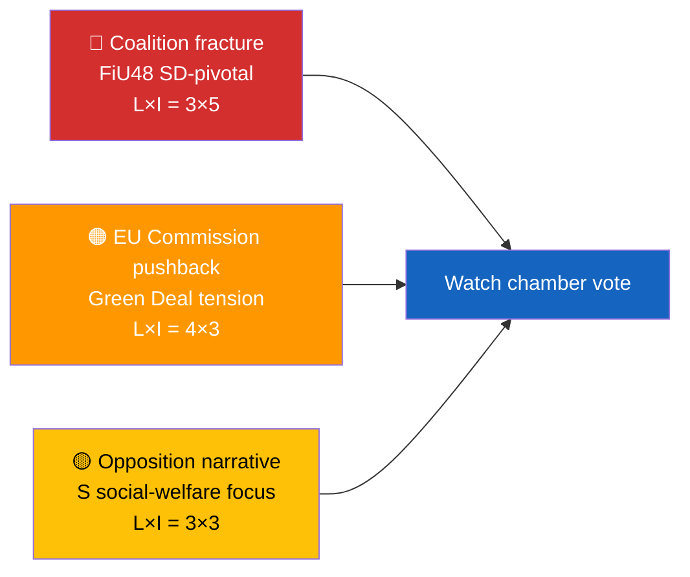

<p align="center">
  
</p>

<!--
H1 INSTRUCTION (highest-impact line in the brief — SEO, news value, RSS, social cards).

REPLACE the H1 immediately below with a publishable, story-oriented article title:
  • 55–70 chars (EN) — per-language budgets in `.github/prompts/seo-metadata-contract.md` §4
  • Actor-first (`Sweden`, `Riksdag`, coalition name, minister name, party code, instrument code)
  • Active news verb (`approves`, `blocks`, `splits`, `escalates`, `unveils`, `rebukes`, `restores`, `cuts`, `freezes`, `postpones`, `probes`, `warns`, `overrides`, `refers`, `ratifies`)
  • At least one of: named minister, party code, legislative instrument code, concrete number, time-relative anchor (no literal `YYYY-MM-DD`)
  • Sentence case (not Title Case)
  • Never `Executive Brief — …` · `AI-generated political intelligence` · trailing ` — Riksdagsmonitor`

If you leave the boilerplate H1 below, `cleanArticleTitle()` will strip the `Executive Brief — ` prefix and trailing date, then fall back to `titleFromBluf()` — that fallback is always weaker than a hand-crafted H1.
-->

<h1 align="center">📰 Executive Brief Template — REPLACE THIS H1 WITH A PUBLISHABLE STORY-ORIENTED TITLE</h1>

<p align="center">
  <strong>📊 Decision-Grade BLUF for Editors and Duty Officers</strong><br>
  <em>🎯 Bottom-Line-Up-Front · 3 Decisions · 60-Second Read · Confidence-Labeled</em>
</p>

<p align="center">
  <a href="#"></a>
  <a href="#"></a>
  <a href="#"></a>
  <a href="#"></a>
</p>

**📋 Document Owner:** CEO | **📄 Version:** 1.2 | **📅 Last Updated:** 2026-04-25 (UTC)
**🏢 Owner:** Hack23 AB (Org.nr 5595347807) | **🏷️ Classification:** Public

> **📌 Template instructions:** Produce one `executive-brief.md` per workflow folder. It is the 60-second read that an editor uses to decide if the day ships, what leads, and what goes on the forward-watch board. Save as `analysis/daily/${ARTICLE_DATE}/${DOC_TYPE}/executive-brief.md`.

> **✨ What to produce:** A BLUF that names the leading development, lists three decisions this brief supports, an 8-bullet 60-second read, and the single top forward trigger — all evidence-backed and confidence-labeled.

---

<!-- TEMPLATE_CONTRACT_V1 -->
> **📐 Template Contract** — every fill of this template MUST satisfy this row.
>
> | Slot | Value |
> |------|-------|
> | **Owning methodology** | [`per-artifact-methodologies.md`](../methodologies/per-artifact-methodologies.md#executive-brief) |
> | **Owning gate check** | Check 1 + Check 7 (BLUF/Decisions, 400–600 words) — see [`05-analysis-gate.md`](../../.github/prompts/05-analysis-gate.md) |
> | **Required inputs** | all Family A peers |
> | **Horizon band** | per-run (per [`scripts/horizon-context.ts`](../../scripts/horizon-context.ts)) |
> | **Output family** | Family A — Core Synthesis |
> | **Aggregation order** | 1 of 30 in canonical order (see [`scripts/render-lib/aggregator/order.ts`](../../scripts/render-lib/aggregator/order.ts)) |
> | **Reader Intelligence Guide** | row generated from `executive-brief.md` (see [`scripts/render-lib/aggregator/reader-guide.ts`](../../scripts/render-lib/aggregator/reader-guide.ts)) |
> | **Canonical evidence anchor** | `\| claim \| evidence (dok_id / vote / MP intressent_id / primary-source URL) \| retrieved_at \| confidence \|` — every analytical claim row uses this schema. |
>
> Cross-reference: [`README.md §Template ↔ Methodology ↔ Gate-Check Matrix`](README.md#-template--methodology--gate-check-matrix).

<!--
AI-FIRST Pass-1 / Pass-2 self-check (HTML comment — invisible in rendered articles; not stripped by aggregator unless under a "## Pass 2 …" heading).

PASS 1 (creation, minimal viable artifact):
  • Fill every REQUIRED slot above; cite ≥ 1 dok_id / vote / MP / primary-source URL per major claim.
  • Use the canonical evidence anchor schema for every analytical claim row.
  • Mermaid blocks use the cyberpunk %%{init: theme/themeVariables}%% prologue and at least one `style …` or `classDef …` directive (Check 5 of 05-analysis-gate.md).

PASS 2 (read-back & improve — AI-FIRST mandatory, ≥ 180 s after Pass 1):
  • Re-read the file end-to-end; for each section verify (a) ≥ 1 evidence anchor row, (b) WEP language tightened (no "may/might/could" hedges), (c) named actors with intressent_id where applicable, (d) Mermaid colour theming present.
  • Banned-phrase scan: "intelligence theatre", "sources say", "reportedly", "it is widely believed", "experts agree", "AI_MUST_REPLACE".
  • Citation density target: ≥ 1 evidence anchor row per 100 words of analytical prose.
  • Neutrality arithmetic: equal analytical depth across the 8 Riksdag parties (S, M, SD, V, MP, C, L, KD); flag and correct any bias in the Pass-2 Self-Audit section.

ANTI-TEMPLATE — DO NOT:
  • Ship plain prose without evidence anchor tables.
  • Leave AI_MUST_REPLACE / [REQUIRED: …] placeholders in the rendered output.
  • Cite a non-primary URL when a `dok_id` or vote record is available.
  • Treat co-occurrence of keywords as coordination; uni-directional chains as bi-directional.
  • Use a Mermaid block without colour theming (Check 5 will block aggregation).
  • Skip the Pass-2 read-back (Check 6 verifies mtime ≥ birth + 180 s OR a differing pass1/ snapshot).
-->

## 🔄 Tradecraft Context

| Element | Value |
|---------|-------|
| **F3EAD Stage** | **DISSEMINATE** — finished intelligence product for decision-makers |
| **PIRs Served** | `[REQUIRED: List which PIRs this brief addresses, e.g., PIR-1, PIR-5]` |
| **Admiralty Floor** | **[B2]** — all evidence in this brief must reach ≥[B2] reliability |
| **WEP + ODNI** | Key judgments use **WEP** (almost certain / very likely / likely); confidence level reflects evidence quality (**HIGH** for multi-source dok_id corroboration) |
| **Source Diversity Floor** | P0/P1 claims in BLUF: ≥3 sources minimum; single-source claims prohibited in executive brief |
| **SAT(s) Applied** | Key Assumptions Check (validation), Brainstorming (decision options) |
| **ICD 203 Standards** | 5 (customer relevance), 6 (logical argumentation), 9 (visual information) |

---

## 📋 Brief Context

| Field | Value |
|-------|-------|
| **Brief ID** | `EB-YYYY-MM-DD-NNN` |
| **Generated** | `YYYY-MM-DD HH:MM UTC` |
| **Scope** | `e.g., 2026-04-21 realtime-1353` |
| **Documents covered** | `N` |
| **Overall Confidence** | `🟦 VERY HIGH / 🟩 HIGH / 🟧 MEDIUM / 🟥 LOW / ⬛ VERY LOW` |
| **Publication recommendation** | `PUBLISH / ANALYSIS-ONLY / SKIP` |
| **PIR Relevance** | `[REQUIRED: Primary PIR(s) addressed by this brief]` |

---

## 🎯 BLUF (Bottom Line Up Front)

> **⚠️ Editor instruction (highest impact on SEO, news value, and reader trust).**
> 1. **REPLACE the H1 of this template** with a publishable, story-oriented article title BEFORE saving — the H1 IS the SERP `<title>`, `og:title`, JSON-LD `headline`, and sitemap card. A boilerplate H1 like `# 📰 Executive Brief Template` or `# Executive Brief — Propositions 2026-04-23` will trip `cleanArticleTitle()` (which strips the `Executive Brief — ` prefix and trailing date) and force a weaker fallback synthesised from the BLUF. Hand-crafted always beats fallback.
> 2. **The first BLUF paragraph IS the `<meta name="description">`** verbatim (with markdown stripped). Write it as a publishable lede, not as an analyst summary. The renderer truncates at sentence boundary inside the 140–200 char window (per-language budgets in [`.github/prompts/seo-metadata-contract.md`](../../.github/prompts/seo-metadata-contract.md) §4).
> 3. **No admin metadata** (`Brief ID:`, `Classification:`, `Prepared by:`, `Analyst:`, `60-second read:`, `Admiralty baseline:`, `Distribution:`, `Methodology:`) between the H1 and the BLUF heading — `readBlufParagraph()` skips admin paragraphs but a clean editor keeps the brief well-formed regardless.

### Decision-Grade BLUF Rubric (6-axis · all axes ≥ 3/5 to pass Pass-2)

| Axis | Question | Minimum pass | Excellent |
|------|----------|--------------|-----------|
| **Actor** | Is the principal political actor named? | Party + role | Named person + party + role + intressent_id |
| **Verb** | Is there an active news verb? | One verb from [`seo-metadata-contract.md` §2.1](../../.github/prompts/seo-metadata-contract.md) | Verb plus precise modifier (`narrowly approves`, `unilaterally blocks`) |
| **Instrument** | Is a concrete legislative instrument cited? | `dok_id` / `bet` / `prop.` / vote ID | Instrument + chamber stage + commencement date |
| **Number** | Is at least one concrete number present? | SEK/€ amount, vote count, seats, or % | Multiple numbers + comparison anchor (vs. prior year / vs. baseline) |
| **Consequence** | Is the so-what spelled out? | Single-sentence consequence for citizens / parties / coalition | Quantified consequence + Election-2026 lens |
| **Confidence** | Is the confidence labelled? | WEP band | WEP + Admiralty + ODNI + single-source flag if applicable |

> **Pass-2 check:** score each axis honestly; any axis below 3/5 forces a rewrite of the BLUF sentence (not just the rubric). Record the score in [`methodology-reflection.md`](methodology-reflection.md) §"Pass-2 audit log".

### BLUF paragraph (this is your meta description)

> **[2–4 sentences.** Sentence 1 = the publishable lede: 140–200 chars EN, one complete sentence, ends on `.`/`!`/`?`/`…`, leads with the #1 DIW-ranked finding, names principal actor, states concrete action, quantifies impact, ends with confidence label. Sentences 2–4 = optional supporting detail; the renderer truncates at sentence boundary for the `<meta description>`.**]**

Example: *Sweden's Riksdag Finance Committee approved FiU48 today, cutting fuel taxes SEK 0.50–0.80/litre and providing electricity/gas price support to ~3 M households. Paired with the new wind-power revenue-sharing law, the move anchors the government's cost-of-living + green narrative ahead of September 2026. [🟩 HIGH — source: `H901FiU48`, vote record 2026-04-21].*

---

## 🪧 Headline Candidates (worksheet — choose the best as H1)

> **Purpose:** the H1 is the single highest-impact line in the brief (SERP, sitemap, RSS, social cards). Always draft ≥ 3 alternatives and score them on the rubric below before locking the H1. Keep the worksheet in the artifact — it is evidence to the gate that the rubric was applied.

| # | Headline candidate (55–70 chars EN) | Actor | Verb | Instrument | Number | Consequence | Score /30 |
|:-:|-------------------------------------|:-----:|:----:|:----------:|:------:|:-----------:|:---------:|
| A | `[REQUIRED — actor + active verb + instrument + number]` | /5 | /5 | /5 | /5 | /10 | /30 |
| B | `[REQUIRED — alternative angle, same evidence]` | /5 | /5 | /5 | /5 | /10 | /30 |
| C | `[REQUIRED — third angle]` | /5 | /5 | /5 | /5 | /10 | /30 |

**Selected H1** (copy into the document H1 at the top of this file): `[REQUIRED]`

> **Banned phrases (auto-fail):** `Executive Brief — …`, `AI-generated political intelligence`, any literal `YYYY-MM-DD` or `YYYY/MM/DD`, `Brief ID:`, `Classification:`, `Prepared by:`, `Analyst:`, `60-second read:`, `Admiralty baseline:`, trailing ` — Riksdagsmonitor`.

---

## 🌐 14-Language SEO Metadata Seeds

> **Purpose:** seed good titles, descriptions and keywords for every generated HTML language page. Do not leave this to a date suffix. Each row must express the same verified story in the target language with a contextual angle: actor, action, object, consequence and provenance. Per-language character budgets are in [`.github/prompts/seo-metadata-contract.md`](../../.github/prompts/seo-metadata-contract.md) §4 — CJK count glyphs not bytes; RTL languages (`ar`/`he`) keep proper nouns in source script where conventional.

| lang | localized title angle (per-budget) | localized description angle (per-budget) | keyword seeds (5–8) |
|------|------------------------------------|------------------------------------------|---------------------|
| `en` | `[REQUIRED — 55–70 chars · actor + active verb + policy object + consequence]` | `[REQUIRED — 140–200 chars · SERP-ready summary with named actor/action, so-what, and source provenance]` | `[topic, actor, policy, Riksdag, OSINT]` |
| `sv` | `[REQUIRED — 55–70 chars · use native instrument names "proposition", "utskott"]` | `[REQUIRED — 140–200 chars]` | `[REQUIRED]` |
| `da` | `[REQUIRED — 55–70 chars · "Riksdagen" stays Swedish]` | `[REQUIRED — 140–200 chars]` | `[REQUIRED]` |
| `nb` | `[REQUIRED — 55–70 chars · BCP-47 nb; file suffix `no`, hreflang `nb`]` | `[REQUIRED — 140–200 chars]` | `[REQUIRED]` |
| `fi` | `[REQUIRED — 55–70 chars · tolerate +10 for agglutination]` | `[REQUIRED — 140–200 chars]` | `[REQUIRED]` |
| `de` | `[REQUIRED — 55–70 chars · tolerate +10 for compounds]` | `[REQUIRED — 140–200 chars]` | `[REQUIRED]` |
| `fr` | `[REQUIRED — 55–70 chars]` | `[REQUIRED — 140–200 chars]` | `[REQUIRED]` |
| `es` | `[REQUIRED — 55–70 chars]` | `[REQUIRED — 140–200 chars]` | `[REQUIRED]` |
| `nl` | `[REQUIRED — 55–70 chars]` | `[REQUIRED — 140–200 chars]` | `[REQUIRED]` |
| `ar` | `[REQUIRED — 45–60 chars · RTL · Riksdagen → الريكسداغ]` | `[REQUIRED — 120–170 chars · RTL]` | `[REQUIRED]` |
| `he` | `[REQUIRED — 45–60 chars · RTL · Riksdagen → ריקסדאג]` | `[REQUIRED — 120–170 chars · RTL]` | `[REQUIRED]` |
| `ja` | `[REQUIRED — 30–45 glyphs]` | `[REQUIRED — 70–120 glyphs]` | `[REQUIRED]` |
| `ko` | `[REQUIRED — 30–45 glyphs]` | `[REQUIRED — 70–120 glyphs]` | `[REQUIRED]` |
| `zh` | `[REQUIRED — 30–45 glyphs · Simplified · Riksdag → 瑞典议会]` | `[REQUIRED — 70–120 glyphs]` | `[REQUIRED]` |

> **Pass-2 check:** no two rows may be identical except for date or language label. If they are, rewrite the title/description around the concrete story topic and consequence. Translation cribs: [`scripts/translation-dictionary-party-names.ts`](../../scripts/translation-dictionary-party-names.ts), [`scripts/translation-dictionary-committee-names.ts`](../../scripts/translation-dictionary-committee-names.ts), [`scripts/translation-dictionary-political-terms.ts`](../../scripts/translation-dictionary-political-terms.ts).

---

## 📖 Narrative (v3.2 — required)

> **Purpose:** the BLUF is the analytic verdict; this section is the **prose handoff** to `article.md`. Apply [`political-style-guide.md` §"Narrative-Voice Standards"](../methodologies/political-style-guide.md#-narrative-voice-standards-v32--new) — pick **one** canonical lede pattern, name **three people** in the first 200 words, vary sentence cadence, include **≥ 1 concrete sensory detail per 400 words**, and end with the **counter-narrative paragraph**. This subsection is graded on the 6-axis Pass-2 narrative rubric (lede / scene / character / surprise / takeaway / counter-narrative); any axis < 3 forces a Pass-2 rewrite.

**Lede paragraph** *(120–180 words, hard-news / tension-contrast / scene-setting / significance-first)*

> `[REQUIRED — choose lede pattern. Sentence 1 must satisfy the pattern's evidence requirement. Sentence 2 should pull the reader into the consequence.]`

**Body paragraphs** *(2–4 paragraphs, total 300–500 words)*

> `[REQUIRED — name third actor by word 200, vary sentence length (one short / two medium / two long per paragraph), include one concrete sensory detail (time, room, exact phrasing of an interjection, or seating-chart fact). Tradecraft jargon allowed only with payoff within ≤ 2 sentences.]`

**Counter-narrative** *(60–150 words, signposted)*

> *"There is a contrary read."* `[REQUIRED — name one actor whose framing of these same numbers is genuinely different. Quote them. Do not soften with "however".]`

---

## 🧭 3 Decisions This Brief Supports

| # | Decision | Who Decides | Deadline | Evidence |
|:-:|----------|-------------|:--------:|----------|
| 1 | **Editorial:** publish EN + SV breaking article within 2 h | Editor-in-chief | +2 h | DIW score 9.1 on HD01FiU48 |
| 2 | **Monitoring:** flag FiU48 chamber vote outcome | Duty monitor | 2026-04-22 → 2026-04-24 | `get_voting_group(bet=FiU48)` |
| 3 | **Forward-watch:** assign EU-Commission-response trigger | Analysis lead | +7 d | Green Deal fuel-tax tension |

---

## 📰 60-Second Read

- 🔴 **[Top development]** — who, what, where, when; cite `dok_id`
- 🟠 **[Second development]** — named actor, quantified effect
- 🟢 **[Positive development or win for coalition]** — include party
- 🟡 **[Point of tension or ambiguity]** — explain uncertainty in one line
- 🔵 **[Data or context point]** — IMF-first macro/fiscal figure with vintage tag, SCB Swedish ground truth, Statskontoret agency-capacity evidence, or WB non-economic residue
- 🟣 **[Cross-reference]** — link to another dok_id or cluster
- 🩷 **[Emerging threat or attack surface]** — political-threat-taxonomy dimension
- ⚪ **[Carry-forward or stale item]** — only if relevant; otherwise omit

Each bullet must name either a `dok_id`, a politician + party, a vote count, or a primary-source figure.

---

## 🗂️ Top Documents Table (DIW-ranked)

| Rank | dok_id | Title (short) | DIW | Confidence | Status |
|:----:|--------|---------------|:---:|:----------:|--------|
| 1 | `H901FiU48` | Extra amendment budget | 9.1 | 🟩 HIGH | Committee adopted |
| 2 | `HD03239` | Wind municipal revenue | 7.4 | 🟩 HIGH | Tabled |
| 3 | `HD11680` | Interpellation: Israel policy | 6.2 | 🟧 MEDIUM | Awaiting minister reply |

> Rank order must match `significance-scoring.md`. If it diverges, update one of the two files during Pass-2 rewrite.

---

## ⚠️ Risk & Threat Snapshot



| Risk | L | I | Score | Trigger | Source | Admiralty |
|------|:-:|:-:|:-----:|---------|--------|:---------:|
| Coalition fracture on fuel-tax package | 3 | 5 | 15 | Any coalition-party `Avstår` on FiU48 chamber vote | `risk-assessment.md` R1 | **[A1]** |
| EU Commission Green-Deal scrutiny | 4 | 3 | 12 | EU Commissioner statement within 14 d | `risk-assessment.md` R2 | **[B2]** |

---

## 🔮 Top Forward Trigger

> **Single most important event to watch next.** Include date, type, and what its outcome would change.

Example: *Chamber vote on FiU48 expected 2026-04-22 to 2026-04-24. A coalition-solid Ja outcome confirms pre-election discipline; any `Avstår` from L or KD raises R1 from score 15 to 20 and forces a revision of the Coalition-Mathematics analysis.*

---

## 📎 Links

| Link | Path |
|------|------|
| Synthesis summary | `synthesis-summary.md` |
| Significance scoring | `significance-scoring.md` |
| Risk assessment | `risk-assessment.md` |
| SWOT analysis | `swot-analysis.md` |
| Data manifest | `data-download-manifest.md` |
| Per-document analyses | `documents/` |

---

**Document Control**
- **Template path:** `/analysis/templates/executive-brief.md`
- **Referenced by:** [ai-driven-analysis-guide.md § Step 4](../methodologies/ai-driven-analysis-guide.md#step-4--core-synthesis-family-a-always-produced)
- **Classification:** Public
- **Next Review:** 2026-07-21

---

## ✅ Pass-2 Self-Audit Checklist (v4.4 — required)

> **Purpose:** AI-FIRST principle requires a Pass-2 read-back-and-improve. After producing this artifact in Pass 1, re-read it end-to-end and verify each item below. Document any remediation in [`methodology-reflection.md`](methodology-reflection.md) §"Pass-2 audit log". Any unchecked ❌ box at the end of Pass 2 forces a Pass-3 rewrite of the affected section.

- [ ] **Tradecraft anchors honoured** — F3EAD stage matches the artifact's role; PIRs declared in the §Tradecraft Context block are actually addressed in the body; Admiralty grades attached to every external source; WEP band + ODNI confidence on every probabilistic judgement.
- [ ] **Source diversity floor met** — at least the minimum number of independent MCP sources required by the artifact's tradecraft block are cited; single-source claims are explicitly labelled `[SINGLE-SOURCE — corroboration pending]`.
- [ ] **Evidence specificity** — every quantified claim cites a `dok_id` (Riksdag), an SCB / IMF dataflow code, or a named external source with date; no "according to data" / "studies show" hand-waves.
- [ ] **Named-actor discipline** — every political claim names ≥ 1 person (party + role + dated act/quote) or labels the absence (`[diffuse — no named actor]`).
- [ ] **Counter-narrative present** — at least one explicit competing hypothesis, dissent quote, or framed objection appears in the body; "no opposition recorded" is itself a finding to label, not silence.
- [ ] **Election 2026 lens applied** — the §"Election 2026 Implications" subsection (or equivalent) addresses electoral salience, coalition pressure, and forward indicators; not boilerplate.
- [ ] **No illustrative content shipped as fact** — every `[REQUIRED]` placeholder is filled OR removed; every `Example:` block is clearly fenced or removed; no fabricated `dok_id`, vote count, or quote leaks into the final artifact.
- [ ] **Cross-references resolve** — every `[link](file.md)` in this artifact points to a file that exists in the run folder (`analysis/daily/$ARTICLE_DATE/$SUBFOLDER/`) or to a methodology / template under `analysis/`.
- [ ] **Mermaid renders** — every fenced ` ```mermaid ` block parses (no missing class definitions, no orphan nodes, no >40-node graphs that overflow viewport on mobile).
- [ ] **Line-floor check** — artifact length ≥ the per-artifact floor in [`reference-quality-thresholds.json`](../methodologies/reference-quality-thresholds.json); shorter artifacts trigger Pass-2 rewrite, never a `[truncated]` note.
- [ ] **H1 is publishable** — the H1 has been replaced with a story-oriented title that satisfies [`seo-metadata-contract.md`](../../.github/prompts/seo-metadata-contract.md) §2 (55–70 chars EN, actor-first, active verb, named instrument or number, no literal date, no `Executive Brief — …`, no trailing ` — Riksdagsmonitor`). The boilerplate "REPLACE THIS H1" placeholder is gone.
- [ ] **Decision-Grade BLUF rubric scored** — every axis (actor, verb, instrument, number, consequence, confidence) ≥ 3/5; the scores are recorded inline; any axis below 3/5 forced a BLUF rewrite (not just a rubric edit).
- [ ] **Headline-candidates worksheet present** — ≥ 3 alternative H1s drafted and scored; the winning candidate is the document H1.
- [ ] **BLUF paragraph SEO-fit** — first BLUF paragraph is one complete sentence, 140–200 chars EN (per-language budgets in [`seo-metadata-contract.md`](../../.github/prompts/seo-metadata-contract.md) §4), ends on `.`/`!`/`?`/`…`, never mid-word; no admin tokens (`Brief ID:`, `Classification:`, `Prepared by:`, `Analyst:`, `60-second read:`, `Admiralty baseline:`) leak into it.
- [ ] **14-language SEO seeds row complete** — every language row is filled with a localised title + description + keyword seeds; no two rows identical except date/language label; CJK use glyphs (`zh` 30–45 / 70–120); RTL flagged for `ar`/`he`; BCP-47 `nb` row present (not legacy `no`).
- [ ] **Top Forward Trigger names date + event type + outcome implication** — not vague "we will be watching" prose; the trigger names the specific watch item the duty monitor takes off the page.
- [ ] **Banned-phrase scan clean** — no `Executive Brief — …`, `AI-generated political intelligence`, literal `YYYY-MM-DD` in H1; no `intelligence theatre`, `sources say`, `reportedly`, `it is widely believed`, `experts agree` anywhere in the brief.
