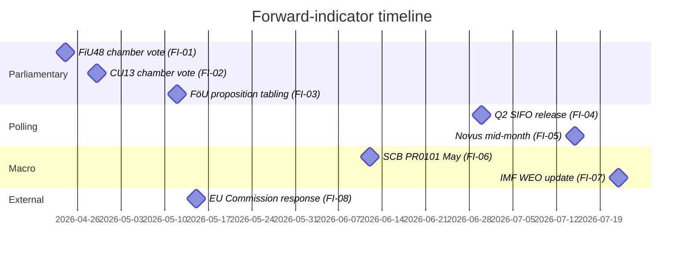
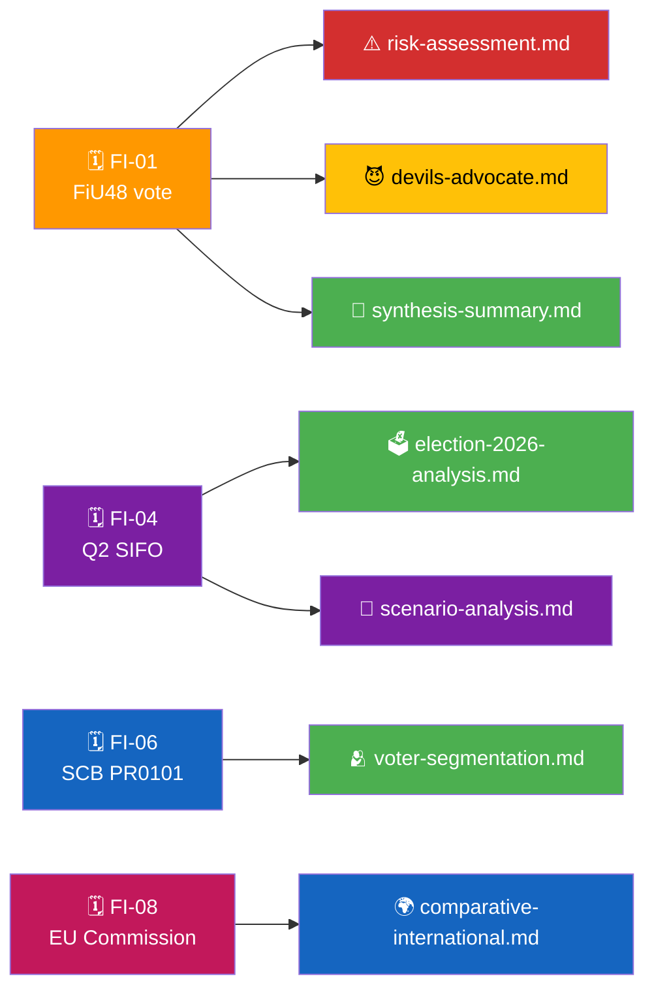

  

<h1 align="center">🔭 Forward Indicators Template</h1>

  <strong>📊 Actionable Watchlist of Dated Triggers That Will Update the Analysis</strong> 
  <em>🎯 Leading Indicators · Threshold Rules · Confidence Labels · Ownership</em>

  
  
  
  

**📋 Document Owner:** CEO | **📄 Version:** 1.1 | **📅 Last Updated:** 2026-04-25 (UTC)
**🏢 Owner:** Hack23 AB (Org.nr 5595347807) | **🏷️ Classification:** Public

> **📌 Template instructions:** Produce on every run as a required deliverable, with at least 10 forward indicators spanning near-, medium-, and longer-horizon triggers. Save as `analysis/daily/${ARTICLE_DATE}/${DOC_TYPE}/forward-indicators.md` or, for review cycles, at `analysis/weekly/${ISO_WEEK}/forward-indicators.md`.

> **✨ What to produce:** A single, authoritative watchlist — each indicator named, dated, threshold-defined, and tied to the downstream analysis it will update. Every indicator must be measurable from public MCP data.

---

## 🔄 Tradecraft Context

| Field | Value |
|-------|-------|
| **F3EAD stage** | `Analyze / Disseminate` (forward-looking watchlist drives next collection cycle) |
| **PIRs** | `every indicator ties to one or more standing PIRs — name them per indicator` |
| **Admiralty floor** | `A1 for measurable MCP-sourced thresholds; B2 acceptable for derived composite indicators` |
| **SATs used** | `Indicators & Signposts; Key Assumptions Check; Outside-In Thinking` |
| **ICD 203 standards applied** | `uncertainty, alternative analysis, consistency/change, customer relevance` |

> See [`political-style-guide.md`](../methodologies/political-style-guide.md) for canonical F3EAD / PIR catalog / Admiralty Code / ICD 203 / WEP / SATs definitions.

---

## 📋 Watchlist Context

| Field | Value |
|-------|-------|
| **Watchlist ID** | `FWI-YYYY-MM-DD-NNN` |
| **Generated** | `YYYY-MM-DD HH:MM UTC` |
| **Scope** | `e.g., week 17 / month 2026-04 / run-specific` |
| **Indicator count** | `N` |
| **Overall Confidence** | `🟩 HIGH` |

---

## 🧭 Indicator Dashboard

> ⚠️ **Illustrative example below — the Gantt milestones, indicator IDs, thresholds, and deadlines are drawn from a worked 2026 scenario.** Replace every milestone, date, indicator, threshold, and owner with run-specific values before publishing. Do not treat this example as an actual monitoring commitment.

---

## 🗂️ Indicator Register

| # | Indicator | Measurable via | Trigger threshold | Deadline | Owner (analysis file) | Confidence |
|:-:|-----------|----------------|-------------------|:--------:|-----------------------|:----------:|
| FI-01 | FiU48 chamber vote outcome | `search_voteringar(bet=FiU48)` | Coalition unanimity or ≥ 1 `Avstår` | 2026-04-24 | `risk-assessment.md` R1 | 🟦 VERY HIGH |
| FI-02 | CU13 chamber vote outcome | `search_voteringar(bet=CU13)` | Any close result (< 10-vote margin) | 2026-04-29 | `risk-assessment.md` R3 | 🟩 HIGH |
| FI-03 | FöU defence proposition tabling | `get_propositioner` | Tabled or delayed | 2026-05-12 | `threat-analysis.md` T2 | 🟩 HIGH |
| FI-04 | Q2 2026 SIFO release | Published by Kantar Sifo | Government-bloc gap ≥ −6 pp | 2026-06-30 | `election-2026-analysis.md` | 🟩 HIGH |
| FI-05 | Novus mid-July | Published by Novus | Consistency with FI-04 direction | 2026-07-15 | `scenario-analysis.md` | 🟩 HIGH |
| FI-06 | SCB PR0101 May CPI | `scb` query_table PR0101 | Pump-price index ↓ ≥ 3 % | 2026-06-12 | `voter-segmentation.md` S1 | 🟦 VERY HIGH |
| FI-07 | IMF WEO July update | `tsx scripts/imf-fetch.ts` | Sweden GDP revision | 2026-07-22 | `comparative-international.md` | 🟩 HIGH |
| FI-08 | EU Commission communication on fuel-tax cut | Commission press room | Any formal letter / opening of review | 2026-05-15 | `risk-assessment.md` R2 | 🟧 MEDIUM |
| FI-09 | SD public posture on fuel-tax sunset | `search_anforanden(parti=SD)` | Any ambiguity signal | Rolling | `coalition-mathematics.md` | 🟧 MEDIUM |
| FI-10 | Skatteverket guidance publication | Skatteverket site | Publication date | 2026-05-30 | `implementation-feasibility.md` D2 | 🟩 HIGH |

---

## 🧪 Indicator Detail — Example (repeat per FI)

### FI-01 — FiU48 chamber vote outcome

| Attribute | Value |
|-----------|-------|
| **Monitoring method** | MCP call `search_voteringar(bet=FiU48, rm=2025/26)` |
| **What a "positive" signal means** | Unanimous government-bloc Ja → confirms coalition discipline claim |
| **What a "negative" signal means** | Any coalition MP `Avstår` or `Nej` → coalition fracture signal |
| **Who changes?** | `risk-assessment.md` R1 score; `devils-advocate.md` ACH hypothesis H3; `synthesis-summary.md` §Finding 1 |
| **Fallback** | If vote delayed, re-check 2026-04-25, 2026-04-28 |
| **Confidence** | 🟦 VERY HIGH — Riksdag voting records are primary-source public data |

---

## 🔁 Update Rules

| Rule | When it fires |
|------|---------------|
| **Auto-rerun** | Any indicator reaches its deadline |
| **Re-score** | Indicator threshold is breached |
| **Promote** | Indicator exceeds threshold for 2 consecutive observations → risk register upgrade |
| **Retire** | Indicator passes deadline without breach → archive with observation note |

---

## 📅 This-Week Watch Window

| Day | Indicator | Action |
|-----|-----------|--------|
| 2026-04-22 | FI-01 prep | Pre-load `search_voteringar` query |
| 2026-04-24 | FI-01 | Record outcome, rerun dependent analyses |
| 2026-04-25 | FI-09 | Check SD spokesperson statements |
| 2026-04-29 | FI-02 | Record outcome |

---

## 🧭 Cross-File Impact Map

---

## 📎 Sources

| Source | Use |
|--------|-----|
| `riksdag-regering` MCP | Voteringar, anföranden, dokument, kalenderhändelser |
| `scb` MCP | CPI, pump-price index, labour statistics |
| `imf` (scripted) | Macro-fiscal updates |
| `world-bank` MCP | Governance / comparator indicators |
| Kantar Sifo, Novus, Demoskop | Public polling |
| EU Commission press room | State-aid communications |

---

**Document Control**
- **Template path:** `/analysis/templates/forward-indicators.md`
- **Referenced by:** [ai-driven-analysis-guide.md § Step 5](../methodologies/ai-driven-analysis-guide.md#step-5--extensions-f3ead-analyze-continued)
- **Classification:** Public
- **Next Review:** 2026-07-21
