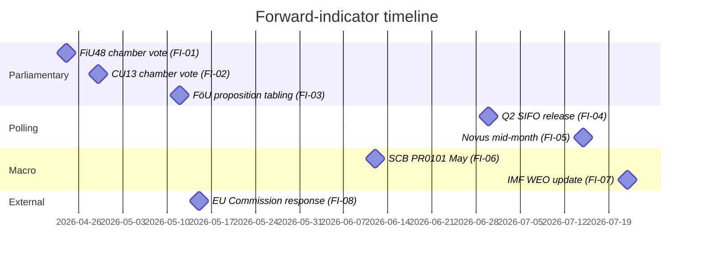
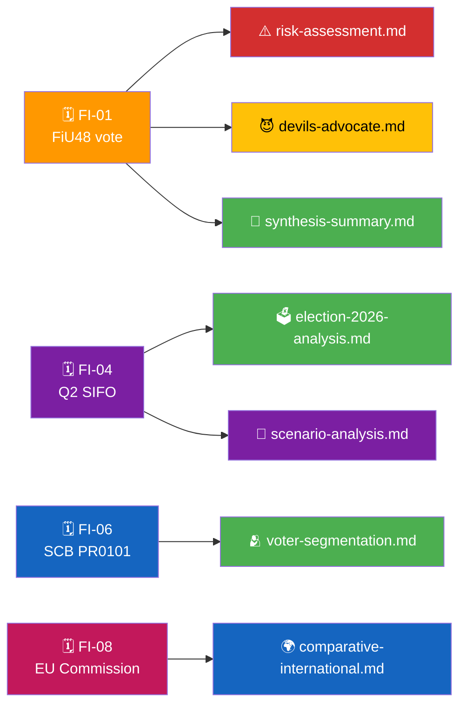

<p align="center">
  
</p>

<h1 align="center">🔭 Forward Indicators Template</h1>

<p align="center">
  <strong>📊 Actionable Watchlist of Dated Triggers That Will Update the Analysis</strong><br>
  <em>🎯 Leading Indicators · Threshold Rules · Confidence Labels · Ownership</em>
</p>

<p align="center">
  <a href="#"></a>
  <a href="#"></a>
  <a href="#"></a>
  <a href="#"></a>
</p>

**📋 Document Owner:** CEO | **📄 Version:** 2.0 | **📅 Last Updated:** 2026-05-01 (UTC)
**🏢 Owner:** Hack23 AB (Org.nr 5595347807) | **🏷️ Classification:** Public

> **📌 Template instructions:** Produce on every run as a required deliverable, with at least the minimum indicator count for the article type's horizon band (see §Horizon Bands below). Save as `analysis/daily/${ARTICLE_DATE}/${DOC_TYPE}/forward-indicators.md` or, for review cycles, at `analysis/weekly/${ISO_WEEK}/forward-indicators.md`.

> **✨ What to produce:** A single, authoritative watchlist — each indicator named, dated, threshold-defined, and tied to the downstream analysis it will update. Every indicator must be measurable from public MCP data.

---

## 🧭 Horizon Bands

> **Registry-driven rendering:** This template is a single file. The `forwardIndicatorHorizons` array in [`article-types.json`](../article-types.json) drives which bands render for a given article type. Existing morning runs (week-ahead and shorter) produce the same output structure as before — back-compat is preserved.

### Band Schema (conditional on `horizonDays`)

| Condition | Active bands |
|-----------|-------------|
| `horizonDays < 90` (morning, evening, weekly) | 72 h · week · month |
| `horizonDays = 90` (quarter-ahead) | 72 h · week · month · **quarter** |
| `horizonDays = 365` (year-ahead) | 72 h · week · month · quarter · **year** |
| `horizonDays >= 1460` (election-cycle) | 72 h · week · month · quarter · year · **cycle** |

### WEP-Degradation Ladder (per-band ceiling)

As the forecast horizon extends, epistemic certainty decreases. The Words of Estimative Probability (WEP) ceiling degrades accordingly:

| Band | Label | WEP ceiling | Rationale |
|------|-------|-------------|-----------|
| T+72h | 72 hours | **very likely / very unlikely** | Near-term; high confidence from scheduled events |
| T+7d | week | **likely / unlikely** | Short-term; most parliamentary triggers known |
| T+30d | month | **likely / unlikely** | Medium-term; some uncertainty in scheduling |
| T+90d | quarter | **roughly even / about even** | Extended; multiple intervening variables |
| T+365d | year | **roughly even** (mandatory unless ≥3 corroborated sources) | Long-range; structural uncertainty dominates |
| T+1460d | cycle | **roughly even / unlikely / very unlikely; never likely/very likely** without ≥3 cycle-aged sources | Ultra-long; scenario-driven only |

### Minimum Indicator Counts (per article type)

| Article type | Min indicators | Bands |
|--------------|:--------------:|-------|
| Week-ahead (`horizonDays=7`) | **6** | 72h, week, month, quarter, election |
| Month-ahead (`horizonDays=30`) | **8** | 72h, week, month, quarter, year, election |
| Quarter-ahead (`horizonDays=90`) | **10** | week, month, quarter, year, election |
| Year-ahead (`horizonDays=365`) | **12** | month, quarter, year, cycle, election |
| Election-cycle (`horizonDays>=1460`) | **15** | quarter, year, cycle, election |

> **Note:** Single-type and tier-c-aggregation articles (morning runs, evening analysis) use the legacy 4-band schema (72h / week / month / election) with a floor of 6 indicators.

---

## 🔄 Tradecraft Context

| Field | Value |
|-------|-------|
| **F3EAD stage** | `Analyze / Disseminate` (forward-looking watchlist drives next collection cycle) |
| **PIRs** | `every indicator ties to one or more standing PIRs — name them per indicator` |
| **Admiralty floor** | `A1 for measurable MCP-sourced thresholds; B2 acceptable for derived composite indicators` |
| **SATs used** | `Indicators & Signposts; Key Assumptions Check; Outside-In Thinking` |
| **ICD 203 standards applied** | `uncertainty, alternative analysis, consistency/change, customer relevance` |

> See [`political-style-guide.md`](../methodologies/political-style-guide.md) for canonical F3EAD / PIR catalog / Admiralty Code / ICD 203 / WEP / SATs definitions.

---

## 📋 Watchlist Context

| Field | Value |
|-------|-------|
| **Watchlist ID** | `FWI-YYYY-MM-DD-NNN` |
| **Generated** | `YYYY-MM-DD HH:MM UTC` |
| **Scope** | `e.g., week 17 / month 2026-04 / run-specific` |
| **Indicator count** | `N` |
| **Overall Confidence** | `🟩 HIGH` |

---

## 🧭 Indicator Dashboard

> ⚠️ **Illustrative example below — the Gantt milestones, indicator IDs, thresholds, and deadlines are drawn from a worked 2026 scenario.** Replace every milestone, date, indicator, threshold, and owner with run-specific values before publishing. Do not treat this example as an actual monitoring commitment.



---

## 🗂️ Indicator Register

| # | Indicator | Measurable via | Trigger threshold | Deadline | Owner (analysis file) | Confidence |
|:-:|-----------|----------------|-------------------|:--------:|-----------------------|:----------:|
| FI-01 | FiU48 chamber vote outcome | `search_voteringar(bet=FiU48)` | Coalition unanimity or ≥ 1 `Avstår` | 2026-04-24 | `risk-assessment.md` R1 | 🟦 VERY HIGH |
| FI-02 | CU13 chamber vote outcome | `search_voteringar(bet=CU13)` | Any close result (< 10-vote margin) | 2026-04-29 | `risk-assessment.md` R3 | 🟩 HIGH |
| FI-03 | FöU defence proposition tabling | `get_propositioner` | Tabled or delayed | 2026-05-12 | `threat-analysis.md` T2 | 🟩 HIGH |
| FI-04 | Q2 2026 SIFO release | Published by Kantar Sifo | Government-bloc gap ≥ −6 pp | 2026-06-30 | `election-2026-analysis.md` | 🟩 HIGH |
| FI-05 | Novus mid-July | Published by Novus | Consistency with FI-04 direction | 2026-07-15 | `scenario-analysis.md` | 🟩 HIGH |
| FI-06 | SCB PR0101 May CPI | `scb` query_table PR0101 | Pump-price index ↓ ≥ 3 % | 2026-06-12 | `voter-segmentation.md` S1 | 🟦 VERY HIGH |
| FI-07 | IMF WEO July update | `tsx scripts/imf-fetch.ts` | Sweden GDP revision | 2026-07-22 | `comparative-international.md` | 🟩 HIGH |
| FI-08 | EU Commission communication on fuel-tax cut | Commission press room | Any formal letter / opening of review | 2026-05-15 | `risk-assessment.md` R2 | 🟧 MEDIUM |
| FI-09 | SD public posture on fuel-tax sunset | `search_anforanden(parti=SD)` | Any ambiguity signal | Rolling | `coalition-mathematics.md` | 🟧 MEDIUM |
| FI-10 | Skatteverket guidance publication | Skatteverket site | Publication date | 2026-05-30 | `implementation-feasibility.md` D2 | 🟩 HIGH |

---

## 🧪 Indicator Detail — Example (repeat per FI)

### FI-01 — FiU48 chamber vote outcome

| Attribute | Value |
|-----------|-------|
| **Monitoring method** | MCP call `search_voteringar(bet=FiU48, rm=2025/26)` |
| **What a "positive" signal means** | Unanimous government-bloc Ja → confirms coalition discipline claim |
| **What a "negative" signal means** | Any coalition MP `Avstår` or `Nej` → coalition fracture signal |
| **Who changes?** | `risk-assessment.md` R1 score; `devils-advocate.md` ACH hypothesis H3; `synthesis-summary.md` §Finding 1 |
| **Fallback** | If vote delayed, re-check 2026-04-25, 2026-04-28 |
| **Confidence** | 🟦 VERY HIGH — Riksdag voting records are primary-source public data |

---

## 🔁 Update Rules

| Rule | When it fires |
|------|---------------|
| **Auto-rerun** | Any indicator reaches its deadline |
| **Re-score** | Indicator threshold is breached |
| **Promote** | Indicator exceeds threshold for 2 consecutive observations → risk register upgrade |
| **Retire** | Indicator passes deadline without breach → archive with observation note |

---

## 📅 This-Week Watch Window

| Day | Indicator | Action |
|-----|-----------|--------|
| 2026-04-22 | FI-01 prep | Pre-load `search_voteringar` query |
| 2026-04-24 | FI-01 | Record outcome, rerun dependent analyses |
| 2026-04-25 | FI-09 | Check SD spokesperson statements |
| 2026-04-29 | FI-02 | Record outcome |

---

## 🧭 Cross-File Impact Map



---

## 📎 Sources

| Source | Use |
|--------|-----|
| `riksdag-regering` MCP | Voteringar, anföranden, dokument, kalenderhändelser |
| `scb` MCP | CPI, pump-price index, labour statistics |
| `imf` (scripted) | Macro-fiscal updates |
| `world-bank` MCP | Governance / comparator indicators |
| Kantar Sifo, Novus, Demoskop | Public polling |
| EU Commission press room | State-aid communications |

---

**Document Control**
- **Template path:** `/analysis/templates/forward-indicators.md`
- **Referenced by:** [ai-driven-analysis-guide.md § Step 5](../methodologies/ai-driven-analysis-guide.md#step-5--extensions-f3ead-analyze-continued)
- **Classification:** Public
- **Next Review:** 2026-07-21

---

## ✅ Pass-2 Self-Audit Checklist (v4.4 — required)

> **Purpose:** AI-FIRST principle requires a Pass-2 read-back-and-improve. After producing this artifact in Pass 1, re-read it end-to-end and verify each item below. Document any remediation in [`methodology-reflection.md`](methodology-reflection.md) §"Pass-2 audit log". Any unchecked ❌ box at the end of Pass 2 forces a Pass-3 rewrite of the affected section.

- [ ] **Tradecraft anchors honoured** — F3EAD stage matches the artifact's role; PIRs declared in the §Tradecraft Context block are actually addressed in the body; Admiralty grades attached to every external source; WEP band + ODNI confidence on every probabilistic judgement.
- [ ] **Source diversity floor met** — at least the minimum number of independent MCP sources required by the artifact's tradecraft block are cited; single-source claims are explicitly labelled `[SINGLE-SOURCE — corroboration pending]`.
- [ ] **Evidence specificity** — every quantified claim cites a `dok_id` (Riksdag), an SCB / IMF dataflow code, or a named external source with date; no "according to data" / "studies show" hand-waves.
- [ ] **Named-actor discipline** — every political claim names ≥ 1 person (party + role + dated act/quote) or labels the absence (`[diffuse — no named actor]`).
- [ ] **Counter-narrative present** — at least one explicit competing hypothesis, dissent quote, or framed objection appears in the body; "no opposition recorded" is itself a finding to label, not silence.
- [ ] **Election 2026 lens applied** — the §"Election 2026 Implications" subsection (or equivalent) addresses electoral salience, coalition pressure, and forward indicators; not boilerplate.
- [ ] **No illustrative content shipped as fact** — every `[REQUIRED]` placeholder is filled OR removed; every `Example:` block is clearly fenced or removed; no fabricated `dok_id`, vote count, or quote leaks into the final artifact.
- [ ] **Cross-references resolve** — every `[link](file.md)` in this artifact points to a file that exists in the run folder (`analysis/daily/$ARTICLE_DATE/$SUBFOLDER/`) or to a methodology / template under `analysis/`.
- [ ] **Mermaid renders** — every fenced ` ```mermaid ` block parses (no missing class definitions, no orphan nodes, no >40-node graphs that overflow viewport on mobile).
- [ ] **Indicator-count floor** — total indicators ≥ minimum for the article type's horizon band (6 week / 8 month / 10 quarter / 12 year / 15 cycle); WEP ceiling respected per band; no indicator assigned a probability above its band's WEP ceiling.
- [ ] **Line-floor check** — artifact length ≥ the per-artifact floor in [`reference-quality-thresholds.json`](../methodologies/reference-quality-thresholds.json); shorter artifacts trigger Pass-2 rewrite, never a `[truncated]` note.

