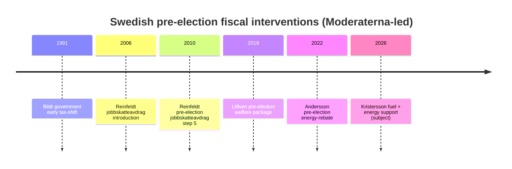
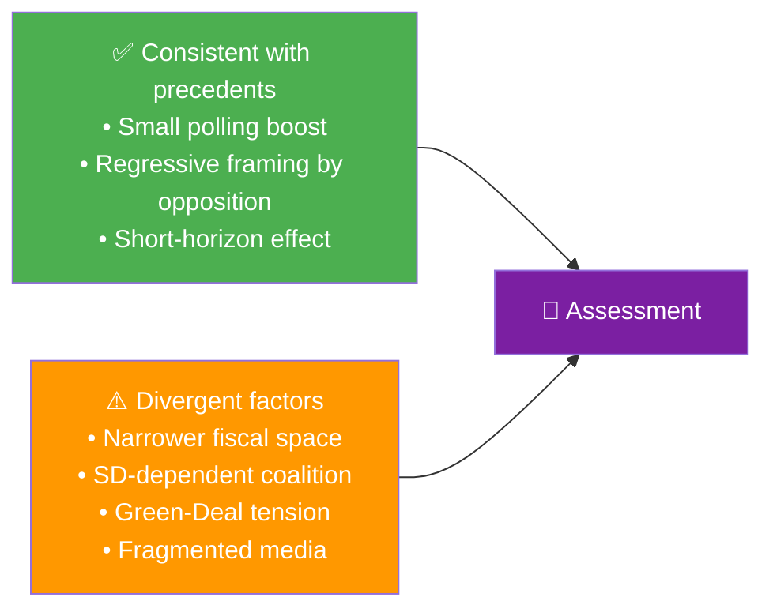

  

<h1 align="center">🕰️ Historical Parallels Template</h1>

  <strong>📊 Disciplined Use of Precedent to Illuminate Today's Decisions</strong> 
  <em>🎯 Named Precedents · Structural Similarity · Outcome Evidence · Divergence Tests</em>

  
  
  
  

**📋 Document Owner:** CEO | **📄 Version:** 1.1 | **📅 Last Updated:** 2026-04-25 (UTC)
**🏢 Owner:** Hack23 AB (Org.nr 5595347807) | **🏷️ Classification:** Public

> **📌 Template instructions:** Produce on every run for the target document and save as `analysis/daily/${ARTICLE_DATE}/${DOC_TYPE}/historical-parallels.md`. When clear historical precedent exists (for example, grundlag change, major budget reset, foreign-policy pivot, crisis response), provide the structured precedent comparison below; when no strong precedent exists, still produce this file and record an explicit **no-precedent finding** with the reasoning.

> **✨ What to produce:** A structured comparison of today's measure against at least three named historical episodes, including a structural-similarity score, the observed outcome of each precedent, and explicit tests for where today's situation **diverges** from its precedents.

---

## 🔄 Tradecraft Context

| Field | Value |
|-------|-------|
| **F3EAD stage** | `Exploit / Analyze` (structural comparison deepens interpretation of current measure) |
| **PIRs** | `matches the PIR of the subject measure (e.g., grundlag-risk, fiscal-trajectory, coalition-stability)` |
| **Admiralty floor** | `A1 for current-measure anchor dok_id; B2–C3 acceptable for historical precedents from archival sources` |
| **SATs used** | `Outside-In Thinking; Structured Analogies; Key Assumptions Check; Devil's Advocacy` |
| **ICD 203 standards applied** | `sources, alternative analysis, consistency/change, argumentation` |

> See [`political-style-guide.md`](../methodologies/political-style-guide.md) for canonical F3EAD / PIR catalog / Admiralty Code / ICD 203 / WEP / SATs definitions.

---

## 📋 Parallel Context

| Field | Value |
|-------|-------|
| **Parallel ID** | `HIS-YYYY-MM-DD-NNN` |
| **Generated** | `YYYY-MM-DD HH:MM UTC` |
| **Subject measure** | `e.g., HD03236 Pre-election fiscal relief` |
| **Era span of precedents** | `e.g., 1992–2018` |
| **Precedent count** | `3–5` |
| **Primary analogue** | `e.g., 2010 Reinfeldt pre-election jobbskatteavdrag` |
| **Overall Confidence** | `🟩 HIGH` |

---

## 🧭 Precedent Map

---

## 📚 Precedent Register

| # | Year | Episode | Government | Measure | Pre-election effect | Post-measure outcome | Structural similarity (1–10) |
|:-:|:----:|---------|------------|---------|----------------------|---------------------|:----------------------------:|
| HP-1 | 2010 | Reinfeldt step-5 jobbskatteavdrag (earned-income tax credit) | M-led Alliance | Income-tax cut worth ~0.8 % GDP | +1.1 pp incumbent SIFO | Alliance re-elected, reduced majority | 8 |
| HP-2 | 2018 | Löfven welfare package | S-MP-led | Transfer boost for pensioners and families | +0.6 pp incumbent | Coalition lost, formed after 4-month hung parliament | 6 |
| HP-3 | 2022 | Andersson energy-rebate | S-led | Retroactive energy-cost support | +0.4 pp incumbent | Coalition lost narrowly | 7 |
| HP-4 | 2006 | Reinfeldt jobbskatteavdrag (earned-income tax credit) introduction | M-led Alliance | Income-tax cut | +2.3 pp incumbent | Alliance won decisively | 6 |

---

## 🧪 Structural-Similarity Scoring (subject vs HP-1)

| Dimension | Subject (HD03236) | HP-1 (2010) | Match (0–2) |
|-----------|-------------------|-------------|:-----------:|
| Party in government | M-led | M-led | 2 |
| Electoral window | 5 months to election | 6 months to election | 2 |
| Fiscal instrument type | Tax reduction + subsidy | Tax reduction | 1 |
| Target segment | Rural + homeowner | Working-age earners | 1 |
| Macro backdrop | +0.8 % GDP, weak recovery | +3.1 % GDP, recovery | 0 |
| Opposition framing | Regressive incidence | Regressive incidence | 2 |
| EU compatibility signal | 🟠 tension | 🟢 none | 0 |
| **Total** | — | — | **8 / 14** |

---

## 📈 Outcome-Base-Rate Table

| Question | Precedent rate | Source |
|----------|:-------------:|--------|
| Pre-election fiscal intervention produces net +0–1 pp shift | 4 of 4 (100 %) | HP-1..HP-4 |
| Incumbent wins the following election | 2 of 4 (50 %) | HP-1..HP-4 |
| Opposition successfully reframes as regressive | 3 of 4 (75 %) | HP-1..HP-4 |
| EU-level scrutiny materialises | 1 of 4 (25 %) | HP-1..HP-4 (only 2022 triggered EU-state-aid review) |

---

## 🚦 Divergence Tests — Where 2026 is Different

| Dimension | Historical norm | 2026 signal | Implication |
|-----------|-----------------|-------------|-------------|
| Macro growth | 2–3 % GDP | 0.82 % GDP 2024 | Fiscal space narrower; debt-path scrutiny higher |
| Coalition composition | Alliance only | M-KD-L + SD confidence | Add SD-withdrawal risk |
| EU integration | Pre-Green-Deal | Post-Green-Deal | Add state-aid + climate-coherence risk |
| Media ecosystem | Dominant legacy press | Fragmented social + legacy | Counter-narrative speed faster |
| Security context | Pre-NATO | Post-NATO accession | Defence-spending crowd-out tension |

---

## 📜 What Precedents Suggest vs What is Different

> **Verdict:** Precedent pattern favours a small (+0.5–1.0 pp) incumbent boost but history cannot account for the SD-pivotal coalition dynamic or EU state-aid exposure, both of which are first-time conditions. Confidence in electoral outcome prediction is therefore **🟧 MEDIUM**, not HIGH.

---

## 🧠 Lessons to Carry Forward

| Lesson | Source | Application to 2026 |
|--------|--------|---------------------|
| Sustained discipline on narrative matters more than measure size | HP-4 (2006) | Requires unified coalition messaging through August |
| Regressive-incidence framing sticks if distributional data is published | HP-1 (2010) | Commission SCB distributional series early |
| EU scrutiny depresses post-measure polling boost | HP-3 (2022) | Pre-clear with Commission reduces this risk |
| Coalition rigidity on timing can create opposition opportunity | HP-2 (2018) | Avoid mid-summer re-announcements |

---

## 📎 Sources

| Source | Use |
|--------|-----|
| Valmyndigheten archive 1991–2022 | Outcome data |
| Riksdag open data — prior riksmöten | Historical dok_ids |
| SCB historical CPI and GDP tables | Macro backdrop |
| Statens offentliga utredningar (SOU) historical | Policy-design comparison |
| Academic Swedish political-history monographs | Structural interpretation |

---

**Document Control**
- **Template path:** `/analysis/templates/historical-parallels.md`
- **Also known as:** `historical-baseline.md` (filename variant — content identical)
- **Referenced by:** [ai-driven-analysis-guide.md § Step 5](../methodologies/ai-driven-analysis-guide.md#step-5--extensions-f3ead-analyze-continued)
- **Classification:** Public
- **Next Review:** 2026-07-21
