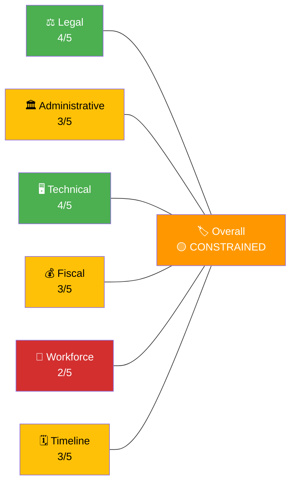
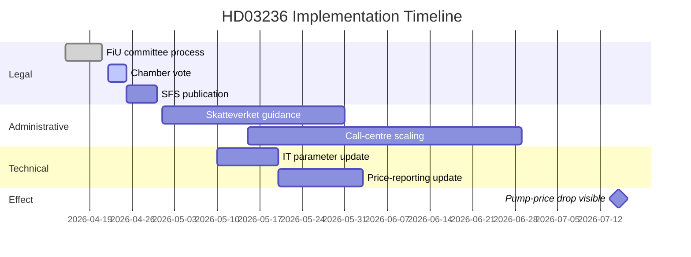

<p align="center">
  
</p>

<h1 align="center">🛠️ Implementation Feasibility Template</h1>

<p align="center">
  <strong>📊 Can the Policy Actually Be Delivered — By When, At What Cost, With What Risks?</strong><br>
  <em>🎯 Legal · Administrative · Technical · Fiscal · Workforce · Timeline</em>
</p>

<p align="center">
  <a href="#"></a>
  <a href="#"></a>
  <a href="#"></a>
  <a href="#"></a>
</p>

**📋 Document Owner:** CEO | **📄 Version:** 1.2 | **📅 Last Updated:** 2026-04-25 (UTC)
**🏢 Owner:** Hack23 AB (Org.nr 5595347807) | **🏷️ Classification:** Public

> **📌 Template instructions:** Produce this document on every run. If the current bill has concrete delivery obligations (budget line, infrastructure, IT system, procurement, workforce change), assess that bill directly; otherwise, use this template to audit implementation feasibility for the relevant delivery backlog or previously announced measures. Save as `analysis/daily/${ARTICLE_DATE}/${DOC_TYPE}/implementation-feasibility.md`.

> **✨ What to produce:** A structured feasibility review across six delivery dimensions (Legal, Administrative, Technical, Fiscal, Workforce, Timeline) with evidence and a calibrated overall-feasibility verdict (READY / FEASIBLE / CONSTRAINED / HIGH-RISK / UNLIKELY).

---

<!-- TEMPLATE_CONTRACT_V1 -->
> **📐 Template Contract** — every fill of this template MUST satisfy this row.
>
> | Slot | Value |
> |------|-------|
> | **Owning methodology** | [`per-artifact-methodologies.md`](../methodologies/per-artifact-methodologies.md#implementation-feasibility) |
> | **Owning gate check** | Check 8 (Family D) + Check 9b (Statskontoret evidence) — see [`05-analysis-gate.md`](../../.github/prompts/05-analysis-gate.md) |
> | **Required inputs** | Statskontoret index, agency capacity, `risk-assessment.md` |
> | **Horizon band** | mixed (T+30…T+365) (per [`scripts/horizon-context.ts`](../../scripts/horizon-context.ts)) |
> | **Output family** | Family D — Electoral & Domain |
> | **Aggregation order** | 20 of 30 in canonical order (see [`scripts/render-lib/aggregator/order.ts`](../../scripts/render-lib/aggregator/order.ts)) |
> | **Reader Intelligence Guide** | row generated from `implementation-feasibility.md` (see [`scripts/render-lib/aggregator/reader-guide.ts`](../../scripts/render-lib/aggregator/reader-guide.ts)) |
> | **Canonical evidence anchor** | `\| claim \| evidence (dok_id / vote / MP intressent_id / primary-source URL) \| retrieved_at \| confidence \|` — every analytical claim row uses this schema. |
>
> Cross-reference: [`README.md §Template ↔ Methodology ↔ Gate-Check Matrix`](README.md#-template--methodology--gate-check-matrix).

<!--
AI-FIRST Pass-1 / Pass-2 self-check (HTML comment — invisible in rendered articles; not stripped by aggregator unless under a "## Pass 2 …" heading).

PASS 1 (creation, minimal viable artifact):
  • Fill every REQUIRED slot above; cite ≥ 1 dok_id / vote / MP / primary-source URL per major claim.
  • Use the canonical evidence anchor schema for every analytical claim row.
  • Mermaid blocks use the cyberpunk %%{init: theme/themeVariables}%% prologue and at least one `style …` or `classDef …` directive (Check 5 of 05-analysis-gate.md).

PASS 2 (read-back & improve — AI-FIRST mandatory, ≥ 180 s after Pass 1):
  • Re-read the file end-to-end; for each section verify (a) ≥ 1 evidence anchor row, (b) WEP language tightened (no "may/might/could" hedges), (c) named actors with intressent_id where applicable, (d) Mermaid colour theming present.
  • Banned-phrase scan: "intelligence theatre", "sources say", "reportedly", "it is widely believed", "experts agree", "AI_MUST_REPLACE".
  • Citation density target: ≥ 1 evidence anchor row per 100 words of analytical prose.
  • Neutrality arithmetic: equal analytical depth across the 8 Riksdag parties (S, M, SD, V, MP, C, L, KD); flag and correct any bias in the Pass-2 Self-Audit section.

ANTI-TEMPLATE — DO NOT:
  • Ship plain prose without evidence anchor tables.
  • Leave AI_MUST_REPLACE / [REQUIRED: …] placeholders in the rendered output.
  • Cite a non-primary URL when a `dok_id` or vote record is available.
  • Treat co-occurrence of keywords as coordination; uni-directional chains as bi-directional.
  • Use a Mermaid block without colour theming (Check 5 will block aggregation).
  • Skip the Pass-2 read-back (Check 6 verifies mtime ≥ birth + 180 s OR a differing pass1/ snapshot).
-->

## 🔄 Tradecraft Context

| Element | Value |
|---------|-------|
| **F3EAD Stage** | **ANALYZE** — delivery risk assessment |
| **PIRs Served** | **PIR-5** (Fiscal Trajectory — budget feasibility), **PIR-7** (Democratic Norms — accountability for delivery) |
| **Admiralty Floor** | Ministry statements require **[B2]**; budget figures require **[A1]** (official appropriation documents) |
| **WEP + ODNI** | Delivery-risk scenarios use **WEP** (likely/unlikely for on-time delivery); confidence **MODERATE** (ministries rarely disclose implementation challenges publicly) |
| **Source Diversity Floor** | P1 (delivery-risk claims): ≥3 sources (budget dok_id + ministry statement + expert assessment); avoid single-ministry-spokesperson claims |
| **SAT(s) Applied** | Premortem Analysis (assume failure and explain why), Key Assumptions Check (delivery assumptions) |
| **ICD 203 Standards** | 2 (uncertainties — delivery risks), 5 (customer relevance — implementation milestones), 6 (logical argumentation) |

---

## 📋 Feasibility Context

| Field | Value |
|-------|-------|
| **Feasibility ID** | `FEA-YYYY-MM-DD-NNN` |
| **Generated** | `YYYY-MM-DD HH:MM UTC` |
| **Subject measure** | `dok_id and short title` |
| **Responsible ministry / agency** | `e.g., Finansdepartementet + Skatteverket` |
| **Statskontoret relevance** | `Relevant report/page URL or "none found"` |
| **Declared start date** | `YYYY-MM-DD` |
| **Declared completion date** | `YYYY-MM-DD` |
| **Budget envelope** | `SEK X.Y billion` |
| **Overall verdict** | `🟢 READY / 🟢 FEASIBLE / 🟡 CONSTRAINED / 🟠 HIGH-RISK / 🔴 UNLIKELY` |

---

## 🧭 Feasibility Overview

> **Rendering note:** Mermaid 11 core does not ship the `radar` diagram type. The canonical fallback below is a `graph LR` "spoke" chart that conveys the same per-dimension score (1–5) and colour-codes each spoke by traffic-light status. Restore a `radar` variant only once the renderer enables the plugin and the validator (`npm run validate:mermaid`) accepts it.



---

## 📊 Dimension-by-Dimension Review

### ⚖️ Legal feasibility — 4/5

| Check | Status | Evidence |
|-------|:------:|----------|
| Constitutional authority (Regeringsformen) | 🟢 | Within budgetary prerogative |
| EU compatibility | 🟡 | State-aid risk flagged; notification path open |
| Secondary-law impact | 🟢 | Skattelag amendment required, scheduled |
| Litigation exposure | 🟢 | Low |

### 🏛️ Administrative feasibility — 3/5

> **Statskontoret overlay:** administrative-capacity, coordination, backlog, regulatory-burden and efficiency claims should cite Statskontoret first when a relevant public report/page exists. Record URL, report title, publication date, retrieval time and Admiralty grade in `data-download-manifest.md`.

| Check | Status | Evidence |
|-------|:------:|----------|
| Responsible agency capacity (Skatteverket) | 🟡 | Prior surcharge adjustment completed in 4 months; validate against relevant Statskontoret report/page where available |
| Inter-agency coordination (SCB, Tullverket) | 🟢 | Precedent exists |
| Guidance-document turnaround | 🟡 | Normal 90-day cycle |
| Reporting / auditing | 🟢 | Standard reports available |

### 🖥️ Technical feasibility — 4/5

| Check | Status | Evidence |
|-------|:------:|----------|
| IT systems change (Skatteverket) | 🟢 | Tax-rate parameter update |
| Fuel-monitoring system integration | 🟢 | Petrol-station price reporting already in place |
| Data pipeline / reporting | 🟢 | Existing telemetry |
| Cyber-risk exposure | 🟡 | Standard elevated-attention review |

### 💰 Fiscal feasibility — 3/5

| Check | Status | Evidence |
|-------|:------:|----------|
| Budget envelope sufficient | 🟡 | SEK 2.8 B annualised vs. estimated SEK 2.4 B |
| Revenue offset identified | 🟠 | Not explicitly earmarked |
| Debt-ceiling impact | 🟢 | Within surplus-target tolerance |
| Future-year commitments | 🟡 | Sunset clause at 12 months but renewal risk |

### 👷 Workforce feasibility — 2/5

| Check | Status | Evidence |
|-------|:------:|----------|
| Staff available at Skatteverket | 🟠 | Existing hiring freeze |
| Skill mix (policy + IT + call-centre) | 🟠 | Call-centre surge capacity limited |
| Contractor routes | 🟡 | *Ramavtal* (framework agreements) available but slow |
| Training needs | 🟢 | Minimal |

### 🗓️ Timeline feasibility — 3/5



---

## 🚦 Critical Dependencies

| # | Dependency | Owner | Risk if missed |
|:-:|-----------|-------|----------------|
| D1 | Chamber vote passes by 2026-04-24 | Kammaren | Entire package delayed |
| D2 | SFS publication within 5 days post-vote | Regeringskansliet | Delays IT update |
| D3 | Skatteverket IT parameter change | Skatteverket | Implementation date slips |
| D4 | Call-centre staffing | Skatteverket HR | Citizen complaints surge |
| D5 | EU-Commission non-intervention | Commission | Formal review forces 6-12 m delay |

---

## 🧯 Risk Register (feasibility-specific)

| # | Risk | L | I | Score | Mitigation |
|:-:|------|:-:|:-:|:-----:|------------|
| FR-1 | EU state-aid review opens before SFS | 3 | 5 | 15 | Pre-notify Commission now |
| FR-2 | Call-centre capacity overwhelmed | 4 | 3 | 12 | Activate framework contract |
| FR-3 | Price-reporting integrity issues | 2 | 4 | 8 | Independent pump-price audit |
| FR-4 | Revenue-offset gap breaks surplus target | 3 | 4 | 12 | Identify offset before Q3 budget |
| FR-5 | Workforce gap at Skatteverket | 4 | 3 | 12 | Emergency hiring authorisation |

---

## 📊 Comparable Delivery Benchmarks

| Comparable measure | Delivery time | Outcome |
|--------------------|:-------------:|---------|
| 2022 Electricity-price support | 6 months to first payment | Delivered but with CRM overload |
| 2019 Reduced VAT on e-books | 5 months | On-time, minimal issues |
| Norway Strømstøtte 2023 | 3 months | Delivered with price-cap simplification |

---

## ✅ Verdict and Preconditions

**Overall:** 🟡 **CONSTRAINED** — deliverable by declared date only if D1, D3, D4 land on schedule and EU Commission does not intervene.

| Precondition | Status | Action required |
|--------------|:------:|-----------------|
| EU pre-notification submitted | 🔴 Not done | Open dialogue this week |
| Call-centre surge contract triggered | 🔴 Not done | Authorise by 2026-05-01 |
| Revenue-offset identified | 🔴 Not done | Include in Q3 budget bill |

---

## 📎 Links

| Link | Path |
|------|------|
| Risk register | `risk-assessment.md` |
| Scenario analysis | `scenario-analysis.md` |
| Comparative international | `comparative-international.md` |
| Per-document analysis | `documents/HD03236-analysis.md` |

---

**Document Control**
- **Template path:** `/analysis/templates/implementation-feasibility.md`
- **Referenced by:** [ai-driven-analysis-guide.md § Step 5](../methodologies/ai-driven-analysis-guide.md#step-5--extensions-f3ead-analyze-continued)
- **Classification:** Public
- **Next Review:** 2026-07-21

---

## ✅ Pass-2 Self-Audit Checklist (v4.4 — required)

> **Purpose:** AI-FIRST principle requires a Pass-2 read-back-and-improve. After producing this artifact in Pass 1, re-read it end-to-end and verify each item below. Document any remediation in [`methodology-reflection.md`](methodology-reflection.md) §"Pass-2 audit log". Any unchecked ❌ box at the end of Pass 2 forces a Pass-3 rewrite of the affected section.

- [ ] **Tradecraft anchors honoured** — F3EAD stage matches the artifact's role; PIRs declared in the §Tradecraft Context block are actually addressed in the body; Admiralty grades attached to every external source; WEP band + ODNI confidence on every probabilistic judgement.
- [ ] **Source diversity floor met** — at least the minimum number of independent MCP sources required by the artifact's tradecraft block are cited; single-source claims are explicitly labelled `[SINGLE-SOURCE — corroboration pending]`.
- [ ] **Evidence specificity** — every quantified claim cites a `dok_id` (Riksdag), an SCB / IMF dataflow code, or a named external source with date; no "according to data" / "studies show" hand-waves.
- [ ] **Named-actor discipline** — every political claim names ≥ 1 person (party + role + dated act/quote) or labels the absence (`[diffuse — no named actor]`).
- [ ] **Counter-narrative present** — at least one explicit competing hypothesis, dissent quote, or framed objection appears in the body; "no opposition recorded" is itself a finding to label, not silence.
- [ ] **Election 2026 lens applied** — the §"Election 2026 Implications" subsection (or equivalent) addresses electoral salience, coalition pressure, and forward indicators; not boilerplate.
- [ ] **No illustrative content shipped as fact** — every `[REQUIRED]` placeholder is filled OR removed; every `Example:` block is clearly fenced or removed; no fabricated `dok_id`, vote count, or quote leaks into the final artifact.
- [ ] **Cross-references resolve** — every `[link](file.md)` in this artifact points to a file that exists in the run folder (`analysis/daily/$ARTICLE_DATE/$SUBFOLDER/`) or to a methodology / template under `analysis/`.
- [ ] **Mermaid renders** — every fenced ` ```mermaid ` block parses (no missing class definitions, no orphan nodes, no >40-node graphs that overflow viewport on mobile).
- [ ] **Line-floor check** — artifact length ≥ the per-artifact floor in [`reference-quality-thresholds.json`](../methodologies/reference-quality-thresholds.json); shorter artifacts trigger Pass-2 rewrite, never a `[truncated]` note.

