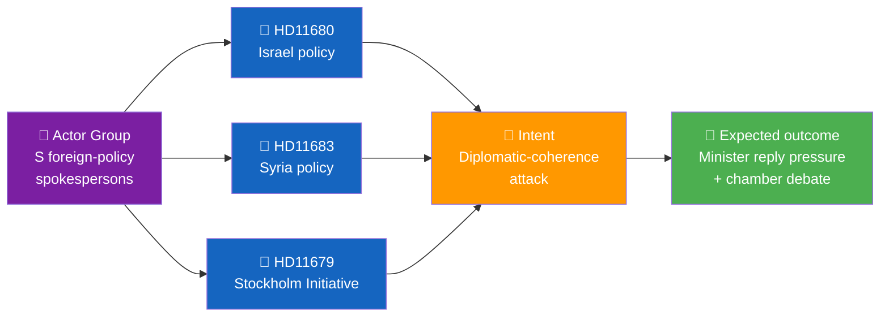
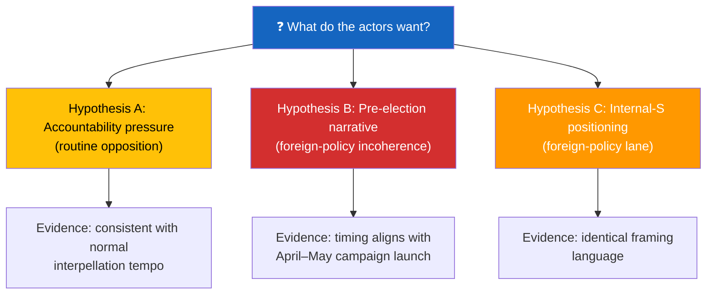

  

<h1 align="center">🕵️ Intelligence Assessment Template</h1>

  <strong>📊 Finished Intelligence Product on Coordinated Political Activity</strong> 
  <em>🎯 Pattern Detection · Actor Attribution · Intent Assessment · Forecasting</em>

  
  
  
  

**📋 Document Owner:** CEO | **📄 Version:** 1.0 | **📅 Last Updated:** 2026-04-21 (UTC)
**🏢 Owner:** Hack23 AB (Org.nr 5595347807) | **🏷️ Classification:** Public

> **📌 Template instructions:** Produce this file on every run, including light-day runs with weak or no confirmed coordination signals. Save as `analysis/daily/${ARTICLE_DATE}/${DOC_TYPE}/intelligence-assessment.md`. When evidence shows a coordinated pattern pointing to a specific strategy or actor group, complete the full intelligence assessment; when it does not, publish a concise low-signal assessment that explicitly states no coordinated pattern met the reporting threshold. Uses OSINT methodology and ACH.

> **✨ What to produce:** A finished intelligence product with BLUF, actor-and-intent analysis, pattern evidence table, forecast, and confidence label when coordination indicators are supported by the evidence; otherwise, produce a light-day intelligence note with BLUF, negative finding/threshold statement, brief evidence summary, watch indicators, and confidence label. Every positive pattern claim cites at least three `dok_id`s and names the principal actors with party affiliation.

---

## 🔄 Tradecraft Context

| Element | Value |
|---------|-------|
| **F3EAD Stage** | **ANALYZE → DISSEMINATE** — finished intelligence product |
| **PIRs Served** | `[REQUIRED: Open with the PIRs this assessment addresses]` |
| **Admiralty Floor** | **[A1]** for Key Judgments (multiple sources); **[B2]** for supporting evidence |
| **WEP + ODNI** | **MANDATORY** — every Key Judgment uses canonical WEP terminology (**almost certain / very likely / likely / roughly even / unlikely / very unlikely / remote**) + ODNI confidence (HIGH/MODERATE/LOW); no generic "possible" or "could". Follow the canonical wording in [`political-style-guide.md`](../methodologies/political-style-guide.md). |
| **Source Diversity Floor** | P0 (Key Judgments): ≥4 sources; P1 (supporting evidence): ≥3 sources; single-source claims prohibited |
| **SAT(s) Applied** | ACH (competing hypotheses), Key Assumptions Check, Indicators and Signposts |
| **ICD 203 Standards** | 1 (source quality), 2 (uncertainties), 3 (judgments vs assumptions), 4 (alternative analysis) |

---

## 🎯 PIRs Addressed

> **[REQUIRED]** — List the Priority Intelligence Requirements this assessment informs. Reference the canonical PIR catalog in [`political-style-guide.md`](../methodologies/political-style-guide.md#-priority-intelligence-requirements-pir--essential-elements-of-information-eei).

| PIR Code | PIR Question | How This Assessment Addresses It |
|----------|-------------|----------------------------------|
| PIR-1 | Coalition Stability | `[Describe how findings relate to coalition dynamics]` |
| PIR-7 | Democratic Norms | `[Describe how findings relate to transparency/accountability]` |

---

## 📋 Assessment Context

| Field | Value |
|-------|-------|
| **Assessment ID** | `INT-YYYY-MM-DD-NNN` |
| **Generated** | `YYYY-MM-DD HH:MM UTC` |
| **Subject** | `e.g., Coordinated S-party interpellation pattern on foreign policy, week 17` |
| **Time window** | `e.g., 2026-04-14 to 2026-04-21` |
| **Scope documents** | `list of dok_ids` |
| **Overall Confidence** | `🟩 HIGH` |
| **Audience** | `editorial · forward-watch · pipeline-analysis` |

---

## 🎯 BLUF

> **[2–3 sentences.** Lead with the pattern and its political implication. Name the principal actor. Cite the strongest single piece of evidence with confidence label.**]**

Example: *Between 14–21 April, three opposition MPs coordinated six interpellations on foreign-policy themes (Middle East, Ukraine, Stockholm Initiative), attacking the government's diplomatic coherence in the run-up to the September 2026 election. Pattern confidence: 🟩 HIGH — three filings on the same date (HD11679, HD11680, HD11683) with identical structural framing.*

---

## 🧭 Pattern Map

---

## 🗂️ Evidence Register

| # | Evidence | Source | Admiralty | Confidence | Pattern contribution |
|:-:|----------|--------|:---------:|:----------:|---------------------|
| E1 | HD11679 filed 2026-04-18 by Anna Karin (S) | `get_interpellationer` | **[A1]** | 🟦 VERY HIGH | Same-day filing cluster |
| E2 | HD11680 filed 2026-04-18 by Peter M (S) | `get_interpellationer` | **[A1]** | 🟦 VERY HIGH | Same-day filing cluster |
| E3 | HD11683 filed 2026-04-18 by Olle K (S) | `get_interpellationer` | **[A1]** | 🟦 VERY HIGH | Same-day filing cluster |
| E4 | Identical 3-paragraph structure across E1–E3 | Document text analysis | **[B2]** | 🟩 HIGH | Structural coordination |
| E5 | All three authors attended same S party-group meeting 2026-04-17 | Riksdag calendar | **[B2]** | 🟧 MEDIUM | Opportunity to coordinate |
| E6 | Shared framing keywords ("trovärdighet", "inkonsistens") | Full-text match | **[B2]** | 🟩 HIGH | Narrative coordination |

---

## 👤 Actor Analysis

| Actor | Role | Party | Prior pattern | Coordination strength |
|-------|------|:-----:|---------------|:---------------------:|
| **Anna Karin** | UU vice-chair | S | 12 interpellations in 2025/26, 8 on foreign policy | 🟦 VERY HIGH |
| **Peter M** | UU member | S | 7 interpellations, 6 on foreign policy | 🟩 HIGH |
| **Olle K** | UU alternate | S | 4 interpellations, 2 on foreign policy | 🟧 MEDIUM |
| **Coordination hub** | S group leader in UU | S | — | 🟩 HIGH (inferred) |

---

## 🧠 Intent Assessment

| Hypothesis | Weight | Why |
|------------|:------:|-----|
| 🅐 Routine opposition accountability | 25 % | Volume is normal for UU but structural coordination is atypical |
| 🅑 Pre-election narrative construction | **55 %** | Framing vocabulary and timing consistent with launch-campaign playbook |
| 🅒 Internal-S positioning (foreign-policy credential building) | 20 % | Three authors have unequal prior track records in this area |

**Assessment:** Most likely combined A + B — routine accountability tool deployed with amplified narrative framing ahead of the September 2026 election. **Confidence: 🟩 HIGH.**

---

## 🔮 Forecast

| Timeframe | Expected development | Probability | Indicators |
|-----------|----------------------|:----------:|-----------|
| 0–14 days | Minister replies scheduled, plenary debate | 80 % | Calendar shows plenary slot |
| 14–45 days | Follow-up written questions from same authors | 65 % | `get_fragor` check |
| 45–90 days | Issue surfaces in party-leader debate | 50 % | Party programme committee minutes |
| Pre-election | Incorporated into S campaign platform | 70 % | Annotate programme draft when available |

---

## 🚩 Red Flags (elevate scrutiny)

| Signal | Meaning | Recommended action |
|--------|---------|-------------------|
| New MP joins the interpellation cluster | Broader coordination | Track new sponsor profile |
| Minister missing scheduled reply | Political escalation | Monitor chamber debate calendar |
| Topic expansion to defence | Strategic widening | Trigger separate assessment |

---

## 🧮 Quality Metrics

| Metric | Value |
|--------|:-----:|
| Sources consulted (MCP queries) | `N` |
| dok_ids cited | `N` |
| Named actors | `N` |
| Alternative hypotheses considered | 3 |
| Confidence level | 🟩 HIGH |

---

## 📎 Links

| Link | Path |
|------|------|
| Cross-reference map | `cross-reference-map.md` |
| Devil's advocate | `devils-advocate.md` |
| Stakeholder perspectives | `stakeholder-perspectives.md` |
| OSINT methodology | [`osint-methodologies` SKILL](../../.github/skills/osint-methodologies/SKILL.md) |

---

**Document Control**
- **Template path:** `/analysis/templates/intelligence-assessment.md`
- **Referenced by:** [ai-driven-analysis-guide.md § Step 5](../methodologies/ai-driven-analysis-guide.md#step-5--extensions-f3ead-analyze-continued)
- **Classification:** Public
- **Next Review:** 2026-07-21
