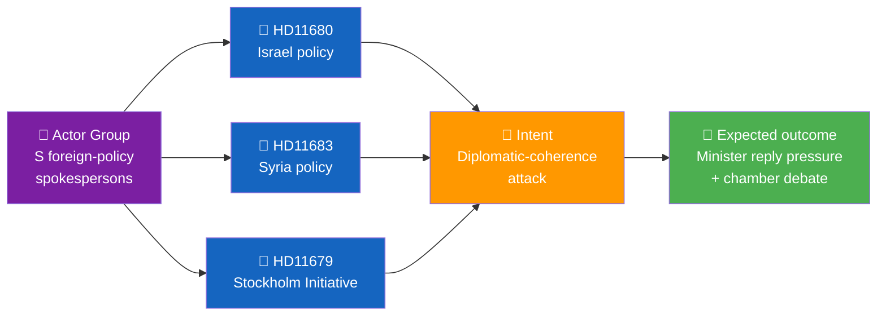
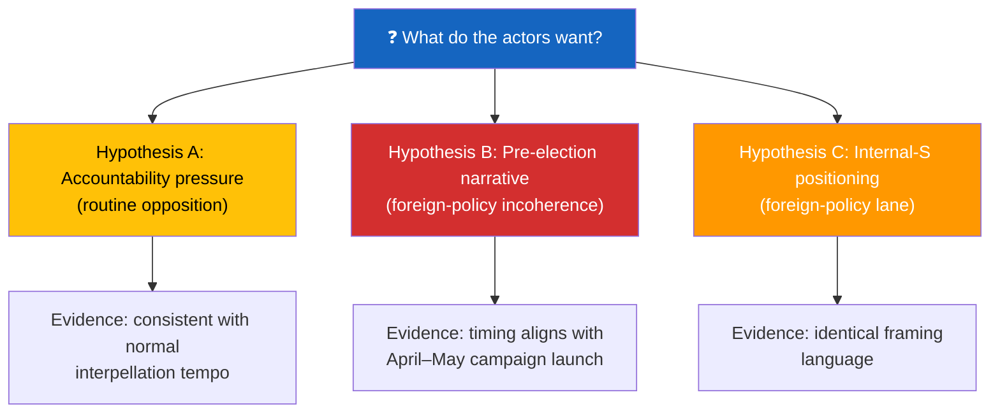

<p align="center">
  
</p>

<h1 align="center">🕵️ Intelligence Assessment Template</h1>

<p align="center">
  <strong>📊 Finished Intelligence Product on Coordinated Political Activity</strong><br>
  <em>🎯 Pattern Detection · Actor Attribution · Intent Assessment · Forecasting</em>
</p>

<p align="center">
  <a href="#"></a>
  <a href="#"></a>
  <a href="#"></a>
  <a href="#"></a>
</p>

**📋 Document Owner:** CEO | **📄 Version:** 1.2 | **📅 Last Updated:** 2026-04-25 (UTC)
**🏢 Owner:** Hack23 AB (Org.nr 5595347807) | **🏷️ Classification:** Public

> **📌 Template instructions:** Produce this file on every run, including light-day runs with weak or no confirmed coordination signals. Save as `analysis/daily/${ARTICLE_DATE}/${DOC_TYPE}/intelligence-assessment.md`. When evidence shows a coordinated pattern pointing to a specific strategy or actor group, complete the full intelligence assessment; when it does not, publish a concise low-signal assessment that explicitly states no coordinated pattern met the reporting threshold. Uses OSINT methodology and ACH.

> **✨ What to produce:** A finished intelligence product with BLUF, actor-and-intent analysis, pattern evidence table, forecast, and confidence label when coordination indicators are supported by the evidence; otherwise, produce a light-day intelligence note with BLUF, negative finding/threshold statement, brief evidence summary, watch indicators, and confidence label. Every positive pattern claim cites at least three `dok_id`s and names the principal actors with party affiliation.

---

<!-- TEMPLATE_CONTRACT_V1 -->
> **📐 Template Contract** — every fill of this template MUST satisfy this row.
>
> | Slot | Value |
> |------|-------|
> | **Owning methodology** | [`per-artifact-methodologies.md`](../methodologies/per-artifact-methodologies.md#intelligence-assessment) |
> | **Owning gate check** | Check 7 (Family C — ≥ 3 KJ + PIRs) — see [`05-analysis-gate.md`](../../.github/prompts/05-analysis-gate.md) |
> | **Required inputs** | all Family A + scenario-analysis.md + devils-advocate.md |
> | **Horizon band** | per-run (per [`scripts/horizon-context.ts`](../../scripts/horizon-context.ts)) |
> | **Output family** | Family C — Strategic Extensions |
> | **Aggregation order** | 3 of 30 in canonical order (see [`scripts/render-lib/aggregator/order.ts`](../../scripts/render-lib/aggregator/order.ts)) |
> | **Reader Intelligence Guide** | row generated from `intelligence-assessment.md` (see [`scripts/render-lib/aggregator/reader-guide.ts`](../../scripts/render-lib/aggregator/reader-guide.ts)) |
> | **Canonical evidence anchor** | `\| claim \| evidence (dok_id / vote / MP intressent_id / primary-source URL) \| retrieved_at \| confidence \|` — every analytical claim row uses this schema. |
>
> Cross-reference: [`README.md §Template ↔ Methodology ↔ Gate-Check Matrix`](README.md#-template--methodology--gate-check-matrix).

<!--
AI-FIRST Pass-1 / Pass-2 self-check (HTML comment — invisible in rendered articles; not stripped by aggregator unless under a "## Pass 2 …" heading).

PASS 1 (creation, minimal viable artifact):
  • Fill every REQUIRED slot above; cite ≥ 1 dok_id / vote / MP / primary-source URL per major claim.
  • Use the canonical evidence anchor schema for every analytical claim row.
  • Mermaid blocks use the cyberpunk %%{init: theme/themeVariables}%% prologue and at least one `style …` or `classDef …` directive (Check 5 of 05-analysis-gate.md).

PASS 2 (read-back & improve — AI-FIRST mandatory, ≥ 180 s after Pass 1):
  • Re-read the file end-to-end; for each section verify (a) ≥ 1 evidence anchor row, (b) WEP language tightened (no "may/might/could" hedges), (c) named actors with intressent_id where applicable, (d) Mermaid colour theming present.
  • Banned-phrase scan: "intelligence theatre", "sources say", "reportedly", "it is widely believed", "experts agree", "AI_MUST_REPLACE".
  • Citation density target: ≥ 1 evidence anchor row per 100 words of analytical prose.
  • Neutrality arithmetic: equal analytical depth across the 8 Riksdag parties (S, M, SD, V, MP, C, L, KD); flag and correct any bias in the Pass-2 Self-Audit section.

ANTI-TEMPLATE — DO NOT:
  • Ship plain prose without evidence anchor tables.
  • Leave AI_MUST_REPLACE / [REQUIRED: …] placeholders in the rendered output.
  • Cite a non-primary URL when a `dok_id` or vote record is available.
  • Treat co-occurrence of keywords as coordination; uni-directional chains as bi-directional.
  • Use a Mermaid block without colour theming (Check 5 will block aggregation).
  • Skip the Pass-2 read-back (Check 6 verifies mtime ≥ birth + 180 s OR a differing pass1/ snapshot).
-->

## 🔄 Tradecraft Context

| Element | Value |
|---------|-------|
| **F3EAD Stage** | **ANALYZE → DISSEMINATE** — finished intelligence product |
| **PIRs Served** | `[REQUIRED: Open with the PIRs this assessment addresses]` |
| **Admiralty Floor** | **[A1]** for Key Judgments (multiple sources); **[B2]** for supporting evidence |
| **WEP + ODNI** | **MANDATORY** — every Key Judgment uses canonical WEP terminology (**almost certain / very likely / likely / roughly even / unlikely / very unlikely / remote**) + ODNI confidence (HIGH/MODERATE/LOW); no generic "possible" or "could". Follow the canonical wording in [`political-style-guide.md`](../methodologies/political-style-guide.md). |
| **Source Diversity Floor** | P0 (Key Judgments): ≥4 sources; P1 (supporting evidence): ≥3 sources; single-source claims prohibited |
| **SAT(s) Applied** | ACH (competing hypotheses), Key Assumptions Check, Indicators and Signposts |
| **ICD 203 Standards** | 1 (source quality), 2 (uncertainties), 3 (judgments vs assumptions), 4 (alternative analysis) |

---

## 🎯 PIRs Addressed

> **[REQUIRED]** — List the Priority Intelligence Requirements this assessment informs. Reference the canonical PIR catalog in [`political-style-guide.md`](../methodologies/political-style-guide.md#-priority-intelligence-requirements-pir--essential-elements-of-information-eei).

| PIR Code | PIR Question | How This Assessment Addresses It |
|----------|-------------|----------------------------------|
| PIR-1 | Coalition Stability | `[Describe how findings relate to coalition dynamics]` |
| PIR-7 | Democratic Norms | `[Describe how findings relate to transparency/accountability]` |

---

## 📋 Assessment Context

| Field | Value |
|-------|-------|
| **Assessment ID** | `INT-YYYY-MM-DD-NNN` |
| **Generated** | `YYYY-MM-DD HH:MM UTC` |
| **Subject** | `e.g., Coordinated S-party interpellation pattern on foreign policy, week 17` |
| **Time window** | `e.g., 2026-04-14 to 2026-04-21` |
| **Scope documents** | `list of dok_ids` |
| **Overall Confidence** | `🟩 HIGH` |
| **Audience** | `editorial · forward-watch · pipeline-analysis` |

---

## 📈 Confidence Distribution by Key Judgment

> **[REQUIRED]** Include explicit posterior confidence per KJ after Pass 2 / re-run evidence updates.

| Key Judgment | Prior confidence (Pass 1) | Evidence update | Posterior confidence (required) | Change rationale |
|--------------|---------------------------|-----------------|----------------------------------|------------------|
| KJ-1 | `HIGH` | `[REQUIRED]` | `HIGH / MEDIUM / LOW` | `[REQUIRED]` |
| KJ-2 | `MEDIUM` | `[REQUIRED]` | `HIGH / MEDIUM / LOW` | `[REQUIRED]` |
| KJ-3 | `LOW` | `[REQUIRED]` | `HIGH / MEDIUM / LOW` | `[REQUIRED]` |

---

## 🎯 BLUF

> **[2–3 sentences.** Lead with the pattern and its political implication. Name the principal actor. Cite the strongest single piece of evidence with confidence label.**]**

Example: *Between 14–21 April, three opposition MPs coordinated six interpellations on foreign-policy themes (Middle East, Ukraine, Stockholm Initiative), attacking the government's diplomatic coherence in the run-up to the September 2026 election. Pattern confidence: 🟩 HIGH — three filings on the same date (HD11679, HD11680, HD11683) with identical structural framing.*

---

## 🧭 Pattern Map



---

## 🗂️ Evidence Register

| # | Evidence | Source | Admiralty | Confidence | Pattern contribution |
|:-:|----------|--------|:---------:|:----------:|---------------------|
| E1 | HD11679 filed 2026-04-18 by Anna Karin (S) | `get_interpellationer` | **[A1]** | 🟦 VERY HIGH | Same-day filing cluster |
| E2 | HD11680 filed 2026-04-18 by Peter M (S) | `get_interpellationer` | **[A1]** | 🟦 VERY HIGH | Same-day filing cluster |
| E3 | HD11683 filed 2026-04-18 by Olle K (S) | `get_interpellationer` | **[A1]** | 🟦 VERY HIGH | Same-day filing cluster |
| E4 | Identical 3-paragraph structure across E1–E3 | Document text analysis | **[B2]** | 🟩 HIGH | Structural coordination |
| E5 | All three authors attended same S party-group meeting 2026-04-17 | Riksdag calendar | **[B2]** | 🟧 MEDIUM | Opportunity to coordinate |
| E6 | Shared framing keywords ("trovärdighet", "inkonsistens") | Full-text match | **[B2]** | 🟩 HIGH | Narrative coordination |

---

## 👤 Actor Analysis

| Actor | Role | Party | Prior pattern | Coordination strength |
|-------|------|:-----:|---------------|:---------------------:|
| **Anna Karin** | UU vice-chair | S | 12 interpellations in 2025/26, 8 on foreign policy | 🟦 VERY HIGH |
| **Peter M** | UU member | S | 7 interpellations, 6 on foreign policy | 🟩 HIGH |
| **Olle K** | UU alternate | S | 4 interpellations, 2 on foreign policy | 🟧 MEDIUM |
| **Coordination hub** | S group leader in UU | S | — | 🟩 HIGH (inferred) |

---

## 🧠 Intent Assessment



| Hypothesis | Weight | Why |
|------------|:------:|-----|
| 🅐 Routine opposition accountability | 25 % | Volume is normal for UU but structural coordination is atypical |
| 🅑 Pre-election narrative construction | **55 %** | Framing vocabulary and timing consistent with launch-campaign playbook |
| 🅒 Internal-S positioning (foreign-policy credential building) | 20 % | Three authors have unequal prior track records in this area |

**Assessment:** Most likely combined A + B — routine accountability tool deployed with amplified narrative framing ahead of the September 2026 election. **Confidence: 🟩 HIGH.**

---

## 🔮 Forecast

| Timeframe | Expected development | Probability | Indicators |
|-----------|----------------------|:----------:|-----------|
| 0–14 days | Minister replies scheduled, plenary debate | 80 % | Calendar shows plenary slot |
| 14–45 days | Follow-up written questions from same authors | 65 % | `get_fragor` check |
| 45–90 days | Issue surfaces in party-leader debate | 50 % | Party programme committee minutes |
| Pre-election | Incorporated into S campaign platform | 70 % | Annotate programme draft when available |

---

## 📊 Quantitative Transmission Check (SCB + Riksbank)

> Complete this block for assessments where economic transmission affects intent, timing or voter impact. It is a Swedish ground-truth layer and complements — but does not replace — IMF macro/fiscal context.

| Mechanism | Required source | economicProvenance provider | Latest signal | Intelligence implication |
|-----------|-----------------|-----------------------------|:-------------:|--------------------------|
| Price shock / relief channel | `tsx scripts/scb-fetch.ts preset --preset cpi` + `tsx scripts/scb-fetch.ts preset --preset fuel-prices` | `scb` | — | Does the measure materially affect household cost pressure? |
| Labour-market sensitivity | `tsx scripts/scb-fetch.ts preset --preset aku` | `scb` | — | Does unemployment amplify or mute the political signal? |
| Household exposure | `tsx scripts/scb-fetch.ts preset --preset household-economy` | `scb` | — | Which voter segments face the strongest disposable-income effect? |
| Monetary-policy reaction function | `tsx scripts/riksbank-fetch.ts repo-rate-path` + `tsx scripts/riksbank-fetch.ts minutes` | `riksbank` | — | Does the Riksbank path support or contradict the claimed transmission? |

**Assessment note:** Cite concrete SCB/Riksbank values before making a forecast about disposable income, consumer sentiment or polling impact. If either source is unavailable, label the gap and fall back to cached `analysis/data/scb/` or `analysis/data/riksbank/` artifacts.

---

## 🚩 Red Flags (elevate scrutiny)

| Signal | Meaning | Recommended action |
|--------|---------|-------------------|
| New MP joins the interpellation cluster | Broader coordination | Track new sponsor profile |
| Minister missing scheduled reply | Political escalation | Monitor chamber debate calendar |
| Topic expansion to defence | Strategic widening | Trigger separate assessment |

---

## 🧮 Quality Metrics

| Metric | Value |
|--------|:-----:|
| Sources consulted (MCP queries) | `N` |
| dok_ids cited | `N` |
| Named actors | `N` |
| Alternative hypotheses considered | 3 |
| Confidence level | 🟩 HIGH |

---

## 📎 Links

| Link | Path |
|------|------|
| Cross-reference map | `cross-reference-map.md` |
| Devil's advocate | `devils-advocate.md` |
| Stakeholder perspectives | `stakeholder-perspectives.md` |
| OSINT methodology | [`osint-methodologies` SKILL](../../.github/skills/osint-methodologies/SKILL.md) |

---

**Document Control**
- **Template path:** `/analysis/templates/intelligence-assessment.md`
- **Referenced by:** [ai-driven-analysis-guide.md § Step 5](../methodologies/ai-driven-analysis-guide.md#step-5--extensions-f3ead-analyze-continued)
- **Classification:** Public
- **Next Review:** 2026-07-21

---

## ✅ Pass-2 Self-Audit Checklist (v4.4 — required)

> **Purpose:** AI-FIRST principle requires a Pass-2 read-back-and-improve. After producing this artifact in Pass 1, re-read it end-to-end and verify each item below. Document any remediation in [`methodology-reflection.md`](methodology-reflection.md) §"Pass-2 audit log". Any unchecked ❌ box at the end of Pass 2 forces a Pass-3 rewrite of the affected section.

- [ ] **Tradecraft anchors honoured** — F3EAD stage matches the artifact's role; PIRs declared in the §Tradecraft Context block are actually addressed in the body; Admiralty grades attached to every external source; WEP band + ODNI confidence on every probabilistic judgement.
- [ ] **Source diversity floor met** — at least the minimum number of independent MCP sources required by the artifact's tradecraft block are cited; single-source claims are explicitly labelled `[SINGLE-SOURCE — corroboration pending]`.
- [ ] **Evidence specificity** — every quantified claim cites a `dok_id` (Riksdag), an SCB / IMF dataflow code, or a named external source with date; no "according to data" / "studies show" hand-waves.
- [ ] **Named-actor discipline** — every political claim names ≥ 1 person (party + role + dated act/quote) or labels the absence (`[diffuse — no named actor]`).
- [ ] **Counter-narrative present** — at least one explicit competing hypothesis, dissent quote, or framed objection appears in the body; "no opposition recorded" is itself a finding to label, not silence.
- [ ] **Election 2026 lens applied** — the §"Election 2026 Implications" subsection (or equivalent) addresses electoral salience, coalition pressure, and forward indicators; not boilerplate.
- [ ] **No illustrative content shipped as fact** — every `[REQUIRED]` placeholder is filled OR removed; every `Example:` block is clearly fenced or removed; no fabricated `dok_id`, vote count, or quote leaks into the final artifact.
- [ ] **Cross-references resolve** — every `[link](file.md)` in this artifact points to a file that exists in the run folder (`analysis/daily/$ARTICLE_DATE/$SUBFOLDER/`) or to a methodology / template under `analysis/`.
- [ ] **Mermaid renders** — every fenced ` ```mermaid ` block parses (no missing class definitions, no orphan nodes, no >40-node graphs that overflow viewport on mobile).
- [ ] **Line-floor check** — artifact length ≥ the per-artifact floor in [`reference-quality-thresholds.json`](../methodologies/reference-quality-thresholds.json); shorter artifacts trigger Pass-2 rewrite, never a `[truncated]` note.
