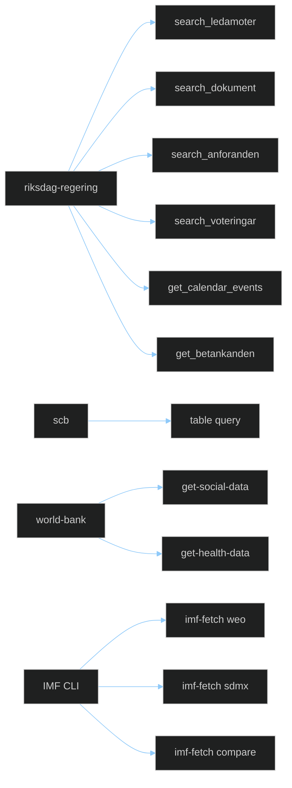
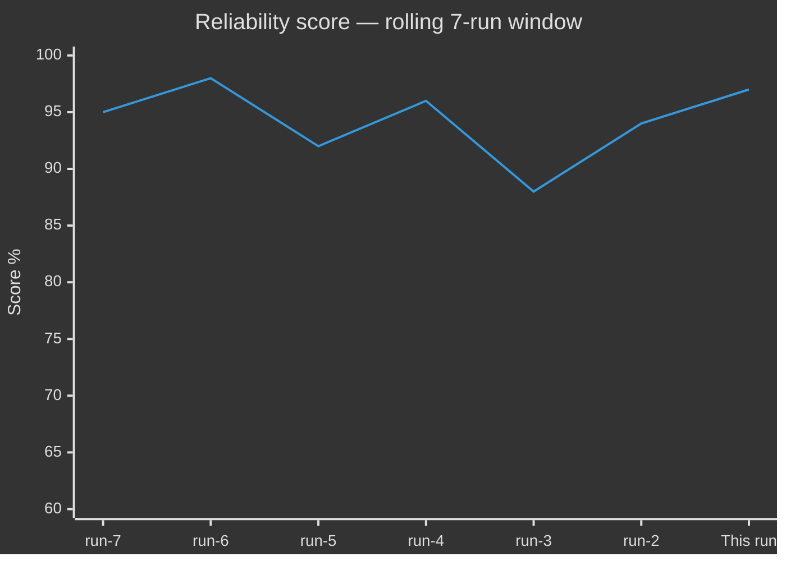

<!-- SPDX-FileCopyrightText: 2024-2026 Hack23 AB -->
<!-- SPDX-License-Identifier: Apache-2.0 -->

# 🛰️ MCP Reliability Audit Template — Endpoint Health & Data Freshness

> **📌 Template Instructions** — Copy to `analysis/daily/$ARTICLE_DATE/$SUBFOLDER/mcp-reliability-audit.md`. Endpoint-by-endpoint record of MCP server availability and data freshness during the run. See [`per-artifact-methodologies.md §mcp-reliability-audit`](../methodologies/per-artifact-methodologies.md#mcp-reliability-audit).

> **🎯 Purpose** — Comprehensive MCP server health assessment. Tracks which endpoints succeeded, which failed, which were degraded, and what workarounds were applied. First-class operational artifact — if a downstream reader doubts an analytical claim, this is the file that proves the underlying data call actually returned fresh truth.

## 🔄 Tradecraft Context

- **Why this artifact exists** — Documents MCP/server reliability during the run so analytical conclusions can be traced back to verified data access; distinguishes fresh primary-source retrieval, degraded retrieval, and fallback/manual substitution; creates an auditable record of outages, latency, stale data, and workaround decisions that may affect confidence.
- **How to use during the run** — Update immediately after meaningful MCP/API access attempts, not retrospectively from memory. Record both successes and failures (partial responses, stale payloads, timeout behaviour, retries). When fallbacks are used, name the fallback source and link the affected downstream artifacts.
- **Minimum tradecraft standard** — Every endpoint relied upon for analysis must appear here with enough detail for another operator to reproduce or challenge the evidence chain. Reliability judgements must be evidence-based (timestamps, error modes, freshness signals, operational impact). If significant degradation occurred, downstream analysis must explicitly reduce confidence or scope claims accordingly.
- **SLA baselines** (flag any endpoint breaching these as ⚠️):
  - `riksdag-regering` HTTP MCP: p95 latency < 2,000 ms; success rate ≥ 95 % per run
  - `scb` PxWeb container: p95 latency < 5,000 ms; success rate ≥ 90 %
  - `world-bank` container: p95 latency < 4,000 ms; success rate ≥ 90 %
  - IMF CLI (`imf-fetch.ts`): p95 latency < 10,000 ms; 429 rate ≤ 5 % of calls; vintage age ≤ 6 months
  - Data freshness: latest riksdagen.se `dok_id` should be within 60 minutes of real-time publication

---

<!-- TEMPLATE_CONTRACT_V1 -->
> **📐 Template Contract** — every fill of this template MUST satisfy this row.
>
> | Slot | Value |
> |------|-------|
> | **Owning methodology** | [`per-artifact-methodologies.md`](../methodologies/per-artifact-methodologies.md#mcp-reliability-audit) |
> | **Owning gate check** | Supplementary (Tier-C mandatory) — see [`05-analysis-gate.md`](../../.github/prompts/05-analysis-gate.md) |
> | **Required inputs** | MCP tool call log of the run |
> | **Horizon band** | per-run (per [`scripts/horizon-context.ts`](../../scripts/horizon-context.ts)) |
> | **Output family** | Operational Supplementary |
> | **Aggregation order** | appended (alphabetical, after canonical block) (see [`scripts/render-lib/aggregator/order.ts`](../../scripts/render-lib/aggregator/order.ts)) |
> | **Reader Intelligence Guide** | row generated from `mcp-reliability-audit.md` (see [`scripts/render-lib/aggregator/reader-guide.ts`](../../scripts/render-lib/aggregator/reader-guide.ts)) |
> | **Canonical evidence anchor** | `\| claim \| evidence (dok_id / vote / MP intressent_id / primary-source URL) \| retrieved_at \| confidence \|` — every analytical claim row uses this schema. |
>
> Cross-reference: [`README.md §Template ↔ Methodology ↔ Gate-Check Matrix`](README.md#-template--methodology--gate-check-matrix).

<!--
AI-FIRST Pass-1 / Pass-2 self-check (HTML comment — invisible in rendered articles; not stripped by aggregator unless under a "## Pass 2 …" heading).

PASS 1 (creation, minimal viable artifact):
  • Fill every REQUIRED slot above; cite ≥ 1 dok_id / vote / MP / primary-source URL per major claim.
  • Use the canonical evidence anchor schema for every analytical claim row.
  • Mermaid blocks use the cyberpunk %%{init: theme/themeVariables}%% prologue and at least one `style …` or `classDef …` directive (Check 5 of 05-analysis-gate.md).

PASS 2 (read-back & improve — AI-FIRST mandatory, ≥ 180 s after Pass 1):
  • Re-read the file end-to-end; for each section verify (a) ≥ 1 evidence anchor row, (b) WEP language tightened (no "may/might/could" hedges), (c) named actors with intressent_id where applicable, (d) Mermaid colour theming present.
  • Banned-phrase scan: "intelligence theatre", "sources say", "reportedly", "it is widely believed", "experts agree", "AI_MUST_REPLACE".
  • Citation density target: ≥ 1 evidence anchor row per 100 words of analytical prose.
  • Neutrality arithmetic: equal analytical depth across the 8 Riksdag parties (S, M, SD, V, MP, C, L, KD); flag and correct any bias in the Pass-2 Self-Audit section.

ANTI-TEMPLATE — DO NOT:
  • Ship plain prose without evidence anchor tables.
  • Leave AI_MUST_REPLACE / [REQUIRED: …] placeholders in the rendered output.
  • Cite a non-primary URL when a `dok_id` or vote record is available.
  • Treat co-occurrence of keywords as coordination; uni-directional chains as bi-directional.
  • Use a Mermaid block without colour theming (Check 5 will block aggregation).
  • Skip the Pass-2 read-back (Check 6 verifies mtime ≥ birth + 180 s OR a differing pass1/ snapshot).
-->

## 📋 Document Metadata

| Field | Value |
|-------|-------|
| **Report ID** | `[REQUIRED: MCP-YYYY-MM-DD-runNN]` |
| **Run Date** | `[REQUIRED: YYYY-MM-DD]` |
| **Run Start** | `[REQUIRED: YYYY-MM-DDTHH:MM:SSZ]` |
| **Run End** | `[REQUIRED: YYYY-MM-DDTHH:MM:SSZ]` |
| **Total duration** | `[REQUIRED: minutes]` |
| **Endpoints Attempted** | `[REQUIRED: #]` |
| **Endpoints Succeeded** | `[REQUIRED: #]` |
| **Endpoints Failed** | `[REQUIRED: #]` |
| **Reliability Score (0-100)** | `[REQUIRED: (succeeded / attempted) × 100 — round to 1 decimal]` |
| **Overall Status** | `[REQUIRED: ✅ Full (≥ 95 %) / ⚠️ Degraded (75–94 %) / 🔴 Unavailable (< 75 %)]` |
| **Fallback Activated** | `[REQUIRED: yes / no — if yes, list which sources and which artifacts affected]` |
| **Vintage discipline** | `[REQUIRED: IMF vintage within 6 months? ✅ / ❌ with note]` |

---

## 1️⃣ Endpoint Scoreboard



Apply `:::ok`, `:::deg`, or `:::fail` to each node after running:

```
RR:::ok  SCB:::ok  WB:::deg  IMF:::ok
```

*(Replace with actual status after run)*

---

## 2️⃣ `riksdag-regering` MCP (HTTP — primary)

| Tool | Calls | Succeeded | Failed | Mean latency (ms) | p95 latency (ms) | SLA p95 ≤ 2000 ms | Notes |
|------|:-----:|:---------:|:------:|:-----------------:|:----------------:|:-----------------:|-------|
| `search_ledamoter` | `[#]` | `[#]` | `[#]` | `[ms]` | `[ms]` | `[✅/⚠️]` | — |
| `get_ledamot` | `[#]` | `[#]` | `[#]` | `[ms]` | `[ms]` | `[✅/⚠️]` | — |
| `search_dokument` | `[#]` | `[#]` | `[#]` | `[ms]` | `[ms]` | `[✅/⚠️]` | — |
| `get_dokument` | `[#]` | `[#]` | `[#]` | `[ms]` | `[ms]` | `[✅/⚠️]` | — |
| `get_dokument_innehall` | `[#]` | `[#]` | `[#]` | `[ms]` | `[ms]` | `[✅/⚠️]` | — |
| `search_anforanden` | `[#]` | `[#]` | `[#]` | `[ms]` | `[ms]` | `[✅/⚠️]` | — |
| `search_voteringar` | `[#]` | `[#]` | `[#]` | `[ms]` | `[ms]` | `[✅/⚠️]` | — |
| `get_voteringar` | `[#]` | `[#]` | `[#]` | `[ms]` | `[ms]` | `[✅/⚠️]` | — |
| `get_calendar_events` | `[#]` | `[#]` | `[#]` | `[ms]` | `[ms]` | `[✅/⚠️]` | — |
| `get_betankanden` | `[#]` | `[#]` | `[#]` | `[ms]` | `[ms]` | `[✅/⚠️]` | — |
| `get_propositioner` | `[#]` | `[#]` | `[#]` | `[ms]` | `[ms]` | `[✅/⚠️]` | — |
| `get_motioner` | `[#]` | `[#]` | `[#]` | `[ms]` | `[ms]` | `[✅/⚠️]` | — |
| `get_fragor` | `[#]` | `[#]` | `[#]` | `[ms]` | `[ms]` | `[✅/⚠️]` | — |
| `get_interpellationer` | `[#]` | `[#]` | `[#]` | `[ms]` | `[ms]` | `[✅/⚠️]` | — |
| `search_regering` | `[#]` | `[#]` | `[#]` | `[ms]` | `[ms]` | `[✅/⚠️]` | — |
| `get_regering_document` | `[#]` | `[#]` | `[#]` | `[ms]` | `[ms]` | `[✅/⚠️]` | — |
| `enhanced_government_search` | `[#]` | `[#]` | `[#]` | `[ms]` | `[ms]` | `[✅/⚠️]` | — |

**Data freshness** — latest `dok_id` timestamp observed: `[REQUIRED: YYYY-MM-DDTHH:MM:SSZ]`. SLA ≤ 60 min lag from publication — `[✅/⚠️/❌]`. If ❌, note the age of the freshest `dok_id` and whether this affected any analytical conclusion.

**Success rate this server** — `[succeeded / total] × 100 = [%]`. SLA ≥ 95 % — `[✅/⚠️/❌]`.

---

## 3️⃣ `scb` MCP (PxWeb v2 — local container)

| Call | Table | Description | Succeeded | Latency (ms) | SLA p95 ≤ 5000 ms | Rows returned | Notes |
|------|-------|-------------|:---------:|:------------:|:-----------------:|:-------------:|-------|
| `[query_table]` | `[table ID e.g. BE0101]` | `[indicator name]` | `[✅/❌]` | `[ms]` | `[✅/⚠️]` | `[#]` | `[…]` |
| `[query_table]` | `[AM0401]` | Labour market participation | `[✅/❌]` | `[ms]` | `[✅/⚠️]` | `[#]` | `[…]` |

**Success rate this server** — `[%]`. SLA ≥ 90 % — `[✅/⚠️/❌]`.

---

## 4️⃣ `world-bank` MCP (local container — non-economic residue ONLY)

> **Provider routing**: economic-context calls (GDP, inflation, unemployment, fiscal aggregates, debt, BoP, trade, commodity, FX, interest rates) route through `scripts/imf-fetch.ts`. The World Bank MCP serves governance, environment, social, defence-historical, and crime/justice indicators catalogued in [`analysis/worldbank/indicators-inventory.json`](../worldbank/indicators-inventory.json). If this audit shows a WB call where the cited indicator falls outside that catalogue, log it in §7 Failure Analysis and re-run via IMF.

| Tool / code | Indicator | Country | Year range | Succeeded | Latency (ms) | SLA ≤ 4000 ms | Notes |
|-------------|-----------|:-------:|:----------:|:---------:|:------------:|:-------------:|-------|
| `get-social-data` | `SP.POP.TOTL` | `SWE` | `[2019-2024]` | `[✅/❌]` | `[ms]` | `[✅/⚠️]` | — |
| `get-economic-data` | `CC.EST` (WGI governance, `source=75`) | `SWE` | `[2018-2024]` | `[✅/❌]` | `[ms]` | `[✅/⚠️]` | non-economic (governance) |
| `get-economic-data` | `EN.ATM.CO2E.PC` (environment) | `SWE` | `[2014-2024]` | `[✅/❌]` | `[ms]` | `[✅/⚠️]` | non-economic (environment) |
| `get-health-data` | `SH.XPD.CHEX.GD.ZS` | `SWE` | `[2019-2023]` | `[✅/❌]` | `[ms]` | `[✅/⚠️]` | health expenditure |
| `get-education-data` | `SE.XPD.TOTL.GD.ZS` | `SWE` | `[2019-2023]` | `[✅/❌]` | `[ms]` | `[✅/⚠️]` | education expenditure |

**Success rate this server** — `[%]`. SLA ≥ 90 % — `[✅/⚠️/❌]`.

---

## 5️⃣ IMF (`tsx scripts/imf-fetch.ts` — CLI, no MCP — **PRIMARY economic source**)

| Invocation | Dataflow / series | Country | Vintage tag | Succeeded | 429s / retries | Total time (s) | Notes |
|------------|-------------------|:-------:|:-----------:|:---------:|:--------------:|:--------------:|-------|
| `weo --country SWE --indicator NGDP_RPCH --years 15` | `WEO/NGDP_RPCH` | `SWE` | `WEO-2026-04` | `[✅/❌]` | `[#/# ]` | `[s]` | macro growth |
| `compare --indicator GGXWDG_NGDP --countries SWE,DNK,NOR,FIN,DEU` | `WEO/GGXWDG_NGDP` | multi | `WEO-2026-04` | `[✅/❌]` | `[#/#]` | `[s]` | Nordic peer-compare |
| `sdmx --path "/data/IMF.STA,CPI,4.0.0/M.SE.PCPI_IX?startPeriod=2022-01"` | `IFS/PCPI_IX` | `SWE` | n/a (historical) | `[✅/❌]` | `[#/#]` | `[s]` | monthly CPI |
| `sdmx --path "/data/IMF.STA,IR,4.0.0/M.SE.FPOLM_PA?startPeriod=2022-01"` | `MFS_IR/FPOLM_PA` | `SWE` | n/a | `[✅/❌]` | `[#/#]` | `[s]` | Riksbank policy rate |
| `sdmx --path "/data/IMF.STA,DOT,4.0.0/A.SE.TXG_FOB_USD.US?startPeriod=2023"` | `DOT/TXG_FOB_USD` | `SWE` | n/a | `[✅/❌]` | `[#/#]` | `[s]` | trade balance |

**Rate-limit audit**: IMF advertises ~10 req / 5 s. Total IMF calls in this run: `[#]` (SLA target ≤ 10 per article). 429s received: `[#]`. Retry back-off applied (1 s → 2 s → 4 s): `[✅/❌ with note]`.

**Vintage discipline check**: `DEFAULT_WEO_VINTAGE` in `scripts/imf-client.ts` = `[value]`. `vintageDiscipline.current` in `analysis/imf/indicators-inventory.json` = `[value]`. Match: `[✅/❌]`. Any mismatch is a **P1 incident** — document in §7.

**Success rate** — `[%]`. SLA ≥ 95 % — `[✅/⚠️/❌]`. Age of WEO vintage vs anchor date: `[months]`. SLA ≤ 6 months — `[✅/⚠️/❌]`.

---

## 6️⃣ `github` MCP (Insiders HTTP — used only in module 07)

| Call | Result | Latency (ms) | Notes |
|------|:------:|:------------:|-------|
| `assign_copilot_to_issue` | `[✅/❌]` | `[ms]` | — |
| `create_pull_request_with_copilot` | `[✅/❌]` | `[ms]` | — |

---

## 7️⃣ Failure Analysis

> For each failed or degraded call, document below. Use the failure taxonomy to classify each incident.

### Failure taxonomy

| Code | Category | Definition | Standard action |
|------|----------|-----------|-----------------|
| `TIMEOUT` | Latency | p95 > SLA or call timed out entirely | Retry × 3 with exponential back-off; fall back to cache if still failing |
| `PARSE_ERR` | Data quality | Response returned but JSON/payload malformed | Log raw response; treat data as unavailable; document affected claims |
| `EMPTY` | Data availability | Response 200 but zero rows / null payload when rows expected | Verify query parameters; try alternate query; flag affected artifacts |
| `STALE` | Freshness | Data age exceeds SLA (riksdagen.se > 60 min; IMF vintage > 6 months) | Annotate artifacts with `[STALE DATA: age=X]`; reduce confidence to 🟡 |
| `AUTH_ERR` | Authentication | 401 / 403 response | Check MCP token / environment variable; escalate if persistent |
| `RATE_LIMIT` | Rate limiting | 429 response | Apply back-off; log count; flag if exceeds 5 % of total calls |
| `WB_ECON_REG` | Regression | World Bank economic code used for a new article instead of IMF equivalent | Re-run with IMF; flag as a data-quality regression (not a server failure) |

### Incident log

#### Incident 1 — `[endpoint name / tool / call]`

**Time** — `[YYYY-MM-DDTHH:MM:SSZ]`
**Category (taxonomy)** — `[TIMEOUT / PARSE_ERR / EMPTY / STALE / AUTH_ERR / RATE_LIMIT / WB_ECON_REG]`
**HTTP status / error** — `[HTTP status / timeout ms / parse error text / empty-payload note]`
**Root cause** — `[assessed root cause: server-side outage / network / incorrect query parameter / data-publishing delay / rate limit / version mismatch]`
**Retry attempts** — `[# retries with intervals]`
**Workaround applied** — `[cache / SKIP_ANALYSIS / alternative MCP tool / manual substitution / degraded confidence]`
**Artifacts affected** — `[list files where confidence was downgraded or claims were limited]`
**Confidence impact** — `[🔴 downgraded to / 🟡 downgraded to / no impact]`
**Follow-up** — `[issue link or "none, transient"]`

*(Repeat for each incident; use "No incidents to report" if clean run)*

---

## 8️⃣ Cache Usage

| Artifact | Used cache? | Cache age (h) | Cache source | Reason | Confidence impact |
|----------|:-----------:|:-------------:|:------------:|--------|:----------------:|
| `[REQUIRED]` | `[y/n]` | `[h]` | `[local / repo / previous run]` | `[live MCP down / rate limit / cold start]` | `[none / 🟡 / 🔴]` |

Cache policy — see [`.github/prompts/03-data-download.md §Pre-flight`](../../.github/prompts/03-data-download.md). Any Pass-2 run using cache age > 24 h must downgrade affected artifacts to 🟡 confidence; cache age > 72 h → 🔴.

---

## 9️⃣ Known Issues Carried Forward

| # | Description | Endpoint | First seen | Status | Tracking |
|---|-------------|----------|:----------:|:------:|---------|
| 1 | `[REQUIRED: 1-line]` | `[endpoint]` | `[YYYY-MM-DD]` | `[open / resolved]` | `[issue URL or "no ticket"]` |

---

## 🔟 Reliability Trend (rolling 7-run window)

| Run | Date | Reliability Score | Overall Status | IMF vintage age (mo) | Notes |
|-----|------|:-----------------:|:--------------:|:--------------------:|-------|
| run-7 | `[date]` | `[score]` | `[✅/⚠️/🔴]` | `[mo]` | — |
| run-6 | `[date]` | `[score]` | `[✅/⚠️/🔴]` | `[mo]` | — |
| run-5 | `[date]` | `[score]` | `[✅/⚠️/🔴]` | `[mo]` | — |
| run-4 | `[date]` | `[score]` | `[✅/⚠️/🔴]` | `[mo]` | — |
| run-3 | `[date]` | `[score]` | `[✅/⚠️/🔴]` | `[mo]` | — |
| run-2 | `[date]` | `[score]` | `[✅/⚠️/🔴]` | `[mo]` | — |
| **This run** | `[date]` | `[score]` | `[✅/⚠️/🔴]` | `[mo]` | — |

**Trend diagnosis** — `[improving / stable / degrading]`. Identify the single endpoint that most often causes degradation if trend is degrading.

**7-run average reliability** — `[%]`. Flag to devops-engineer if < 85 % over any 7-run window.

### Reliability trend chart



*Replace sample values with actual run scores.*

---

## 1️⃣1️⃣ Operational Recommendations

> Complete this section when overall reliability score < 85 % or any P1 incident occurred.

| Issue | Root cause (assessed) | Recommended action | Owner | Priority | Timeline |
|-------|----------------------|-------------------|-------|:--------:|---------|
| `[e.g. scb MCP high latency]` | `[assessed cause]` | `[e.g. increase container memory; upgrade pxweb-mcp version]` | `[devops-engineer]` | `[P1/P2/P3]` | `[days]` |

---

## 🔗 Cross-References

- Methodology: [`../methodologies/per-artifact-methodologies.md#mcp-reliability-audit`](../methodologies/per-artifact-methodologies.md#mcp-reliability-audit)
- MCP access: [`../../.github/prompts/02-mcp-access.md`](../../.github/prompts/02-mcp-access.md)
- MCP configuration: [`../../.github/copilot-mcp.json`](../../.github/copilot-mcp.json)
- IMF contract: [`../../analysis/imf/README.md`](../imf/README.md) — vintage discipline; non-economic-only WB scope
- WB retained codes: [`../methodologies/worldbank-indicator-mapping.md`](../methodologies/worldbank-indicator-mapping.md)

---

**Template version:** v2.0 · **Last updated:** 2026-04-25

---

## ✅ Pass-2 Self-Audit Checklist (v4.4 — required)

> **Purpose:** AI-FIRST principle requires a Pass-2 read-back-and-improve. After producing this artifact in Pass 1, re-read it end-to-end and verify each item below. Document any remediation in [`methodology-reflection.md`](methodology-reflection.md) §"Pass-2 audit log". Any unchecked ❌ box at the end of Pass 2 forces a Pass-3 rewrite of the affected section.

- [ ] **Tradecraft anchors honoured** — F3EAD stage matches the artifact's role; PIRs declared in the §Tradecraft Context block are actually addressed in the body; Admiralty grades attached to every external source; WEP band + ODNI confidence on every probabilistic judgement.
- [ ] **Source diversity floor met** — at least the minimum number of independent MCP sources required by the artifact's tradecraft block are cited; single-source claims are explicitly labelled `[SINGLE-SOURCE — corroboration pending]`.
- [ ] **Evidence specificity** — every quantified claim cites a `dok_id` (Riksdag), an SCB / IMF dataflow code, or a named external source with date; no "according to data" / "studies show" hand-waves.
- [ ] **Named-actor discipline** — every political claim names ≥ 1 person (party + role + dated act/quote) or labels the absence (`[diffuse — no named actor]`).
- [ ] **Counter-narrative present** — at least one explicit competing hypothesis, dissent quote, or framed objection appears in the body; "no opposition recorded" is itself a finding to label, not silence.
- [ ] **Election 2026 lens applied** — the §"Election 2026 Implications" subsection (or equivalent) addresses electoral salience, coalition pressure, and forward indicators; not boilerplate.
- [ ] **No illustrative content shipped as fact** — every `[REQUIRED]` placeholder is filled OR removed; every `Example:` block is clearly fenced or removed; no fabricated `dok_id`, vote count, or quote leaks into the final artifact.
- [ ] **Cross-references resolve** — every `[link](file.md)` in this artifact points to a file that exists in the run folder (`analysis/daily/$ARTICLE_DATE/$SUBFOLDER/`) or to a methodology / template under `analysis/`.
- [ ] **Mermaid renders** — every fenced ` ```mermaid ` block parses (no missing class definitions, no orphan nodes, no >40-node graphs that overflow viewport on mobile).
- [ ] **Line-floor check** — artifact length ≥ the per-artifact floor in [`reference-quality-thresholds.json`](../methodologies/reference-quality-thresholds.json); shorter artifacts trigger Pass-2 rewrite, never a `[truncated]` note.

