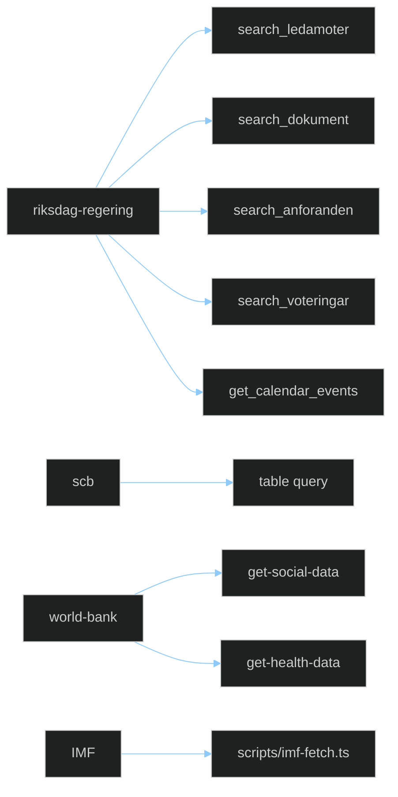

<!-- SPDX-FileCopyrightText: 2024-2026 Hack23 AB -->
<!-- SPDX-License-Identifier: Apache-2.0 -->

# 🛰️ MCP Reliability Audit Template — Endpoint Health & Data Freshness

> **📌 Template Instructions** — Copy to `analysis/daily/$ARTICLE_DATE/$SUBFOLDER/mcp-reliability-audit.md`. Endpoint-by-endpoint record of MCP server availability and data freshness during the run. See [`per-artifact-methodologies.md §mcp-reliability-audit`](../methodologies/per-artifact-methodologies.md#mcp-reliability-audit).

> **🎯 Purpose** — Comprehensive MCP server health assessment. Tracks which endpoints succeeded, which failed, which were degraded, and what workarounds were applied. First-class operational artifact — if a downstream reader doubts an analytical claim, this is the file that proves the underlying data call actually returned fresh truth.

## 🔄 Tradecraft Context

- **Why this artifact exists** — Documents MCP/server reliability during the run so analytical conclusions can be traced back to verified data access; distinguishes fresh primary-source retrieval, degraded retrieval, and fallback/manual substitution; creates an auditable record of outages, latency, stale data, and workaround decisions that may affect confidence.
- **How to use during the run** — Update immediately after meaningful MCP/API access attempts, not retrospectively from memory. Record both successes and failures (partial responses, stale payloads, timeout behaviour, retries). When fallbacks are used, name the fallback source and link the affected downstream artifacts.
- **Minimum tradecraft standard** — Every endpoint relied upon for analysis must appear here with enough detail for another operator to reproduce or challenge the evidence chain. Reliability judgements must be evidence-based (timestamps, error modes, freshness signals, operational impact). If significant degradation occurred, downstream analysis must explicitly reduce confidence or scope claims accordingly.

---

## 📋 Document Metadata

| Field | Value |
|-------|-------|
| **Report ID** | `[REQUIRED: MCP-YYYY-MM-DD-runNN]` |
| **Run Date** | `[REQUIRED: YYYY-MM-DD]` |
| **Endpoints Attempted** | `[REQUIRED: #]` |
| **Endpoints Succeeded** | `[REQUIRED: #]` |
| **Reliability Score (0-100)** | `[REQUIRED: (succeeded / attempted) × 100]` |
| **Overall Status** | `[REQUIRED: ✅ Full / ⚠️ Degraded / 🔴 Unavailable]` |
| **Fallback Activated** | `[REQUIRED: yes / no — if yes, which]` |

---

## 1️⃣ Endpoint Scoreboard

Annotate each leaf node ✅ / ⚠️ / ❌ based on the table below.

---

## 2️⃣ `riksdag-regering` MCP (HTTP — primary)

| Tool | Calls | Succeeded | Failed | Mean latency | Max latency | Notes |
|------|:-----:|:---------:|:------:|:------------:|:-----------:|-------|
| `search_ledamoter` | `[#]` | `[#]` | `[#]` | `[ms]` | `[ms]` | — |
| `get_ledamot` | `[#]` | `[#]` | `[#]` | `[ms]` | `[ms]` | — |
| `search_dokument` | `[#]` | `[#]` | `[#]` | `[ms]` | `[ms]` | — |
| `get_dokument` | `[#]` | `[#]` | `[#]` | `[ms]` | `[ms]` | — |
| `search_anforanden` | `[#]` | `[#]` | `[#]` | `[ms]` | `[ms]` | — |
| `search_voteringar` | `[#]` | `[#]` | `[#]` | `[ms]` | `[ms]` | — |
| `get_voteringar` | `[#]` | `[#]` | `[#]` | `[ms]` | `[ms]` | — |
| `get_calendar_events` | `[#]` | `[#]` | `[#]` | `[ms]` | `[ms]` | — |
| `get_betankanden` | `[#]` | `[#]` | `[#]` | `[ms]` | `[ms]` | — |
| `get_propositioner` | `[#]` | `[#]` | `[#]` | `[ms]` | `[ms]` | — |
| `get_motioner` | `[#]` | `[#]` | `[#]` | `[ms]` | `[ms]` | — |
| `get_fragor` | `[#]` | `[#]` | `[#]` | `[ms]` | `[ms]` | — |
| `get_interpellationer` | `[#]` | `[#]` | `[#]` | `[ms]` | `[ms]` | — |
| `search_regering` | `[#]` | `[#]` | `[#]` | `[ms]` | `[ms]` | — |
| `get_regering_document` | `[#]` | `[#]` | `[#]` | `[ms]` | `[ms]` | — |

**Data freshness** — latest `dok_id` timestamp observed: `[REQUIRED: YYYY-MM-DDTHH:MM:SSZ]`. Expected lag from publication ≤ 60 min — `[✅/⚠️/❌]`.

---

## 3️⃣ `scb` MCP (PxWeb v2 — local container)

| Call | Table | Succeeded | Latency | Notes |
|------|-------|:---------:|:-------:|-------|
| `[REQUIRED]` | `[table ID]` | `[✅/❌]` | `[ms]` | `[…]` |

---

## 4️⃣ `world-bank` MCP (local container — non-economic ONLY)

| Tool / code | Indicator | Country | Year range | Succeeded | Notes |
|-------------|-----------|:-------:|:----------:|:---------:|-------|
| `get-social-data` | `[SP.POP.TOTL]` | `SWE` | `[2019-2024]` | `[✅/❌]` | — |
| `get-economic-data` | `[CC.EST]` (WGI governance, `source=75`) | `SWE` | `[2019-2024]` | `[✅/❌]` | non-economic use only |
| `get-economic-data` | `[EN.ATM.CO2E.PC]` (environment) | `SWE` | `[2014-2024]` | `[✅/❌]` | non-economic use only |

> **v2.1 reminder** — economic codes (`NY.GDP.*`, `FP.CPI.TOTL.ZG`, `SL.UEM.TOTL.ZS`, `GC.DOD.*`, etc.) are **deprecated** for new articles. If a WB economic call appears in this audit for a new article, flag it as a regression in §7 Failure Analysis and re-run via IMF.

---

## 5️⃣ IMF (`tsx scripts/imf-fetch.ts` — CLI, no MCP — **PRIMARY economic source**)

| Invocation | Dataflow / series | Country | Vintage | Succeeded | Rate-limit respected | Notes |
|------------|-------------------|:-------:|:-------:|:---------:|:--------------------:|-------|
| `weo --country SWE --indicator NGDP_RPCH --years 15` | `WEO/NGDP_RPCH` | `SWE` | `WEO-2026-04` | `[✅/❌]` | `[✅/❌]` | macro growth |
| `compare --indicator GGXWDG_NGDP --countries SWE,DNK,NOR,FIN,DEU` | `WEO/GGXWDG_NGDP` | multi | `WEO-2026-04` | `[✅/❌]` | `[✅/❌]` | Nordic peer-compare (1 batched call) |
| `sdmx --path "/data/IMF.STA,CPI,4.0.0/M.SE.PCPI_IX?startPeriod=2022-01"` | `IFS/PCPI_IX` | `SWE` | n/a (historical) | `[✅/❌]` | `[✅/❌]` | monthly CPI |
| `sdmx --path "/data/IMF.STA,IR,4.0.0/M.SE.FPOLM_PA?startPeriod=2022-01"` | `MFS_IR/FPOLM_PA` | `SWE` | n/a | `[✅/❌]` | `[✅/❌]` | Riksbank policy rate |

**Rate-limit audit**: IMF advertises ~10 req / 5 s. Record any 429 response, the retry back-off (should be 1s→2s→4s), and total IMF calls in this run (target ≤ 10 per article).

**Vintage discipline**: confirm `DEFAULT_WEO_VINTAGE` in `scripts/imf-client.ts` matches `vintageDiscipline.current` in `analysis/imf/indicators-inventory.json`. Flag any mismatch as a P1 incident.

---

## 6️⃣ `github` MCP (Insiders HTTP — used only in module 07)

| Call | Result | Notes |
|------|:------:|-------|
| `assign_copilot_to_issue` | `[✅/❌]` | — |
| `create_pull_request_with_copilot` | `[✅/❌]` | — |

---

## 7️⃣ Failure Analysis

For each failed or degraded call, document:

### Incident 1 — `[endpoint name]`

**Time** — `[YYYY-MM-DDTHH:MM:SSZ]`  
**Error** — `[HTTP status / timeout / parse error / empty payload]`  
**Retry attempts** — `[#]`  
**Workaround** — `[cache / SKIP_ANALYSIS / alternative MCP / manual]`  
**Impact on analysis** — `[which artifact, which claim, which confidence downgrade]`  
**Follow-up** — `[issue link or "none, transient"]`

(Repeat for each incident.)

---

## 8️⃣ Cache Usage

| Artifact | Used cache? | Cache age | Reason |
|----------|:-----------:|:---------:|--------|
| `[REQUIRED]` | `[y/n]` | `[h]` | `[live MCP down / rate limit / cold start]` |

Cache policy — see [`.github/prompts/03-data-download.md §Pre-flight`](../../.github/prompts/03-data-download.md). Any Pass-2 run using cache age > 24 h must downgrade affected artifacts to 🟡 confidence.

---

## 9️⃣ Known Issues Carried Forward

- `[REQUIRED]` 1-line description + tracking ID / URL / "none".

---

## 🔟 Reliability Trend (rolling 7-run window)

| Run | Date | Reliability Score | Notes |
|-----|------|:-----------------:|-------|
| `[run-7]` | `[date]` | `[#]` | — |
| … | … | … | — |
| **This run** | `[date]` | `[#]` | — |

Trend diagnosis — `[improving / stable / degrading]`.

---

## 🔗 Cross-References

- Methodology: [`../methodologies/per-artifact-methodologies.md#mcp-reliability-audit`](../methodologies/per-artifact-methodologies.md#mcp-reliability-audit)
- MCP access: [`../../.github/prompts/02-mcp-access.md`](../../.github/prompts/02-mcp-access.md)
- MCP configuration: [`../../.github/copilot-mcp.json`](../../.github/copilot-mcp.json)

---

**Template version:** v1.1 · **Last updated:** 2026-04-25
