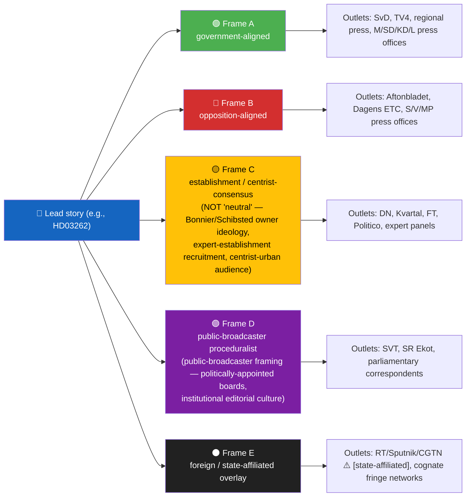
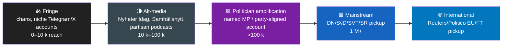
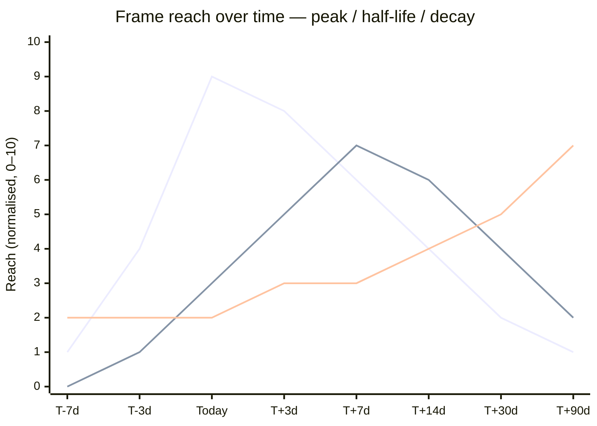
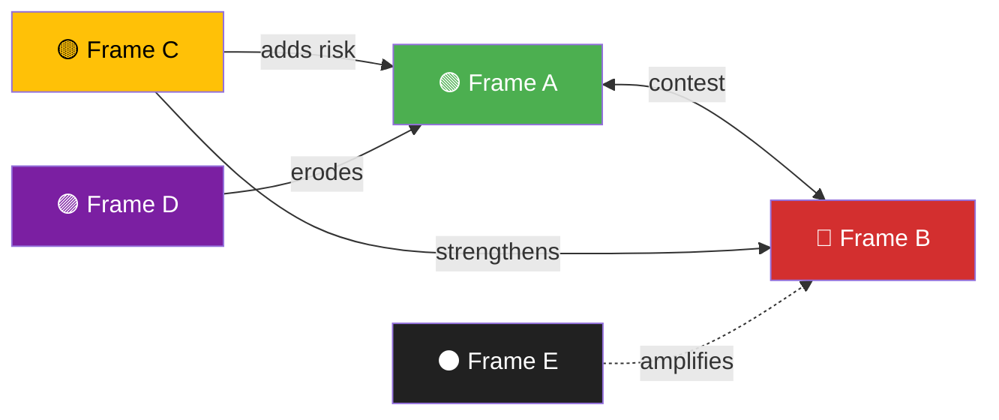

  

<h1 align="center">📰 Media Framing & Influence-Operations Analysis Template</h1>

  <strong>📊 Mapping Narratives, Manipulation Vectors & Frame Lifecycles Across Press, Broadcast and Platform Ecosystems</strong> 
  <em>🎯 Frame Packages · Entman Functions · Cognitive Vulnerabilities · DISARM TTPs · Coordinated-Inauthentic-Behaviour Signals · Half-Life · Counter-Resilience</em>

  
  
  
  

**📋 Document Owner:** CEO | **📄 Version:** 2.1 | **📅 Last Updated:** 2026-05-01 (UTC)
**🏢 Owner:** Hack23 AB (Org.nr 5595347807) | **🏷️ Classification:** Public

> **📌 Template instructions:** Produce on every run and save as `analysis/daily/${ARTICLE_DATE}/${DOC_TYPE}/media-framing-analysis.md` to maintain a longitudinal record of media narratives **and the manipulation/influence-operations layer riding on top of them**. On low-salience days, provide a lighter baseline update covering the dominant frame and any active influence-operation signals; on high-salience days, expand to the full template. Uses **public** media coverage and **public** social-media posts only — no scraping behind paywalls, no private-account content, no leaked or hacked material.

> **🚫 Founding doctrine — there is NO neutral outlet, NO neutral algorithm, NO neutral broadcaster.** Every outlet has ownership structure, funding mix, board-appointment authority, audience demographic, editorial culture and documented bias. "Public-service" is **publicly funded**, not bias-free — boards are appointed by political bodies (in Sweden: Förvaltningsstiftelsen for SVT/SR/UR, with parliamentary input), funding is set by government appropriation, and editorial line is shaped by recruitment, training and institutional culture (cf. Reuters Institute Digital News Report 2024; Nordicom Media Ownership Database). "Mainstream" / "quality" press carries owner ideology (Bonnier / Schibsted / NWT Media / Stampen-now-Bonnier-regional / Mittmedia-now-Bonnier — Sweden's national press is heavily concentrated). Every algorithm optimises an objective function (engagement, watch-time, retention) that has documented partisan asymmetries. **The platform's only neutrality is procedural: equal analytical depth across all 8 Riksdag parties; equal evidentiary discipline across all outlets; explicit ownership/funding/lean disclosure for every cited outlet.** Claiming an outlet is "neutral" or "balanced" without evidence is rejected at Pass 2.

> **✨ What to produce — non-negotiable minimum (v2.1):** (1) ≥ 3 named frame packages with **Entman functions** (problem definition / causal attribution / moral evaluation / treatment); (2) **cognitive-vulnerability map** linking each frame to ≥ 1 documented bias; (3) **manipulation indicators** mapped to **DISARM TTPs** with `[unconfirmed]` flag where corroboration is missing; (4) **narrative-laundering chain** (fringe → alt → MSM) for any frame that touches it; (5) **comparative-international frame lineage** — where the cognate frame appeared elsewhere first; (6) **frame lifecycle / longevity** — peak, half-life estimate, sleeper/zombie probability; (7) **impact conversion (RRPA)** — Reach × Resonance × Persistence × Action; (8) **counter-resilience plan** — prebunking, inoculation, debunking ladder; (9) **forward watchlist** with WEP bands; (10) Admiralty grade on every external citation; (11) **outlet bias audit** for every outlet cited — ownership, funding mix, board-appointment authority, documented editorial lean, Reuters Institute Trust score, Pressombudsman complaints, foreign-actor link.

---

## 🔄 Tradecraft Context

| Element | Value |
|---------|-------|
| **F3EAD Stage** | **ANALYZE → DISSEMINATE** — media environment, manipulation surface, and counter-resilience guidance |
| **PIRs Served** | **PIR-6** (Election Integrity — narrative manipulation detection), **PIR-7** (Democratic Norms — media pluralism), **PIR-8** (Foreign Influence — coordinated inauthentic behaviour & state-actor amplification), **PIR-9** (Cognitive Security — bias-exploitation surface) |
| **Admiralty Floor** | **No outlet is "neutral"** — Admiralty grade reflects **process discipline** (corrections policy, source attribution, separation of news/opinion), not ideological neutrality. Every cited outlet must carry an ownership / funding / lean tag from the Source Ecology table. Public-service broadcasters with editorial-board independence + corrections policy + ombudsman (SVT, SR, BBC, ARD, NRK, DR, YLE) **[B2]** ⚠️ *publicly funded; politically appointed boards; audience-demographic skew documented*; international news wires with multi-source verification (Reuters, AP, AFP, DPA) **[B2]**; commercial quality press with corrections policy (DN [Bonnier], SvD [Schibsted], FT, Le Monde, NYT) **[B3]** ⚠️ *owner ideology + audience-demographic skew documented*; tabloids (Aftonbladet [Schibsted/LO-aligned], Expressen [Bonnier], Bild, The Sun) **[C3]**; alt/partisan outlets (Nyheter Idag, Samhällsnytt, Riks, Breitbart-cognates) **[D3]** with `[partisan-aligned]` tag; named-figure social posts **[D2]**; anonymous social posts **[E5]** with `[unconfirmed]`; foreign-state-affiliated outlets (RT, Sputnik, CGTN, PressTV, RIA, TASS) **[F-flag — actor-attributed propaganda]** with `[state-affiliated]` annotation. **An outlet's grade can never be promoted to imply "neutral truth source" — it only constrains how the artifact must caveat its reliance on that outlet.** |
| **WEP + ODNI** | Frame-momentum claims use **WEP** (gaining traction / fading / dormant); influence-operation attributions require **MODERATE** confidence floor; foreign-state attribution requires **HIGH** confidence + ≥ 3 independent indicators |
| **Source Diversity Floor** | P2 (frame-dominance): ≥ 2 outlets from distinct categories; P1 (laundering chain): ≥ 1 source per node (fringe + alt + MSM); P0 (foreign-state attribution): ≥ 3 independent indicators across actor / behaviour / content / degree / effect (ABCDE) |
| **SAT(s) Applied** | Outside-In Thinking, Indicators & Signposts, Red Cell (adversary frame planner), ACH (≥ 3 competing hypotheses for any state-attribution claim), Premortem on counter-resilience plan |
| **ICD 203 Standards** | 1 (source quality), 2 (uncertainties — frame attribution), 5 (customer relevance — counter-framing actionability), 6 (logical argumentation — causal chains), 9 (visual information — frame map, laundering chain, lifecycle curve) |
| **Frameworks Referenced** | **Entman (1993)** framing functions · **DISARM** Foundation TTP taxonomy · **SCOTCH** model (Source/Channel/Object/Target/Composition/Hook) · **ABCDE** (Camille François: Actor-Behaviour-Content-Degree-Effect) · **Wardle/Derakhshan** information-disorder taxonomy (mis-/dis-/mal-information) · **RAND firehose-of-falsehood** model · **Lakoff** conceptual frames · **Cialdini** influence principles |

---

## 📋 Framing Context

| Field | Value |
|-------|-------|
| **Framing ID** | `FRM-YYYY-MM-DD-NNN` |
| **Generated** | `YYYY-MM-DD HH:MM UTC` |
| **Subject** | `e.g., HD03262 permanent-residence reform package` |
| **Coverage window** | `2026-04-28 to 2026-05-01` |
| **Outlets reviewed (Sweden)** | `DN, SvD, Aftonbladet, Expressen, SVT, SR, TV4, Dagens ETC, Kvartal, Nyheter Idag, Samhällsnytt, Riks, regional press sample` |
| **International outlets reviewed** | `Reuters / AP / DPA / AFP / Politico EU / FT / NYT / Le Monde / Der Spiegel / Helsingin Sanomat / Aftenposten / Berlingske` |
| **State-affiliated outlets monitored** | `RT, Sputnik, RIA, TASS, CGTN, Global Times, PressTV` (for amplification fingerprinting only — not as factual sources) |
| **Counts** | `N articles / N broadcast segments / N editorials / N social posts (public)` |
| **Overall Confidence** | `🟧 MEDIUM [B2]` |

---

## 🧭 Frame Package Overview

> **Frame E inclusion rule:** include ONLY when ≥ 1 state-affiliated or coordinated foreign-amplification signal is observed in the coverage window. Otherwise omit Frame E and document the absence explicitly: `Frame E: [no foreign-amplification signal observed in window]`.

> **Frame C / D labelling discipline:** Frame C is the **establishment / centrist-consensus** frame — never written as "neutral" or "balanced" because it carries the ideology of concentrated commercial owners (Bonnier ≈ 50 % of Swedish national daily-press circulation; Schibsted controls Aftonbladet + SvD), expert-establishment recruitment networks (Stockholm-school-of-economics / Uppsala / Lund alumni clusters), and a centrist-urban audience demographic. Frame D is the **public-broadcaster proceduralist** frame — never written as "impartial" because SVT/SR/UR boards are appointed via Förvaltningsstiftelsen with parliamentary input, funding is set by government appropriation, and editorial culture is shaped by public-service remit (`opartiskhet och saklighet`) interpretation that itself is contested. Both frames are positions, not absences of position.

---

## 🗂️ Frame Package Table — with Entman functions

| Frame | Problem definition | Causal attribution | Moral evaluation | Treatment recommendation | Lead messengers | Approx. share |
|-------|--------------------|--------------------|------------------|--------------------------|-----------------|:-------------:|
| 🟢 A — `[name]` | `what is broken` | `who/what caused it` | `why it is wrong/right` | `what to do` | `Named MP + party + role` | `XX %` |
| 🔴 B — `[name]` | … | … | … | … | … | `XX %` |
| 🟡 C — `[name]` | … | … | … | … | … | `XX %` |
| 🟣 D — `[name]` | … | … | … | … | … | `XX %` |
| ⚫ E — `[foreign overlay if observed]` | … | … | … | … | … | `XX %` |

> **Source:** Entman, R.M. (1993). "Framing: Toward Clarification of a Fractured Paradigm." *Journal of Communication* 43(4): 51–58. Every cell must trace to a dated quote, headline, or `dok_id`; vague summaries are rejected at Pass 2.

---

## 🧠 Cognitive Vulnerability Map

| Frame | Bias exploited | Mechanism | Inoculation lever |
|-------|----------------|-----------|--------------------|
| 🟢 A | Loss aversion + status-quo bias | Framing reform as protection of existing entitlements | Reframe loss-language as opportunity-language; cite distributional data |
| 🔴 B | In-group / out-group + scapegoating | Personifying harm onto a single actor or class | Counter-stereotype exemplars; structural-cause data |
| 🟡 C | Authority bias | "Experts say…" without expert disclosure / "centrist-consensus" presented as objective | Expert-credential + funding-source transparency; competing-expert panel; ownership disclosure of the outlet running the "experts say" frame |
| 🟣 D | Availability heuristic + recency + authority bias | Coalition rumour amplified by recent procedural event; public-broadcaster procedural framing read as "what really happened" when it is itself an editorial choice | Base-rate data on coalition stability; remind readers that public-broadcaster framing reflects an institutional editorial culture, not absence of one |
| ⚫ E | Repetition / illusory truth + reactance | Identical phrasing across coordinated nodes | Prebunking of frame-template; show coordination evidence |

> **Source:** Cialdini (2001) *Influence*; Kahneman (2011) *Thinking, Fast and Slow*; Roozenbeek & van der Linden (2019) "Fake news game confers psychological resistance against online misinformation." *Palgrave Communications.* Every row must cite a documented bias with primary literature, not folk-psychology claims.

---

## 🛰️ Manipulation Indicators — DISARM TTP Map

> **DISARM Foundation** is the open-source MITRE-style taxonomy for cognitive-security threat behaviours (https://www.disarm.foundation/). Use the `T####` codes verbatim. Mark `[unconfirmed]` if any indicator lacks ≥ 2 independent corroborations.

| DISARM TTP | Observation in window | Evidence (URL / dok_id / public account) | Confidence | ABCDE attribution |
|------------|----------------------|------------------------------------------|:----------:|--------------------|
| `T0049 Flooding` | High-volume identical posts in <2 h window on `#hashtag` | `[link or "no signal"]` | LOW / MOD / HIGH | Actor: `[unattributed]`; Behaviour: coordinated; Content: identical; Degree: N posts; Effect: trending |
| `T0086 Astroturfing` | Mass-identical "spontaneous citizen" letters to editor | `[link]` | … | … |
| `T0040 Demand insincere apology` | Manufactured outrage cycle | `[link]` | … | … |
| `T0091 Sell merchandise` | Branded merchandise driving frame reach | `[link]` | … | … |
| `T0099 Prepare assets impersonating legitimate entities` | Spoof accounts of named outlets/MPs | `[link]` | … | … |
| `T0023 Distort facts` | Doctored quote / out-of-context clip | `[link]` | … | … |
| `T0085 Develop AI-generated text` | LLM fingerprints in identical posts | `[link]` | … | … |
| `T0088 Develop AI-generated images / deepfakes` | Synthetic media observed | `[link]` | … | … |
| `T0118 Amplify existing narrative` | State-affiliated outlet picks up domestic frame | `[link]` | … | … |

> **No-signal finding is also a finding:** if no DISARM TTP is observed, write `No coordinated manipulation signal in window — frames appear organically driven by public actors`. Silence is not the same as "we did not look."

---

## 🔗 Narrative-Laundering Chain

> Track how a frame migrates from the fringe layer to mainstream coverage. If the chain is incomplete, document the missing link rather than infer it.

| Stage | First observed (UTC) | Carrier | Reach (est., public metrics only) | Admiralty | Notes |
|-------|----------------------|---------|-----------------------------------|:---------:|-------|
| Fringe | `YYYY-MM-DD HH:MM` | `[anonymised channel name OR "no fringe origin observed"]` | `~N` | E5 | `[unconfirmed]` if only 1 trace |
| Alt-media | … | `Nyheter Idag / etc.` | … | D3 | … |
| Politician amplification | … | `Named MP (party)` | … | B2/D2 | quote URL + dok_id where available |
| Mainstream | … | `DN / SVT / etc.` | … | B2/C3 | … |
| International | … | `Reuters / Politico EU / FT` | … | B2 | … |

---

## 🌐 Source Ecology — Outlet Bias Audit (no outlet is neutral)

> **Doctrine:** every outlet appearing anywhere in this artifact MUST appear in this table. No bias audit = no citation. The columns capture the *structural* bias drivers (ownership, funding, board, audience), not journalist personalities. Source: Nordicom Media Ownership Database (gu.se), Reuters Institute Digital News Report 2024 (trust scores), Allmänhetens Pressombudsman / Pressens Opinionsnämnd (PO/PON) complaint registry, Förvaltningsstiftelsen (SVT/SR/UR board appointments), EUvsDisinfo case dossiers, EU DSA transparency reports, public SÄPO/MUST/FRA/EU-EEAS statements.

| Outlet | Ownership group | Funding mix (% commercial / % licence-fee / % subscriber / % state / % foreign) | Board-appointment authority | Documented editorial lean (last election cycle) | Reuters Institute Trust score (2024) | PO/PON complaints (last 12 mo) | Foreign-actor link |
|--------|------------------|-----|-----------|-----|:---:|:---:|---|
| `DN` | Bonnier News (private — Bonnier family) | ~95 % commercial / ~5 % subscriber-mix | Bonnier-appointed | Centre / liberal — Stockholm-urban | `XX %` | `N` | `[none / cf. dossier]` |
| `SvD` | Schibsted Media (Norwegian-owned) | ~95 % commercial | Schibsted-appointed | Centre-right / liberal-conservative | `XX %` | `N` | `[none]` |
| `Aftonbladet` | Schibsted (88 %) + LO (9 %) | ~98 % commercial + LO-stake | Schibsted-appointed; LO observer | Social-democratic editorial line (independent) | `XX %` | `N` | `[none]` |
| `Expressen` | Bonnier News | ~98 % commercial | Bonnier-appointed | Liberal — populist registers | `XX %` | `N` | `[none]` |
| `SVT` | Public-service foundation | ~95 % licence-fee (radio-och-tv-avgift / now public-service-avgift) | Förvaltningsstiftelsen (board appointed by Riksdag-influenced process) | Public-service remit `opartiskhet och saklighet` — interpretation contested; centrist-establishment audience demographic | `XX %` | `N` | `[none]` |
| `SR` | Public-service foundation | ~95 % licence-fee | Förvaltningsstiftelsen | Public-service remit; Ekot as flagship — centrist-establishment | `XX %` | `N` | `[none]` |
| `TV4` | Telia / Allente (Telenor + Norwegian state) | ~98 % commercial | Telia/Allente-appointed | Commercial centrist | `XX %` | `N` | `[Norwegian-state minority via Telenor — public]` |
| `Dagens ETC` | Co-operative + reader-owned | ~50 % subscriber / ~50 % commercial | Co-operative members | Left / green editorial line | `XX %` | `N` | `[none]` |
| `Kvartal` | Reader-owned + private | ~70 % subscriber / ~30 % donor | Founder-controlled | Centre-right intellectual / contrarian-establishment | `XX %` | `N` | `[none]` |
| `Nyheter Idag / Samhällsnytt / Riks` | Private — partisan-aligned ownership | Donor / advertising | Founder-controlled | Right-populist / SD-aligned (documented EUvsDisinfo / Nordicom) | `XX %` | `N` | `[document any cross-link]` |
| `Reuters / AP / AFP / DPA` | Wire services — Thomson Reuters Foundation / non-profit cooperative / private / DPA-Tochtergesellschaft | Subscription-licensing | Independent boards | Process-disciplined wire reporting; centrist-internationalist | `XX %` | `N` | `[none]` |
| `RT / Sputnik / RIA / TASS / CGTN / PressTV` | RU / CN / IR state-controlled | 100 % state | State-appointed | Foreign-state propaganda — `[state-affiliated]` | n/a (excluded from trust survey or scored ≤ 10 %) | n/a | **YES** — actor-attributed by EUvsDisinfo / EU-EEAS |
| `[other cited outlet]` | … | … | … | … | … | … | … |

> **No-claim-of-neutrality rule:** any cell that reads "neutral", "impartial", "balanced", "objective" is rejected at Pass 2. Use the documented lean (centre / centre-right / centre-left / liberal / conservative / social-democratic / green / right-populist / left-populist / proceduralist / contrarian-establishment / state-propaganda) with the Nordicom or Reuters Institute citation.

---

## 🤝 Coordinated-Inauthentic-Behaviour (CIB) Signal Block

> Apply the **ABCDE** framework (Camille François, *Actors, Behaviours, Content, Degree, Effects of Disinformation*, 2020) and the Meta CIB removals taxonomy.

| Indicator | Observation | Threshold | Status |
|-----------|-------------|-----------|--------|
| Account-creation burst | N new accounts posting frame in <72 h | > 5 % of frame's amplifier set created in <72 h | 🟢 / 🟧 / 🟥 |
| Posting-time clustering | Posts concentrated in a narrow UTC window incompatible with claimed location | > 3σ from baseline | … |
| Cross-platform identical phrasing | Verbatim copy across X / Telegram / TikTok / Reddit | ≥ 3 platforms, ≥ 5 instances | … |
| Spoof / impersonation accounts | Look-alike usernames of named MPs or outlets | ≥ 1 confirmed spoof | … |
| Hashtag co-occurrence anomaly | Hashtag pair rises >10× over baseline | EUvsDisinfo / Meta CIB report | … |
| Bot-likelihood score (Botometer-class) | Median > 0.7 across amplifier set | published academic threshold | … |
| Fake-engagement spike | Likes/RT > expected by impressions | platform transparency report | … |

> **Attribution discipline:** observing CIB ≠ attributing to a state. State attribution requires the public-record floor in the Source Ecology table above.

---

## 📡 Algorithmic-Amplification Asymmetry

> **Doctrine:** there is no neutral algorithm. Every recommender / feed / "For You" optimises an objective function (engagement, watch-time, retention, ad-yield) and that function has documented partisan asymmetries. Citing "the algorithm shows X" without naming the optimisation target and the academic/transparency-report measurement is rejected at Pass 2.

| Platform | Frame A reach | Frame B reach | Asymmetry ratio | Optimisation target & documented partisan/emotional asymmetry (cite source) |
|----------|--------------:|--------------:|:----------------:|------------------------------------------------------------------------------|
| X / Twitter | … | … | A/B | Engagement-maximising algorithmic feed; **documented right-amplification asymmetry** (Huszár et al. 2022, *PNAS* 119/1) — no neutral baseline |
| Facebook | … | … | … | Engagement + group-affinity; News-in-Feed deprecation (Meta DSA 2024); group-amplification still active and **documented to amplify outrage and out-group hostility** (Rathje, Van Bavel & van der Linden 2021, *PNAS* 118/26) |
| TikTok | … | … | … | "For You" — opaque retention-maximising; **emotional-content amplification documented** (TikTok DSA transparency report 2024; Faddoul et al. 2023 audit) — opacity ≠ neutrality |
| YouTube | … | … | … | Watch-time-maximising recommendation; **rabbit-hole asymmetry documented** for political content (Ribeiro et al. 2020, *FAccT*; Hosseinmardi et al. 2024 PNAS Nexus) |
| Telegram | … | … | … | Channel-broadcast model — no recommender, but **high-velocity in-group amplification with no friction**; documented as primary vector for narrative-laundering (NATO StratCom COE 2023) |
| Instagram / Threads / Reddit | … | … | … | Each has a documented engagement-curve asymmetry — fill in with platform-specific transparency-report citation |

> Cite the academic / transparency-report source on every algorithmic claim. "Platform X favours left/right" without citation is rejected at Pass 2.

---

## 🌍 Comparative-International Frame Lineage

> No frame in Swedish politics is born locally. Trace the cognate frame to its prior appearance in another jurisdiction. Use **public** academic / EUvsDisinfo / Reuters Institute Digital News Report / GLOBSEC trend reports.

| Cognate frame | First major appearance | Vehicle | Mutation in Swedish context | Reference |
|---------------|------------------------|---------|------------------------------|-----------|
| `e.g., "great replacement" / "open-borders elites"` | France 2011 (Camus); US 2017 (alt-right) | Tabloids → talk-radio → social | Translated to Swedish "befolkningsutbyte" 2017–2019 | EUvsDisinfo dossier; Reuters Institute 2024 |
| `e.g., "elite vs. people" populist binary` | Hungary 2010 (Fidesz); Italy 2018 (Lega/M5S) | State media → friendly tabloids | Adapted by SD ahead of 2018, intensified 2022 | GLOBSEC 2024 trend report |
| `e.g., firehose-of-falsehood doctrine` | RU 2014 (Crimea / MH-17) | RT/Sputnik network | Sweden 2022 NATO-application disinfo wave | RAND PE-198; SÄPO 2023 annual report |
| `e.g., "courts vs. democracy" frame` | Poland 2015 (PiS); Israel 2023 judicial reform | Government-aligned press | `[applies to current Swedish story? Y/N]` | Freedom House Nations in Transit 2025 |

> **Naivety check:** if every frame in the table has "no international cognate found" — re-do the search. ≥ 2 cognates is the realistic floor for any major Swedish political story in 2026.

---

## 🎭 Strategic-Doctrine Detection

> Identify whether the observed frame ecology fits a known propaganda doctrine. **Detection ≠ attribution.** Pattern-match to public-domain doctrines.

| Doctrine | Signature | Observed? | Evidence |
|----------|-----------|:---------:|----------|
| **Firehose of falsehood** (RAND PE-198, RU model) | High-volume + multi-channel + rapid + repetitive + no commitment to truth | 🟢 / 🟧 / 🟥 | … |
| **Doppelganger operation** (EU-DisinfoLab 2022 RU campaign cloning EU outlets) | Spoofed look-alike domains of named outlets | … | … |
| **Gish gallop** (debate technique scaled to media) | Many low-quality claims faster than fact-checking can rebut | … | … |
| **Reflexive control** (Soviet/RU doctrine) | Shape adversary's decision frame so they "freely" choose what attacker wants | … | … |
| **Active measures spillover** (NATO StratCom COE, 2024) | Domestic actors knowingly or unknowingly carrying foreign-state framing | … | … |
| **Narrative capture by interest-group lobby** (US tobacco / fossil-fuel model) | Coordinated industry-funded "expert" amplification | … | … |
| **MAGA cognate populism** (US 2016/2020/2024) | Anti-elite + media-as-enemy + perpetual-grievance + leader-cult components | … | … |

> **No doctrine match is a valid finding.** "Frames appear to be organic competitive politics within Swedish norms" is a publishable conclusion at HIGH confidence if evidence supports it.

---

## ⏳ Frame Lifecycle / Longevity

> Line 1 = Frame A (peaked, decaying). Line 2 = Frame B (rising, lagged). Line 3 = Frame C (slow burn — gains over horizon).

| Frame | Phase | Estimated peak (UTC) | Half-life (days) | Sleeper / zombie probability | Reactivation trigger |
|-------|-------|----------------------|:----------------:|:---------------------------:|----------------------|
| 🟢 A | post-peak | `YYYY-MM-DD` | `e.g., 6` | LOW (15 %) | New SCB distributional data |
| 🔴 B | rising | `YYYY-MM-DD` | `e.g., 9` | MED (35 %) | Court ruling on appeal |
| 🟡 C | slow burn | `T+30d` | `e.g., 21` | HIGH (60 %) | EU Commission letter |
| 🟣 D | episodic | … | `e.g., 3` | MED (40 %) | Coalition vote |
| ⚫ E | dormant | n/a | n/a | LOW (10 %) | External crisis |

> **Frame archaeology:** for any frame with `zombie probability ≥ MED`, list the prior cycles where the same frame appeared (date + carrier). Zombie frames are the most predictable election-cycle weapons.

---

## 📈 Impact Conversion — RRPA (Reach × Resonance × Persistence × Action)

| Frame | Reach (est. impressions, public metrics) | Resonance (engagement / impression) | Persistence (days at >50 % peak) | Action conversion (poll move / petition / protest / donation) | RRPA composite (0–100) |
|-------|------------------------------------------:|:-----------------------------------:|:--------------------------------:|:-------------------------------------------------------------:|:----------------------:|
| 🟢 A | … | … | … | `e.g., +1.2 pp in M support, Demoskop (B2)` | … |
| 🔴 B | … | … | … | … | … |
| 🟡 C | … | … | … | `e.g., 2 EU MEP letters` | … |
| 🟣 D | … | … | … | … | … |

> **Action conversion** is the only honest measure of frame *power*. Reach without action is theatre. Cite a dated indicator (poll, petition signature count, donation report, demonstration permit) for every Action cell, or write `[no action signal yet]`.

---

## 🛡️ Counter-Resilience Plan — prebunking · inoculation · debunking ladder

> Riksdagsmonitor itself **does not push counter-frames** — its only neutrality is **procedural** (equal analytical depth across all 8 Riksdag parties; equal evidentiary discipline across all outlets; full ownership/funding/lean disclosure for every cited outlet). This is **not** a claim that the platform produces "neutral truth" or that any media source is neutral — both claims are explicitly rejected by the founding doctrine at the top of this template. This section gives readers (journalists, policymakers, civic educators) a documented ladder so they can operate themselves.

| Layer | Audience | Tactic | Reference |
|-------|----------|--------|-----------|
| **L1 — Prebunking (proactive)** | General public, civic educators | Publish technique-focused frame-anatomy explainer 7+ days before predicted peak; show the *manipulation technique* (not a counter-political-position) (Roozenbeek & van der Linden 2022, *Sci Adv*) | https://prebunkingmovement.com/ ; Cambridge Social Decision-Making Lab |
| **L2 — Inoculation (just-in-time)** | Newsroom editors, fact-checkers | Distribute frame-fingerprint card before press conferences | UNESCO 2023 *Journalism, fake news & disinformation* handbook |
| **L3 — Lateral-reading prompt** | Readers | Provide outlet-ownership table (above) so readers can do source-triangulation themselves | Wineburg & McGrew (2019) Stanford HEG |
| **L4 — Debunking (post-spread)** | Journalists | Truth-sandwich format: truth → falsehood (briefly) → truth again | Lewandowsky et al. (2020) *Debunking Handbook 2020* |
| **L5 — Algorithmic-friction request** | Platforms | If state-affiliated coordinated amplification observed → file public DSA Art. 40 transparency request and EUvsDisinfo report | EU DSA Art. 40; Code of Practice on Disinformation 2022 |

| Frame | Recommended counter-resilience layer(s) | Rationale |
|-------|------------------------------------------|-----------|
| 🟢 A | L3 + L4 | Government frame is loud and durable — readers benefit from lateral-reading + truth-sandwich |
| 🔴 B | L1 + L4 | Opposition frame uses identifiable bias (in-group); prebunking the *technique* works |
| 🟡 C | L2 only | Analytical frame doesn't require counter-resilience; inoculation guards against capture |
| 🟣 D | L4 | Coalition rumour responds to evidence-based debunking |
| ⚫ E | L1 + L5 | Foreign-overlay frames are textbook prebunking targets + DSA escalation |

---

## 🔍 Quote Salience

| Quote | Speaker | Frame | Reach (est.) | Reusability | Manipulation flag |
|-------|---------|:-----:|:------------:|:-----------:|:-----------------:|
| `"verbatim, public source"` | `Named MP / outlet (party + role)` | A/B/C/D/E | High/Medium/Low | High/Medium/Low | None / `[doctored]` / `[out-of-context]` |

---

## 🎯 Frame-Competition Dynamics

| Dynamic | Outcome | WEP confidence |
|---------|---------|:--------------:|
| Frame A vs B | `e.g., Stalemate — voter segments cluster` | LIKELY |
| Frame C interacts with both | `Adds structural risk to A` | LIKELY |
| Frame D adds noise to A | `Lowers government's narrative control` | EVEN |
| Frame E amplifies B | `IF observed — otherwise omit` | UNLIKELY (default) |

---

## 📈 Coverage-Volume Dashboard

| Outlet category | Day 1 | Day 2 | Day 3 | Trend | Note |
|-----------------|:-----:|:-----:|:-----:|:-----:|------|
| National daily press (SE) | 11 | 14 | 9 | ↘ | Transitioning to commentary phase |
| Tabloids (SE) | 7 | 10 | 8 | ↘ | … |
| Public broadcasters (SE) | 4 | 5 | 3 | ↘ | … |
| Commercial broadcasters (SE) | 3 | 4 | 4 | → | … |
| Regional press (SE) | 22 | 18 | 12 | ↘ | … |
| Opinion / commentary (SE) | 6 | 9 | 11 | ↗ | Frame C rising as economists weigh in |
| International quality press | 1 | 2 | 4 | ↗ | Reuters / Politico EU pickup |
| State-affiliated foreign | 0 | 1 | 2 | ↗ | ⚠️ flag if non-zero — investigate amplification |

---

## 🔁 Forward Watchlist

| Trigger | Likely frame shift | WEP | Time horizon | Admiralty |
|---------|--------------------|:---:|:------------:|:---------:|
| EU Commission formal communication | Frame C surges to dominance | LIKELY | 14 d | A1 (forthcoming primary) |
| SCB publishes distributional analysis | Frame B strengthens | HIGHLY LIKELY | 30 d | A1 |
| Government announces follow-on measure | Frame A strengthens | EVEN | 30 d | B2 |
| Coalition-party dissent visible | Frame D surges | UNLIKELY | 7 d | C3 |
| EUvsDisinfo dossier on this story | Frame E confirmed if observed | UNLIKELY (default) | 30 d | A1 |
| SÄPO public statement | Frame E + foreign-actor attribution | VERY UNLIKELY | 90 d | A1 |

---

## 📎 Sources

Public media coverage and public social-media posts only. Representative sample across Swedish national, regional, and commentary outlets, plus international quality press for comparative frame lineage. **No outlet is treated as neutral** — every cited outlet appears in the §"Source Ecology — Outlet Bias Audit" table with ownership, funding mix, board-appointment authority, documented editorial lean, Reuters Institute Trust score, and PO/PON complaint history. Public-service broadcasters (SVT/SR/UR) are publicly funded with politically-appointed boards (Förvaltningsstiftelsen) and an institutional editorial culture — process-disciplined but not bias-free. State-affiliated outlets (RT/Sputnik/CGTN/PressTV/RIA/TASS) monitored only as amplification signal — never cited as factual sources. No paywall bypass. No private-account social-media content. No leaked or hacked material. Frame-ownership and funding data sourced from Nordicom Media Ownership Database (gu.se), Reuters Institute Digital News Report 2024, EUvsDisinfo case dossiers, EU DSA transparency reports, and public SÄPO/MUST/FRA/EU-EEAS publications.

---

**Document Control**
- **Template path:** `/analysis/templates/media-framing-analysis.md`
- **Version:** 2.1 (no-neutral-media doctrine; outlet bias audit; algorithmic-asymmetry doctrine — 2026-05-01)
- **Previous version:** 2.0 (psyops + global + longevity + RRPA + counter-resilience expansion, 2026-05-01)
- **Referenced by:** [`ai-driven-analysis-guide.md` § Step 5](../methodologies/ai-driven-analysis-guide.md#step-5--extensions-f3ead-analyze-continued), [`per-artifact-methodologies.md` § media-framing-analysis](../methodologies/per-artifact-methodologies.md#media-framing-analysis), [`electoral-domain-methodology.md` § Part 5](../methodologies/electoral-domain-methodology.md#-part-5--media-framing--influence-operations-analysis-media-framing-analysismd)
- **Classification:** Public
- **Next Review:** 2026-08-01

---

## ✅ Pass-2 Self-Audit Checklist (v2.1 — required)

> **Purpose:** AI-FIRST principle requires a Pass-2 read-back-and-improve. After producing this artifact in Pass 1, re-read it end-to-end and verify each item below. Document any remediation in [`methodology-reflection.md`](methodology-reflection.md) §"Pass-2 audit log". Any unchecked ❌ box at the end of Pass 2 forces a Pass-3 rewrite of the affected section.

### No-Neutral-Media Doctrine (NEW in v2.1 — non-negotiable, top priority)

- [ ] **No "neutral / impartial / unbiased / balanced / objective" label applied to any outlet, algorithm, or broadcaster** in the artifact body without ≥ 1 documented-bias citation in the same paragraph. Free-text occurrences of these words in any analytical sentence trigger Pass-2 rewrite.
- [ ] **Outlet Bias Audit table is populated for every cited outlet** — ownership group, funding mix, board-appointment authority, documented editorial lean, Reuters Institute Trust score, PO/PON complaint history, foreign-actor link. No bias audit row = no citation.
- [ ] **Public-service broadcaster caveat present** — every reliance on SVT / SR / UR / BBC / ARD / NRK / DR / YLE is accompanied by the licence-fee + politically-appointed-board + institutional-editorial-culture caveat, not treated as ground truth.
- [ ] **Algorithmic-asymmetry rows declare optimisation target** — every platform row names the objective function (engagement / watch-time / retention / ad-yield) and cites a documented partisan/emotional asymmetry; "the algorithm" without optimisation-target attribution is rejected.
- [ ] **Frame C / D label discipline** — Frame C is labelled "establishment / centrist-consensus" (NOT "neutral / analytical / institutional"); Frame D is labelled "public-broadcaster proceduralist" with politically-appointed-board + institutional-editorial-culture caveat (NOT "neutral / impartial / objective reporting" / "what really happened" / "coalition-inside").
- [ ] **Procedural neutrality only** — any reference to platform "neutrality" is qualified as procedural (equal analytical depth across all 8 Riksdag parties; equal evidentiary discipline across all outlets; full ownership/funding/lean disclosure) and never as a claim of "neutral truth" or "neutral source".

### Tradecraft (carry-over from v1.x)

- [ ] **Tradecraft anchors honoured** — F3EAD stage matches; PIRs declared (≥ PIR-6 + PIR-7 + PIR-8 + PIR-9) are addressed in body; Admiralty grades on every external source; WEP band + ODNI confidence on every probabilistic judgement.
- [ ] **Source diversity floor met** — ≥ 2 outlets per frame (P2); ≥ 3 nodes for any laundering chain (P1); ≥ 3 ABCDE indicators for any state-attribution claim (P0). Single-source items labelled `[SINGLE-SOURCE — corroboration pending]`.
- [ ] **Evidence specificity** — every quantified claim cites a dok_id, anförande, public URL, SCB / IMF code, or named EUvsDisinfo / SÄPO dossier; no "studies show" / "experts agree" without citation.
- [ ] **Named-actor discipline** — every political claim names ≥ 1 person (party + role + dated act/quote) or labels the absence (`[diffuse — no named actor]`).
- [ ] **Counter-narrative present** — at least one explicit competing hypothesis or framed objection appears in the body.
- [ ] **Election 2026 lens applied** — coalition pressure + electoral salience + forward indicator addressed.
- [ ] **No illustrative content shipped as fact** — every `[REQUIRED]` placeholder filled or removed; no fabricated `dok_id`, vote count, or quote leaks into the artifact.
- [ ] **Cross-references resolve** — every `[link](file.md)` resolves on disk.
- [ ] **Mermaid renders** — every fenced block parses; no >40-node graphs.
- [ ] **Line-floor check** — artifact length ≥ floor in [`reference-quality-thresholds.json`](../methodologies/reference-quality-thresholds.json); shorter triggers Pass-2 rewrite, never `[truncated]`.

### Framing-deep-dive items (NEW in v2.0 / carried into v2.1 — non-negotiable)

- [ ] **Entman functions present per frame** — problem definition + causal attribution + moral evaluation + treatment in the Frame Package Table; vague summaries rejected.
- [ ] **Cognitive Vulnerability Map cites primary literature** — every bias row cites Cialdini / Kahneman / Roozenbeek-van der Linden / equivalent peer-reviewed source.
- [ ] **DISARM TTPs used verbatim** — any manipulation indicator carries a `T####` code; "no signal" is documented explicitly, not implied by silence.
- [ ] **Narrative-laundering chain produced or absence justified** — fringe → alt → politician → mainstream → international, with first-observed timestamps; missing nodes labelled, not invented.
- [ ] **Source ecology table** populated for every cited outlet with ownership group · funding mix percentages · board-appointment authority · documented editorial lean · Reuters Institute Trust score · PO/PON complaint history · foreign-actor link from public registries (Nordicom, Reuters Institute, PO/PON, Förvaltningsstiftelsen, EUvsDisinfo, EU-EEAS / SÄPO public statements) — never speculation; "neutral / impartial / balanced / objective" labels rejected.
- [ ] **CIB ABCDE block** — Actor / Behaviour / Content / Degree / Effect populated for every state-attribution claim; observation ≠ attribution discipline applied.
- [ ] **Algorithmic asymmetry rows cite academic / transparency-report sources** — Huszár et al. 2022 PNAS, TikTok transparency reports, Ribeiro et al. 2020, etc.; "platform X favours party Y" without citation rejected.
- [ ] **Comparative-international frame lineage** — ≥ 2 cognates traced to prior jurisdictions; "no international cognate" is suspicious for any major story and triggers re-do.
- [ ] **Strategic-doctrine detection executed** — at least one row marked Yes/No against the public-doctrine catalogue (firehose / doppelganger / gish gallop / reflexive control / active-measures spillover / interest-group capture / MAGA cognate); attribution discipline ≥ MODERATE confidence floor before a 🟧/🟥 verdict.
- [ ] **Frame Lifecycle / Longevity present** — phase + half-life days + zombie probability + reactivation trigger per frame; xychart shows ≥ 8 horizon points.
- [ ] **RRPA composite computed** — Reach × Resonance × Persistence × Action with ≥ 1 dated action indicator per row, or `[no action signal yet]` honestly.
- [ ] **Counter-Resilience Ladder mapped to L1–L5** — every frame assigned ≥ 1 layer with rationale; platform-neutrality preserved (the platform reports the ladder, never executes counter-framing).
- [ ] **Frame E discipline** — included only with ≥ 1 observed signal; otherwise explicitly marked absent. No speculative foreign-attribution.
- [ ] **Naivety check passed** — re-read the whole artifact: any sentence that reads as "Swedish politics is just Swedish people debating in good faith" with no acknowledgement of imported frames, manipulation surface, or doctrinal patterns is rewritten in Pass 2.
