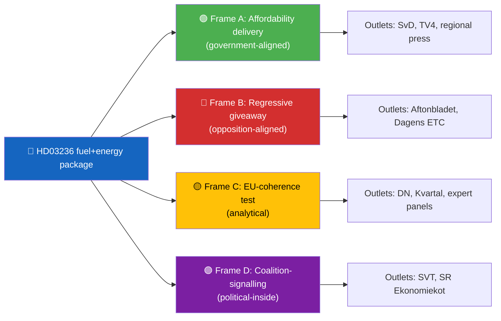
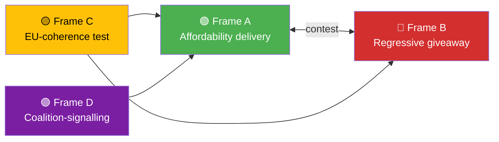

  

<h1 align="center">📰 Media Framing Analysis Template</h1>

  <strong>📊 Mapping Narratives Across Press, Broadcast and Social Ecosystems</strong> 
  <em>🎯 Frame Packages · Dominant Keywords · Attack/Defence Lines · Counter-Framing</em>

  
  
  
  

**📋 Document Owner:** CEO | **📄 Version:** 1.0 | **📅 Last Updated:** 2026-04-21 (UTC)
**🏢 Owner:** Hack23 AB (Org.nr 5595347807) | **🏷️ Classification:** Public

> **📌 Template instructions:** Produce when a story is high-salience and likely to dominate the next news cycle. Save as `analysis/daily/${ARTICLE_DATE}/${DOC_TYPE}/media-framing-analysis.md`. Uses public media coverage only — no scraping behind paywalls, no social-media private accounts.

> **✨ What to produce:** A named set of frame packages (minimum three), the outlet distribution of each frame, the most-used keywords per frame, the attack and defence lines activated, and the counter-framing the platform should adopt to stay neutral.

---

## 🔄 Tradecraft Context

| Element | Value |
|---------|-------|
| **F3EAD Stage** | **ANALYZE** — media environment assessment |
| **PIRs Served** | **PIR-6** (Election Integrity — narrative manipulation detection), **PIR-7** (Democratic Norms — media pluralism) |
| **Admiralty Floor** | Quality press (DN, SvD, SVT) requires **[C2]**; tabloid/social media requires **[D4]** with `[unconfirmed]` flag |
| **WEP + ODNI** | Media-narrative momentum claims use **WEP** (gaining traction/fading); confidence typically **LOW** to **MODERATE** (media is narrative layer, not primary evidence) |
| **Source Diversity Floor** | P2 (frame-dominance claims): ≥2 media outlets across quality/tabloid spectrum; single-outlet narrative labeled `[unconfirmed — single source]` |
| **SAT(s) Applied** | Outside-In Thinking (start from media perspective), Indicators and Signposts (narrative momentum indicators) |
| **ICD 203 Standards** | 1 (source quality — media outlet reliability), 2 (uncertainties — frame attribution), 9 (visual information — frame map) |

---

## 📋 Framing Context

| Field | Value |
|-------|-------|
| **Framing ID** | `FRM-YYYY-MM-DD-NNN` |
| **Generated** | `YYYY-MM-DD HH:MM UTC` |
| **Subject** | `e.g., HD03236 fuel + energy support package` |
| **Coverage window** | `2026-04-18 to 2026-04-21` |
| **Outlets reviewed** | `DN, SvD, Aftonbladet, Expressen, SVT, SR, TV4, Dagens ETC, Kvartal, regional press sample` |
| **Counts** | `N articles / N broadcast segments / N editorials` |
| **Overall Confidence** | `🟩 HIGH` |

---

## 🧭 Frame Package Overview

---

## 🗂️ Frame Package Table

| Frame | Core claim | Dominant keywords | Lead messengers | Approx. share of coverage |
|-------|-----------|-------------------|-----------------|:------------------------:|
| 🟢 A — Affordability delivery | "Government gives direct relief to households" | pump-price, välfärd, kostnadslättnad | Ulf Kristersson (M), Elisabeth Svantesson (M) | 38 % |
| 🔴 B — Regressive giveaway | "Tax cut benefits the rich and high-emitters" | regressiv, klimatsvek, orättvis | Magdalena Andersson (S), Nooshi Dadgostar (V) | 32 % |
| 🟡 C — EU-coherence test | "Measure strains Green Deal and state-aid commitments" | statsstöd, Green Deal, Kommissionen | Economist commentators, MP spokesperson | 20 % |
| 🟣 D — Coalition-signalling | "SD's fingerprints on fiscal policy" | SD-prägel, koalitionstryck | Political reporters | 10 % |

---

## 🧭 Attack / Defence Map

| Frame | Attack lines | Defence lines |
|-------|-------------|---------------|
| 🟢 A | "Delivery is symbolic, not structural" | "SEK 3 500/year per driver is not symbolic" |
| 🔴 B | "Renters and EV-users excluded" | "Renters benefit via electricity rebate" |
| 🟡 C | "EU incompatibility creates future risk" | "Pre-cleared consultation path exists" |
| 🟣 D | "SD is shaping fiscal policy without formal post" | "Parliamentary arithmetic requires cooperation" |

---

## 🔍 Quote Salience

| Quote | Speaker | Frame | Reach (est.) | Reusability |
|-------|--------|:-----:|:------------:|:-----------:|
| "Det här är leverans, inte symbolik" | Elisabeth Svantesson (M) | 🟢 A | Wide | High |
| "Skattesänkningen är regressiv" | Magdalena Andersson (S) | 🔴 B | Wide | High |
| "Risk för granskning från Kommissionen" | Economist panel | 🟡 C | Medium | Medium |

---

## 🌐 Social-Media Signal

| Platform | Dominant tone | Hashtags | Top narrative contributors (public figures only) |
|----------|---------------|----------|--------------------------------------------------|
| X / Twitter | Split (A vs B) | `#kostnadslättnad`, `#klimatsvek` | Named MPs only |
| Facebook groups (local rural) | A-leaning | — | Community pages |
| TikTok (15-29 y) | B-leaning | `#klimatsvek`, `#orättvis` | Youth activists (public) |

> **Scope:** Only aggregate signals from public accounts and named public figures are reported. No private-account content. No inference about non-public behaviour.

---

## 🎯 Frame-Competition Dynamics

| Dynamic | Outcome |
|---------|---------|
| Frame A vs B | Stalemate — voter segments cluster around both |
| Frame C interacts with both | Adds structural risk to A, strengthens B if EU acts |
| Frame D adds noise to A | Lowers government's control of narrative |

---

## 🧭 Platform Counter-Framing (neutrality guide)

Riksdagsmonitor stays neutral. The platform's coverage should:

| Principle | Concrete application |
|-----------|----------------------|
| Present all four frames on first mention | Use a 4-frame summary block in the article lede |
| Attribute each frame to its messengers with party | Named actor + party abbreviation |
| Report outcome data with confidence labels | Distributional SCB data with 🟩 HIGH |
| Avoid amplifying rumour | Social-media items require named public source |
| Cross-link to platform's own analysis files | Link to `synthesis-summary.md`, `voter-segmentation.md` |

---

## 📈 Coverage-Volume Dashboard

| Outlet category | Day 1 count | Day 2 count | Day 3 count | Trend |
|-----------------|:-----------:|:-----------:|:-----------:|:-----:|
| National daily press | 11 | 14 | 9 | ↘ |
| Tabloids | 7 | 10 | 8 | ↘ |
| Public broadcasters | 4 | 5 | 3 | ↘ |
| Commercial broadcasters | 3 | 4 | 4 | → |
| Regional press | 22 | 18 | 12 | ↘ |
| Opinion / commentary | 6 | 9 | 11 | ↗ |

> Trend interpretation: Story is transitioning from news to commentary phase — expect Frame C (EU-coherence test) to rise further as economists weigh in.

---

## 🔁 Forward Watchlist

| Trigger | Likely frame shift |
|---------|-------------------|
| EU Commission formal communication | Frame C surges to dominance |
| SCB publishes distributional analysis | Frame B strengthens |
| Government announces climate-offset measure | Frame A strengthens |
| Coalition-party dissent visible | Frame D surges |

---

## 📎 Sources

Public media coverage only. Representative sample across national, regional, and commentary outlets. No paywall bypass. No private-account social-media content.

---

**Document Control**
- **Template path:** `/analysis/templates/media-framing-analysis.md`
- **Referenced by:** [ai-driven-analysis-guide.md § Step 5](../methodologies/ai-driven-analysis-guide.md#step-5--extensions-family-c--d-produced-when-warranted)
- **Classification:** Public
- **Next Review:** 2026-07-21
