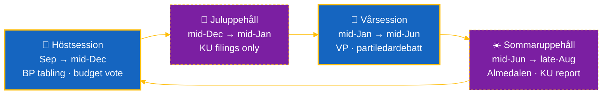
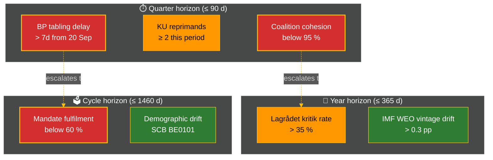

  

<h1 align="center">🏛️ Parliamentary Season Template</h1>

  <strong>📅 Riksmöte Calendar Lens — Quarter / Year / Cycle Workflows Only</strong> 
  <em>🗓️ Chamber Sittings · Committee Schedules · Tabling Deadlines · Lagrådet Referrals</em>

  
  
  
  

**📋 Document Owner:** CEO | **📄 Version:** 1.0 | **📅 Last Updated:** 2026-05-01 (UTC)
**🏢 Owner:** Hack23 AB (Org.nr 559534-7807) | **🏷️ Classification:** Public

> **📌 Template instructions:** Produce for `news-quarter-ahead`, `news-year-ahead`, `news-election-cycle`. Save as `analysis/daily/${ARTICLE_DATE}/${DOC_TYPE}/parliamentary-season.md`. Integrates with `forward-indicators.md`, `scenario-analysis.md`, `coalition-mathematics.md`, and the long-horizon prompt module `.github/prompts/ext/long-horizon-forecasting.md`.

> **✨ What to produce:** A calendar-driven outlook for the next 90 days (quarter), 365 days (year), or full mandate (cycle), keyed to the Riksmöte rhythm — when the chamber sits, when committees meet, when the government must table BP/VP, when Lagrådet referrals are due, and when interpellation windows open and close.

---

## 🔄 Tradecraft Context

| Element | Value |
|---------|-------|
| **Methodology** | Calendar lens (legislative monitoring) — derived from Riksdagen's published kalender + government's regeringskansliet propositions schedule |
| **Primary sources** | `riksdagen.se/sv/kalender`, `regeringen.se`, Lagrådet announcements, Riksbank monetary-policy calendar, SCB release calendar |
| **Time-frame** | Per-workflow horizon (quarter / year / cycle) |
| **Update cadence** | Re-checked at every long-horizon run |
| **Owning artifact** | `parliamentary-season.md` (this template) |
| **Audience** | Decision-makers, journalists, civil-society groups |

---

## 1 — Riksmöte Phase

| Phase | Span | Implication |
|-------|------|-------------|
| **Höstsession (Autumn)** | Sep → mid-Dec | Government tables BP (statsbudget) by 20 Sep; budget vote ~mid-Dec; opening regeringsförklaring on the third Tuesday of September |
| **Juluppehåll (Christmas recess)** | mid-Dec → mid-Jan | Limited committee activity; KU referrals can still be filed |
| **Vårsession (Spring)** | mid-Jan → mid-Jun | Spring fiscal policy bill (VP) by 15 Apr; key votes on EU presidency files; partiledardebatt cycle |
| **Sommaruppehåll (Summer recess)** | mid-Jun → late Aug | No chamber sittings; KU summer report; Almedalsveckan (early July) shapes agenda for Höstsession |

**Operational rule.** Every quarter-ahead / year-ahead / election-cycle artifact MUST identify the **current phase** at the top of this section and the **next phase boundary** in days.

### Riksmöte phase ribbon

The ribbon highlights which phase we are in and the **next two boundaries** the analyst must plan around. Recess phases are dashed because chamber business is suspended even though committee referrals (KU) and government-tabling deadlines still tick.

---

## 2 — Committee Schedule (next horizon)

For each parliamentary committee that will be active in the horizon window:

| Committee | Sittings (count + dates) | Key items expected | Risk to government |
|-----------|--------------------------|---------------------|---------------------|
| KU | … | … | … |
| FiU | … | … | … |
| SoU | … | … | … |
| FöU | … | … | … |
| JuU | … | … | … |
| UbU | … | … | … |
| SfU | … | … | … |
| (others as relevant) | … | … | … |

**Evidence rule.** Every row carries either a `riksdagen.se` calendar URL or a `dok_id` for the ärende.

---

## 3 — Government Propositions Schedule

| Date (or window) | Proposition | Department | Status (planned / drafted / lagrådsremissad / propad) | Coalition risk |
|------------------|-------------|------------|--------------------------------------------------------|-----------------|
| … | BP 2027 (statsbudget) | Finansdepartementet | … | … |
| … | VP 2026 (vårproposition) | Finansdepartementet | … | … |
| … | … | … | … | … |

**Quarter-ahead:** ≥ 5 rows. **Year-ahead:** ≥ 12 rows. **Cycle:** ≥ 20 rows (or all known propositions for the mandate).

---

## 4 — Lagrådet Referrals (Lagrådsremisser)

Every legislative proposal of constitutional significance MUST pass through Lagrådet (the Council on Legislation) before going to chamber. Track:

| Date | Bill | Department | Lagrådet outcome | Cabinet response |
|------|------|------------|-------------------|-------------------|
| … | … | … | (kritik / utan kritik / delvis) | (justering / oförändrat / dragit tillbaka) |

**Evidence rule.** Every row links to `lagradet.se` or the `regeringen.se` lagrådsremiss page.

---

## 5 — Interpellation & Question Windows

The chamber holds **frågestund** Thursdays during sittings; **interpellationsdebatt** is scheduled per minister rotation:

| Window | Active ministers | Hot topics expected | Opposition strategy |
|--------|------------------|---------------------|----------------------|
| … | … | … | … |

---

## 6 — Riksbank & SCB Calendar Integration

For year-ahead and cycle workflows ONLY (quarter-ahead optional):

| Date | Source | Release | Likely market/political reaction |
|------|--------|---------|-----------------------------------|
| … | Riksbank | Penningpolitisk rapport | … |
| … | SCB | Quarterly NA | … |
| … | SCB | KPI/KPIF (monthly) | … |
| … | Konjunkturinstitutet | KI-barometern | … |

---

## 7 — Cross-Horizon Carry-Forward

| Predecessor analysis | Date | Key finding still live | Action this run |
|---------------------|------|-------------------------|-------------------|
| `analysis/daily/.../<predecessor>` | … | … | reaffirm / update / supersede |

**Quarter-ahead** carries from week-ahead + month-ahead. **Year-ahead** carries from quarter-ahead × 2. **Cycle** carries from year-ahead × 2.

---

## 8 — Watchlist (with horizon tags)

| Indicator | Threshold | Horizon | Source | PIR |
|-----------|-----------|---------|--------|-----|
| Government BP tabling delay | > 7 days from 20 Sep | `quarter` | regeringen.se | PIR-3 |
| KU reprimand count this period | ≥ 2 | `quarter`/`year` | riksdagen.se KU | PIR-1 |
| Coalition cohesion drift | < 95 % | `quarter` | Voteringar API | PIR-1 |
| Lagrådet `kritik` rate | > 35 % of remisser | `year` | lagradet.se | PIR-7 |
| (others) | … | … | … | … |

**Quarter-ahead:** ≥ 5 watchlist items. **Year-ahead:** ≥ 8. **Cycle:** ≥ 12.

### Watchlist heat-map

Colour coding: 🔴 red = blocking watchlist item that triggers a same-day editorial review; 🟠 orange = elevated concern that requires Pass-2 evidence refresh; 🟢 green = baseline indicator monitored at the lower cadence. Dotted edges show how shorter-horizon breaches typically escalate into longer-horizon PIRs.

---

## 9 — Pass-2 Self-Audit

- [ ] Current Riksmöte phase identified + next boundary in days
- [ ] Committee schedule covers ≥ 4 committees (quarter), ≥ 6 (year), all (cycle)
- [ ] Propositions table at minimum row counts above
- [ ] Lagrådet referrals: every row carries primary URL
- [ ] Riksbank/SCB calendar populated for year/cycle
- [ ] Cross-horizon carry-forward rows present (quarter cites week+month; year cites quarter×2; cycle cites year×2)
- [ ] Every WEP term carries `[horizon:<band>]` tag
- [ ] Watchlist items meet floor

---

## 10 — Filename Variants

This template is canonical at `parliamentary-season.md`. Aggregator section title: **"Parliamentary Season Outlook"**.
