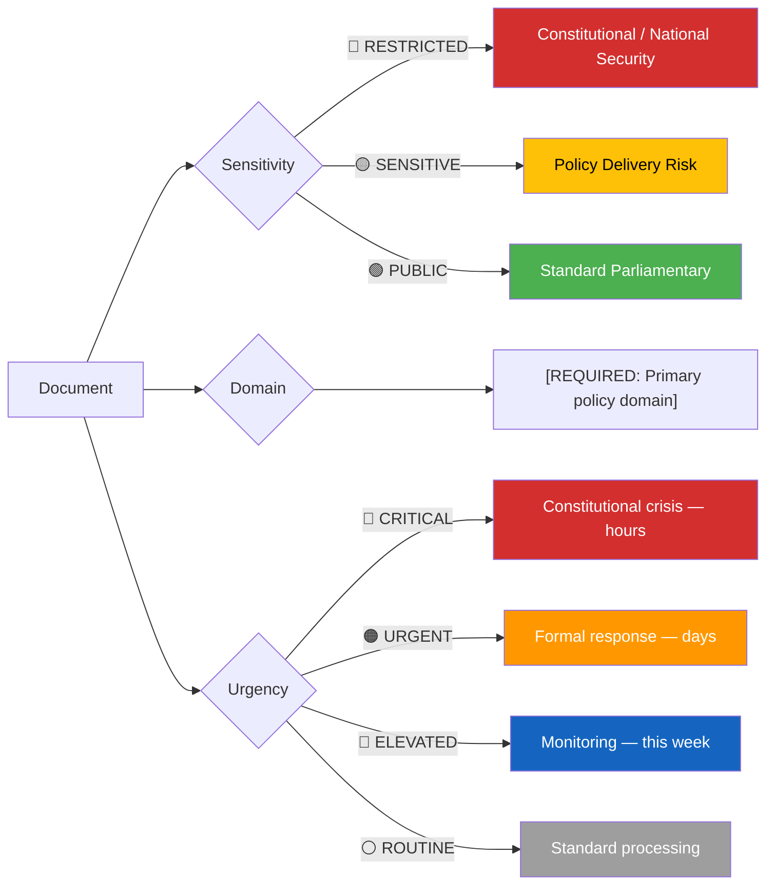
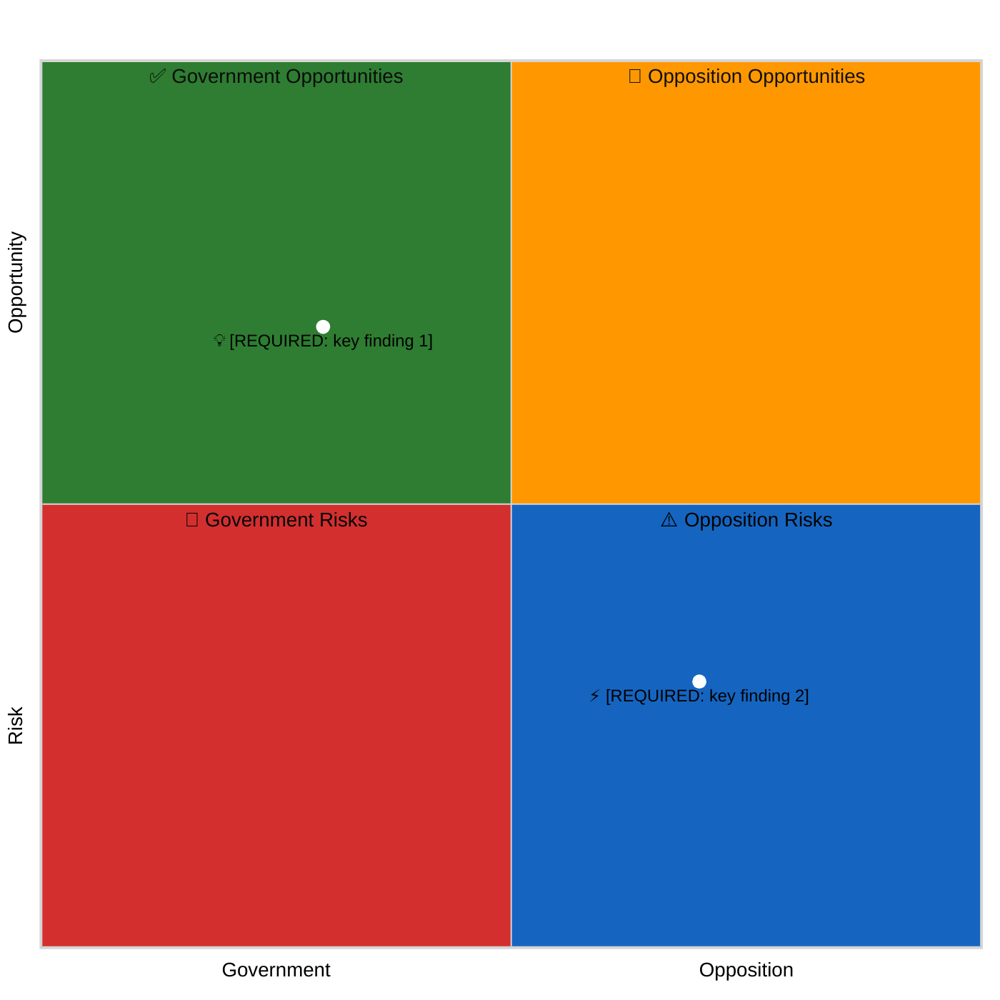
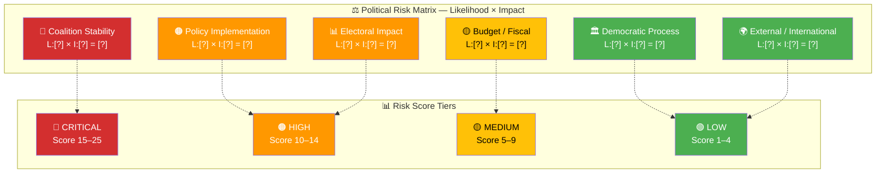
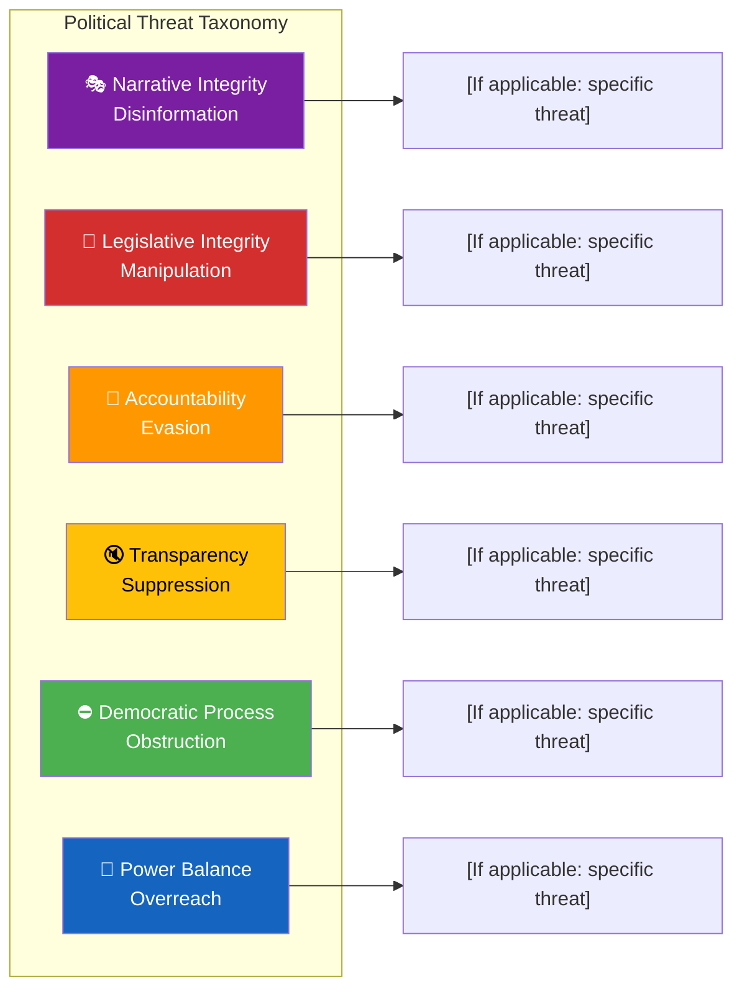
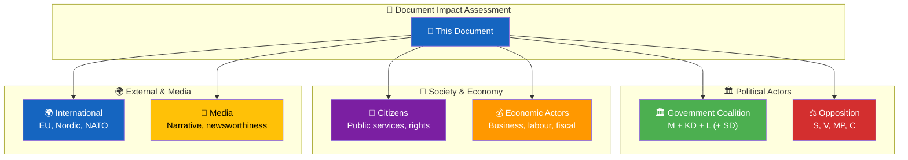

<p align="center">
  
</p>

<h1 align="center">🔍 Per-File Political Intelligence Analysis Template</h1>

<p align="center">
  <strong>📊 Deep AI-Driven Multi-Framework Analysis for Individual Parliamentary Documents</strong><br>
  <em>🎯 SWOT · Risk · Attack Trees · Kill Chain · Stakeholder · Strategic Implications</em>
</p>

<p align="center">
  <a href="#"></a>
  <a href="#"></a>
  <a href="#"></a>
  <a href="#"></a>
</p>

**📋 Document Owner:** CEO | **📄 Version:** 2.5 | **📅 Last Updated:** 2026-04-25 (UTC)  
**🏢 Owner:** Hack23 AB (Org.nr 5595347807) | **🏷️ Classification:** Public

> **📌 Template Instructions:** This template is for **per-file** analysis. For each data file downloaded via MCP, the AI agent produces one analysis markdown file stored as `{id}-analysis.md` in the workflow's isolated folder. AI MUST read `analysis/methodologies/ai-driven-analysis-guide.md` (v5.0) before analyzing; consult other methodology guides only when needed for the current analysis step.
>
> **Output path:** `analysis/daily/YYYY-MM-DD/{articleType}/documents/{dok_id}-analysis.md`
>
> **The AI agent performs ALL analysis.** Scripts download data; AI reads methodologies; AI produces genuine intelligence analysis based on the actual content of each document.

> **🚨 Anti-Pattern Warning:** The following patterns indicate scripted/shallow content and are REJECTED:
> - `"_No strengths identified_"` or `"_No weaknesses identified_"` — empty SWOT quadrants
> - `"this document requires assessment of policy execution"` — generic boilerplate
> - `"this document warrants scrutiny for alignment with citizen welfare"` — template filler
> - Any analysis that could be written WITHOUT reading the actual document data
> - Analysis with 0 cross-references to other documents or MCP data
> - Analysis with 0 named politicians/parties
> - Analysis that merely restates the document title as a "finding"
>
> **MUST include:** ≥3 evidence points with dok_id, ≥1 color-coded Mermaid diagram (classification tree, risk matrix, stakeholder map, or threat taxonomy — at least one is MANDATORY), multi-framework analysis (SWOT + at least one of: Risk, Attack Tree, Kill Chain), named actors with party affiliations, forward indicators.


---

<!-- TEMPLATE_CONTRACT_V1 -->
> **📐 Template Contract** — every fill of this template MUST satisfy this row.
>
> | Slot | Value |
> |------|-------|
> | **Owning methodology** | [`per-document-methodology.md`](../methodologies/per-document-methodology.md) |
> | **Owning gate check** | Check 2 (per-doc coverage) — see [`05-analysis-gate.md`](../../.github/prompts/05-analysis-gate.md) |
> | **Required inputs** | `get_dokument` for one `dok_id` |
> | **Horizon band** | per-doc (per [`scripts/horizon-context.ts`](../../scripts/horizon-context.ts)) |
> | **Output family** | Family E — Per-Document |
> | **Aggregation order** | appended (alphabetical, after canonical block) (see [`scripts/render-lib/aggregator/order.ts`](../../scripts/render-lib/aggregator/order.ts)) |
> | **Reader Intelligence Guide** | row generated from `documents/{dok_id}-analysis.md` (see [`scripts/render-lib/aggregator/reader-guide.ts`](../../scripts/render-lib/aggregator/reader-guide.ts)) |
> | **Canonical evidence anchor** | `\| claim \| evidence (dok_id / vote / MP) \| retrieved_at \| confidence \|` — every analytical claim row uses this schema. |
>
> Cross-reference: [`README.md §Template ↔ Methodology ↔ Gate-Check Matrix`](README.md#-template--methodology--gate-check-matrix).

<!--
AI-FIRST Pass-1 / Pass-2 self-check (HTML comment — invisible in rendered articles; not stripped by aggregator unless under a "## Pass 2 …" heading).

PASS 1 (creation, minimal viable artifact):
  • Fill every REQUIRED slot above; cite ≥ 1 dok_id / vote / MP / primary-source URL per major claim.
  • Use the canonical evidence anchor schema for every analytical claim row.
  • Mermaid blocks use the cyberpunk %%{init: theme/themeVariables}%% prologue and at least one `style …` or `classDef …` directive (Check 5 of 05-analysis-gate.md).

PASS 2 (read-back & improve — AI-FIRST mandatory, ≥ 180 s after Pass 1):
  • Re-read the file end-to-end; for each section verify (a) ≥ 1 evidence anchor row, (b) WEP language tightened (no "may/might/could" hedges), (c) named actors with intressent_id where applicable, (d) Mermaid colour theming present.
  • Banned-phrase scan: "intelligence theatre", "sources say", "reportedly", "it is widely believed", "experts agree", "AI_MUST_REPLACE".
  • Citation density target: ≥ 1 evidence anchor row per 100 words of analytical prose.
  • Neutrality arithmetic: equal analytical depth across the 8 Riksdag parties (S, M, SD, V, MP, C, L, KD); flag and correct any bias in the Pass-2 Self-Audit section.

ANTI-TEMPLATE — DO NOT:
  • Ship plain prose without evidence anchor tables.
  • Leave AI_MUST_REPLACE / [REQUIRED: …] placeholders in the rendered output.
  • Cite a non-primary URL when a `dok_id` or vote record is available.
  • Treat co-occurrence of keywords as coordination; uni-directional chains as bi-directional.
  • Use a Mermaid block without colour theming (Check 5 will block aggregation).
  • Skip the Pass-2 read-back (Check 6 verifies mtime ≥ birth + 180 s OR a differing pass1/ snapshot).
-->

## 🔄 Tradecraft Context

| Element | Value |
|---------|-------|
| **F3EAD Stage** | **FIND / FIX / FINISH** — locate the document in the corpus, classify it across 7 dimensions, and produce the atomic per-document intelligence record that Family A synthesis builds on. |
| **PIRs Served** | `[REQUIRED: list addressed PIRs from PIR-1..PIR-7]` — at minimum PIR-3 (party-position drift) plus the PIR matching the document's policy domain (defence → PIR-7, fiscal → PIR-6, institutional → PIR-5, election-adjacent → PIR-4). |
| **Admiralty Floor** | **A1** for the dok_id itself (parliamentary primary source); **B2** floor for analytic inferences derived from it; F6 not permitted. |
| **WEP + ODNI** | Classification claims use deterministic language ("the proposition states X" / "the committee voted Y–Z"); forward-looking implications use **WEP** terms (`likely`, `about even`, `unlikely`) paired with 5-level confidence per [`political-style-guide.md`](../methodologies/political-style-guide.md#-words-of-estimative-probability-wep--odni-confidence-overlay). |
| **Source Diversity Floor** | ≥1 primary (the document) + ≥1 corroborating secondary source for every P0/P1 implication; single-source implications must carry `[unconfirmed]` and ≤ MEDIUM confidence. |
| **SAT(s) Applied** | Quality of Information Check; Structured Brainstorming; Key Assumptions Check; Cross-Impact Analysis (against same-day documents). |
| **ICD 203 Standards** | 1 (objectivity), 2 (independent), 3 (timeliness), 5 (sourcing), 6 (logical argumentation), 7 (uncertainty), 8 (analytic value), 9 (alternative analysis). |

> See [`osint-tradecraft-standards.md`](../methodologies/osint-tradecraft-standards.md) for canonical F3EAD / PIR catalogue / Admiralty Code / WEP / SAT / ICD 203 definitions, and [`political-style-guide.md`](../methodologies/political-style-guide.md) for tone, evidence-citation, and confidence-labelling conventions.

---

## 📋 Document Identity

| Field | Value |
|-------|-------|
| **Document ID** | `[REQUIRED: dok_id or file identifier]` |
| **Document Type** | `[REQUIRED: propositions / motions / committeeReports / votes / speeches / questions / interpellations / government / worldbank / scb]` |
| **Title** | `[REQUIRED: document title or descriptor]` |
| **Date** | `[REQUIRED: document date or fetch date]` |
| **Riksmöte** | `[REQUIRED if parliamentary: e.g. 2025/26]` |
| **Source MCP Tool** | `[REQUIRED: e.g. search_dokument, get_propositioner]` |
| **Analysis Timestamp** | `[REQUIRED: YYYY-MM-DD HH:MM UTC]` |
| **Analyst** | `[REQUIRED: workflow name, e.g. news-evening-analysis]` |
| **Data Depth** | `[REQUIRED: FULL-TEXT / SUMMARY / METADATA-ONLY — see ai-driven-analysis-guide.md §Data Availability Prerequisites]` |

---

## 🎯 Executive Summary

`[REQUIRED: 3–5 sentences capturing the political significance. Intelligence-level analysis — not just what happened, but what it means for power dynamics, coalition stability, and democratic accountability. Include confidence label.]` **[VERY HIGH/HIGH/MEDIUM/LOW/VERY LOW]**

> ⚠️ **Confidence Ceiling Rule**: If `Data Depth` above is `METADATA-ONLY`, confidence MUST be `LOW` or `VERY LOW`. If `SUMMARY`, max is `MEDIUM`. Only `FULL-TEXT` documents may claim `HIGH` or `VERY HIGH`. See `ai-driven-analysis-guide.md` §Data Availability Prerequisites.

---

## 📖 Narrative (v3.2 — required for L2-Strategic+ depth tier)

> **When required:** this subsection is **mandatory** when the document's DIW score places it at L2-Strategic, L2+ Priority, or L3 Intelligence-grade depth. For L1-Surface and clustered low-weight items it is **optional**. Apply [`political-style-guide.md` §"Narrative-Voice Standards"](../methodologies/political-style-guide.md#-narrative-voice-standards-v32--new). The Family A `synthesis-summary.md` and `executive-brief.md` will pull from this subsection when this document is the day's #1 or #2 ranked finding.

**Lede paragraph** *(80–140 words, one canonical lede pattern)*

> `[REQUIRED for ≥ L2 — pick: hard-news / tension-contrast / scene-setting / significance-first.]`

**Body** *(1–2 paragraphs, total 200–400 words)*

> `[REQUIRED for ≥ L2 — name three actors (sponsor / opponent / pivotal third) by word 200 with role + party + verb. Vary sentence cadence. Include ≥ 1 concrete sensory detail (committee room, time, exact phrasing of an interjection, page count of the tabled report). Tradecraft jargon must pay back within 2 sentences.]`

**Counter-narrative** *(40–100 words, signposted)*

> *"There is a contrary read."* `[REQUIRED for ≥ L2 — named source whose framing of these same documents is genuinely different.]`

---

## 📊 Political Classification



| Field | Assessment |
|-------|-----------|
| **Sensitivity Level** | `[REQUIRED: PUBLIC / SENSITIVE / RESTRICTED]` |
| **Primary Domain** | `[REQUIRED: e.g. Migration (MIG), Defence (DEF), Economy (ECO), Climate (ENV), Justice (JUS), Health (HEA), Education (EDU), Foreign Affairs (FOR)]` |
| **Urgency** | `[REQUIRED: ROUTINE / ELEVATED / URGENT / CRITICAL]` |
| **Significance Score** | `[REQUIRED: 0–10]` |
| **Confidence** | `[REQUIRED: VERY HIGH / HIGH / MEDIUM / LOW / VERY LOW]` |

---

## 💪 SWOT Impact Assessment

> *How does this document affect the political landscape? Each entry requires evidence.*

### Quadrant Overview



### Government Coalition Impact

| Quadrant | Statement | Evidence | Confidence | Impact |
|----------|-----------|----------|:----------:|:------:|
| ✅ Strength | `[If this document strengthens the government position — specific claim]` | `[dok_id or evidence]` | `VH/H/M/L/VL` | `VH/H/M/L/VL` |
| ⚠️ Weakness | `[If this document exposes a government vulnerability]` | `[dok_id or evidence]` | `VH/H/M/L/VL` | `VH/H/M/L/VL` |
| 🚀 Opportunity | `[If this creates a government opportunity]` | `[dok_id or evidence]` | `VH/H/M/L/VL` | `VH/H/M/L/VL` |
| 🔴 Threat | `[If this poses a threat to the government]` | `[dok_id or evidence]` | `VH/H/M/L/VL` | `VH/H/M/L/VL` |

### Opposition Impact

| Quadrant | Statement | Evidence | Confidence | Impact |
|----------|-----------|----------|:----------:|:------:|
| ✅ Strength | `[If this strengthens the opposition]` | `[dok_id or evidence]` | `VH/H/M/L/VL` | `VH/H/M/L/VL` |
| ⚠️ Weakness | `[If this exposes an opposition vulnerability]` | `[dok_id or evidence]` | `VH/H/M/L/VL` | `VH/H/M/L/VL` |
| 🚀 Opportunity | `[If this creates an opposition opportunity]` | `[dok_id or evidence]` | `VH/H/M/L/VL` | `VH/H/M/L/VL` |
| 🔴 Threat | `[If this poses a threat to the opposition]` | `[dok_id or evidence]` | `VH/H/M/L/VL` | `VH/H/M/L/VL` |

---

## ⚖️ Risk Assessment



> **Scoring Reference:** Risk Score = Likelihood × Impact (product, not sum). Both are scored 1–5, giving a range of 1–25. Score tiers: 1–4 🟢 Low, 5–9 🟡 Medium, 10–14 🟠 High, 15–25 🔴 Critical. See [political-risk-methodology.md](../methodologies/political-risk-methodology.md) for calibration examples.
> 
> **⚠️ AI Instructions:** Replace ALL `[?]` placeholders with actual numbers derived from the document data. The Mermaid diagram above is a TEMPLATE — when you fill it in, the node labels should show real scores like `"🔴 Coalition Stability<br/>L:2 × I:3 = 6"` and the dotted arrows should point to the correct tier.

| Risk Type | Likelihood (1–5) | Impact (1–5) | Score | Assessment |
|-----------|:-----------------:|:------------:|:-----:|------------|
| Coalition Stability | `[1-5]` | `[1-5]` | `[L×I]` | `[REQUIRED: specific risk statement]` |
| Policy Implementation | `[1-5]` | `[1-5]` | `[L×I]` | `[REQUIRED: specific risk statement]` |
| Budget / Fiscal | `[1-5]` | `[1-5]` | `[L×I]` | `[REQUIRED: specific risk statement]` |
| Electoral Impact | `[1-5]` | `[1-5]` | `[L×I]` | `[REQUIRED: specific risk statement]` |
| Democratic Process | `[1-5]` | `[1-5]` | `[L×I]` | `[REQUIRED: specific risk statement]` |
| External / International | `[1-5]` | `[1-5]` | `[L×I]` | `[OPTIONAL: EU, NATO, Nordic impact]` |

**Overall Risk Level:** `[REQUIRED: CRITICAL / HIGH / MEDIUM / LOW / NEGLIGIBLE]`  
**Risk-to-SWOT:** Any score ≥15 → add as SWOT Threat entry. Any score 10–14 → add as SWOT Weakness or Threat.

### Anomaly Flags

`[List any detected anomalies — unusual voting patterns, unexpected coalition breaks, procedural irregularities]`

---

## 🎭 Threat Analysis (Political Threat Taxonomy)

> *Political threats mapped to the 6 democratic function categories. Severity: 1=Negligible, 2=Minor, 3=Moderate, 4=Major, 5=Severe. See [political-threat-framework.md](../methodologies/political-threat-framework.md) for full calibration table.*



| Threat Category | Applicable? | Threat Description | Severity (1–5) | Evidence |
|----------------|:-----------:|-------------------|:--------------:|----------|
| 🎭 Narrative Integrity | `[Y/N]` | `[Disinformation, false framing, misleading rhetoric]` | `[1-5]` | `[dok_id]` |
| 📝 Legislative Integrity | `[Y/N]` | `[Policy corruption, undisclosed lobbying, manipulation]` | `[1-5]` | `[dok_id]` |
| 🚫 Accountability | `[Y/N]` | `[Oversight evasion, KU obstruction, blame-shifting]` | `[1-5]` | `[dok_id]` |
| 🔇 Transparency | `[Y/N]` | `[Information suppression, FOI obstruction, secrecy]` | `[1-5]` | `[dok_id]` |
| ⛔ Democratic Process | `[Y/N]` | `[Parliamentary obstruction, filibuster, quorum games]` | `[1-5]` | `[dok_id]` |
| 👑 Power Balance | `[Y/N]` | `[Executive overreach, bypassing parliament, concentration]` | `[1-5]` | `[dok_id]` |

---

## 👥 Stakeholder Impact Matrix

> *Six analytical lenses applied to this document. The AI must assess each stakeholder based on actual document content.*



| Stakeholder | Impact Level | Key Assessment | Confidence |
|------------|:------------:|----------------|:----------:|
| 🏛️ Government | `[HIGH/MEDIUM/LOW/NONE]` | `[REQUIRED: How does this affect government's position, agenda, and coalition stability?]` | `[VH/H/M/L/VL]` |
| ⚖️ Opposition | `[HIGH/MEDIUM/LOW/NONE]` | `[REQUIRED: How does this create opportunities or challenges for opposition parties?]` | `[VH/H/M/L/VL]` |
| 👥 Citizens | `[HIGH/MEDIUM/LOW/NONE]` | `[REQUIRED: How does this affect public services, rights, daily life?]` | `[VH/H/M/L/VL]` |
| 💰 Economic | `[HIGH/MEDIUM/LOW/NONE]` | `[REQUIRED: Fiscal impact, business implications, labour market effects?]` | `[VH/H/M/L/VL]` |
| 🌍 International | `[HIGH/MEDIUM/LOW/NONE]` | `[REQUIRED: EU compliance, Nordic cooperation, foreign relations?]` | `[VH/H/M/L/VL]` |
| 📰 Media | `[HIGH/MEDIUM/LOW/NONE]` | `[REQUIRED: Newsworthiness, narrative potential, public attention?]` | `[VH/H/M/L/VL]` |

---

## 🗳️ Election 2026 Implications

| Dimension | Assessment | Evidence |
|-----------|------------|----------|
| **Electoral Impact** | `[REQUIRED: How does this document affect September 2026 election positioning?]` | `[Specific evidence from document]` |
| **Coalition Scenarios** | `[REQUIRED: Which coalition configurations benefit/suffer from this policy?]` | `[Evidence]` |
| **Voter Salience** | `[REQUIRED: Which voter segments are most affected? By how much?]` | `[Evidence]` |
| **Campaign Vulnerability** | `[REQUIRED: Does this create campaign attack vectors for opposition?]` | `[Evidence]` |
| **Policy Legacy** | `[REQUIRED: Will this become an electoral asset or liability by Sept 2026?]` | `[Evidence]` |

**Overall Electoral Significance**: `[REQUIRED: CRITICAL/HIGH/MODERATE/LOW/NEGLIGIBLE]`

**Most Likely Narrative**: `[REQUIRED: How will this be framed in the 2026 campaign?]`

---

## 🔮 Forward Indicators

> *What to monitor as a consequence of this document.*

| # | Indicator | Timeline | Trigger Condition | Watch Priority |
|---|-----------|----------|-------------------|:--------------:|
| 1 | `[REQUIRED: specific future event or metric to monitor]` | `[days/weeks/months]` | `[what would trigger escalation]` | `🔴/🟠/🟡/🟢` |
| 2 | `[REQUIRED]` | `[timeline]` | `[trigger]` | `🔴/🟠/🟡/🟢` |
| 3 | `[OPTIONAL]` | `[timeline]` | `[trigger]` | `🔴/🟠/🟡/🟢` |

---

## 🔗 Cross-References

| Related Document | Relationship | dok_id |
|-----------------|-------------|--------|
| `[If related documents exist]` | `[supports / contradicts / amends / supersedes / responds-to]` | `[dok_id]` |

### Same-Day Document Cross-Reference Table

> **AI Instructions:** List all other documents analyzed on the same day for the same article type. This enables cross-document pattern detection.

| # | dok_id | Title | Document Type | Significance | Key Connection to This Document |
|:-:|--------|-------|--------------|:-----------:|-------------------------------|
| 1 | `[OPTIONAL: another same-day dok_id]` | `[title]` | `[type]` | `[score]` | `[How does it relate?]` |
| 2 | `[OPTIONAL]` | `[title]` | `[type]` | `[score]` | `[relationship]` |

### Hack23 Ecosystem Cross-Reference

> **AI Instructions:** When CIA platform data is available, cross-reference this document analysis with relevant CIA intelligence products (risk summaries, party analyses, election forecasts, etc.).

| CIA Product | Data Point | Relevance to This Document |
|-------------|-----------|---------------------------|
| `[OPTIONAL: e.g. cia-data/exports/risk-summary.json]` | `[e.g. Coalition stability score: 62%]` | `[How this document analysis relates to CIA data]` |
| `[OPTIONAL: e.g. cia-data/exports/party-metrics.json]` | `[e.g. SD voting discipline: 94%]` | `[relevance]` |

---

## 📊 Data Quality Assessment

| Metric | Value |
|--------|-------|
| **Source Completeness** | `[REQUIRED: Full text / Metadata only / Summary only]` |
| **Evidence Density** | `[REQUIRED: N evidence points cited]` |
| **Temporal Currency** | `[REQUIRED: Current / Recent (30d) / Dated (90d) / Stale (180d+)]` |
| **Analytical Confidence** | `[REQUIRED: VERY HIGH / HIGH / MEDIUM / LOW / VERY LOW]` |

---

## 📂 MCP Data Files Used

> *List all data files from the analysis pipeline that were consulted to produce this analysis. This enables reproducibility and audit trails.*

`[REQUIRED: List all analysis/daily/YYYY-MM-DD/{articleType}/data/ files consulted for this analysis]`

| # | File Path | Source MCP Tool | Data Type | Freshness |
|---|-----------|----------------|-----------|:---------:|
| 1 | `[REQUIRED: e.g. analysis/daily/2026-03-30/propositions/data/H901FiU1.json]` | `[e.g. get_dokument]` | `[e.g. proposition / motion / vote]` | `[Current / Cached]` |
| 2 | `[REQUIRED: additional data file]` | `[MCP tool]` | `[data type]` | `[freshness]` |
| 3 | `[OPTIONAL: additional data file]` | `[MCP tool]` | `[data type]` | `[freshness]` |

---

## ✅ Quality Self-Check Checklist

> **Pre-commit validation — every item MUST be checked before finalising this per-file analysis.**

- [ ] **Document Identity complete:** dok_id, type, title, date, riksmöte, MCP source, timestamp, analyst all filled
- [ ] **Executive Summary written:** 3–5 sentences of intelligence-level analysis (not document summary) with confidence label
- [ ] **≥1 Mermaid diagram rendered:** At least one color-coded Mermaid diagram present (classification, risk, stakeholder, or threat)
- [ ] **SWOT Impact Assessment filled:** At least 2 quadrants (S/W/O/T) have evidence-backed entries for government or opposition
- [ ] **Risk Assessment scored:** All 5 political risk dimensions (Coalition, Policy, Budget, Electoral, External) have L×I scores (not `[?]` placeholders)
- [ ] **≥3 evidence points:** At least 3 claims cite specific dok_ids or named evidence sources
- [ ] **Named actors:** ≥2 named politicians/parties with party affiliations cited
- [ ] **Forward Indicators present:** ≥2 forward indicators with timelines and watch priorities
- [ ] **Data Quality Assessment filled:** Source completeness, evidence density, temporal currency, confidence all assessed
- [ ] **MCP Data Files listed:** All consulted data files recorded with source MCP tool and freshness
- [ ] **No placeholder text remaining:** Search for `[REQUIRED` — zero hits expected
- [ ] **No anti-pattern content:** No "No strengths identified", no generic boilerplate, no title-only restatements
- [ ] **Election 2026 Implications present:** All 5 dimensions assessed (Electoral Impact, Coalition Scenarios, Voter Salience, Campaign Vulnerability, Policy Legacy)
- [ ] **5-level confidence applied:** Confidence fields use VERY HIGH/HIGH/MEDIUM/LOW/VERY LOW scale
- [ ] **Cross-references linked:** Related documents and same-day cross-references populated

---

**Document Control:**  
- **Template Path:** `/analysis/templates/per-file-political-intelligence.md`  
- **Output Path:** `analysis/daily/YYYY-MM-DD/{articleType}/documents/{dok_id}-analysis.md`  
- **Version:** 2.5  
- **Effective Date:** 2026-04-25 (UTC)  
- **Key Changes v2.3:** Added Election 2026 Implications section, 5-level confidence scale (VERY HIGH/HIGH/MEDIUM/LOW/VERY LOW) replacing binary H/M/L, improved differentiated per-document insights  
- **Frameworks:** SWOT, Risk, Attack Trees, Kill Chain, Diamond Model, Stakeholder  
- **Framework References:** [SWOT.md](../../SWOT.md), [THREAT_MODEL.md](../../THREAT_MODEL.md)  
- **Methodology:** [ai-driven-analysis-guide.md](../methodologies/ai-driven-analysis-guide.md)  
- **ISMS Alignment:** ISO 27001:2022 A.5.7 (Threat Intelligence), NIST CSF 2.0 ID.RA (Risk Assessment)  
- **Classification:** Public  
- **Owner:** Hack23 AB (Org.nr 5595347807)  
- **Next Review:** 2026-06-30

---

## ✅ Pass-2 Self-Audit Checklist (v4.4 — required)

> **Purpose:** AI-FIRST principle requires a Pass-2 read-back-and-improve. After producing this artifact in Pass 1, re-read it end-to-end and verify each item below. Document any remediation in [`methodology-reflection.md`](methodology-reflection.md) §"Pass-2 audit log". Any unchecked ❌ box at the end of Pass 2 forces a Pass-3 rewrite of the affected section.

- [ ] **Tradecraft anchors honoured** — F3EAD stage matches the artifact's role; PIRs declared in the §Tradecraft Context block are actually addressed in the body; Admiralty grades attached to every external source; WEP band + ODNI confidence on every probabilistic judgement.
- [ ] **Source diversity floor met** — at least the minimum number of independent MCP sources required by the artifact's tradecraft block are cited; single-source claims are explicitly labelled `[SINGLE-SOURCE — corroboration pending]`.
- [ ] **Evidence specificity** — every quantified claim cites a `dok_id` (Riksdag), an SCB / IMF dataflow code, or a named external source with date; no "according to data" / "studies show" hand-waves.
- [ ] **Named-actor discipline** — every political claim names ≥ 1 person (party + role + dated act/quote) or labels the absence (`[diffuse — no named actor]`).
- [ ] **Counter-narrative present** — at least one explicit competing hypothesis, dissent quote, or framed objection appears in the body; "no opposition recorded" is itself a finding to label, not silence.
- [ ] **Election 2026 lens applied** — the §"Election 2026 Implications" subsection (or equivalent) addresses electoral salience, coalition pressure, and forward indicators; not boilerplate.
- [ ] **No illustrative content shipped as fact** — every `[REQUIRED]` placeholder is filled OR removed; every `Example:` block is clearly fenced or removed; no fabricated `dok_id`, vote count, or quote leaks into the final artifact.
- [ ] **Cross-references resolve** — every `[link](file.md)` in this artifact points to a file that exists in the run folder (`analysis/daily/$ARTICLE_DATE/$SUBFOLDER/`) or to a methodology / template under `analysis/`.
- [ ] **Mermaid renders** — every fenced ` ```mermaid ` block parses (no missing class definitions, no orphan nodes, no >40-node graphs that overflow viewport on mobile).
- [ ] **Line-floor check** — artifact length ≥ the per-artifact floor in [`reference-quality-thresholds.json`](../methodologies/reference-quality-thresholds.json); shorter artifacts trigger Pass-2 rewrite, never a `[truncated]` note.

