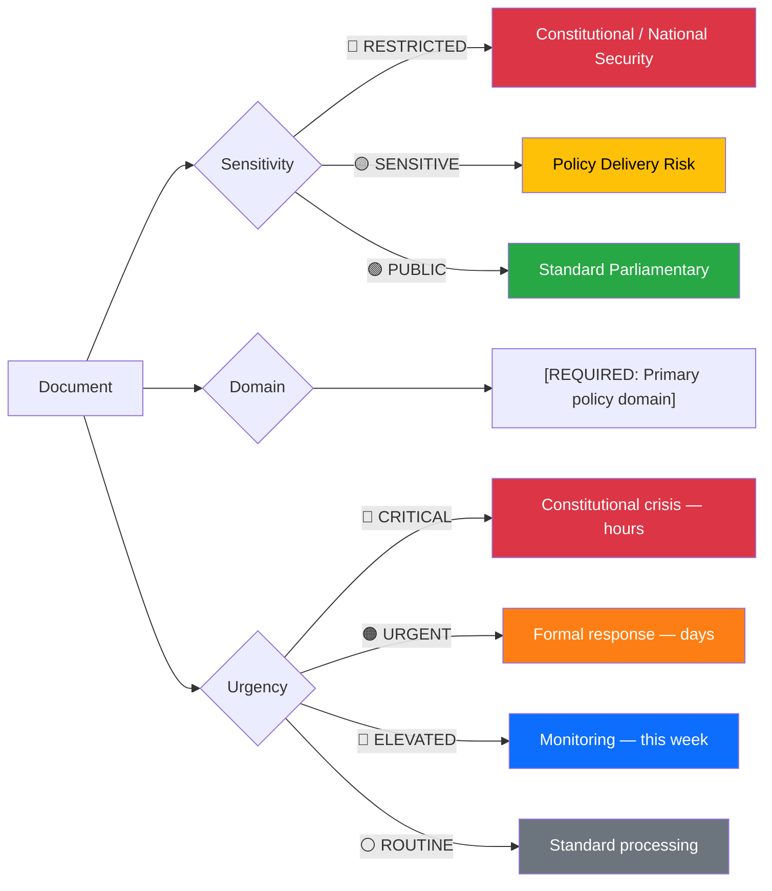
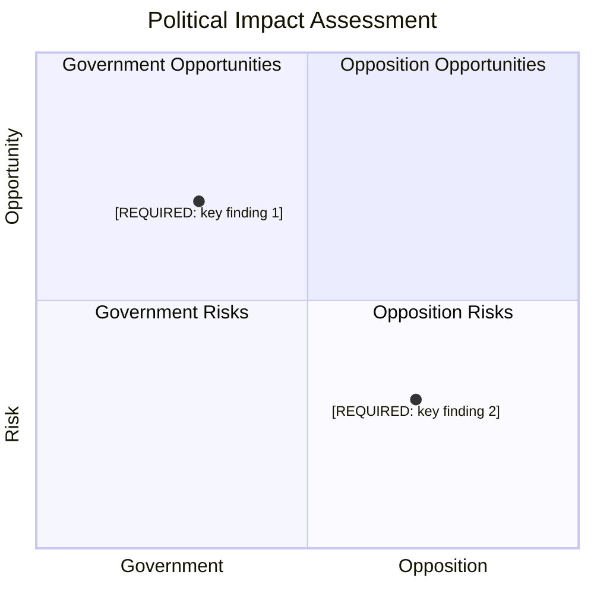
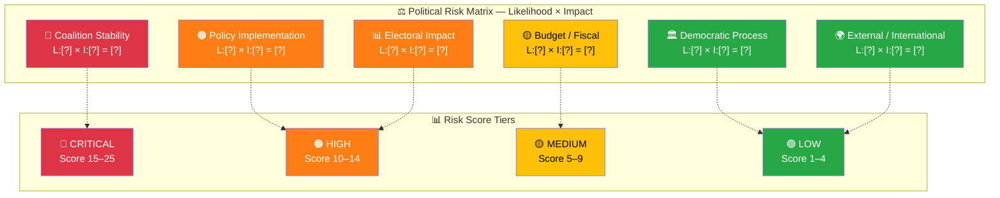
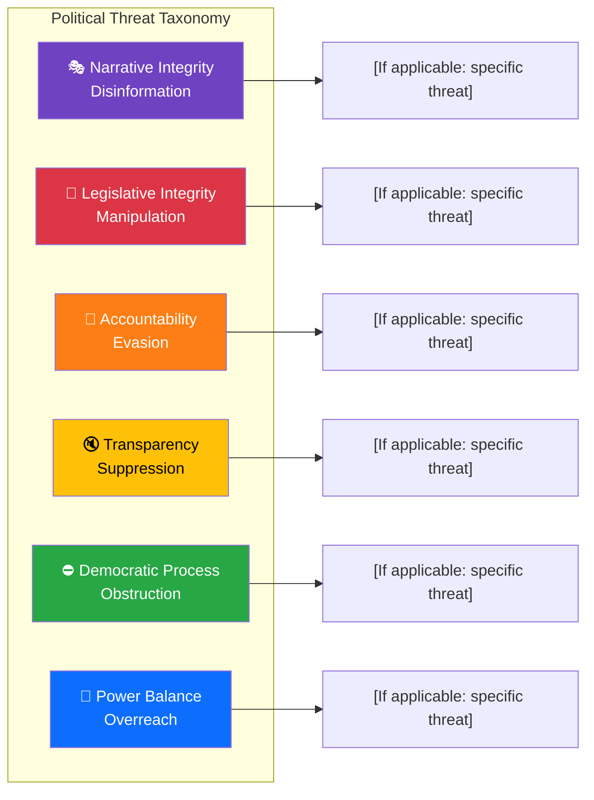
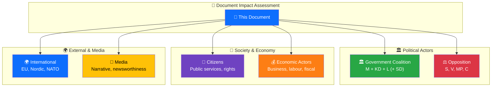

  

<h1 align="center">🔍 Per-File Political Intelligence Analysis Template</h1>

  <strong>📊 Deep AI-Driven Multi-Framework Analysis for Individual Parliamentary Documents</strong> 
  <em>🎯 SWOT · Risk · Attack Trees · Kill Chain · Stakeholder · Strategic Implications</em>

  
  
  
  

**📋 Document Owner:** CEO | **📄 Version:** 2.0 | **📅 Last Updated:** 2026-03-30 (UTC)  
**🏢 Owner:** Hack23 AB (Org.nr 5595347807) | **🏷️ Classification:** Public

> **📌 Template Instructions:** This template is for **per-file** analysis. For each data file downloaded via MCP, the AI agent produces one analysis markdown file stored as `{id}-analysis.md` in the workflow's isolated folder. AI MUST read ALL 6 methodology guides before analyzing.
>
> **Output path:** `analysis/daily/YYYY-MM-DD/{articleType}/documents/{dok_id}-analysis.md`
>
> **The AI agent performs ALL analysis.** Scripts download data; AI reads methodologies; AI produces genuine intelligence analysis based on the actual content of each document.

> **🚨 Anti-Pattern Warning:** The following patterns indicate scripted/shallow content and are REJECTED:
> - `"_No strengths identified_"` or `"_No weaknesses identified_"` — empty SWOT quadrants
> - `"this document requires assessment of policy execution"` — generic boilerplate
> - `"this document warrants scrutiny for alignment with citizen welfare"` — template filler
> - Any analysis that could be written WITHOUT reading the actual document data
> - Analysis with 0 cross-references to other documents or MCP data
> - Analysis with 0 named politicians/parties
> - Analysis that merely restates the document title as a "finding"
>
> **MUST include:** ≥3 evidence points with dok_id, ≥1 color-coded Mermaid diagram, multi-framework analysis (SWOT + at least one of: Risk, Attack Tree, Kill Chain), named actors with party affiliations, forward indicators.

---

## 📋 Document Identity

| Field | Value |
|-------|-------|
| **Document ID** | `[REQUIRED: dok_id or file identifier]` |
| **Document Type** | `[REQUIRED: propositions / motions / committeeReports / votes / speeches / questions / interpellations / government / worldbank / scb]` |
| **Title** | `[REQUIRED: document title or descriptor]` |
| **Date** | `[REQUIRED: document date or fetch date]` |
| **Riksmöte** | `[REQUIRED if parliamentary: e.g. 2025/26]` |
| **Source MCP Tool** | `[REQUIRED: e.g. search_dokument, get_propositioner]` |
| **Analysis Timestamp** | `[REQUIRED: YYYY-MM-DD HH:MM UTC]` |
| **Analyst** | `[REQUIRED: workflow name, e.g. news-evening-analysis]` |

---

## 🎯 Executive Summary

`[REQUIRED: 3–5 sentences capturing the political significance. Intelligence-level analysis — not just what happened, but what it means for power dynamics, coalition stability, and democratic accountability. Include confidence label.]` **[HIGH/MEDIUM/LOW]**

---

## 📊 Political Classification

| Field | Assessment |
|-------|-----------|
| **Sensitivity Level** | `[REQUIRED: PUBLIC / SENSITIVE / RESTRICTED]` |
| **Primary Domain** | `[REQUIRED: e.g. Migration (MIG), Defence (DEF), Economy (ECO), Climate (ENV), Justice (JUS), Health (HEA), Education (EDU), Foreign Affairs (FOR)]` |
| **Urgency** | `[REQUIRED: ROUTINE / ELEVATED / URGENT / CRITICAL]` |
| **Significance Score** | `[REQUIRED: 0–10]` |
| **Confidence** | `[REQUIRED: HIGH / MEDIUM / LOW]` |

---

## 💪 SWOT Impact Assessment

> *How does this document affect the political landscape? Each entry requires evidence.*

### Quadrant Overview

### Government Coalition Impact

| Quadrant | Statement | Evidence | Confidence | Impact |
|----------|-----------|----------|:----------:|:------:|
| ✅ Strength | `[If this document strengthens the government position — specific claim]` | `[dok_id or evidence]` | `H/M/L` | `H/M/L` |
| ⚠️ Weakness | `[If this document exposes a government vulnerability]` | `[dok_id or evidence]` | `H/M/L` | `H/M/L` |
| 🚀 Opportunity | `[If this creates a government opportunity]` | `[dok_id or evidence]` | `H/M/L` | `H/M/L` |
| 🔴 Threat | `[If this poses a threat to the government]` | `[dok_id or evidence]` | `H/M/L` | `H/M/L` |

### Opposition Impact

| Quadrant | Statement | Evidence | Confidence | Impact |
|----------|-----------|----------|:----------:|:------:|
| ✅ Strength | `[If this strengthens the opposition]` | `[dok_id or evidence]` | `H/M/L` | `H/M/L` |
| ⚠️ Weakness | `[If this exposes an opposition vulnerability]` | `[dok_id or evidence]` | `H/M/L` | `H/M/L` |
| 🚀 Opportunity | `[If this creates an opposition opportunity]` | `[dok_id or evidence]` | `H/M/L` | `H/M/L` |
| 🔴 Threat | `[If this poses a threat to the opposition]` | `[dok_id or evidence]` | `H/M/L` | `H/M/L` |

---

## ⚖️ Risk Assessment

> **Scoring Reference:** Risk Score = Likelihood × Impact (product, not sum). Both are scored 1–5, giving a range of 1–25. Score tiers: 1–4 🟢 Low, 5–9 🟡 Medium, 10–14 🟠 High, 15–25 🔴 Critical. See [political-risk-methodology.md](../methodologies/political-risk-methodology.md) for calibration examples.
> 
> **⚠️ AI Instructions:** Replace ALL `[?]` placeholders with actual numbers derived from the document data. The Mermaid diagram above is a TEMPLATE — when you fill it in, the node labels should show real scores like `"🔴 Coalition Stability L:2 × I:3 = 6"` and the dotted arrows should point to the correct tier.

| Risk Type | Likelihood (1–5) | Impact (1–5) | Score | Assessment |
|-----------|:-----------------:|:------------:|:-----:|------------|
| Coalition Stability | `[1-5]` | `[1-5]` | `[L×I]` | `[REQUIRED: specific risk statement]` |
| Policy Implementation | `[1-5]` | `[1-5]` | `[L×I]` | `[REQUIRED: specific risk statement]` |
| Budget / Fiscal | `[1-5]` | `[1-5]` | `[L×I]` | `[REQUIRED: specific risk statement]` |
| Electoral Impact | `[1-5]` | `[1-5]` | `[L×I]` | `[REQUIRED: specific risk statement]` |
| Democratic Process | `[1-5]` | `[1-5]` | `[L×I]` | `[REQUIRED: specific risk statement]` |
| External / International | `[1-5]` | `[1-5]` | `[L×I]` | `[OPTIONAL: EU, NATO, Nordic impact]` |

**Overall Risk Level:** `[REQUIRED: CRITICAL / HIGH / MEDIUM / LOW]`  
**Risk-to-SWOT:** Any score ≥15 → add as SWOT Threat entry. Any score 10–14 → add as SWOT Weakness or Threat.

### Anomaly Flags

`[List any detected anomalies — unusual voting patterns, unexpected coalition breaks, procedural irregularities]`

---

## 🎭 Threat Analysis (Political Threat Taxonomy)

> *Political threats mapped to the 6 democratic function categories. Severity: 1=Negligible, 2=Minor, 3=Moderate, 4=Major, 5=Severe. See [political-threat-framework.md](../methodologies/political-threat-framework.md) for full calibration table.*

| Threat Category | Applicable? | Threat Description | Severity (1–5) | Evidence |
|----------------|:-----------:|-------------------|:--------------:|----------|
| 🎭 Narrative Integrity | `[Y/N]` | `[Disinformation, false framing, misleading rhetoric]` | `[1-5]` | `[dok_id]` |
| 📝 Legislative Integrity | `[Y/N]` | `[Policy corruption, undisclosed lobbying, manipulation]` | `[1-5]` | `[dok_id]` |
| 🚫 Accountability | `[Y/N]` | `[Oversight evasion, KU obstruction, blame-shifting]` | `[1-5]` | `[dok_id]` |
| 🔇 Transparency | `[Y/N]` | `[Information suppression, FOI obstruction, secrecy]` | `[1-5]` | `[dok_id]` |
| ⛔ Democratic Process | `[Y/N]` | `[Parliamentary obstruction, filibuster, quorum games]` | `[1-5]` | `[dok_id]` |
| 👑 Power Balance | `[Y/N]` | `[Executive overreach, bypassing parliament, concentration]` | `[1-5]` | `[dok_id]` |

---

## 👥 Stakeholder Impact Matrix

> *Six analytical lenses applied to this document. The AI must assess each stakeholder based on actual document content.*

| Stakeholder | Impact Level | Key Assessment | Confidence |
|------------|:------------:|----------------|:----------:|
| 🏛️ Government | `[HIGH/MEDIUM/LOW/NONE]` | `[REQUIRED: How does this affect government's position, agenda, and coalition stability?]` | `[H/M/L]` |
| ⚖️ Opposition | `[HIGH/MEDIUM/LOW/NONE]` | `[REQUIRED: How does this create opportunities or challenges for opposition parties?]` | `[H/M/L]` |
| 👥 Citizens | `[HIGH/MEDIUM/LOW/NONE]` | `[REQUIRED: How does this affect public services, rights, daily life?]` | `[H/M/L]` |
| 💰 Economic | `[HIGH/MEDIUM/LOW/NONE]` | `[REQUIRED: Fiscal impact, business implications, labour market effects?]` | `[H/M/L]` |
| 🌍 International | `[HIGH/MEDIUM/LOW/NONE]` | `[REQUIRED: EU compliance, Nordic cooperation, foreign relations?]` | `[H/M/L]` |
| 📰 Media | `[HIGH/MEDIUM/LOW/NONE]` | `[REQUIRED: Newsworthiness, narrative potential, public attention?]` | `[H/M/L]` |

---

## 🔮 Forward Indicators

> *What to monitor as a consequence of this document.*

| # | Indicator | Timeline | Trigger Condition | Watch Priority |
|---|-----------|----------|-------------------|:--------------:|
| 1 | `[REQUIRED: specific future event or metric to monitor]` | `[days/weeks/months]` | `[what would trigger escalation]` | `🔴/🟠/🟡/🟢` |
| 2 | `[REQUIRED]` | `[timeline]` | `[trigger]` | `🔴/🟠/🟡/🟢` |
| 3 | `[OPTIONAL]` | `[timeline]` | `[trigger]` | `🔴/🟠/🟡/🟢` |

---

## 🔗 Cross-References

| Related Document | Relationship | dok_id |
|-----------------|-------------|--------|
| `[If related documents exist]` | `[supports / contradicts / amends / supersedes / responds-to]` | `[dok_id]` |

---

## 📊 Data Quality Assessment

| Metric | Value |
|--------|-------|
| **Source Completeness** | `[REQUIRED: Full text / Metadata only / Summary only]` |
| **Evidence Density** | `[REQUIRED: N evidence points cited]` |
| **Temporal Currency** | `[REQUIRED: Current / Recent (30d) / Dated (90d) / Stale (180d+)]` |
| **Analytical Confidence** | `[REQUIRED: HIGH / MEDIUM / LOW]` |

---

## 📂 MCP Data Files Used

> *List all data files from the analysis pipeline that were consulted to produce this analysis. This enables reproducibility and audit trails.*

`[REQUIRED: List all analysis/daily/YYYY-MM-DD/{articleType}/data/ files consulted for this analysis]`

| # | File Path | Source MCP Tool | Data Type | Freshness |
|---|-----------|----------------|-----------|:---------:|
| 1 | `[REQUIRED: e.g. analysis/daily/2026-03-30/propositions/data/H901FiU1.json]` | `[e.g. get_dokument]` | `[e.g. proposition / motion / vote]` | `[Current / Cached]` |
| 2 | `[REQUIRED: additional data file]` | `[MCP tool]` | `[data type]` | `[freshness]` |
| 3 | `[OPTIONAL: additional data file]` | `[MCP tool]` | `[data type]` | `[freshness]` |

---

**Document Control:**  
- **Template Path:** `/analysis/templates/per-file-political-intelligence.md`  
- **Output Path:** `analysis/daily/YYYY-MM-DD/{articleType}/documents/{dok_id}-analysis.md`  
- **Version:** 2.0  
- **Frameworks:** SWOT, Risk, Attack Trees, Kill Chain, Diamond Model, Stakeholder  
- **Framework References:** [SWOT.md](../../SWOT.md), [THREAT_MODEL.md](../../THREAT_MODEL.md)  
- **Methodology:** [ai-driven-analysis-guide.md](../methodologies/ai-driven-analysis-guide.md)  
- **Classification:** Public  
- **Next Review:** 2026-06-30
