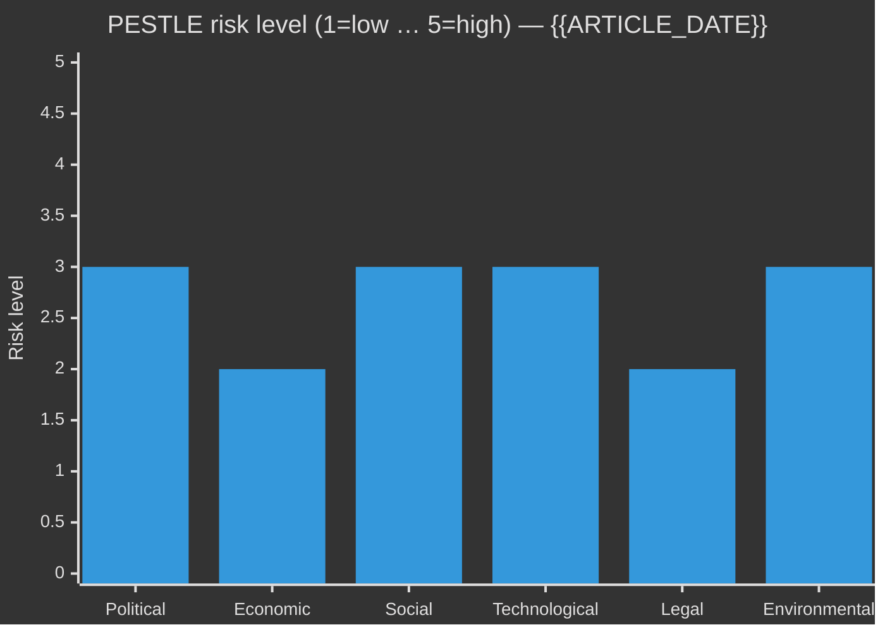

<!-- SPDX-FileCopyrightText: 2024-2026 Hack23 AB -->
<!-- SPDX-License-Identifier: Apache-2.0 -->

# PESTLE Analysis — {{ARTICLE_TYPE}} · {{ARTICLE_DATE}}

> **Analytical supplementary (optional).** Produce when a bill, scandal, budget cycle, election-adjacent event, or external shock crosses **two or more** PESTLE dimensions. Pairs with `swot-analysis.md` (external factors → Opportunities/Threats), `risk-assessment.md` (External dimension rows), and `scenario-analysis.md` (driver framework).
>
> **Methodology** → [`analysis/methodologies/analytical-supplementary-methodology.md § PESTLE`](../methodologies/analytical-supplementary-methodology.md#pestle).
> **Not counted in the 23 core artifacts.** Non-blocking in `05-analysis-gate.md`.

## 🔄 Tradecraft Context

- **Artifact class** — Analytical supplementary (optional, never blocking)
- **Use when** — A bill, scandal, budget cycle, election-adjacent event, or external shock crosses **two or more** PESTLE dimensions. For standard daily runs covering a single narrow issue, the benefit of PESTLE may not justify the effort; prefer it for committee-report aggregations, monthly reviews, and election-analysis runs
- **Pairs with** — `swot-analysis.md` (external factors → Opportunities/Threats), `risk-assessment.md` (External dimension rows), `scenario-analysis.md` (driver framework), `forward-indicators.md` (dated indicators per dimension)
- **Methodology** — [`analytical-supplementary-methodology.md § PESTLE`](../methodologies/analytical-supplementary-methodology.md#pestle)
- **Workflow status** — Not counted in the 23 core artifacts; non-blocking in [`05-analysis-gate.md`](../../.github/prompts/05-analysis-gate.md)
- **Minimum depth floor** — 100 lines (Standard), 150 lines (Deep), 220 lines (Comprehensive / Tier-C)
- **F3EAD stage** — Exploit: synthesises multi-source data into a structured macro-environment picture; feeds downstream analytic artifacts

## 📋 Scope declaration

- **Trigger event / decision** — [dok_id(s), bill name, or event that prompted the scan; must name ≥ 1 specific document or event]
- **Time horizon** — [short ≤ 6 m / medium 6–24 m / long 2–10 y] — select one; all WEP estimates are calibrated to this horizon
- **Unit of analysis** — [policy domain / party / coalition / institution / country — be specific]
- **Primary sources consulted** — riksdagen.se `dok_id` references, regeringen.se proposition/SOU, scb.se table codes, IMF WEO vintage (specify `WEO-YYYY-MM`), World Bank indicator codes (retained non-economic only), named myndigheter reports
- **Analyst note** — declare any prior beliefs or structural assumptions driving the analysis; this guards against anchoring in key judgements

---

<!-- TEMPLATE_CONTRACT_V1 -->
> **📐 Template Contract** — every fill of this template MUST satisfy this row.
>
> | Slot | Value |
> |------|-------|
> | **Owning methodology** | [`per-artifact-methodologies.md`](../methodologies/per-artifact-methodologies.md#pestle-analysis) |
> | **Owning gate check** | Supplementary (year-ahead/cycle blocking) — see [`05-analysis-gate.md`](../../.github/prompts/05-analysis-gate.md) |
> | **Required inputs** | `synthesis-summary.md`, OSINT signals |
> | **Horizon band** | mixed (year/cycle) (per [`scripts/horizon-context.ts`](../../scripts/horizon-context.ts)) |
> | **Output family** | Analytical Supplementary |
> | **Aggregation order** | 21 of 30 in canonical order (see [`scripts/render-lib/aggregator/order.ts`](../../scripts/render-lib/aggregator/order.ts)) |
> | **Reader Intelligence Guide** | row generated from `pestle-analysis.md` (see [`scripts/render-lib/aggregator/reader-guide.ts`](../../scripts/render-lib/aggregator/reader-guide.ts)) |
> | **Canonical evidence anchor** | `\| claim \| evidence (dok_id / vote / MP) \| retrieved_at \| confidence \|` — every analytical claim row uses this schema. |
>
> Cross-reference: [`README.md §Template ↔ Methodology ↔ Gate-Check Matrix`](README.md#-template--methodology--gate-check-matrix).

<!--
AI-FIRST Pass-1 / Pass-2 self-check (HTML comment — invisible in rendered articles; not stripped by aggregator unless under a "## Pass 2 …" heading).

PASS 1 (creation, minimal viable artifact):
  • Fill every REQUIRED slot above; cite ≥ 1 dok_id / vote / MP / primary-source URL per major claim.
  • Use the canonical evidence anchor schema for every analytical claim row.
  • Mermaid blocks use the cyberpunk %%{init: theme/themeVariables}%% prologue and at least one `style …` or `classDef …` directive (Check 5 of 05-analysis-gate.md).

PASS 2 (read-back & improve — AI-FIRST mandatory, ≥ 180 s after Pass 1):
  • Re-read the file end-to-end; for each section verify (a) ≥ 1 evidence anchor row, (b) WEP language tightened (no "may/might/could" hedges), (c) named actors with intressent_id where applicable, (d) Mermaid colour theming present.
  • Banned-phrase scan: "intelligence theatre", "sources say", "reportedly", "it is widely believed", "experts agree", "AI_MUST_REPLACE".
  • Citation density target: ≥ 1 evidence anchor row per 100 words of analytical prose.
  • Neutrality arithmetic: equal analytical depth across the 8 Riksdag parties (S, M, SD, V, MP, C, L, KD); flag and correct any bias in the Pass-2 Self-Audit section.

ANTI-TEMPLATE — DO NOT:
  • Ship plain prose without evidence anchor tables.
  • Leave AI_MUST_REPLACE / [REQUIRED: …] placeholders in the rendered output.
  • Cite a non-primary URL when a `dok_id` or vote record is available.
  • Treat co-occurrence of keywords as coordination; uni-directional chains as bi-directional.
  • Use a Mermaid block without colour theming (Check 5 will block aggregation).
  • Skip the Pass-2 read-back (Check 6 verifies mtime ≥ birth + 180 s OR a differing pass1/ snapshot).
-->

## 🏛️ Political (P)

> **Minimum 5 rows.** Every row in this dimension must cite a specific riksdagen.se `dok_id`, a named committee betänkande, or a named `anförande` speaker. Do not cite "general political context" without a source.

| Factor | Current state | Direction (↑/↓/→) | Evidence (dok_id / source) | Impact on scoped entity | WEP† | Admiralty |
|--------|---------------|-------------------|----------------------------|------------------------|------|-----------|
| Government composition & majority stability | [describe current coalition status; name parties and seat counts] | | riksdagen.se voteringar + session-baseline.md | | | |
| Opposition positioning on trigger | [name lead opposition MPs; describe their stated position with dok_id] | | motion dok_id; `search_anforanden` by party | | | |
| Coalition arithmetic for trigger (Tidö vote math) | [exact seat count; identify potential defectors by name + intressent_id] | | `search_voteringar`; `coalition-mathematics.md` | | | |
| Parliamentary committee balance on trigger topic | [committee name; chair party; majority composition] | | `get_betankanden`; utskott roster | | | |
| EU / NATO / Nordic Council pressure | [active COM proposals or NATO decisions affecting trigger] | | regeringen.se / COM doc / NATO communiqué | | | |
| Upcoming electoral pressure (to 2026 val) | [how does this factor's trajectory affect election positioning?] | | SVT/Demoskop opinion trend + `electoral-domain-methodology.md` | | | |

**Key judgement (P)** — [1–3 sentences, WEP-tagged, citing top 2 rows above. Example: "The coalition's 174/349 majority provides *very likely* (≈ 90 %) continuity on the trigger bill through Q2 2026, *provided* SD abstention discipline holds — a condition with *about even* (50 %) probability given recent floor defections (W1 in wildcards-blackswans)."]

**Dissent note (P)** — [name at least one competing interpretation of the political picture, even if you disagree; label it `[COUNTER-NARRATIVE]`]

---

## 💰 Economic (E)

> **Authoritative source → IMF** ([`imf-indicator-mapping.md`](../methodologies/imf-indicator-mapping.md)). World Bank only for non-economic residue ([`worldbank-indicator-mapping.md`](../methodologies/worldbank-indicator-mapping.md)). Every value must cite vintage in format `WEO-YYYY-MM` or `SCB TABLE-ID YYYY-MM`.

| Factor | Latest value | Forecast vintage | Delta vs prior vintage | Implication for scoped entity | WEP† | Admiralty |
|--------|--------------|------------------|-----------------------|-------------------------------|------|-----------|
| GDP growth (IMF WEO `NGDP_RPCH`) | [value] % | WEO-[YYYY-MM] | [Δ pp] | [1-line policy implication] | | B2 |
| Inflation CPI (IMF WEO `PCPIPCH`) | [value] % | WEO-[YYYY-MM] | [Δ pp] | [1-line] | | B2 |
| Unemployment (IMF WEO `LUR` / SCB AKU `AM0401`) | [value] % | WEO-[YYYY-MM] / SCB [YYYY-QN] | [Δ pp] | [1-line] | | B2 |
| Fiscal balance % GDP (IMF WEO `GGXCNL_NGDP`) | [value] % | WEO-[YYYY-MM] | [Δ pp] | [fiscal capacity for trigger policy] | | B2 |
| Government debt % GDP (IMF FM `GGXWDG_NGDP`) | [value] % | WEO-[YYYY-MM] | [Δ pp] | [Riksdag borrowing room] | | B2 |
| Current account % GDP (IMF WEO `BCA_NGDPD`) | [value] % | WEO-[YYYY-MM] | [Δ pp] | [external vulnerability] | | B2 |
| Riksbank policy rate | [value] % | Riksbank MPC [YYYY-MM-DD] | [Δ bp] | [rate sensitivity of trigger] | | A2 |
| Nordic peer comparison (DEN, NOR, FIN, DEU) | [compact table or note] | WEO-[YYYY-MM] | — | [relative position of Sweden] | | B2 |

**IMF fetch commands used:**
```bash
tsx scripts/imf-fetch.ts weo --country SWE --indicator NGDP_RPCH --years 10
tsx scripts/imf-fetch.ts compare --indicator GGXWDG_NGDP --countries SWE,DNK,NOR,FIN,DEU
tsx scripts/imf-fetch.ts sdmx --path "/data/IMF.STA,CPI,4.0.0/M.SE.PCPI_IX?startPeriod=2022-01" --indicator PCPI_IX --country SWE
```

**Key judgement (E)** — [WEP-tagged; tie to `coalition-mathematics.md` fiscal capacity; name the single biggest economic risk to the trigger's viability. Example: "With GGXCNL_NGDP at -0.6 % (WEO-2026-04), fiscal space is *likely* (≈ 75 %) sufficient for the proposed reform in the current budget cycle, but *about even* (50 %) dependent on Riksbank holding rates below 4 %."]

**Dissent note (E)** — [alternative reading of economic trajectory; e.g. if Finanspolitiska rådet's assessment diverges from IMF]

---

## 👥 Social (S)

> SCB is the authoritative Swedish source; World Bank supplies the non-economic OECD comparative context (environment, social, education participation, demographics). Income inequality / Gini and labour-market metrics with macro relevance source from **IMF or SCB**. Use 5-year trend series minimum.

| Factor | SCB / WB code | Latest value | Trend (5 y) | Political salience (1–5) | Evidence | Admiralty |
|--------|---------------|--------------|-------------|-------------------------|----------|-----------|
| Population growth & age structure | SCB `BE0101` / WB `SP.POP.TOTL` | [value] | ↑/↓/→ | [1–5] | SCB [YYYY-QN] | B2 |
| Urban / rural divergence (NUTS-3) | SCB `BE0101` regional | [value] | ↑/↓/→ | [1–5] | SCB [YYYY-QN] | B2 |
| Migration net balance & integration | SCB `BE0101J` | [value] | ↑/↓/→ | 5 (high salience) | SCB [YYYY] | B2 |
| Income inequality (Gini) | WB `SI.POV.GINI` / SCB `HE0110` | [value] | ↑/↓/→ | [1–5] | SCB / WB [YYYY] | B2 |
| Trust in government institutions | SOM Institute survey / OECD PIAAC | [value] | ↑/↓/→ | 5 | SOM [year] | C2 |
| Labour market participation rate (15–74) | SCB `AM0401` | [value] % | ↑/↓/→ | [1–5] | SCB [YYYY-QN] | B2 |
| Housing affordability (price-to-income) | SCB `BO0501` | [value] | ↑/↓/→ | 5 | SCB [YYYY-MM] | B2 |

**Key judgement (S)** — [tie to `voter-segmentation.md` demographic clusters; identify which social factor most directly shapes electoral risk for the trigger event. Example: "Migration and integration (salience = 5) remain the single most socially polarising factor, creating *very likely* (≈ 85 %) asymmetric pressure on SD vs C voter bases in the 2026 election cycle."]

---

## 🔬 Technological (T)

> Policy response gap = time between technology deployment and effective regulation/mitigation. Cite the responsible myndighet (MSB, Vinnova, FMV, FOI) by name.

| Factor | State (2025–26) | Rate of change (slow/medium/fast) | Policy response gap (mo) | Evidence | WEP† | Admiralty |
|--------|-----------------|-----------------------------------|--------------------------|----------|------|-----------|
| AI governance — EU AI Act transposition (Lagen om AI-system) | [describe stage in riksdag process: prop/utskott/kammaren] | Fast | [months to full implementation] | prop. dok_id / Justitiedepartementet | | B2 |
| Cybersecurity posture — NIS2 implementation | [describe status] | Medium | [months] | MSB NIS2 rapport [date] | | B2 |
| Digital public infrastructure (e-legitimation, Digg, 1177) | [describe current state] | Medium | [months] | Digg annual report; 1177 drift-status | | B2 |
| Quantum cryptography threat to gov PKI | [describe Myndigheten för samhällsskydd och beredskap (MSB) assessment] | Slow (5–10 y) | 12–36 | MSB/FRA quantum-threat bulletin | | C3 |
| Defence-tech dual-use (FMV exports, FOI capability) | [describe export control and dual-use licensing status] | Medium | [months] | ISP export permit data; FMV | | B2 |
| R&D intensity (WB `GB.XPD.RSDV.GD.ZS`) | [value] % GDP | Slow | — | WB [YYYY]; Vinnova årsredovisning | | B2 |

**Key judgement (T)** — [identify the single biggest technology-related implementation risk for the trigger; tie to `threat-analysis.md` kill-chain §Reconnaissance / Execution when relevant. Example: "NIS2 implementation lag (policy gap ≈ 18 months) *likely* (≈ 70 %) creates a window of operational vulnerability for critical-sector operators during the 2026 election period."]

---

## 🌿 Legal (L)

> Every row must name the instrument (prop., motion, CELEX number, konstitutionsutskott betänkande, JO-beslut). Legal dimension directly informs `risk-assessment.md §Institutional / Accountability` and `political-classification.md §Compliance`.

| Factor | Instrument | Status | Binding on Sweden | Compliance gap | Evidence (dok_id / CELEX) | Admiralty |
|--------|-----------|--------|-------------------|----------------|---------------------------|-----------|
| Primary legislation directly triggered | prop. [YYYY/YY:N] / motion H[X00][X][N] | [utarbetad / behandlas / antagen / avslag] | [yes/constitutional/statutory] | [describe any gap] | dok_id | A1/B2 |
| EU regulation / directive in flight | COM([YYYY])[N] / CELEX [N] | [proposal / trilogue / in-force] | yes — direct effect / yes — via transposition | [months to Swedish implementation] | EUR-Lex URL | B2 |
| Constitutional constraint (grundlag) | RF / TF / YGL / OSL | [applicable provision] | yes — constitutional | [if any reform needed] | KU-betänkande dok_id | A1 |
| Judicial review / JO granskning | JO-beslut [YYYY] | [concluded / pending] | advisory | [any systemic gap exposed] | JO DNR number | B2 |
| International treaty / NATO obligation | [treaty name + year] | [ratified / pending] | yes | [Swedish enabling legislation status] | UD-dok / prop. | A1 |
| Offentlighetsprincipen (TF 2 kap.) compliance | TF 2:2 | [applicable to trigger] | yes — constitutional | [any secrecy classification issues] | KU betänkande | A1 |

**Key judgement (L)** — [identify the legal factor with the shortest compliance timeline or highest constitutional risk. Tie to `political-classification.md §Accountability`. Example: "The EU AI Act transposition deadline (August 2026) falls 4 weeks before val-dag, *almost certainly* (≈ 95 %) making it a campaign-period legislative flash-point."]

---

## 🌍 Environmental (E_env)

> Note disambiguation: this "E" refers to **Environmental**, not Economic. Economic is the "E" above. When referring to this dimension use `E_env` in cross-references to avoid confusion.

| Factor | Indicator / source | Latest value | Trajectory vs Sweden target | Political leverage (1–5) | Evidence | Admiralty |
|--------|-------------------|--------------|------------------------------|--------------------------|----------|-----------|
| Climate target — net-zero 2045 (Klimatlagen) | Naturvårdsverket emissions report | [tCO₂e/capita or total Gt] | [on-track / off-track by X %] | 4 | NVV [YYYY] | B2 |
| Energy mix & security (renewable share) | Energimyndigheten / SvK | [% renewable] | ↑ vs 2020 target | [1–5] | SvK drift-rapport [YYYY-MM] | B2 |
| Biodiversity / water quality | SLU artdatabanken / SMHI | [indicator status] | ↑/↓/→ | [1–5] | SLU [YYYY] | B3 |
| CO₂ emissions per capita (WB `EN.ATM.CO2E.PC`) | WB WDI | [value] tonne | ↓ vs 1990 baseline | 3 | WB [YYYY] | B2 |
| EU ETS / CBAM exposure (Swedish industry) | Naturvårdsverket ETS allocation | [tCO₂e allocation] | [surplus/deficit] | 3 | NVV ETS bulletin [YYYY] | B2 |
| Energy price (elpris) sensitivity | SCB `EN0109` / NordPool | [SEK/MWh, zone SE3] | ↑/↓/→ | 5 (cost-of-living) | NordPool [YYYY-MM] | B2 |

**Key judgement (E_env)** — [identify environmental factor with highest political salience and feed into `forward-indicators.md §12-month horizon`. Example: "Energy price volatility (salience 5) *likely* (≈ 65 %) remains the dominant environmental-political vector into the 2026 election, overtaking climate-target compliance as a voter issue per SOM 2025 data."]

---

## 🔀 Cross-dimension interactions (≥ 3; preferably ≥ 5)

> Each interaction should name two PESTLE dimensions, describe the causal mechanism precisely, assign magnitude 1–5, and name the downstream artifact where this interaction is most relevant.

| Interaction | Causal mechanism | Direction | Magnitude (1–5) | Evidence | Feeds artifact |
|------------|-----------------|-----------|-----------------|----------|----------------|
| E × S (Economic × Social) | Inflation ↑ → cost-of-living ↑ → trust in government ↓ → opposition electoral gain ↑ | ↑E forces ↓S trust | 4 | IMF PCPIPCH + SOM trust survey | `swot-analysis.md` §Threats, `risk-assessment.md` §Social |
| P × L (Political × Legal) | Coalition fragility → legislation rushed without remiss → lagrådet objection → constitutional challenge | ↑P instability → L gap | 3 | KU granskning annual report | `political-stride-assessment.md` §R Repudiation |
| T × S (Technological × Social) | AI-generated disinformation spike → epistemic fragmentation → polarisation index ↑ → electoral volatility ↑ | ↑T threat → ↑S division | 4 | MSB disinfo report + SOM polarisation | `threat-analysis.md` §Influence ops; `scenario-analysis.md` worst case |
| L × E_env (Legal × Environmental) | EU ETS tightening → CBAM implementation → Swedish industry cost ↑ → fiscal compensation pressure | ↑L obligation → ↑E_env fiscal | 3 | EUR-Lex ETS reform + NVV allocation | `implementation-feasibility.md`; `risk-assessment.md` §Economic |
| P × E (Political × Economic) | Pre-election spending pressures → fiscal balance deterioration → IMF downward revision → credit outlook | ↑P electoral → ↑E fiscal risk | 3 | IMF GGXCNL_NGDP trend + Finanspolitiska rådet | `executive-brief.md` §Decisions; `risk-assessment.md` §Fiscal |

**Cross-dimension summary** — [1–2 sentences synthesising the most important interaction cluster. Identify the single "highest-leverage" interaction that would most change the overall PESTLE picture if the direction reversed.]

---

## 📊 PESTLE heatmap

> Rate each dimension's **current risk level** (1=low, 5=high) and **rate of change** (−2 to +2, negative = improving). Use this to prioritise analytic effort and surface to `executive-brief.md`.



*Replace values with assessed risk levels before publishing. Rationale for each score in the key judgements above.*

---

## 🗳️ Election 2026 PESTLE lens

> This section is **mandatory** when `{{ARTICLE_TYPE}}` is `monthly-review`, `election-2026-analysis`, or `week-ahead` within 180 days of val-dag. For other article types, complete if PESTLE score ≥ 3 in Political or Social dimension.

| Dimension | Key electoral implication | Favours | Penalises | Forward-indicator to watch | Timeline |
|-----------|--------------------------|---------|-----------|---------------------------|----------|
| Political | [e.g. coalition stability → campaigning on record vs. opposition promises] | | | | |
| Economic | [e.g. real-wage trajectory → vote-pocket sensitivity] | | | | |
| Social | [e.g. migration salience → voter-segmentation sorting] | | | | |
| Technological | [e.g. AI-driven disinformation → epistemic trust → voter uncertainty] | | | | |
| Legal | [e.g. late EU transposition → campaign promise impossible to deliver before val] | | | | |
| Environmental | [e.g. energy prices → cost-of-living dominant theme or minor] | | | | |

---

## 🎯 PIR feedback

| PIR | Addressed by dimension(s) | Coverage quality (H/M/L) | Gap | Recommended action |
|-----|--------------------------|--------------------------|-----|-------------------|
| PIR-1 | | | | |
| PIR-2 | | | | |

---

## 🔗 Cross-links

- [`swot-analysis.md`](swot-analysis.md) — external Opportunities/Threats rows cite rows from PESTLE E, S, T, L, E_env
- [`risk-assessment.md`](risk-assessment.md) — External dimension rows use PESTLE P, E, E_env
- [`scenario-analysis.md`](scenario-analysis.md) — drivers matrix consumes PESTLE cross-dimension interactions
- [`forward-indicators.md`](forward-indicators.md) — dated indicators per dimension populate §6-month and §12-month horizons
- [`intelligence-assessment.md`](intelligence-assessment.md) — Key Judgements (§2) synthesise top PESTLE signals
- [`implementation-feasibility.md`](implementation-feasibility.md) — L dimension legal constraints + T technology gap
- [`wildcards-blackswans.md`](wildcards-blackswans.md) — cross-dimension interactions with magnitude ≥ 4 become wildcard triggers
- [`analysis/imf/README.md`](../imf/README.md) — **IMF economic-data contract**; all E dimension values use IMF; World Bank only for retained non-economic codes

† WEP = [Words-of-Estimative-Probability](../methodologies/osint-tradecraft-standards.md#wep) confidence band.
† Admiralty = [Source reliability × Information credibility](../methodologies/osint-tradecraft-standards.md#admiralty) (e.g. B2 = usually reliable source, probably true).

---

**Template version:** v2.0 · **Last updated:** 2026-04-25

---

## ✅ Pass-2 Self-Audit Checklist (v4.4 — required)

> **Purpose:** AI-FIRST principle requires a Pass-2 read-back-and-improve. After producing this artifact in Pass 1, re-read it end-to-end and verify each item below. Document any remediation in [`methodology-reflection.md`](methodology-reflection.md) §"Pass-2 audit log". Any unchecked ❌ box at the end of Pass 2 forces a Pass-3 rewrite of the affected section.

- [ ] **Tradecraft anchors honoured** — F3EAD stage matches the artifact's role; PIRs declared in the §Tradecraft Context block are actually addressed in the body; Admiralty grades attached to every external source; WEP band + ODNI confidence on every probabilistic judgement.
- [ ] **Source diversity floor met** — at least the minimum number of independent MCP sources required by the artifact's tradecraft block are cited; single-source claims are explicitly labelled `[SINGLE-SOURCE — corroboration pending]`.
- [ ] **Evidence specificity** — every quantified claim cites a `dok_id` (Riksdag), an SCB / IMF dataflow code, or a named external source with date; no "according to data" / "studies show" hand-waves.
- [ ] **Named-actor discipline** — every political claim names ≥ 1 person (party + role + dated act/quote) or labels the absence (`[diffuse — no named actor]`).
- [ ] **Counter-narrative present** — at least one explicit competing hypothesis, dissent quote, or framed objection appears in the body; "no opposition recorded" is itself a finding to label, not silence.
- [ ] **Election 2026 lens applied** — the §"Election 2026 Implications" subsection (or equivalent) addresses electoral salience, coalition pressure, and forward indicators; not boilerplate.
- [ ] **No illustrative content shipped as fact** — every `[REQUIRED]` placeholder is filled OR removed; every `Example:` block is clearly fenced or removed; no fabricated `dok_id`, vote count, or quote leaks into the final artifact.
- [ ] **Cross-references resolve** — every `[link](file.md)` in this artifact points to a file that exists in the run folder (`analysis/daily/$ARTICLE_DATE/$SUBFOLDER/`) or to a methodology / template under `analysis/`.
- [ ] **Mermaid renders** — every fenced ` ```mermaid ` block parses (no missing class definitions, no orphan nodes, no >40-node graphs that overflow viewport on mobile).
- [ ] **Line-floor check** — artifact length ≥ the per-artifact floor in [`reference-quality-thresholds.json`](../methodologies/reference-quality-thresholds.json); shorter artifacts trigger Pass-2 rewrite, never a `[truncated]` note.

