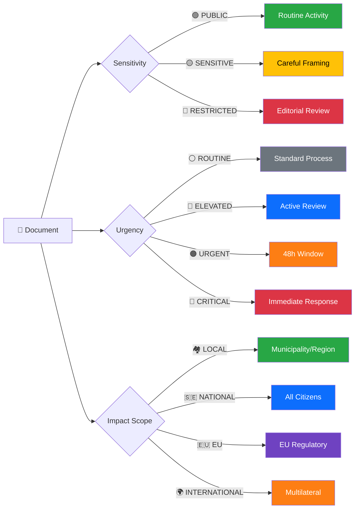

<p align="center">
  
</p>

<h1 align="center">🏷️ Political Event Classification Template</h1>

<p align="center">
  <strong>📊 Structured Classification for Swedish Parliamentary Events</strong><br>
  <em>🎯 Sensitivity · Urgency · Impact · Policy Domain</em>
</p>

<p align="center">
  <a href="#"></a>
  <a href="#"></a>
  <a href="#"></a>
  <a href="#"></a>
</p>

**📋 Document Owner:** CEO | **📄 Version:** 2.3 | **📅 Last Updated:** 2026-06-01 (UTC)  
**🏢 Owner:** Hack23 AB (Org.nr 5595347807) | **🏷️ Classification:** Public

> **📌 Template Instructions:** Copy to `analysis/daily/YYYY-MM-DD/{articleType}/` and save as `classification-results.md` in the workflow's own folder (never overwrite another workflow's files). Replace all `[REQUIRED]` and `[OPTIONAL]` placeholders with actual values. Include Political Temperature Index and Coalition Impact Vector assessments.

> **🚨 Anti-Pattern Warning:** Classification without Political Temperature Index, Strategic Significance score, or Coalition Impact Vector is incomplete. Every classification MUST include the three advanced dimensions from [political-classification-guide.md](../methodologies/political-classification-guide.md) v2.0. See [ai-driven-analysis-guide.md](../methodologies/ai-driven-analysis-guide.md) for good vs. bad examples.


---

## 📋 Document Metadata

| Field | Value |
|-------|-------|
| **Classification ID** | `[REQUIRED: CLS-YYYY-MM-DD-NNN]` |
| **Document Type** | Political Event Classification |
| **Event Date** | `[REQUIRED: YYYY-MM-DD]` |
| **Classification Date** | `[REQUIRED: YYYY-MM-DD HH:MM UTC]` |
| **Primary Source dok_id** | `[REQUIRED: Riksdag document ID, e.g. H9012345]` |
| **Secondary Source(s)** | `[OPTIONAL: Additional dok_ids, comma-separated]` |
| **Classified By** | `[REQUIRED: workflow name, e.g. news-article-generator]` |
| **Reviewed By** | `[OPTIONAL: human reviewer or 'automated']` |

---

## 🏷️ Classification Dimensions

### Classification Decision Tree

> **AI Instructions:** After classifying the event, highlight the active path through this diagram by noting which sensitivity, urgency, and scope were selected.



### 1. Sensitivity Level

Select exactly **one** sensitivity level. See [methodologies/political-classification-guide.md](../methodologies/political-classification-guide.md) for criteria.

- [ ] 🟢 **PUBLIC** — Routine parliamentary activity; freely publishable
- [ ] 🟡 **SENSITIVE** — Politically charged; requires careful framing and attribution
- [ ] 🔴 **RESTRICTED** — High-impact or legally sensitive; requires editorial review before publication

**Sensitivity Rationale:** `[REQUIRED: 1–2 sentences explaining the classification decision]`

---

### 2. Policy Domain

Select the **primary** domain and up to two **secondary** domains:

**Primary Domain:** `[REQUIRED: select one]`

| Code | Domain | Swedish Term |
|------|--------|--------------|
| `ECO` | Economics & Finance | Ekonomi och finans |
| `DEF` | Defence & Security | Försvar och säkerhet |
| `JUS` | Justice & Law | Rättsväsende |
| `SOC` | Social Policy & Welfare | Socialpolitik |
| `HEA` | Health & Medical | Hälso- och sjukvård |
| `EDU` | Education & Research | Utbildning och forskning |
| `ENV` | Environment & Climate | Miljö och klimat |
| `AGR` | Agriculture & Food | Jordbruk och livsmedel |
| `INF` | Infrastructure & Transport | Infrastruktur |
| `ENE` | Energy | Energi |
| `FOR` | Foreign Affairs & Trade | Utrikespolitik |
| `MIG` | Migration & Integration | Migration |
| `CON` | Constitution & Democracy | Konstitution och demokrati |

**Secondary Domain(s):** `[OPTIONAL: up to two additional codes]`

---

### 3. Urgency Level

Select exactly **one** urgency level based on legislative calendar and real-world impact:

- [ ] ⚪ **ROUTINE** — Standard legislative process; no time-sensitive dimension
- [ ] 🔵 **ELEVATED** — Active committee review or imminent vote within 2 weeks
- [ ] 🟠 **URGENT** — Vote scheduled within 48 hours or immediate government response required
- [ ] 🔴 **CRITICAL** — Constitutional crisis, no-confidence motion, emergency legislation, or acute national security event

**Urgency Rationale:** `[REQUIRED: 1–2 sentences]`

**Legislative Calendar Reference:** `[OPTIONAL: Next scheduled vote/committee date YYYY-MM-DD]`

---

### 4. Impact Scope

Select the **broadest applicable** scope:

- [ ] 🏘️ **LOCAL** — Affects specific municipality/region only
- [ ] 🇸🇪 **NATIONAL** — Affects all Swedish citizens or national institutions
- [ ] 🇪🇺 **EU** — Triggers EU regulatory or treaty dimensions
- [ ] 🌍 **INTERNATIONAL** — Affects bilateral/multilateral relations beyond EU

**Impact Scope Rationale:** `[REQUIRED: 1 sentence]`

---

## 📊 Impact Analysis Matrix

Score likelihood and impact on 1–5 scale. Risk Score = Likelihood × Impact.

```
Impact Scale:    1=Negligible  2=Minor  3=Moderate  4=Major  5=Severe
Likelihood Scale: 1=Rare       2=Unlikely 3=Possible 4=Likely 5=Almost Certain
```

| Dimension | Likelihood (1–5) | Impact (1–5) | Risk Score | Notes |
|-----------|-----------------|--------------|------------|-------|
| **Democratic Process** | `[#]` | `[#]` | `[L×I]` | `[OPTIONAL]` |
| **Economic Impact** | `[#]` | `[#]` | `[L×I]` | `[OPTIONAL]` |
| **Social Cohesion** | `[#]` | `[#]` | `[L×I]` | `[OPTIONAL]` |
| **Coalition Stability** | `[#]` | `[#]` | `[L×I]` | `[OPTIONAL]` |
| **International Relations** | `[#]` | `[#]` | `[L×I]` | `[OPTIONAL]` |

**Composite Risk Score:** `[REQUIRED: max of the above scores]`

**Impact Analysis Matrix (Likelihood × Impact)**

| Likelihood \ Impact | 1 – Low Impact | 2 – Minor Impact | 3 – Moderate Impact | 4 – Major Impact | 5 – Severe Impact |
|----------------------|----------------|-------------------|----------------------|-------------------|--------------------|
| 1 – Rare             | `[ ]`          | `[ ]`             | `[ ]`                | `[ ]`             | `[ ]`              |
| 2 – Unlikely         | `[ ]`          | `[ ]`             | `[ ]`                | `[ ]`             | `[ ]`              |
| 3 – Possible         | `[ ]`          | `[ ]`             | `[ ]`                | `[ ]`             | `[ ]`              |
| 4 – Likely           | `[ ]`          | `[ ]`             | `[ ]`                | `[ ]`             | `[ ]`              |
| 5 – Almost Certain   | `[ ]`          | `[ ]`             | `[ ]`                | `[ ]`             | `[ ]`              |

> Mark the single cell that best represents the event’s **Likelihood × Impact** combination.

| Event Name     | Likelihood (1–5) | Impact (1–5) | Quadrant Label (for example "Immediate Action", "Monitor Closely", "Low Priority", "Watch") |
|----------------|------------------|--------------|-----------------------------------------------------------------------------------------------------|
| `[Event Name]` | `[L]`            | `[I]`        | `[QUADRANT LABEL]`                                                                                  |

---

## 🔖 Cross-Reference Tags

```
Primary Actors:   [REQUIRED: comma-separated list of political actors, e.g. "S, M, Tidökoalitionen"]
Committee:        [OPTIONAL: e.g. "FiU" (Finansutskottet), "JuU", "UU"]
Riksmöte:         [REQUIRED: e.g. "2025/26"]
Related dok_ids:  [OPTIONAL: comma-separated]
Related Events:   [OPTIONAL: CLS-IDs of related classifications]
Significance Score: [REQUIRED: see significance-scoring.md, 0–10 composite]
```

---

## 📝 Classification Rationale

### Summary of Event
`[REQUIRED: 2–4 sentences describing what happened, who the key actors are, and the immediate political context. Be specific — cite document IDs, committee names, and politician names.]`

### Classification Justification
`[REQUIRED: Explain why each classification dimension was assigned its value. Reference specific evidence from the source document.]`

### Confidence Assessment
- **Source Quality:** `[VERY HIGH / HIGH / MEDIUM / LOW / VERY LOW]` — `[reason]`
- **Information Completeness:** `[VERY HIGH / HIGH / MEDIUM / LOW / VERY LOW]` — `[reason]`
- **Overall Confidence:** `[VERY HIGH / HIGH / MEDIUM / LOW / VERY LOW]`

### Recommended Action
- [ ] 📰 **Publish** — Include in next news cycle (significance ≥ 6)
- [ ] ⚡ **Breaking** — Publish immediately (significance ≥ 8 + URGENT/CRITICAL)
- [ ] 📋 **Monitor** — Track for follow-up; do not publish standalone
- [ ] 🗄️ **Archive** — Low significance; archive for trend analysis only

---

## 📊 Calibration Example (Filled)

> *This example demonstrates how to complete the template for a real Swedish political event. Use it as a scoring anchor.*

**Event:** Budget proposition 2025/26:1 tabled by Finansminister Elisabeth Svantesson (M)

| Field | Value |
|-------|-------|
| **Classification ID** | `CLS-2025-09-20-001` |
| **Event Type** | Proposition |
| **Event Date** | `2025-09-20` |
| **Primary dok_id** | `H9011` |
| **Source MCP Tool** | `search_dokument(doktyp=prop)` |
| **Classified By** | `news-evening-analysis` |

| Dimension | Score | Justification |
|-----------|:-----:|---------------|
| **Sensitivity** | 🟡 SENSITIVE | Budget involves coalition negotiation with SD; migration allocation contested |
| **Primary Domain** | ECO (Economy) | Government fiscal policy; secondary: SOC, MIG |
| **Urgency** | 🟠 URGENT | Budget vote deadline in November; FiU review starting |
| **Impact Scope** | NATIONAL | Affects all citizens via tax and spending |
| **Likelihood × Impact** | L=4 × I=4 = 16 🔴 | Budget likely passes (coalition agreement) but impact is severe (entire fiscal year) |
| **Significance Score** | 8.2/10 | High parliamentary + policy + urgency |

**Recommended Action:** ⚡ **Breaking** (significance 8.2 ≥ 8, urgency URGENT)

---

## 📊 Batch Classification Table

*Use this table when classifying multiple events from a single MCP download session. Record the `dok_id` from the Riksdag API response for full traceability.*

> **AI Instructions:** After each MCP data fetch (e.g., using `search_dokument` or `get_propositioner` on the `riksdag-regering-mcp` server), classify every returned document in this table before proceeding to detailed per-file analysis. The `dok_id` column MUST match the identifier from the Riksdag Open Data API response.

| # | dok_id | Event Type | Sensitivity | Primary Domain | Urgency | Impact Scope | L×I | Significance | Decision |
|:-:|--------|-----------|:-----------:|:-------------:|:-------:|:------------:|:---:|:------------:|----------|
| 1 | `[dok_id]` | `[type]` | `[🟢/🟡/🟠/🔴]` | `[domain]` | `[level]` | `[scope]` | `[#]` | **`[score]`** | `[action]` |
| 2 | `[dok_id]` | `[type]` | `[🟢/🟡/🟠/🔴]` | `[domain]` | `[level]` | `[scope]` | `[#]` | **`[score]`** | `[action]` |
| 3 | `[dok_id]` | `[type]` | `[🟢/🟡/🟠/🔴]` | `[domain]` | `[level]` | `[scope]` | `[#]` | **`[score]`** | `[action]` |

**Decision Legend:**
- ⚡ **Breaking** — Significance ≥ 8, urgency CRITICAL/URGENT → immediate full analysis
- 📰 **Priority** — Significance 6–7 → full per-file analysis within 2h
- 📋 **Monitor** — Significance 4–5 → include in synthesis, no standalone article
- 🗄️ **Archive** — Significance < 4 → log for trend tracking only

---

## 📂 MCP Data Files Used

> *Record all data files and MCP tool calls consulted during this classification for audit traceability and reproducibility.*

`[REQUIRED: List all analysis/daily/YYYY-MM-DD/{articleType}/data/ files consulted]`

| # | File Path | Source MCP Tool | Data Type | Freshness |
|:-:|-----------|----------------|-----------|:---------:|
| 1 | `[REQUIRED: e.g. analysis/daily/2026-03-30/propositions/data/H901FiU1.json]` | `[e.g. search_dokument]` | `[e.g. proposition / motion / vote]` | `[Current / Cached]` |
| 2 | `[REQUIRED: additional data file]` | `[REQUIRED: MCP tool id, e.g. get_propositioner]` | `[data type]` | `[freshness]` |
| 3 | `[OPTIONAL: additional data file]` | `[OPTIONAL: MCP tool id, e.g. get_votering]` | `[data type]` | `[freshness]` |

> **📌 AI Instructions:** Populate this table with every MCP tool call and data file actually consulted during classification. This provides full data provenance for the classification decision. All files listed MUST exist at the stated paths; mark transient data as `(transient — not cached)`.

---

## ⏳ Classification Confidence Decay Rule

> **Classifications older than 7 days MUST be re-evaluated.** Political events evolve rapidly; a classification assigned on Monday may be outdated by the following Monday due to new committee decisions, coalition negotiations, or public opinion shifts.

| Classification Age | Action Required | Rationale |
|:------------------:|:---------------:|-----------|
| **0–3 days** | ✅ Current — no action | Classification reflects active political context |
| **4–7 days** | ⚠️ Review recommended | Political landscape may have shifted; check for new developments |
| **8–14 days** | 🟠 Re-evaluation REQUIRED | Urgency and sensitivity may have changed; update or confirm |
| **15–30 days** | 🔴 Re-classification MANDATORY | Original context likely stale; full re-assessment needed |
| **31+ days** | ❌ Expired — archive only | Classification no longer actionable; retain for trend analysis only |

**This Classification's Age:** `[REQUIRED: N days since Classification Date]`  
**Re-evaluation Status:** `[REQUIRED: Current / Review needed / Re-evaluation required / Expired]`

---

## 🗳️ Election 2026 Classification Context

> *How does this classified event's sensitivity, urgency, and scope translate into electoral relevance?*

| Dimension | Assessment | Evidence |
|-----------|------------|----------|
| **Electoral Impact** | `[REQUIRED: How does this event affect September 2026 election positioning?]` | `[Specific evidence]` |
| **Coalition Scenarios** | `[REQUIRED: Which coalition configurations benefit/suffer from this classification?]` | `[Evidence]` |
| **Voter Salience** | `[REQUIRED: Is this event type salient for voter blocs heading into 2026?]` | `[Evidence]` |
| **Campaign Vulnerability** | `[REQUIRED: Does this event create campaign attack vectors given its sensitivity level?]` | `[Evidence]` |
| **Policy Legacy** | `[REQUIRED: Will this event's classification (SENSITIVE/RESTRICTED) affect electoral discourse?]` | `[Evidence]` |

**Overall Electoral Significance**: `[REQUIRED: CRITICAL/HIGH/MODERATE/LOW/NEGLIGIBLE]`

---

## 🎯 Confidence Scale Reference (5-Level)

| Level | Label | Criteria | Evidence Threshold |
|-------|-------|----------|--------------------|
| ⬛ 1 | **VERY LOW** | Speculation only, single unverified source | 0–1 sources, no corroboration |
| 🟥 2 | **LOW** | Circumstantial evidence, indirect indicators | 2 sources, indirect evidence |
| 🟧 3 | **MEDIUM** | Multiple independent sources, moderate corroboration | 3+ sources, moderate agreement |
| 🟩 4 | **HIGH** | Official records, documented data, direct evidence | Official docs, voting records, committee reports |
| 🟦 5 | **VERY HIGH** | Verified data + independent corroboration + expert consensus | Multiple official sources, cross-validated |

---

## 🔗 Cross-References

> *Link to sibling analysis files and same-day analysis from other article types.*

| Related Analysis File | Relationship | Key Finding |
|----------------------|-------------|-------------|
| `[REQUIRED: e.g. significance-scoring.md]` | `[classification informs significance urgency dimension]` | `[1 sentence]` |
| `[REQUIRED: e.g. synthesis-summary.md]` | `[classification feeds intelligence dashboard]` | `[1 sentence]` |
| `[OPTIONAL: same-day analysis from different article type]` | `[cross-reference]` | `[1 sentence]` |

---

## ✅ Quality Self-Check Checklist

> **Pre-commit validation — every item MUST be checked before finalising this classification.**

- [ ] **Document Metadata complete:** Classification ID, event date, classification date, dok_id, classified by all filled
- [ ] **All 4 classification dimensions assigned:** Sensitivity, Policy Domain, Urgency, Impact Scope
- [ ] **Rationale provided for each dimension:** Sensitivity, urgency, and impact scope all have 1–2 sentence rationales
- [ ] **Classification Decision Tree path noted:** Active path through Mermaid diagram identified
- [ ] **Impact Analysis Matrix scored:** At least 3 of 5 dimensions (Democratic, Economic, Social, Coalition, International) scored
- [ ] **Cross-Reference Tags complete:** Primary Actors, Riksmöte, Significance Score all filled
- [ ] **Classification Rationale written:** 2–4 sentence summary + justification + confidence assessment
- [ ] **Recommended Action selected:** Publish/Breaking/Monitor/Archive checkbox checked
- [ ] **Confidence Decay assessed:** Classification age calculated and re-evaluation status noted
- [ ] **MCP Data Provenance:** All data sources listed with timestamps
- [ ] **No placeholder text remaining:** Search for `[REQUIRED` — zero hits expected
- [ ] **Election 2026 Classification Context present:** All 5 dimensions assessed with overall electoral significance
- [ ] **5-level confidence applied:** Source Quality, Information Completeness, Overall Confidence use VERY HIGH/HIGH/MEDIUM/LOW/VERY LOW
- [ ] **Named actors cited:** ≥1 named politician/party in classification rationale
- [ ] **Cross-references linked:** At least 1 sibling analysis file referenced

---

**Document Control:**  
- **Template Path:** `/analysis/templates/political-classification.md`  
- **Version:** 2.2  
- **Effective Date:** 2026-04-06 (UTC)  
- **Advanced Dimensions:** Political Temperature Index, Strategic Significance, Coalition Impact Vector, Confidence Decay Rule  
- **Framework Reference:** [methodologies/political-classification-guide.md](../methodologies/political-classification-guide.md)  
- **ISMS Alignment:** ISO 27001:2022 A.5.12 (Classification of Information), NIST CSF 2.0 ID.AM (Asset Management)  
- **Classification:** Public  
- **Owner:** Hack23 AB (Org.nr 5595347807)  
- **Next Review:** 2026-06-30
