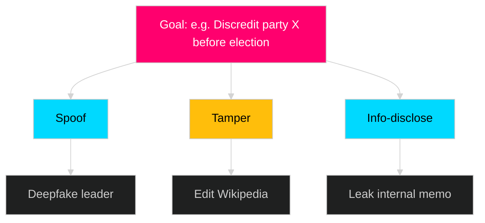

# Political STRIDE Assessment — {{ARTICLE_TYPE}} · {{ARTICLE_DATE}}

> **Analytical supplementary (optional).** STRIDE adapted to **political, electoral and institutional** threat surfaces. Produce for election-adjacent events, integrity incidents, disinformation spikes, critical-infrastructure votes, or any scoped entity where the adversary model matters. Pairs with `threat-analysis.md` (kill chain / MITRE mapping) and `risk-assessment.md` (Institutional + Corruption dimensions).
>
> **Methodology** → [`analysis/methodologies/analytical-supplementary-methodology.md § STRIDE-political`](../methodologies/analytical-supplementary-methodology.md#stride-political).
> **Not counted in the 23 core artifacts.** Non-blocking in `05-analysis-gate.md`.

## 📋 Scope declaration

- **Entity under assessment** — [party / coalition / Riksdag committee / government agency / electoral system component]
- **Trust boundary** — [define: voter ↔ ballot, MP ↔ vote-casting system, minister ↔ decision record, citizen ↔ FOI channel]
- **Time horizon** — [pre-election / governing cycle / post-event]
- **Adversary model** — [nation-state / domestic actor / insider / organised crime / bad-faith opposition]

---

## 🎭 STRIDE × Political dimensions

### S — Spoofing of political identity

| Vector | Target | Likelihood (1–5) | Impact (1–5) | Mitigation (existing) | Residual risk | Evidence |
|--------|--------|------------------|--------------|----------------------|--------------|----------|
| Impersonation of MP on social media | | | | platform-integrity | | |
| Fake press release (domain clone) | | | | HSTS + brand policing | | |
| AI-generated voice of party leader | | | | detection + rapid rebuttal | | |
| Ghost-candidate registration | | | | Valmyndigheten controls | | |

### T — Tampering with political evidence / process

| Vector | Target | Likelihood | Impact | Mitigation | Residual | Evidence |
|--------|--------|-----------|--------|-----------|---------|----------|
| Altering Riksdag vote record | voteringar API | | | RA + audit log | | |
| Editing betänkande draft | committee staff | | | version control | | |
| Ballot tampering | valdag | | | manual paper-trail | | |
| Voter-roll modification | Skatteverket | | | PuL + audit | | |

### R — Repudiation of political decision

| Vector | Example | Likelihood | Impact | Mitigation | Residual | Evidence |
|--------|---------|-----------|--------|-----------|---------|----------|
| MP denies registered vote | | | | protokoll H-nummer | | |
| Minister denies written pledge | | | | protokoll + digital dok | | |
| Party denies campaign commitment | | | | manifesto archive | | |
| Agency denies FOI response | | | | offentlighetsprincipen | | |

### I — Information disclosure (political secrecy violations)

| Vector | Data class | Likelihood | Impact | Mitigation | Residual | Evidence |
|--------|-----------|-----------|--------|-----------|---------|----------|
| Leaked draft legislation | | | | sekretess-klass | | |
| Unauthorised committee minutes | | | | KU granskning | | |
| Campaign donor list leak | | | | transparency register | | |
| Intelligence briefing exposure | | | | MUST / Säpo controls | | |

### D — Denial of democratic function

| Vector | Target | Likelihood | Impact | Mitigation | Residual | Evidence |
|--------|--------|-----------|--------|-----------|---------|----------|
| DDoS on voting-day infra | val.se | | | CDN + MSB | | |
| Filibuster beyond norm | kammaren | | | talmannen | | |
| Parliamentary paralysis (no-confidence loop) | | | | Regeringsformen 6:5 | | |
| Disinfo saturation crowd-out | media space | | | fact-check orgs | | |

### E — Elevation of political privilege

| Vector | Example | Likelihood | Impact | Mitigation | Residual | Evidence |
|--------|---------|-----------|--------|-----------|---------|----------|
| Proxy-voting abuse | kammaren | | | närvaro-kontroll | | |
| Committee-chair unilateral action | utskott | | | reglemente | | |
| Minister bypassing remiss | regeringen | | | lagrådet | | |
| Capture of regulator (myndighets-styrning) | myndighet | | | instruktion + JO | | |

---

## 🌀 Attack trees (≥ 2)

## 🔗 MITRE ATT&CK style TTP mapping (political adaptation)

| Tactic | Technique (political adaptation) | Observed / assessed | Cross-link |
|--------|----------------------------------|--------------------|------------|
| Reconnaissance | OSINT profiling of MPs | | threat-analysis.md |
| Resource development | Domain typosquat | | |
| Initial access | Social-engineering staffer | | |
| Execution | Publish fabricated document | | |
| Persistence | Infiltrate party youth wing | | |
| Defence evasion | Cut-out accounts | | |
| Collection | Scrape Riksdag email leak | | |
| Exfiltration | Dark-web posting | | |
| Impact | Drop vote share / coalition collapse | | |

## 🎯 PIR feedback

| PIR | Covered dimension(s) | Gap | Action |
|-----|--------------------|-----|--------|
| PIR-1 | | | |

## 🛡 Recommended controls (mapped to Hack23 ISMS + NIST CSF 2.0)

| Control | Dimension(s) | Framework map | Owner | Priority |
|---------|--------------|---------------|-------|----------|
| | | ISO 27001:A.5.x · NIST PR.AC | | |

---

## 🔗 Cross-links

- [`threat-analysis.md`](threat-analysis.md) — deeper kill-chain + MITRE canonical mapping
- [`risk-assessment.md`](risk-assessment.md) — Institutional + Corruption dimensions
- [`stakeholder-impact.md`](stakeholder-impact.md) — adversary / defender actor mapping
- [`scenario-analysis.md`](scenario-analysis.md) — worst-case threat realisation path

---

**Template version:** v1.0 · **Last updated:** 2026-04-23
