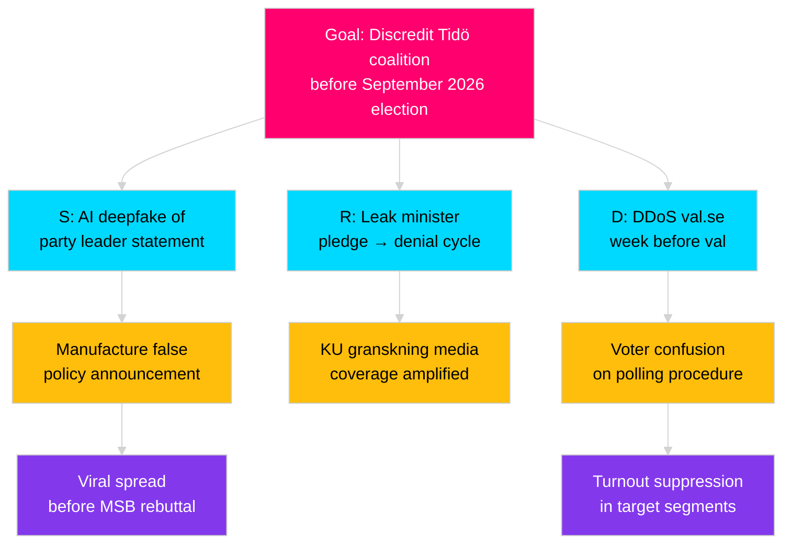
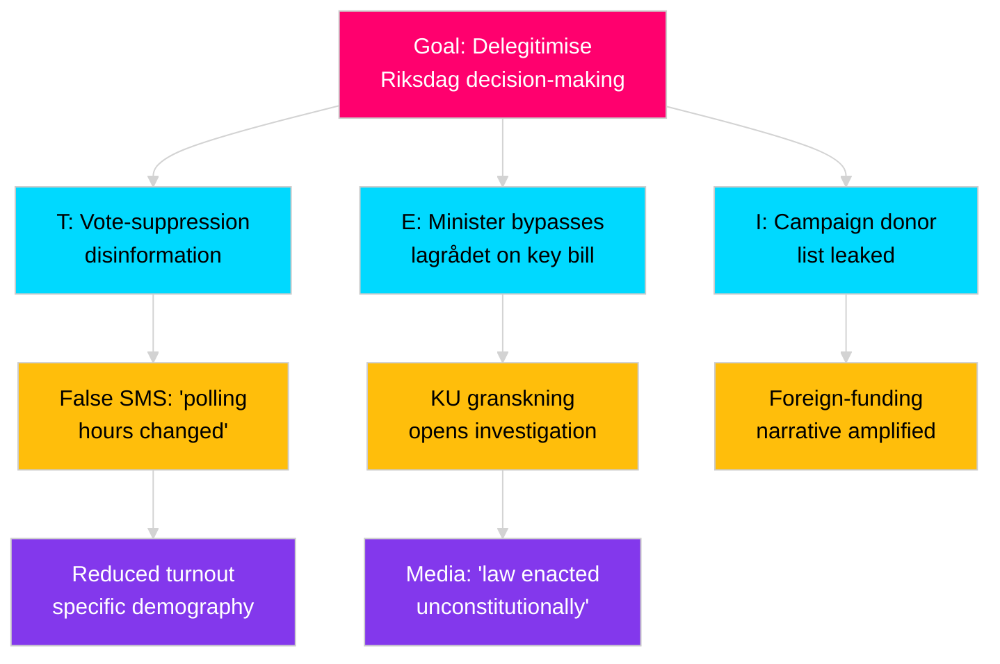

<!-- SPDX-FileCopyrightText: 2024-2026 Hack23 AB -->
<!-- SPDX-License-Identifier: Apache-2.0 -->

# Political STRIDE Assessment — {{ARTICLE_TYPE}} · {{ARTICLE_DATE}}

> **Analytical supplementary (optional).** STRIDE adapted to **political, electoral and institutional** threat surfaces. Produce for election-adjacent events, integrity incidents, disinformation spikes, critical-infrastructure votes, or any scoped entity where the adversary model matters. Pairs with `threat-analysis.md` (kill chain / MITRE mapping) and `risk-assessment.md` (Institutional + Corruption dimensions).
>
> **Methodology** → [`analysis/methodologies/analytical-supplementary-methodology.md § STRIDE-political`](../methodologies/analytical-supplementary-methodology.md#stride-political).
> **Not counted in the 23 core artifacts.** Non-blocking in `05-analysis-gate.md`.

## 🔄 Tradecraft Context

- **Artifact class** — Analytical supplementary (optional, never blocking)
- **Use when** — Election-adjacent events (within 180 days of val-dag), integrity incidents (FOI breach, ballot tampering allegation), disinformation spikes (MSB alert level elevated), critical-infrastructure votes, or any scoped entity where the adversary model and attack surface matter more than standard risk framing
- **Pairs with** — `threat-analysis.md` (kill chain / MITRE mapping), `risk-assessment.md` (Institutional + Corruption dimensions), `stakeholder-impact.md` (adversary / defender actor mapping), `wildcards-blackswans.md` (W5 deepfake / W3 hybrid attack scenarios)
- **Methodology** — [`analytical-supplementary-methodology.md § STRIDE-political`](../methodologies/analytical-supplementary-methodology.md#stride-political)
- **Workflow status** — Not counted in the 23 core artifacts; non-blocking in [`05-analysis-gate.md`](../../.github/prompts/05-analysis-gate.md)
- **Minimum depth floor** — 110 lines (Standard), 160 lines (Deep), 240 lines (Comprehensive / Tier-C)
- **STRIDE scoring rule** — `L × I ≥ 12` on a 1–5 × 1–5 scale triggers mandatory cross-reference to `threat-analysis.md` MITRE-TTP block and `risk-assessment.md §Institutional`

## 📋 Scope declaration

- **Entity under assessment** — [party / coalition / Riksdag committee / government agency / electoral system component / named institution — be specific; avoid "Swedish democracy" as unit]
- **Trust boundary** — define the system perimeter; examples: voter ↔ ballot counting system, MP ↔ voteringar recording, minister ↔ formal decision record, citizen ↔ FOI request channel, journalist ↔ source protection, party ↔ campaign finance register
- **Time horizon** — [pre-election (specify mo to val) / current governing cycle (specify riksmöte) / post-event recovery]
- **Adversary model** — classify primary adversary(ies) from: (a) nation-state (specify); (b) domestic political actor (specify party/faction); (c) insider (current/former employee/MP); (d) organised crime; (e) bad-faith opposition; (f) non-state ideological actor. Each adversary needs: motivation, capability level (1–5), and at least one known or assessed technique
- **Assessment confidence** — [🟢 High: ≥ 3 independent sources per dimension / 🟡 Medium: 1–2 sources / 🔴 Low: inferential, no direct evidence]

---

## 🎭 STRIDE × Political dimensions

> **Scoring guide:**
> - **Likelihood (L)** 1–5: 1 = Remote (< 5 %), 2 = Very unlikely (5–20 %), 3 = Unlikely (20–45 %), 4 = About even (45–55 %), 5 = Likely or above (> 55 %)
> - **Impact (I)** 1–5: 1 = Negligible, 2 = Minor, 3 = Moderate (disrupts normal function), 4 = Significant (forces agenda change), 5 = Severe (systemic/constitutional damage)
> - **Priority rule:** Any row with `L × I ≥ 12` → mandatory `threat-analysis.md` cross-reference AND `risk-assessment.md §Institutional` entry

### S — Spoofing of political identity

> Spoofing in the political context means an actor presents false credentials, identity, or authority to manipulate political decisions, public perception, or administrative records.

| Vector | Target | L (1–5) | I (1–5) | L×I | Mitigation (existing) | Residual risk | Evidence / analogue | Admiralty |
|--------|--------|---------|---------|-----|----------------------|--------------|---------------------|-----------|
| Impersonation of MP on social media (fake verified account) | Public opinion, media | 4 | 3 | 12 → ⚠️ | Platform integrity policies; MSB media-literacy campaigns | Medium (platforms inconsistent) | Facebook/Meta Sweden elections 2022 incident | C2 |
| Fake press release (domain clone of party/department) | Journalists, party staff | 3 | 4 | 12 → ⚠️ | HSTS + DMARC enforcement; brand monitoring | Medium | Multiple European cases (FRA 2022, DE 2021) | C2 |
| AI-generated voice/video deepfake of party leader | Voters, social media | 3 | 5 | 15 → 🚨 | MSB/NCSC detection pilot; platform moderation | High (no mandatory takedown law in SE) | Deepfake Slovak PM audio (2023); EU DSA Art. 34 | B2 |
| Ghost-candidate registration (identity theft for val) | Valmyndigheten register | 1 | 5 | 5 | Valmyndigheten identity verification; Skatteverket PIN cross-check | Low | No confirmed SE case; theoretical | C3 |
| Spoofed myndighet communication (phishing via @gov.se look-alike) | Civil servants, MPs | 3 | 3 | 9 | NCSC phishing detection; multi-factor on government email | Low-medium | CERT-SE incident reports 2024 | B2 |

**S-dimension priority summary** — Rows with L×I ≥ 12: AI deepfake (15), impersonation (12), fake press release (12). Deepfake is the highest-priority residual risk and requires proactive monitoring per `forward-indicators.md` W5 trigger.

---

### T — Tampering with political evidence or process

> Tampering in the political context covers any unauthorised modification of official records, data, or procedures.

| Vector | Target | L | I | L×I | Mitigation (existing) | Residual risk | Evidence / analogue | Admiralty |
|--------|--------|---|---|-----|----------------------|--------------|---------------------|-----------|
| Altering or fabricating Riksdag vote record (voteringar) | `voteringar` MCP / riksdagen.se | 1 | 5 | 5 | RA audit log + immutable record architecture; Riksdag IT | Low | No confirmed case; highest consequence | A2 |
| Editing betänkande draft before publication | Committee drafting staff | 2 | 4 | 8 | Version control + utskott secretary countersignature | Low-medium | Insider risk category | B3 |
| Physical ballot tampering (valdag) | Ballot envelopes at polling station | 1 | 5 | 5 | Paper audit trail; party observers at all stations; re-count rights | Low | No confirmed SE case | A2 |
| Voter-roll modification (Skatteverket folkbokförings-register) | Eligible voter list | 1 | 5 | 5 | PUL/GDPR + Skatteverket internal audit; Säkerhetspolisen oversight | Low | No confirmed SE case | A2 |
| Manipulation of government decision records (Regeringsregistret) | Ministry decision archives | 1 | 5 | 5 | OSL-classified + RA metadata | Low | Theoretical insider scenario | B3 |
| Social-media vote suppression (disinformation on polling hours / location) | Turnout — specific segments | 3 | 3 | 9 | Valmyndigheten public comms; MSB prebunking campaign | Medium | US/UK precedents; plausible in SE 2026 | C2 |

---

### R — Repudiation of political decision or commitment

> Repudiation occurs when an actor denies or disavows a political act, statement, or record they are accountable for.

| Vector | Example | L | I | L×I | Mitigation (existing) | Residual risk | Evidence | Admiralty |
|--------|---------|---|---|-----|----------------------|--------------|---------|-----------|
| MP denies registered vote (claims system error) | Post-vote challenge in media | 3 | 3 | 9 | Riksdag protokoll with H-nummer reference; public voteringar dataset | Low-medium | Common media claim; protocol defeats it | A1 |
| Minister denies written pledge / PM position | During interpellation; post-budget | 4 | 4 | 16 → 🚨 | Riksdag protokoll + KU granskning annual review | Medium (political cost only, not legal) | KU annual reviews routinely find such discrepancies | A1 |
| Party denies campaign manifesto commitment post-election | Coalition negotiation phase | 4 | 3 | 12 → ⚠️ | Party manifestos archived by SVT, media, academia | Low-medium | Standard in every Swedish coalition since 2006 | A1 |
| Agency denies FOI response or delays beyond Tryckfrihetsförordningen deadline | Citizen, journalist | 3 | 3 | 9 | Offentlighetsprincipen + JO-anmälan mechanism | Medium (JO enforcement slow) | JO annual report 2024–25 | B2 |
| Coalition partner denies agreed policy in press | Cross-Tidö public disagreement | 4 | 3 | 12 → ⚠️ | Government programme text; samordningskansli notes | Medium | Regular phenomenon in multi-party coalition | B2 |

---

### I — Information disclosure (political secrecy violations)

| Vector | Data class | L | I | L×I | Mitigation (existing) | Residual risk | Evidence | Admiralty |
|--------|-----------|---|---|-----|----------------------|--------------|---------|-----------|
| Leaked draft legislation before remiss | Sekretess — utarbetad prop. | 3 | 3 | 9 | OSL 15:1–2 classification; need-to-know in Finansdepartementet | Medium | Budget leaks historically common in SE | B2 |
| Unauthorised publication of committee (closed) minutes | Sekretess — KU | 2 | 4 | 8 | TF 2:2 combined with OSL; KU secretary clearance | Low-medium | Rare but occurred in parliamentary commissions | B3 |
| Campaign donor list / hidden foreign funding | Transparency register gaps | 3 | 4 | 12 → ⚠️ | Lag om insyn (SFS 2018:90) since 2019; still gaps for sub-threshold donors | Medium | Riksdag scrutiny 2024; EU FDISR recommendation | B2 |
| Intelligence / security briefing to PM office exposure | MUST/SÄPO assessment | 1 | 5 | 5 | Protective security (Säkerhetsskyddslagen SFS 2018:585); NSA-equivalent | Low | No confirmed SE case | A2 |
| MP personal data / kompromat leak | Personal (not public-interest) | 2 | 3 | 6 | GDPR + Riksdag internal policy | Low-medium | Targeted harassment cases documented in EU region | C2 |

---

### D — Denial of democratic function

| Vector | Target | L | I | L×I | Mitigation (existing) | Residual risk | Evidence | Admiralty |
|--------|--------|---|---|-----|----------------------|--------------|---------|-----------|
| DDoS on val.se / Valmyndigheten infrastructure (election night) | Real-time vote reporting | 3 | 4 | 12 → ⚠️ | Valmyndigheten CDN + MSB incident plan; NATO CCDCOE support | Medium | Estonia 2007 analogue; SE infrastructure upgraded post-NATO | B2 |
| Filibuster / procedural abuse beyond normal RF limits | Kammaren plenary schedule | 3 | 2 | 6 | Talmannen's order powers; kammaren's regler; HD precedent | Low | Isolated incidents; no structural risk currently | A1 |
| Prolonged parliamentary paralysis (confidence-vote loop) | RF 6:5 dissolution trigger | 2 | 5 | 10 | Regeringsformen Chapter 6 mandatory dissolution | Low-medium | Theoretical; relevant if coalition fragment scenario (W1 in wildcards) | A2 |
| Disinformation saturation — crowd-out of factual campaign information | Media ecosystem, undecided voters | 4 | 3 | 12 → ⚠️ | MSB prebunking; SVT/DN fact-check; Valmyndigheten voter information | Medium | Documented in 2022 SE election; elevated risk 2026 | B2 |
| Critical infrastructure attack forcing election postponement | Election logistics (postal voting, counting centres) | 1 | 5 | 5 | RF does not easily permit postponement; extreme edge case | Low | Theoretical; no RF mechanism for postponement without constitutional amendment | A2 |

---

### E — Elevation of political privilege

| Vector | Example | L | I | L×I | Mitigation (existing) | Residual risk | Evidence | Admiralty |
|--------|---------|---|---|-----|----------------------|--------------|---------|-----------|
| Proxy-voting abuse (MP voting for absent colleague) | Kammaren voteringar | 2 | 3 | 6 | Närvaro-kontroll; electronic voting log per MP | Low | Isolated incidents previously identified by Riksdag audit | A1 |
| Committee-chair unilateral agenda manipulation | Utskottsordförande excluding motions from agenda | 2 | 3 | 6 | Utskottsreglemente + vice-chair counter-rights | Low-medium | JO granskning has found procedural abuses historically | A1 |
| Minister bypassing lagrådet / remiss | Rushed legislation without standard referral | 3 | 4 | 12 → ⚠️ | Lagrådet constitutional advisory opinion; JO granskning | Medium (increasingly used since 2022) | KU annual report 2023–24 | A1 |
| Regulatory capture (styrning av myndighet outside instruktion) | Myndighet receives informal political instructions | 3 | 4 | 12 → ⚠️ | Myndighetsförordning; JO + KU oversight; instruktion | Medium | KU has investigated several cases; recurring structural tension | A1 |
| Undisclosed conflict of interest in procurement decision | Minister / senior official award to connected party | 2 | 4 | 8 | Offentlighets- och sekretesslagen; KA/KO oversight; FOI rights | Medium (detection lag) | Documented EU-wide; SE Statskontoret reviews show instances | B2 |

---

## 🌀 Attack trees (≥ 2)

### Attack tree A — Discredit governing party pre-election (Spoofing + Repudiation)



### Attack tree B — Undermine parliamentary integrity (Tampering + Elevation)



---

## 🔗 MITRE ATT&CK–style TTP mapping (political adaptation)

> Rows with priority level 🚨 or ⚠️ (L×I ≥ 12) MUST appear in `threat-analysis.md §TTP Mapping`. Remaining rows are `[OPTIONAL cross-ref]`.

| Tactic | Technique (political adaptation) | STRIDE dimension | L×I | Observed / assessed | Cross-link to threat-analysis | Priority |
|--------|----------------------------------|-----------------|----|---------------------|------------------------------|----------|
| Reconnaissance | OSINT profiling of MPs via open Riksdag data + social media | S, I | 6 | Assessed (standard tradecraft) | threat-analysis §Recon | Optional |
| Resource development | Domain typosquat (`sv-riksdagen.se` etc.) | S | 9 | Observed (2023 EU campaigns) | threat-analysis §Resource dev | Optional |
| Initial access | Social-engineering party/ministry staffer via LinkedIn/email | T, I | 9 | Assessed (phishing campaigns documented by CERT-SE) | threat-analysis §Initial access | Optional |
| Execution | Publish AI-fabricated quote/video attributed to named leader | S | 15 | Assessed — elevated pre-election | threat-analysis §Execution | 🚨 Mandatory |
| Persistence | Infiltrate party youth wing or local constituency organisation | E (elevation) | 9 | Assessed (historical analogue: Soviet-era influence ops) | threat-analysis §Persistence | Optional |
| Privilege escalation | Exploit informal coalition loyalty to obtain non-public document | E, I | 12 | Assessed — known structural tension | threat-analysis §Escalation | ⚠️ Mandatory |
| Defence evasion | Use cut-out social media accounts; plausible-deniability attribution | S, D | 12 | Assessed — documented in EU hybrid threat reports | threat-analysis §Evasion | ⚠️ Mandatory |
| Collection | Scrape and correlate public Riksdag debate records + social media | I | 6 | Observed — open-source | threat-analysis §Collection | Optional |
| Impact | Drop target party's vote-share via sustained epistemic attack | D, S | 15 | Assessed — documented in comparable elections (FR 2017, US 2016) | threat-analysis §Impact | 🚨 Mandatory |

---

## 🛡 Recommended controls (mapped to Hack23 ISMS + frameworks)

> **Prioritisation** — address all 🚨 controls before election -90 days; ⚠️ controls before election -180 days.

| Control | STRIDE dimension(s) | ISO 27001:2022 | NIST CSF 2.0 | CIS Controls v8.1 | Owner | Priority | Status |
|---------|---------------------|---------------|--------------|-------------------|-------|----------|--------|
| Mandatory deepfake-detection pipeline for pre-election media | S (AI deepfake) | A.8.16 Monitoring | DE.CM-1 | CIS-8 | MSB / NCSC | 🚨 Pre-election | Not in place |
| DMARC + BIMI enforcement on all riksdagen.se / regeringen.se domains | S (domain spoof) | A.8.20 Network security | PR.AC-5 | CIS-9 | Riksdag IT / Digg | 🚨 | Partial |
| KU granskning annual response time SLA | R (minister repudiation) | A.5.36 Compliance monitoring | GV.OV-2 | CIS-6 | KU secretariat | ⚠️ | Existing (slow) |
| Party donor transparency register real-time disclosure | I (donor list) | A.5.34 Privacy | PR.DS-5 | CIS-3 | Riksdag administration | ⚠️ | Partial (SFS 2018:90) |
| Val.se DDoS resilience test + MSB tabletop exercise | D (DDoS) | A.8.8 Incident management | RS.RP-1 | CIS-17 | Valmyndigheten + MSB | ⚠️ | Scheduled |
| Mandatory lagrådet consultation for all time-sensitive legislation | E (bypass lagrådet) | A.5.36 Compliance | GV.PO-1 | CIS-6 | Justitiedepartementet | ⚠️ | Exists — enforcement gap |
| Myndighets-styrning instruction review (independence audit) | E (regulatory capture) | A.6.3 Awareness | GV.OV-3 | CIS-14 | Statsrådsberedningen | ⚠️ | Annual review exists |
| Voter turnout SMS prebuking campaign (false timing disinformation) | D (vote suppression) | A.8.16 | DE.CM-4 | CIS-17 | Valmyndigheten | ⚠️ | Planned 2026 |

---

## 🗳️ Election 2026 STRIDE lens

> Mandatory when `{{ARTICLE_TYPE}}` is `election-2026-analysis` or when assessment is run within 180 days of val-dag.

| STRIDE dimension | Elevated risk in election period | Primary actor | Window | Key mitigation gap |
|-----------------|----------------------------------|--------------|--------|-------------------|
| S — Spoofing | Deepfake of party leaders on social media in final 4 weeks | Nation-state or domestic disinfo actor | Election -28 to 0 days | No mandatory takedown law in Sweden; DSA Art. 34 applies but enforcement slow |
| T — Tampering | Vote-suppression disinformation (false polling info) | Domestic/external bad actors | Election -7 to +0 days | MSB prebunking must start ≥ 6 months before val |
| R — Repudiation | Coalition commitment denial during government formation | Domestic (parties) | Election +0 to +60 days (government formation) | Institutional: no enforceable manifesto commitment mechanism |
| I — Disclosure | Campaign finance transparency gaps | Investigative media / political opponents | Election -12 months | Lag om insyn subthreshold still not covers all funding |
| D — Denial | DDoS on election results infrastructure | Nation-state | Election night | Valmyndigheten / MSB joint exercise recommended by October 2026 |
| E — Elevation | Caretaker government taking major decisions post-election | Domestic (outgoing coalition) | Election +0 to +60 days | RF 12:6 restricts caretaker; enforcement via KU retrospectively |

---

## 🎯 PIR feedback

| PIR | Covered dimension(s) | Coverage quality (H/M/L) | Gap | Recommended action |
|-----|-------------------|--------------------------|-----|-------------------|
| PIR-1 Coalition stability | R (repudiation), E (elevation / lagrådet bypass) | Medium | STRIDE covers processes, not political content | Cross-reference session-baseline coalition vote discipline |
| PIR-2 Economic trajectory | I (budget leaks), R (fiscal pledge repudiation) | Low | Economic content better covered in PESTLE | No action needed here |
| PIR-3 Security / threats | All STRIDE dimensions | High | Nation-state attribution is assessmental only | Escalate specific vectors to threat-analysis.md |

---

## 🔗 Cross-links

- [`threat-analysis.md`](threat-analysis.md) — deeper kill-chain + MITRE canonical mapping; rows with L×I ≥ 12 MUST appear there
- [`risk-assessment.md`](risk-assessment.md) — Institutional + Corruption dimensions source from STRIDE E and R rows
- [`stakeholder-impact.md`](stakeholder-impact.md) — adversary / defender actor mapping uses STRIDE scope adversary model
- [`scenario-analysis.md`](scenario-analysis.md) — worst-case scenario uses STRIDE attack-tree endpoints as trigger
- [`wildcards-blackswans.md`](wildcards-blackswans.md) — W5 (deepfake) and W3 (hybrid attack) directly mirror STRIDE S and D dimensions
- [`forward-indicators.md`](forward-indicators.md) — STRIDE early-warning signals per W5, W3 populate indicator table
- [`media-framing-analysis.md`](media-framing-analysis.md) — STRIDE S (spoofing) and D (disinformation) connect to media narrative tracking

---

**Template version:** v2.0 · **Last updated:** 2026-04-25

---

## ✅ Pass-2 Self-Audit Checklist (v4.4 — required)

> **Purpose:** AI-FIRST principle requires a Pass-2 read-back-and-improve. After producing this artifact in Pass 1, re-read it end-to-end and verify each item below. Document any remediation in [`methodology-reflection.md`](methodology-reflection.md) §"Pass-2 audit log". Any unchecked ❌ box at the end of Pass 2 forces a Pass-3 rewrite of the affected section.

- [ ] **Tradecraft anchors honoured** — F3EAD stage matches the artifact's role; PIRs declared in the §Tradecraft Context block are actually addressed in the body; Admiralty grades attached to every external source; WEP band + ODNI confidence on every probabilistic judgement.
- [ ] **Source diversity floor met** — at least the minimum number of independent MCP sources required by the artifact's tradecraft block are cited; single-source claims are explicitly labelled `[SINGLE-SOURCE — corroboration pending]`.
- [ ] **Evidence specificity** — every quantified claim cites a `dok_id` (Riksdag), an SCB / IMF dataflow code, or a named external source with date; no "according to data" / "studies show" hand-waves.
- [ ] **Named-actor discipline** — every political claim names ≥ 1 person (party + role + dated act/quote) or labels the absence (`[diffuse — no named actor]`).
- [ ] **Counter-narrative present** — at least one explicit competing hypothesis, dissent quote, or framed objection appears in the body; "no opposition recorded" is itself a finding to label, not silence.
- [ ] **Election 2026 lens applied** — the §"Election 2026 Implications" subsection (or equivalent) addresses electoral salience, coalition pressure, and forward indicators; not boilerplate.
- [ ] **No illustrative content shipped as fact** — every `[REQUIRED]` placeholder is filled OR removed; every `Example:` block is clearly fenced or removed; no fabricated `dok_id`, vote count, or quote leaks into the final artifact.
- [ ] **Cross-references resolve** — every `[link](file.md)` in this artifact points to a file that exists in the run folder (`analysis/daily/$ARTICLE_DATE/$SUBFOLDER/`) or to a methodology / template under `analysis/`.
- [ ] **Mermaid renders** — every fenced ` ```mermaid ` block parses (no missing class definitions, no orphan nodes, no >40-node graphs that overflow viewport on mobile).
- [ ] **Line-floor check** — artifact length ≥ the per-artifact floor in [`reference-quality-thresholds.json`](../methodologies/reference-quality-thresholds.json); shorter artifacts trigger Pass-2 rewrite, never a `[truncated]` note.

