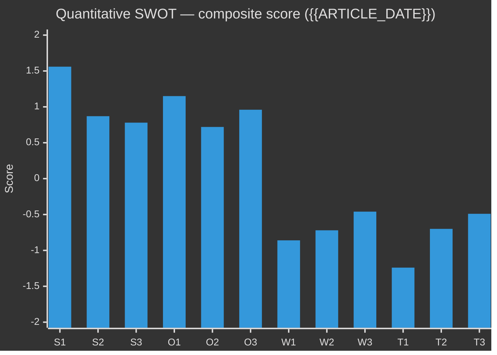

<!-- SPDX-FileCopyrightText: 2024-2026 Hack23 AB -->
<!-- SPDX-License-Identifier: Apache-2.0 -->

# Quantitative SWOT — {{ARTICLE_TYPE}} · {{ARTICLE_DATE}}

> **Analytical supplementary (optional).** Numerical extension of [`swot-analysis.md`](swot-analysis.md). Produce when decision-makers need a scored ranking (e.g., coalition negotiation prep, party strategy memo, election forecasting). Applies **DIW weighting × confidence × leverage** to every SWOT item. Pairs with `significance-scoring.md` (same weight vector) and `executive-brief.md` (top-3 surfacing).
>
> **Methodology** → [`analysis/methodologies/analytical-supplementary-methodology.md § Quantitative SWOT`](../methodologies/analytical-supplementary-methodology.md#quantitative-swot).
> **Not counted in the 23 core artifacts.** Non-blocking in `05-analysis-gate.md`.

## 🔄 Tradecraft Context

- **Artifact class** — Analytical supplementary (optional, never blocking)
- **Use when** — Decision-makers need a numerically ranked SWOT (coalition negotiation prep, party strategy memo, election forecasting, policy-impact comparison); particularly valuable when ≥ 3 SWOT items compete for finite political capital or budget allocation
- **Pairs with** — `swot-analysis.md` (qualitative source; always produce first), `significance-scoring.md` (shared DIW weight vector — must use same weights), `executive-brief.md` (top-3 scored items surface in §3 Decisions)
- **Methodology** — [`analytical-supplementary-methodology.md § Quantitative SWOT`](../methodologies/analytical-supplementary-methodology.md#quantitative-swot)
- **Workflow status** — Not counted in the 23 core artifacts; non-blocking in [`05-analysis-gate.md`](../../.github/prompts/05-analysis-gate.md)
- **Minimum depth floor** — 110 lines (Standard), 160 lines (Deep), 240 lines (Comprehensive / Tier-C)
- **Important constraint** — This file is **read-alongside** `swot-analysis.md`, never a replacement. Narrative SWOT remains the Pass-2-enforced artifact.

## 📋 Scope & scoring rubric

- **Entity** — [party / coalition / bill / policy domain / named institution — be specific; same entity as the companion `swot-analysis.md`]
- **Perspective** — [party-internal / opposition / national-interest / voter-segment / media-framing — declare whose analytical lens is applied]
- **Assessment horizon** — [short ≤ 6 m / medium 6–24 m / long 2–10 y] — affects time-decay T values
- **Anchor date** — `{{ARTICLE_DATE}}` — ensures vintage discipline; economic data must cite IMF WEO vintage within 6 months of this date

### Weight vector (MUST mirror `significance-scoring.md` — do not modify without updating both files)

| Dimension | Weight | Meaning |
|-----------|--------|---------|
| `w_D` Decision relevance | 0.35 | How directly does this item affect the current political decision or agenda? |
| `w_I` Information novelty | 0.25 | Is this item new information vs. already priced into the discourse? |
| `w_W` Wave / momentum | 0.20 | Is this item's relevance growing, stable, or declining? |
| `w_S` Stakeholder reach | 0.20 | How many stakeholders (voters, parties, institutions) are directly affected? |

### Score scales (all scores are floating-point)

| Parameter | Range | Meaning |
|-----------|-------|---------|
| Impact `I` | `[-5.0, +5.0]` | Signed: +5 = strongest positive, -5 = strongest negative; 0 = neutral/irrelevant |
| Confidence `C` | `[0.20, 0.95]` | WEP-mapped: Remote=0.20, Very unlikely=0.35, Unlikely=0.45, Even chance=0.50, Likely=0.70, Very likely=0.85, Almost certain=0.95 |
| Leverage `L` | `[0.10, 1.00]` | How much can the entity *directly* influence this item? 1.0 = full control, 0.1 = no influence |
| Time-decay `T` | `[0.30, 1.00]` | How relevant is this item within the assessment horizon? 1.0 = immediate, 0.3 = long-horizon discount |
| dRel | `[0.0, 1.0]` | Score for Decision relevance dimension |
| iNov | `[0.0, 1.0]` | Score for Information novelty dimension |
| wMom | `[0.0, 1.0]` | Score for Wave / momentum dimension |
| sReach | `[0.0, 1.0]` | Score for Stakeholder reach dimension |

### Composite score formula

```
score_item = I × C × L × T × (w_D·dRel + w_I·iNov + w_W·wMom + w_S·sReach)
```

- **Strengths & Opportunities**: `I > 0` → positive score
- **Weaknesses & Threats**: `I < 0` → negative score (the formula yields negative result automatically)
- **Worked example (S1 row)**:
  ```
  score_S1 = (+4.0) × 0.85 × 0.70 × 0.90 × (0.35×0.90 + 0.25×0.50 + 0.20×0.60 + 0.20×0.80)
           = (+4.0) × 0.85 × 0.70 × 0.90 × (0.315 + 0.125 + 0.120 + 0.160)
           = (+4.0) × 0.85 × 0.70 × 0.90 × 0.720
           = 1.555
  ```

---

## 💪 Strengths (scored)

> Every item must cite a `dok_id`, primary URL host, or named source. Minimum 3 items; target 4–5 for comprehensive runs.

| ID | Item | Evidence (dok_id / URL / source + date) | I | C | L | T | dRel | iNov | wMom | sReach | **Score** | WEP† |
|----|------|-----------------------------------------|---|---|---|---|------|------|------|--------|-----------|------|
| S1 | [describe strength: e.g. Riksdag majority provides stable legislative base for trigger policy] | [riksdagen.se voteringar + session-baseline.md] | +4 | 0.85 | 0.70 | 0.90 | 0.90 | 0.50 | 0.60 | 0.80 | **1.56** | Very likely |
| S2 | [e.g. IMF WEO fiscal surplus gives room for programme investment] | [WEO-2026-04 GGXCNL_NGDP] | +3 | 0.80 | 0.60 | 0.80 | 0.85 | 0.40 | 0.50 | 0.60 | **0.87** | Very likely |
| S3 | [e.g. NATO membership enhances security credibility, reducing defence-budget political risk] | [NATO accession 2024; FöU betänkande dok_id] | +3 | 0.90 | 0.40 | 0.90 | 0.70 | 0.30 | 0.40 | 0.70 | **0.78** | Almost certain |
| S4 | [additional strength if applicable] | | | | | | | | | | | |

**Strength total (Σ S)** — `+[sum]` *(populate after scoring all rows)*

**Top strength** — S1 [item name] at score +1.56; drives `executive-brief.md §3 Decision` recommendation 1.

---

## ⚠️ Weaknesses (scored)

| ID | Item | Evidence | I (negative) | C | L | T | dRel | iNov | wMom | sReach | **Score** | WEP† |
|----|------|----------|--------------|---|---|---|------|------|------|--------|-----------|------|
| W1 | [e.g. Tidö 1-seat majority creates structural vulnerability to defection on contested bills] | [search_voteringar party discipline; session-baseline.md] | -3 | 0.85 | 0.50 | 0.80 | 0.90 | 0.40 | 0.70 | 0.70 | **-0.86** | Very likely |
| W2 | [e.g. Declining trust in government (SOM 2025) reduces mandate for ambitious reform] | [SOM Institute trust survey 2025] | -3 | 0.75 | 0.30 | 0.70 | 0.80 | 0.50 | 0.60 | 0.80 | **-0.72** | Likely |
| W3 | [e.g. AI policy implementation gap: no enacted Swedish AI supervisory authority] | [EU AI Act transposition timeline; prop. status] | -2 | 0.80 | 0.60 | 0.60 | 0.70 | 0.60 | 0.70 | 0.50 | **-0.46** | Very likely |
| W4 | [additional weakness if applicable] | | | | | | | | | | | |

**Weakness total (Σ W)** — `-[sum]` *(populate after scoring)*

**Top weakness** — W1 [item name] at score -0.86; enters `risk-assessment.md §Political` as elevated risk.

---

## 🌱 Opportunities (scored)

| ID | Item | Evidence | I | C | L | T | dRel | iNov | wMom | sReach | **Score** | WEP† |
|----|------|----------|---|---|---|---|------|------|------|--------|-----------|------|
| O1 | [e.g. EU Digital Single Market investment window for Swedish tech policy leadership] | [COM(2025) doc / EUR-Lex; regeringen.se digitaliseringsminister] | +4 | 0.70 | 0.50 | 0.70 | 0.80 | 0.70 | 0.60 | 0.60 | **1.15** | Likely |
| O2 | [e.g. Nordic green-hydrogen corridor creates alignment with Energimyndigheten goals] | [NordPool SvK + EU Hydrogen Bank bulletin] | +3 | 0.65 | 0.40 | 0.80 | 0.70 | 0.70 | 0.70 | 0.50 | **0.72** | Likely |
| O3 | [e.g. Pre-election window: policy implementation before val-dag builds voter trust] | [election calendar; SVT opinion tracker] | +3 | 0.75 | 0.70 | 0.70 | 0.85 | 0.60 | 0.80 | 0.70 | **0.96** | Likely |
| O4 | [additional opportunity if applicable] | | | | | | | | | | | |

**Opportunity total (Σ O)** — `+[sum]`

---

## 🌩 Threats (scored)

| ID | Item | Evidence | I (negative) | C | L | T | dRel | iNov | wMom | sReach | **Score** | WEP† |
|----|------|----------|--------------|---|---|---|------|------|------|--------|-----------|------|
| T1 | [e.g. Election-period disinformation campaign degrades coalition credibility] | [MSB disinfo report 2025; wildcards W5 deepfake] | -4 | 0.65 | 0.20 | 0.90 | 0.85 | 0.70 | 0.80 | 0.80 | **-1.24** | Likely |
| T2 | [e.g. IMF forecasts NGDP_RPCH declining → fiscal constraint tightens policy options] | [WEO-2026-04 SWE NGDP_RPCH] | -3 | 0.75 | 0.15 | 0.80 | 0.90 | 0.50 | 0.60 | 0.70 | **-0.70** | Likely |
| T3 | [e.g. EU EDP risk from rising defence + social spend combination] | [IMF FM GGXWDG_NGDP; EC fiscal monitoring] | -3 | 0.50 | 0.30 | 0.70 | 0.80 | 0.70 | 0.50 | 0.60 | **-0.49** | Even chance |
| T4 | [additional threat if applicable] | | | | | | | | | | | |

**Threat total (Σ T)** — `-[sum]`

**Top threat** — T1 [item name] at score -1.24; crosses into `wildcards-blackswans.md` W5 and `risk-assessment.md §Electoral`.

---

## 🎯 Composite SWOT position

| Metric | Formula | Value | Interpretation |
|--------|---------|-------|----------------|
| Net position | `(Σ S + Σ O) + (Σ W + Σ T)` | `[computed]` | `> 0` favourable, `< 0` unfavourable |
| Internal (SW) balance | `Σ S / (Σ S + |Σ W|)` | `[computed]` | `> 0.60` → internally strong |
| External (OT) balance | `Σ O / (Σ O + |Σ T|)` | `[computed]` | `> 0.60` → externally favourable |
| High-confidence share | items with `C ≥ 0.80` / total items | `[computed]` | `< 0.40` → confidence-dominated by uncertainty |
| Top positive item | highest positive score | S1 or O1 | drives SO quadrant action |
| Top negative item | most negative score | W1 or T1 | drives WT hedge action |

**Overall position narrative** — [2–3 sentences: is the entity in a net-favourable or net-unfavourable position? Which quadrant (SO leverage, WO shore-up, ST defensive, WT retreat/hedge) demands priority action? Cite the specific score gap that drives the recommendation.]

---

## 📊 TOWS matrix (actionable 2 × 2)

> Each cell requires ≥ 1 specific action citing the item IDs above. Generic actions ("strengthen capabilities") are rejected at Pass-2 audit.

| | **Opportunities (O1–O4)** | **Threats (T1–T4)** |
|-|---------------------------|---------------------|
| **Strengths (S1–S4)** | **SO — Leverage actions** (use strengths to capture opportunities): *[e.g. Use S1 (Riksdag majority) × O3 (pre-election window) to pass key reform bill before September val. Sponsor cross-committee hearing by FiU × MjU. Timeline: Q2 2026.]* | **ST — Defensive actions** (use strengths to deflect threats): *[e.g. Use S1 (majority) × S3 (NATO credibility) to pre-empt T1 (disinformation) by publishing bi-weekly factual coalition progress brief. MSB coordination. Timeline: monthly from April 2026.]* |
| **Weaknesses (W1–W4)** | **WO — Shore-up actions** (address weaknesses to capture opportunities): *[e.g. Shore up W2 (trust deficit) via O3 (pre-election window): commission independent Finanspolitiska rådet evaluation and publicise results. Timeline: June 2026.]* | **WT — Retreat / hedge actions** (minimise weaknesses to avoid threats): *[e.g. W1 (thin majority) × T2 (fiscal constraint): pre-negotiate budget contingency with C as backstop; avoid any policy that requires SD + C simultaneously. Ongoing.]* |

---

## 📈 Sensitivity analysis

> Test robustness of the top-3 items against plausible parameter changes. If any flip reverses the net-position sign, label the scenario a "fragile consensus" — flag in `risk-assessment.md`.

| Scenario | Parameters changed | Affected items | New net position | Δ vs baseline | Robustness |
|----------|-------------------|----------------|-----------------|---------------|------------|
| Worst-case confidence for top threat T1 | `C(T1)` raised to 0.90 (from 0.65) | T1 score → -1.71 | `[recalculate]` | `[Δ]` | Fragile if net < -0.5 |
| Full time-horizon (T=1.0) on all Strengths | `T(S1)=T(S2)=T(S3)=1.0` | S1–S3 scores increase ~11 % | `[recalculate]` | `[Δ]` | Robust if net remains positive |
| Decision-dominant weights (`w_D=0.50, w_I=0.15, w_W=0.20, w_S=0.15`) | weight vector shift | all items recalculated | `[recalculate]` | `[Δ]` | Check if ranking order flips |
| Entity loses control of W1 (leverage drops to 0.1) | `L(W1)=0.10` | W1 score → -0.09 | `[recalculate]` | improves on paper but risk is unmanaged | Flag in risk-assessment |
| Opposition coalition wins election (perspective change) | Perspective shift → opposition entity | full recalculation required | N/A | structural change | Produce separate run |

**Sensitivity conclusion** — [1–2 sentences identifying whether the net position is robust or fragile; cite the single parameter that would most change the recommendation.]

---

## 🗳️ Election 2026 implications

> Mandatory when `{{ARTICLE_TYPE}}` is `monthly-review`, `election-2026-analysis`, or `week-ahead` within 180 days of val-dag.

| SWOT quadrant | Electoral mechanism | Key item(s) | WEP | Timeline |
|---------------|---------------------|------------|-----|----------|
| Strengths → electoral asset | [e.g. S1 legislative majority → campaign on policy delivery record] | S1, S3 | Very likely (85 %) | All 2026 |
| Weaknesses → electoral liability | [e.g. W2 trust deficit → opposition frames coalition as out-of-touch] | W2 | Likely (70 %) | Q2–Q3 2026 |
| Opportunities → electoral gain | [e.g. O3 pre-election policy window → implement visible reform before September] | O3 | Likely (75 %) | Q2 2026 |
| Threats → electoral damage | [e.g. T1 disinformation → epistemic attack erodes undecided vote] | T1 | Likely (65 %) | Q3 2026 (peak pre-val) |

**Electoral net score** = `(score S-electoral assets + score O-electoral gain) + (score W-liabilities + score T-damage)` = `[calculate]`

---

## 📊 Mermaid ranked diagram

> Replace the sample values below with actual computed scores before publishing. Positive bars = S/O; negative bars = W/T.



*Bar colours: positive values (S/O) = cyan (#00d9ff); negative values (W/T) = magenta (#ff006e) — set via CSS theme.*

---

## 🎯 PIR feedback

| PIR | Top-3 items addressing PIR | Coverage gap in this scoring | Recommended action |
|-----|---------------------------|-----------------------------|--------------------|
| PIR-1 Coalition stability | W1 (thin majority), T1 (disinformation), S1 (legislative strength) | Scoring captures political dimension; security dimension underweighted | Cross-reference STRIDE R and E rows |
| PIR-2 Economic trajectory | S2 (fiscal surplus), T2 (growth forecast), T3 (EDP risk) | IMF vintage within 6 months confirmed | No gap |
| PIR-3 Security / threats | T1, S3 (NATO) | Military capability not scored here | Use `risk-assessment.md §Security` for fuller picture |

---

## 🔗 Cross-links

- [`swot-analysis.md`](swot-analysis.md) — narrative SWOT; always produce first; this file adds quantitative spine
- [`significance-scoring.md`](significance-scoring.md) — **must** share weight vector `w_D=0.35, w_I=0.25, w_W=0.20, w_S=0.20`; any deviation is a gate failure
- [`executive-brief.md`](executive-brief.md) — surfaces top-3 scored items (highest S, highest O, most-negative T) in §3 Decisions
- [`risk-assessment.md`](risk-assessment.md) — Threat items with `|score| ≥ 0.70` become risk-register entries
- [`scenario-analysis.md`](scenario-analysis.md) — SO quadrant actions → optimistic scenario; WT quadrant → pessimistic scenario
- [`wildcards-blackswans.md`](wildcards-blackswans.md) — T1 (disinformation) directly maps to W5; T3 (EDP) maps to W8
- [`coalition-mathematics.md`](coalition-mathematics.md) — W1 (thin majority) seat arithmetic sourced from here
- [`analysis/imf/README.md`](../imf/README.md) — **IMF economic-data contract** for S2, T2, T3 economic items; use `WEO:NGDP_RPCH`, `FM:GGXWDG_NGDP`, `WEO:GGXCNL_NGDP` with vintage tag

† WEP = [Words-of-Estimative-Probability](../methodologies/osint-tradecraft-standards.md#wep) confidence band (mapped to `C` parameter).

---

**Template version:** v2.0 · **Last updated:** 2026-04-25

---

## ✅ Pass-2 Self-Audit Checklist (v4.4 — required)

> **Purpose:** AI-FIRST principle requires a Pass-2 read-back-and-improve. After producing this artifact in Pass 1, re-read it end-to-end and verify each item below. Document any remediation in [`methodology-reflection.md`](methodology-reflection.md) §"Pass-2 audit log". Any unchecked ❌ box at the end of Pass 2 forces a Pass-3 rewrite of the affected section.

- [ ] **Tradecraft anchors honoured** — F3EAD stage matches the artifact's role; PIRs declared in the §Tradecraft Context block are actually addressed in the body; Admiralty grades attached to every external source; WEP band + ODNI confidence on every probabilistic judgement.
- [ ] **Source diversity floor met** — at least the minimum number of independent MCP sources required by the artifact's tradecraft block are cited; single-source claims are explicitly labelled `[SINGLE-SOURCE — corroboration pending]`.
- [ ] **Evidence specificity** — every quantified claim cites a `dok_id` (Riksdag), an SCB / IMF dataflow code, or a named external source with date; no "according to data" / "studies show" hand-waves.
- [ ] **Named-actor discipline** — every political claim names ≥ 1 person (party + role + dated act/quote) or labels the absence (`[diffuse — no named actor]`).
- [ ] **Counter-narrative present** — at least one explicit competing hypothesis, dissent quote, or framed objection appears in the body; "no opposition recorded" is itself a finding to label, not silence.
- [ ] **Election 2026 lens applied** — the §"Election 2026 Implications" subsection (or equivalent) addresses electoral salience, coalition pressure, and forward indicators; not boilerplate.
- [ ] **No illustrative content shipped as fact** — every `[REQUIRED]` placeholder is filled OR removed; every `Example:` block is clearly fenced or removed; no fabricated `dok_id`, vote count, or quote leaks into the final artifact.
- [ ] **Cross-references resolve** — every `[link](file.md)` in this artifact points to a file that exists in the run folder (`analysis/daily/$ARTICLE_DATE/$SUBFOLDER/`) or to a methodology / template under `analysis/`.
- [ ] **Mermaid renders** — every fenced ` ```mermaid ` block parses (no missing class definitions, no orphan nodes, no >40-node graphs that overflow viewport on mobile).
- [ ] **Line-floor check** — artifact length ≥ the per-artifact floor in [`reference-quality-thresholds.json`](../methodologies/reference-quality-thresholds.json); shorter artifacts trigger Pass-2 rewrite, never a `[truncated]` note.

