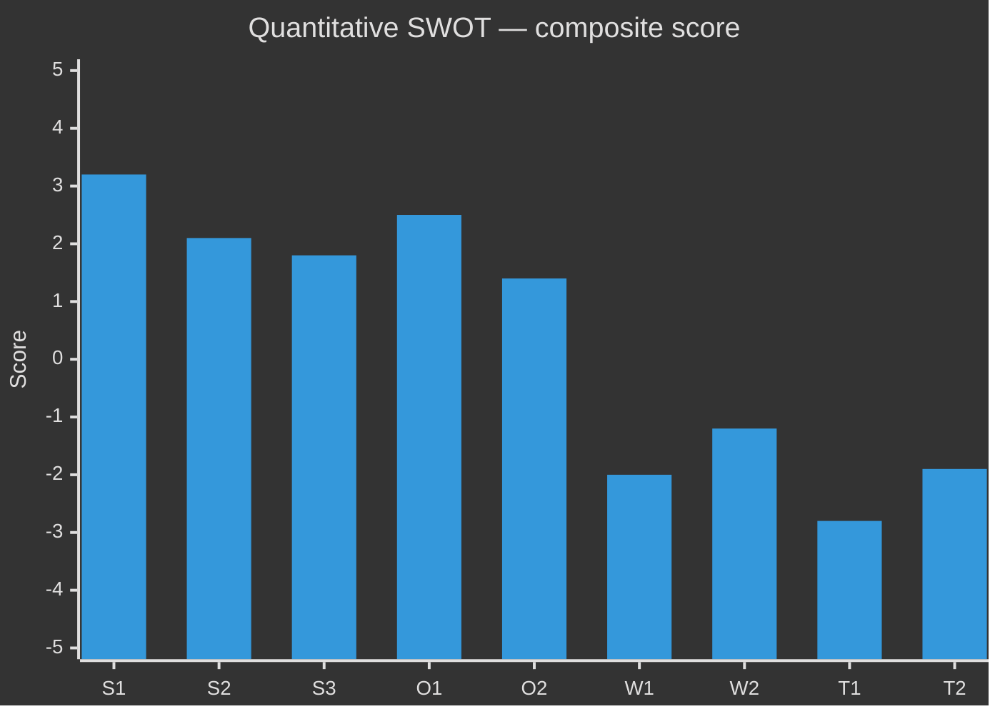

<!-- SPDX-FileCopyrightText: 2024-2026 Hack23 AB -->
<!-- SPDX-License-Identifier: Apache-2.0 -->

# Quantitative SWOT — {{ARTICLE_TYPE}} · {{ARTICLE_DATE}}

> **Analytical supplementary (optional).** Numerical extension of [`swot-analysis.md`](swot-analysis.md). Produce when decision-makers need a scored ranking (e.g., coalition negotiation prep, party strategy memo, election forecasting). Applies **DIW weighting × confidence × leverage** to every SWOT item. Pairs with `significance-scoring.md` (same weight vector) and `executive-brief.md` (top-3 surfacing).
>
> **Methodology** → [`analysis/methodologies/analytical-supplementary-methodology.md § Quantitative SWOT`](../methodologies/analytical-supplementary-methodology.md#quantitative-swot).
> **Not counted in the 23 core artifacts.** Non-blocking in `05-analysis-gate.md`.

## 🔄 Tradecraft Context

- **Artifact class** — Analytical supplementary (optional, never blocking)
- **Use when** — Decision-makers need a numerically ranked SWOT (coalition negotiation prep, party strategy memo, election forecasting)
- **Pairs with** — `swot-analysis.md` (qualitative source), `significance-scoring.md` (shared DIW weight vector), `executive-brief.md` (top-3 surfacing)
- **Methodology** — [`analytical-supplementary-methodology.md § Quantitative SWOT`](../methodologies/analytical-supplementary-methodology.md#quantitative-swot)
- **Workflow status** — Not counted in the 23 core artifacts; non-blocking in [`05-analysis-gate.md`](../../.github/prompts/05-analysis-gate.md)

## 📋 Scope & scoring rubric

- **Entity** — [party / coalition / bill / policy domain]
- **Perspective** — [party-internal / opposition / national-interest / voter-segment]
- **Weight vector (sums to 1.0)** — mirror `significance-scoring.md`:
  - `w_D` Decision relevance (0.35) · `w_I` Information novelty (0.25) · `w_W` Wave/momentum (0.20) · `w_S` Stakeholder reach (0.20)
- **Score scales** — impact `I ∈ [-5, +5]` (signed), confidence `C ∈ [0.2, 0.95]` WEP-mapped, leverage `L ∈ [0.1, 1.0]` (how much entity can influence it), time-decay `T ∈ [0.3, 1.0]` (decays over horizon).

**Composite score** — for each item:

```
score = I × C × L × T × (w_D·dRel + w_I·iNov + w_W·wMom + w_S·sReach)
```

where `dRel, iNov, wMom, sReach ∈ [0, 1]`.

Strengths & Opportunities use `+I`. Weaknesses & Threats use `-I` (resulting score is negative).

---

## 💪 Strengths (scored)

| ID | Item | Evidence (dok_id / URL) | I | C | L | T | dRel | iNov | wMom | sReach | Score | WEP† |
|----|------|------------------------|---|---|---|---|------|------|------|--------|-------|------|
| S1 | | | +4 | 0.85 | 0.70 | 0.9 | 0.9 | 0.5 | 0.6 | 0.8 | | Very likely |
| S2 | | | | | | | | | | | | |
| S3 | | | | | | | | | | | | |

**Strength total (Σ)** — `+X.XX`

## ⚠️ Weaknesses (scored)

| ID | Item | Evidence | I (negative) | C | L | T | dRel | iNov | wMom | sReach | Score | WEP† |
|----|------|----------|--------------|---|---|---|------|------|------|--------|-------|------|
| W1 | | | -3 | 0.85 | 0.60 | 0.7 | 0.9 | 0.4 | 0.5 | 0.7 | | Very likely |
| W2 | | | | | | | | | | | | |
| W3 | | | | | | | | | | | | |

**Weakness total (Σ)** — `-X.XX`

## 🌱 Opportunities (scored)

| ID | Item | Evidence | I | C | L | T | dRel | iNov | wMom | sReach | Score | WEP† |
|----|------|----------|---|---|---|---|------|------|------|--------|-------|------|
| O1 | | | | | | | | | | | | |
| O2 | | | | | | | | | | | | |
| O3 | | | | | | | | | | | | |

**Opportunity total (Σ)** — `+X.XX`

## 🌩 Threats (scored)

| ID | Item | Evidence | I (negative) | C | L | T | dRel | iNov | wMom | sReach | Score | WEP† |
|----|------|----------|--------------|---|---|---|------|------|------|--------|-------|------|
| T1 | | | | | | | | | | | | |
| T2 | | | | | | | | | | | | |
| T3 | | | | | | | | | | | | |

**Threat total (Σ)** — `-X.XX`

---

## 🎯 Composite SWOT position

| Metric | Value | Interpretation |
|--------|-------|----------------|
| Net position `(Σ S + Σ O) + (Σ W + Σ T)` | | `> 0` favourable, `< 0` unfavourable |
| SW balance `(Σ S) / (Σ S + |Σ W|)` | | `> 0.6` internally strong |
| OT balance `(Σ O) / (Σ O + |Σ T|)` | | `> 0.6` externally favourable |
| High-confidence portion (items with `C ≥ 0.80`) | | share of total |low-confidence dominance is a red flag |

## 📊 TOWS matrix (top actionable 2 × 2)

| | Opportunities | Threats |
|-|---------------|---------|
| **Strengths** | SO — leverage actions | ST — defensive actions |
| **Weaknesses** | WO — shoring-up actions | WT — retreat / hedge actions |

Populate ≥ 1 action per quadrant, each citing the numeric IDs above.

## 📈 Sensitivity analysis

| Parameter flipped | New net position | Δ vs baseline | Robustness note |
|-------------------|------------------|---------------|-----------------|
| Worst-case `C` on top Threat | | | |
| `T = 1.0` (full horizon) on Strengths | | | |
| Weight set `w_D = 0.5` (decision-dominant) | | | |

## 🧭 Mermaid ranked diagram



## 🎯 PIR feedback

| PIR | Top-3 items addressing | Gap | Action |
|-----|-----------------------|-----|--------|
| PIR-1 | | | |

---

## 🔗 Cross-links

- [`swot-analysis.md`](swot-analysis.md) — narrative SWOT; this file adds quantitative spine
- [`significance-scoring.md`](significance-scoring.md) — shares weight vector
- [`executive-brief.md`](executive-brief.md) — surfaces top-3 scored items
- [`risk-assessment.md`](risk-assessment.md) — Threats rows ≥ `|score|` threshold become risk-register entries
- [`scenario-analysis.md`](scenario-analysis.md) — scenarios tied to WT / SO quadrants
- [`analysis/imf/README.md`](../imf/README.md) — **IMF economic-data contract** for any economic strength / weakness / opportunity / threat claim. Use `DATABASE:INDICATOR_ID` (`WEO:NGDP_RPCH`, `FM:GGXWDG_NGDP`, `GFS_COFOG:G02`) citations with vintage tags; World Bank economic codes are deprecated (see [`analysis/methodologies/imf-indicator-mapping.md`](../methodologies/imf-indicator-mapping.md) §4)

† WEP = [Words-of-Estimative-Probability](../methodologies/osint-tradecraft-standards.md#wep) confidence band.

---

**Template version:** v1.1 · **Last updated:** 2026-04-25
