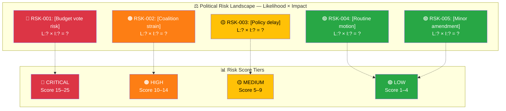
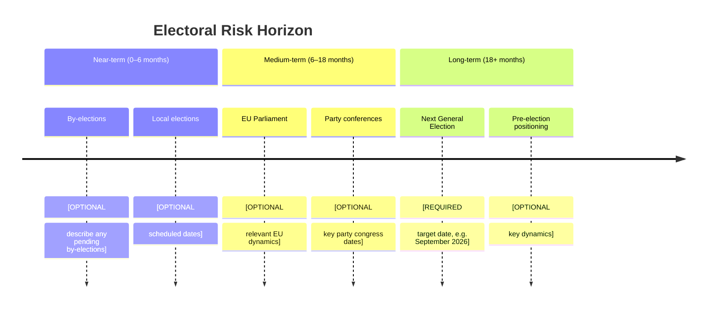
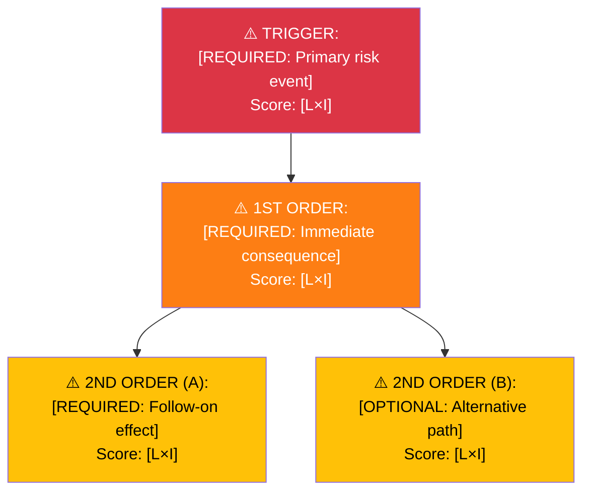

<p align="center">
  
</p>

<h1 align="center">⚠️ Political Risk Assessment Template</h1>

<p align="center">
  <strong>📊 Multi-Dimensional Risk Analysis with Cascading Risk & Scenario Trees</strong><br>
  <em>🎯 Coalition · Policy · Budget · Electoral · Cascading Risk Chains · Bayesian Updates</em>
</p>

<p align="center">
  <a href="#"></a>
  <a href="#"></a>
  <a href="#"></a>
  <a href="#"></a>
</p>

**📋 Document Owner:** CEO | **📄 Version:** 2.1 | **📅 Last Updated:** 2026-03-30 (UTC)  
**🏢 Owner:** Hack23 AB (Org.nr 5595347807) | **🏷️ Classification:** Public

> **📌 Template Instructions:** Copy to `analysis/daily/YYYY-MM-DD/{articleType}/`. Save as `risk-assessment.md` in the workflow's own folder (never overwrite another workflow's files). Scores use Likelihood × Impact methodology from [methodologies/political-risk-methodology.md](../methodologies/political-risk-methodology.md).

> **🚨 Anti-Pattern Warning:** Simple risk tables without cascading risk analysis, risk interconnection, or forward-looking scenarios are REJECTED. Every risk assessment MUST include:
> 1. **Risk Context** metadata header
> 2. **Risk Heat Map** (Mermaid diagram with color-coded risk scores)
> 3. **5-Dimension Risk Scoring** (Coalition, Policy, Budget, Electoral, External)
> 4. **Cascading Risk Chain** for the highest-risk event (Mermaid flowchart)
> 5. **Risk Interconnection Map** showing how risks amplify each other
> 6. **Evidence tables** with L×I scores, dok_id citations, confidence labels
> 7. **Forward indicators** and scenario outlook


---

## 📋 Risk Context

| Field | Value |
|-------|-------|
| **Risk Assessment ID** | `[REQUIRED: RSK-YYYY-MM-DD-NNN]` |
| **Assessment Date** | `[REQUIRED: YYYY-MM-DD HH:MM UTC]` |
| **Assessment Period** | `[REQUIRED: e.g. "2026-03-26 to 2026-04-02"]` |
| **Produced By** | `[REQUIRED: workflow name]` |
| **Political Context** | `[REQUIRED: 2–3 sentences on current political situation — which coalition governs, pending votes, recent crises]` |
| **Riksmöte** | `[REQUIRED: e.g. 2025/26]` |
| **Overall Risk Level** | `[REQUIRED: LOW / MEDIUM / HIGH / CRITICAL]` |

---

## 🗂️ Risk Inventory

Risk Score = Likelihood (1–5) × Impact (1–5). See scoring guide in [political-risk-methodology.md](../methodologies/political-risk-methodology.md).

### Risk Heat Map

> **AI Instructions:** Replace node labels with actual risk descriptions from the register below. Color each node by tier.



```
Risk Tiers:  1–4 = Low 🟢  |  5–9 = Medium 🟡  |  10–14 = High 🟠  |  15–25 = Critical 🔴
```

| Risk ID | Description | Likelihood (1–5) | Impact (1–5) | Risk Score | Tier | Mitigation |
|---------|-------------|:----------------:|:------------:|:----------:|------|------------|
| `RSK-001` | `[REQUIRED: e.g. "Budget vote fails in Riksdag"]` | `[#]` | `[#]` | `[L×I]` | `[🟢/🟡/🟠/🔴]` | `[REQUIRED: 1 sentence]` |
| `RSK-002` | `[REQUIRED]` | `[#]` | `[#]` | `[L×I]` | `[tier]` | `[REQUIRED]` |
| `RSK-003` | `[OPTIONAL]` | `[#]` | `[#]` | `[L×I]` | `[tier]` | `[OPTIONAL]` |
| `RSK-004` | `[OPTIONAL]` | `[#]` | `[#]` | `[L×I]` | `[tier]` | `[OPTIONAL]` |
| `RSK-005` | `[OPTIONAL]` | `[#]` | `[#]` | `[L×I]` | `[tier]` | `[OPTIONAL]` |

**Risk Score Summary** (copy scores from table above):

| Risk ID | Risk Score | Tier |
|---------|:----------:|------|
| RSK-001 | `[L×I]` | `[🟢/🟡/🟠/🔴]` |
| RSK-002 | `[L×I]` | `[🟢/🟡/🟠/🔴]` |
| RSK-003 | `[L×I]` | `[🟢/🟡/🟠/🔴]` |
| RSK-004 | `[L×I]` | `[🟢/🟡/🟠/🔴]` |
| RSK-005 | `[L×I]` | `[🟢/🟡/🟠/🔴]` |

> *Fill in actual risk scores from the register above. This table replaces a Mermaid `xychart-beta` chart for maximum Markdown renderer compatibility.*

---

## 🤝 Coalition Stability Risk

### Current Coalition Assessment

| Parameter | Value |
|-----------|-------|
| **Governing Coalition** | `[REQUIRED: e.g. "Tidökoalitionen: M + SD + KD + L"]` |
| **Coalition Strength** | `[REQUIRED: HIGH / MEDIUM / LOW]` |
| **Confidence Level** | `[REQUIRED: XX%]` |
| **Supporting Parties** | `[OPTIONAL: parties providing external support]` |
| **Opposition Majority Risk** | `[REQUIRED: YES / NO / MARGINAL]` |
| **Next Confidence Test** | `[OPTIONAL: YYYY-MM-DD or "None scheduled"]` |

### Coalition Risk Factors

| Factor | Status | Evidence | Risk Contribution |
|--------|--------|----------|-------------------|
| Internal party disagreements | `[REQUIRED: Active/Latent/None]` | `[dok_id or description]` | `[HIGH/MED/LOW]` |
| Budget disagreements | `[REQUIRED]` | `[source]` | `[tier]` |
| SD confidence threshold | `[REQUIRED]` | `[source]` | `[tier]` |
| By-election pressure | `[OPTIONAL]` | `[source]` | `[tier]` |
| EU policy conflict | `[OPTIONAL]` | `[source]` | `[tier]` |

**Coalition Collapse Probability (next 90 days):** `[REQUIRED: LOW <15% / MEDIUM 15–35% / HIGH >35%]`

---

## 📋 Policy Implementation Risk

Key policies at risk of parliamentary defeat, amendment, or delay:

| Policy | Ministry | Stage | Risk Level | Blocking Factor |
|--------|----------|-------|------------|-----------------|
| `[REQUIRED: policy name]` | `[REQUIRED: e.g. Finansdepartementet]` | `[REQUIRED: e.g. Committee review]` | `[🟢/🟡/🟠/🔴]` | `[REQUIRED: what could block it]` |
| `[OPTIONAL]` | `[OPTIONAL]` | `[OPTIONAL]` | `[tier]` | `[OPTIONAL]` |
| `[OPTIONAL]` | `[OPTIONAL]` | `[OPTIONAL]` | `[tier]` | `[OPTIONAL]` |

**Overall Policy Risk:** `[REQUIRED: LOW / MEDIUM / HIGH]`

---

## 💰 Budget Risk

| Parameter | Value |
|-----------|-------|
| **Budget Year** | `[REQUIRED: e.g. 2026]` |
| **Fiscal Committee (FiU) Status** | `[REQUIRED: e.g. "Approved 2025-12-01"]` |
| **Surplus/Deficit Projection** | `[REQUIRED: SEK billions, e.g. "-45 BSEK"]` |
| **Budget Risk Level** | `[REQUIRED: LOW / MEDIUM / HIGH / CRITICAL]` |
| **Key Budget Risks** | `[REQUIRED: 2–3 bullet points]` |

**Riksdag Fiscal Committee (FiU) Oversight:**
- Autumn Budget Proposition Status: `[REQUIRED: Approved / Pending / Rejected / Modified]`
- Spring Amending Budget Status: `[OPTIONAL]`
- Key FiU Dissents: `[OPTIONAL: party name + issue]`

---

## 🗳️ Electoral Risk Timeline

Structured around the Swedish electoral cycle (general elections every 4 years, September):



| Electoral Event | Date | Risk to Coalition | Impact if Adverse |
|----------------|------|-------------------|-------------------|
| `[REQUIRED: event]` | `[YYYY-MM-DD or "TBD"]` | `[HIGH/MED/LOW]` | `[REQUIRED: 1 sentence]` |
| `[OPTIONAL]` | `[OPTIONAL]` | `[tier]` | `[OPTIONAL]` |

**Pre-election Fragility Index:** `[REQUIRED: LOW / MEDIUM / HIGH]`  
**Assessment Confidence:** `[REQUIRED: HIGH / MEDIUM / LOW]`

---

## 🔑 Risk Summary & Recommendations

### Top 3 Risks This Period

1. **[Risk ID]:** `[Name]` — Score `[N]` — `[1-sentence summary]`
2. **[Risk ID]:** `[Name]` — Score `[N]` — `[1-sentence summary]`
3. **[Risk ID]:** `[Name]` — Score `[N]` — `[1-sentence summary]`

### Recommended Actions

- `[REQUIRED: specific monitoring or editorial action]`
- `[REQUIRED: specific monitoring or editorial action]`
- `[OPTIONAL]`

---

## ⚡ Escalation & Freshness

### Freshness Requirements

| Risk Tier | Maximum Age Before Re-evaluation |
|:---------:|:-------------------------------:|
| 🔴 Critical (15–25) | **24 hours** — must be re-assessed daily |
| 🟠 High (10–14) | **72 hours** — re-assess within 3 days |
| 🟡 Medium (5–9) | **7 days** — re-assess weekly |
| 🟢 Low (1–4) | **30 days** — re-assess monthly |

### When to Escalate from Risk Register to Breaking Analysis

| Condition | Action |
|-----------|--------|
| Any risk score increases from ≤14 to ≥15 (crosses into Critical) | Trigger breaking risk assessment; notify editorial |
| ≥ 3 risks simultaneously in High tier | Elevate overall risk level; flag in daily synthesis |
| Coalition collapse probability moves from LOW to MEDIUM or HIGH | Immediate re-assessment of all coalition-related risks |
| Budget vote approaches with unresolved High risk | Pre-position breaking analysis template |

---

## 🔗 Section 5: Cascading Risk Chain

> **AI Instructions:** For the highest-scoring risk, trace the cascade of second-order and third-order effects.



| Chain Stage | Risk Event | L | I | Score | Circuit Breaker |
|:-----------:|-----------|:-:|:-:|:-----:|----------------|
| Trigger | `[REQUIRED]` | `[#]` | `[#]` | `[#]` | `[What stops it here?]` |
| 1st Order | `[REQUIRED]` | `[#]` | `[#]` | `[#]` | `[Intervention point]` |
| 2nd Order | `[REQUIRED]` | `[#]` | `[#]` | `[#]` | `[Recovery action]` |

---

## 🌐 Section 6: Risk Interconnection Map

> **AI Instructions:** Show how the 5 risk dimensions affect each other.

| From → To | Connection Strength | Mechanism | Evidence |
|:---------:|:-------------------:|-----------|---------|
| Coalition → Budget | `[Strong/Medium/Weak]` | `[REQUIRED: How this connection works]` | `[dok_id]` |
| Coalition → Policy | `[Strong/Medium/Weak]` | `[REQUIRED]` | `[dok_id]` |
| Policy → Electoral | `[Strong/Medium/Weak]` | `[REQUIRED]` | `[dok_id]` |

**System fragility assessment:** `[REQUIRED: Are ≥3 risk dimensions at High level? If so, system is fragile — describe why.]`

---

## 🔮 Section 7: Forward Indicators & Scenario Outlook

| Scenario | Probability | Key Trigger | Risk Dimensions Affected |
|----------|:----------:|------------|-------------------------|
| `[REQUIRED: Most likely outcome]` | `[%]` | `[Specific trigger]` | `[Coalition + Policy + ...]` |
| `[REQUIRED: Alternative outcome]` | `[%]` | `[Specific trigger]` | `[Risk dimensions]` |

---

## 📂 MCP Data Files Used

> *Record all data files and MCP tool calls consulted during this risk assessment for audit traceability and reproducibility.*

`[REQUIRED: List all analysis/daily/YYYY-MM-DD/{articleType}/data/ files consulted]`

| # | Data Source | File / Tool Path | Data Type | Retrieved |
|:-:|-----------|-----------------|-----------|-----------|
| 1 | `[e.g. riksdag-regering-mcp]` | `[e.g. search_voteringar(rm="2025/26", bet="FiU1")]` | `[e.g. Voting records]` | `[YYYY-MM-DD HH:MM UTC]` |
| 2 | `[e.g. riksdag-regering-mcp]` | `[e.g. search_dokument(doktyp="prop", rm="2025/26")]` | `[e.g. Propositions]` | `[YYYY-MM-DD HH:MM UTC]` |
| 3 | `[e.g. CIA export]` | `[e.g. cia-data/exports/risk-summary.json]` | `[e.g. Risk indicators]` | `[YYYY-MM-DD HH:MM UTC]` |
| 4 | `[OPTIONAL]` | `[path or tool call]` | `[type]` | `[timestamp]` |

### Risk-Specific MCP Tool Usage

> **AI Instructions:** Map which MCP tools provided evidence for each risk dimension. This ensures every risk score has traceable data provenance.

| Risk Dimension | Primary MCP Tool | Key Parameters | Evidence Count |
|---------------|-----------------|----------------|:--------------:|
| Coalition Stability | `[e.g. riksdag-regering-mcp search_voteringar]` | `[e.g. rm="2025/26"]` | `[#]` |
| Policy Implementation | `[e.g. riksdag-regering-mcp search_dokument]` | `[e.g. doktyp="bet"]` | `[#]` |
| Budget | `[e.g. riksdag-regering-mcp get_propositioner]` | `[e.g. rm="2025/26"]` | `[#]` |
| Electoral | `[e.g. riksdag-regering-mcp search_anforanden]` | `[e.g. parti="S"]` | `[#]` |
| External | `[e.g. riksdag-regering-mcp search_regering]` | `[e.g. type="pressmeddelanden"]` | `[#]` |

> **📌 Note:** All files listed above MUST exist in the repository at the stated paths. If a file was fetched but not persisted, note `(transient — not cached)` in the File Path column.

---

**Document Control:**  
- **Template Path:** `/analysis/templates/risk-assessment.md`  
- **Framework Reference:** [methodologies/political-risk-methodology.md](../methodologies/political-risk-methodology.md)  
- **Version:** 2.1  
- **Advanced Sections:** Cascading Risk, Risk Interconnection, Scenario Outlook, MCP Data Provenance  
- **Classification:** Public  
- **Next Review:** 2026-06-30
