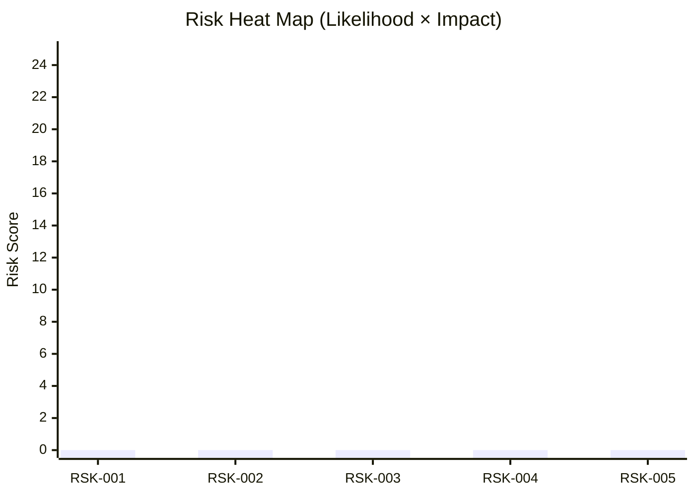
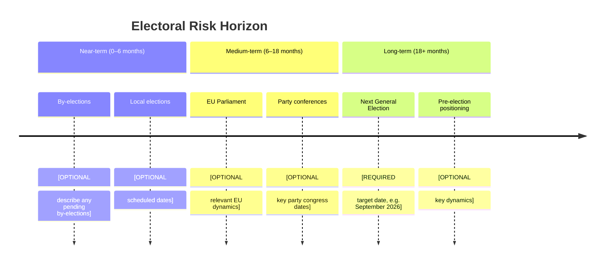

<p align="center">
  
</p>

<h1 align="center">⚠️ Political Risk Assessment Template</h1>

<p align="center">
  <strong>📊 Structured Risk Analysis for Swedish Parliamentary Dynamics</strong><br>
  <em>🎯 Coalition · Policy · Budget · Electoral Risk Mapping</em>
</p>

<p align="center">
  <a href="#"></a>
  <a href="#"></a>
  <a href="#"></a>
  <a href="#"></a>
</p>

**📋 Document Owner:** CEO | **📄 Version:** 1.0 | **📅 Last Updated:** 2026-03-26 (UTC)  
**🏢 Owner:** Hack23 AB (Org.nr 5595347807) | **🏷️ Classification:** Public

> **📌 Template Instructions:** Copy to `analysis/daily/YYYY-MM-DD/` or `analysis/weekly/YYYY-WNN/`. Rename to `YYYY-MM-DD-risk-assessment.md`. Scores use Likelihood × Impact methodology from [methodologies/political-risk-methodology.md](../methodologies/political-risk-methodology.md).

---

## 📋 Risk Context

| Field | Value |
|-------|-------|
| **Risk Assessment ID** | `[REQUIRED: RSK-YYYY-MM-DD-NNN]` |
| **Assessment Date** | `[REQUIRED: YYYY-MM-DD HH:MM UTC]` |
| **Assessment Period** | `[REQUIRED: e.g. "2026-03-26 to 2026-04-02"]` |
| **Produced By** | `[REQUIRED: workflow name]` |
| **Political Context** | `[REQUIRED: 2–3 sentences on current political situation — which coalition governs, pending votes, recent crises]` |
| **Riksmöte** | `[REQUIRED: e.g. 2025/26]` |
| **Overall Risk Level** | `[REQUIRED: LOW / MEDIUM / HIGH / CRITICAL]` |

---

## 🗂️ Risk Inventory

Risk Score = Likelihood (1–5) × Impact (1–5). See scoring guide in [political-risk-methodology.md](../methodologies/political-risk-methodology.md).

```
Risk Tiers:  1–4 = Low 🟢  |  5–9 = Medium 🟡  |  10–14 = High 🟠  |  15–25 = Critical 🔴
```

| Risk ID | Description | Likelihood (1–5) | Impact (1–5) | Risk Score | Tier | Mitigation |
|---------|-------------|:----------------:|:------------:|:----------:|------|------------|
| `RSK-001` | `[REQUIRED: e.g. "Budget vote fails in Riksdag"]` | `[#]` | `[#]` | `[L×I]` | `[🟢/🟡/🟠/🔴]` | `[REQUIRED: 1 sentence]` |
| `RSK-002` | `[REQUIRED]` | `[#]` | `[#]` | `[L×I]` | `[tier]` | `[REQUIRED]` |
| `RSK-003` | `[OPTIONAL]` | `[#]` | `[#]` | `[L×I]` | `[tier]` | `[OPTIONAL]` |
| `RSK-004` | `[OPTIONAL]` | `[#]` | `[#]` | `[L×I]` | `[tier]` | `[OPTIONAL]` |
| `RSK-005` | `[OPTIONAL]` | `[#]` | `[#]` | `[L×I]` | `[tier]` | `[OPTIONAL]` |


> *Replace the `[0, 0, 0, 0, 0]` with actual risk scores before saving.*

---

## 🤝 Coalition Stability Risk

### Current Coalition Assessment

| Parameter | Value |
|-----------|-------|
| **Governing Coalition** | `[REQUIRED: e.g. "Tidökoalitionen: M + SD + KD + L"]` |
| **Coalition Strength** | `[REQUIRED: HIGH / MEDIUM / LOW]` |
| **Confidence Level** | `[REQUIRED: XX%]` |
| **Supporting Parties** | `[OPTIONAL: parties providing external support]` |
| **Opposition Majority Risk** | `[REQUIRED: YES / NO / MARGINAL]` |
| **Next Confidence Test** | `[OPTIONAL: YYYY-MM-DD or "None scheduled"]` |

### Coalition Risk Factors

| Factor | Status | Evidence | Risk Contribution |
|--------|--------|----------|-------------------|
| Internal party disagreements | `[REQUIRED: Active/Latent/None]` | `[dok_id or description]` | `[HIGH/MED/LOW]` |
| Budget disagreements | `[REQUIRED]` | `[source]` | `[tier]` |
| SD confidence threshold | `[REQUIRED]` | `[source]` | `[tier]` |
| By-election pressure | `[OPTIONAL]` | `[source]` | `[tier]` |
| EU policy conflict | `[OPTIONAL]` | `[source]` | `[tier]` |

**Coalition Collapse Probability (next 90 days):** `[REQUIRED: LOW <15% / MEDIUM 15–35% / HIGH >35%]`

---

## 📋 Policy Implementation Risk

Key policies at risk of parliamentary defeat, amendment, or delay:

| Policy | Ministry | Stage | Risk Level | Blocking Factor |
|--------|----------|-------|------------|-----------------|
| `[REQUIRED: policy name]` | `[REQUIRED: e.g. Finansdepartementet]` | `[REQUIRED: e.g. Committee review]` | `[🟢/🟡/🟠/🔴]` | `[REQUIRED: what could block it]` |
| `[OPTIONAL]` | `[OPTIONAL]` | `[OPTIONAL]` | `[tier]` | `[OPTIONAL]` |
| `[OPTIONAL]` | `[OPTIONAL]` | `[OPTIONAL]` | `[tier]` | `[OPTIONAL]` |

**Overall Policy Risk:** `[REQUIRED: LOW / MEDIUM / HIGH]`

---

## 💰 Budget Risk

| Parameter | Value |
|-----------|-------|
| **Budget Year** | `[REQUIRED: e.g. 2026]` |
| **Fiscal Committee (FiU) Status** | `[REQUIRED: e.g. "Approved 2025-12-01"]` |
| **Surplus/Deficit Projection** | `[REQUIRED: SEK billions, e.g. "-45 BSEK"]` |
| **Budget Risk Level** | `[REQUIRED: LOW / MEDIUM / HIGH / CRITICAL]` |
| **Key Budget Risks** | `[REQUIRED: 2–3 bullet points]` |

**Riksdag Fiscal Committee (FiU) Oversight:**
- Autumn Budget Proposition Status: `[REQUIRED: Approved / Pending / Rejected / Modified]`
- Spring Amending Budget Status: `[OPTIONAL]`
- Key FiU Dissents: `[OPTIONAL: party name + issue]`

---

## 🗳️ Electoral Risk Timeline

Structured around the Swedish electoral cycle (general elections every 4 years, September):



| Electoral Event | Date | Risk to Coalition | Impact if Adverse |
|----------------|------|-------------------|-------------------|
| `[REQUIRED: event]` | `[YYYY-MM-DD or "TBD"]` | `[HIGH/MED/LOW]` | `[REQUIRED: 1 sentence]` |
| `[OPTIONAL]` | `[OPTIONAL]` | `[tier]` | `[OPTIONAL]` |

**Pre-election Fragility Index:** `[REQUIRED: LOW / MEDIUM / HIGH]`  
**Assessment Confidence:** `[REQUIRED: HIGH / MEDIUM / LOW]`

---

## 🔑 Risk Summary & Recommendations

### Top 3 Risks This Period

1. **[Risk ID]:** `[Name]` — Score `[N]` — `[1-sentence summary]`
2. **[Risk ID]:** `[Name]` — Score `[N]` — `[1-sentence summary]`
3. **[Risk ID]:** `[Name]` — Score `[N]` — `[1-sentence summary]`

### Recommended Actions

- `[REQUIRED: specific monitoring or editorial action]`
- `[REQUIRED: specific monitoring or editorial action]`
- `[OPTIONAL]`

---

**Document Control:**  
- **Template Path:** `/analysis/templates/risk-assessment.md`  
- **Classification:** Public  
- **Next Review:** 2026-06-26
