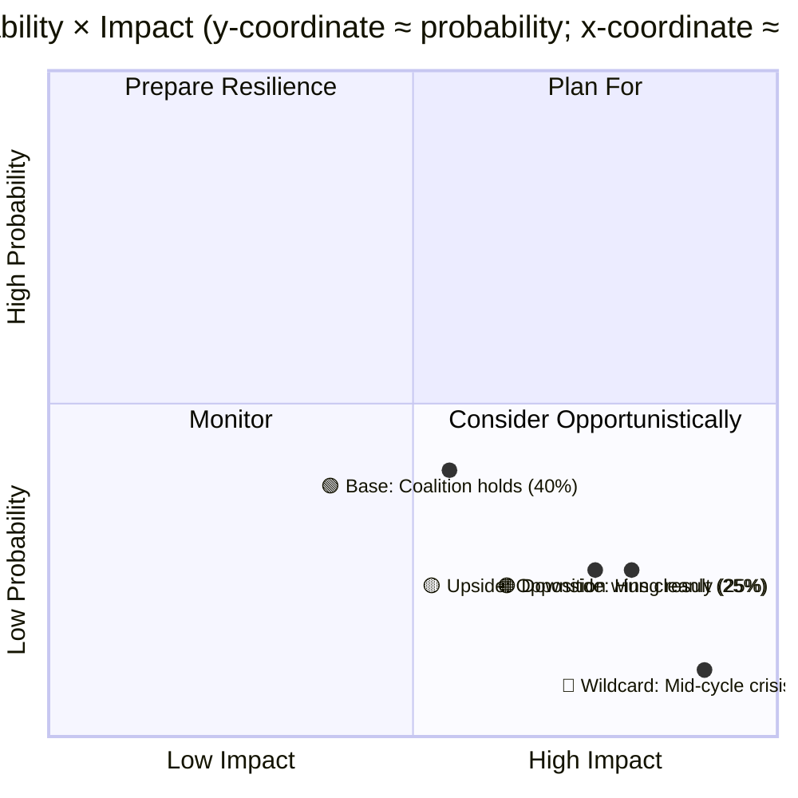
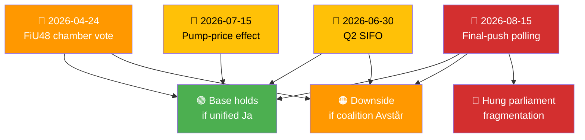
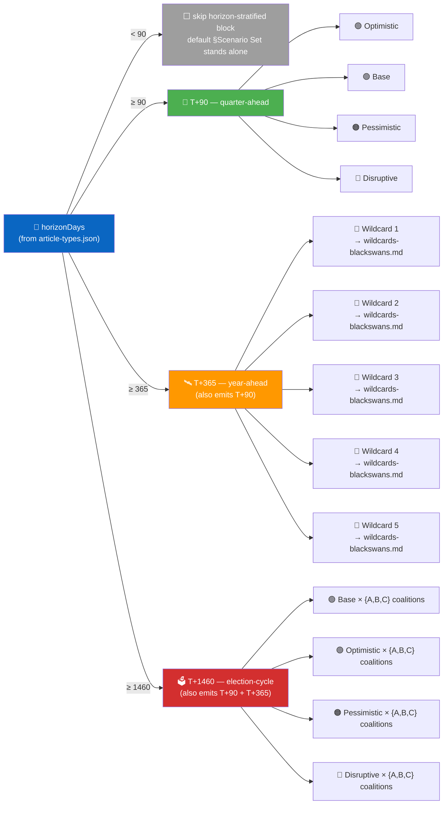

<p align="center">
  
</p>

<h1 align="center">🔮 Scenario Analysis Template</h1>

<p align="center">
  <strong>📊 Structured Future-State Analysis: Base · Upside · Downside · Wildcard</strong><br>
  <em>🎯 Probability-Weighted · Trigger-Conditioned · Decision-Supporting</em>
</p>

<p align="center">
  <a href="#"></a>
  <a href="#"></a>
  <a href="#"></a>
  <a href="#"></a>
</p>

**📋 Document Owner:** CEO | **📄 Version:** 1.3 | **📅 Last Updated:** 2026-05-01 (UTC)
**🏢 Owner:** Hack23 AB (Org.nr 5595347807) | **🏷️ Classification:** Public

> **📌 Template instructions:** Produce on every run and save as `analysis/daily/${ARTICLE_DATE}/${DOC_TYPE}/scenario-analysis.md`. On lighter days, keep the scenario set concise but still complete; when a day's documents carry multi-path uncertainty or the run includes P0/P1-significance material, expand the analysis depth, evidence, and trigger detail. Uses the 5-level confidence scale and DIW weighting defined in [ai-driven-analysis-guide.md](../methodologies/ai-driven-analysis-guide.md).

> **✨ What to produce:** Four named scenarios (Base, Upside, Downside, Wildcard), each with explicit probability, trigger conditions, early warning signals, and a decision-playbook paragraph. Probabilities sum to 100%.

---

<!-- TEMPLATE_CONTRACT_V1 -->
> **📐 Template Contract** — every fill of this template MUST satisfy this row.
>
> | Slot | Value |
> |------|-------|
> | **Owning methodology** | [`per-artifact-methodologies.md`](../methodologies/per-artifact-methodologies.md#scenario-analysis) |
> | **Owning gate check** | Check 7 (Family C — ≥ 3 scenarios + posteriors) — see [`05-analysis-gate.md`](../../.github/prompts/05-analysis-gate.md) |
> | **Required inputs** | sibling Family A + intelligence-assessment.md |
> | **Horizon band** | per-run (per [`scripts/horizon-context.ts`](../../scripts/horizon-context.ts)) |
> | **Output family** | Family C — Strategic Extensions |
> | **Aggregation order** | 8 of 30 in canonical order (see [`scripts/render-lib/aggregator/order.ts`](../../scripts/render-lib/aggregator/order.ts)) |
> | **Reader Intelligence Guide** | row generated from `scenario-analysis.md` (see [`scripts/render-lib/aggregator/reader-guide.ts`](../../scripts/render-lib/aggregator/reader-guide.ts)) |
> | **Canonical evidence anchor** | `\| claim \| evidence (dok_id / vote / MP intressent_id / primary-source URL) \| retrieved_at \| confidence \|` — every analytical claim row uses this schema. |
>
> Cross-reference: [`README.md §Template ↔ Methodology ↔ Gate-Check Matrix`](README.md#-template--methodology--gate-check-matrix).

<!--
AI-FIRST Pass-1 / Pass-2 self-check (HTML comment — invisible in rendered articles; not stripped by aggregator unless under a "## Pass 2 …" heading).

PASS 1 (creation, minimal viable artifact):
  • Fill every REQUIRED slot above; cite ≥ 1 dok_id / vote / MP / primary-source URL per major claim.
  • Use the canonical evidence anchor schema for every analytical claim row.
  • Mermaid blocks use the cyberpunk %%{init: theme/themeVariables}%% prologue and at least one `style …` or `classDef …` directive (Check 5 of 05-analysis-gate.md).

PASS 2 (read-back & improve — AI-FIRST mandatory, ≥ 180 s after Pass 1):
  • Re-read the file end-to-end; for each section verify (a) ≥ 1 evidence anchor row, (b) WEP language tightened (no "may/might/could" hedges), (c) named actors with intressent_id where applicable, (d) Mermaid colour theming present.
  • Banned-phrase scan: "intelligence theatre", "sources say", "reportedly", "it is widely believed", "experts agree", "AI_MUST_REPLACE".
  • Citation density target: ≥ 1 evidence anchor row per 100 words of analytical prose.
  • Neutrality arithmetic: equal analytical depth across the 8 Riksdag parties (S, M, SD, V, MP, C, L, KD); flag and correct any bias in the Pass-2 Self-Audit section.

ANTI-TEMPLATE — DO NOT:
  • Ship plain prose without evidence anchor tables.
  • Leave AI_MUST_REPLACE / [REQUIRED: …] placeholders in the rendered output.
  • Cite a non-primary URL when a `dok_id` or vote record is available.
  • Treat co-occurrence of keywords as coordination; uni-directional chains as bi-directional.
  • Use a Mermaid block without colour theming (Check 5 will block aggregation).
  • Skip the Pass-2 read-back (Check 6 verifies mtime ≥ birth + 180 s OR a differing pass1/ snapshot).
-->

## 🔄 Tradecraft Context

| Field | Value |
|-------|-------|
| **F3EAD stage** | `Analyze / Disseminate` |
| **PIRs** | `list the priority intelligence requirements this scenario set answers` |
| **Admiralty floor** | `B2 for trigger conditions; A1 for anchor evidence from primary MCP sources` |
| **SATs used** | `Alternative Futures Analysis; Key Assumptions Check; Indicators & Signposts; Premortem` |
| **ICD 203 standards applied** | `uncertainty, alternative analysis, confidence, argumentation, customer relevance` |

> See [`political-style-guide.md`](../methodologies/political-style-guide.md) for canonical F3EAD / PIR catalog / Admiralty Code / ICD 203 / WEP / SATs definitions.

---

## 📋 Scenario Context

| Field | Value |
|-------|-------|
| **Scenario ID** | `SCN-YYYY-MM-DD-NNN` |
| **Generated** | `YYYY-MM-DD HH:MM UTC` |
| **Question** | `e.g., "Will the September 2026 election return the current coalition?"` |
| **Time horizon** | `e.g., 2026-09-13 (election day) / 6-month / 12-month` |
| **Decision supported** | `e.g., "Editorial coverage weight through Q3 2026"` |
| **Source documents** | `list of dok_ids` |
| **Overall Confidence** | `🟦 VERY HIGH / 🟩 HIGH / 🟧 MEDIUM / 🟥 LOW / ⬛ VERY LOW` — pair with WEP probability term (e.g., "likely / about even / unlikely") per [political-style-guide.md](../methodologies/political-style-guide.md) |

---

## 🧭 Scenario Quadrant



---

## 📊 Scenario Set

> [!WARNING]
> **Illustrative example — replace before publishing.** The quadrant, the four scenarios below, every probability, every named actor/committee/dok_id, every trigger condition, and every early-warning signal are worked-example values from a prior reference run. Replace them with run-specific scenario content (or explicitly reuse and re-justify them) before committing this file.

### 🟢 Scenario A — Base Case (probability **40 %**)

| Field | Value |
|-------|-------|
| **Name** | Base — Coalition holds with SD confidence & supply |
| **Probability** | 40 % (confidence 🟩 HIGH) |
| **Headline** | Kristersson government retains office with modified mandate |
| **Trigger conditions** | Coalition + SD sustain ≥ 47 % polling through August 2026; no crisis event |
| **Early warning signals** | (a) cost-of-living package lands within voter segments 1 & 2 by July; (b) no major KU scandal; (c) SD keeps confidence posture |
| **Outcome on key dimensions** | Budget continuity, justice agenda continues, climate pace moderated |
| **Decision implication** | Editorial: maintain standard coverage weighting; prepare for post-election budget continuity scenario |

### 🟡 Scenario B — Upside (probability **25 %**)

| Field | Value |
|-------|-------|
| **Name** | Upside — S-led opposition wins outright |
| **Probability** | 25 % (WEP: "unlikely" — confidence 🟧 MEDIUM); roughly level with Scenario C |
| **Headline** | Social Democrats return with C + MP partners |
| **Trigger conditions** | Opposition block polls ≥ 52 % by Aug 2026; ULA (unemployment-linked affordability) narrative dominates |
| **Early warning signals** | (a) Q2 2026 SIFO gap ≥ 6 points; (b) SCB AKU June unemployment > 8.6 %; (c) EU-Commission rebuke on fuel-tax cut |
| **Outcome on key dimensions** | Budget redirection to welfare; green-transition acceleration; migration policy recalibration |
| **Decision implication** | Editorial: prepare policy-pivot coverage; commission expert-panel content on transition continuity |

### 🟠 Scenario C — Downside (probability **25 %**)

| Field | Value |
|-------|-------|
| **Name** | Downside — Hung parliament / protracted formation |
| **Probability** | 25 % (WEP: "unlikely" — confidence 🟧 MEDIUM); roughly level with Scenario B |
| **Headline** | No bloc reaches 175 seats; multi-week government formation |
| **Trigger conditions** | No bloc > 48 % in final polls; SD shifts position during campaign |
| **Early warning signals** | (a) fragmented polling by late July; (b) leadership challenges in smaller parties; (c) late-campaign defections |
| **Outcome on key dimensions** | Interim government; budget via caretaker rules; institutional stress |
| **Decision implication** | Editorial: activate constitutional-crisis playbook; commission KU + Statsrätt analyses; boost capacity |

### 🔴 Scenario D — Wildcard (probability **10 %**)

| Field | Value |
|-------|-------|
| **Name** | Wildcard — Mid-cycle crisis (scandal / external shock / health event) |
| **Probability** | 10 % (WEP: "very unlikely" — confidence 🟥 LOW) |
| **Headline** | External event reshapes the race |
| **Trigger conditions** | One of: major KU reprimand, Riksbank crisis action, NATO escalation, public-health emergency |
| **Early warning signals** | (a) unusual opinion-poll volatility; (b) government-agency resignations; (c) regional escalations |
| **Outcome on key dimensions** | Unpredictable; likely short-term rally-around-the-flag then realignment |
| **Decision implication** | Editorial: pre-draft crisis explainers; maintain rapid-response editorial shift capacity |

**Probability check: 40 + 25 + 25 + 10 = 100 %** ✅

---

## 🧩 Drivers & Dependencies

| Driver | Current signal | Confidence | Scenarios affected |
|--------|----------------|:----------:|--------------------|
| GDP growth trajectory (SCB + IMF WEO) | +0.82 % 2024, +1.8 % 2026 proj | 🟦 VERY HIGH | A, B, C |
| SIFO/Novus polling gap | −4 pt government disadvantage Apr 2026 | 🟩 HIGH | A, B, C |
| SD confidence-supply posture | Stable through FiU48 | 🟩 HIGH | A, C |
| EU-Commission Green-Deal response | Awaited, 0–30 d horizon | 🟧 MEDIUM | A, B |
| NATO/Ukraine situation | Active, escalation risk moderate | 🟧 MEDIUM | D |

---

## 🔮 Early-Warning Dashboard



---

## 📘 Decision Playbook

| Scenario | Action 1 | Action 2 | Action 3 |
|----------|----------|----------|----------|
| A (Base) | Maintain normal coverage cadence | Prepare post-election budget-continuity explainer | Track SD confidence-supply signals |
| B (Upside) | Commission policy-pivot explainer series | Stand up transition-team coverage | Prepare international-reaction pieces |
| C (Downside) | Activate constitutional-crisis playbook | Commission Statsrätt / KU analyses | Expand multilingual-explainer capacity |
| D (Wildcard) | Pre-draft crisis templates | Maintain real-time monitoring intensified by 2× | Prepare coordinated EN + SV rapid response |

---

## 🌳 Horizon-Stratified Scenarios *(optional — emit only when `horizonDays >= 90`)*

> **📌 When to render this block.** Triggered by the run's `horizonDays` value resolved from [`analysis/article-types.json`](../article-types.json) via [`scripts/horizon-context.ts`](../../scripts/horizon-context.ts):
> - `horizonDays < 90` (today / week-ahead / month-ahead) → **omit this block entirely**; the default §"Scenario Set" above stands alone.
> - `horizonDays >= 90` (`quarter-ahead`) → render the **4 base scenarios** sub-tree (Optimistic / Base / Pessimistic / Disruptive — these are the long-horizon canonical names and map to §"Scenario Set" Scenario A–D as **Base ⇄ A**, **Upside ⇄ Optimistic ⇄ B**, **Downside ⇄ Pessimistic ⇄ C**, **Wildcard ⇄ Disruptive ⇄ D**).
> - `horizonDays >= 365` (`year-ahead`) → also render the **wildcard sub-tree** with `longHorizonRules.wildcardCount` entries from [`analysis/article-types.json`](../article-types.json) (currently **5** for `year-ahead` / `election-cycle`), each linked to a wildcard in [`wildcards-blackswans.md`](wildcards-blackswans.md).
> - `horizonDays >= 1460` (`election-cycle`) → also render `longHorizonRules.scenarioBranchesPerScenario` governing-coalition branches per base scenario (currently **3** → 12 leaves total).
>
> Naming convention — every node carries:
> - `horizonClass` — one of `T+90` / `T+365` / `T+1460`
> - WEP confidence term that **degrades with horizon** per [`ext/long-horizon-forecasting.md` §1](../../.github/prompts/ext/long-horizon-forecasting.md)
> - cross-link to the matching band in [`forward-indicators.md`](forward-indicators.md)
> - `counterfactual` flag — mandatory for `cycle`, optional otherwise (counterfactual paragraphs themselves live in [`devils-advocate.md`](devils-advocate.md))
>
> **Probability discipline.** Probabilities at every level sum to 100 %. Sibling base scenarios sum to 100 %; wildcards form a separate set summing to 100 % among themselves; coalition branches under each base scenario sum to 100 %.
>
> The illustrative IDs and probabilities below mirror the worked example in §"Scenario Set" — replace before publishing.

### 🌲 Tree summary table

| Scenario ID | Parent | `horizonClass` | Branch | Probability | WEP (band-degraded) | Confidence | `forward-indicators.md` band | Counterfactual flag |
|-------------|--------|:--------------:|--------|:-----------:|---------------------|:----------:|------------------------------|:-------------------:|
| `SCN-Q-OPT` | — | `T+90` | Optimistic — coalition consolidates (≡ §Scenario Set "B / Upside") | 25 % | likely [horizon:quarter] | 🟩 HIGH | `quarter` | ⬜ optional |
| `SCN-Q-BASE` | — | `T+90` | Base — status-quo continuity (≡ §Scenario Set "A / Base") | 40 % | likely [horizon:quarter] | 🟩 HIGH | `quarter` | ⬜ optional |
| `SCN-Q-PESS` | — | `T+90` | Pessimistic — coalition stress (≡ §Scenario Set "C / Downside") | 25 % | roughly even [horizon:quarter] | 🟧 MEDIUM | `quarter` | ⬜ optional |
| `SCN-Q-DISRUPT` | — | `T+90` | Disruptive — exogenous shock (≡ §Scenario Set "D / Wildcard") | 10 % | unlikely [horizon:quarter] | 🟥 LOW | `quarter` | ⬜ optional |
| `SCN-Y-WILD-1` | — | `T+365` | Wildcard 1 — KU/scandal cascade | 30 % *(of wildcard set)* | roughly even [horizon:year] | 🟧 MEDIUM | `year` | ⬜ optional |
| `SCN-Y-WILD-2` | — | `T+365` | Wildcard 2 — external security shock | 25 % *(of wildcard set)* | unlikely [horizon:year] | 🟧 MEDIUM | `year` | ⬜ optional |
| `SCN-Y-WILD-3` | — | `T+365` | Wildcard 3 — economic dislocation | 20 % *(of wildcard set)* | unlikely [horizon:year] | 🟥 LOW | `year` | ⬜ optional |
| `SCN-Y-WILD-4` | — | `T+365` | Wildcard 4 — leadership / health event | 15 % *(of wildcard set)* | unlikely [horizon:year] | 🟥 LOW | `year` | ⬜ optional |
| `SCN-Y-WILD-5` | — | `T+365` | Wildcard 5 — institutional / KU constitutional shock | 10 % *(of wildcard set)* | very unlikely [horizon:year] | 🟥 LOW | `year` | ⬜ optional |
| `SCN-C-OPT` | — | `T+1460` | Cycle base — Optimistic (≡ §Scenario Set B / Upside, cycle-aged) | 25 % *(of base set)* | roughly even [horizon:cycle] | 🟧 MEDIUM | `cycle` | ✅ mandatory |
| `SCN-C-BASE` | — | `T+1460` | Cycle base — Base (≡ §Scenario Set A / Base, cycle-aged) | 40 % *(of base set)* | roughly even [horizon:cycle] | 🟧 MEDIUM | `cycle` | ✅ mandatory |
| `SCN-C-PESS` | — | `T+1460` | Cycle base — Pessimistic (≡ §Scenario Set C / Downside, cycle-aged) | 25 % *(of base set)* | unlikely [horizon:cycle] | 🟥 LOW | `cycle` | ✅ mandatory |
| `SCN-C-DISRUPT` | — | `T+1460` | Cycle base — Disruptive (≡ §Scenario Set D / Wildcard, cycle-aged) | 10 % *(of base set)* | very unlikely [horizon:cycle] | 🟥 LOW | `cycle` | ✅ mandatory |
| `SCN-C-OPT-A` | `SCN-C-OPT` | `T+1460` | Coalition A — same-bloc continuity | 50 % *(of OPT branches)* | roughly even [horizon:cycle] | 🟧 MEDIUM | `cycle` | ✅ mandatory |
| `SCN-C-OPT-B` | `SCN-C-OPT` | `T+1460` | Coalition B — narrowed bloc + SD | 35 % *(of OPT branches)* | unlikely [horizon:cycle] | 🟥 LOW | `cycle` | ✅ mandatory |
| `SCN-C-OPT-C` | `SCN-C-OPT` | `T+1460` | Coalition C — minority + supply | 15 % *(of OPT branches)* | very unlikely [horizon:cycle] | 🟥 LOW | `cycle` | ✅ mandatory |
| `SCN-C-BASE-A` | `SCN-C-BASE` | `T+1460` | Coalition A — Tidö-style continuity | 50 % | roughly even [horizon:cycle] | 🟧 MEDIUM | `cycle` | ✅ mandatory |
| `SCN-C-BASE-B` | `SCN-C-BASE` | `T+1460` | Coalition B — S-led red-green-centre | 35 % | roughly even [horizon:cycle] | 🟧 MEDIUM | `cycle` | ✅ mandatory |
| `SCN-C-BASE-C` | `SCN-C-BASE` | `T+1460` | Coalition C — grand coalition / caretaker | 15 % | unlikely [horizon:cycle] | 🟥 LOW | `cycle` | ✅ mandatory |
| `SCN-C-PESS-A` | `SCN-C-PESS` | `T+1460` | Coalition A — fragmented right | 40 % | unlikely [horizon:cycle] | 🟥 LOW | `cycle` | ✅ mandatory |
| `SCN-C-PESS-B` | `SCN-C-PESS` | `T+1460` | Coalition B — protracted formation | 35 % | unlikely [horizon:cycle] | 🟥 LOW | `cycle` | ✅ mandatory |
| `SCN-C-PESS-C` | `SCN-C-PESS` | `T+1460` | Coalition C — snap re-election | 25 % | very unlikely [horizon:cycle] | 🟥 LOW | `cycle` | ✅ mandatory |
| `SCN-C-DISRUPT-A` | `SCN-C-DISRUPT` | `T+1460` | Coalition A — emergency unity government | 50 % | very unlikely [horizon:cycle] | 🟥 LOW | `cycle` | ✅ mandatory |
| `SCN-C-DISRUPT-B` | `SCN-C-DISRUPT` | `T+1460` | Coalition B — populist realignment | 30 % | very unlikely [horizon:cycle] | ⬛ VERY LOW | `cycle` | ✅ mandatory |
| `SCN-C-DISRUPT-C` | `SCN-C-DISRUPT` | `T+1460` | Coalition C — institutional crisis | 20 % | very unlikely [horizon:cycle] | ⬛ VERY LOW | `cycle` | ✅ mandatory |

> [!IMPORTANT]
> **Composition rule.** When `horizonDays >= 1460`, the four base scenarios `SCN-C-OPT` / `SCN-C-BASE` / `SCN-C-PESS` / `SCN-C-DISRUPT` reuse the probabilities from the §"Scenario Set" base table. Coalition-branch probabilities under each base scenario sum to 100 % and **do not** redistribute the parent's probability — they refine it conditionally on that base scenario being realised. Cross-validate every leaf against the matching band row in [`forward-indicators.md`](forward-indicators.md) before publishing; any leaf without a matching band signal is a Pass-2 rewrite trigger.

### 🌳 Tree visualisation



### 📜 WEP-band degradation rule (cross-link to `forward-indicators.md`)

| `horizonClass` | Permitted top-end WEP (without ≥ 3 corroborated cycle-aged sources) | Counterfactual flag | `forward-indicators.md` band |
|----------------|---------------------------------------------------------------------|:-------------------:|------------------------------|
| `T+90` (quarter) | `likely` / `unlikely` | ⬜ optional | `quarter` |
| `T+365` (year) | `roughly even` (corroboration unlocks `likely`) | ⬜ optional | `year` |
| `T+1460` (cycle / coalition leaf) | `roughly even` floor; never `likely` / `very likely` without ≥ 3 cycle-aged sources | ✅ mandatory | `cycle` / `election` |

Every WEP term in this block carries a `[horizon:<band>]` inline tag (gate-checked by [`05-analysis-gate.md` §LH-1](../../.github/prompts/05-analysis-gate.md)); every coalition leaf at `T+1460` references at least one paragraph in [`devils-advocate.md`](devils-advocate.md) by `**Counterfactual N — <name>:**` heading.

---

## 🔁 Update Cadence

| Interval | Action |
|----------|--------|
| Weekly (Sunday) | Update probabilities from polling + macro signals |
| On-trigger (any W-signal) | Immediate rerun of affected scenarios + downstream analyses |
| Monthly | Full rewrite with pass-2 deep review |

---

**Document Control**
- **Template path:** `/analysis/templates/scenario-analysis.md`
- **Referenced by:** [ai-driven-analysis-guide.md § Step 5](../methodologies/ai-driven-analysis-guide.md#step-5--extensions-f3ead-analyze-continued)
- **Classification:** Public
- **Next Review:** 2026-07-21

---

## ✅ Pass-2 Self-Audit Checklist (v4.4 — required)

> **Purpose:** AI-FIRST principle requires a Pass-2 read-back-and-improve. After producing this artifact in Pass 1, re-read it end-to-end and verify each item below. Document any remediation in [`methodology-reflection.md`](methodology-reflection.md) §"Pass-2 audit log". Any unchecked ❌ box at the end of Pass 2 forces a Pass-3 rewrite of the affected section.

- [ ] **Tradecraft anchors honoured** — F3EAD stage matches the artifact's role; PIRs declared in the §Tradecraft Context block are actually addressed in the body; Admiralty grades attached to every external source; WEP band + ODNI confidence on every probabilistic judgement.
- [ ] **Source diversity floor met** — at least the minimum number of independent MCP sources required by the artifact's tradecraft block are cited; single-source claims are explicitly labelled `[SINGLE-SOURCE — corroboration pending]`.
- [ ] **Evidence specificity** — every quantified claim cites a `dok_id` (Riksdag), an SCB / IMF dataflow code, or a named external source with date; no "according to data" / "studies show" hand-waves.
- [ ] **Named-actor discipline** — every political claim names ≥ 1 person (party + role + dated act/quote) or labels the absence (`[diffuse — no named actor]`).
- [ ] **Counter-narrative present** — at least one explicit competing hypothesis, dissent quote, or framed objection appears in the body; "no opposition recorded" is itself a finding to label, not silence.
- [ ] **Election 2026 lens applied** — the §"Election 2026 Implications" subsection (or equivalent) addresses electoral salience, coalition pressure, and forward indicators; not boilerplate.
- [ ] **No illustrative content shipped as fact** — every `[REQUIRED]` placeholder is filled OR removed; every `Example:` block is clearly fenced or removed; no fabricated `dok_id`, vote count, or quote leaks into the final artifact.
- [ ] **Cross-references resolve** — every `[link](file.md)` in this artifact points to a file that exists in the run folder (`analysis/daily/$ARTICLE_DATE/$SUBFOLDER/`) or to a methodology / template under `analysis/`.
- [ ] **Mermaid renders** — every fenced ` ```mermaid ` block parses (no missing class definitions, no orphan nodes, no >40-node graphs that overflow viewport on mobile).
- [ ] **Line-floor check** — artifact length ≥ the per-artifact floor in [`reference-quality-thresholds.json`](../methodologies/reference-quality-thresholds.json); shorter artifacts trigger Pass-2 rewrite, never a `[truncated]` note.
- [ ] **Horizon-stratified branches compose correctly with `forward-indicators.md` bands** — when `horizonDays >= 90`, every node in §"Horizon-Stratified Scenarios" carries a `horizonClass` (`T+90` / `T+365` / `T+1460`), a band-degraded WEP term with a `[horizon:<band>]` tag, a cross-link to a matching band row in [`forward-indicators.md`](forward-indicators.md), and a counterfactual flag (mandatory at `T+1460`); base + wildcard + coalition-branch probabilities each sum to 100 % at their own level.

