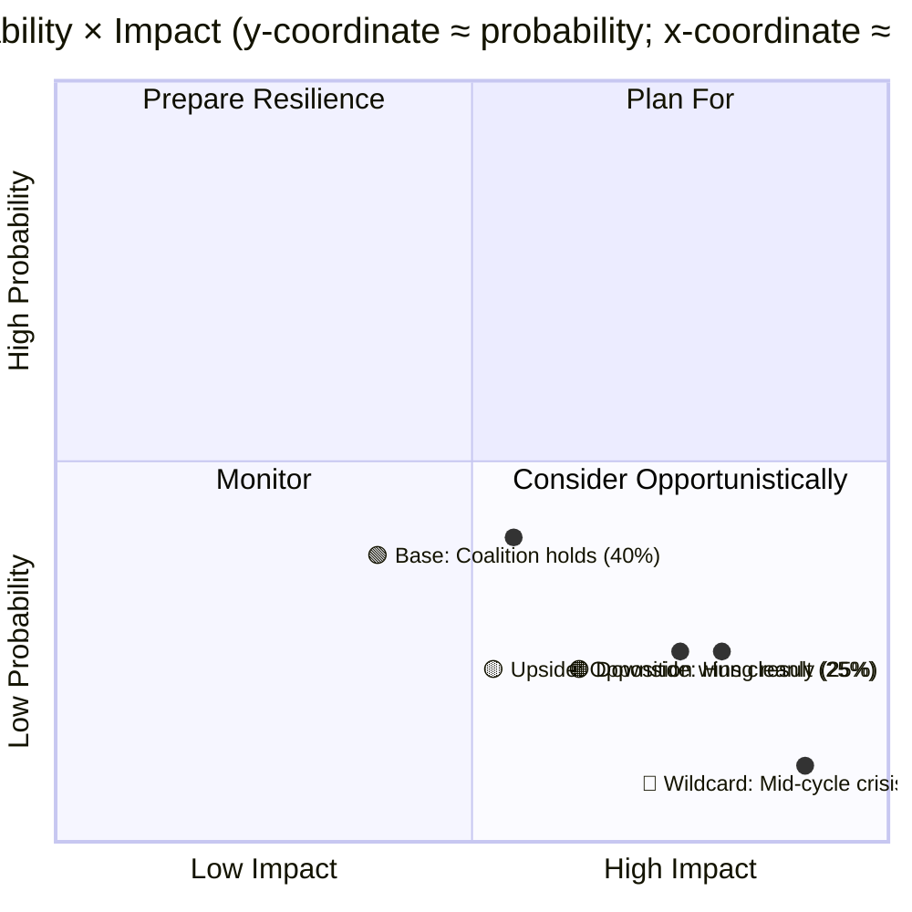
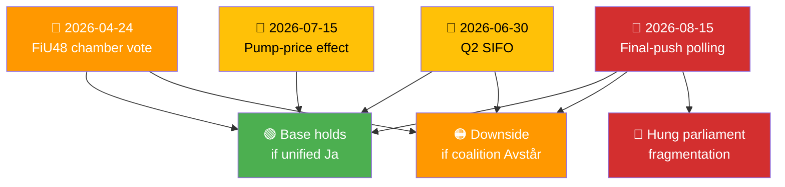

  

<h1 align="center">🔮 Scenario Analysis Template</h1>

  <strong>📊 Structured Future-State Analysis: Base · Upside · Downside · Wildcard</strong> 
  <em>🎯 Probability-Weighted · Trigger-Conditioned · Decision-Supporting</em>

  
  
  
  

**📋 Document Owner:** CEO | **📄 Version:** 1.0 | **📅 Last Updated:** 2026-04-21 (UTC)
**🏢 Owner:** Hack23 AB (Org.nr 5595347807) | **🏷️ Classification:** Public

> **📌 Template instructions:** Produce when a day's documents carry multi-path uncertainty or the run includes P0/P1-significance material. Save as `analysis/daily/${ARTICLE_DATE}/${DOC_TYPE}/scenario-analysis.md`. Uses the 5-level confidence scale and DIW weighting defined in [ai-driven-analysis-guide.md](../methodologies/ai-driven-analysis-guide.md).

> **✨ What to produce:** Four named scenarios (Base, Upside, Downside, Wildcard), each with explicit probability, trigger conditions, early warning signals, and a decision-playbook paragraph. Probabilities sum to 100%.

---

## 🔄 Tradecraft Context

| Field | Value |
|-------|-------|
| **F3EAD stage** | `Analyze / Disseminate` |
| **PIRs** | `list the priority intelligence requirements this scenario set answers` |
| **Admiralty floor** | `B2 for trigger conditions; A1 for anchor evidence from primary MCP sources` |
| **SATs used** | `Alternative Futures Analysis; Key Assumptions Check; Indicators & Signposts; Premortem` |
| **ICD 203 standards applied** | `uncertainty, alternative analysis, confidence, argumentation, customer relevance` |

> See [`political-style-guide.md`](../methodologies/political-style-guide.md) for canonical F3EAD / PIR catalog / Admiralty Code / ICD 203 / WEP / SATs definitions.

---

## 📋 Scenario Context

| Field | Value |
|-------|-------|
| **Scenario ID** | `SCN-YYYY-MM-DD-NNN` |
| **Generated** | `YYYY-MM-DD HH:MM UTC` |
| **Question** | `e.g., "Will the September 2026 election return the current coalition?"` |
| **Time horizon** | `e.g., 2026-09-13 (election day) / 6-month / 12-month` |
| **Decision supported** | `e.g., "Editorial coverage weight through Q3 2026"` |
| **Source documents** | `list of dok_ids` |
| **Overall Confidence** | `🟩 HIGH / 🟧 MEDIUM / 🟥 LOW` |

---

## 🧭 Scenario Quadrant

---

## 📊 Scenario Set

### 🟢 Scenario A — Base Case (probability **40 %**)

| Field | Value |
|-------|-------|
| **Name** | Base — Coalition holds with SD confidence & supply |
| **Probability** | 40 % (🟩 HIGH) |
| **Headline** | Kristersson government retains office with modified mandate |
| **Trigger conditions** | Coalition + SD sustain ≥ 47 % polling through August 2026; no crisis event |
| **Early warning signals** | (a) cost-of-living package lands within voter segments 1 & 2 by July; (b) no major KU scandal; (c) SD keeps confidence posture |
| **Outcome on key dimensions** | Budget continuity, justice agenda continues, climate pace moderated |
| **Decision implication** | Editorial: maintain standard coverage weighting; prepare for post-election budget continuity scenario |

### 🟡 Scenario B — Upside (probability **25 %**)

| Field | Value |
|-------|-------|
| **Name** | Upside — S-led opposition wins outright |
| **Probability** | 25 % (🟧 MEDIUM) |
| **Headline** | Social Democrats return with C + MP partners |
| **Trigger conditions** | Opposition block polls ≥ 52 % by Aug 2026; ULA (unemployment-linked affordability) narrative dominates |
| **Early warning signals** | (a) Q2 2026 SIFO gap ≥ 6 points; (b) SCB AKU June unemployment > 8.6 %; (c) EU-Commission rebuke on fuel-tax cut |
| **Outcome on key dimensions** | Budget redirection to welfare; green-transition acceleration; migration policy recalibration |
| **Decision implication** | Editorial: prepare policy-pivot coverage; commission expert-panel content on transition continuity |

### 🟠 Scenario C — Downside (probability **25 %**)

| Field | Value |
|-------|-------|
| **Name** | Downside — Hung parliament / protracted formation |
| **Probability** | 25 % (🟧 MEDIUM) |
| **Headline** | No bloc reaches 175 seats; multi-week government formation |
| **Trigger conditions** | No bloc > 48 % in final polls; SD shifts position during campaign |
| **Early warning signals** | (a) fragmented polling by late July; (b) leadership challenges in smaller parties; (c) late-campaign defections |
| **Outcome on key dimensions** | Interim government; budget via caretaker rules; institutional stress |
| **Decision implication** | Editorial: activate constitutional-crisis playbook; commission KU + Statsrätt analyses; boost capacity |

### 🔴 Scenario D — Wildcard (probability **10 %**)

| Field | Value |
|-------|-------|
| **Name** | Wildcard — Mid-cycle crisis (scandal / external shock / health event) |
| **Probability** | 10 % (🟥 LOW) |
| **Headline** | External event reshapes the race |
| **Trigger conditions** | One of: major KU reprimand, Riksbank crisis action, NATO escalation, public-health emergency |
| **Early warning signals** | (a) unusual opinion-poll volatility; (b) government-agency resignations; (c) regional escalations |
| **Outcome on key dimensions** | Unpredictable; likely short-term rally-around-the-flag then realignment |
| **Decision implication** | Editorial: pre-draft crisis explainers; maintain rapid-response editorial shift capacity |

**Probability check: 40 + 25 + 25 + 10 = 100 %** ✅

---

## 🧩 Drivers & Dependencies

| Driver | Current signal | Confidence | Scenarios affected |
|--------|----------------|:----------:|--------------------|
| GDP growth trajectory (SCB + IMF WEO) | +0.82 % 2024, +1.8 % 2026 proj | 🟦 VERY HIGH | A, B, C |
| SIFO/Novus polling gap | −4 pt government disadvantage Apr 2026 | 🟩 HIGH | A, B, C |
| SD confidence-supply posture | Stable through FiU48 | 🟩 HIGH | A, C |
| EU-Commission Green-Deal response | Awaited, 0–30 d horizon | 🟧 MEDIUM | A, B |
| NATO/Ukraine situation | Active, escalation risk moderate | 🟧 MEDIUM | D |

---

## 🔮 Early-Warning Dashboard

---

## 📘 Decision Playbook

| Scenario | Action 1 | Action 2 | Action 3 |
|----------|----------|----------|----------|
| A (Base) | Maintain normal coverage cadence | Prepare post-election budget-continuity explainer | Track SD confidence-supply signals |
| B (Upside) | Commission policy-pivot explainer series | Stand up transition-team coverage | Prepare international-reaction pieces |
| C (Downside) | Activate constitutional-crisis playbook | Commission Statsrätt / KU analyses | Expand multilingual-explainer capacity |
| D (Wildcard) | Pre-draft crisis templates | Maintain real-time monitoring intensified by 2× | Prepare coordinated EN + SV rapid response |

---

## 🔁 Update Cadence

| Interval | Action |
|----------|--------|
| Weekly (Sunday) | Update probabilities from polling + macro signals |
| On-trigger (any W-signal) | Immediate rerun of affected scenarios + downstream analyses |
| Monthly | Full rewrite with pass-2 deep review |

---

**Document Control**
- **Template path:** `/analysis/templates/scenario-analysis.md`
- **Referenced by:** [ai-driven-analysis-guide.md § Step 5](../methodologies/ai-driven-analysis-guide.md#step-5--extensions-family-c--d-produced-when-warranted)
- **Classification:** Public
- **Next Review:** 2026-07-21
