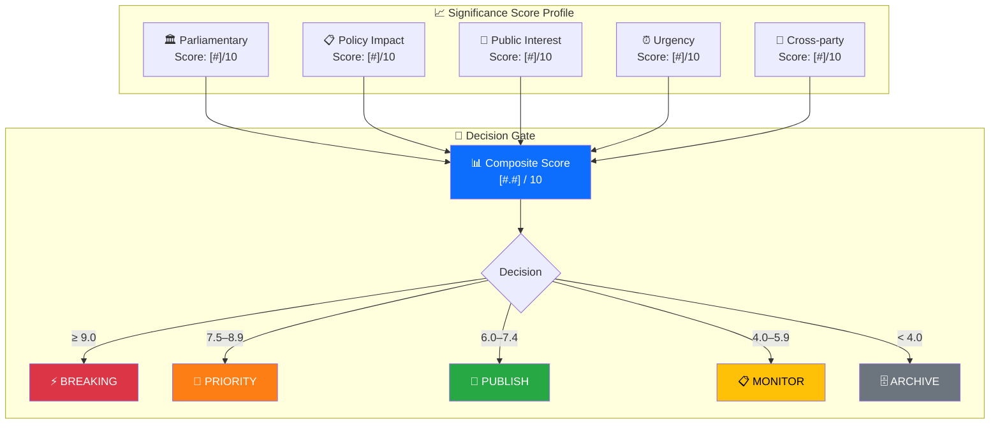

<p align="center">
  
</p>

<h1 align="center">📈 Political Significance Scoring Template</h1>

<p align="center">
  <strong>📊 Composite Scoring for Publication Decision Support</strong><br>
  <em>🎯 Parliamentary · Policy · Public Interest · Urgency · Cross-party Relevance</em>
</p>

<p align="center">
  <a href="#"></a>
  <a href="#"></a>
  <a href="#"></a>
  <a href="#"></a>
</p>

**📋 Document Owner:** CEO | **📄 Version:** 2.2 | **📅 Last Updated:** 2026-04-06 (UTC)  
**🏢 Owner:** Hack23 AB (Org.nr 5595347807) | **🏷️ Classification:** Public

> **📌 Template Instructions:** Copy to `analysis/daily/YYYY-MM-DD/{articleType}/` and save as `significance-scoring.md` in the workflow's own folder (never overwrite another workflow's files). The significance scorer TypeScript implementation is at `scripts/analysis-framework/significance-scorer.ts` — this provides automated numeric scores only. AI must provide the **analytical rationale** explaining why documents score as they do.
>
> **Implementation Reference:** The TypeScript scorer uses a 6-dimension weighted model (0.25/0.20/0.15/0.20/0.10/0.10) and returns an integer score (1–10) via rounding. Treat this template as a separate manual rubric for editorial context, not as the source of truth for automated scoring outputs.
>
> **Score Reconciliation:** When manual and automated scores diverge by more than 3 points (e.g., manual=3, automated=7), the AI analyst must: (1) use the HIGHER score for editorial routing, (2) note the divergence in the scoring rationale, (3) flag for human editorial review. This ensures no significant event is under-classified.

> **🚨 Anti-Pattern Warning:** Plain prose without structured tables, Mermaid diagrams, or evidence citations is REJECTED. Every analysis file MUST follow this template exactly: metadata header, structured tables with evidence columns, ≥1 color-coded Mermaid diagram, confidence labels on all claims. See [ai-driven-analysis-guide.md](../methodologies/ai-driven-analysis-guide.md) for good vs. bad examples.


---

## 📋 Event Context

| Field | Value |
|-------|-------|
| **Score ID** | `[REQUIRED: SIG-YYYY-MM-DD-NNN]` |
| **Event / Document** | `[REQUIRED: brief event name]` |
| **Primary dok_id** | `[REQUIRED: Riksdag document ID]` |
| **Scoring Date** | `[REQUIRED: YYYY-MM-DD HH:MM UTC]` |
| **Scored By** | `[REQUIRED: workflow name, e.g. news-article-generator]` |
| **Classification ID** | `[OPTIONAL: CLS-ID if already classified]` |

---

## 📊 Section 1: Individual Event Scoring

### Scoring Profile & Decision Gate

> **AI Instructions:** After scoring each dimension, this diagram visualizes the scoring profile and routing decision. Replace `[#]` values with actual scores.



Score each dimension from **0 to 10**. See calibration examples below.

### Dimension 1: Parliamentary Significance (0–10)

*Measures how central this event is to Riksdag legislative processes, constitutional functions, or governmental oversight.*

| Sub-criterion | Score (0–3) | Rationale |
|--------------|:-----------:|-----------|
| Legislative stage (Committee=1, Floor vote=2, Final passage=3) | `[#]` | `[REQUIRED]` |
| Constitutional/oversight dimension (no=0, minor=1, major=2, crisis=3) | `[#]` | `[REQUIRED]` |
| Number of MPs formally involved (1–9=1, 10–49=2, 50+=3, all 349=3) | `[#]` | `[REQUIRED]` |

**Parliamentary Significance Score:** `[REQUIRED: sum, max 9, normalise to 0–10]` `/10`

---

### Dimension 2: Policy Impact (0–10)

*Measures the breadth and depth of policy change if this event results in legislation or government action.*

| Sub-criterion | Score (0–3) | Rationale |
|--------------|:-----------:|-----------|
| Scope (1=local, 2=national, 3=EU/international) | `[#]` | `[REQUIRED]` |
| Duration (1=temporary, 2=multi-year, 3=permanent/structural) | `[#]` | `[REQUIRED]` |
| Affected population (1=<100K, 2=100K–5M, 3=>5M) | `[#]` | `[REQUIRED]` |

**Policy Impact Score:** `[REQUIRED: sum, max 9, normalise to 0–10]` `/10`

---

### Dimension 3: Public Interest (0–10)

*Measures likely public and media attention based on topic salience and emotional resonance.*

| Sub-criterion | Score (0–3) | Rationale |
|--------------|:-----------:|-----------|
| Topic salience (welfare/crime/economy=3, niche=1) | `[#]` | `[REQUIRED]` |
| Controversy level (consensus=0, partisan=2, polarising=3) | `[#]` | `[REQUIRED]` |
| Citizen-facing impact (abstract=0, direct=3) | `[#]` | `[REQUIRED]` |

**Public Interest Score:** `[REQUIRED: sum, max 9, normalise to 0–10]` `/10`

---

### Dimension 4: Urgency (0–10)

*Measures time-sensitivity: how quickly must a response or publication decision be made?*

| Sub-criterion | Score (0–3) | Rationale |
|--------------|:-----------:|-----------|
| Time horizon (>30 days=0, 8–30 days=1, 2–7 days=2, <48h=3) | `[#]` | `[REQUIRED]` |
| Reversibility (easily reversed=0, difficult=2, irreversible=3) | `[#]` | `[REQUIRED]` |
| Cascade risk (isolated=0, single cascade=1, multiple=3) | `[#]` | `[REQUIRED]` |

**Urgency Score:** `[REQUIRED: sum, max 9, normalise to 0–10]` `/10`

---

### Dimension 5: Cross-party Relevance (0–10)

*Measures whether the event cuts across party lines, indicating broader democratic significance.*

| Sub-criterion | Score (0–3) | Rationale |
|--------------|:-----------:|-----------|
| Parties directly involved (1=1, 2–4=2, 5+=3) | `[#]` | `[REQUIRED]` |
| Coalition implication (none=0, tests alliance=2, fractures=3) | `[#]` | `[REQUIRED]` |
| Opposition response strength (silence=0, statement=1, formal motion=3) | `[#]` | `[REQUIRED]` |

**Cross-party Relevance Score:** `[REQUIRED: sum, max 9, normalise to 0–10]` `/10`

---

### 📐 Composite Score Calculation (Manual Analyst Rubric)

> **⚠️ This manual rubric uses a DIFFERENT scoring model from the automated TypeScript scorer.**
> The automated `morning-significance-scores.json` is computed by `scripts/analysis-framework/significance-scorer.ts` using **6 dimensions** with weights 0.25/0.20/0.15/0.20/0.10/0.10 (Document type, Committee tier, Policy domain breadth, Coalition context, Content richness, Perspective impact) and returns an **integer 1–10**.
> The manual rubric below uses **5 analyst-facing dimensions** with different weights (0.25/0.25/0.20/0.15/0.15). Scores from this template are **not directly comparable** to automated scores and should not be used to override them.

```
Manual Composite = (Parliamentary × 0.25) + (Policy × 0.25) + (Public Interest × 0.20) 
                 + (Urgency × 0.15) + (Cross-party × 0.15)

Maximum possible: 10.0   (integer rounding recommended for consistency with automated scores)
```

| Dimension | Raw Score | Weight | Weighted Score |
|-----------|:---------:|:------:|:--------------:|
| Parliamentary Significance | `[#]` | 0.25 | `[#×0.25]` |
| Policy Impact | `[#]` | 0.25 | `[#×0.25]` |
| Public Interest | `[#]` | 0.20 | `[#×0.20]` |
| Urgency | `[#]` | 0.15 | `[#×0.15]` |
| Cross-party Relevance | `[#]` | 0.15 | `[#×0.15]` |
| **MANUAL COMPOSITE SCORE** | — | — | **`[sum]` / 10** |

---

### 🚦 Publication Decision Thresholds

| Score Range | Threshold | Decision | Action |
|-------------|-----------|----------|--------|
| **0.0 – 3.9** | Below noise floor | 🗄️ **Archive** | Log for trend analysis; do not publish |
| **4.0 – 5.9** | Low significance | 📋 **Monitor** | Track for follow-up; consider weekly digest |
| **6.0 – 7.4** | Publication threshold | 📰 **Publish** | Include in next standard news cycle |
| **7.5 – 8.9** | High significance | 📰 **Priority** | Prioritise in daily news; prominent placement |
| **9.0 – 10.0** | Breaking threshold | ⚡ **Breaking** | Publish immediately; all-language deployment |

**This Event's Decision:** `[REQUIRED: Archive / Monitor / Publish / Priority / Breaking]`  
**Decision Rationale:** `[REQUIRED: 1–2 sentences]`

---

## 📊 Section 2: Batch Scoring Table

*Use this table when scoring multiple events in a single session (e.g., morning significance run).*

| Event | dok_id | Parl. | Policy | Public | Urgency | X-party | **Composite** | Decision |
|-------|--------|:-----:|:------:|:------:|:-------:|:-------:|:-------------:|----------|
| `[event 1]` | `[ID]` | `[#]` | `[#]` | `[#]` | `[#]` | `[#]` | **`[score]`** | `[action]` |
| `[event 2]` | `[ID]` | `[#]` | `[#]` | `[#]` | `[#]` | `[#]` | **`[score]`** | `[action]` |
| `[event 3]` | `[ID]` | `[#]` | `[#]` | `[#]` | `[#]` | `[#]` | **`[score]`** | `[action]` |
| `[event 4]` | `[ID]` | `[#]` | `[#]` | `[#]` | `[#]` | `[#]` | **`[score]`** | `[action]` |
| `[event 5]` | `[ID]` | `[#]` | `[#]` | `[#]` | `[#]` | `[#]` | **`[score]`** | `[action]` |

---

## 📚 Section 3: Calibration Examples

These examples provide anchor points for consistent scoring across workflows:

| Event Type | Parl. | Policy | Public | Urgency | X-party | Composite | Notes |
|------------|:-----:|:------:|:------:|:-------:|:-------:|:---------:|-------|
| Routine committee report (no controversy) | 3 | 2 | 2 | 1 | 2 | **2.5** | Archive |
| New SOU report on pension reform | 5 | 7 | 7 | 3 | 6 | **5.8** | Monitor |
| Coalition budget agreement signed | 8 | 9 | 8 | 6 | 9 | **8.2** | Priority |
| No-confidence motion filed | 10 | 8 | 10 | 10 | 10 | **9.6** | Breaking |
| Minor amendment to technical regulation | 2 | 2 | 1 | 1 | 1 | **1.5** | Archive |
| PM announces new climate target | 7 | 8 | 9 | 5 | 8 | **7.7** | Priority |
| Parliament elects new Speaker | 9 | 5 | 7 | 8 | 10 | **7.8** | Priority |
| SD withdraws support on specific vote | 8 | 7 | 8 | 9 | 10 | **8.3** | Priority |

---

## 📊 Section 4: MCP Download Batch Scoring Table

*Use this table when scoring multiple events from a single MCP download session. Record the `dok_id` from the Riksdag API response for full traceability back to the source document.*

> **AI Instructions:** After each MCP data fetch (e.g., using `search_dokument` or `get_betankanden` on the `riksdag-regering-mcp` server), score every returned document here before deciding which events warrant full analysis. The `dok_id` column MUST match the identifier from the Riksdag Open Data API response.

| Event | dok_id | Parl. | Policy | Public | Urgency | X-Party | **Composite** | Decision |
|-------|--------|:-----:|:------:|:------:|:-------:|:-------:|:-------------:|----------|
| `[event 1]` | `[dok_id]` | `[#]` | `[#]` | `[#]` | `[#]` | `[#]` | **`[score]`** | `[action]` |
| `[event 2]` | `[dok_id]` | `[#]` | `[#]` | `[#]` | `[#]` | `[#]` | **`[score]`** | `[action]` |
| `[event 3]` | `[dok_id]` | `[#]` | `[#]` | `[#]` | `[#]` | `[#]` | **`[score]`** | `[action]` |

---

## 📚 Section 5: Riksdag Calibration Examples

*These pre-calculated anchor scenarios ensure consistent scoring across all workflows. Each example uses the manual 5-dimension weighted formula: `(Parl. × 0.25) + (Policy × 0.25) + (Public × 0.20) + (Urgency × 0.15) + (X-Party × 0.15)`.*

| Event Type | Parl. | Policy | Public | Urgency | X-Party | Composite | Notes |
|------------|:-----:|:------:|:------:|:-------:|:-------:|:---------:|-------|
| Routine committee opinion (no controversy) | 3 | 2 | 2 | 1 | 2 | **2.5** | Archive — below noise floor |
| Major government proposition on criminal justice | 5 | 7 | 7 | 3 | 6 | **5.8** | Monitor — track for follow-up |
| Coalition agreement on migration pact | 8 | 9 | 8 | 6 | 9 | **8.2** | Priority — prominent placement |
| Motion of no confidence (misstroendeförklaring) | 10 | 8 | 10 | 10 | 10 | **9.6** | Breaking — immediate all-language deploy |
| Minor technical amendment to regulation | 2 | 2 | 1 | 1 | 1 | **1.5** | Archive — log for trend only |
| SD withdrawal from Tidöavtalet | 9 | 8 | 9 | 8 | 10 | **8.8** | Priority — coalition fracture event |
| Routine skriftlig fråga about bus routes | 1 | 1 | 1 | 1 | 1 | **1.0** | Archive — minimal significance |

---

## 📂 Section 6: MCP Data Files Used

*Record every data file consulted during the scoring session for audit traceability and reproducibility.*

`[REQUIRED: List all analysis/daily/YYYY-MM-DD/{articleType}/data/ files consulted]`

| # | File Path | Source MCP Tool | Fetch Timestamp (UTC) |
|:-:|-----------|----------------|-----------------------|
| 1 | `analysis/daily/YYYY-MM-DD/{articleType}/data/[filename].json` | `[e.g. search_dokument]` | `[YYYY-MM-DD HH:MM UTC]` |
| 2 | `[path]` | `[tool]` | `[timestamp]` |
| 3 | `[path]` | `[tool]` | `[timestamp]` |

> **📌 Note:** All files listed above MUST exist in the repository at the stated paths. If a file was fetched but not persisted, note `(transient — not cached)` in the File Path column.

---

## 📊 Section 7: Relative Scoring — Same-Type Comparison

> **AI Instructions:** Compare this document's composite score with the average score for the same document type in recent analyses. This contextualises whether this event is unusually significant or routine for its category.

| Metric | Value |
|--------|-------|
| **This Document's Composite Score** | `[REQUIRED: #.#/10]` |
| **Same-Type Average (last 7 days)** | `[REQUIRED: #.#/10 or "N/A — insufficient data"]` |
| **Same-Type Median (last 7 days)** | `[OPTIONAL: #.#/10]` |
| **Deviation from Average** | `[REQUIRED: +#.# above / -#.# below / at average]` |
| **Percentile Rank** | `[OPTIONAL: e.g. "Top 10% of propositions this week"]` |

**Relative Significance Assessment:** `[REQUIRED: 1–2 sentences — e.g. "This proposition scores 2.3 points above the average for propositions this week, driven primarily by its cross-party dimension (8/10 vs. average 4.2/10). This is an outlier warranting Priority treatment."]`

### Same-Type Score Distribution (Last 7 Days)

| Document Type | Count | Min | Avg | Max | This Score | Relative Position |
|--------------|:-----:|:---:|:---:|:---:|:----------:|:----------------:|
| `[REQUIRED: e.g. Propositions]` | `[N]` | `[#.#]` | `[#.#]` | `[#.#]` | `[#.#]` | `[Above/At/Below avg]` |

---

## 🔗 Cross-References

> *Link to sibling analysis files and same-day analysis from other article types.*

| Related Analysis File | Relationship | Key Finding |
|----------------------|-------------|-------------|
| `[REQUIRED: e.g. classification-results.md]` | `[significance informs classification urgency]` | `[1 sentence]` |
| `[REQUIRED: e.g. synthesis-summary.md]` | `[significance drives synthesis ranking]` | `[1 sentence]` |
| `[OPTIONAL: same-day analysis from different article type]` | `[cross-reference]` | `[1 sentence]` |

---

## ✅ Quality Self-Check Checklist

> **Pre-commit validation — every item MUST be checked before finalising this scoring.**

- [ ] **Event Context complete:** Score ID, event name, dok_id, scoring date, scorer all filled
- [ ] **All 5 dimensions scored:** Parliamentary, Policy, Public Interest, Urgency, Cross-party all have 0–10 scores
- [ ] **Sub-criterion rationales provided:** Each sub-criterion (0–3) has a 1-sentence rationale
- [ ] **Composite Score calculated:** Weighted formula applied correctly (sum matches component scores)
- [ ] **Score Profile Mermaid rendered:** Decision gate diagram has actual scores (no `[#]` placeholders)
- [ ] **Publication Decision assigned:** Archive/Monitor/Publish/Priority/Breaking with rationale
- [ ] **Relative Scoring filled:** Same-type comparison with average and deviation calculated
- [ ] **Score Reconciliation checked:** If automated score diverges >3 points, higher score used and flagged
- [ ] **MCP Data Files listed:** All consulted data files with timestamps
- [ ] **No placeholder text remaining:** Search for `[REQUIRED` — zero hits expected
- [ ] **Cross-references linked:** At least 1 sibling analysis file referenced

---

**Document Control:**  
- **Template Path:** `/analysis/templates/significance-scoring.md`  
- **Version:** 2.2  
- **Effective Date:** 2026-04-06 (UTC)  
- **Scorer Implementation:** `scripts/analysis-framework/significance-scorer.ts`  
- **Advanced Sections:** Relative Scoring, Same-Type Comparison  
- **ISMS Alignment:** ISO 27001:2022 A.5.7 (Threat Intelligence), NIST CSF 2.0 ID.RA (Risk Assessment)  
- **Classification:** Public  
- **Owner:** Hack23 AB (Org.nr 5595347807)  
- **Next Review:** 2026-06-30
