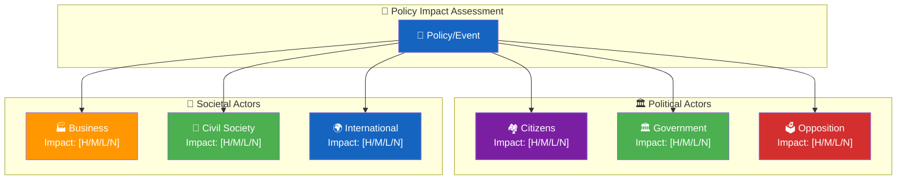
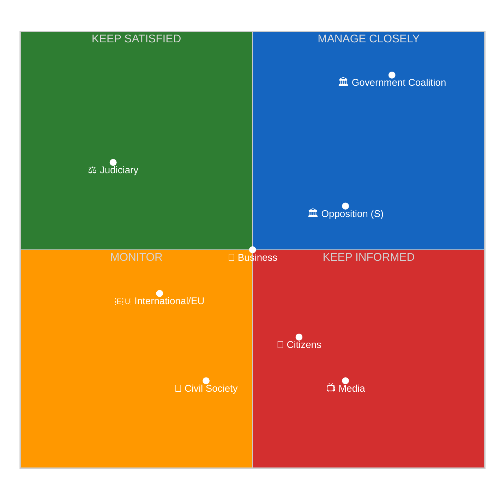

<p align="center">
  
</p>

<h1 align="center">👥 Stakeholder Impact Assessment Template</h1>

<p align="center">
  <strong>📊 Structured Impact Analysis Across Swedish Society</strong><br>
  <em>🎯 Citizens · Government · Opposition · Business · Civil Society · International · Judiciary · Media</em>
</p>

<p align="center">
  <a href="#"></a>
  <a href="#"></a>
  <a href="#"></a>
  <a href="#"></a>
</p>

**📋 Document Owner:** CEO | **📄 Version:** 2.5 | **📅 Last Updated:** 2026-04-25 (UTC)  
**🏢 Owner:** Hack23 AB (Org.nr 5595347807) | **🏷️ Classification:** Public

> **📌 Template Instructions:** Copy to `analysis/daily/YYYY-MM-DD/{articleType}/` and save as `stakeholder-impact.md` in the workflow's own folder (never overwrite another workflow's files). Complete the context block first, then assess each stakeholder group with specific evidence. AI must provide genuine impact analysis with named actors and dok_id citations — not generic "may affect business" prose.

> **🚨 Anti-Pattern Warning:** Generic stakeholder statements like "this may affect business environment" or "citizens may be impacted" without specific evidence are REJECTED. Every stakeholder assessment MUST name specific actors, cite specific documents, and provide specific impact mechanisms. See [ai-driven-analysis-guide.md](../methodologies/ai-driven-analysis-guide.md) for good vs. bad examples.


---

## 🔄 Tradecraft Context

| Element | Value |
|---------|-------|
| **F3EAD Stage** | **ANALYZE → DISSEMINATE** — translates raw documents into named-actor impact assessments that downstream synthesis, executive-brief and Family D voter-segmentation/coalition-mathematics consume. |
| **PIRs Served** | PIR-2 (opposition cohesion), PIR-3 (party-position drift), PIR-6 (economic transmission); add PIR-7 (foreign-policy alignment) when international stakeholders carry meaningful weight. |
| **Admiralty Floor** | **A1** for verbatim party / minister / committee statements; **B2** floor for inferred preference functions and reaction forecasts; **B3** acceptable for civil-society / interest-group positions sourced from press coverage. |
| **WEP + ODNI** | Position-alignment claims use **WEP** phrasing (`almost certainly opposes`, `likely supports`, `about even`); impact magnitude uses 1–5 scale with descriptive consequence narrative; confidence label per stakeholder row uses 5-level scale. |
| **Source Diversity Floor** | ≥1 primary statement per stakeholder group; ≥3 primary + ≥1 secondary for any HIGH-magnitude impact claim (impact ≥ 4); single-source HIGH-magnitude claims are downgraded or flagged `[unconfirmed]`. |
| **SAT(s) Applied** | Stakeholder Mapping (power × interest × position grid); Cross-Impact Analysis (between stakeholder groups); Devil's Advocacy (for HIGH-magnitude claims); Key Assumptions Check (on inferred preferences). |
| **ICD 203 Standards** | 1 (objectivity — equal treatment of all parties), 2 (independent), 5 (sourcing), 6 (logical argumentation), 8 (analytic value — names *who* is affected and *how*), 9 (alternative analysis — counter-narratives surfaced). |

> See [`osint-tradecraft-standards.md`](../methodologies/osint-tradecraft-standards.md) for canonical Admiralty Code / WEP / SAT / ICD 203 definitions, and [`political-style-guide.md`](../methodologies/political-style-guide.md) for the named-actor citation canon and confidence-labelling conventions.

---

## 📋 Assessment Context

| Field | Value |
|-------|-------|
| **Assessment ID** | `[REQUIRED: STA-YYYY-MM-DD-NNN]` |
| **Assessment Date** | `[REQUIRED: YYYY-MM-DD HH:MM UTC]` |
| **Policy/Event Subject** | `[REQUIRED: brief name of the policy decision or event being assessed]` |
| **Primary dok_id** | `[REQUIRED: Riksdag document ID]` |
| **Stage of Process** | `[REQUIRED: e.g. "Proposition submitted", "Committee vote", "Riksdag vote", "Government decree"]` |
| **Produced By** | `[REQUIRED: workflow name]` |
| **Overall Impact Level** | `[REQUIRED: HIGH / MEDIUM / LOW — based on highest stakeholder impact]` |

---

## 👥 Stakeholder Group Assessments

### Stakeholder Impact Overview

> **AI Instructions:** After completing each stakeholder assessment, update this diagram with actual impact levels (HIGH/MEDIUM/LOW/NONE). Node colors represent **stakeholder group types** (not impact tiers): purple = citizens, green = government/civil society, red = opposition, orange = business, blue = international/policy.



### 🏘️ Group 1: Citizens (Direct Impact)

*How directly does this policy affect Swedish citizens' daily lives, rights, welfare, or finances?*

| Parameter | Value |
|-----------|-------|
| **Impact Level** | `[REQUIRED: HIGH / MEDIUM / LOW / NONE]` |
| **Impact Timeline** | `[REQUIRED: IMMEDIATE (0–30 days) / SHORT (1–6 months) / MEDIUM (6–18 months) / LONG (18+ months)]` |
| **Affected Population** | `[REQUIRED: e.g. "All 10.5M residents", "Pensioners 65+", "Urban renters", "Asylum seekers"]` |
| **Impact Type** | `[REQUIRED: FINANCIAL / LEGAL / SOCIAL / HEALTH / EDUCATIONAL / COMBINATION]` |
| **Evidence Sources** | `[REQUIRED: dok_id(s), SCB statistics ref, or budget document]` |
| **Confidence Level** | `[REQUIRED: VERY HIGH / HIGH / MEDIUM / LOW / VERY LOW]` |

**Citizen Impact Narrative:**  
`[REQUIRED: 2–4 sentences explaining how ordinary citizens experience this change. Be specific about amounts (SEK), eligibility criteria, timelines, and regional variation if applicable. Reference the scripts/analysis-framework/lenses/citizen.ts perspective framework.]`

**Vulnerable Groups:** `[OPTIONAL: e.g. "Disproportionate impact on low-income households, asylum seekers, rural elderly"]`

---

### 🏛️ Group 2: Government Coalition

*How does this policy affect the governing coalition's political standing, internal cohesion, and electoral positioning?*

| Parameter | Value |
|-----------|-------|
| **Impact Level** | `[REQUIRED: HIGH / MEDIUM / LOW / NONE]` |
| **Impact Timeline** | `[REQUIRED: IMMEDIATE / SHORT / MEDIUM / LONG]` |
| **Primary Affected Parties** | `[REQUIRED: e.g. "M (primary), SD (secondary), KD (minor)"]` |
| **Coalition Cohesion Effect** | `[REQUIRED: STRENGTHENS / NEUTRAL / STRAINS / FRACTURES]` |
| **Evidence Sources** | `[REQUIRED: dok_id, debate ref, or interpellation]` |
| **Confidence Level** | `[REQUIRED: VERY HIGH / HIGH / MEDIUM / LOW / VERY LOW]` |

**Government Coalition Impact Narrative:**  
`[REQUIRED: 2–3 sentences. Reference scripts/analysis-framework/lenses/government.ts.]`

---

### 🗳️ Group 3: Opposition Parties

*How does this policy affect opposition parties' strategic positioning, electoral prospects, and legislative influence?*

| Parameter | Value |
|-----------|-------|
| **Impact Level** | `[REQUIRED: HIGH / MEDIUM / LOW / NONE]` |
| **Impact Timeline** | `[REQUIRED: IMMEDIATE / SHORT / MEDIUM / LONG]` |
| **Primary Affected Parties** | `[REQUIRED: e.g. "S (gains credibility), V (opposition opportunity), MP (marginalised)"]` |
| **Electoral Positioning Effect** | `[REQUIRED: POSITIVE / NEUTRAL / NEGATIVE — from opposition perspective]` |
| **Evidence Sources** | `[REQUIRED: anföranden refs or motion dok_ids]` |
| **Confidence Level** | `[REQUIRED: VERY HIGH / HIGH / MEDIUM / LOW / VERY LOW]` |

**Opposition Impact Narrative:**  
`[REQUIRED: 2–3 sentences. Reference scripts/analysis-framework/lenses/opposition.ts.]`

---

### 🏭 Group 4: Business Sector

*How does this policy affect Swedish businesses, industries, labour market, and economic competitiveness?*

| Parameter | Value |
|-----------|-------|
| **Impact Level** | `[REQUIRED: HIGH / MEDIUM / LOW / NONE]` |
| **Impact Timeline** | `[REQUIRED: IMMEDIATE / SHORT / MEDIUM / LONG]` |
| **Most Affected Sectors** | `[REQUIRED: e.g. "Construction, real estate, manufacturing", "Financial services"]` |
| **Economic Impact Type** | `[REQUIRED: COMPLIANCE COST / MARKET OPPORTUNITY / REGULATORY BURDEN / TAX CHANGE / OTHER]` |
| **Estimated Financial Impact** | `[OPTIONAL: e.g. "±X BSEK annually per Finansdepartementet estimate"]` |
| **Evidence Sources** | `[REQUIRED: proposition dok_id, Riksbank ref, or SOU]` |
| **IMF Macro Anchor** | `[REQUIRED for any macroeconomic claim: citation + vintage, e.g. "WEO:NGDP_RPCH (WEO Apr-2026): real GDP growth 2.1 %"]` |
| **Confidence Level** | `[REQUIRED: VERY HIGH / HIGH / MEDIUM / LOW / VERY LOW]` |

**Business Sector Impact Narrative:**  
`[REQUIRED: 2–3 sentences. Reference scripts/analysis-framework/lenses/economic.ts.]`

> **IMF Economic Provenance (REQUIRED for any macro / fiscal / trade / exchange-rate claim):**
> Every macro-sensitive statement in this section cites an IMF indicator by its canonical `DATABASE:INDICATOR_ID` citation with a vintage tag — see [`analysis/imf/README.md`](../imf/README.md) §8 and [`.github/aw/ECONOMIC_DATA_CONTRACT.md`](../../.github/aw/ECONOMIC_DATA_CONTRACT.md) v3.0.
>
> Typical business-sector citations:
> - Real GDP growth — `WEO:NGDP_RPCH`
> - Inflation (CPI) — `WEO:PCPIPCH`
> - Unemployment rate — `WEO:LUR`
> - Exports volume growth — `WEO:TX_RPCH`
> - Bilateral goods trade — `DOTS:TXG_FOB_USD` (per partner country)
> - Exchange rate (SEK/USD) — `ER:ENDA_XDC_USD_RATE`
>
> Use `findImfIndicatorsForCommittee('NU')` (commerce) or `findImfIndicatorsForCommittee('AU')` (labour) in [`scripts/imf-context.ts`](../../scripts/imf-context.ts) for a programmatic peer-set query.

---

### 🤝 Group 5: Civil Society

*How does this policy affect NGOs, trade unions, religious organisations, advocacy groups, and civic institutions?*

| Parameter | Value |
|-----------|-------|
| **Impact Level** | `[REQUIRED: HIGH / MEDIUM / LOW / NONE]` |
| **Impact Timeline** | `[REQUIRED: IMMEDIATE / SHORT / MEDIUM / LONG]` |
| **Most Affected Organisations** | `[REQUIRED: e.g. "LO, TCO (labour)", "Rädda Barnen (welfare)", "Greenpeace (environment)"]` |
| **Civil Society Response** | `[REQUIRED: SUPPORTIVE / NEUTRAL / OPPOSED / DIVIDED]` |
| **Evidence Sources** | `[REQUIRED: remissvar refs, consultation documents, or media statements]` |
| **Confidence Level** | `[REQUIRED: VERY HIGH / HIGH / MEDIUM / LOW / VERY LOW]` |

**Civil Society Impact Narrative:**  
`[REQUIRED: 2–3 sentences.]`

---

### 🌍 Group 6: International / EU

*How does this policy affect Sweden's international relationships, EU obligations, treaty compliance, or bilateral agreements?*

| Parameter | Value |
|-----------|-------|
| **Impact Level** | `[REQUIRED: HIGH / MEDIUM / LOW / NONE]` |
| **Impact Timeline** | `[REQUIRED: IMMEDIATE / SHORT / MEDIUM / LONG]` |
| **Affected Relationships** | `[REQUIRED: e.g. "EU Commission (sanctions risk)", "NATO allies", "Nordic Council"]` |
| **Treaty/Directive Compliance** | `[REQUIRED: COMPLIANT / AT RISK / NON-COMPLIANT / UNCERTAIN]` |
| **Evidence Sources** | `[REQUIRED: EU directive refs, international agreement dok_ids]` |
| **Confidence Level** | `[REQUIRED: VERY HIGH / HIGH / MEDIUM / LOW / VERY LOW]` |

**International Impact Narrative:**  
`[REQUIRED: 2–3 sentences. Reference scripts/analysis-framework/lenses/international.ts.]`

---

## 📊 Impact Summary Matrix

> *Numeric encoding for internal analysis: NONE = 0, LOW = 1, MEDIUM = 2, HIGH = 3 (map to the Impact Level column).*

| Stakeholder Group | Impact Level | Timeline | Confidence | Net Political Effect |
|-------------------|:------------:|:--------:|:----------:|---------------------|
| 🏘️ Citizens | `[H/M/L/N]` | `[I/S/M/L]` | `[H/M/L]` | `[REQUIRED: positive/negative/neutral]` |
| 🏛️ Gov Coalition | `[H/M/L/N]` | `[I/S/M/L]` | `[H/M/L]` | `[REQUIRED]` |
| 🗳️ Opposition | `[H/M/L/N]` | `[I/S/M/L]` | `[H/M/L]` | `[REQUIRED]` |
| 🏭 Business | `[H/M/L/N]` | `[I/S/M/L]` | `[H/M/L]` | `[REQUIRED]` |
| 🤝 Civil Society | `[H/M/L/N]` | `[I/S/M/L]` | `[H/M/L]` | `[REQUIRED]` |
| 🌍 International | `[H/M/L/N]` | `[I/S/M/L]` | `[H/M/L]` | `[REQUIRED]` |
| ⚖️ Judiciary | `[H/M/L/N]` | `[I/S/M/L]` | `[H/M/L]` | `[REQUIRED]` |
| 📰 Media | `[H/M/L/N]` | `[I/S/M/L]` | `[H/M/L]` | `[REQUIRED]` |

---

## 🔑 Key Insights

`[REQUIRED: 3–5 sentences identifying the most significant stakeholder dynamics. Which groups are in tension? Where are unexpected winners/losers? What are the second-order political effects? Reference specific stakeholder interactions.]`

### Conflicting Impact Resolution

When stakeholder impacts conflict (e.g., Citizens benefit but Business bears costs):

| Pattern | Overall Assessment | Editorial Framing |
|---------|-------------------|-------------------|
| Citizens positive + Business negative | **Politically significant** — redistribution dynamic | Lead with citizen impact; note business costs |
| Government positive + Opposition negative | **Standard partisan** — expected dynamics | Present both perspectives equally |
| Citizens negative + Government positive | **Accountability concern** — policy vs. people | Lead with citizen impact; scrutinize government rationale |
| All stakeholders negative | **System-level problem** — policy failure signal | Frame as shared challenge requiring cross-party response |
| All stakeholders positive | **Rare consensus** — highlight cross-party achievement | Note rarity; check for hidden costs or losers |

**Publish Recommendation:** `[REQUIRED: YES — HIGH public interest / YES — MEDIUM interest / MONITOR — low standalone value]`

---

## ⚖️ Stakeholder Group: Judiciary (Domstolsväsendet)

_Note: In the Extended Impact Summary Matrix, stakeholder groups may appear in a different row order. Always cross‑reference by stakeholder name (e.g. "Judiciary") rather than by numeric group or row number._

*How does this policy affect judicial independence, court workload, legal precedent, or constitutional compliance?*

| Parameter | Value |
|-----------|-------|
| **Impact Level** | `[REQUIRED: HIGH / MEDIUM / LOW / NONE]` |
| **Impact Timeline** | `[REQUIRED: IMMEDIATE / SHORT / MEDIUM / LONG]` |
| **Affected Institutions** | `[REQUIRED: e.g. "Högsta domstolen", "Förvaltningsrätten", "Kammarrätten", "JO (Justitieombudsmannen)"]` |
| **Constitutional Compliance** | `[REQUIRED: COMPLIANT / CONSTITUTIONAL RISK / UNDER REVIEW / UNCERTAIN]` |
| **Legal Precedent Impact** | `[REQUIRED: NONE / MINOR ADJUSTMENT / SIGNIFICANT SHIFT / NEW PRECEDENT]` |
| **Evidence Sources** | `[REQUIRED: Lagrådet remiss, SOU dok_id, or constitutional analysis]` |
| **Confidence Level** | `[REQUIRED: VERY HIGH / HIGH / MEDIUM / LOW / VERY LOW]` |

**Judiciary Impact Narrative:**  
`[REQUIRED: 2–3 sentences. Consider Lagrådet opinions, constitutional implications under Regeringsformen (RF), court capacity, and effects on rule-of-law guarantees. Note any EU Charter of Fundamental Rights interactions.]`

---

## 📰 Stakeholder Group: Media & Public Discourse

*How does this policy affect media coverage dynamics, public debate framing, and information ecosystem?*

| Parameter | Value |
|-----------|-------|
| **Impact Level** | `[REQUIRED: HIGH / MEDIUM / LOW / NONE]` |
| **Impact Timeline** | `[REQUIRED: IMMEDIATE / SHORT / MEDIUM / LONG]` |
| **Media Salience** | `[REQUIRED: DOMINANT STORY / SIGNIFICANT / MINOR / NEGLIGIBLE]` |
| **Framing Dynamics** | `[REQUIRED: e.g. "Government frames as security; opposition as civil liberties threat"]` |
| **Key Media Actors** | `[REQUIRED: e.g. "SVT Nyheter, DN ledare, Expressen, SR Ekot"]` |
| **Evidence Sources** | `[REQUIRED: media monitoring refs, press conference dok_ids, or debate transcripts]` |
| **Confidence Level** | `[REQUIRED: VERY HIGH / HIGH / MEDIUM / LOW / VERY LOW]` |

**Media Impact Narrative:**  
`[REQUIRED: 2–3 sentences. Reference scripts/analysis-framework/lenses/media.ts. Describe the anticipated media cycle, competing narratives, and whether the issue will sustain public attention or be displaced.]`

---

## 📊 Extended Impact Summary Matrix

> **AI Instructions:** This extended matrix consolidates all 8 stakeholder groups including Judiciary and Media — use it for the final editorial-quality overview. Populate after completing ALL individual assessments above.

| # | Stakeholder Group | Impact Level | Timeline | Confidence | Net Effect | Key Risk / Opportunity |
|:-:|-------------------|:------------:|:--------:|:----------:|:----------:|------------------------|
| 1 | 🏛️ Government Coalition | `[H/M/L/N]` | `[I/S/M/L]` | `[H/M/L]` | `[positive/negative/neutral]` | `[REQUIRED: one-line risk or opportunity]` |
| 2 | 🗳️ Opposition Bloc (S+V+MP+C) | `[H/M/L/N]` | `[I/S/M/L]` | `[H/M/L]` | `[positive/negative/neutral]` | `[REQUIRED]` |
| 3 | 👥 Citizens | `[H/M/L/N]` | `[I/S/M/L]` | `[H/M/L]` | `[positive/negative/neutral]` | `[REQUIRED]` |
| 4 | 💰 Business & Industry | `[H/M/L/N]` | `[I/S/M/L]` | `[H/M/L]` | `[positive/negative/neutral]` | `[REQUIRED]` |
| 5 | ⚖️ Judiciary | `[H/M/L/N]` | `[I/S/M/L]` | `[H/M/L]` | `[positive/negative/neutral]` | `[REQUIRED]` |
| 6 | 📰 Media | `[H/M/L/N]` | `[I/S/M/L]` | `[H/M/L]` | `[positive/negative/neutral]` | `[REQUIRED]` |
| 7 | 🤝 Civil Society | `[H/M/L/N]` | `[I/S/M/L]` | `[H/M/L]` | `[positive/negative/neutral]` | `[REQUIRED]` |
| 8 | 🌍 International Partners (EU, Nordic) | `[H/M/L/N]` | `[I/S/M/L]` | `[H/M/L]` | `[positive/negative/neutral]` | `[REQUIRED]` |

> *Legend — Impact: **H**igh/**M**edium/**L**ow/**N**one · Timeline: **I**mmediate/**S**hort/**M**edium/**L**ong · Confidence: **H**igh/**M**edium/**L**ow*

---

## 🔑 Extended Key Insights & Editorial Guidance

`[REQUIRED: 3–5 sentences identifying the most significant stakeholder dynamics. Which groups are in tension? Where are unexpected winners/losers? What are the second-order political effects? Consider cross-cutting themes: does this policy create new coalition fault lines, shift the Overton window, or establish precedents that constrain future governments?]`

### Inter-Stakeholder Tension Map

> **AI Instructions:** Identify the two strongest stakeholder tensions and describe the political mechanism. This drives editorial angle selection.

| Tension Pair | Direction | Mechanism | Editorial Relevance |
|--------------|:---------:|-----------|---------------------|
| `[e.g. Citizens ↔ Business]` | `[→ or ←]` | `[REQUIRED: e.g. "Higher employer taxes fund citizen benefit, reducing business competitiveness"]` | `[HIGH/MEDIUM/LOW]` |
| `[e.g. Government ↔ Judiciary]` | `[→ or ←]` | `[REQUIRED: e.g. "Fast-tracked legislation bypasses Lagrådet, raising constitutional concerns"]` | `[HIGH/MEDIUM/LOW]` |

**Publish Recommendation:** `[REQUIRED: YES — HIGH interest / YES — MEDIUM interest / MONITOR — low standalone value]`  
**Recommended Article Type:** `[REQUIRED: BREAKING / ANALYSIS / DEEP-DIVE / MONITOR-ONLY]`  
**Suggested Headline Angle:** `[REQUIRED: one sentence framing the most newsworthy stakeholder dynamic]`

---

## 📂 MCP Data Files Used

> **AI Instructions:** List ALL `analysis/daily/YYYY-MM-DD/{articleType}/data/` files consulted during this assessment. This ensures traceability and reproducibility. Include both Riksdag and Regering data sources accessed via MCP tools.

| # | File Path | Data Type | Freshness | Notes |
|:-:|-----------|-----------|:---------:|-------|
| 1 | `[REQUIRED: e.g. analysis/daily/2026-03-30/budget-analysis/data/proposition.json]` | `[e.g. Proposition]` | `[REQUIRED: date]` | `[brief relevance note]` |
| 2 | `[REQUIRED: e.g. analysis/daily/2026-03-30/budget-analysis/data/votering.json]` | `[e.g. Voting record]` | `[REQUIRED: date]` | `[brief relevance note]` |
| 3 | `[REQUIRED: additional data file]` | `[type]` | `[date]` | `[note]` |

### MCP Tools Invoked

| Tool | Purpose | Parameters |
|------|---------|------------|
| `[REQUIRED: e.g. search_dokument]` | `[e.g. "Fetched proposition H901FiU1"]` | `[key params used]` |
| `[REQUIRED: e.g. search_voteringar]` | `[e.g. "Voting records for bet 2024/25:FiU1"]` | `[key params used]` |
| `[REQUIRED: e.g. search_regering]` | `[e.g. "Government press releases on budget"]` | `[key params used]` |

> **Traceability Note:** Every factual claim in the stakeholder assessments above MUST be traceable to a file or MCP tool invocation listed in this section. Unsubstantiated claims are REJECTED during editorial review.

---

## 📊 Stakeholder Position Change Tracking

> **AI Instructions:** Track how stakeholder positions changed as a result of this policy/event compared to their previous known stance. This enables longitudinal stakeholder analysis.

| Stakeholder | Position BEFORE This Document | Position AFTER This Document | Shift Direction | Evidence |
|------------|------------------------------|-----------------------------:|:---------------:|---------|
| `[REQUIRED: e.g. Government Coalition]` | `[e.g. Strong support for reform]` | `[e.g. Qualified support — SD demands amendments]` | `[→ weakened / → strengthened / → unchanged]` | `[dok_id]` |
| `[REQUIRED: e.g. Opposition (S)]` | `[e.g. Opposed on principle]` | `[e.g. Offers conditional support on amendment]` | `[→ softened / → hardened / → unchanged]` | `[dok_id]` |
| `[REQUIRED: e.g. Business Sector]` | `[previous stance]` | `[current stance]` | `[shift]` | `[evidence]` |
| `[OPTIONAL]` | `[previous]` | `[current]` | `[shift]` | `[evidence]` |

**Most Significant Position Shift:** `[REQUIRED: Which stakeholder shifted most and why?]`

---

## 📐 Power-Interest Grid

> **AI Instructions:** Place each stakeholder on the Power-Interest grid to determine engagement strategy. Power = ability to influence policy outcomes. Interest = stake in this specific policy.



> **AI Instructions:** Replace the placeholder coordinates with actual Power (y) and Interest (x) values between 0.0–1.0 based on the assessment. Position labels should reference actual actor names.

| Stakeholder | Power (0–1.0) | Interest (0–1.0) | Grid Position | Engagement Strategy |
|------------|:-------------:|:----------------:|:-------------:|---------------------|
| `[Government]` | `[0.0–1.0]` | `[0.0–1.0]` | `[Manage Closely / Keep Satisfied / Keep Informed / Monitor]` | `[1 sentence]` |
| `[Opposition]` | `[0.0–1.0]` | `[0.0–1.0]` | `[grid position]` | `[1 sentence]` |
| `[Citizens]` | `[0.0–1.0]` | `[0.0–1.0]` | `[grid position]` | `[1 sentence]` |
| `[Business]` | `[0.0–1.0]` | `[0.0–1.0]` | `[grid position]` | `[1 sentence]` |

---

## 🗳️ Election 2026 Stakeholder Effects

| Dimension | Assessment | Evidence |
|-----------|------------|----------|
| **Electoral Impact** | `[REQUIRED: How do stakeholder dynamics affect September 2026 election positioning?]` | `[Specific evidence]` |
| **Coalition Scenarios** | `[REQUIRED: Which stakeholder coalitions benefit/suffer from current policies?]` | `[Evidence]` |
| **Voter Salience** | `[REQUIRED: Which stakeholder groups translate most directly into voter blocs?]` | `[Evidence]` |
| **Campaign Vulnerability** | `[REQUIRED: Which stakeholder harms create campaign attack vectors for opposition?]` | `[Evidence]` |
| **Policy Legacy** | `[REQUIRED: Which stakeholder wins/losses will define the electoral narrative?]` | `[Evidence]` |

**Overall Electoral Significance**: `[REQUIRED: CRITICAL/HIGH/MODERATE/LOW/NEGLIGIBLE]`

**Most Likely Electoral Narrative**: `[REQUIRED: How will stakeholder impacts be framed in the 2026 campaign?]`

### Stakeholder Voting Bloc Alignment (Election 2026)

| Stakeholder Group | Size (est. voters) | Current Policy Disposition | Swing Potential | Electoral Risk |
|------------------|--------------------|---------------------------|:---------------:|:-------------:|
| Citizens — Welfare-dependent | `[OPTIONAL: e.g. ~1.5M]` | `[OPTIONAL: favourable/neutral/unfavourable]` | `[HIGH/MED/LOW]` | `[tier]` |
| Citizens — Working age | `[OPTIONAL]` | `[OPTIONAL]` | `[HIGH/MED/LOW]` | `[tier]` |
| Business / Industry | `[OPTIONAL]` | `[OPTIONAL]` | `[HIGH/MED/LOW]` | `[tier]` |
| Civil Society orgs | `[OPTIONAL]` | `[OPTIONAL]` | `[HIGH/MED/LOW]` | `[tier]` |

---

## 🎯 Confidence Scale Reference (5-Level)

| Level | Label | Criteria | Evidence Threshold |
|-------|-------|----------|--------------------|
| ⬛ 1 | **VERY LOW** | Speculation only, single unverified source | 0–1 sources, no corroboration |
| 🟥 2 | **LOW** | Circumstantial evidence, indirect indicators | 2 sources, indirect evidence |
| 🟧 3 | **MEDIUM** | Multiple independent sources, moderate corroboration | 3+ sources, moderate agreement |
| 🟩 4 | **HIGH** | Official records, documented data, direct evidence | Official docs, voting records, committee reports |
| 🟦 5 | **VERY HIGH** | Verified data + independent corroboration + expert consensus | Multiple official sources, cross-validated |

---

## 🔗 Cross-References

> *Link to sibling analysis files and same-day analysis from other article types.*

| Related Analysis File | Relationship | Key Finding |
|----------------------|-------------|-------------|
| `[REQUIRED: e.g. risk-assessment.md]` | `[stakeholder impacts inform risk scoring]` | `[1 sentence]` |
| `[REQUIRED: e.g. swot-analysis.md]` | `[stakeholder dynamics map to SWOT entries]` | `[1 sentence]` |
| `[REQUIRED: e.g. synthesis-summary.md]` | `[stakeholder overview consumed by synthesis]` | `[1 sentence]` |
| `[OPTIONAL: same-day analysis from different article type]` | `[cross-reference]` | `[1 sentence]` |

---

## ✅ Quality Self-Check Checklist

> **Pre-commit validation — every item MUST be checked before finalising this assessment.**

- [ ] **Assessment Context complete:** All metadata fields filled (ID, date, subject, dok_id, stage, producer, overall impact)
- [ ] **All 8 stakeholder groups assessed:** Citizens, Government, Opposition, Business, Civil Society, International, Judiciary, Media
- [ ] **Specific evidence on every group:** No generic "may affect" prose — every impact claims specific actors, mechanisms, and evidence
- [ ] **Election 2026 Stakeholder Effects present:** All 5 dimensions assessed with Voting Bloc Alignment table
- [ ] **5-level confidence applied:** Stakeholder impact confidence uses the full scale where applicable
- [ ] **Named actors cited:** ≥3 named politicians/parties/organisations with specific roles
- [ ] **Impact Summary Matrix filled:** All 8 rows in Extended Impact Summary Matrix have levels, timelines, confidence
- [ ] **Inter-Stakeholder Tensions identified:** ≥2 tension pairs with mechanisms and editorial relevance
- [ ] **Position Change Tracking filled:** ≥3 stakeholders tracked with before/after positions
- [ ] **Power-Interest Grid rendered:** Mermaid quadrant chart with actual stakeholder positions
- [ ] **Conflicting Impact Resolution applied:** Editorial framing pattern selected when stakeholder impacts conflict
- [ ] **MCP Data Provenance:** All files and tools listed; every factual claim traceable
- [ ] **No placeholder text remaining:** Search for `[REQUIRED` — zero hits expected
- [ ] **Publish Recommendation provided:** YES/MONITOR with article type and suggested headline angle
- [ ] **Cross-references linked:** At least 2 sibling analysis files referenced

---

**Document Control:**  
- **Template Path:** `/analysis/templates/stakeholder-impact.md`  
- **Version:** 2.4  
- **Effective Date:** 2026-04-25 (UTC)
- **Key Changes v2.3:** Added Election 2026 Stakeholder Effects section with Voting Bloc Alignment table, 5-level confidence scale reference, updated quality checklist  
- **Lens References:** `scripts/analysis-framework/lenses/` (citizen, economic, government, international, media, opposition)  
- **Framework Reference:** [methodologies/political-style-guide.md](../methodologies/political-style-guide.md)  
- **Advanced Sections:** Position Change Tracking, Power-Interest Grid  
- **ISMS Alignment:** ISO 27001:2022 A.5.7 (Threat Intelligence), NIST CSF 2.0 ID.RA (Risk Assessment)  
- **Classification:** Public  
- **Owner:** Hack23 AB (Org.nr 5595347807)  
- **Next Review:** 2026-06-30

---

## ✅ Pass-2 Self-Audit Checklist (v4.4 — required)

> **Purpose:** AI-FIRST principle requires a Pass-2 read-back-and-improve. After producing this artifact in Pass 1, re-read it end-to-end and verify each item below. Document any remediation in [`methodology-reflection.md`](methodology-reflection.md) §"Pass-2 audit log". Any unchecked ❌ box at the end of Pass 2 forces a Pass-3 rewrite of the affected section.

- [ ] **Tradecraft anchors honoured** — F3EAD stage matches the artifact's role; PIRs declared in the §Tradecraft Context block are actually addressed in the body; Admiralty grades attached to every external source; WEP band + ODNI confidence on every probabilistic judgement.
- [ ] **Source diversity floor met** — at least the minimum number of independent MCP sources required by the artifact's tradecraft block are cited; single-source claims are explicitly labelled `[SINGLE-SOURCE — corroboration pending]`.
- [ ] **Evidence specificity** — every quantified claim cites a `dok_id` (Riksdag), an SCB / IMF dataflow code, or a named external source with date; no "according to data" / "studies show" hand-waves.
- [ ] **Named-actor discipline** — every political claim names ≥ 1 person (party + role + dated act/quote) or labels the absence (`[diffuse — no named actor]`).
- [ ] **Counter-narrative present** — at least one explicit competing hypothesis, dissent quote, or framed objection appears in the body; "no opposition recorded" is itself a finding to label, not silence.
- [ ] **Election 2026 lens applied** — the §"Election 2026 Implications" subsection (or equivalent) addresses electoral salience, coalition pressure, and forward indicators; not boilerplate.
- [ ] **No illustrative content shipped as fact** — every `[REQUIRED]` placeholder is filled OR removed; every `Example:` block is clearly fenced or removed; no fabricated `dok_id`, vote count, or quote leaks into the final artifact.
- [ ] **Cross-references resolve** — every `[link](file.md)` in this artifact points to a file that exists in the run folder (`analysis/daily/$ARTICLE_DATE/$SUBFOLDER/`) or to a methodology / template under `analysis/`.
- [ ] **Mermaid renders** — every fenced ` ```mermaid ` block parses (no missing class definitions, no orphan nodes, no >40-node graphs that overflow viewport on mobile).
- [ ] **Line-floor check** — artifact length ≥ the per-artifact floor in [`reference-quality-thresholds.json`](../methodologies/reference-quality-thresholds.json); shorter artifacts trigger Pass-2 rewrite, never a `[truncated]` note.

