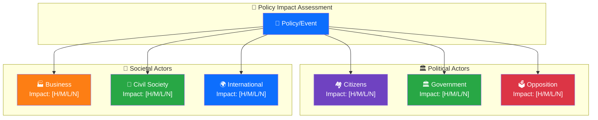

  

<h1 align="center">👥 Stakeholder Impact Assessment Template</h1>

  <strong>📊 Structured Impact Analysis Across Swedish Society</strong> 
  <em>🎯 Citizens · Government · Opposition · Business · Civil Society · International</em>

  
  
  
  

**📋 Document Owner:** CEO | **📄 Version:** 1.0 | **📅 Last Updated:** 2026-03-26 (UTC)  
**🏢 Owner:** Hack23 AB (Org.nr 5595347807) | **🏷️ Classification:** Public

> **📌 Template Instructions:** For daily analyses, copy to `analysis/daily/YYYY-MM-DD/` and name the file `evening-stakeholder-impact.md`. For weekly analyses, copy to `analysis/weekly/YYYY-WNN/` and name the file `stakeholder-impact.md`. Complete the context block first, then assess each stakeholder group. Groups with NONE impact level still require a one-line rationale. See lens files in `scripts/analysis-framework/lenses/` for automated perspective generation.

---

## 📋 Assessment Context

| Field | Value |
|-------|-------|
| **Assessment ID** | `[REQUIRED: STA-YYYY-MM-DD-NNN]` |
| **Assessment Date** | `[REQUIRED: YYYY-MM-DD HH:MM UTC]` |
| **Policy/Event Subject** | `[REQUIRED: brief name of the policy decision or event being assessed]` |
| **Primary dok_id** | `[REQUIRED: Riksdag document ID]` |
| **Stage of Process** | `[REQUIRED: e.g. "Proposition submitted", "Committee vote", "Riksdag vote", "Government decree"]` |
| **Produced By** | `[REQUIRED: workflow name]` |
| **Overall Impact Level** | `[REQUIRED: HIGH / MEDIUM / LOW — based on highest stakeholder impact]` |

---

## 👥 Stakeholder Group Assessments

### Stakeholder Impact Overview

> **AI Instructions:** After completing each stakeholder assessment, update this diagram with actual impact levels (HIGH/MEDIUM/LOW/NONE) and color-code accordingly.

### 🏘️ Group 1: Citizens (Direct Impact)

*How directly does this policy affect Swedish citizens' daily lives, rights, welfare, or finances?*

| Parameter | Value |
|-----------|-------|
| **Impact Level** | `[REQUIRED: HIGH / MEDIUM / LOW / NONE]` |
| **Impact Timeline** | `[REQUIRED: IMMEDIATE (0–30 days) / SHORT (1–6 months) / MEDIUM (6–18 months) / LONG (18+ months)]` |
| **Affected Population** | `[REQUIRED: e.g. "All 10.5M residents", "Pensioners 65+", "Urban renters", "Asylum seekers"]` |
| **Impact Type** | `[REQUIRED: FINANCIAL / LEGAL / SOCIAL / HEALTH / EDUCATIONAL / COMBINATION]` |
| **Evidence Sources** | `[REQUIRED: dok_id(s), SCB statistics ref, or budget document]` |
| **Confidence Level** | `[REQUIRED: HIGH / MEDIUM / LOW]` |

**Citizen Impact Narrative:**  
`[REQUIRED: 2–4 sentences explaining how ordinary citizens experience this change. Be specific about amounts (SEK), eligibility criteria, timelines, and regional variation if applicable. Reference the scripts/analysis-framework/lenses/citizen.ts perspective framework.]`

**Vulnerable Groups:** `[OPTIONAL: e.g. "Disproportionate impact on low-income households, asylum seekers, rural elderly"]`

---

### 🏛️ Group 2: Government Coalition

*How does this policy affect the governing coalition's political standing, internal cohesion, and electoral positioning?*

| Parameter | Value |
|-----------|-------|
| **Impact Level** | `[REQUIRED: HIGH / MEDIUM / LOW / NONE]` |
| **Impact Timeline** | `[REQUIRED: IMMEDIATE / SHORT / MEDIUM / LONG]` |
| **Primary Affected Parties** | `[REQUIRED: e.g. "M (primary), SD (secondary), KD (minor)"]` |
| **Coalition Cohesion Effect** | `[REQUIRED: STRENGTHENS / NEUTRAL / STRAINS / FRACTURES]` |
| **Evidence Sources** | `[REQUIRED: dok_id, debate ref, or interpellation]` |
| **Confidence Level** | `[REQUIRED: HIGH / MEDIUM / LOW]` |

**Government Coalition Impact Narrative:**  
`[REQUIRED: 2–3 sentences. Reference scripts/analysis-framework/lenses/government.ts.]`

---

### 🗳️ Group 3: Opposition Parties

*How does this policy affect opposition parties' strategic positioning, electoral prospects, and legislative influence?*

| Parameter | Value |
|-----------|-------|
| **Impact Level** | `[REQUIRED: HIGH / MEDIUM / LOW / NONE]` |
| **Impact Timeline** | `[REQUIRED: IMMEDIATE / SHORT / MEDIUM / LONG]` |
| **Primary Affected Parties** | `[REQUIRED: e.g. "S (gains credibility), V (opposition opportunity), MP (marginalised)"]` |
| **Electoral Positioning Effect** | `[REQUIRED: POSITIVE / NEUTRAL / NEGATIVE — from opposition perspective]` |
| **Evidence Sources** | `[REQUIRED: anföranden refs or motion dok_ids]` |
| **Confidence Level** | `[REQUIRED: HIGH / MEDIUM / LOW]` |

**Opposition Impact Narrative:**  
`[REQUIRED: 2–3 sentences. Reference scripts/analysis-framework/lenses/opposition.ts.]`

---

### 🏭 Group 4: Business Sector

*How does this policy affect Swedish businesses, industries, labour market, and economic competitiveness?*

| Parameter | Value |
|-----------|-------|
| **Impact Level** | `[REQUIRED: HIGH / MEDIUM / LOW / NONE]` |
| **Impact Timeline** | `[REQUIRED: IMMEDIATE / SHORT / MEDIUM / LONG]` |
| **Most Affected Sectors** | `[REQUIRED: e.g. "Construction, real estate, manufacturing", "Financial services"]` |
| **Economic Impact Type** | `[REQUIRED: COMPLIANCE COST / MARKET OPPORTUNITY / REGULATORY BURDEN / TAX CHANGE / OTHER]` |
| **Estimated Financial Impact** | `[OPTIONAL: e.g. "±X BSEK annually per Finansdepartementet estimate"]` |
| **Evidence Sources** | `[REQUIRED: proposition dok_id, Riksbank ref, or SOU]` |
| **Confidence Level** | `[REQUIRED: HIGH / MEDIUM / LOW]` |

**Business Sector Impact Narrative:**  
`[REQUIRED: 2–3 sentences. Reference scripts/analysis-framework/lenses/economic.ts.]`

---

### 🤝 Group 5: Civil Society

*How does this policy affect NGOs, trade unions, religious organisations, advocacy groups, and civic institutions?*

| Parameter | Value |
|-----------|-------|
| **Impact Level** | `[REQUIRED: HIGH / MEDIUM / LOW / NONE]` |
| **Impact Timeline** | `[REQUIRED: IMMEDIATE / SHORT / MEDIUM / LONG]` |
| **Most Affected Organisations** | `[REQUIRED: e.g. "LO, TCO (labour)", "Rädda Barnen (welfare)", "Greenpeace (environment)"]` |
| **Civil Society Response** | `[REQUIRED: SUPPORTIVE / NEUTRAL / OPPOSED / DIVIDED]` |
| **Evidence Sources** | `[REQUIRED: remissvar refs, consultation documents, or media statements]` |
| **Confidence Level** | `[REQUIRED: HIGH / MEDIUM / LOW]` |

**Civil Society Impact Narrative:**  
`[REQUIRED: 2–3 sentences.]`

---

### 🌍 Group 6: International / EU

*How does this policy affect Sweden's international relationships, EU obligations, treaty compliance, or bilateral agreements?*

| Parameter | Value |
|-----------|-------|
| **Impact Level** | `[REQUIRED: HIGH / MEDIUM / LOW / NONE]` |
| **Impact Timeline** | `[REQUIRED: IMMEDIATE / SHORT / MEDIUM / LONG]` |
| **Affected Relationships** | `[REQUIRED: e.g. "EU Commission (sanctions risk)", "NATO allies", "Nordic Council"]` |
| **Treaty/Directive Compliance** | `[REQUIRED: COMPLIANT / AT RISK / NON-COMPLIANT / UNCERTAIN]` |
| **Evidence Sources** | `[REQUIRED: EU directive refs, international agreement dok_ids]` |
| **Confidence Level** | `[REQUIRED: HIGH / MEDIUM / LOW]` |

**International Impact Narrative:**  
`[REQUIRED: 2–3 sentences. Reference scripts/analysis-framework/lenses/international.ts.]`

---

## 📊 Impact Summary Matrix

> *Numeric encoding for internal analysis: NONE = 0, LOW = 1, MEDIUM = 2, HIGH = 3 (map to the Impact Level column).*

| Stakeholder Group | Impact Level | Timeline | Confidence | Net Political Effect |
|-------------------|:------------:|:--------:|:----------:|---------------------|
| 🏘️ Citizens | `[H/M/L/N]` | `[I/S/M/L]` | `[H/M/L]` | `[REQUIRED: positive/negative/neutral]` |
| 🏛️ Gov Coalition | `[H/M/L/N]` | `[I/S/M/L]` | `[H/M/L]` | `[REQUIRED]` |
| 🗳️ Opposition | `[H/M/L/N]` | `[I/S/M/L]` | `[H/M/L]` | `[REQUIRED]` |
| 🏭 Business | `[H/M/L/N]` | `[I/S/M/L]` | `[H/M/L]` | `[REQUIRED]` |
| 🤝 Civil Society | `[H/M/L/N]` | `[I/S/M/L]` | `[H/M/L]` | `[REQUIRED]` |
| 🌍 International | `[H/M/L/N]` | `[I/S/M/L]` | `[H/M/L]` | `[REQUIRED]` |

---

## 🔑 Key Insights

`[REQUIRED: 3–5 sentences identifying the most significant stakeholder dynamics. Which groups are in tension? Where are unexpected winners/losers? What are the second-order political effects? Reference specific stakeholder interactions.]`

### Conflicting Impact Resolution

When stakeholder impacts conflict (e.g., Citizens benefit but Business bears costs):

| Pattern | Overall Assessment | Editorial Framing |
|---------|-------------------|-------------------|
| Citizens positive + Business negative | **Politically significant** — redistribution dynamic | Lead with citizen impact; note business costs |
| Government positive + Opposition negative | **Standard partisan** — expected dynamics | Present both perspectives equally |
| Citizens negative + Government positive | **Accountability concern** — policy vs. people | Lead with citizen impact; scrutinize government rationale |
| All stakeholders negative | **System-level problem** — policy failure signal | Frame as shared challenge requiring cross-party response |
| All stakeholders positive | **Rare consensus** — highlight cross-party achievement | Note rarity; check for hidden costs or losers |

**Publish Recommendation:** `[REQUIRED: YES — HIGH public interest / YES — MEDIUM interest / MONITOR — low standalone value]`

---

**Document Control:**  
- **Template Path:** `/analysis/templates/stakeholder-impact.md`  
- **Lens References:** `scripts/analysis-framework/lenses/` (citizen, economic, government, international, media, opposition)  
- **Framework Reference:** [methodologies/political-style-guide.md](../methodologies/political-style-guide.md)  
- **Classification:** Public  
- **Next Review:** 2026-06-28
