  

<h1 align="center">💼 Political SWOT Analysis Template</h1>

  <strong>📊 Evidence-Based Strategic Analysis for Swedish Political Landscape</strong> 
  <em>🎯 Government Coalition · Opposition · Policy Domain SWOTs</em>

  
  
  
  

**📋 Document Owner:** CEO | **📄 Version:** 1.0 | **📅 Last Updated:** 2026-03-26 (UTC)  
**🏢 Owner:** Hack23 AB (Org.nr 5595347807) | **🏷️ Classification:** Public

> **📌 Template Instructions:** Copy to `analysis/daily/YYYY-MM-DD/` or `analysis/weekly/YYYY-WNN/`. For daily use, save as `evening-swot-update.md`. For weekly use, save as `week-summary-swot.md`. Each SWOT entry requires a dok_id or named evidence source — opinion-only entries are prohibited. See [methodologies/political-swot-framework.md](../methodologies/political-swot-framework.md).

> **🚨 Anti-Pattern Warning (PR #1452):** Plain prose SWOT analysis with bullet points but NO evidence tables, NO Mermaid diagrams, NO SWOT Context metadata, and NO template structure is REJECTED. Every SWOT analysis MUST include:
> 1. **SWOT Context table** (metadata header with SWOT ID, date, scope, MCP sources)
> 2. **Structured evidence tables** with columns: `#`, `Statement`, `Evidence (dok_id)`, `Confidence`, `Impact`, `Entry Date`
> 3. **Color-coded Mermaid SWOT Quadrant Mapping** with `style` directives (green for strengths, orange for weaknesses, blue for opportunities, red for threats)
> 4. **Strategic Implications** section with Key Watch Items
> 5. **Document Control** footer
>
> **Good example:** [SWOT.md](../../SWOT.md) — this is the formatting quality standard.

---

## 📋 SWOT Context

| Field | Value |
|-------|-------|
| **SWOT ID** | `[REQUIRED: SWT-YYYY-MM-DD-NNN]` |
| **Analysis Date** | `[REQUIRED: YYYY-MM-DD HH:MM UTC]` |
| **Analysis Scope** | `[REQUIRED: e.g. "Government coalition", "SD", "Climate policy domain"]` |
| **Reference Period** | `[REQUIRED: e.g. "2026-Q1" or "2026-W13"]` |
| **Produced By** | `[REQUIRED: workflow name or analyst]` |
| **Primary MCP Sources** | `[REQUIRED: list of riksdag-regering-mcp tools used]` |
| **Validity Window** | `[REQUIRED: entries valid until YYYY-MM-DD — see temporal decay guide]` |

---

## 🏛️ Section 1: Government Coalition SWOT

> *Analyse the governing coalition as a unit. Individual party SWOTs in Section 2.*

### ✅ Strengths — Government Coalition

Each entry requires: Statement + Evidence (dok_id) + Confidence + Impact + Entry Date (for temporal decay tracking).

| # | Strength Statement | Evidence (dok_id) | Confidence | Impact | Entry Date |
|---|-------------------|-------------------|:----------:|:------:|:----------:|
| S1 | `[REQUIRED: specific, verifiable strength — e.g. "Coalition maintains working Riksdag majority of 176 seats through SD support agreement"]` | `[REQUIRED: dok_id or vote record]` | `H/M/L` | `H/M/L` | `YYYY-MM-DD` |
| S2 | `[REQUIRED]` | `[dok_id]` | `H/M/L` | `H/M/L` | `YYYY-MM-DD` |
| S3 | `[OPTIONAL]` | `[dok_id]` | `H/M/L` | `H/M/L` | `YYYY-MM-DD` |
| S4 | `[OPTIONAL]` | `[dok_id]` | `H/M/L` | `H/M/L` | `YYYY-MM-DD` |

**Coalition Strength Summary:** `[REQUIRED: 1–2 sentences]`

---

### ⚠️ Weaknesses — Government Coalition

| # | Weakness Statement | Evidence (dok_id) | Confidence | Impact | Entry Date |
|---|-------------------|-------------------|:----------:|:------:|:----------:|
| W1 | `[REQUIRED: e.g. "Internal disagreement on migration targets between M and L weakens policy coherence"]` | `[REQUIRED: dok_id or debate reference]` | `H/M/L` | `H/M/L` | `YYYY-MM-DD` |
| W2 | `[REQUIRED]` | `[dok_id]` | `H/M/L` | `H/M/L` | `YYYY-MM-DD` |
| W3 | `[OPTIONAL]` | `[dok_id]` | `H/M/L` | `H/M/L` | `YYYY-MM-DD` |

**Coalition Weakness Summary:** `[REQUIRED: 1–2 sentences]`

---

### 🚀 Opportunities — Government Coalition

| # | Opportunity Statement | Evidence (dok_id) | Confidence | Impact | Entry Date |
|---|----------------------|-------------------|:----------:|:------:|:----------:|
| O1 | `[REQUIRED: e.g. "Improving macroeconomic indicators provide window for tax reform legislation"]` | `[REQUIRED: SCB data or budget dok_id]` | `H/M/L` | `H/M/L` | `YYYY-MM-DD` |
| O2 | `[REQUIRED]` | `[dok_id]` | `H/M/L` | `H/M/L` | `YYYY-MM-DD` |
| O3 | `[OPTIONAL]` | `[dok_id]` | `H/M/L` | `H/M/L` | `YYYY-MM-DD` |

**Coalition Opportunity Summary:** `[REQUIRED: 1–2 sentences]`

---

### 🔴 Threats — Government Coalition

| # | Threat Statement | Evidence (dok_id) | Confidence | Impact | Entry Date |
|---|-----------------|-------------------|:----------:|:------:|:----------:|
| T1 | `[REQUIRED: e.g. "No-confidence motion risk if SD withdraws budget support over crime legislation stall"]` | `[REQUIRED: interpellation or debate ref]` | `H/M/L` | `H/M/L` | `YYYY-MM-DD` |
| T2 | `[REQUIRED]` | `[dok_id]` | `H/M/L` | `H/M/L` | `YYYY-MM-DD` |
| T3 | `[OPTIONAL]` | `[dok_id]` | `H/M/L` | `H/M/L` | `YYYY-MM-DD` |

**Coalition Threat Summary:** `[REQUIRED: 1–2 sentences]`

---

## 🏛️ Section 2: Main Opposition SWOT

> *Focus on the largest opposition bloc or party. Specify which.*

**Opposition Subject:** `[REQUIRED: e.g. "Social Democrats (S) + V + MP bloc"]`

### ✅ Strengths — Opposition

| # | Strength Statement | Evidence (dok_id) | Confidence | Impact | Entry Date |
|---|-------------------|-------------------|:----------:|:------:|:----------:|
| S1 | `[REQUIRED]` | `[dok_id]` | `H/M/L` | `H/M/L` | `YYYY-MM-DD` |
| S2 | `[OPTIONAL]` | `[dok_id]` | `H/M/L` | `H/M/L` | `YYYY-MM-DD` |

### ⚠️ Weaknesses — Opposition

| # | Weakness Statement | Evidence (dok_id) | Confidence | Impact | Entry Date |
|---|-------------------|-------------------|:----------:|:------:|:----------:|
| W1 | `[REQUIRED]` | `[dok_id]` | `H/M/L` | `H/M/L` | `YYYY-MM-DD` |
| W2 | `[OPTIONAL]` | `[dok_id]` | `H/M/L` | `H/M/L` | `YYYY-MM-DD` |

### 🚀 Opportunities — Opposition

| # | Opportunity Statement | Evidence (dok_id) | Confidence | Impact | Entry Date |
|---|----------------------|-------------------|:----------:|:------:|:----------:|
| O1 | `[REQUIRED]` | `[dok_id]` | `H/M/L` | `H/M/L` | `YYYY-MM-DD` |

### 🔴 Threats — Opposition

| # | Threat Statement | Evidence (dok_id) | Confidence | Impact | Entry Date |
|---|-----------------|-------------------|:----------:|:------:|:----------:|
| T1 | `[REQUIRED]` | `[dok_id]` | `H/M/L` | `H/M/L` | `YYYY-MM-DD` |

---

## 🏛️ Section 3: Policy Domain SWOT

**Policy Domain:** `[REQUIRED: select from classification taxonomy — e.g. "Climate & Environment (ENV)"]`

### ✅ Strengths in Domain

| # | Strength Statement | Evidence (dok_id) | Confidence | Impact | Entry Date |
|---|-------------------|-------------------|:----------:|:------:|:----------:|
| S1 | `[REQUIRED: e.g. "Sweden meets 2025 renewable energy target; supporting legislation fully enacted (prop 2024/25:XX)"]` | `[dok_id]` | `H/M/L` | `H/M/L` | `YYYY-MM-DD` |
| S2 | `[OPTIONAL]` | `[dok_id]` | `H/M/L` | `H/M/L` | `YYYY-MM-DD` |

### ⚠️ Weaknesses in Domain

| # | Weakness Statement | Evidence (dok_id) | Confidence | Impact | Entry Date |
|---|-------------------|-------------------|:----------:|:------:|:----------:|
| W1 | `[REQUIRED]` | `[dok_id]` | `H/M/L` | `H/M/L` | `YYYY-MM-DD` |

### 🚀 Opportunities in Domain

| # | Opportunity Statement | Evidence (dok_id) | Confidence | Impact | Entry Date |
|---|----------------------|-------------------|:----------:|:------:|:----------:|
| O1 | `[REQUIRED]` | `[dok_id]` | `H/M/L` | `H/M/L` | `YYYY-MM-DD` |

### 🔴 Threats to Domain

| # | Threat Statement | Evidence (dok_id) | Confidence | Impact | Entry Date |
|---|-----------------|-------------------|:----------:|:------:|:----------:|
| T1 | `[REQUIRED]` | `[dok_id]` | `H/M/L` | `H/M/L` | `YYYY-MM-DD` |

---

## 📊 SWOT Quadrant Mapping

### Visual SWOT Impact Diagram

> **AI Instructions:** Replace placeholder text below with actual SWOT findings from the tables above. Each node label should reference the corresponding S/W/O/T entry number.

```mermaid
graph TD
    subgraph "📊 Political SWOT Landscape"
        direction TB
        subgraph "✅ Strengths (Internal Positive)"
            S1N["💪 S1: [Coalition majority]"]
            S2N["💪 S2: [Policy delivery]"]
        end
        subgraph "⚠️ Weaknesses (Internal Negative)"
            W1N["⚡ W1: [Internal disagreements]"]
            W2N["⚡ W2: [Policy coherence gap]"]
        end
        subgraph "🚀 Opportunities (External Positive)"
            O1N["🌟 O1: [Economic tailwinds]"]
            O2N["🌟 O2: [EU alignment]"]
        end
        subgraph "🔴 Threats (External Negative)"
            T1N["☁️ T1: [No-confidence risk]"]
            T2N["☁️ T2: [Electoral pressure]"]
        end
    end

    S1N -.->|"exploits"| O1N
    W1N -.->|"amplifies"| T1N
    O2N -.->|"mitigates"| W2N
    T2N -.->|"targets"| W1N

    style S1N fill:#28a745,color:#fff
    style S2N fill:#28a745,color:#fff
    style W1N fill:#fd7e14,color:#fff
    style W2N fill:#fd7e14,color:#fff
    style O1N fill:#0d6efd,color:#fff
    style O2N fill:#0d6efd,color:#fff
    style T1N fill:#dc3545,color:#fff
    style T2N fill:#dc3545,color:#fff
```

### SWOT Interaction Matrix

|                              | Internal (Actor / Organisation)         | External (Environment / System)       |
|------------------------------|-----------------------------------------|---------------------------------------|
| **Positive impact**          | **Strengths** — internal advantages     | **Opportunities** — external enablers |
| **Negative impact**          | **Weaknesses** — internal limitations   | **Threats** — external risks          |

> For each item (S/W/O/T), briefly note **why** it is internal/external and negative/positive, and reference supporting evidence (for example `dok_id`) in the tables above.

---

## 🔑 Strategic Implications

`[REQUIRED: 3–5 sentences summarising the most critical SWOT interactions — e.g. how a coalition weakness intersects with an opposition opportunity to create a specific political risk over the next 30–60 days. Be specific and evidence-based.]`

**Key Watch Items:**
1. `[REQUIRED: specific event or indicator to monitor]`
2. `[REQUIRED]`
3. `[OPTIONAL]`

---

**Document Control:**  
- **Template Path:** `/analysis/templates/swot-analysis.md`  
- **Framework Reference:** [SWOT.md](../../SWOT.md), [methodologies/political-swot-framework.md](../methodologies/political-swot-framework.md)  
- **Classification:** Public  
- **Next Review:** 2026-06-26
