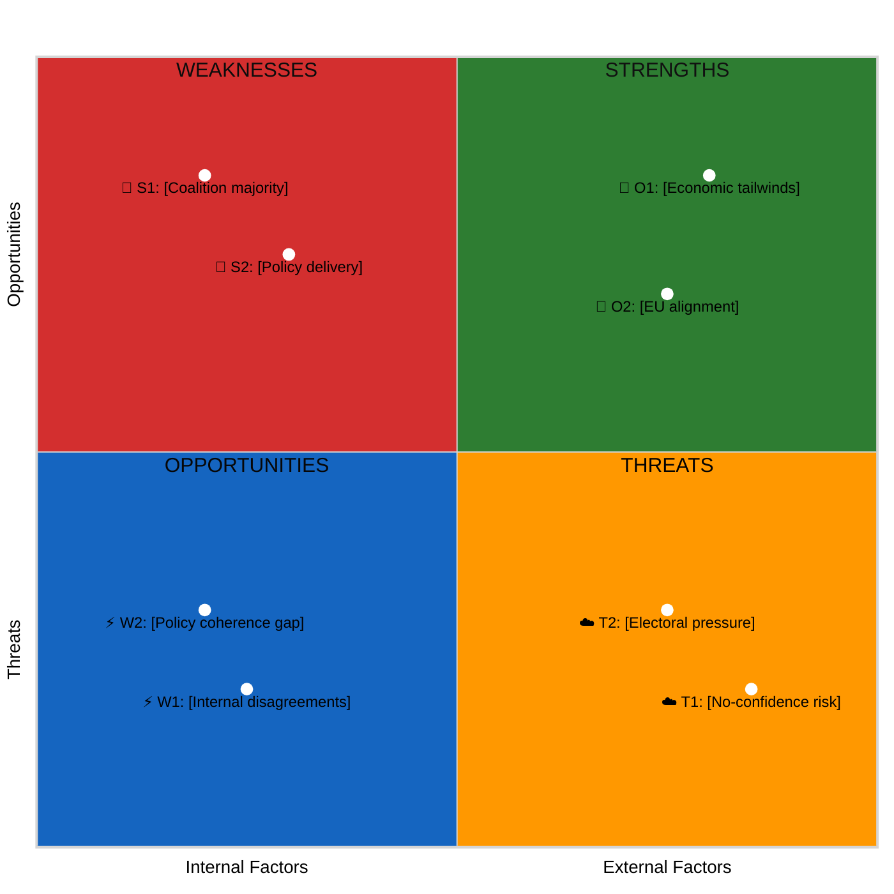

<p align="center">
  
</p>

<h1 align="center">💼 Political SWOT Analysis Template</h1>

<p align="center">
  <strong>📊 Evidence-Based Strategic Analysis with TOWS Matrix & Scenario Generation</strong><br>
  <em>🎯 Government Coalition · Opposition · Cross-SWOT Interference · Strategic Options</em>
</p>

<p align="center">
  <a href="#"></a>
  <a href="#"></a>
  <a href="#"></a>
  <a href="#"></a>
</p>

**📋 Document Owner:** CEO | **📄 Version:** 2.5 | **📅 Last Updated:** 2026-04-25 (UTC)  
**🏢 Owner:** Hack23 AB (Org.nr 5595347807) | **🏷️ Classification:** Public

> **📌 Template Instructions:** Copy to `analysis/daily/YYYY-MM-DD/{articleType}/`. Save as `swot-analysis.md` in the workflow's own folder (never overwrite another workflow's files). Each SWOT entry requires a dok_id or named evidence source — opinion-only entries are prohibited. See [methodologies/political-swot-framework.md](../methodologies/political-swot-framework.md).

> **🚨 Anti-Pattern Warning:** Plain prose SWOT analysis with bullet points but NO evidence tables, NO Mermaid diagrams, NO TOWS matrix, and NO cross-SWOT interference analysis is REJECTED. Every SWOT analysis MUST include:
> 1. **SWOT Context table** (metadata header with SWOT ID, date, scope, MCP sources)
> 2. **Structured evidence tables** with columns: `#`, `Statement`, `Evidence (dok_id)`, `Confidence`, `Impact`, `Entry Date`
> 3. **Color-coded Mermaid SWOT Quadrant Mapping** with `style` directives
> 4. **TOWS Strategic Options** — at least 2 strategic options derived from SWOT combinations
> 5. **Cross-SWOT Interference** — how elements from different actors amplify each other
> 6. **Strategic Implications** section with Key Watch Items and forward indicators
> 7. **Document Control** footer
>
> **Good example:** [SWOT.md](../../SWOT.md) — this is the formatting quality standard.

---

## 🔄 Tradecraft Context

| Element | Value |
|---------|-------|
| **F3EAD Stage** | **EXPLOIT / ANALYZE** — converts classified events into the strategic picture (what each actor can leverage, defend, exploit, mitigate); feeds executive-brief, scenario-analysis, and Family D coalition-mathematics. |
| **PIRs Served** | PIR-1 (coalition stability), PIR-2 (opposition cohesion), PIR-4 (Election 2026 pathway); add PIR-3 (party-position drift) when SWOT entries record a shift relative to the 30-day baseline. |
| **Admiralty Floor** | **B2** floor on every quadrant entry; **A1** required when an entry quotes a verbatim primary source (motion text, vote tally, ministerial statement); F6 entries are rejected. |
| **WEP + ODNI** | Each entry carries a 5-level confidence label (🟦 VERY HIGH → ⬛ VERY LOW); narrative interpretation uses **WEP** phrasing for forward implications; TOWS strategic options pair likelihood × actor-capability assessments using WEP terms. |
| **Source Diversity Floor** | ≥2 primary sources per HIGH-confidence quadrant entry; ≥1 primary for MEDIUM; LOW entries may be single-source but must carry `[needs-corroboration]`. Cross-SWOT interference rows must cite both contributing entries. |
| **SAT(s) Applied** | SWOT (canonical); TOWS Matrix (SO/ST/WO/WT options); Cross-Impact Analysis (interference between actor SWOTs); Key Assumptions Check (on every TOWS option); ACH (when ≥2 strategic interpretations compete). |
| **ICD 203 Standards** | 1 (objectivity — every actor SWOT receives equal analytical depth), 5 (sourcing), 6 (logical argumentation — TOWS derivation shown), 7 (uncertainty — confidence labels), 9 (alternative analysis — cross-SWOT and TOWS surface counter-narratives). |

> See [`osint-tradecraft-standards.md`](../methodologies/osint-tradecraft-standards.md) for canonical Admiralty / WEP / SAT / ICD 203 definitions, and [`political-swot-framework.md`](../methodologies/political-swot-framework.md) for evidence-based SWOT, TOWS, cross-SWOT interference, and the 180-day temporal-decay rule.

---

## 📋 SWOT Context

| Field | Value |
|-------|-------|
| **SWOT ID** | `[REQUIRED: SWT-YYYY-MM-DD-NNN]` |
| **Analysis Date** | `[REQUIRED: YYYY-MM-DD HH:MM UTC]` |
| **Analysis Scope** | `[REQUIRED: e.g. "Government coalition", "SD", "Climate policy domain"]` |
| **Reference Period** | `[REQUIRED: e.g. "2026-Q1" or "2026-W13"]` |
| **Produced By** | `[REQUIRED: workflow name or analyst]` |
| **Primary MCP Sources** | `[REQUIRED: list of riksdag-regering-mcp tools used]` |
| **Validity Window** | `[REQUIRED: entries valid until YYYY-MM-DD — see temporal decay guide]` |
| **Temporal Window** | `[REQUIRED: e.g. "2026-03-25 to 2026-04-01" — exact date range of documents covered by this SWOT; distinct from Validity Window which tracks entry expiry]` |

---

## 🏛️ Section 1: Government Coalition SWOT

> *Analyse the governing coalition as a unit. Individual party SWOTs in Section 2.*

### ✅ Strengths — Government Coalition

Each entry requires: Statement + Evidence (dok_id) + Confidence + Impact + Entry Date (for temporal decay tracking).

| # | Strength Statement | Evidence (dok_id) | Confidence | Impact | Entry Date |
|---|-------------------|-------------------|:----------:|:------:|:----------:|
| S1 | `[REQUIRED: specific, verifiable strength — e.g. "Coalition maintains working Riksdag majority of 176 seats through SD support agreement"]` | `[REQUIRED: dok_id or vote record]` | `VH/H/M/L/VL` | `VH/H/M/L/VL` | `YYYY-MM-DD` |
| S2 | `[REQUIRED]` | `[dok_id]` | `VH/H/M/L/VL` | `VH/H/M/L/VL` | `YYYY-MM-DD` |
| S3 | `[OPTIONAL]` | `[dok_id]` | `VH/H/M/L/VL` | `VH/H/M/L/VL` | `YYYY-MM-DD` |
| S4 | `[OPTIONAL]` | `[dok_id]` | `VH/H/M/L/VL` | `VH/H/M/L/VL` | `YYYY-MM-DD` |

**Coalition Strength Summary:** `[REQUIRED: 1–2 sentences]`

---

### ⚠️ Weaknesses — Government Coalition

| # | Weakness Statement | Evidence (dok_id) | Confidence | Impact | Entry Date |
|---|-------------------|-------------------|:----------:|:------:|:----------:|
| W1 | `[REQUIRED: e.g. "Internal disagreement on migration targets between M and L weakens policy coherence"]` | `[REQUIRED: dok_id or debate reference]` | `VH/H/M/L/VL` | `VH/H/M/L/VL` | `YYYY-MM-DD` |
| W2 | `[REQUIRED]` | `[dok_id]` | `VH/H/M/L/VL` | `VH/H/M/L/VL` | `YYYY-MM-DD` |
| W3 | `[OPTIONAL]` | `[dok_id]` | `VH/H/M/L/VL` | `VH/H/M/L/VL` | `YYYY-MM-DD` |

**Coalition Weakness Summary:** `[REQUIRED: 1–2 sentences]`

---

### 🚀 Opportunities — Government Coalition

| # | Opportunity Statement | Evidence (dok_id) | Confidence | Impact | Entry Date |
|---|----------------------|-------------------|:----------:|:------:|:----------:|
| O1 | `[REQUIRED: e.g. "Improving macroeconomic indicators provide window for tax reform legislation"]` | `[REQUIRED: SCB data or budget dok_id]` | `VH/H/M/L/VL` | `VH/H/M/L/VL` | `YYYY-MM-DD` |
| O2 | `[REQUIRED]` | `[dok_id]` | `VH/H/M/L/VL` | `VH/H/M/L/VL` | `YYYY-MM-DD` |
| O3 | `[OPTIONAL]` | `[dok_id]` | `VH/H/M/L/VL` | `VH/H/M/L/VL` | `YYYY-MM-DD` |

**Coalition Opportunity Summary:** `[REQUIRED: 1–2 sentences]`

---

### 🔴 Threats — Government Coalition

| # | Threat Statement | Evidence (dok_id) | Confidence | Impact | Entry Date |
|---|-----------------|-------------------|:----------:|:------:|:----------:|
| T1 | `[REQUIRED: e.g. "No-confidence motion risk if SD withdraws budget support over crime legislation stall"]` | `[REQUIRED: interpellation or debate ref]` | `VH/H/M/L/VL` | `VH/H/M/L/VL` | `YYYY-MM-DD` |
| T2 | `[REQUIRED]` | `[dok_id]` | `VH/H/M/L/VL` | `VH/H/M/L/VL` | `YYYY-MM-DD` |
| T3 | `[OPTIONAL]` | `[dok_id]` | `VH/H/M/L/VL` | `VH/H/M/L/VL` | `YYYY-MM-DD` |

**Coalition Threat Summary:** `[REQUIRED: 1–2 sentences]`

---

## 🏛️ Section 2: Main Opposition SWOT

> *Focus on the largest opposition bloc or party. Specify which.*

**Opposition Subject:** `[REQUIRED: e.g. "Social Democrats (S) + V + MP bloc"]`

### ✅ Strengths — Opposition

| # | Strength Statement | Evidence (dok_id) | Confidence | Impact | Entry Date |
|---|-------------------|-------------------|:----------:|:------:|:----------:|
| S1 | `[REQUIRED]` | `[dok_id]` | `VH/H/M/L/VL` | `VH/H/M/L/VL` | `YYYY-MM-DD` |
| S2 | `[OPTIONAL]` | `[dok_id]` | `VH/H/M/L/VL` | `VH/H/M/L/VL` | `YYYY-MM-DD` |

### ⚠️ Weaknesses — Opposition

| # | Weakness Statement | Evidence (dok_id) | Confidence | Impact | Entry Date |
|---|-------------------|-------------------|:----------:|:------:|:----------:|
| W1 | `[REQUIRED]` | `[dok_id]` | `VH/H/M/L/VL` | `VH/H/M/L/VL` | `YYYY-MM-DD` |
| W2 | `[OPTIONAL]` | `[dok_id]` | `VH/H/M/L/VL` | `VH/H/M/L/VL` | `YYYY-MM-DD` |

### 🚀 Opportunities — Opposition

| # | Opportunity Statement | Evidence (dok_id) | Confidence | Impact | Entry Date |
|---|----------------------|-------------------|:----------:|:------:|:----------:|
| O1 | `[REQUIRED]` | `[dok_id]` | `VH/H/M/L/VL` | `VH/H/M/L/VL` | `YYYY-MM-DD` |

### 🔴 Threats — Opposition

| # | Threat Statement | Evidence (dok_id) | Confidence | Impact | Entry Date |
|---|-----------------|-------------------|:----------:|:------:|:----------:|
| T1 | `[REQUIRED]` | `[dok_id]` | `VH/H/M/L/VL` | `VH/H/M/L/VL` | `YYYY-MM-DD` |

---

## 🏛️ Section 3: Policy Domain SWOT

**Policy Domain:** `[REQUIRED: select from classification taxonomy — e.g. "Climate & Environment (ENV)"]`

### ✅ Strengths in Domain

| # | Strength Statement | Evidence (dok_id) | Confidence | Impact | Entry Date |
|---|-------------------|-------------------|:----------:|:------:|:----------:|
| S1 | `[REQUIRED: e.g. "Sweden meets 2025 renewable energy target; supporting legislation fully enacted (prop 2024/25:XX)"]` | `[dok_id]` | `VH/H/M/L/VL` | `VH/H/M/L/VL` | `YYYY-MM-DD` |
| S2 | `[OPTIONAL]` | `[dok_id]` | `VH/H/M/L/VL` | `VH/H/M/L/VL` | `YYYY-MM-DD` |

### ⚠️ Weaknesses in Domain

| # | Weakness Statement | Evidence (dok_id) | Confidence | Impact | Entry Date |
|---|-------------------|-------------------|:----------:|:------:|:----------:|
| W1 | `[REQUIRED]` | `[dok_id]` | `VH/H/M/L/VL` | `VH/H/M/L/VL` | `YYYY-MM-DD` |

### 🚀 Opportunities in Domain

| # | Opportunity Statement | Evidence (dok_id) | Confidence | Impact | Entry Date |
|---|----------------------|-------------------|:----------:|:------:|:----------:|
| O1 | `[REQUIRED]` | `[dok_id]` | `VH/H/M/L/VL` | `VH/H/M/L/VL` | `YYYY-MM-DD` |

### 🔴 Threats to Domain

| # | Threat Statement | Evidence (dok_id) | Confidence | Impact | Entry Date |
|---|-----------------|-------------------|:----------:|:------:|:----------:|
| T1 | `[REQUIRED]` | `[dok_id]` | `VH/H/M/L/VL` | `VH/H/M/L/VL` | `YYYY-MM-DD` |

---

## 📊 SWOT Quadrant Mapping

### Visual SWOT Impact Diagram

> **AI Instructions:** Replace placeholder text below with actual SWOT findings from the tables above. Each node label should reference the corresponding S/W/O/T entry number.



> **Note:** The four quadrant fill colours follow the [ISMS Style Guide SWOT palette](https://github.com/Hack23/ISMS-PUBLIC/blob/main/STYLE_GUIDE.md#stakeholder-mapping-quadrant-format) — Strengths `#2E7D32` (green), Weaknesses `#D32F2F` (red), Opportunities `#1565C0` (blue), Threats `#FF9800` (orange). Place each S/W/O/T entry as `[x, y]` where `x` ≈ 0.15–0.35 for internal factors and 0.65–0.90 for external factors; `y` ≈ 0.65–0.90 for opportunities/strengths (positive) and 0.10–0.35 for weaknesses/threats (negative). Cross-SWOT interactions are captured in the **Section 5: Cross-SWOT Interference Analysis** table below.

### SWOT Interaction Matrix

|                              | Internal (Actor / Organisation)         | External (Environment / System)       |
|------------------------------|-----------------------------------------|---------------------------------------|
| **Positive impact**          | **Strengths** — internal advantages     | **Opportunities** — external enablers |
| **Negative impact**          | **Weaknesses** — internal limitations   | **Threats** — external risks          |

> For each item (S/W/O/T), briefly note **why** it is internal/external and negative/positive, and reference supporting evidence (for example `dok_id`) in the tables above.

---

## 🔑 Strategic Implications

`[REQUIRED: 3–5 sentences summarising the most critical SWOT interactions — e.g. how a coalition weakness intersects with an opposition opportunity to create a specific political risk over the next 30–60 days. Be specific and evidence-based.]`

**Key Watch Items:**
1. `[REQUIRED: specific event or indicator to monitor]`
2. `[REQUIRED]`
3. `[OPTIONAL]`

---

## 🔄 Section 5: Cross-SWOT Interference Analysis

> *How do SWOT elements from different actors (government, opposition, SD) amplify or counteract each other?*

| Gov/Opp SWOT Element | Interfering Element | Effect | Net Political Impact |
|:--------------------:|:------------------:|:------:|---------------------|
| `[e.g. Gov W1: Coalition tension]` | `[e.g. Opp S1: United front]` | Amplifies vulnerability | `[REQUIRED: Specific implication]` |
| `[e.g. Gov S1: Legislative majority]` | `[e.g. SD W1: Policy delivery failure]` | Fragile dependency | `[REQUIRED: Specific implication]` |
| `[REQUIRED: At least 2 interference pairs]` | `[...]` | `[...]` | `[...]` |

---

## 📊 Section 6: TOWS Strategic Options

> *Convert SWOT findings into strategic options — answering "So what?"*

| TOWS Cell | Strategy | Specific Action | Evidence |
|:---------:|---------|-----------------|---------|
| **SO** (Strength × Opportunity) | `[REQUIRED: How to use a strength to exploit an opportunity]` | `[Specific action with timeline]` | `[dok_id]` |
| **WO** (Weakness × Opportunity) | `[REQUIRED: How to use an opportunity to address a weakness]` | `[Specific action]` | `[dok_id]` |
| **ST** (Strength × Threat) | `[OPTIONAL: How to use a strength to counter a threat]` | `[Specific action]` | `[dok_id]` |
| **WT** (Weakness × Threat) | `[OPTIONAL: How to minimise vulnerability]` | `[Specific action]` | `[dok_id]` |

---

## 🔮 Section 7: Forward Indicators & Scenario Outlook

**30-Day Scenario Outlook:**

| Scenario | Probability | Key Trigger | SWOT Elements Driving It |
|----------|:----------:|------------|-------------------------|
| `[REQUIRED: Most likely scenario]` | `[%]` | `[Specific trigger event]` | `[S1+O2, T1+W1, etc.]` |
| `[REQUIRED: Alternative scenario]` | `[%]` | `[Specific trigger event]` | `[SWOT elements]` |
| `[OPTIONAL: Worst case]` | `[%]` | `[Trigger]` | `[SWOT elements]` |

---

## 📂 MCP Data Files Used

> *Record all MCP tool calls and data files consulted during this SWOT analysis for reproducibility and audit traceability.*

`[REQUIRED: List all analysis/daily/YYYY-MM-DD/{articleType}/data/ files consulted]`

| # | Data Source | File / Tool Path | Data Type | Retrieved |
|:-:|-----------|-----------------|-----------|-----------|
| 1 | `[e.g. riksdag-regering-mcp]` | `[e.g. search_voteringar(rm="2025/26")]` | `[e.g. Voting records]` | `[YYYY-MM-DD HH:MM UTC]` |
| 2 | `[e.g. riksdag-regering-mcp]` | `[e.g. search_dokument(doktyp="mot", rm="2025/26")]` | `[e.g. Motions]` | `[YYYY-MM-DD HH:MM UTC]` |
| 3 | `[e.g. CIA export]` | `[e.g. cia-data/exports/party-analysis.json]` | `[e.g. Party metrics]` | `[YYYY-MM-DD HH:MM UTC]` |
| 4 | `[OPTIONAL]` | `[path or tool call]` | `[type]` | `[timestamp]` |

### SWOT Quadrant Data Provenance

> **AI Instructions:** Map which MCP data sources provided evidence for each SWOT quadrant. This ensures every SWOT entry has traceable data backing, in line with the evidence hierarchy requirements from [political-swot-framework.md](../methodologies/political-swot-framework.md).

| SWOT Quadrant | Primary MCP Tools | Evidence Items | Confidence |
|:-------------:|------------------|:--------------:|:----------:|
| **Strengths** | `[e.g. search_voteringar, get_betankanden]` | `[#]` | `[VH/H/M/L/VL]` |
| **Weaknesses** | `[e.g. search_anforanden, search_dokument]` | `[#]` | `[VH/H/M/L/VL]` |
| **Opportunities** | `[e.g. search_regering, get_calendar_events]` | `[#]` | `[VH/H/M/L/VL]` |
| **Threats** | `[e.g. search_voteringar, search_dokument_fulltext]` | `[#]` | `[VH/H/M/L/VL]` |

> **📌 Note:** Confidence follows the temporal decay rule from [political-swot-framework.md](../methodologies/political-swot-framework.md): HIGH (0–30d, remains HIGH at 30d)→MEDIUM (90d)→LOW (180d)→EXPIRED. All files listed MUST exist at the stated paths; mark transient data as `(transient — not cached)`.

---

## 🔄 Section 8: SWOT Delta — Changes Since Previous Analysis

> **AI Instructions:** Compare current SWOT entries with the most recent previous SWOT analysis for the same article type. Categorise each entry as New, Changed, Removed, or Unchanged. If no previous analysis exists, mark all as "New — first analysis."

**Previous SWOT Reference:** `[REQUIRED: path to previous swot-analysis.md or "N/A — first analysis"]`

### New Entries (not in previous analysis)

| Quadrant | Entry ID | Statement | Evidence for Emergence |
|:--------:|:--------:|-----------|------------------------|
| `[S/W/O/T]` | `[e.g. S3]` | `[New strength/weakness/opportunity/threat]` | `[What triggered this new entry?]` |
| `[S/W/O/T]` | `[e.g. T3]` | `[OPTIONAL]` | `[trigger]` |

### Changed Entries (present in both, but score/confidence shifted)

| Quadrant | Entry ID | Previous Assessment | Current Assessment | Change Reason |
|:--------:|:--------:|--------------------|--------------------|---------------|
| `[S/W/O/T]` | `[e.g. W1]` | `[Previous: Confidence M, Impact M]` | `[Current: Confidence H, Impact H]` | `[What changed?]` |

### Removed Entries (in previous analysis but no longer applicable)

| Quadrant | Entry ID | Previous Statement | Reason for Removal |
|:--------:|:--------:|--------------------|--------------------|
| `[S/W/O/T]` | `[e.g. O2]` | `[Former opportunity]` | `[Why no longer applicable]` |

**SWOT Delta Summary:** `[REQUIRED: 1–2 sentences — e.g. "2 new threats emerged from SD budget rhetoric; 1 weakness resolved after committee agreement. Net: threat landscape worsened."]`

---

## 🗳️ Section 9: Election 2026 SWOT Dimension

> *How do the SWOT findings translate into electoral positioning for September 2026?*

| Dimension | Assessment | Evidence |
|-----------|------------|----------|
| **Electoral Impact** | `[REQUIRED: How do these SWOT findings affect September 2026 election positioning?]` | `[Specific evidence]` |
| **Coalition Scenarios** | `[REQUIRED: Which coalition configurations benefit/suffer from the current SWOT balance?]` | `[Evidence]` |
| **Voter Salience** | `[REQUIRED: Which voter segments are most affected by these SWOT dynamics?]` | `[Evidence]` |
| **Campaign Vulnerability** | `[REQUIRED: Which SWOT weaknesses/threats create campaign attack vectors?]` | `[Evidence]` |
| **Policy Legacy** | `[REQUIRED: Which SWOT strengths/opportunities will become electoral assets?]` | `[Evidence]` |

**Overall Electoral Significance**: `[REQUIRED: CRITICAL/HIGH/MODERATE/LOW/NEGLIGIBLE]`

**Most Likely Electoral Narrative**: `[REQUIRED: How will these SWOT findings be framed in the 2026 campaign?]`

### Electoral SWOT Balance

| Quadrant | Electoral Asset/Liability | Impact on 2026 Campaign |
|----------|--------------------------|------------------------|
| ✅ Strengths | `[REQUIRED: Which strengths are electoral assets?]` | `[Positive/negative framing potential]` |
| ⚠️ Weaknesses | `[REQUIRED: Which weaknesses are electoral liabilities?]` | `[Attack vector potential]` |
| 🚀 Opportunities | `[REQUIRED: Which opportunities can be turned into campaign wins?]` | `[Timing relative to Sept 2026]` |
| 🔴 Threats | `[REQUIRED: Which threats could damage electoral standing?]` | `[Risk level for 2026 campaign]` |

---

## 🎯 Confidence Scale Reference (5-Level)

| Level | Label | Criteria | Evidence Threshold |
|-------|-------|----------|--------------------|
| ⬛ 1 | **VERY LOW** | Speculation only, single unverified source | 0–1 sources, no corroboration |
| 🟥 2 | **LOW** | Circumstantial evidence, indirect indicators | 2 sources, indirect evidence |
| 🟧 3 | **MEDIUM** | Multiple independent sources, moderate corroboration | 3+ sources, moderate agreement |
| 🟩 4 | **HIGH** | Official records, documented data, direct evidence | Official docs, voting records, committee reports |
| 🟦 5 | **VERY HIGH** | Verified data + independent corroboration + expert consensus | Multiple official sources, cross-validated |

---

## 🔗 Cross-References

> *Link to sibling analysis files and same-day analysis from other article types for contextual completeness.*

| Related Analysis File | Relationship | Key Finding |
|----------------------|-------------|-------------|
| `[REQUIRED: e.g. risk-assessment.md]` | `[SWOT threats feed into risk register]` | `[1 sentence]` |
| `[REQUIRED: e.g. threat-analysis.md]` | `[SWOT threats aligned with threat taxonomy]` | `[1 sentence]` |
| `[REQUIRED: e.g. synthesis-summary.md]` | `[aggregated SWOT consumed by synthesis]` | `[1 sentence]` |
| `[OPTIONAL: same-day analysis from different article type]` | `[cross-reference]` | `[1 sentence]` |

---

## ✅ Quality Self-Check Checklist

> **Pre-commit validation — every item MUST be checked before finalising this analysis.**

- [ ] **SWOT Context complete:** All metadata fields filled including temporal window and validity window
- [ ] **Minimum 2 entries per quadrant:** Government Coalition SWOT has ≥2 Strengths, ≥2 Weaknesses, ≥1 Opportunity, ≥1 Threat
- [ ] **Evidence on every entry:** No SWOT entry without a dok_id or named evidence source
- [ ] **Confidence labels present:** Every entry has VH/H/M/L/VL confidence and impact ratings
- [ ] **Entry dates populated:** Temporal decay tracking enabled for all entries
- [ ] **Mermaid SWOT diagram rendered:** Quadrant Mapping diagram has actual findings (no placeholders)
- [ ] **TOWS Matrix complete:** At least SO and WO strategies filled with specific actions
- [ ] **Cross-SWOT Interference:** ≥2 interference pairs identified with net political impact
- [ ] **SWOT Delta section filled:** Comparison with previous analysis (or "first analysis" noted)
- [ ] **Forward Indicators present:** ≥2 scenarios with probabilities and SWOT element references
- [ ] **MCP Data Provenance:** All data sources listed; every entry traceable to MCP tool call
- [ ] **No placeholder text remaining:** Search for `[REQUIRED` — zero hits expected
- [ ] **Election 2026 SWOT Dimension present:** Section 9 filled with all 5 dimensions and electoral SWOT balance table
- [ ] **5-level confidence applied:** SWOT entry Confidence columns use the full scale where appropriate
- [ ] **Named actors:** ≥2 named politicians/parties with party affiliations cited
- [ ] **Cross-references linked:** At least 2 sibling analysis files referenced

---

**Document Control:**  
- **Template Path:** `/analysis/templates/swot-analysis.md`  
- **Framework Reference:** [SWOT.md](../../SWOT.md), [methodologies/political-swot-framework.md](../methodologies/political-swot-framework.md)  
- **Version:** 2.4  
- **Effective Date:** 2026-04-25 (UTC)  
- **Key Changes v2.3:** Added Election 2026 SWOT Dimension section (Section 9), Electoral SWOT Balance table, 5-level confidence scale reference, updated quality checklist  
- **Advanced Sections:** Cross-SWOT Interference, TOWS Matrix, SWOT Delta, Forward Indicators & Scenario Outlook, MCP Data Provenance  
- **ISMS Alignment:** ISO 27001:2022 A.5.7 (Threat Intelligence), NIST CSF 2.0 ID.RA (Risk Assessment)  
- **Classification:** Public  
- **Owner:** Hack23 AB (Org.nr 5595347807)  
- **Next Review:** 2026-06-30

---

## ✅ Pass-2 Self-Audit Checklist (v4.4 — required)

> **Purpose:** AI-FIRST principle requires a Pass-2 read-back-and-improve. After producing this artifact in Pass 1, re-read it end-to-end and verify each item below. Document any remediation in [`methodology-reflection.md`](methodology-reflection.md) §"Pass-2 audit log". Any unchecked ❌ box at the end of Pass 2 forces a Pass-3 rewrite of the affected section.

- [ ] **Tradecraft anchors honoured** — F3EAD stage matches the artifact's role; PIRs declared in the §Tradecraft Context block are actually addressed in the body; Admiralty grades attached to every external source; WEP band + ODNI confidence on every probabilistic judgement.
- [ ] **Source diversity floor met** — at least the minimum number of independent MCP sources required by the artifact's tradecraft block are cited; single-source claims are explicitly labelled `[SINGLE-SOURCE — corroboration pending]`.
- [ ] **Evidence specificity** — every quantified claim cites a `dok_id` (Riksdag), an SCB / IMF dataflow code, or a named external source with date; no "according to data" / "studies show" hand-waves.
- [ ] **Named-actor discipline** — every political claim names ≥ 1 person (party + role + dated act/quote) or labels the absence (`[diffuse — no named actor]`).
- [ ] **Counter-narrative present** — at least one explicit competing hypothesis, dissent quote, or framed objection appears in the body; "no opposition recorded" is itself a finding to label, not silence.
- [ ] **Election 2026 lens applied** — the §"Election 2026 Implications" subsection (or equivalent) addresses electoral salience, coalition pressure, and forward indicators; not boilerplate.
- [ ] **No illustrative content shipped as fact** — every `[REQUIRED]` placeholder is filled OR removed; every `Example:` block is clearly fenced or removed; no fabricated `dok_id`, vote count, or quote leaks into the final artifact.
- [ ] **Cross-references resolve** — every `[link](file.md)` in this artifact points to a file that exists in the run folder (`analysis/daily/$ARTICLE_DATE/$SUBFOLDER/`) or to a methodology / template under `analysis/`.
- [ ] **Mermaid renders** — every fenced ` ```mermaid ` block parses (no missing class definitions, no orphan nodes, no >40-node graphs that overflow viewport on mobile).
- [ ] **Line-floor check** — artifact length ≥ the per-artifact floor in [`reference-quality-thresholds.json`](../methodologies/reference-quality-thresholds.json); shorter artifacts trigger Pass-2 rewrite, never a `[truncated]` note.

