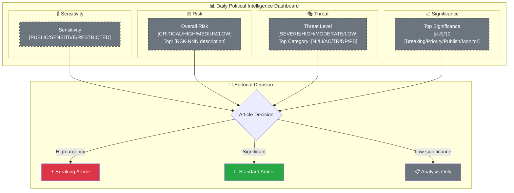
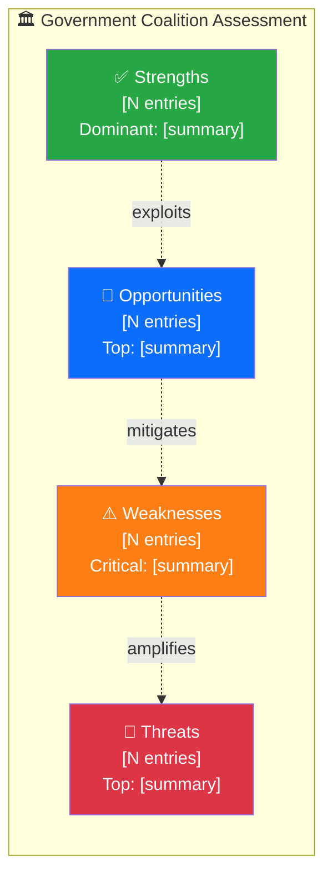

  

<h1 align="center">🧩 Political Intelligence Synthesis Template</h1>

  <strong>📊 Integrated Analysis Summary Combining All Intelligence Streams</strong> 
  <em>🎯 Classification · SWOT · Risk · Threat · Stakeholder · Forward Outlook</em>

  
  
  
  

**📋 Document Owner:** CEO | **📄 Version:** 2.2 | **📅 Last Updated:** 2026-04-06 (UTC)  
**🏢 Owner:** Hack23 AB (Org.nr 5595347807) | **🏷️ Classification:** Public

> **📌 Template Instructions:** Copy to `analysis/daily/YYYY-MM-DD/{articleType}/` and save as `synthesis-summary.md` in the workflow's own folder. This file synthesizes per-file analyses into an integrated intelligence picture. AI reads all per-file analyses and produces genuine synthesis — not a mechanical concatenation of summaries.

> **🚨 Anti-Pattern Warning:** A synthesis that merely lists document titles without analytical connections is REJECTED. Every synthesis MUST:
> 1. Identify **cross-document patterns** (what themes emerge across multiple documents?)
> 2. Assess **aggregate SWOT** (combining individual SWOT findings using intersection rules)
> 3. Map **risk interconnections** (how do individual risk findings compound?)
> 4. Provide **forward intelligence** (what should we watch for next? Specific triggers.)
> 5. Include ≥2 color-coded Mermaid diagrams (intelligence dashboard + one other)
> 6. Rank documents by significance and explain the ranking rationale

---

## 📋 Synthesis Context

| Field | Value |
|-------|-------|
| **Synthesis ID** | `[REQUIRED: SYN-YYYY-MM-DD-NNN]` |
| **Analysis Date** | `[REQUIRED: YYYY-MM-DD HH:MM UTC]` |
| **Documents Analyzed** | `[REQUIRED: N]` |
| **Analysis Period** | `[REQUIRED: e.g. "2026-03-28 00:00–18:00 UTC"]` |
| **Produced By** | `[REQUIRED: workflow name]` |
| **Overall Confidence** | `[REQUIRED: HIGH / MEDIUM / LOW]` |

---

## 📊 Intelligence Dashboard

### Daily Political Landscape

> **AI Instructions:** Replace all placeholder values with actual analysis results. Update each node's `style` line from grey dashed placeholder to the appropriate level color:
> - **Sensitivity:** 🟢 PUBLIC `#28a745` · 🟡 SENSITIVE `#ffc107` · 🔴 RESTRICTED `#dc3545`
> - **Risk / Threat / Significance:** use the standard palette (`#dc3545` / `#fd7e14` / `#ffc107` / `#28a745`)

---

## 🏆 Top Findings by Significance

| Rank | dok_id | Title | Significance | Risk Tier | SWOT Impact | Recommendation |
|:----:|--------|-------|:-----------:|:---------:|:-----------:|----------------|
| 1 | `[REQUIRED]` | `[REQUIRED]` | `[#.#]` | `[🟢/🟡/🟠/🔴]` | `[S/W/O/T dominant]` | `[Breaking/Priority/Publish/Monitor]` |
| 2 | `[REQUIRED]` | `[REQUIRED]` | `[#.#]` | `[tier]` | `[quadrant]` | `[action]` |
| 3 | `[REQUIRED]` | `[REQUIRED]` | `[#.#]` | `[tier]` | `[quadrant]` | `[action]` |
| 4 | `[OPTIONAL]` | `[OPTIONAL]` | `[#.#]` | `[tier]` | `[quadrant]` | `[action]` |
| 5 | `[OPTIONAL]` | `[OPTIONAL]` | `[#.#]` | `[tier]` | `[quadrant]` | `[action]` |

---

## 💪 Aggregated SWOT Summary

> *Combines individual document SWOT analyses into a landscape-level view.*

### Coalition Balance

| Quadrant | Count | Highest-Impact Entry | Evidence |
|----------|:-----:|---------------------|----------|
| ✅ Strengths | `[N]` | `[REQUIRED: strongest finding]` | `[dok_id]` |
| ⚠️ Weaknesses | `[N]` | `[REQUIRED: most critical weakness]` | `[dok_id]` |
| 🚀 Opportunities | `[N]` | `[REQUIRED: best opportunity]` | `[dok_id]` |
| 🔴 Threats | `[N]` | `[REQUIRED: most serious threat]` | `[dok_id]` |

**SWOT Balance Assessment:** `[REQUIRED: 1–2 sentences — e.g. "Coalition strengths outweigh weaknesses this period, but electoral threat from S welfare narrative creates medium-term vulnerability."]`

---

## ⚖️ Risk Landscape Summary

| Risk Category | Score Range | Highest Risk | Trend vs. Previous |
|--------------|:----------:|-------------|:------------------:|
| Coalition Stability | `[N–N]` | `[RSK-NNN: description]` | `[↑/→/↓]` |
| Policy Implementation | `[N–N]` | `[RSK-NNN: description]` | `[↑/→/↓]` |
| Budget / Fiscal | `[N–N]` | `[RSK-NNN: description]` | `[↑/→/↓]` |
| Electoral | `[N–N]` | `[RSK-NNN: description]` | `[↑/→/↓]` |
| Democratic Process | `[N–N]` | `[RSK-NNN: description]` | `[↑/→/↓]` |
| External / International | `[N–N]` | `[RSK-NNN: description]` | `[↑/→/↓]` |

**Overall Risk Level:** `[REQUIRED: LOW / MEDIUM / HIGH / CRITICAL]`

---

## 🎭 Threat Summary

| Threat Category | Threat Level | Key Finding |
|----------------|:------------:|-------------|
| S — Spoofing | `[LOW/MOD/HIGH/SEVERE]` | `[1 sentence]` |
| T — Tampering | `[LOW/MOD/HIGH/SEVERE]` | `[1 sentence]` |
| R — Repudiation | `[LOW/MOD/HIGH/SEVERE]` | `[1 sentence]` |
| I — Disclosure | `[LOW/MOD/HIGH/SEVERE]` | `[1 sentence]` |
| D — Denial | `[LOW/MOD/HIGH/SEVERE]` | `[1 sentence]` |
| E — Elevation | `[LOW/MOD/HIGH/SEVERE]` | `[1 sentence]` |

**Overall Threat Level:** `[REQUIRED: LOW / MODERATE / HIGH / SEVERE]`

---

## 👥 Stakeholder Impact Overview

| Stakeholder | Impact | Direction | Key Driver |
|------------|:------:|:---------:|------------|
| 🏘️ Citizens | `[H/M/L/N]` | `[positive/negative/neutral]` | `[REQUIRED]` |
| 🏛️ Government | `[H/M/L/N]` | `[positive/negative/neutral]` | `[REQUIRED]` |
| 🗳️ Opposition | `[H/M/L/N]` | `[positive/negative/neutral]` | `[REQUIRED]` |
| 🏭 Business | `[H/M/L/N]` | `[positive/negative/neutral]` | `[REQUIRED]` |
| 🤝 Civil Society | `[H/M/L/N]` | `[positive/negative/neutral]` | `[REQUIRED]` |
| 🌍 International | `[H/M/L/N]` | `[positive/negative/neutral]` | `[REQUIRED]` |

---

## 🎯 Narrative Direction

`[REQUIRED: 4–6 sentences providing the primary narrative direction for article generation. This is the lede thesis that the article generator should use. Be specific about the central political tension, the key actors, and the intelligence-level insight. Include confidence assessment.]`

**Primary Narrative Angle:** `[REQUIRED: 1 sentence — the article headline thesis]`  
**Secondary Angles:** `[OPTIONAL: 1–2 alternative narrative framings]`  
**Confidence:** `[REQUIRED: HIGH / MEDIUM / LOW]`

---

## 🔮 Forward Indicators (MANDATORY)

> **⚠️ This section is MANDATORY — analysis without forward indicators is incomplete and will be REJECTED.**

| # | Indicator | Timeline | Source | Watch Priority |
|---|-----------|----------|--------|:--------------:|
| 1 | `[REQUIRED: specific event or metric to monitor]` | `[days/weeks]` | `[data source]` | `🔴/🟠/🟡/🟢` |
| 2 | `[REQUIRED]` | `[timeline]` | `[source]` | `[tier]` |
| 3 | `[REQUIRED]` | `[timeline]` | `[source]` | `[tier]` |

**Aggregate Risk Level Summary:**

| Metric | Value | Trend vs. Previous |
|--------|-------|:------------------:|
| **Overall Risk Level** | `[REQUIRED: LOW / MEDIUM / HIGH / CRITICAL]` | `[↑/→/↓]` |
| **Overall Threat Level** | `[REQUIRED: LOW / MODERATE / HIGH / SEVERE]` | `[↑/→/↓]` |
| **Highest Significance Score** | `[REQUIRED: #.#/10]` | `[↑/→/↓]` |
| **SWOT Balance** | `[REQUIRED: Positive / Neutral / Negative]` | `[↑/→/↓]` |

**Previous Synthesis Reference:** `[REQUIRED: path to previous synthesis-summary.md or "N/A — first synthesis"]`

---

## 📋 Analysis Artifacts Inventory

| File | Status | Key Output |
|------|:------:|-----------|
| `classification-results.md` | `[✅/⚠️/❌]` | `[REQUIRED: main classification finding]` |
| `risk-assessment.md` | `[✅/⚠️/❌]` | `[REQUIRED: overall risk level]` |
| `swot-analysis.md` | `[✅/⚠️/❌]` | `[REQUIRED: SWOT balance]` |
| `threat-analysis.md` | `[✅/⚠️/❌]` | `[REQUIRED: overall threat level]` |
| `stakeholder-perspectives.md` | `[✅/⚠️/❌]` | `[REQUIRED: highest-impact stakeholder]` |
| `significance-scoring.md` | `[✅/⚠️/❌]` | `[REQUIRED: top significance score]` |
| Per-file `.analysis.md` files | `[N created]` | `[REQUIRED: count of per-file analyses]` |

---

## 📂 MCP Data Files Used

`[REQUIRED: List all MCP data file paths consulted for this synthesis. Include riksdag-regering-mcp tool outputs, CIA data exports, and any cached data files used during analysis.]`

| # | Data Source | File / Tool Path | Retrieved |
|---|-----------|-----------------|-----------|
| 1 | `[e.g. riksdag-regering-mcp]` | `[e.g. search_dokument(doktyp="prop", rm="2025/26")]` | `[YYYY-MM-DD HH:MM UTC]` |
| 2 | `[e.g. CIA export]` | `[e.g. cia-data/exports/risk-summary.json]` | `[YYYY-MM-DD HH:MM UTC]` |
| 3 | `[e.g. riksdag-regering-mcp]` | `[e.g. search_voteringar(rm="2025/26")]` | `[YYYY-MM-DD HH:MM UTC]` |
| 4 | `[OPTIONAL]` | `[path or tool call]` | `[timestamp]` |
| 5 | `[OPTIONAL]` | `[path or tool call]` | `[timestamp]` |

> **📌 AI Instructions:** Populate this table with every MCP tool call and data file actually consulted during the synthesis workflow. This provides full data provenance and audit trail for the intelligence product.

---

## 🔗 Cross-References

> *Link to same-day analysis from other article types and related external intelligence products.*

| Related Analysis | Article Type | Date | Key Finding |
|-----------------|-------------|------|-------------|
| `[OPTIONAL: e.g. analysis/daily/2026-04-04/propositions/synthesis-summary.md]` | `[propositions]` | `[date]` | `[1 sentence]` |
| `[OPTIONAL: e.g. analysis/daily/2026-04-04/committee-reports/synthesis-summary.md]` | `[committee-reports]` | `[date]` | `[1 sentence]` |
| `[OPTIONAL: CIA platform data]` | `[cia-export]` | `[date]` | `[1 sentence]` |

---

## ✅ Quality Self-Check Checklist

> **Pre-commit validation — every item MUST be checked before finalising this synthesis. Derived from SHARED_PROMPT_PATTERNS.md §Quality Self-Check Protocol.**

- [ ] **Synthesis Context complete:** All metadata fields filled (ID, date, documents analyzed, period, producer, confidence)
- [ ] **Intelligence Dashboard rendered:** Mermaid diagram has actual values (no grey placeholder nodes remaining)
- [ ] **≥3 documents ranked:** Top Findings table has at least 3 documents with significance scores
- [ ] **Aggregated SWOT present:** Coalition Balance Mermaid rendered with actual S/W/O/T counts
- [ ] **Risk Landscape Summary filled:** All 6 risk categories have score ranges and trend indicators
- [ ] **Threat Summary complete:** All 6 threat categories assessed with threat levels
- [ ] **Stakeholder Impact Overview filled:** All 6 stakeholder groups have impact levels and drivers
- [ ] **Narrative Direction written:** 4–6 sentence lede thesis with confidence label
- [ ] **Forward Indicators MANDATORY:** ≥3 specific forward indicators with timelines and watch priorities
- [ ] **Aggregate Risk Level with trends:** Overall risk, threat, significance, SWOT balance all have trend arrows
- [ ] **Analysis Artifacts Inventory:** All 7 artifact statuses (✅/⚠️/❌) filled
- [ ] **MCP Data Provenance:** All data sources listed with timestamps
- [ ] **No placeholder text remaining:** Search for `[REQUIRED` — zero hits expected
- [ ] **Cross-document patterns identified:** Synthesis adds value beyond concatenating individual analyses
- [ ] **Named actors:** ≥3 named politicians/parties cited across the synthesis

---

**Document Control:**  
- **Template Path:** `/analysis/templates/synthesis-summary.md`  
- **Version:** 2.2  
- **Effective Date:** 2026-04-06 (UTC)  
- **Consumed By:** All news article generator workflows  
- **ISMS Alignment:** ISO 27001:2022 A.5.7 (Threat Intelligence), NIST CSF 2.0 ID.RA (Risk Assessment)  
- **Classification:** Public  
- **Owner:** Hack23 AB (Org.nr 5595347807)  
- **Next Review:** 2026-06-30
