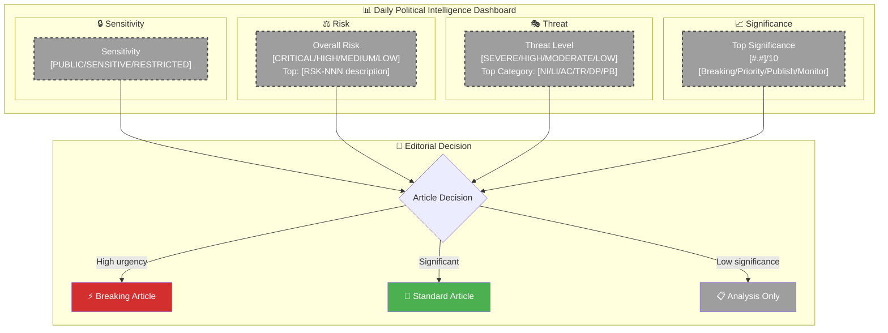
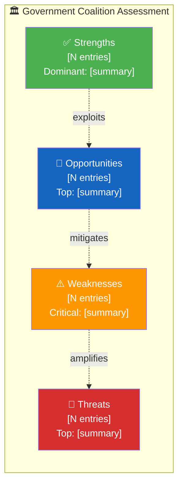

<p align="center">
  
</p>

<h1 align="center">🧩 Political Intelligence Synthesis Template</h1>

<p align="center">
  <strong>📊 Integrated Analysis Summary Combining All Intelligence Streams</strong><br>
  <em>🎯 Classification · SWOT · Risk · Threat · Stakeholder · Forward Outlook</em>
</p>

<p align="center">
  <a href="#"></a>
  <a href="#"></a>
  <a href="#"></a>
  <a href="#"></a>
</p>

**📋 Document Owner:** CEO | **📄 Version:** 2.5 | **📅 Last Updated:** 2026-04-25 (UTC)  
**🏢 Owner:** Hack23 AB (Org.nr 5595347807) | **🏷️ Classification:** Public

> **📌 Template Instructions:** Copy to `analysis/daily/YYYY-MM-DD/{articleType}/` and save as `synthesis-summary.md` in the workflow's own folder. This file synthesizes per-file analyses into an integrated intelligence picture. AI reads all per-file analyses and produces genuine synthesis — not a mechanical concatenation of summaries.

> **🚨 Anti-Pattern Warning:** A synthesis that merely lists document titles without analytical connections is REJECTED. Every synthesis MUST:
> 1. Identify **cross-document patterns** (what themes emerge across multiple documents?)
> 2. Assess **aggregate SWOT** (combining individual SWOT findings using intersection rules)
> 3. Map **risk interconnections** (how do individual risk findings compound?)
> 4. Provide **forward intelligence** (what should we watch for next? Specific triggers.)
> 5. Include ≥2 color-coded Mermaid diagrams (intelligence dashboard + one other)
> 6. Rank documents by significance and explain the ranking rationale


---

<!-- TEMPLATE_CONTRACT_V1 -->
> **📐 Template Contract** — every fill of this template MUST satisfy this row.
>
> | Slot | Value |
> |------|-------|
> | **Owning methodology** | [`per-artifact-methodologies.md`](../methodologies/per-artifact-methodologies.md#synthesis-summary) |
> | **Owning gate check** | Check 1 + Check 5 (Mermaid) — see [`05-analysis-gate.md`](../../.github/prompts/05-analysis-gate.md) |
> | **Required inputs** | all Family A peers + cross-reference-map.md |
> | **Horizon band** | per-run (per [`scripts/horizon-context.ts`](../../scripts/horizon-context.ts)) |
> | **Output family** | Family A — Core Synthesis |
> | **Aggregation order** | 2 of 30 in canonical order (see [`scripts/render-lib/aggregator/order.ts`](../../scripts/render-lib/aggregator/order.ts)) |
> | **Reader Intelligence Guide** | row generated from `synthesis-summary.md` (see [`scripts/render-lib/aggregator/reader-guide.ts`](../../scripts/render-lib/aggregator/reader-guide.ts)) |
> | **Canonical evidence anchor** | `\| claim \| evidence (dok_id / vote / MP intressent_id / primary-source URL) \| retrieved_at \| confidence \|` — every analytical claim row uses this schema. |
>
> Cross-reference: [`README.md §Template ↔ Methodology ↔ Gate-Check Matrix`](README.md#-template--methodology--gate-check-matrix).

<!--
AI-FIRST Pass-1 / Pass-2 self-check (HTML comment — invisible in rendered articles; not stripped by aggregator unless under a "## Pass 2 …" heading).

PASS 1 (creation, minimal viable artifact):
  • Fill every REQUIRED slot above; cite ≥ 1 dok_id / vote / MP / primary-source URL per major claim.
  • Use the canonical evidence anchor schema for every analytical claim row.
  • Mermaid blocks use the cyberpunk %%{init: theme/themeVariables}%% prologue and at least one `style …` or `classDef …` directive (Check 5 of 05-analysis-gate.md).

PASS 2 (read-back & improve — AI-FIRST mandatory, ≥ 180 s after Pass 1):
  • Re-read the file end-to-end; for each section verify (a) ≥ 1 evidence anchor row, (b) WEP language tightened (no "may/might/could" hedges), (c) named actors with intressent_id where applicable, (d) Mermaid colour theming present.
  • Banned-phrase scan: "intelligence theatre", "sources say", "reportedly", "it is widely believed", "experts agree", "AI_MUST_REPLACE".
  • Citation density target: ≥ 1 evidence anchor row per 100 words of analytical prose.
  • Neutrality arithmetic: equal analytical depth across the 8 Riksdag parties (S, M, SD, V, MP, C, L, KD); flag and correct any bias in the Pass-2 Self-Audit section.

ANTI-TEMPLATE — DO NOT:
  • Ship plain prose without evidence anchor tables.
  • Leave AI_MUST_REPLACE / [REQUIRED: …] placeholders in the rendered output.
  • Cite a non-primary URL when a `dok_id` or vote record is available.
  • Treat co-occurrence of keywords as coordination; uni-directional chains as bi-directional.
  • Use a Mermaid block without colour theming (Check 5 will block aggregation).
  • Skip the Pass-2 read-back (Check 6 verifies mtime ≥ birth + 180 s OR a differing pass1/ snapshot).
-->

## 🔄 Tradecraft Context

| Element | Value |
|---------|-------|
| **F3EAD Stage** | **ANALYZE → DISSEMINATE** — integrates per-document Family E findings into the run's coherent intelligence picture, identifies cross-document patterns, and lights the path from raw documents to executive-brief BLUF. |
| **PIRs Served** | Serves **all** standing PIRs that the day's documents touch; the synthesis explicitly lists which of PIR-1..PIR-7 each major finding addresses, and surfaces any PIR with insufficient evidence. |
| **Admiralty Floor** | **B2** floor on synthesis-level claims; per-document anchor evidence inherits the Admiralty grade from the contributing Family E `{dok_id}-analysis.md`; aggregate confidence ≤ floor of contributing artifact confidences. |
| **WEP + ODNI** | Pattern statements use **WEP** phrasing for cross-document inferences (`a likely coordinated push`, `about even between two interpretations`); aggregate confidence label is the floor (not average) of contributing-artifact confidences. |
| **Source Diversity Floor** | The synthesis must integrate **≥3 different MCP sources** (riksdag-regering MCP + at least one of `data.scb.se`, IMF, regeringen.se / `data.regeringen.se`); a synthesis built from a single MCP source is downgraded to ≤ MEDIUM confidence regardless of within-source breadth. |
| **SAT(s) Applied** | Cross-Impact Analysis (between same-day documents); Pattern Recognition (against the same-type 30-day baseline + same-type cross-run-diff); ACH lite (when ≥2 competing narratives explain the day); Indicators & Signposts (forward triggers extracted to `forward-indicators.md`). |
| **ICD 203 Standards** | All 9 standards apply — synthesis is the artifact most directly evaluated against ICD 203; in particular 4 (relevance to consumer), 5 (sourcing), 6 (logical argumentation), 7 (uncertainty), 8 (analytic value), 9 (alternative analysis). |

> See [`osint-tradecraft-standards.md`](../methodologies/osint-tradecraft-standards.md) for canonical F3EAD / PIR catalogue / Admiralty Code / WEP / SAT / ICD 203 definitions, and [`synthesis-methodology.md`](../methodologies/synthesis-methodology.md) for DIW-weighted ranking, lead-story selection, and aggregate confidence rules.

---

## 📋 Synthesis Context

| Field | Value |
|-------|-------|
| **Synthesis ID** | `[REQUIRED: SYN-YYYY-MM-DD-NNN]` |
| **Analysis Date** | `[REQUIRED: YYYY-MM-DD HH:MM UTC]` |
| **Documents Analyzed** | `[REQUIRED: N]` |
| **Analysis Period** | `[REQUIRED: e.g. "2026-03-28 00:00–18:00 UTC"]` |
| **Produced By** | `[REQUIRED: workflow name]` |
| **Overall Confidence** | `[REQUIRED: VERY HIGH / HIGH / MEDIUM / LOW / VERY LOW]` |

---

## 📊 Data Quality Assessment

> **AI Instructions:** Count the data depth of ALL documents analyzed. Classify **FULL-TEXT** using the actual full-text fields (`fullText` or `fullContent`) based on presence and meaningful length; treat `contentFetched` only as an auxiliary signal that content retrieval occurred, not as proof of full text. Classify **SUMMARY-ONLY** when no `fullText`/`fullContent` is present but a substantive summary/notis exists. Classify **METADATA-ONLY** when neither full text nor substantive summary is present. This assessment determines the maximum permissible confidence level for the entire synthesis. If the majority of documents are METADATA-ONLY, the synthesis confidence MUST NOT exceed MEDIUM.

| Metric | Value |
|--------|-------|
| **Documents with full text** (`fullText`/`fullContent` present with meaningful content; `contentFetched` auxiliary only) | `[REQUIRED: X of Y]` |
| **Documents with summary only** (no `fullText`/`fullContent`; substantive summary/notis only, e.g. 100-500 chars) | `[REQUIRED: X of Y]` |
| **Documents metadata-only** (no `fullText`/`fullContent` and no substantive summary; title/date/committee only) | `[REQUIRED: X of Y]` |
| **Maximum permissible confidence** | `[REQUIRED: Based on ratio — if >50% metadata-only → max MEDIUM; if >75% metadata-only → max LOW]` |
| **Data enrichment method** | `[REQUIRED: e.g. "download-parliamentary-data enrichment", "AI direct MCP calls", "metadata-only"]` |

> ⚠️ **Confidence Override Rule**: The `Overall Confidence` in the Synthesis Context table above MUST NOT exceed the `Maximum permissible confidence` calculated here. If it does, reduce the Overall Confidence to match.

---

## 📊 Intelligence Dashboard

### Daily Political Landscape

> **AI Instructions:** Replace all placeholder values with actual analysis results. Update each node's `style` line from grey dashed placeholder to the appropriate level color:
> - **Sensitivity:** 🟢 PUBLIC `#4CAF50` · 🟡 SENSITIVE `#FFC107` · 🔴 RESTRICTED `#D32F2F`
> - **Risk / Threat / Significance:** use the standard palette (`#D32F2F` / `#FF9800` / `#FFC107` / `#4CAF50`)



---

## 🏆 Top Findings by Significance

| Rank | dok_id | Title | Significance | Risk Tier | SWOT Impact | Recommendation |
|:----:|--------|-------|:-----------:|:---------:|:-----------:|----------------|
| 1 | `[REQUIRED]` | `[REQUIRED]` | `[#.#]` | `[🟢/🟡/🟠/🔴]` | `[S/W/O/T dominant]` | `[Breaking/Priority/Publish/Monitor]` |
| 2 | `[REQUIRED]` | `[REQUIRED]` | `[#.#]` | `[tier]` | `[quadrant]` | `[action]` |
| 3 | `[REQUIRED]` | `[REQUIRED]` | `[#.#]` | `[tier]` | `[quadrant]` | `[action]` |
| 4 | `[OPTIONAL]` | `[OPTIONAL]` | `[#.#]` | `[tier]` | `[quadrant]` | `[action]` |
| 5 | `[OPTIONAL]` | `[OPTIONAL]` | `[#.#]` | `[tier]` | `[quadrant]` | `[action]` |

---

## 📖 Narrative (v3.2 — required)

> **Purpose:** the table above is the analytic ranking; this section is the **prose handoff** to `article.md` for the lead story. Apply [`political-style-guide.md` §"Narrative-Voice Standards"](../methodologies/political-style-guide.md#-narrative-voice-standards-v32--new) — choose one canonical lede pattern, name three people in the first 200 words, follow the sentence-cadence rule, include sensory specificity, close with a counter-narrative paragraph. Pass-2 grades this on the 6-axis narrative rubric.

### Lead-story narrative *(400–700 words)*

**Lede** *(one of: hard-news / tension-contrast / scene-setting / significance-first — pick the form that fits the day's #1 ranked finding)*

> `[REQUIRED]`

**Body** *(2–4 paragraphs)*

> `[REQUIRED — vary sentence length, name ≥ 3 actors with role + party + verb, ≥ 1 concrete sensory detail per 400 words. Tradecraft jargon allowed only with payoff within ≤ 2 sentences.]`

**Counter-narrative** *(60–150 words, signposted)*

> *"There is a contrary read."* `[REQUIRED — named source whose framing differs.]`

### Secondary thread narrative *(200–400 words, optional but recommended for ≥ 3-finding days)*

> `[OPTIONAL — same structure, applied to ranking row #2 if its DIW is within 1.5 of #1.]`

---

## 💪 Aggregated SWOT Summary

> *Combines individual document SWOT analyses into a landscape-level view.*

### Coalition Balance



| Quadrant | Count | Highest-Impact Entry | Evidence |
|----------|:-----:|---------------------|----------|
| ✅ Strengths | `[N]` | `[REQUIRED: strongest finding]` | `[dok_id]` |
| ⚠️ Weaknesses | `[N]` | `[REQUIRED: most critical weakness]` | `[dok_id]` |
| 🚀 Opportunities | `[N]` | `[REQUIRED: best opportunity]` | `[dok_id]` |
| 🔴 Threats | `[N]` | `[REQUIRED: most serious threat]` | `[dok_id]` |

**SWOT Balance Assessment:** `[REQUIRED: 1–2 sentences — e.g. "Coalition strengths outweigh weaknesses this period, but electoral threat from S welfare narrative creates medium-term vulnerability."]`

---

## ⚖️ Risk Landscape Summary

| Risk Category | Score Range | Highest Risk | Trend vs. Previous |
|--------------|:----------:|-------------|:------------------:|
| Coalition Stability | `[N–N]` | `[RSK-NNN: description]` | `[↑/→/↓]` |
| Policy Implementation | `[N–N]` | `[RSK-NNN: description]` | `[↑/→/↓]` |
| Budget / Fiscal | `[N–N]` | `[RSK-NNN: description]` | `[↑/→/↓]` |
| Electoral | `[N–N]` | `[RSK-NNN: description]` | `[↑/→/↓]` |
| Democratic Process | `[N–N]` | `[RSK-NNN: description]` | `[↑/→/↓]` |
| External / International | `[N–N]` | `[RSK-NNN: description]` | `[↑/→/↓]` |

**Overall Risk Level:** `[REQUIRED: LOW / MEDIUM / HIGH / CRITICAL]`

---

## 🎭 Threat Summary

| Threat Category | Threat Level | Key Finding |
|----------------|:------------:|-------------|
| NI — Narrative Integrity | `[LOW/MOD/HIGH/SEVERE]` | `[1 sentence]` |
| LI — Legislative Integrity | `[LOW/MOD/HIGH/SEVERE]` | `[1 sentence]` |
| AC — Accountability | `[LOW/MOD/HIGH/SEVERE]` | `[1 sentence]` |
| TR — Transparency | `[LOW/MOD/HIGH/SEVERE]` | `[1 sentence]` |
| DP — Democratic Process | `[LOW/MOD/HIGH/SEVERE]` | `[1 sentence]` |
| PB — Power Balance | `[LOW/MOD/HIGH/SEVERE]` | `[1 sentence]` |

**Overall Threat Level:** `[REQUIRED: LOW / MODERATE / HIGH / SEVERE]`

---

## 👥 Stakeholder Impact Overview

| Stakeholder | Impact | Direction | Key Driver |
|------------|:------:|:---------:|------------|
| 🏘️ Citizens | `[VH/H/M/L/VL/N]` | `[positive/negative/neutral]` | `[REQUIRED]` |
| 🏛️ Government | `[VH/H/M/L/VL/N]` | `[positive/negative/neutral]` | `[REQUIRED]` |
| 🗳️ Opposition | `[VH/H/M/L/VL/N]` | `[positive/negative/neutral]` | `[REQUIRED]` |
| 🏭 Business | `[VH/H/M/L/VL/N]` | `[positive/negative/neutral]` | `[REQUIRED]` |
| 🤝 Civil Society | `[VH/H/M/L/VL/N]` | `[positive/negative/neutral]` | `[REQUIRED]` |
| 🌍 International | `[VH/H/M/L/VL/N]` | `[positive/negative/neutral]` | `[REQUIRED]` |

---

## 🎯 Narrative Direction & Article Decision

> **⚠️ v5.0 — ANALYSIS-DRIVEN ARTICLE DECISION**: This section is the SINGLE SOURCE OF TRUTH for article generation. The AI MUST complete ALL analysis (SWOT, risk, threat, stakeholder, significance scoring, per-file analysis) BEFORE filling in this section. Article titles, descriptions, and SEO metadata are derived from these fields — NEVER from code templates or string interpolation.

`[REQUIRED: 4–6 sentences providing the primary narrative direction for article generation. This is the lede thesis that the article generator should use. Be specific about the central political tension, the key actors, and the intelligence-level insight. Include confidence assessment.]`

**Primary Narrative Angle:** `[REQUIRED: 1 sentence — the article headline thesis]`  
**Secondary Angles:** `[OPTIONAL: 1–2 alternative narrative framings]`  
**Confidence:** `[REQUIRED: VERY HIGH / HIGH / MEDIUM / LOW / VERY LOW]`

### 📰 AI-Recommended Article Metadata (MANDATORY — v5.0)

> **SEO contract:** these fields must agree with `executive-brief.md` H1 + BLUF and satisfy [`.github/prompts/seo-metadata-contract.md`](../../.github/prompts/seo-metadata-contract.md). Do not use dates, boilerplate, passive noun phrases, or generic `AI-generated political intelligence` wording.

> **These fields MUST be generated by AI from the completed analysis above — NEVER from code templates.** The article generator reads these fields from synthesis-summary.md and uses them directly for `<title>`, `<meta name="description">`, Schema.org `headline` and `alternativeHeadline`.

| Field | Value | Requirements |
|-------|-------|-------------|
| **Recommended Title (EN)** | `[REQUIRED: 60-80 chars, newsworthy, names actors/institutions, uses active verbs]` | Must reference specific findings from Top Findings table above |
| **Recommended Title (SV)** | `[REQUIRED: Swedish equivalent, 60-80 chars]` | Professional Swedish political language |
| **Meta Description (EN)** | `[REQUIRED: 150-160 chars summarizing key intelligence findings]` | Must name specific policy areas, actors, and significance |
| **Meta Description (SV)** | `[REQUIRED: 150-160 chars]` | Swedish equivalent with proper political terminology |
| **Key Highlights** | `[REQUIRED: 3-5 specific, concrete highlights from analysis — NOT metadata labels]` | Each highlight: named actor + policy action + significance |
| **Article Decision** | `[REQUIRED: PUBLISH / ANALYSIS-ONLY / SKIP]` | Based on significance scores and risk levels above |
| **Article Priority** | `[REQUIRED: BREAKING / PRIORITY / STANDARD / MONITOR]` | Derived from highest significance score and risk tier |
| **Justification** | `[REQUIRED: 1-2 sentences explaining why this merits publication at the stated priority]` | Evidence-based, citing specific dok_ids and scores |

#### BANNED Patterns in Recommended Metadata

- ❌ `"Government Propositions: Policy Priorities This Week: {Topic} in Focus"` — template pattern
- ❌ `"Political intelligence analysis of N documents..."` — document count subtitle
- ❌ `"Analysis of N documents covering {Field}:, {Field}:"` — metadata field leak
- ❌ Any title/description that could be generated by string interpolation without reading analysis
- ❌ Repeating the article type name as the title (e.g., "Committee Reports" as title)

#### ✅ Quality Indicators for Recommended Metadata

- Title names at least one specific actor, institution, or policy measure from the analysis
- Meta description references the #1 ranked finding from the Top Findings table
- Key highlights are unique, substantive facts — not section headers or generic categories
- Article decision is justified by specific significance scores ≥ 5.0 (Publish) or ≥ 7.0 (Priority/Breaking)

---

## 📊 Historical Comparison

> **AI Instructions:** Compare current period findings with equivalent periods from previous riksmöten. This establishes trend context and prevents over-indexing on routine developments.

| Metric | Current Period | Prior Period (3 months ago) | Year Ago | Trend |
|--------|---------------|----------------------------|----------|-------|
| **Overall Risk Level** | `[REQUIRED]` | `[OPTIONAL]` | `[OPTIONAL]` | `[↑/→/↓]` |
| **Coalition Stability** | `[REQUIRED]` | `[OPTIONAL]` | `[OPTIONAL]` | `[↑/→/↓]` |
| **Legislative Throughput** | `[REQUIRED: N documents]` | `[OPTIONAL]` | `[OPTIONAL]` | `[↑/→/↓]` |
| **Opposition Activity Level** | `[REQUIRED: VH/H/M/L/VL]` | `[OPTIONAL]` | `[OPTIONAL]` | `[↑/→/↓]` |
| **Average Significance Score** | `[REQUIRED: #.#/10]` | `[OPTIONAL]` | `[OPTIONAL]` | `[↑/→/↓]` |

**Historical Context:** `[REQUIRED: 2–3 sentences placing this period in historical context. Is this an unusually active/risky period? Compare to equivalent pre-election periods in 2021/22.]`

**Precedents from Prior Riksmöten:**

| Precedent | Riksmöte | Outcome | Relevance to Current Period |
|-----------|----------|---------|----------------------------|
| `[OPTIONAL: similar political situation]` | `[e.g. 2021/22]` | `[What happened]` | `[Why it matters now]` |
| `[OPTIONAL]` | `[year]` | `[outcome]` | `[relevance]` |

---

## 🗳️ Election 2026 Implications

| Dimension | Assessment | Evidence |
|-----------|------------|----------|
| **Electoral Impact** | `[REQUIRED: How does this affect September 2026 election positioning?]` | `[Specific evidence]` |
| **Coalition Scenarios** | `[REQUIRED: Which coalition configurations benefit/suffer?]` | `[Evidence]` |
| **Voter Salience** | `[REQUIRED: Which voter segments are most affected? By how much?]` | `[Evidence]` |
| **Campaign Vulnerability** | `[REQUIRED: Does this create campaign attack vectors for opposition?]` | `[Evidence]` |
| **Policy Legacy** | `[REQUIRED: Will this become an electoral asset or liability?]` | `[Evidence]` |

**Overall Electoral Significance**: `[REQUIRED: CRITICAL/HIGH/MODERATE/LOW/NEGLIGIBLE]`

**Most Likely Narrative**: `[REQUIRED: How will this be framed in the 2026 campaign?]`

---

## 🔮 Forward Indicators (MANDATORY)

> **⚠️ This section is MANDATORY — analysis without forward indicators is incomplete and will be REJECTED.**

| # | Indicator | Timeline | Source | Watch Priority |
|---|-----------|----------|--------|:--------------:|
| 1 | `[REQUIRED: specific event or metric to monitor]` | `[days/weeks]` | `[data source]` | `🔴/🟠/🟡/🟢` |
| 2 | `[REQUIRED]` | `[timeline]` | `[source]` | `[tier]` |
| 3 | `[REQUIRED]` | `[timeline]` | `[source]` | `[tier]` |

**Aggregate Risk Level Summary:**

| Metric | Value | Trend vs. Previous |
|--------|-------|:------------------:|
| **Overall Risk Level** | `[REQUIRED: LOW / MEDIUM / HIGH / CRITICAL]` | `[↑/→/↓]` |
| **Overall Threat Level** | `[REQUIRED: LOW / MODERATE / HIGH / SEVERE]` | `[↑/→/↓]` |
| **Highest Significance Score** | `[REQUIRED: #.#/10]` | `[↑/→/↓]` |
| **SWOT Balance** | `[REQUIRED: Positive / Neutral / Negative]` | `[↑/→/↓]` |

**Previous Synthesis Reference:** `[REQUIRED: path to previous synthesis-summary.md or "N/A — first synthesis"]`

---

## 📋 Analysis Artifacts Inventory

| File | Status | Key Output |
|------|:------:|-----------|
| `classification-results.md` | `[✅/⚠️/❌]` | `[REQUIRED: main classification finding]` |
| `risk-assessment.md` | `[✅/⚠️/❌]` | `[REQUIRED: overall risk level]` |
| `swot-analysis.md` | `[✅/⚠️/❌]` | `[REQUIRED: SWOT balance]` |
| `threat-analysis.md` | `[✅/⚠️/❌]` | `[REQUIRED: overall threat level]` |
| `stakeholder-perspectives.md` | `[✅/⚠️/❌]` | `[REQUIRED: highest-impact stakeholder]` |
| `significance-scoring.md` | `[✅/⚠️/❌]` | `[REQUIRED: top significance score]` |
| Per-file `.analysis.md` files | `[N created]` | `[REQUIRED: count of per-file analyses]` |

---

## 📂 MCP Data Files Used

`[REQUIRED: List all MCP data file paths consulted for this synthesis. Include riksdag-regering-mcp tool outputs, CIA data exports, and any cached data files used during analysis.]`

| # | Data Source | File / Tool Path | Retrieved |
|---|-----------|-----------------|-----------|
| 1 | `[e.g. riksdag-regering-mcp]` | `[e.g. search_dokument(doktyp="prop", rm="2025/26")]` | `[YYYY-MM-DD HH:MM UTC]` |
| 2 | `[e.g. CIA export]` | `[e.g. cia-data/exports/risk-summary.json]` | `[YYYY-MM-DD HH:MM UTC]` |
| 3 | `[e.g. riksdag-regering-mcp]` | `[e.g. search_voteringar(rm="2025/26")]` | `[YYYY-MM-DD HH:MM UTC]` |
| 4 | `[OPTIONAL]` | `[path or tool call]` | `[timestamp]` |
| 5 | `[OPTIONAL]` | `[path or tool call]` | `[timestamp]` |

> **📌 AI Instructions:** Populate this table with every MCP tool call and data file actually consulted during the synthesis workflow. This provides full data provenance and audit trail for the intelligence product.

---

## 🔗 Cross-References

> *Link to same-day analysis from other article types and related external intelligence products.*

| Related Analysis | Article Type | Date | Key Finding |
|-----------------|-------------|------|-------------|
| `[OPTIONAL: e.g. analysis/daily/2026-04-04/propositions/synthesis-summary.md]` | `[propositions]` | `[date]` | `[1 sentence]` |
| `[OPTIONAL: e.g. analysis/daily/2026-04-04/committee-reports/synthesis-summary.md]` | `[committee-reports]` | `[date]` | `[1 sentence]` |
| `[OPTIONAL: CIA platform data]` | `[cia-export]` | `[date]` | `[1 sentence]` |

---

## 🎯 Confidence Scale Reference (5-Level)

| Level | Label | Criteria | Evidence Threshold |
|-------|-------|----------|--------------------|
| ⬛ 1 | **VERY LOW** | Speculation only, single unverified source | 0–1 sources, no corroboration |
| 🟥 2 | **LOW** | Circumstantial evidence, indirect indicators | 2 sources, indirect evidence |
| 🟧 3 | **MEDIUM** | Multiple independent sources, moderate corroboration | 3+ sources, moderate agreement |
| 🟩 4 | **HIGH** | Official records, documented data, direct evidence | Official docs, voting records, committee reports |
| 🟦 5 | **VERY HIGH** | Verified data + independent corroboration + expert consensus | Multiple official sources, cross-validated |

---

## ✅ Quality Self-Check Checklist

> **Pre-commit validation — every item MUST be checked before finalising this synthesis. Derived from the analysis-gate checks in [`.github/prompts/05-analysis-gate.md`](../../.github/prompts/05-analysis-gate.md).**

- [ ] **Synthesis Context complete:** All metadata fields filled (ID, date, documents analyzed, period, producer, confidence)
- [ ] **Intelligence Dashboard rendered:** Mermaid diagram has actual values (no grey placeholder nodes remaining)
- [ ] **≥3 documents ranked:** Top Findings table has at least 3 documents with significance scores
- [ ] **Aggregated SWOT present:** Coalition Balance Mermaid rendered with actual S/W/O/T counts
- [ ] **Risk Landscape Summary filled:** All 5 risk dimensions have score ranges and trend indicators
- [ ] **Threat Summary complete:** All 6 threat categories assessed with threat levels
- [ ] **Stakeholder Impact Overview filled:** All 6 stakeholder groups have impact levels and drivers
- [ ] **Narrative Direction written:** 4–6 sentence lede thesis with confidence label
- [ ] **Forward Indicators MANDATORY:** ≥3 specific forward indicators with timelines and watch priorities
- [ ] **Aggregate Risk Level with trends:** Overall risk, threat, significance, SWOT balance all have trend arrows
- [ ] **Analysis Artifacts Inventory:** All 7 artifact statuses (✅/⚠️/❌) filled
- [ ] **MCP Data Provenance:** All data sources listed with timestamps
- [ ] **No placeholder text remaining:** Search for `[REQUIRED` — zero hits expected
- [ ] **Cross-document patterns identified:** Synthesis adds value beyond concatenating individual analyses
- [ ] **Election 2026 Implications present:** All 5 dimensions assessed with evidence and Overall Electoral Significance rating
- [ ] **Historical Comparison table filled:** Current period compared with prior periods and trend arrows
- [ ] **5-level confidence applied:** Overall Confidence uses VERY HIGH/HIGH/MEDIUM/LOW/VERY LOW scale
- [ ] **Named actors:** ≥3 named politicians/parties cited across the synthesis

---

**Document Control:**  
- **Template Path:** `/analysis/templates/synthesis-summary.md`  
- **Version:** 2.5  
- **Effective Date:** 2026-04-25 (UTC)  
- **Key Changes v2.3:** Added Election 2026 Implications section, Historical Comparison tables, 5-level confidence scale (VERY HIGH/HIGH/MEDIUM/LOW/VERY LOW), updated quality checklist  
- **Consumed By:** All news article generator workflows  
- **ISMS Alignment:** ISO 27001:2022 A.5.7 (Threat Intelligence), NIST CSF 2.0 ID.RA (Risk Assessment)  
- **Classification:** Public  
- **Owner:** Hack23 AB (Org.nr 5595347807)  
- **Next Review:** 2026-06-30

---

## ✅ Pass-2 Self-Audit Checklist (v4.4 — required)

> **Purpose:** AI-FIRST principle requires a Pass-2 read-back-and-improve. After producing this artifact in Pass 1, re-read it end-to-end and verify each item below. Document any remediation in [`methodology-reflection.md`](methodology-reflection.md) §"Pass-2 audit log". Any unchecked ❌ box at the end of Pass 2 forces a Pass-3 rewrite of the affected section.

- [ ] **Tradecraft anchors honoured** — F3EAD stage matches the artifact's role; PIRs declared in the §Tradecraft Context block are actually addressed in the body; Admiralty grades attached to every external source; WEP band + ODNI confidence on every probabilistic judgement.
- [ ] **Source diversity floor met** — at least the minimum number of independent MCP sources required by the artifact's tradecraft block are cited; single-source claims are explicitly labelled `[SINGLE-SOURCE — corroboration pending]`.
- [ ] **Evidence specificity** — every quantified claim cites a `dok_id` (Riksdag), an SCB / IMF dataflow code, or a named external source with date; no "according to data" / "studies show" hand-waves.
- [ ] **Named-actor discipline** — every political claim names ≥ 1 person (party + role + dated act/quote) or labels the absence (`[diffuse — no named actor]`).
- [ ] **Counter-narrative present** — at least one explicit competing hypothesis, dissent quote, or framed objection appears in the body; "no opposition recorded" is itself a finding to label, not silence.
- [ ] **Election 2026 lens applied** — the §"Election 2026 Implications" subsection (or equivalent) addresses electoral salience, coalition pressure, and forward indicators; not boilerplate.
- [ ] **No illustrative content shipped as fact** — every `[REQUIRED]` placeholder is filled OR removed; every `Example:` block is clearly fenced or removed; no fabricated `dok_id`, vote count, or quote leaks into the final artifact.
- [ ] **Cross-references resolve** — every `[link](file.md)` in this artifact points to a file that exists in the run folder (`analysis/daily/$ARTICLE_DATE/$SUBFOLDER/`) or to a methodology / template under `analysis/`.
- [ ] **Mermaid renders** — every fenced ` ```mermaid ` block parses (no missing class definitions, no orphan nodes, no >40-node graphs that overflow viewport on mobile).
- [ ] **Line-floor check** — artifact length ≥ the per-artifact floor in [`reference-quality-thresholds.json`](../methodologies/reference-quality-thresholds.json); shorter artifacts trigger Pass-2 rewrite, never a `[truncated]` note.

