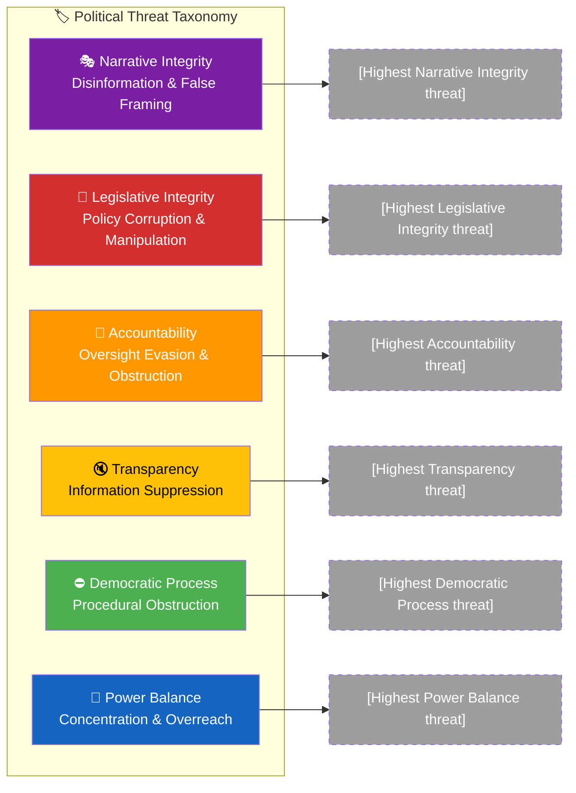
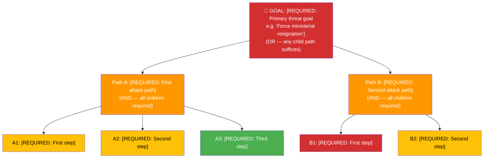
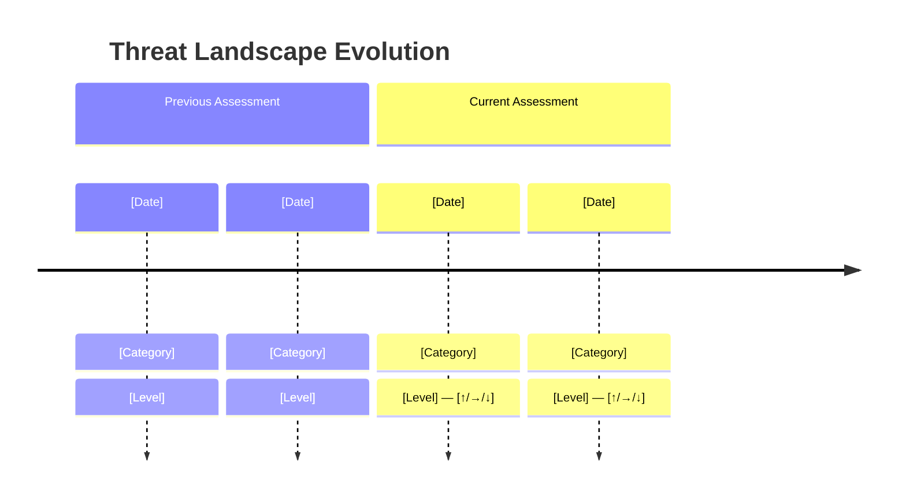

<p align="center">
  
</p>

<h1 align="center">🎭 Political Threat Analysis Template</h1>

<p align="center">
  <strong>📊 Multi-Framework Template for Democratic Process Threat Analysis</strong><br>
  <em>🎯 Attack Trees · Kill Chain · Diamond Model · Political Threat Taxonomy · Actor Profiling</em>
</p>

<p align="center">
  <a href="#"></a>
  <a href="#"></a>
  <a href="#"></a>
  <a href="#"></a>
</p>

**📋 Document Owner:** CEO | **📄 Version:** 3.5 | **📅 Last Updated:** 2026-04-25 (UTC)  
**🏢 Owner:** Hack23 AB (Org.nr 5595347807) | **🏷️ Classification:** Public

> **📌 Template Instructions:** Copy to `analysis/daily/YYYY-MM-DD/{articleType}/`. Save as `threat-analysis.md` in the workflow's own folder (never overwrite another workflow's files). Each threat requires evidence citations and multi-framework analysis. See [methodologies/political-threat-framework.md](../methodologies/political-threat-framework.md).

> **🚨 Anti-Pattern Warning:** Generic threat descriptions without attack trees are REJECTED. Every threat analysis MUST include:
> 1. **Threat Analysis Context** (metadata header with ID, date, scope)
> 2. **Political Threat Taxonomy** coverage check (all 6 democratic function categories assessed)
> 3. **Attack Tree** for the top threat (Mermaid diagram showing how the threat could succeed)
> 4. **Kill Chain assessment** (what stage has the threat progressed to?)
> 5. **Diamond Model** for the primary threat actor
> 6. **Threat Actor Profile** with ICO (Intent-Capability-Opportunity) assessment
> 7. **Evidence tables** with dok_id citations, severity scores, and confidence labels
> 8. **Forward indicators** — what MCP-detectable signals indicate escalation?
>
> **DO NOT use STRIDE categories (S/T/R/I/D/E).** Use the Political Threat Taxonomy categories:
> Narrative Integrity, Legislative Integrity, Accountability, Transparency, Democratic Process, Power Balance.
>
> **Good example:** [THREAT_MODEL.md](../../THREAT_MODEL.md) — this is the formatting quality standard.


---

<!-- TEMPLATE_CONTRACT_V1 -->
> **📐 Template Contract** — every fill of this template MUST satisfy this row.
>
> | Slot | Value |
> |------|-------|
> | **Owning methodology** | [`per-artifact-methodologies.md`](../methodologies/per-artifact-methodologies.md#threat-analysis) |
> | **Owning gate check** | Check 1 (Family A — Threat Taxonomy + attack tree) — see [`05-analysis-gate.md`](../../.github/prompts/05-analysis-gate.md) |
> | **Required inputs** | `search_anforanden`, `get_voteringar`, OSINT framing |
> | **Horizon band** | per-run (per [`scripts/horizon-context.ts`](../../scripts/horizon-context.ts)) |
> | **Output family** | Family A — Core Synthesis |
> | **Aggregation order** | 11 of 30 in canonical order (see [`scripts/render-lib/aggregator/order.ts`](../../scripts/render-lib/aggregator/order.ts)) |
> | **Reader Intelligence Guide** | row generated from `threat-analysis.md` (see [`scripts/render-lib/aggregator/reader-guide.ts`](../../scripts/render-lib/aggregator/reader-guide.ts)) |
> | **Canonical evidence anchor** | `\| claim \| evidence (dok_id / vote / MP) \| retrieved_at \| confidence \|` — every analytical claim row uses this schema. |
>
> Cross-reference: [`README.md §Template ↔ Methodology ↔ Gate-Check Matrix`](README.md#-template--methodology--gate-check-matrix).

<!--
AI-FIRST Pass-1 / Pass-2 self-check (HTML comment — invisible in rendered articles; not stripped by aggregator unless under a "## Pass 2 …" heading).

PASS 1 (creation, minimal viable artifact):
  • Fill every REQUIRED slot above; cite ≥ 1 dok_id / vote / MP / primary-source URL per major claim.
  • Use the canonical evidence anchor schema for every analytical claim row.
  • Mermaid blocks use the cyberpunk %%{init: theme/themeVariables}%% prologue and at least one `style …` or `classDef …` directive (Check 5 of 05-analysis-gate.md).

PASS 2 (read-back & improve — AI-FIRST mandatory, ≥ 180 s after Pass 1):
  • Re-read the file end-to-end; for each section verify (a) ≥ 1 evidence anchor row, (b) WEP language tightened (no "may/might/could" hedges), (c) named actors with intressent_id where applicable, (d) Mermaid colour theming present.
  • Banned-phrase scan: "intelligence theatre", "sources say", "reportedly", "it is widely believed", "experts agree", "AI_MUST_REPLACE".
  • Citation density target: ≥ 1 evidence anchor row per 100 words of analytical prose.
  • Neutrality arithmetic: equal analytical depth across the 8 Riksdag parties (S, M, SD, V, MP, C, L, KD); flag and correct any bias in the Pass-2 Self-Audit section.

ANTI-TEMPLATE — DO NOT:
  • Ship plain prose without evidence anchor tables.
  • Leave AI_MUST_REPLACE / [REQUIRED: …] placeholders in the rendered output.
  • Cite a non-primary URL when a `dok_id` or vote record is available.
  • Treat co-occurrence of keywords as coordination; uni-directional chains as bi-directional.
  • Use a Mermaid block without colour theming (Check 5 will block aggregation).
  • Skip the Pass-2 read-back (Check 6 verifies mtime ≥ birth + 180 s OR a differing pass1/ snapshot).
-->

## 🔄 Tradecraft Context

| Element | Value |
|---------|-------|
| **F3EAD Stage** | **EXPLOIT / ANALYZE** — characterises political threats to democratic function across the 6-dimension Political Threat Taxonomy and feeds risk-assessment cascading chains, scenario-analysis tail scenarios, and forward-indicators escalation signals. |
| **PIRs Served** | PIR-1 (coalition stability), PIR-5 (institutional risk), PIR-7 (foreign-policy alignment); add PIR-4 (Election 2026 pathway) when threats target electoral integrity; PIR-2 (opposition cohesion) when threats target opposition coordination capacity. |
| **Admiralty Floor** | **B2** floor on every threat row; **A1** required when an entry quotes verbatim primary actor statements (motions, votes, ministerial declarations, public speeches); **F6** ungraded entries are flagged and downgraded; suspected disinformation must be tagged `[low-source-reliability]`. |
| **WEP + ODNI** | Threat actor **capability**, **intent**, and **opportunity** (ICO) each carry **WEP**-phrased likelihood; threat severity is 1–5 with descriptive consequence narrative; confidence label per row uses 5-level scale. |
| **Source Diversity Floor** | ≥3 primary + ≥1 secondary source per HIGH threat (severity ≥ 4); HIGH threats with single-source provenance must be downgraded to MEDIUM or flagged `[unconfirmed]`; foreign-actor threats require ≥1 cross-language corroboration where feasible. |
| **SAT(s) Applied** | Red Team (adversarial perspective); Devil's Advocacy (challenge dominant threat hypothesis); Diamond Model walk-through (adversary–capability–infrastructure–victim); Kill-Chain mapping; ACH (when ≥2 competing threat hypotheses); Premortem (for HIGH-severity rows). |
| **ICD 203 Standards** | 1 (objectivity), 2 (independent — no political alignment), 5 (sourcing), 6 (logical argumentation — attack-tree decomposition shown), 7 (uncertainty), 9 (alternative analysis — Devil's Advocacy + ACH). |

> ⚠️ **STRIDE is NOT used.** The Political Threat Taxonomy (Narrative Integrity · Legislative Integrity · Accountability · Transparency · Democratic Process · Power Balance) replaces STRIDE for political analysis. STRIDE remains valid only for the platform's software security in `THREAT_MODEL.md`.

> See [`osint-tradecraft-standards.md`](../methodologies/osint-tradecraft-standards.md) for canonical Admiralty / WEP / SAT / ICD 203 definitions, and [`political-threat-framework.md`](../methodologies/political-threat-framework.md) for the 6-dimension taxonomy, attack-tree templates, kill-chain stages, and Diamond Model adaptation.

---

## 📋 Threat Analysis Context

| Field | Value |
|-------|-------|
| **Threat Analysis ID** | `[REQUIRED: THR-YYYY-MM-DD-NNN]` |
| **Analysis Date** | `[REQUIRED: YYYY-MM-DD HH:MM UTC]` |
| **Analysis Period** | `[REQUIRED: e.g. "2026-W13 (2026-03-23 to 2026-03-29)"]` |
| **Produced By** | `[REQUIRED: workflow name]` |
| **Political Context** | `[REQUIRED: 2–3 sentences on current political situation]` |
| **Overall Threat Level** | `[REQUIRED: LOW / MODERATE / HIGH / SEVERE]` |

---

## 🏷️ Section 1: Political Threat Taxonomy Assessment

> **Severity Scale Reference:** 1=Negligible (routine), 2=Minor (self-correcting), 3=Moderate (intervention needed), 4=Major (formal response required), 5=Severe (constitutional crisis). See [methodologies/political-threat-framework.md §9](../methodologies/political-threat-framework.md) for full calibration table.

### Political Threat Landscape

> **AI Instructions:** Replace placeholder text with actual threats identified from document analysis. Category nodes should be color-coded by severity using the standard palette (🔴 severe → 🟢 negligible).



### Narrative Integrity — Disinformation & False Framing

*Threats involving actors misrepresenting facts, identities, or political positions to manipulate public discourse or parliamentary outcomes.*

| Threat ID | Threat Description | Threat Actor | Evidence Sources | Severity (1–5) | Mitigation |
|-----------|-------------------|--------------|------------------|:--------------:|------------|
| `NI-001` | `[REQUIRED: e.g. "Coordinated disinformation campaign misattributing policy position to coalition party"]` | `[REQUIRED: e.g. "Foreign state actor / domestic opposition / media outlet"]` | `[REQUIRED: dok_id or URL]` | `[#]` | `[REQUIRED: 1 sentence]` |
| `NI-002` | `[OPTIONAL]` | `[OPTIONAL]` | `[OPTIONAL]` | `[#]` | `[OPTIONAL]` |

**Narrative Integrity Threat Level:** `[LOW / MODERATE / HIGH / SEVERE]`

---

### Legislative Integrity — Policy Corruption & Manipulation

*Threats involving manipulation of legislative texts, parliamentary records, budget figures, or official statistics to corrupt policy outcomes.*

| Threat ID | Threat Description | Threat Actor | Evidence Sources | Severity (1–5) | Mitigation |
|-----------|-------------------|--------------|------------------|:--------------:|------------|
| `LI-001` | `[REQUIRED: e.g. "Undisclosed lobbying altering committee report recommendations"]` | `[REQUIRED: e.g. "Industry lobby / coalition ally ministry"]` | `[REQUIRED: dok_id]` | `[#]` | `[REQUIRED]` |
| `LI-002` | `[OPTIONAL]` | `[OPTIONAL]` | `[OPTIONAL]` | `[#]` | `[OPTIONAL]` |

**Legislative Integrity Threat Level:** `[LOW / MODERATE / HIGH / SEVERE]`

---

### Accountability — Oversight Evasion & Obstruction

*Threats involving actors denying statements, votes, commitments, or policy positions to evade accountability — especially relevant in Swedish parliamentary context where voting records are public.*

| Threat ID | Threat Description | Threat Actor | Evidence Sources | Severity (1–5) | Mitigation |
|-----------|-------------------|--------------|------------------|:--------------:|------------|
| `AC-001` | `[REQUIRED: e.g. "Government minister contradicts Riksdag voting record on climate policy"]` | `[REQUIRED: e.g. "Statsråd / party spokesperson"]` | `[REQUIRED: voterings-id or dok_id]` | `[#]` | `[REQUIRED: e.g. "Publish voting record cross-reference"]` |
| `AC-002` | `[OPTIONAL]` | `[OPTIONAL]` | `[OPTIONAL]` | `[#]` | `[OPTIONAL]` |

**Accountability Threat Level:** `[LOW / MODERATE / HIGH / SEVERE]`

---

### Transparency — Information Suppression

*Threats involving suppression, delay, or selective disclosure of politically significant information that citizens have a right to know.*

| Threat ID | Threat Description | Threat Actor | Evidence Sources | Severity (1–5) | Mitigation |
|-----------|-------------------|--------------|------------------|:--------------:|------------|
| `TR-001` | `[REQUIRED: e.g. "Classified government inquiry suppresses key findings from SOU report"]` | `[REQUIRED: e.g. "Departement / committee chair"]` | `[REQUIRED: dok_id or reference]` | `[#]` | `[REQUIRED: e.g. "FOI request tracking, MCP monitoring"]` |
| `TR-002` | `[OPTIONAL]` | `[OPTIONAL]` | `[OPTIONAL]` | `[#]` | `[OPTIONAL]` |

**Transparency Threat Level:** `[LOW / MODERATE / HIGH / SEVERE]`

---

### Democratic Process — Procedural Obstruction

*Threats involving obstruction, delay, or blockage of normal democratic processes — votes, committee work, public consultations, or legislative timelines.*

| Threat ID | Threat Description | Threat Actor | Evidence Sources | Severity (1–5) | Mitigation |
|-----------|-------------------|--------------|------------------|:--------------:|------------|
| `DP-001` | `[REQUIRED: e.g. "Systematic filibustering of budget committee deliberations to delay vote"]` | `[REQUIRED: e.g. "Opposition bloc / specific party"]` | `[REQUIRED: calendar ref or dok_id]` | `[#]` | `[REQUIRED: e.g. "Track committee session attendance and delay patterns"]` |
| `DP-002` | `[OPTIONAL]` | `[OPTIONAL]` | `[OPTIONAL]` | `[#]` | `[OPTIONAL]` |

**Democratic Process Threat Level:** `[LOW / MODERATE / HIGH / SEVERE]`

---

### Power Balance — Concentration & Overreach

*Threats involving actors accumulating disproportionate political power beyond their constitutional mandate — e.g. bypassing Riksdag oversight, concentrating ministerial authority, or circumventing checks and balances.*

| Threat ID | Threat Description | Threat Actor | Evidence Sources | Severity (1–5) | Mitigation |
|-----------|-------------------|--------------|------------------|:--------------:|------------|
| `PB-001` | `[REQUIRED: e.g. "Government uses regulatory decree to bypass Riksdag legislative vote on migration policy"]` | `[REQUIRED: e.g. "Statsminister / Justitiedepartementet"]` | `[REQUIRED: dok_id or proposition ref]` | `[#]` | `[REQUIRED: e.g. "Track Konstitutionsutskottet (KU) granskning proceedings"]` |
| `PB-002` | `[OPTIONAL]` | `[OPTIONAL]` | `[OPTIONAL]` | `[#]` | `[OPTIONAL]` |

**Power Balance Threat Level:** `[LOW / MODERATE / HIGH / SEVERE]`

---

## 🌳 Section 2: Attack Tree — Primary Threat Decomposition

> **AI Instructions:** Build an attack tree for the single most significant threat identified in Section 1. The root is the threat goal; decompose using AND/OR gates down to leaf-level actions. Color-code by feasibility.



### Attack Path Assessment

| Path | Steps Required | Feasibility (1–5) | Detectability (1–5) | Political Cost | Most Likely? |
|------|:--------------:|:-----------------:|:-------------------:|:--------------:|:------------:|
**Political Cost scale:** `VH = Very High` · `H = High` · `M = Medium` · `L = Low` · `VL = Very Low`

> Rate the expected political cost to the attacker if the path is attempted or exposed (e.g. public backlash, coalition fracture, media scrutiny, loss of legitimacy, sanctions, or electoral damage).

| Path | Steps Required | Feasibility (1–5) | Detectability (1–5) | Political Cost | Most Likely? |
|------|:--------------:|:-----------------:|:-------------------:|:--------------:|:------------:|
| Path A | `[#]` | `[1-5]` | `[1-5]` | `[VH/H/M/L/VL]` | `[Y/N]` |
| Path B | `[#]` | `[1-5]` | `[1-5]` | `[VH/H/M/L/VL]` | `[Y/N]` |

**Cheapest attack path:** `[REQUIRED: Which path has highest feasibility and lowest cost?]`

**Early warning indicators:** `[REQUIRED: What MCP-detectable signals precede each path?]`

---

## ⛓️ Section 3: Kill Chain Assessment

> **AI Instructions:** Assess how far the primary threat has progressed along the Political Kill Chain. Mark each stage as Not Started / Active / Complete.

| Kill Chain Stage | Status | Evidence | Disruption Opportunity |
|:----------------:|:------:|---------|----------------------|
| 1️⃣ Reconnaissance | `[Not Started / Active / Complete]` | `[dok_id or reference]` | `[How to stop here]` |
| 2️⃣ Weaponization | `[Not Started / Active / Complete]` | `[dok_id or reference]` | `[How to stop here]` |
| 3️⃣ Delivery | `[Not Started / Active / Complete]` | `[dok_id or reference]` | `[How to stop here]` |
| 4️⃣ Exploitation | `[Not Started / Active / Complete]` | `[dok_id or reference]` | `[How to stop here]` |
| 5️⃣ Installation | `[Not Started / Active / Complete]` | `[dok_id or reference]` | `[How to stop here]` |
| 6️⃣ Command & Control | `[Not Started / Active / Complete]` | `[dok_id or reference]` | `[How to stop here]` |
| 7️⃣ Actions on Objective | `[Not Started / Active / Complete]` | `[dok_id or reference]` | `[Recovery action]` |

**Current kill chain stage:** `[REQUIRED: 1-7]`  
**Next expected stage:** `[REQUIRED: What happens next if unchecked?]`

---

## 💎 Section 4: Diamond Model — Primary Threat Actor

| Diamond Element | Assessment | Evidence |
|----------------|-----------|---------|
| **Adversary** | `[REQUIRED: Who? Name + party + role]` | `[dok_id / reference]` |
| **Capability** | `[REQUIRED: What parliamentary/political tools do they wield?]` | `[Seat count, committee positions, etc.]` |
| **Infrastructure** | `[REQUIRED: Alliances, media channels, institutional access]` | `[Coalition structure, media relationships]` |
| **Victim** | `[REQUIRED: Who/what is targeted?]` | `[Minister, policy, coalition stability]` |

### Threat Actor ICO Profile

| Attribute | Assessment | Confidence |
|-----------|-----------|:----------:|
| **Intent** | `[REQUIRED: What do they want?]` | `[VH/H/M/L/VL]` |
| **Capability** | `[REQUIRED: What can they actually do?]` | `[VH/H/M/L/VL]` |
| **Opportunity** | `[REQUIRED: What upcoming events create windows?]` | `[VH/H/M/L/VL]` |
| **Track Record** | `[REQUIRED: Have they acted on similar threats before?]` | `[VH/H/M/L/VL]` |
| **Constraints** | `[REQUIRED: What limits their action?]` | `[VH/H/M/L/VL]` |
| **Overall ICO Level** | `[REQUIRED: VERY HIGH / HIGH / MEDIUM / LOW / VERY LOW]` | `[VH/H/M/L/VL]` |

---

> Use this matrix to summarize, for each threat category, the single highest-severity threat and its assessed severity score (1–5).

| Threat Category | Highest Threat | Severity | Threat Level |
|----------------|---------------|:--------:|--------------|
| Narrative Integrity | `[highest NI threat ID]` | `[#]` | `[LOW/MOD/HIGH/SEVERE]` |
| Legislative Integrity | `[highest LI threat ID]` | `[#]` | `[LOW/MOD/HIGH/SEVERE]` |
| Accountability | `[highest AC threat ID]` | `[#]` | `[LOW/MOD/HIGH/SEVERE]` |
| Transparency | `[highest TR threat ID]` | `[#]` | `[LOW/MOD/HIGH/SEVERE]` |
| Democratic Process | `[highest DP threat ID]` | `[#]` | `[LOW/MOD/HIGH/SEVERE]` |
| Power Balance | `[highest PB threat ID]` | `[#]` | `[LOW/MOD/HIGH/SEVERE]` |

---

## 🎯 Threat Actor Mapping

| Actor Type | Specific Actor | Primary Threat Category | Intent | Capability |
|------------|---------------|------------------------|--------|------------|
| Government | `[e.g. Statsminister]` | `[Threat Category]` | `[known/suspected/unknown]` | `[HIGH/MED/LOW]` |
| Opposition | `[e.g. S party leadership]` | `[Threat Category]` | `[known/suspected/unknown]` | `[HIGH/MED/LOW]` |
| Media | `[e.g. specific outlet]` | `[Threat Category]` | `[known/suspected/unknown]` | `[HIGH/MED/LOW]` |
| External | `[e.g. EU Commission]` | `[Threat Category]` | `[known/suspected/unknown]` | `[HIGH/MED/LOW]` |

---

## 🛡️ Priority Mitigations

1. **[Threat ID]:** `[Mitigation action — who does what by when]`
2. **[Threat ID]:** `[Mitigation action]`
3. **[Threat ID]:** `[Mitigation action]`

**Overall Threat Level:** `[REQUIRED: LOW / MODERATE / HIGH / SEVERE]`  
**Assessment Confidence:** `[REQUIRED: VERY HIGH / HIGH / MEDIUM / LOW / VERY LOW]`

---

## ⚡ Escalation Decision

| Condition | Escalate? | Action |
|-----------|:---------:|--------|
| Any threat category severity ≥ 5 | **YES** | Immediate breaking analysis; all-language deployment |
| ≥ 2 threat categories severity ≥ 4 | **YES** | Priority analysis; article within 2 hours |
| Overall threat level = SEVERE | **YES** | Editor notification + all-language deployment |
| Overall threat level = HIGH | **MONITOR** | Flag in daily synthesis; include in evening analysis |
| Overall threat level ≤ MODERATE | **NO** | Include in regular daily/weekly reporting |

---

## 📂 MCP Data Files Used

> *Record all MCP tool calls and data files consulted during this threat analysis for reproducibility and audit traceability.*

`[REQUIRED: List all analysis/daily/YYYY-MM-DD/{articleType}/data/ files consulted]`

| # | Data Source | File / Tool Path | Data Type | Retrieved |
|:-:|-----------|-----------------|-----------|-----------|
| 1 | `[e.g. riksdag-regering-mcp]` | `[e.g. search_dokument(doktyp="prop", rm="2025/26")]` | `[e.g. Propositions]` | `[YYYY-MM-DD HH:MM UTC]` |
| 2 | `[e.g. riksdag-regering-mcp]` | `[e.g. search_voteringar(rm="2025/26")]` | `[e.g. Voting records]` | `[YYYY-MM-DD HH:MM UTC]` |
| 3 | `[e.g. riksdag-regering-mcp]` | `[e.g. search_anforanden(parti="SD")]` | `[e.g. Speeches]` | `[YYYY-MM-DD HH:MM UTC]` |
| 4 | `[OPTIONAL]` | `[path or tool call]` | `[type]` | `[timestamp]` |

### Threat Category Data Sources

> **AI Instructions:** Map which MCP tools provided evidence for each assessed threat category. This ensures every threat severity score has traceable data provenance aligned with the 6 canonical categories from [`political-threat-framework.md`](../methodologies/political-threat-framework.md).

| Threat Category | MCP Detection Tool | Key Parameters | Evidence Items | Detection Signal |
|:---------------:|-------------------|----------------|:--------------:|-----------------|
| `polarization` | `[e.g. search_anforanden]` | `[e.g. text="migration"]` | `[#]` | `[e.g. hostile debate language]` |
| `regulatory-overreach` | `[e.g. search_dokument_fulltext]` | `[e.g. query="bemyndigande"]` | `[#]` | `[e.g. expanded delegated powers]` |
| `institutional-erosion` | `[e.g. search_dokument]` | `[e.g. doktyp="bet", organ="KU"]` | `[#]` | `[e.g. KU criticism pattern]` |
| `democratic-deficit` | `[e.g. search_voteringar]` | `[e.g. rm="2025/26"]` | `[#]` | `[e.g. procedural shortcuts]` |
| `economic-disruption` | `[e.g. get_propositioner]` | `[e.g. rm="2025/26"]` | `[#]` | `[e.g. budget deadlock signals]` |
| `societal-impact` | `[e.g. search_dokument_fulltext]` | `[e.g. query="välfärd"]` | `[#]` | `[e.g. welfare reduction patterns]` |

> **📌 Note:** All files listed MUST exist at the stated paths. Mark transient data as `(transient — not cached)`. Threat category identifiers use canonical slugs matching `ThreatCategory` type in TypeScript.

---

## 📈 Section 8: Threat Evolution Timeline

> **AI Instructions:** Compare current threat landscape with the most recent previous threat analysis. Show how each threat category evolved over time.

**Previous Threat Analysis Reference:** `[REQUIRED: path to previous threat-analysis.md or "N/A — first analysis"]`



| Threat Category | Previous Level | Current Level | Change | Key Driver of Change |
|----------------|:--------------:|:------------:|:------:|---------------------|
| Narrative Integrity | `[previous or N/A]` | `[current]` | `[↑/→/↓]` | `[What changed?]` |
| Legislative Integrity | `[previous or N/A]` | `[current]` | `[↑/→/↓]` | `[What changed?]` |
| Accountability | `[previous or N/A]` | `[current]` | `[↑/→/↓]` | `[What changed?]` |
| Transparency | `[previous or N/A]` | `[current]` | `[↑/→/↓]` | `[What changed?]` |
| Democratic Process | `[previous or N/A]` | `[current]` | `[↑/→/↓]` | `[What changed?]` |
| Power Balance | `[previous or N/A]` | `[current]` | `[↑/→/↓]` | `[What changed?]` |

**Overall Threat Trend:** `[REQUIRED: ↑ Escalating / → Stable / ↓ De-escalating]`  
**New Threats Emerged:** `[REQUIRED: count and brief description]`  
**Threats Resolved:** `[REQUIRED: count and brief description or "None"]`

---

## 🔄 Section 9: Cross-Methodology Linkage

> **AI Instructions:** Show how threat analysis findings feed into SWOT and Risk assessments. This ensures analytical coherence across frameworks.

| Threat Finding | Feeds Into → SWOT | Feeds Into → Risk | Feeds Into → Stakeholder |
|---------------|-------------------|-------------------|--------------------------|
| `[REQUIRED: e.g. NI-001: Disinformation campaign]` | `[→ SWOT Threat T1]` | `[→ RSK-002: Coalition stability L:3×I:4]` | `[→ Media: HIGH impact]` |
| `[REQUIRED: e.g. PB-001: Executive overreach]` | `[→ SWOT Weakness W2]` | `[→ RSK-001: Electoral integrity L:2×I:5]` | `[→ Judiciary: HIGH impact]` |
| `[OPTIONAL]` | `[→ SWOT entry]` | `[→ Risk entry]` | `[→ Stakeholder group]` |

**Analytical Coherence Check:** `[REQUIRED: Confirm that all HIGH/SEVERE threats are reflected as SWOT Threats or Weaknesses AND as Risk Register entries. If gaps exist, either add missing entries to the corresponding SWOT/Risk template or provide a 1-sentence justification for why the threat does not warrant cross-methodology reflection.]`

---

## 🗳️ Election 2026 Threat Implications

| Dimension | Assessment | Evidence |
|-----------|------------|----------|
| **Electoral Impact** | `[REQUIRED: How do these threats affect September 2026 election positioning?]` | `[Specific evidence]` |
| **Coalition Scenarios** | `[REQUIRED: Which coalition configurations are most threatened before 2026?]` | `[Evidence]` |
| **Voter Salience** | `[REQUIRED: Which voter segments are most affected by these democratic threats?]` | `[Evidence]` |
| **Campaign Vulnerability** | `[REQUIRED: How can opposition weaponize these threat findings?]` | `[Evidence]` |
| **Policy Legacy** | `[REQUIRED: Will these threats materialize into electoral liabilities by Sept 2026?]` | `[Evidence]` |

**Overall Electoral Significance**: `[REQUIRED: CRITICAL/HIGH/MODERATE/LOW/NEGLIGIBLE]`

**Most Likely Electoral Narrative**: `[REQUIRED: How will opposition frame these democratic integrity threats in 2026 campaign?]`

---

## 🎯 Confidence Scale Reference (5-Level)

| Level | Label | Criteria | Evidence Threshold |
|-------|-------|----------|--------------------|
| ⬛ 1 | **VERY LOW** | Speculation only, single unverified source | 0–1 sources, no corroboration |
| 🟥 2 | **LOW** | Circumstantial evidence, indirect indicators | 2 sources, indirect evidence |
| 🟧 3 | **MEDIUM** | Multiple independent sources, moderate corroboration | 3+ sources, moderate agreement |
| 🟩 4 | **HIGH** | Official records, documented data, direct evidence | Official docs, voting records, committee reports |
| 🟦 5 | **VERY HIGH** | Verified data + independent corroboration + expert consensus | Multiple official sources, cross-validated |

---

## 🔗 Cross-References

> *Link to sibling analysis files and same-day analysis from other article types.*

| Related Analysis File | Relationship | Key Finding |
|----------------------|-------------|-------------|
| `[REQUIRED: e.g. risk-assessment.md]` | `[threat findings feed risk register]` | `[1 sentence]` |
| `[REQUIRED: e.g. swot-analysis.md]` | `[threats map to SWOT T entries]` | `[1 sentence]` |
| `[REQUIRED: e.g. stakeholder-impact.md]` | `[threats affect specific stakeholders]` | `[1 sentence]` |
| `[OPTIONAL: same-day analysis from different article type]` | `[cross-reference]` | `[1 sentence]` |

---

## ✅ Quality Self-Check Checklist

> **Pre-commit validation — every item MUST be checked before finalising this analysis.**

- [ ] **Threat Context complete:** All metadata fields filled (ID, date, period, producer, context, overall level)
- [ ] **All 6 threat categories assessed:** Narrative Integrity, Legislative Integrity, Accountability, Transparency, Democratic Process, Power Balance
- [ ] **Attack Tree rendered:** Section 2 Mermaid diagram has actual threat decomposition (no placeholders)
- [ ] **Kill Chain assessed:** Section 3 has current stage identified with evidence for each active stage
- [ ] **Diamond Model filled:** Section 4 has Adversary, Capability, Infrastructure, Victim with evidence
- [ ] **ICO Profile complete:** Intent, Capability, Opportunity, Track Record, Constraints all assessed
- [ ] **Priority Mitigations listed:** ≥2 specific mitigation actions with responsible actors
- [ ] **Threat Evolution tracked:** Section 8 compares with previous analysis (or "first analysis" noted)
- [ ] **Cross-Methodology Linkage filled:** Section 9 maps threats to SWOT, Risk, and Stakeholder entries
- [ ] **MCP Data Provenance:** All data sources listed; every threat severity score traceable
- [ ] **No placeholder text remaining:** Search for `[REQUIRED` — zero hits expected
- [ ] **Political Threat Taxonomy used:** NOT STRIDE categories — confirmed using NI/LI/AC/TR/DP/PB
- [ ] **Election 2026 Threat Implications present:** All 5 dimensions assessed with overall electoral significance rating
- [ ] **5-level confidence applied:** Threat severity assessments use the full confidence scale where applicable
- [ ] **Named actors:** ≥2 named threat actors with party affiliations or institutional roles

---

**Document Control:**  
- **Template Path:** `/analysis/templates/threat-analysis.md`  
- **Framework Reference:** [THREAT_MODEL.md](../../THREAT_MODEL.md), [methodologies/political-threat-framework.md](../methodologies/political-threat-framework.md)  
- **Version:** 3.4  
- **Effective Date:** 2026-04-25 (UTC)
- **Key Changes v3.3:** Added Election 2026 Threat Implications section, 5-level confidence scale reference, updated quality checklist  
- **Frameworks:** Attack Trees, Kill Chain, Diamond Model, Political Threat Taxonomy, Threat Actor Profiling  
- **Advanced Sections:** Threat Evolution Timeline, Cross-Methodology Linkage  
- **ISMS Alignment:** ISO 27001:2022 A.5.7 (Threat Intelligence), NIST CSF 2.0 ID.RA (Risk Assessment), DE.CM (Security Continuous Monitoring)  
- **Classification:** Public  
- **Owner:** Hack23 AB (Org.nr 5595347807)  
- **Next Review:** 2026-06-30

---

## ✅ Pass-2 Self-Audit Checklist (v4.4 — required)

> **Purpose:** AI-FIRST principle requires a Pass-2 read-back-and-improve. After producing this artifact in Pass 1, re-read it end-to-end and verify each item below. Document any remediation in [`methodology-reflection.md`](methodology-reflection.md) §"Pass-2 audit log". Any unchecked ❌ box at the end of Pass 2 forces a Pass-3 rewrite of the affected section.

- [ ] **Tradecraft anchors honoured** — F3EAD stage matches the artifact's role; PIRs declared in the §Tradecraft Context block are actually addressed in the body; Admiralty grades attached to every external source; WEP band + ODNI confidence on every probabilistic judgement.
- [ ] **Source diversity floor met** — at least the minimum number of independent MCP sources required by the artifact's tradecraft block are cited; single-source claims are explicitly labelled `[SINGLE-SOURCE — corroboration pending]`.
- [ ] **Evidence specificity** — every quantified claim cites a `dok_id` (Riksdag), an SCB / IMF dataflow code, or a named external source with date; no "according to data" / "studies show" hand-waves.
- [ ] **Named-actor discipline** — every political claim names ≥ 1 person (party + role + dated act/quote) or labels the absence (`[diffuse — no named actor]`).
- [ ] **Counter-narrative present** — at least one explicit competing hypothesis, dissent quote, or framed objection appears in the body; "no opposition recorded" is itself a finding to label, not silence.
- [ ] **Election 2026 lens applied** — the §"Election 2026 Implications" subsection (or equivalent) addresses electoral salience, coalition pressure, and forward indicators; not boilerplate.
- [ ] **No illustrative content shipped as fact** — every `[REQUIRED]` placeholder is filled OR removed; every `Example:` block is clearly fenced or removed; no fabricated `dok_id`, vote count, or quote leaks into the final artifact.
- [ ] **Cross-references resolve** — every `[link](file.md)` in this artifact points to a file that exists in the run folder (`analysis/daily/$ARTICLE_DATE/$SUBFOLDER/`) or to a methodology / template under `analysis/`.
- [ ] **Mermaid renders** — every fenced ` ```mermaid ` block parses (no missing class definitions, no orphan nodes, no >40-node graphs that overflow viewport on mobile).
- [ ] **Line-floor check** — artifact length ≥ the per-artifact floor in [`reference-quality-thresholds.json`](../methodologies/reference-quality-thresholds.json); shorter artifacts trigger Pass-2 rewrite, never a `[truncated]` note.

