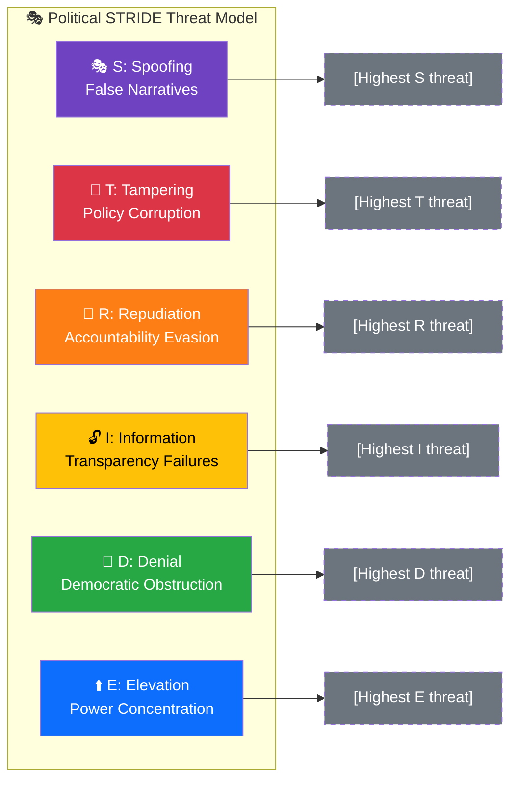
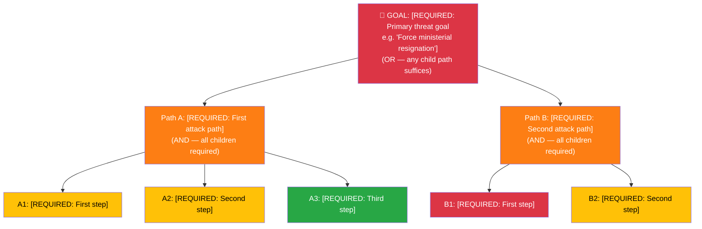

  

<h1 align="center">🎭 Political Threat Analysis Template</h1>

  <strong>📊 Multi-Framework Template for Democratic Process Threat Analysis</strong> 
  <em>🎯 Attack Trees · Kill Chain · Diamond Model · STRIDE Coverage · Actor Profiling</em>

  
  
  
  

**📋 Document Owner:** CEO | **📄 Version:** 2.0 | **📅 Last Updated:** 2026-03-30 (UTC)  
**🏢 Owner:** Hack23 AB (Org.nr 5595347807) | **🏷️ Classification:** Public

> **📌 Template Instructions:** Copy to `analysis/daily/YYYY-MM-DD/{articleType}/`. Save as `threat-analysis.md` in the workflow's own folder (never overwrite another workflow's files). Each threat requires evidence citations and multi-framework analysis. See [methodologies/political-threat-framework.md](../methodologies/political-threat-framework.md).

> **🚨 Anti-Pattern Warning:** STRIDE-only analysis with generic threat descriptions and no attack trees is REJECTED. Every threat analysis MUST include:
> 1. **Threat Analysis Context** (metadata header with ID, date, scope)
> 2. **Attack Tree** for the top threat (Mermaid diagram showing how the threat could succeed)
> 3. **Kill Chain assessment** (what stage has the threat progressed to?)
> 4. **STRIDE coverage check** (all 6 categories assessed)
> 5. **Diamond Model** for the primary threat actor
> 6. **Threat Actor Profile** with ICO (Intent-Capability-Opportunity) assessment
> 7. **Evidence tables** with dok_id citations, severity scores, and confidence labels
> 8. **Forward indicators** — what MCP-detectable signals indicate escalation?
>
> **Good example:** [THREAT_MODEL.md](../../THREAT_MODEL.md) — this is the formatting quality standard.

---

## 📋 Threat Analysis Context

| Field | Value |
|-------|-------|
| **Threat Analysis ID** | `[REQUIRED: THR-YYYY-MM-DD-NNN]` |
| **Analysis Date** | `[REQUIRED: YYYY-MM-DD HH:MM UTC]` |
| **Analysis Period** | `[REQUIRED: e.g. "2026-W13 (2026-03-23 to 2026-03-29)"]` |
| **Produced By** | `[REQUIRED: workflow name]` |
| **Political Context** | `[REQUIRED: 2–3 sentences on current political situation]` |
| **Overall Threat Level** | `[REQUIRED: LOW / MODERATE / HIGH / SEVERE]` |

---

## 🎭 Section 1: STRIDE Coverage Check

> **Severity Scale Reference:** 1=Negligible (routine), 2=Minor (self-correcting), 3=Moderate (intervention needed), 4=Major (formal response required), 5=Severe (constitutional crisis). See [methodologies/political-threat-framework.md §9](../methodologies/political-threat-framework.md) for full calibration table.

### STRIDE Threat Landscape

> **AI Instructions:** Replace placeholder text with actual threats identified. Category nodes are color-coded by STRIDE type; threat instance nodes should be color-coded by severity using the standard palette (🔴 critical → 🟢 low).

### S — Spoofing: False Narratives & Misinformation Threats

*Threats involving actors misrepresenting facts, identities, or political positions to manipulate public discourse or parliamentary outcomes.*

| Threat ID | Threat Description | Threat Actor | Evidence Sources | Severity (1–5) | Mitigation |
|-----------|-------------------|--------------|------------------|:--------------:|------------|
| `S-001` | `[REQUIRED: e.g. "Coordinated disinformation campaign misattributing policy position to coalition party"]` | `[REQUIRED: e.g. "Foreign state actor / domestic opposition / media outlet"]` | `[REQUIRED: dok_id or URL]` | `[#]` | `[REQUIRED: 1 sentence]` |
| `S-002` | `[OPTIONAL]` | `[OPTIONAL]` | `[OPTIONAL]` | `[#]` | `[OPTIONAL]` |

**S-Category Threat Level:** `[LOW / MODERATE / HIGH / SEVERE]`

---

### T — Tampering: Policy Corruption Risks

*Threats involving manipulation of legislative texts, parliamentary records, budget figures, or official statistics to corrupt policy outcomes.*

| Threat ID | Threat Description | Threat Actor | Evidence Sources | Severity (1–5) | Mitigation |
|-----------|-------------------|--------------|------------------|:--------------:|------------|
| `T-001` | `[REQUIRED: e.g. "Undisclosed lobbying altering committee report recommendations"]` | `[REQUIRED: e.g. "Industry lobby / coalition ally ministry"]` | `[REQUIRED: dok_id]` | `[#]` | `[REQUIRED]` |
| `T-002` | `[OPTIONAL]` | `[OPTIONAL]` | `[OPTIONAL]` | `[#]` | `[OPTIONAL]` |

**T-Category Threat Level:** `[LOW / MODERATE / HIGH / SEVERE]`

---

### R — Repudiation: Accountability Evasion

*Threats involving actors denying statements, votes, commitments, or policy positions to evade accountability — especially relevant in Swedish parliamentary context where voting records are public.*

| Threat ID | Threat Description | Threat Actor | Evidence Sources | Severity (1–5) | Mitigation |
|-----------|-------------------|--------------|------------------|:--------------:|------------|
| `R-001` | `[REQUIRED: e.g. "Government minister contradicts Riksdag voting record on climate policy"]` | `[REQUIRED: e.g. "Statsråd / party spokesperson"]` | `[REQUIRED: voterings-id or dok_id]` | `[#]` | `[REQUIRED: e.g. "Publish voting record cross-reference"]` |
| `R-002` | `[OPTIONAL]` | `[OPTIONAL]` | `[OPTIONAL]` | `[#]` | `[OPTIONAL]` |

**R-Category Threat Level:** `[LOW / MODERATE / HIGH / SEVERE]`

---

### I — Information Disclosure: Transparency Failures

*Threats involving suppression, delay, or selective disclosure of politically significant information that citizens have a right to know.*

| Threat ID | Threat Description | Threat Actor | Evidence Sources | Severity (1–5) | Mitigation |
|-----------|-------------------|--------------|------------------|:--------------:|------------|
| `I-001` | `[REQUIRED: e.g. "Classified government inquiry suppresses key findings from SOU report"]` | `[REQUIRED: e.g. "Departement / committee chair"]` | `[REQUIRED: dok_id or reference]` | `[#]` | `[REQUIRED: e.g. "FOI request tracking, MCP monitoring"]` |
| `I-002` | `[OPTIONAL]` | `[OPTIONAL]` | `[OPTIONAL]` | `[#]` | `[OPTIONAL]` |

**I-Category Threat Level:** `[LOW / MODERATE / HIGH / SEVERE]`

---

### D — Denial: Democratic Process Obstruction

*Threats involving obstruction, delay, or blockage of normal democratic processes — votes, committee work, public consultations, or legislative timelines.*

| Threat ID | Threat Description | Threat Actor | Evidence Sources | Severity (1–5) | Mitigation |
|-----------|-------------------|--------------|------------------|:--------------:|------------|
| `D-001` | `[REQUIRED: e.g. "Systematic filibustering of budget committee deliberations to delay vote"]` | `[REQUIRED: e.g. "Opposition bloc / specific party"]` | `[REQUIRED: calendar ref or dok_id]` | `[#]` | `[REQUIRED: e.g. "Track committee session attendance and delay patterns"]` |
| `D-002` | `[OPTIONAL]` | `[OPTIONAL]` | `[OPTIONAL]` | `[#]` | `[OPTIONAL]` |

**D-Category Threat Level:** `[LOW / MODERATE / HIGH / SEVERE]`

---

### E — Elevation of Privilege: Power Concentration

*Threats involving actors accumulating disproportionate political power beyond their constitutional mandate — e.g. bypassing Riksdag oversight, concentrating ministerial authority, or circumventing checks and balances.*

| Threat ID | Threat Description | Threat Actor | Evidence Sources | Severity (1–5) | Mitigation |
|-----------|-------------------|--------------|------------------|:--------------:|------------|
| `E-001` | `[REQUIRED: e.g. "Government uses regulatory decree to bypass Riksdag legislative vote on migration policy"]` | `[REQUIRED: e.g. "Statsminister / Justitiedepartementet"]` | `[REQUIRED: dok_id or proposition ref]` | `[#]` | `[REQUIRED: e.g. "Track Konstitutionsutskottet (KU) granskning proceedings"]` |
| `E-002` | `[OPTIONAL]` | `[OPTIONAL]` | `[OPTIONAL]` | `[#]` | `[OPTIONAL]` |

**E-Category Threat Level:** `[LOW / MODERATE / HIGH / SEVERE]`

---

## 🌳 Section 2: Attack Tree — Primary Threat Decomposition

> **AI Instructions:** Build an attack tree for the single most significant threat identified in Section 1. The root is the threat goal; decompose using AND/OR gates down to leaf-level actions. Color-code by feasibility.

### Attack Path Assessment

| Path | Steps Required | Feasibility (1–5) | Detectability (1–5) | Political Cost | Most Likely? |
|------|:--------------:|:-----------------:|:-------------------:|:--------------:|:------------:|
| Path A | `[#]` | `[1-5]` | `[1-5]` | `[H/M/L]` | `[Y/N]` |
| Path B | `[#]` | `[1-5]` | `[1-5]` | `[H/M/L]` | `[Y/N]` |

**Cheapest attack path:** `[REQUIRED: Which path has highest feasibility and lowest cost?]`

**Early warning indicators:** `[REQUIRED: What MCP-detectable signals precede each path?]`

---

## ⛓️ Section 3: Kill Chain Assessment

> **AI Instructions:** Assess how far the primary threat has progressed along the Political Kill Chain. Mark each stage as Not Started / Active / Complete.

| Kill Chain Stage | Status | Evidence | Disruption Opportunity |
|:----------------:|:------:|---------|----------------------|
| 1️⃣ Reconnaissance | `[Not Started / Active / Complete]` | `[dok_id or reference]` | `[How to stop here]` |
| 2️⃣ Weaponization | `[Not Started / Active / Complete]` | `[dok_id or reference]` | `[How to stop here]` |
| 3️⃣ Delivery | `[Not Started / Active / Complete]` | `[dok_id or reference]` | `[How to stop here]` |
| 4️⃣ Exploitation | `[Not Started / Active / Complete]` | `[dok_id or reference]` | `[How to stop here]` |
| 5️⃣ Installation | `[Not Started / Active / Complete]` | `[dok_id or reference]` | `[How to stop here]` |
| 6️⃣ Command & Control | `[Not Started / Active / Complete]` | `[dok_id or reference]` | `[How to stop here]` |
| 7️⃣ Actions on Objective | `[Not Started / Active / Complete]` | `[dok_id or reference]` | `[Recovery action]` |

**Current kill chain stage:** `[REQUIRED: 1-7]`  
**Next expected stage:** `[REQUIRED: What happens next if unchecked?]`

---

## 💎 Section 4: Diamond Model — Primary Threat Actor

| Diamond Element | Assessment | Evidence |
|----------------|-----------|---------|
| **Adversary** | `[REQUIRED: Who? Name + party + role]` | `[dok_id / reference]` |
| **Capability** | `[REQUIRED: What parliamentary/political tools do they wield?]` | `[Seat count, committee positions, etc.]` |
| **Infrastructure** | `[REQUIRED: Alliances, media channels, institutional access]` | `[Coalition structure, media relationships]` |
| **Victim** | `[REQUIRED: Who/what is targeted?]` | `[Minister, policy, coalition stability]` |

### Threat Actor ICO Profile

| Attribute | Assessment | Confidence |
|-----------|-----------|:----------:|
| **Intent** | `[REQUIRED: What do they want?]` | `[H/M/L]` |
| **Capability** | `[REQUIRED: What can they actually do?]` | `[H/M/L]` |
| **Opportunity** | `[REQUIRED: What upcoming events create windows?]` | `[H/M/L]` |
| **Track Record** | `[REQUIRED: Have they acted on similar threats before?]` | `[H/M/L]` |
| **Constraints** | `[REQUIRED: What limits their action?]` | `[H/M/L]` |
| **Overall ICO Level** | `[REQUIRED: HIGH / MEDIUM / LOW]` | `[H/M/L]` |

---

> Use this matrix to summarize, for each STRIDE category, the single highest-severity threat and its assessed severity score (1–5).

| STRIDE Category | Highest Threat | Severity | Threat Level |
|----------------|---------------|:--------:|--------------|
| S — Spoofing | `[highest S threat ID]` | `[#]` | `[LOW/MOD/HIGH/SEVERE]` |
| T — Tampering | `[highest T threat ID]` | `[#]` | `[LOW/MOD/HIGH/SEVERE]` |
| R — Repudiation | `[highest R threat ID]` | `[#]` | `[LOW/MOD/HIGH/SEVERE]` |
| I — Disclosure | `[highest I threat ID]` | `[#]` | `[LOW/MOD/HIGH/SEVERE]` |
| D — Denial | `[highest D threat ID]` | `[#]` | `[LOW/MOD/HIGH/SEVERE]` |
| E — Elevation | `[highest E threat ID]` | `[#]` | `[LOW/MOD/HIGH/SEVERE]` |

---

## 🎯 Threat Actor Mapping

| Actor Type | Specific Actor | Primary Threat Category | Intent | Capability |
|------------|---------------|------------------------|--------|------------|
| Government | `[e.g. Statsminister]` | `[S/T/R/I/D/E]` | `[known/suspected/unknown]` | `[HIGH/MED/LOW]` |
| Opposition | `[e.g. S party leadership]` | `[S/T/R/I/D/E]` | `[known/suspected/unknown]` | `[HIGH/MED/LOW]` |
| Media | `[e.g. specific outlet]` | `[S/T/R/I/D/E]` | `[known/suspected/unknown]` | `[HIGH/MED/LOW]` |
| External | `[e.g. EU Commission]` | `[S/T/R/I/D/E]` | `[known/suspected/unknown]` | `[HIGH/MED/LOW]` |

---

## 🛡️ Priority Mitigations

1. **[Threat ID]:** `[Mitigation action — who does what by when]`
2. **[Threat ID]:** `[Mitigation action]`
3. **[Threat ID]:** `[Mitigation action]`

**Overall Threat Level:** `[REQUIRED: LOW / MODERATE / HIGH / SEVERE]`  
**Assessment Confidence:** `[REQUIRED: HIGH / MEDIUM / LOW]`

---

## ⚡ Escalation Decision

| Condition | Escalate? | Action |
|-----------|:---------:|--------|
| Any STRIDE category severity ≥ 5 | **YES** | Immediate breaking analysis; all-language deployment |
| ≥ 2 STRIDE categories severity ≥ 4 | **YES** | Priority analysis; article within 2 hours |
| Overall threat level = SEVERE | **YES** | Editor notification + all-language deployment |
| Overall threat level = HIGH | **MONITOR** | Flag in daily synthesis; include in evening analysis |
| Overall threat level ≤ MODERATE | **NO** | Include in regular daily/weekly reporting |

---

**Document Control:**  
- **Template Path:** `/analysis/templates/threat-analysis.md`  
- **Framework Reference:** [THREAT_MODEL.md](../../THREAT_MODEL.md), [methodologies/political-threat-framework.md](../methodologies/political-threat-framework.md)  
- **Version:** 2.0  
- **Frameworks:** Attack Trees, Kill Chain, Diamond Model, STRIDE, Threat Actor Profiling  
- **Classification:** Public  
- **Next Review:** 2026-06-30
