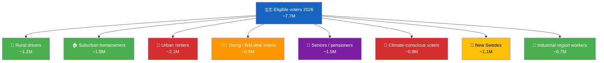
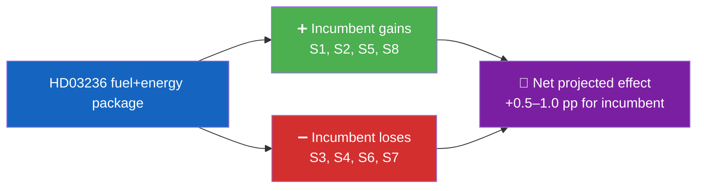

<p align="center">
  
</p>

<h1 align="center">🫂 Voter Segmentation Template</h1>

<p align="center">
  <strong>📊 Evidence-Based Voter-Segment Impact Analysis</strong><br>
  <em>🎯 Size · Direction · Magnitude · Volatility · Campaign-Leverage</em>
</p>

<p align="center">
  <a href="#"></a>
  <a href="#"></a>
  <a href="#"></a>
  <a href="#"></a>
</p>

**📋 Document Owner:** CEO | **📄 Version:** 1.2 | **📅 Last Updated:** 2026-04-25 (UTC)
**🏢 Owner:** Hack23 AB (Org.nr 5595347807) | **🏷️ Classification:** Public

> **📌 Template instructions:** Produce on every run. Save as `analysis/daily/${ARTICLE_DATE}/${DOC_TYPE}/voter-segmentation.md`. When the measure has a visible electoral effect (fiscal, welfare, migration, justice, climate), provide a full electoral-impact segmentation. On procedural or light-news days, still produce this file with baseline SCB-grounded segment coverage and note that segment movement effects are limited, unclear, or low-confidence. Segment definitions align with standard SCB demographic clusters plus political-behaviour clusters.

> **✨ What to produce:** A rigorous, SCB-grounded segmentation with population size, directional impact, confidence, volatility (turnout / swing), and the campaign narrative most likely to land. Every segment row includes at least one SCB or demographic source citation.

---

<!-- TEMPLATE_CONTRACT_V1 -->
> **📐 Template Contract** — every fill of this template MUST satisfy this row.
>
> | Slot | Value |
> |------|-------|
> | **Owning methodology** | [`per-artifact-methodologies.md`](../methodologies/per-artifact-methodologies.md#voter-segmentation) |
> | **Owning gate check** | Check 8 (Family D — SCB segment cuts) — see [`05-analysis-gate.md`](../../.github/prompts/05-analysis-gate.md) |
> | **Required inputs** | SCB demographics, polling crosstabs |
> | **Horizon band** | per-run (per [`scripts/horizon-context.ts`](../../scripts/horizon-context.ts)) |
> | **Output family** | Family D — Electoral & Domain |
> | **Aggregation order** | 17 of 30 in canonical order (see [`scripts/render-lib/aggregator/order.ts`](../../scripts/render-lib/aggregator/order.ts)) |
> | **Reader Intelligence Guide** | row generated from `voter-segmentation.md` (see [`scripts/render-lib/aggregator/reader-guide.ts`](../../scripts/render-lib/aggregator/reader-guide.ts)) |
> | **Canonical evidence anchor** | `\| claim \| evidence (dok_id / vote / MP intressent_id / primary-source URL) \| retrieved_at \| confidence \|` — every analytical claim row uses this schema. |
>
> Cross-reference: [`README.md §Template ↔ Methodology ↔ Gate-Check Matrix`](README.md#-template--methodology--gate-check-matrix).

<!--
AI-FIRST Pass-1 / Pass-2 self-check (HTML comment — invisible in rendered articles; not stripped by aggregator unless under a "## Pass 2 …" heading).

PASS 1 (creation, minimal viable artifact):
  • Fill every REQUIRED slot above; cite ≥ 1 dok_id / vote / MP / primary-source URL per major claim.
  • Use the canonical evidence anchor schema for every analytical claim row.
  • Mermaid blocks use the cyberpunk %%{init: theme/themeVariables}%% prologue and at least one `style …` or `classDef …` directive (Check 5 of 05-analysis-gate.md).

PASS 2 (read-back & improve — AI-FIRST mandatory, ≥ 180 s after Pass 1):
  • Re-read the file end-to-end; for each section verify (a) ≥ 1 evidence anchor row, (b) WEP language tightened (no "may/might/could" hedges), (c) named actors with intressent_id where applicable, (d) Mermaid colour theming present.
  • Banned-phrase scan: "intelligence theatre", "sources say", "reportedly", "it is widely believed", "experts agree", "AI_MUST_REPLACE".
  • Citation density target: ≥ 1 evidence anchor row per 100 words of analytical prose.
  • Neutrality arithmetic: equal analytical depth across the 8 Riksdag parties (S, M, SD, V, MP, C, L, KD); flag and correct any bias in the Pass-2 Self-Audit section.

ANTI-TEMPLATE — DO NOT:
  • Ship plain prose without evidence anchor tables.
  • Leave AI_MUST_REPLACE / [REQUIRED: …] placeholders in the rendered output.
  • Cite a non-primary URL when a `dok_id` or vote record is available.
  • Treat co-occurrence of keywords as coordination; uni-directional chains as bi-directional.
  • Use a Mermaid block without colour theming (Check 5 will block aggregation).
  • Skip the Pass-2 read-back (Check 6 verifies mtime ≥ birth + 180 s OR a differing pass1/ snapshot).
-->

## 🔄 Tradecraft Context

| Element | Value |
|---------|-------|
| **F3EAD Stage** | **ANALYZE** — electoral impact assessment |
| **PIRs Served** | **PIR-6** (Election Integrity — segment-level turnout dynamics) |
| **Admiralty Floor** | SCB demographic data requires **[A1]**; inferred segment impact requires **[B2]** with methodology |
| **WEP + ODNI** | Voter-segment impact claims use **WEP** (likely to mobilize / unlikely to shift); confidence **MODERATE** (SCB data solid, policy→behaviour inference uncertain) |
| **Source Diversity Floor** | P1 (segment-mobilization claims): ≥3 sources (SCB demographics + polling crosstabs + policy analysis); avoid single-poll segment claims |
| **SAT(s) Applied** | Outside-In Thinking (start from voter perspective), Morphological Analysis (segment × policy combinations) |
| **ICD 203 Standards** | 1 (source quality — SCB data), 2 (uncertainties — polling MoE), 9 (visual information — segment map) |

---

## 📋 Segmentation Context

> ⚠️ **Illustrative example below — replace every value with run-specific data before publishing.** The numbers, taxonomy version, universe size, and confidence are drawn from a worked example and are *not* authoritative facts.

| Field | Value |
|-------|-------|
| **Segmentation ID** | `VSG-YYYY-MM-DD-NNN` |
| **Generated** | `YYYY-MM-DD HH:MM UTC` |
| **Measure(s) under analysis** | `dok_ids` |
| **Segmentation taxonomy** | `SCB-Demographic v2 + Political-Behaviour v1` *(example)* |
| **Universe (eligible voters 2026)** | `~7.7 M` *(example; verify against latest SCB)* |
| **Overall Confidence** | `🟧 MODERATE (default; adjust to 🟩/🟦 only with evidence)` |

---

## 🗺️ Segmentation Overview



---

## 🗂️ Segment Impact Matrix

| # | Segment | Size | Direction | Magnitude (1–5) | Volatility | Current bloc lean | Source |
|:-:|---------|:----:|:---------:|:---------------:|:----------:|:----------------:|--------|
| S1 | Rural drivers (non-metro + private car primary) | 1.2 M | ➕ incumbent | 4 | Medium | Mixed | SCB Befolkning 2025; Transportstyrelsen vehicle register |
| S2 | Suburban homeowners with heating costs | 1.8 M | ➕ incumbent | 3 | Low | M/KD lean | SCB Boende 2025 |
| S3 | Urban renters | 2.1 M | ➖ opposition | 2 | High | S/V lean | SCB Boende 2025 |
| S4 | Young / first-time voters | 0.9 M | ➖ opposition | 3 | High | MP/V lean | SCB Åldersstatistik 2025 |
| S5 | Seniors / pensioners | 1.5 M | ➕ incumbent (energy rebate) | 3 | Low | Mixed | SCB Åldersstatistik 2025 |
| S6 | Climate-conscious voters | 0.9 M | ➖ opposition | 4 | Medium | MP/V/C lean | SCB Befolkning 2025; Cross-poll Naturvårdsverket |
| S7 | New Swedes (citizens by naturalisation) | 1.1 M | ➖ opposition (justice-package signal) | 3 | High | S/MP lean | SCB Befolkning 2025 |
| S8 | Industrial-region workers | 0.7 M | ➕ incumbent (wind-law compensation) | 2 | Medium | SD/M lean | Arbetsförmedlingen 2025 |

---

## 🔎 Segment Deep-Dive — S1 Rural Drivers (illustrative; repeat per segment)

| Attribute | Value |
|-----------|-------|
| **Definition** | Households in sparsely populated zones (H + glesbygd per SCB) where private car is the primary commute mode |
| **Size** | ~1.2 M eligible voters |
| **Geography** | Norrland inland, inner Småland, south-east Östergötland, rural Skåne |
| **Voting behaviour 2022** | 36 % M/KD/L, 24 % S, 25 % SD, balance across others |
| **Policy effect of HD03236** | SEK ~3 500/year pump-price saving per driver |
| **Signal strength** | 🟩 HIGH — visible at petrol station within 8 weeks |
| **Campaign narrative that lands** | "Your government delivered affordable driving" |
| **Counter-narrative (opposition)** | "Regressive cut; urban renters pay via missed climate investment" |
| **Volatility** | Medium — segment shifted to SD 2018, returned partially 2022 |
| **Turnout likelihood** | 81 % (below national 2022 average 84 %) |

---

## 🏗️ Cross-Segment Trade-Offs



| Trade-off axis | Incumbent wins | Incumbent loses | Net |
|----------------|---------------|----------------|:---:|
| Rural vs Urban | 🚗 1.2 M | 🏢 2.1 M | −0.9 M by raw headcount, but intensity skews pro-incumbent |
| Homeowner vs Renter | 🏠 1.8 M | 🏢 2.1 M | −0.3 M |
| Climate vs Affordability | 🛢️ 1.2 + 1.8 M | 🌱 0.9 M | +2.1 M in favour of affordability |

---

## 🎯 Campaign-Leverage Matrix

| Segment | Best messaging channel | Best messenger | Risk of backfire |
|---------|-----------------------|----------------|:---------------:|
| S1 Rural drivers | Community radio, regional press | Local M MP | 🟢 Low |
| S2 Suburban homeowners | Direct mail, Facebook | KD spokesperson | 🟢 Low |
| S3 Urban renters | Instagram, TV debate | V / S housing spokesperson | 🟠 Medium |
| S4 Young voters | TikTok, Twitch, YouTube Shorts | Young MP cohort | 🟠 Medium |
| S5 Seniors | Local newspaper, Svenskt Näringsliv | KD leader | 🟢 Low |
| S6 Climate-conscious | Podcasts, op-eds | MP / C leaders | 🟠 Medium |
| S7 New Swedes | Multilingual press, community networks | S spokespersons | 🟠 Medium |
| S8 Industrial workers | Union channels, local TV | SD / M industry spokes | 🟢 Low |

---

## 🧮 Quantified Net-Effect Model

**Assumptions:** SIFO baseline government-bloc support 47 %; opposition-bloc 51 %; undecided 2 %.

| Effect | Expected shift | Reasoning |
|--------|:-------------:|-----------|
| S1 turnout boost + 3 % retention | +0.3 pp | Fuel-saving visibility |
| S2 retention + 1 % swing | +0.2 pp | Energy rebate |
| S3 defection to S/V | −0.2 pp | Exclusion from measure |
| S6 defection to MP/C | −0.3 pp | Climate-coherence signal |
| **Net projected shift** | **+0.0 pp to +0.5 pp** | Small net positive; high dispersion |

---

## 📎 Sources

| Source | Use |
|--------|-----|
| `scb` MCP — Befolkning, Åldersstatistik, Boende | Segment sizing |
| SIFO / Novus / Demoskop monthly poll | Directional signals |
| Valmyndigheten 2022 result | Baseline voting behaviour |
| **IMF** (WEO + FM + IFS) | Macro context (GDP, inflation, unemployment, fiscal balance, debt) |
| World Bank (WGI governance, environment, social participation) | Socio-economic context for governance, environmental, and social/participation controls |

---

**Document Control**
- **Template path:** `/analysis/templates/voter-segmentation.md`
- **Referenced by:** [ai-driven-analysis-guide.md § Step 5](../methodologies/ai-driven-analysis-guide.md#step-5--extensions-f3ead-analyze-continued)
- **Classification:** Public
- **Next Review:** 2026-07-21

---

## ✅ Pass-2 Self-Audit Checklist (v4.4 — required)

> **Purpose:** AI-FIRST principle requires a Pass-2 read-back-and-improve. After producing this artifact in Pass 1, re-read it end-to-end and verify each item below. Document any remediation in [`methodology-reflection.md`](methodology-reflection.md) §"Pass-2 audit log". Any unchecked ❌ box at the end of Pass 2 forces a Pass-3 rewrite of the affected section.

- [ ] **Tradecraft anchors honoured** — F3EAD stage matches the artifact's role; PIRs declared in the §Tradecraft Context block are actually addressed in the body; Admiralty grades attached to every external source; WEP band + ODNI confidence on every probabilistic judgement.
- [ ] **Source diversity floor met** — at least the minimum number of independent MCP sources required by the artifact's tradecraft block are cited; single-source claims are explicitly labelled `[SINGLE-SOURCE — corroboration pending]`.
- [ ] **Evidence specificity** — every quantified claim cites a `dok_id` (Riksdag), an SCB / IMF dataflow code, or a named external source with date; no "according to data" / "studies show" hand-waves.
- [ ] **Named-actor discipline** — every political claim names ≥ 1 person (party + role + dated act/quote) or labels the absence (`[diffuse — no named actor]`).
- [ ] **Counter-narrative present** — at least one explicit competing hypothesis, dissent quote, or framed objection appears in the body; "no opposition recorded" is itself a finding to label, not silence.
- [ ] **Election 2026 lens applied** — the §"Election 2026 Implications" subsection (or equivalent) addresses electoral salience, coalition pressure, and forward indicators; not boilerplate.
- [ ] **No illustrative content shipped as fact** — every `[REQUIRED]` placeholder is filled OR removed; every `Example:` block is clearly fenced or removed; no fabricated `dok_id`, vote count, or quote leaks into the final artifact.
- [ ] **Cross-references resolve** — every `[link](file.md)` in this artifact points to a file that exists in the run folder (`analysis/daily/$ARTICLE_DATE/$SUBFOLDER/`) or to a methodology / template under `analysis/`.
- [ ] **Mermaid renders** — every fenced ` ```mermaid ` block parses (no missing class definitions, no orphan nodes, no >40-node graphs that overflow viewport on mobile).
- [ ] **Line-floor check** — artifact length ≥ the per-artifact floor in [`reference-quality-thresholds.json`](../methodologies/reference-quality-thresholds.json); shorter artifacts trigger Pass-2 rewrite, never a `[truncated]` note.

